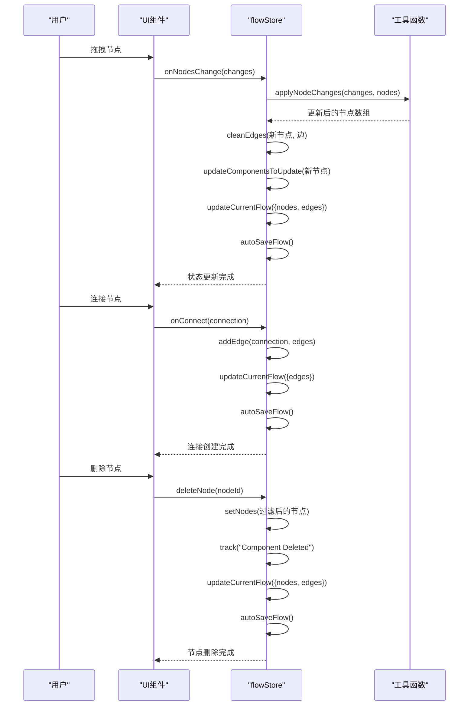
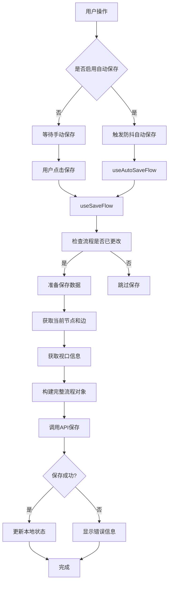
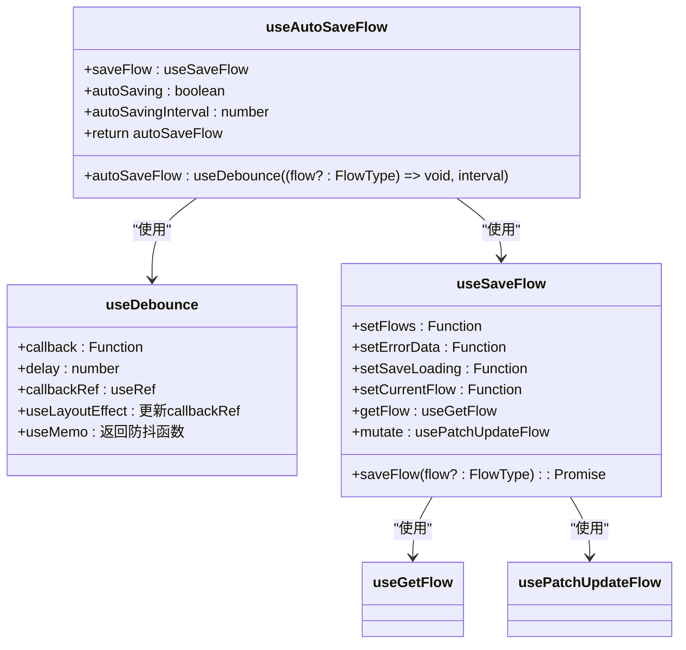
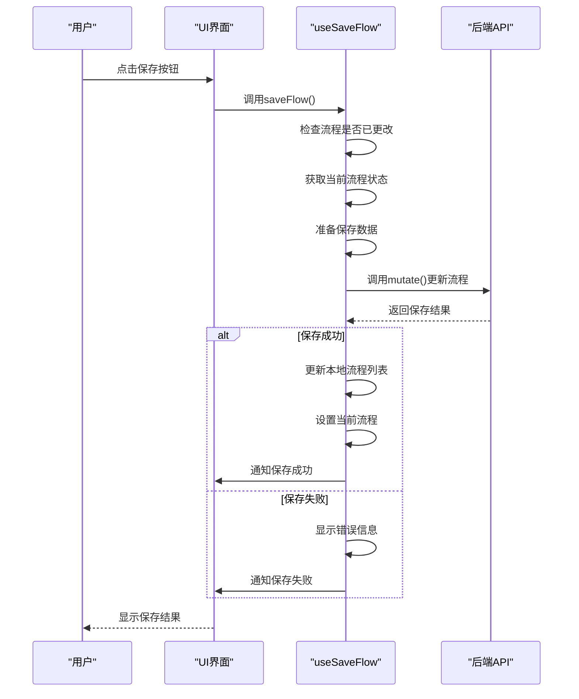
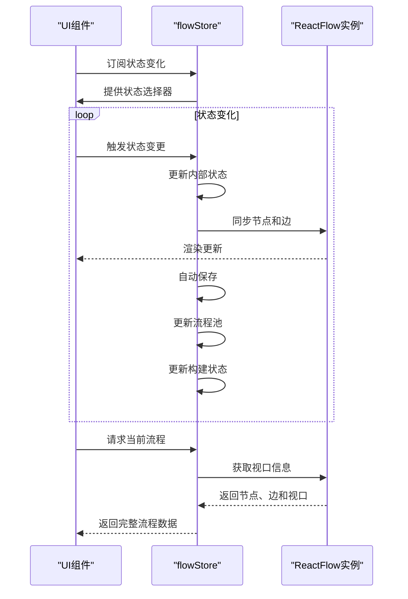
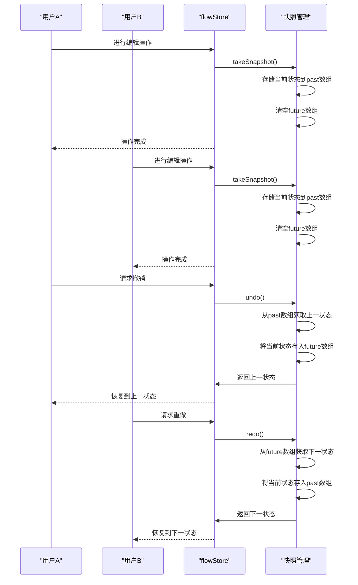
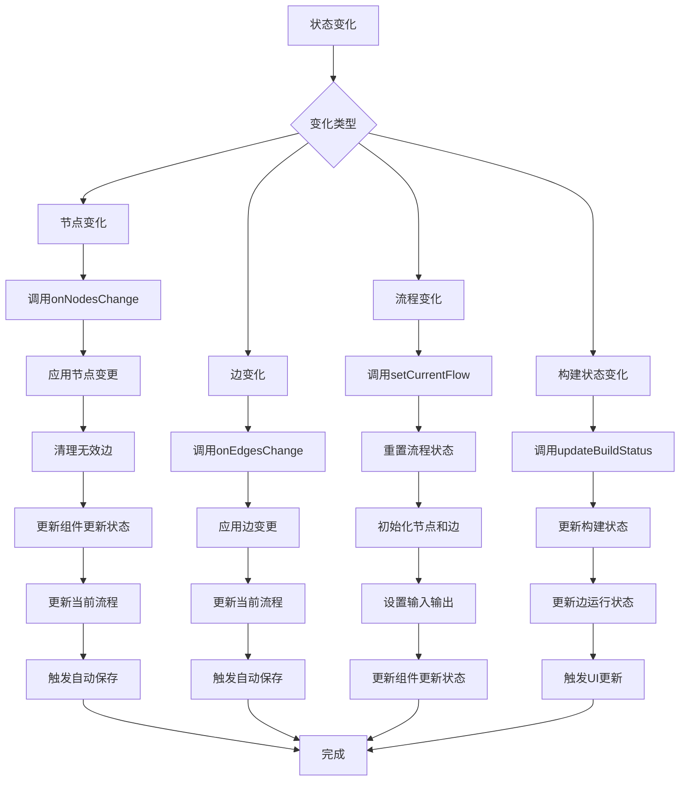

# 工作流状态管理

<cite>
**本文档引用的文件**   
- [flowStore.ts](file://vibe_surf/frontend/src/stores/flowStore.ts)
- [flowsManagerStore.ts](file://vibe_surf/frontend/src/stores/flowsManagerStore.ts)
- [use-autosave-flow.ts](file://vibe_surf/frontend/src/hooks/flows/use-autosave-flow.ts)
- [use-save-flow.ts](file://vibe_surf/frontend/src/hooks/flows/use-save-flow.ts)
- [reactflowUtils.ts](file://vibe_surf/frontend/src/utils/reactflowUtils.ts)
- [constants.ts](file://vibe_surf/frontend/src/constants/constants.ts)
- [flow/index.ts](file://vibe_surf/frontend/src/types/zustand/flow/index.ts)
</cite>

## 目录
1. [简介](#简介)
2. [状态模型设计](#状态模型设计)
3. [状态变更处理流程](#状态变更处理流程)
4. [自动保存与手动保存机制](#自动保存与手动保存机制)
5. [状态同步实现](#状态同步实现)
6. [并发编辑处理](#并发编辑处理)

## 简介
VibeSurf中的工作流状态管理主要通过Zustand状态管理库实现，核心文件为`flowStore.ts`。该系统负责管理工作流的节点、连接、元数据等核心数据结构，并处理从用户交互到持久化存储的完整状态变更流程。系统实现了自动保存和手动保存机制，包含防抖处理和版本控制功能，确保UI与数据模型的一致性。

**Section sources**
- [flowStore.ts](file://vibe_surf/frontend/src/stores/flowStore.ts#L1-L1101)

## 状态模型设计
工作流状态模型的核心数据结构包括节点、连接和元数据，这些数据通过Zustand store进行集中管理。

### 节点与连接数据结构
状态模型中的节点和连接数据结构定义了工作流的基本组成元素：

```mermaid
classDiagram
class FlowStoreType {
+nodes : AllNodeType[]
+edges : EdgeType[]
+currentFlow : FlowType | undefined
+flowPool : FlowPoolType
+flowBuildStatus : { [key : string] : { status : BuildStatus; timestamp? : string; } }
+componentsToUpdate : ComponentsToUpdateType[]
+positionDictionary : { [key : number] : number }
+inputs : Array<{ type : string; id : string; displayName : string }>
+outputs : Array<{ type : string; id : string; displayName : string }>
+hasIO : boolean
+isBuilding : boolean
+isPending : boolean
+reactFlowInstance : ReactFlowInstance<AllNodeType, EdgeType> | null
+lastCopiedSelection : { nodes : any; edges : any } | null
+verticesBuild : { verticesIds : string[]; verticesLayers : VertexLayerElementType[][]; runId? : string; verticesToRun : string[] } | null
+buildInfo : { error? : string[]; success? : boolean } | null
+pastBuildFlowParams : { startNodeId? : string; stopNodeId? : string; input_value? : string; files? : string[]; silent? : boolean; session? : string; stream? : boolean; eventDelivery? : EventDeliveryType; } | null
}
class AllNodeType {
+id : string
+type : "genericNode" | "noteNode"
+position : { x : number; y : number }
+data : NodeDataType
+selected : boolean
}
class EdgeType {
+id : string
+source : string
+target : string
+sourceHandle : string
+targetHandle : string
+data : { sourceHandle : sourceHandleType; targetHandle : targetHandleType; }
+selected : boolean
+animated : boolean
+className : string
}
class FlowType {
+id : string
+name : string
+data : ReactFlowJsonObject<AllNodeType, EdgeType>
+description : string
+folder_id : string
+endpoint_name : string
+locked : boolean
}
class FlowPoolType {
+[key : string] : Array<VertexBuildTypeAPI>
}
class ComponentsToUpdateType {
+id : string
+icon? : string
+display_name : string
+outdated : boolean
+breakingChange : boolean
+userEdited : boolean
}
FlowStoreType --> AllNodeType : "包含"
FlowStoreType --> EdgeType : "包含"
FlowStoreType --> FlowType : "引用"
FlowStoreType --> FlowPoolType : "包含"
FlowStoreType --> ComponentsToUpdateType : "包含"
```

**Diagram sources **
- [flowStore.ts](file://vibe_surf/frontend/src/stores/flowStore.ts#L64-L296)
- [flow/index.ts](file://vibe_surf/frontend/src/types/zustand/flow/index.ts#L1-L297)

### 元数据管理
系统通过多种机制管理工作流的元数据，包括构建状态、输入输出配置和组件更新信息：

```mermaid
classDiagram
class FlowBuildStatus {
+[key : string] : { status : BuildStatus; timestamp? : string; }
}
class BuildStatus {
+BUILT : "built"
+BUILDING : "building"
+ERROR : "error"
+INACTIVE : "inactive"
+TO_BUILD : "to_build"
}
class InputsOutputs {
+inputs : Array<{ type : string; id : string; displayName : string }>
+outputs : Array<{ type : string; id : string; displayName : string }>
+hasIO : boolean
}
class ComponentsUpdate {
+componentsToUpdate : ComponentsToUpdateType[]
+updateComponentsToUpdate(nodes : AllNodeType[]) : void
+setComponentsToUpdate(update : ComponentsToUpdateType[] | ((oldState : ComponentsToUpdateType[]) => ComponentsToUpdateType[])) : void
}
FlowBuildStatus --> BuildStatus : "使用"
FlowStoreType --> FlowBuildStatus : "包含"
FlowStoreType --> InputsOutputs : "包含"
FlowStoreType --> ComponentsUpdate : "包含"
```

**Diagram sources **
- [flowStore.ts](file://vibe_surf/frontend/src/stores/flowStore.ts#L113-L145)
- [flow/index.ts](file://vibe_surf/frontend/src/types/zustand/flow/index.ts#L215-L220)

**Section sources**
- [flowStore.ts](file://vibe_surf/frontend/src/stores/flowStore.ts#L1-L1101)
- [flow/index.ts](file://vibe_surf/frontend/src/types/zustand/flow/index.ts#L1-L297)

## 状态变更处理流程
工作流状态的变更处理流程从用户交互开始，经过状态更新，最终实现持久化存储。

### 用户交互到状态更新
当用户与工作流进行交互时，系统通过一系列方法处理状态变更：



**Diagram sources **
- [flowStore.ts](file://vibe_surf/frontend/src/stores/flowStore.ts#L266-L392)
- [reactflowUtils.ts](file://vibe_surf/frontend/src/utils/reactflowUtils.ts#L77-L177)

### 状态持久化流程
状态变更最终通过保存机制实现持久化存储：



**Diagram sources **
- [use-autosave-flow.ts](file://vibe_surf/frontend/src/hooks/flows/use-autosave-flow.ts#L6-L22)
- [use-save-flow.ts](file://vibe_surf/frontend/src/hooks/flows/use-save-flow.ts#L19-L135)
- [flowStore.ts](file://vibe_surf/frontend/src/stores/flowStore.ts#L291-L304)

**Section sources**
- [flowStore.ts](file://vibe_surf/frontend/src/stores/flowStore.ts#L266-L392)
- [use-autosave-flow.ts](file://vibe_surf/frontend/src/hooks/flows/use-autosave-flow.ts#L6-L22)
- [use-save-flow.ts](file://vibe_surf/frontend/src/hooks/flows/use-save-flow.ts#L19-L135)
- [reactflowUtils.ts](file://vibe_surf/frontend/src/utils/reactflowUtils.ts#L77-L177)

## 自动保存与手动保存机制
系统实现了自动保存和手动保存两种机制，确保工作流数据的安全性和一致性。

### 自动保存实现
自动保存机制通过防抖技术实现，避免频繁的保存操作：



**Diagram sources **
- [use-autosave-flow.ts](file://vibe_surf/frontend/src/hooks/flows/use-autosave-flow.ts#L6-L22)
- [use-debounce.ts](file://vibe_surf/frontend/src/hooks/use-debounce.ts#L1-L14)
- [use-save-flow.ts](file://vibe_surf/frontend/src/hooks/flows/use-save-flow.ts#L10-L135)

### 手动保存实现
手动保存机制提供了更精确的控制，允许用户在特定时刻保存工作流：



**Diagram sources **
- [use-save-flow.ts](file://vibe_surf/frontend/src/hooks/flows/use-save-flow.ts#L19-L135)
- [flowsManagerStore.ts](file://vibe_surf/frontend/src/stores/flowsManagerStore.ts#L48-L52)

### 版本控制与防抖处理
系统通过版本控制和防抖处理确保数据的一致性和性能：

```mermaid
classDiagram
class flowsManagerStore {
+autoSaving : boolean
+setAutoSaving(autoSaving : boolean)
+autoSavingInterval : number
+setAutoSavingInterval(interval : number)
+SAVE_DEBOUNCE_TIME : 1000
+takeSnapshot() : void
+undo() : void
+redo() : void
+past : { [flowId : string] : StateSnapshot[] }
+future : { [flowId : string] : StateSnapshot[] }
}
class StateSnapshot {
+nodes : AllNodeType[]
+edges : EdgeType[]
}
class useDebounce {
+callback : Function
+delay : number
+debounceTimer : NodeJS.Timeout
+return function(...args) : void
}
flowsManagerStore --> StateSnapshot : "包含"
useDebounce --> flowsManagerStore : "使用interval"
flowsManagerStore --> useDebounce : "配置"
```

**Diagram sources **
- [flowsManagerStore.ts](file://vibe_surf/frontend/src/stores/flowsManagerStore.ts#L27-L86)
- [constants.ts](file://vibe_surf/frontend/src/constants/constants.ts#L3)
- [use-debounce.ts](file://vibe_surf/frontend/src/hooks/use-debounce.ts#L1-L14)

**Section sources**
- [use-autosave-flow.ts](file://vibe_surf/frontend/src/hooks/flows/use-autosave-flow.ts#L6-L22)
- [use-save-flow.ts](file://vibe_surf/frontend/src/hooks/flows/use-save-flow.ts#L19-L135)
- [flowsManagerStore.ts](file://vibe_surf/frontend/src/stores/flowsManagerStore.ts#L27-L86)
- [use-debounce.ts](file://vibe_surf/frontend/src/hooks/use-debounce.ts#L1-L14)
- [constants.ts](file://vibe_surf/frontend/src/constants/constants.ts#L3)

## 状态同步实现
系统通过多种机制确保UI与数据模型之间的一致性。

### UI与数据模型同步
状态同步机制确保用户界面与底层数据模型保持一致：



**Diagram sources **
- [flowStore.ts](file://vibe_surf/frontend/src/stores/flowStore.ts#L266-L392)
- [flowStore.ts](file://vibe_surf/frontend/src/stores/flowStore.ts#L905-L910)

### 流程池与构建状态管理
系统通过流程池和构建状态管理执行结果和构建信息：

```mermaid
classDiagram
class FlowPoolManagement {
+flowPool : FlowPoolType
+addDataToFlowPool(data : VertexBuildTypeAPI, nodeId : string) : void
+updateFlowPool(nodeId : string, data : VertexBuildTypeAPI | ChatOutputType | ChatInputType, buildId? : string) : void
+CleanFlowPool() : void
+setFlowPool(flowPool : FlowPoolType) : void
}
class BuildStatusManagement {
+flowBuildStatus : { [key : string] : { status : BuildStatus; timestamp? : string; } }
+updateBuildStatus(nodeIdList : string[], status : BuildStatus) : void
+revertBuiltStatusFromBuilding() : void
+updateEdgesRunningByNodes(ids : string[], running : boolean) : void
+clearEdgesRunningByNodes() : Promise<void>
}
class VertexBuildTypeAPI {
+id : string
+valid : boolean
+message : string
+logs : any
+artifacts : any
+results : any
+inactivated_vertices : string[]
+next_vertices_ids : string[]
+top_level_vertices : string[]
+run_id : string
}
FlowPoolManagement --> VertexBuildTypeAPI : "使用"
BuildStatusManagement --> BuildStatus : "使用"
FlowStoreType --> FlowPoolManagement : "包含"
FlowStoreType --> BuildStatusManagement : "包含"
```

**Diagram sources **
- [flowStore.ts](file://vibe_surf/frontend/src/stores/flowStore.ts#L168-L205)
- [flowStore.ts](file://vibe_surf/frontend/src/stores/flowStore.ts#L978-L999)
- [flowStore.ts](file://vibe_surf/frontend/src/stores/flowStore.ts#L912-L928)

**Section sources**
- [flowStore.ts](file://vibe_surf/frontend/src/stores/flowStore.ts#L168-L205)
- [flowStore.ts](file://vibe_surf/frontend/src/stores/flowStore.ts#L905-L928)
- [flowStore.ts](file://vibe_surf/frontend/src/stores/flowStore.ts#L978-L999)

## 并发编辑处理
系统通过状态管理和版本控制机制处理并发编辑场景。

### 并发编辑场景处理
系统通过快照机制和撤销/重做功能处理并发编辑：



**Diagram sources **
- [flowsManagerStore.ts](file://vibe_surf/frontend/src/stores/flowsManagerStore.ts#L59-L123)

### 状态监听与响应
系统提供机制监听状态变化并做出相应处理：



**Diagram sources **
- [flowStore.ts](file://vibe_surf/frontend/src/stores/flowStore.ts#L266-L392)
- [flowStore.ts](file://vibe_surf/frontend/src/stores/flowStore.ts#L1001-L1019)
- [flowStore.ts](file://vibe_surf/frontend/src/stores/flowStore.ts#L978-L999)

**Section sources**
- [flowsManagerStore.ts](file://vibe_surf/frontend/src/stores/flowsManagerStore.ts#L59-L123)
- [flowStore.ts](file://vibe_surf/frontend/src/stores/flowStore.ts#L266-L392)
- [flowStore.ts](file://vibe_surf/frontend/src/stores/flowStore.ts#L1001-L1019)
- [flowStore.ts](file://vibe_surf/frontend/src/stores/flowStore.ts#L978-L999)