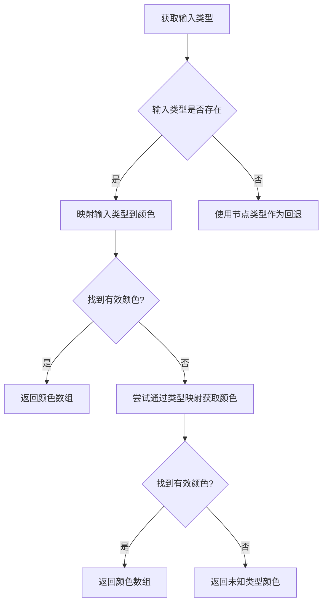
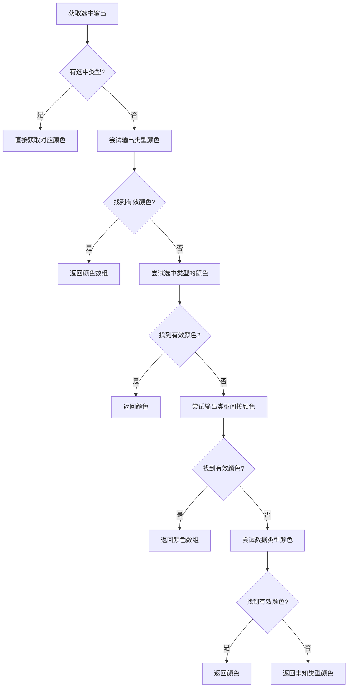
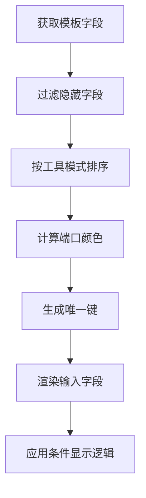
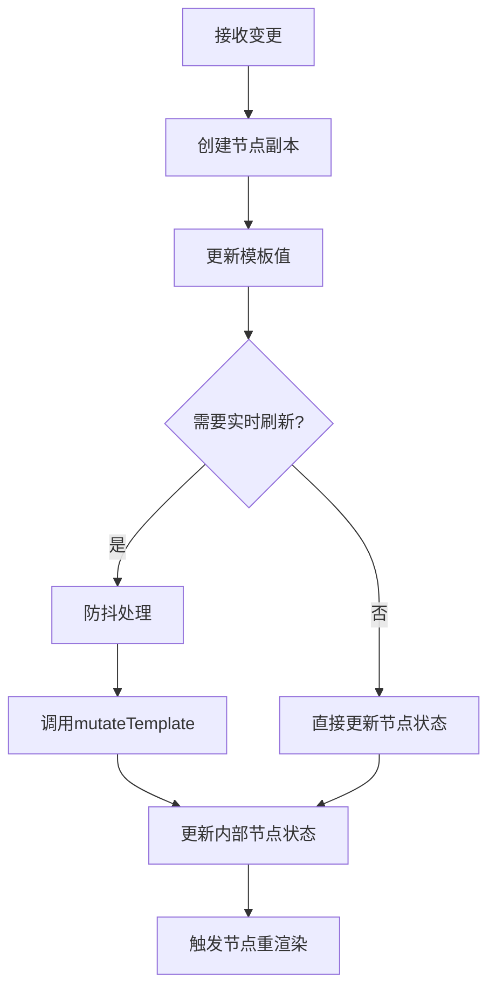
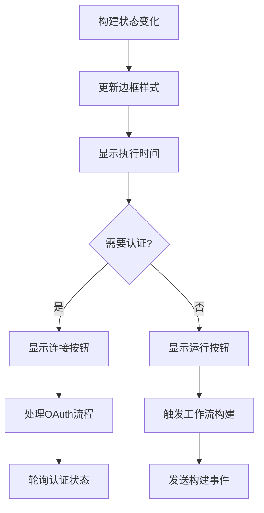

# 工作流节点系统

<cite>
**本文档引用的文件**   
- [GenericNode/index.tsx](file://vibe_surf/frontend/src/CustomNodes/GenericNode/index.tsx)
- [MediaPlayerNode/index.tsx](file://vibe_surf/frontend/src/CustomNodes/MediaPlayerNode/index.tsx)
- [NoteNode/index.tsx](file://vibe_surf/frontend/src/CustomNodes/NoteNode/index.tsx)
- [get-node-input-colors.ts](file://vibe_surf/frontend/src/CustomNodes/helpers/get-node-input-colors.ts)
- [get-node-output-colors.ts](file://vibe_surf/frontend/src/CustomNodes/helpers/get-node-output-colors.ts)
- [RenderInputParameters/index.tsx](file://vibe_surf/frontend/src/CustomNodes/GenericNode/components/RenderInputParameters/index.tsx)
- [NodeInputField/index.tsx](file://vibe_surf/frontend/src/CustomNodes/GenericNode/components/NodeInputField/index.tsx)
- [NodeStatus/index.tsx](file://vibe_surf/frontend/src/CustomNodes/GenericNode/components/NodeStatus/index.tsx)
- [use-handle-new-value.ts](file://vibe_surf/frontend/src/CustomNodes/hooks/use-handle-new-value.ts)
- [NodeOutputs.tsx](file://vibe_surf/frontend/src/CustomNodes/GenericNode/components/NodeOutputParameter/NodeOutputs.tsx)
</cite>

## 目录
1. [介绍](#介绍)
2. [核心节点组件结构](#核心节点组件结构)
3. [节点输入输出端口配置](#节点输入输出端口配置)
4. [节点参数表单动态生成](#节点参数表单动态生成)
5. [节点状态管理实现](#节点状态管理实现)
6. [创建新节点类型示例](#创建新节点类型示例)

## 介绍
VibeSurf工作流节点系统提供了一套灵活的可视化编程界面，允许用户通过拖拽和连接不同功能的节点来构建复杂的工作流。系统实现了多种预定义节点类型，包括通用功能节点、媒体播放节点和笔记节点等，每种节点都有其独特的属性定义和渲染逻辑。本文档将深入分析这些节点的实现细节，包括端口配置、参数表单生成和状态管理机制。

## 核心节点组件结构

VibeSurf工作流节点系统基于React和@xyflow/react库构建，提供了三种主要的自定义节点类型：GenericNode、MediaPlayerNode和NoteNode。这些节点通过不同的组件结构和属性定义来满足特定的功能需求。

### GenericNode组件结构
GenericNode是系统中最基础的节点类型，用于实现各种通用功能。其组件结构采用模块化设计，将不同的UI元素拆分为独立的子组件：

- **NodeIcon**: 节点图标显示组件
- **NodeName**: 节点名称显示和编辑组件
- **NodeDescription**: 节点描述显示组件
- **RenderInputParameters**: 输入参数渲染组件
- **NodeOutputs**: 输出端口渲染组件
- **NodeStatus**: 节点状态显示组件

该节点通过useMemo和useCallback等React Hooks优化性能，确保在大规模工作流中也能保持流畅的用户体验。节点的显示状态由showNode属性控制，允许用户在简洁视图和详细视图之间切换。

**Section sources**
- [GenericNode/index.tsx](file://vibe_surf/frontend/src/CustomNodes/GenericNode/index.tsx)

### MediaPlayerNode组件结构
MediaPlayerNode专门用于媒体内容的展示和播放，其设计重点在于提供可调整大小的媒体播放区域：

- 实现了NodeResizer组件，允许用户通过拖拽调整节点大小
- 内置URL输入框，支持手动输入媒体资源链接
- 自动检测媒体类型（图像或视频）并相应调整显示方式
- 支持执行结果的媒体显示，可展示工作流运行后的输出

该节点通过debounce技术优化尺寸调整的性能，避免频繁的状态更新。节点的最小和最大尺寸通过常量定义，确保用户界面的一致性。

**Section sources**
- [MediaPlayerNode/index.tsx](file://vibe_surf/frontend/src/CustomNodes/MediaPlayerNode/index.tsx)

### NoteNode组件结构
NoteNode设计为一个可调整大小的便签节点，支持富文本编辑：

- 支持多种背景颜色选择，通过COLOR_OPTIONS常量定义
- 实现了NodeResizer组件，允许用户调整节点尺寸
- 集成NodeDescription组件作为文本编辑器
- 提供NoteToolbarComponent用于颜色选择等操作

该节点特别注重用户体验，通过双击即可开始编辑文本内容，并支持Markdown语法。节点的尺寸限制通过常量定义，确保不会影响工作流的整体布局。

**Section sources**
- [NoteNode/index.tsx](file://vibe_surf/frontend/src/CustomNodes/NoteNode/index.tsx)

## 节点输入输出端口配置

工作流节点系统的输入输出端口（handles）配置机制是实现节点间数据流动的核心。系统通过一套灵活的配置系统，支持不同颜色、位置和数据类型的端口定义。

### 输入端口颜色配置
输入端口的颜色根据连接的数据类型动态确定。系统通过getNodeInputColors函数实现这一功能：



该函数首先尝试根据input_types直接映射到颜色，如果失败则通过types映射间接获取颜色，最后使用回退机制确保总有颜色可用。

**Diagram sources**
- [get-node-input-colors.ts](file://vibe_surf/frontend/src/CustomNodes/helpers/get-node-input-colors.ts)

### 输出端口颜色配置
输出端口的颜色配置更为复杂，考虑了多种因素：



系统优先考虑用户选中的输出类型，然后依次尝试其他可能的颜色映射路径，确保输出端口的颜色能够准确反映数据流的特性。

**Diagram sources**
- [get-node-output-colors.ts](file://vibe_surf/frontend/src/CustomNodes/helpers/get-node-output-colors.ts)

### 端口位置和数据类型
端口的位置由React Flow库自动管理，但其可见性和布局受以下因素影响：
- 节点的显示模式（showNode）
- 输出端口的分组设置（group_outputs）
- 条件路由节点的特殊处理
- 隐藏端口的管理

数据类型通过模板定义中的types数组指定，系统支持多种数据类型，包括文本、数字、布尔值、文件等，并通过类型映射确保端口间的兼容性连接。

**Section sources**
- [get-node-input-colors.ts](file://vibe_surf/frontend/src/CustomNodes/helpers/get-node-input-colors.ts)
- [get-node-output-colors.ts](file://vibe_surf/frontend/src/CustomNodes/helpers/get-node-output-colors.ts)

## 节点参数表单动态生成

系统通过动态生成机制为每个节点创建参数配置表单，这一过程涉及多个组件的协同工作。

### 参数表单生成流程
参数表单的生成由RenderInputParameters组件主导，其工作流程如下：



该组件首先从节点模板中提取所有字段，然后根据显示条件（show、advanced、tool_mode）过滤出需要显示的字段，最后为每个字段创建相应的输入组件。

**Diagram sources**
- [RenderInputParameters/index.tsx](file://vibe_surf/frontend/src/CustomNodes/GenericNode/components/RenderInputParameters/index.tsx)

### NodeInputField组件实现
NodeInputField是参数表单的核心渲染组件，负责处理各种输入类型：

- 根据字段类型决定是否显示连接端口
- 处理代理字段的特殊显示需求
- 集成信息提示工具提示
- 管理自定义参数标签和组件

该组件通过useFetchDataOnMount Hook在挂载时获取必要的数据，并使用useHandleOnNewValue Hook处理用户输入。

**Section sources**
- [NodeInputField/index.tsx](file://vibe_surf/frontend/src/CustomNodes/GenericNode/components/NodeInputField/index.tsx)

### 参数值变更处理
参数值的变更通过useHandleOnNewValue Hook统一处理，其实现机制如下：



该Hook实现了防抖机制，对于频繁变更的字段（如代码编辑器）延迟更新，而对于普通字段则立即响应，平衡了性能和用户体验。

**Diagram sources**
- [use-handle-new-value.ts](file://vibe_surf/frontend/src/CustomNodes/hooks/use-handle-new-value.ts)

## 节点状态管理实现

节点状态管理是工作流执行的核心，系统通过多种视觉状态向用户反馈节点的当前情况。

### 状态类型和视觉反馈
系统定义了多种节点状态，每种状态都有相应的视觉表现：

- **激活状态**: 节点边框高亮，显示运行按钮
- **错误状态**: 红色边框，显示错误图标和信息
- **运行中状态**: 动画加载图标，可点击停止
- **过期状态**: 黄色边框，提示需要更新

这些状态通过NodeStatus组件统一管理，该组件监听构建状态并相应更新UI。

### 状态管理机制
节点状态的管理涉及多个层面：



系统通过轮询机制监控需要OAuth认证的节点，直到认证完成。同时，通过快捷键支持快速运行节点，提升操作效率。

**Section sources**
- [NodeStatus/index.tsx](file://vibe_surf/frontend/src/CustomNodes/GenericNode/components/NodeStatus/index.tsx)

### 执行结果展示
对于产生媒体输出的节点，系统实现了执行结果的自动展示：

- 监听flowPool中的执行历史
- 解析输出中的媒体数据
- 自动检测媒体类型（图像或视频）
- 在节点内部显示执行结果

这种设计让用户能够直观地看到工作流的执行效果，无需切换到其他视图。

**Section sources**
- [GenericNode/index.tsx](file://vibe_surf/frontend/src/CustomNodes/GenericNode/index.tsx)
- [MediaPlayerNode/index.tsx](file://vibe_surf/frontend/src/CustomNodes/MediaPlayerNode/index.tsx)

## 创建新节点类型示例

创建新的节点类型需要遵循系统的设计模式，以下是一个基本的实现框架：

### 基本结构
```typescript
import { NodeResizer } from "@xyflow/react";
import { useMemo, useRef, useState } from "react";
import useFlowStore from "@/stores/flowStore";

function CustomNode({ data, selected }) {
  const nodeDiv = useRef<HTMLDivElement>(null);
  const currentFlow = useFlowStore((state) => state.currentFlow);
  const setNode = useFlowStore((state) => state.setNode);
  
  const nodeData = useMemo(() => {
    return currentFlow?.data?.nodes.find((node) => node.id === data.id);
  }, [currentFlow, data.id]);
  
  return (
    <>
      <NodeResizer
        minWidth={300}
        minHeight={200}
        isVisible={selected}
        lineClassName="!border !border-primary"
      />
      <div
        ref={nodeDiv}
        className="relative flex h-full w-full flex-col rounded-xl border bg-background p-3 shadow-md"
      >
        {/* 节点内容 */}
      </div>
    </>
  );
}

export default CustomNode;
```

### 集成要点
1. **继承通用模式**: 大多数新节点应基于GenericNode的模式进行扩展
2. **状态管理**: 使用useFlowStore访问和更新节点状态
3. **尺寸调整**: 对于需要用户调整大小的节点，集成NodeResizer
4. **样式一致性**: 遵循系统的颜色和间距规范
5. **性能优化**: 使用useMemo和useCallback避免不必要的重渲染

通过遵循这些模式，可以确保新节点与现有系统无缝集成，提供一致的用户体验。

**Section sources**
- [GenericNode/index.tsx](file://vibe_surf/frontend/src/CustomNodes/GenericNode/index.tsx)
- [MediaPlayerNode/index.tsx](file://vibe_surf/frontend/src/CustomNodes/MediaPlayerNode/index.tsx)
- [NoteNode/index.tsx](file://vibe_surf/frontend/src/CustomNodes/NoteNode/index.tsx)