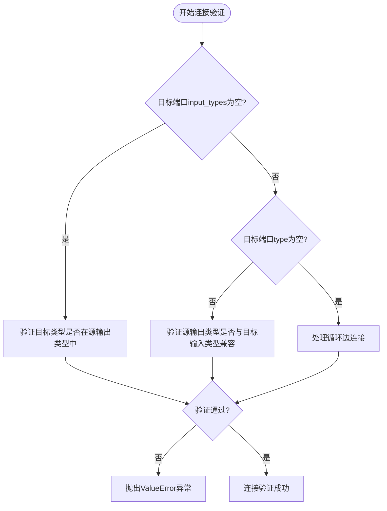
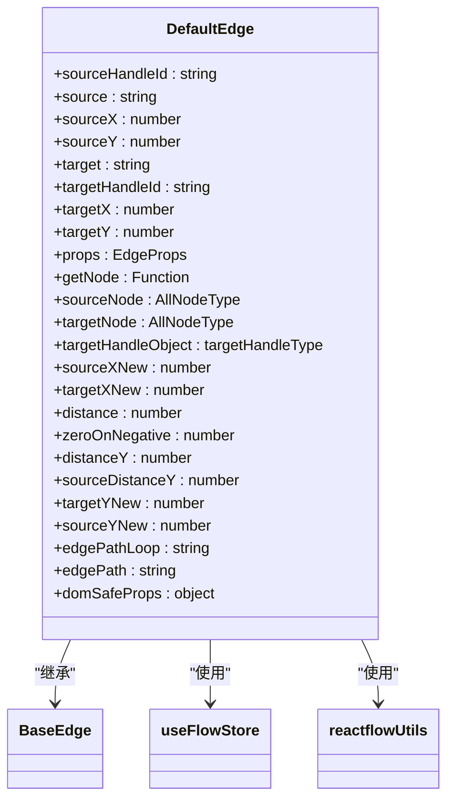
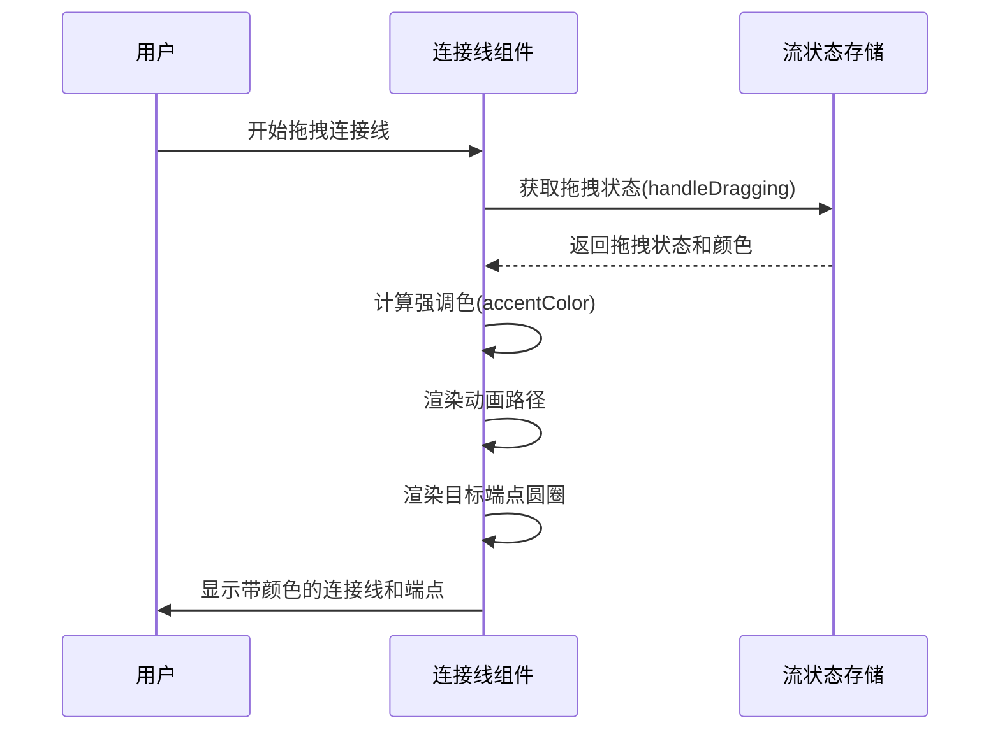
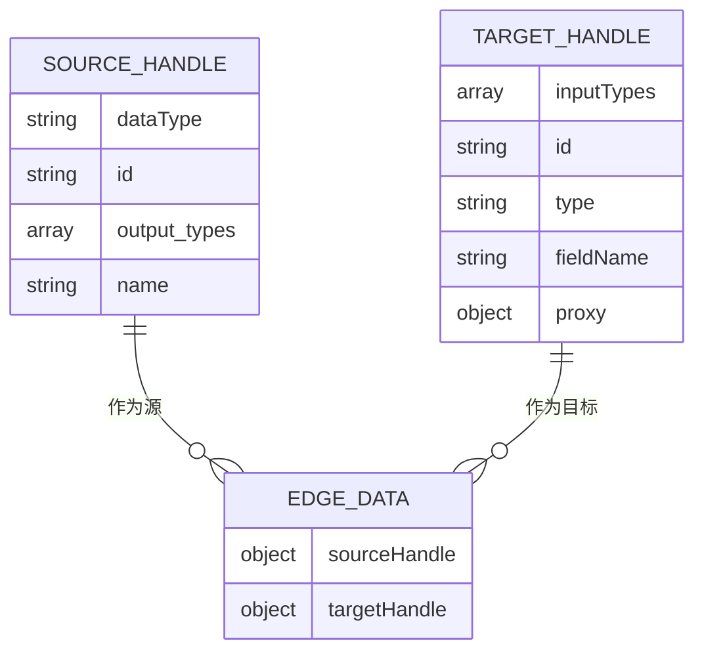
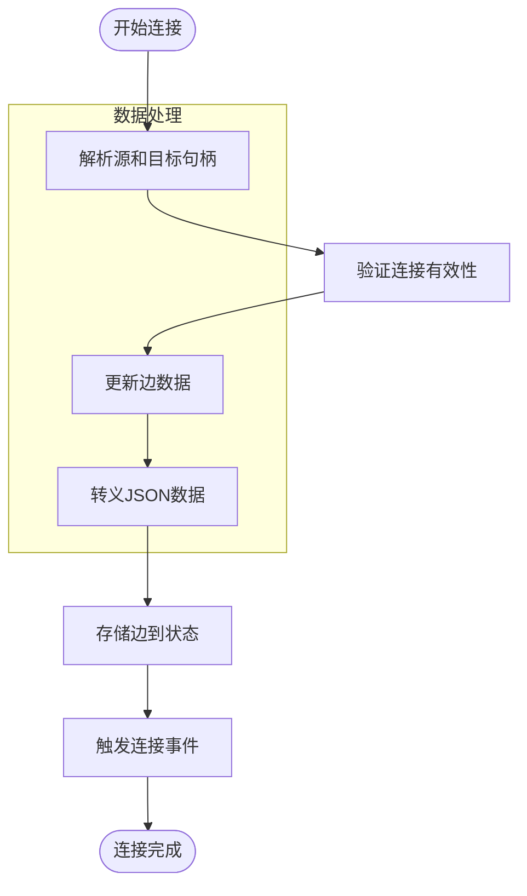
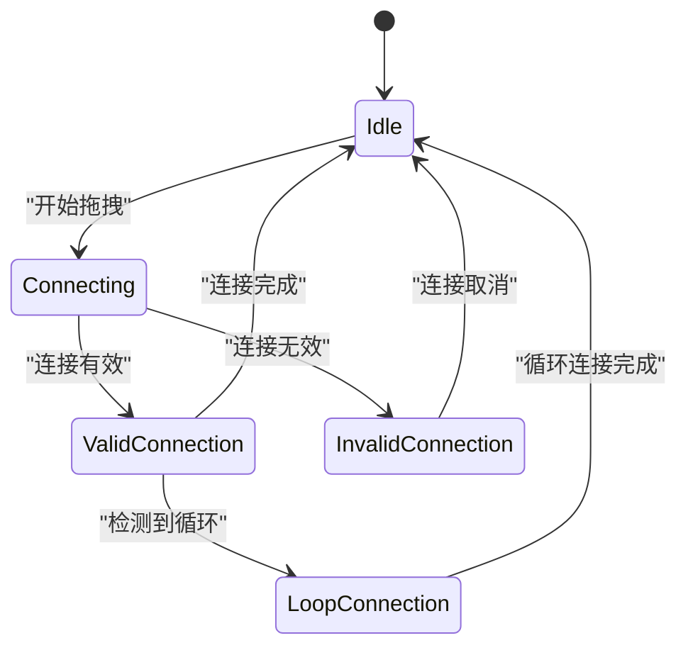
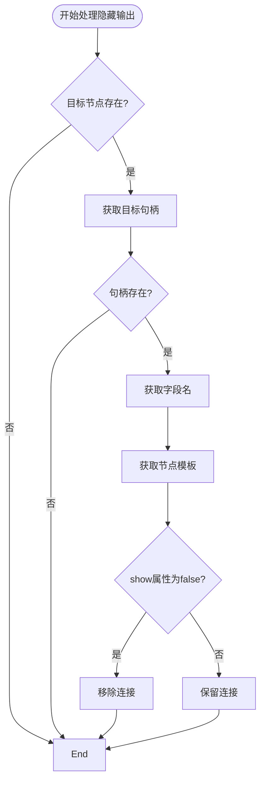

# 工作流连接系统

<cite>
**本文档中引用的文件**   
- [index.tsx](file://vibe_surf/frontend/src/CustomEdges/index.tsx)
- [reactflowUtils.ts](file://vibe_surf/frontend/src/utils/reactflowUtils.ts)
- [flowStore.ts](file://vibe_surf/frontend/src/stores/flowStore.ts)
- [base.py](file://vibe_surf/langflow/graph/edge/base.py)
- [setup.py](file://vibe_surf/langflow/initial_setup/setup.py)
- [ConnectionLineComponent.tsx](file://vibe_surf/frontend/src/pages/FlowPage/components/ConnectionLineComponent/index.tsx)
</cite>

## 目录
1. [简介](#简介)
2. [自定义边（CustomEdges）实现](#自定义边customedges实现)
3. [连接验证机制](#连接验证机制)
4. [连接样式与视觉反馈](#连接样式与视觉反馈)
5. [数据传递与处理](#数据传递与处理)
6. [连接状态视觉反馈](#连接状态视觉反馈)
7. [连接数据验证](#连接数据验证)
8. [实际代码示例](#实际代码示例)

## 简介
VibeSurf工作流连接系统实现了复杂的工作流节点连接功能，支持自定义边样式、交互行为和数据传递机制。该系统通过前端React Flow库和后端Python服务的协同工作，实现了完整的连接管理功能，包括连接创建、验证、样式化和状态反馈。

## 自定义边（CustomEdges）实现

工作流连接系统的自定义边实现位于`vibe_surf/frontend/src/CustomEdges/index.tsx`文件中。系统通过`DefaultEdge`组件实现自定义边的渲染和交互行为。

自定义边的核心功能包括：
- 基于贝塞尔曲线的连接线路径计算
- 动态连接线样式调整
- 连接线的视觉状态管理
- 特殊连接类型（如循环连接）的处理

**Section sources**
- [index.tsx](file://vibe_surf/frontend/src/CustomEdges/index.tsx)

## 连接验证机制

### 端口兼容性验证逻辑

系统实现了严格的端口兼容性验证逻辑，确保不同类型节点间的连接符合预定义的约束。验证逻辑主要在`vibe_surf/langflow/graph/edge/base.py`文件中的`_validate_handles`方法中实现。



**Diagram sources**
- [base.py](file://vibe_surf/langflow/graph/edge/base.py#L83-L108)

### 连接约束处理

系统通过以下机制处理不同类型节点间的连接约束：

1. **输入类型验证**：当目标端口的`input_types`为`None`时，验证目标类型是否在源输出类型中
2. **循环边处理**：当目标端口的`type`为`None`时，将其视为循环边，检查源输出类型是否非空且与目标输入类型兼容
3. **输出类型验证**：验证源输出类型是否与目标输入类型兼容，或目标类型是否在源输出类型中

这些验证逻辑确保了工作流中节点连接的类型安全性和数据兼容性。

**Section sources**
- [base.py](file://vibe_surf/langflow/graph/edge/base.py#L83-L108)

## 连接样式与视觉反馈

### 自定义连接线样式

系统通过`DefaultEdge`组件实现自定义连接线样式。连接线的路径和样式根据连接类型动态调整：



**Diagram sources**
- [index.tsx](file://vibe_surf/frontend/src/CustomEdges/index.tsx)

### 连接线创建过程中的视觉反馈

在连接创建过程中，系统通过`ConnectionLineComponent`组件提供实时视觉反馈：



**Diagram sources**
- [ConnectionLineComponent.tsx](file://vibe_surf/frontend/src/pages/FlowPage/components/ConnectionLineComponent/index.tsx)
- [flowStore.ts](file://vibe_surf/frontend/src/stores/flowStore.ts)

## 数据传递与处理

### 连接数据结构

系统使用复杂的JSON结构来存储连接数据，包括源端口和目标端口的详细信息：



### 数据传递机制

连接数据的传递和处理通过以下流程实现：



**Section sources**
- [reactflowUtils.ts](file://vibe_surf/frontend/src/utils/reactflowUtils.ts#L371-L447)
- [flowStore.ts](file://vibe_surf/frontend/src/stores/flowStore.ts#L605-L615)

## 连接状态视觉反馈

系统通过多种视觉方式反馈连接状态：

1. **激活状态**：使用动画效果和颜色变化表示正在创建的连接
2. **错误状态**：通过不完整的循环连接检测和错误提示反馈问题连接
3. **数据流指示**：通过虚线样式表示循环连接，实线表示普通连接



**Diagram sources**
- [index.tsx](file://vibe_surf/frontend/src/CustomEdges/index.tsx)
- [reactflowUtils.ts](file://vibe_surf/frontend/src/utils/reactflowUtils.ts#L711-L723)

## 连接数据验证

### 代码有效性检查

系统实现了多层次的连接数据验证机制：

1. **基本连接验证**：检查源和目标节点是否相同
2. **类型兼容性验证**：检查源输出类型和目标输入类型的兼容性
3. **循环连接验证**：检测并处理循环连接

```typescript
function isValidConnection(
  connection: Connection,
  nodes?: AllNodeType[],
  edges?: EdgeType[],
): boolean {
  const { source, target, sourceHandle, targetHandle } = connection;
  if (source === target) {
    return false;
  }
  
  const nodesArray = nodes || useFlowStore.getState().nodes;
  const edgesArray = edges || useFlowStore.getState().edges;
  
  const targetHandleObject: targetHandleType = scapeJSONParse(targetHandle!);
  const sourceHandleObject: sourceHandleType = scapeJSONParse(sourceHandle!);
  
  // 验证逻辑实现
  // ...
}
```

**Section sources**
- [reactflowUtils.ts](file://vibe_surf/frontend/src/utils/reactflowUtils.ts#L371-L447)

### 隐藏输出处理

系统通过`filterHiddenFieldsEdges`函数处理隐藏输出的连接：



**Section sources**
- [reactflowUtils.ts](file://vibe_surf/frontend/src/utils/reactflowUtils.ts#L219-L237)

## 实际代码示例

### 自定义连接线样式

```typescript
export function DefaultEdge({
  sourceHandleId,
  source,
  sourceX,
  sourceY,
  target,
  targetHandleId,
  targetX,
  targetY,
  ...props
}: EdgeProps) {
  const getNode = useFlowStore((state) => state.getNode);
  
  const sourceNode = getNode(source);
  const targetNode = getNode(target);
  
  const targetHandleObject = scapeJSONParse(targetHandleId!);
  
  const sourceXNew =
    (sourceNode?.position.x ?? 0) + (sourceNode?.measured?.width ?? 0) + 7;
  const targetXNew = (targetNode?.position.x ?? 0) - 7;
  
  const distance = 200 + 0.1 * ((sourceXNew - targetXNew) / 2);
  
  const zeroOnNegative =
    (1 +
      (1 - Math.exp(-0.01 * Math.abs(sourceXNew - targetXNew))) *
        (sourceXNew - targetXNew >= 0 ? 1 : -1)) /
    2;
  
  const distanceY =
    200 -
    200 * (1 - zeroOnNegative) +
    0.3 * Math.abs(targetY - sourceY) * zeroOnNegative;
  
  const sourceDistanceY =
    200 -
    200 * (1 - zeroOnNegative) +
    0.3 * Math.abs(sourceY - targetY) * zeroOnNegative;
  
  const targetYNew = targetY + 1;
  const sourceYNew = sourceY + 1;
  
  const edgePathLoop = `M ${sourceXNew} ${sourceYNew} C ${sourceXNew + distance} ${sourceYNew + sourceDistanceY}, ${targetXNew - distance} ${targetYNew + distanceY}, ${targetXNew} ${targetYNew}`;
  
  const [edgePath] = getBezierPath({
    sourceX: sourceXNew,
    sourceY: sourceYNew,
    sourcePosition: Position.Right,
    targetPosition: Position.Left,
    targetX: targetXNew,
    targetY: targetYNew,
  });
  
  const { animated, selectable, deletable, selected, ...domSafeProps } = props;
  
  return (
    <BaseEdge
      path={targetHandleObject.output_types ? edgePathLoop : edgePath}
      strokeDasharray={targetHandleObject.output_types ? "5 5" : "0"}
      {...domSafeProps}
      data-animated={animated ? "true" : "false"}
      data-selectable={selectable ? "true" : "false"}
      data-deletable={deletable ? "true" : "false"}
      data-selected={selected ? "true" : "false"}
    />
  );
}
```

### 连接验证实现

```typescript
export function isValidConnection(
  connection: Connection,
  nodes?: AllNodeType[],
  edges?: EdgeType[],
): boolean {
  const { source, target, sourceHandle, targetHandle } = connection;
  if (source === target) {
    return false;
  }
  
  const nodesArray = nodes || useFlowStore.getState().nodes;
  const edgesArray = edges || useFlowStore.getState().edges;
  
  const targetHandleObject: targetHandleType = scapeJSONParse(targetHandle!);
  const sourceHandleObject: sourceHandleType = scapeJSONParse(sourceHandle!);
  
  const targetNode = nodesArray.find((node) => node.id === target);
  const findNode = nodesArray.find((node) => node.id === source);
  
  if (!targetNode || !findNode) return false;
  
  if (
    targetHandleObject.inputTypes?.some(
      (n) => n === sourceHandleObject.dataType,
    ) ||
    (targetHandleObject.output_types &&
      (targetHandleObject.output_types?.some(
        (n) => n === sourceHandleObject.dataType,
      ) ||
        sourceHandleObject.output_types.some((t) =>
          targetHandleObject.output_types?.some((n) => n === t),
        ))) ||
    sourceHandleObject.output_types.some(
      (t) =>
        targetHandleObject.inputTypes?.some((n) => n === t) ||
        t === targetHandleObject.type,
    )
  ) {
    const targetNode = nodesArray.find((node) => node.id === target!);
    const targetNodeDataNode = targetNode?.data?.node;
    if (
      (!targetNodeDataNode &&
        !edgesArray.find((e) => e.targetHandle === targetHandle)) ||
      (targetNodeDataNode &&
        targetHandleObject.output_types &&
        !edgesArray.find((e) => e.targetHandle === targetHandle)) ||
      (targetNodeDataNode &&
        !targetHandleObject.output_types &&
        ((!targetNodeDataNode.template[targetHandleObject.fieldName].list &&
          !edgesArray.find((e) => e.targetHandle === targetHandle)) ||
          targetNodeDataNode.template[targetHandleObject.fieldName].list))
    ) {
      if (targetHandleObject.output_types) {
        return true;
      }
    }
  }
  
  return false;
}
```

**Section sources**
- [index.tsx](file://vibe_surf/frontend/src/CustomEdges/index.tsx)
- [reactflowUtils.ts](file://vibe_surf/frontend/src/utils/reactflowUtils.ts#L371-L447)