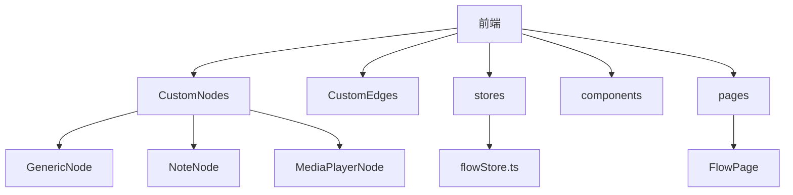
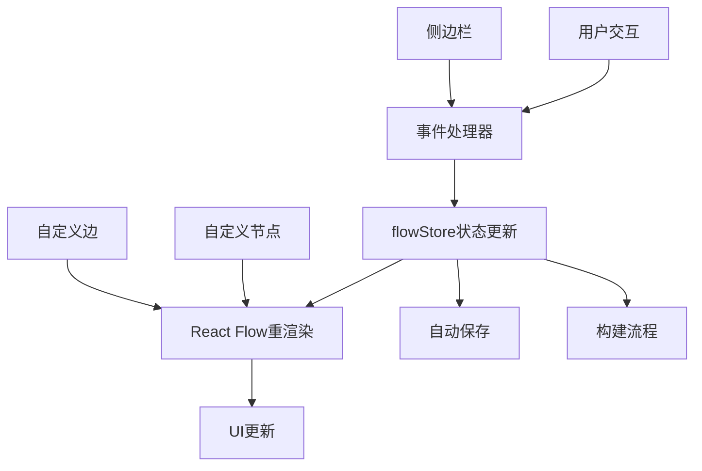
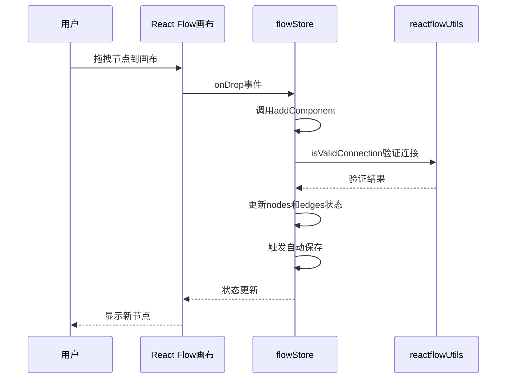
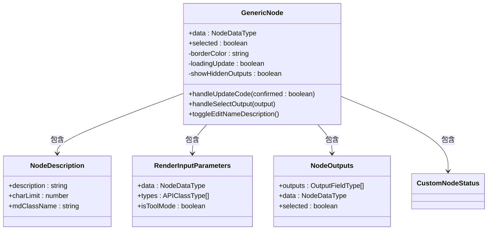
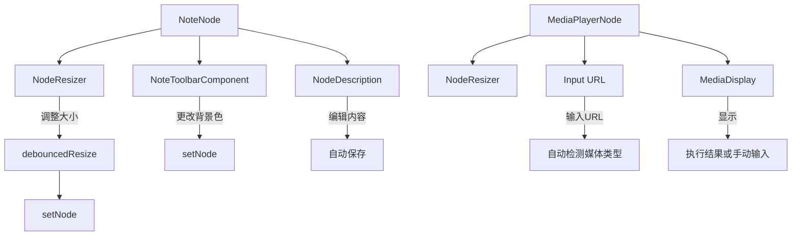
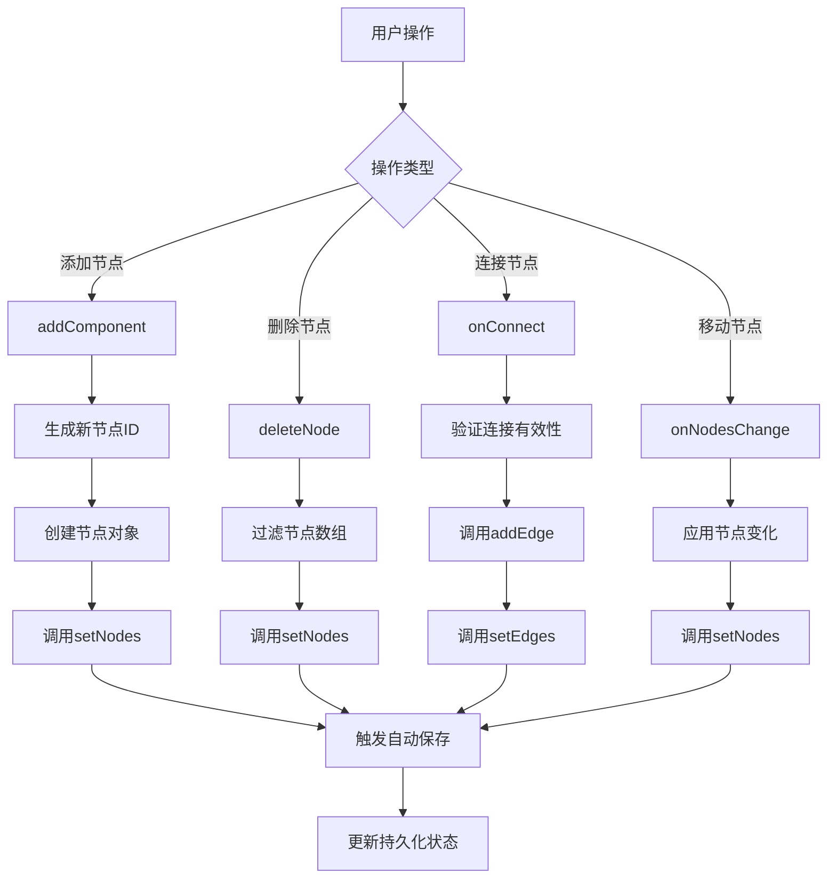
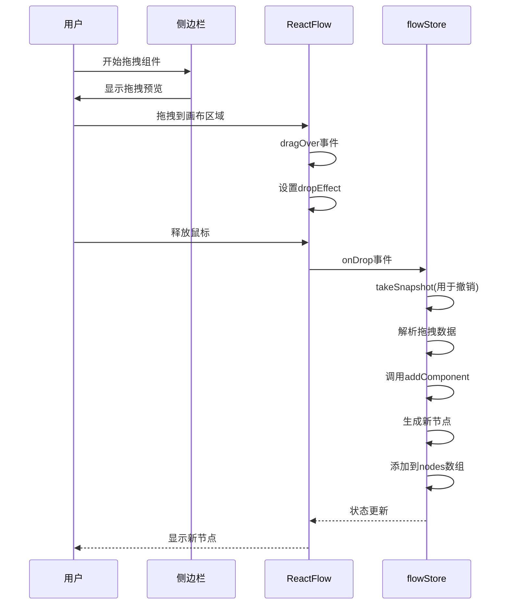
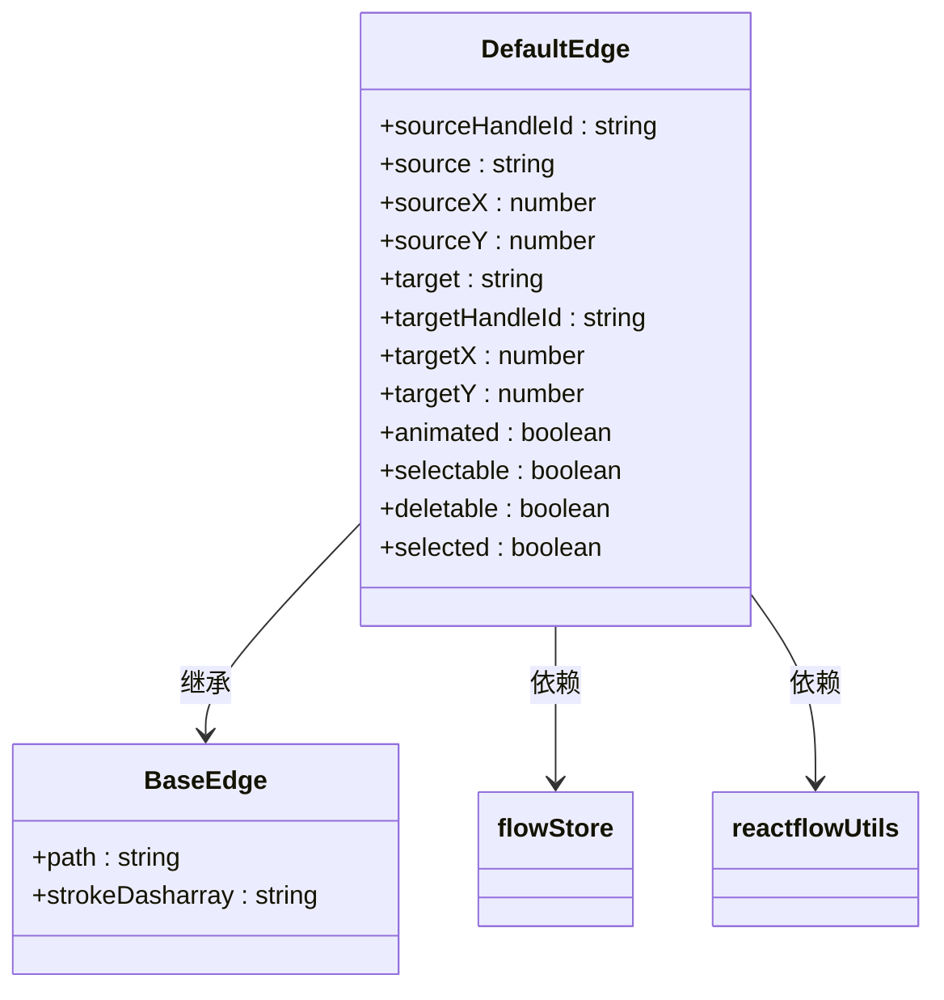
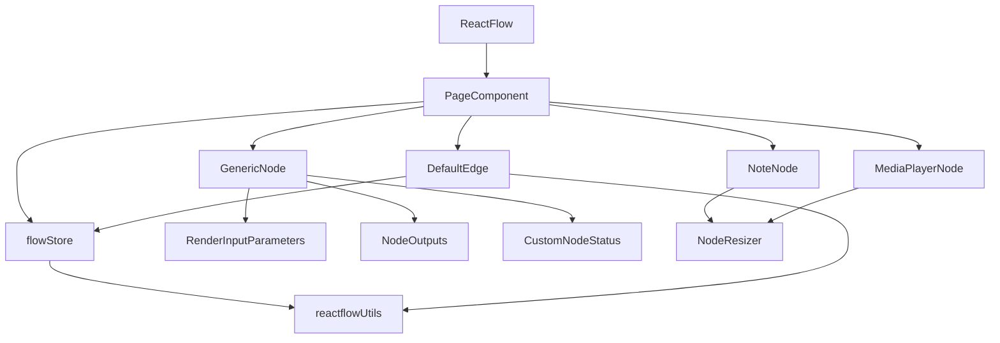

# 拖放式工作流创建

<cite>
**本文档引用的文件**   
- [flowStore.ts](file://vibe_surf/frontend/src/stores/flowStore.ts)
- [PageComponent/index.tsx](file://vibe_surf/frontend/src/pages/FlowPage/components/PageComponent/index.tsx)
- [CustomEdges/index.tsx](file://vibe_surf/frontend/src/CustomEdges/index.tsx)
- [GenericNode/index.tsx](file://vibe_surf/frontend/src/CustomNodes/GenericNode/index.tsx)
- [NoteNode/index.tsx](file://vibe_surf/frontend/src/CustomNodes/NoteNode/index.tsx)
- [MediaPlayerNode/index.tsx](file://vibe_surf/frontend/src/CustomNodes/MediaPlayerNode/index.tsx)
- [reactflowUtils.ts](file://vibe_surf/frontend/src/utils/reactflowUtils.ts)
</cite>

## 目录
1. [简介](#简介)
2. [项目结构](#项目结构)
3. [核心组件](#核心组件)
4. [架构概述](#架构概述)
5. [详细组件分析](#详细组件分析)
6. [依赖分析](#依赖分析)
7. [性能考虑](#性能考虑)
8. [故障排除指南](#故障排除指南)
9. [结论](#结论)

## 简介
本文档全面记录了VibeSurf中拖放式工作流编辑器的实现。详细说明了React Flow库的集成方式、自定义节点和边的实现机制，以及节点拖拽、连接、参数配置的交互逻辑。解释了前端状态管理如何通过flowStore.ts协调工作流数据，包括节点添加、删除、更新等操作的处理流程。描述了侧边栏组件（flowSidebarComponent）的分类展示、搜索过滤和拖拽注入功能。提供了节点连接线（ConnectionLineComponent）的可视化配置和交互反馈机制。包含实际代码示例，展示如何定义新节点类型和处理节点间数据流。

## 项目结构
VibeSurf项目采用模块化前端架构，核心工作流编辑器位于frontend/src目录下。主要结构包括CustomNodes（自定义节点）、CustomEdges（自定义边）、stores（状态管理）、components（通用组件）等目录。工作流编辑器的核心逻辑分布在stores/flowStore.ts中，负责管理全局状态；页面组件位于pages/FlowPage下，而各种自定义节点实现则分散在CustomNodes目录中。

**Diagram sources**
- [flowStore.ts](file://vibe_surf/frontend/src/stores/flowStore.ts)
- [PageComponent/index.tsx](file://vibe_surf/frontend/src/pages/FlowPage/components/PageComponent/index.tsx)

**Section sources**
- [flowStore.ts](file://vibe_surf/frontend/src/stores/flowStore.ts)
- [PageComponent/index.tsx](file://vibe_surf/frontend/src/pages/FlowPage/components/PageComponent/index.tsx)

## 核心组件
拖放式工作流编辑器的核心组件包括React Flow画布、自定义节点（GenericNode, NoteNode, MediaPlayerNode）、自定义边（DefaultEdge）以及状态管理store（flowStore）。这些组件协同工作，实现了直观的可视化工作流构建体验。

**Section sources**
- [flowStore.ts](file://vibe_surf/frontend/src/stores/flowStore.ts)
- [GenericNode/index.tsx](file://vibe_surf/frontend/src/CustomNodes/GenericNode/index.tsx)
- [CustomEdges/index.tsx](file://vibe_surf/frontend/src/CustomEdges/index.tsx)

## 架构概述
VibeSurf的工作流编辑器基于React Flow库构建，采用Zustand进行状态管理。整体架构分为三层：视图层（React Flow画布和自定义组件）、状态管理层（flowStore）和工具函数层（reactflowUtils）。用户交互通过事件系统触发状态更新，状态变化自动反映在UI上，形成响应式工作流编辑体验。

**Diagram sources**
- [flowStore.ts](file://vibe_surf/frontend/src/stores/flowStore.ts)
- [PageComponent/index.tsx](file://vibe_surf/frontend/src/pages/FlowPage/components/PageComponent/index.tsx)

## 详细组件分析

### React Flow集成与交互逻辑
工作流编辑器通过React Flow库提供画布基础功能，并在其上构建了丰富的自定义交互。在PageComponent中，通过onNodesChange、onEdgesChange等回调函数监听节点和边的变化，结合Zustand store实现状态同步。

**Diagram sources**
- [PageComponent/index.tsx](file://vibe_surf/frontend/src/pages/FlowPage/components/PageComponent/index.tsx)
- [flowStore.ts](file://vibe_surf/frontend/src/stores/flowStore.ts)
- [reactflowUtils.ts](file://vibe_surf/frontend/src/utils/reactflowUtils.ts)

**Section sources**
- [PageComponent/index.tsx](file://vibe_surf/frontend/src/pages/FlowPage/components/PageComponent/index.tsx)
- [flowStore.ts](file://vibe_surf/frontend/src/stores/flowStore.ts)

### 自定义节点实现机制
VibeSurf实现了多种自定义节点，包括通用节点（GenericNode）、笔记节点（NoteNode）和媒体播放器节点（MediaPlayerNode）。这些节点通过nodeTypes配置注入React Flow，每个节点都有独特的UI和交互特性。

#### GenericNode分析
GenericNode是工作流中的主要功能节点，支持参数配置、代码更新和状态显示。它通过模板系统动态生成输入参数表单，并根据构建状态显示不同的视觉反馈。

**Diagram sources**
- [GenericNode/index.tsx](file://vibe_surf/frontend/src/CustomNodes/GenericNode/index.tsx)

#### NoteNode和MediaPlayerNode分析
NoteNode提供富文本笔记功能，支持Markdown编辑和背景色选择。MediaPlayerNode则用于显示图像和视频内容，既支持手动输入URL，也能显示工作流执行结果。

**Diagram sources**
- [NoteNode/index.tsx](file://vibe_surf/frontend/src/CustomNodes/NoteNode/index.tsx)
- [MediaPlayerNode/index.tsx](file://vibe_surf/frontend/src/CustomNodes/MediaPlayerNode/index.tsx)

**Section sources**
- [GenericNode/index.tsx](file://vibe_surf/frontend/src/CustomNodes/GenericNode/index.tsx)
- [NoteNode/index.tsx](file://vibe_surf/frontend/src/CustomNodes/NoteNode/index.tsx)
- [MediaPlayerNode/index.tsx](file://vibe_surf/frontend/src/CustomNodes/MediaPlayerNode/index.tsx)

### 状态管理与数据流
flowStore.ts是工作流编辑器的核心状态管理模块，使用Zustand创建了一个全局store，集中管理节点、边、构建状态等所有工作流相关数据。

#### 状态管理流程

**Diagram sources**
- [flowStore.ts](file://vibe_surf/frontend/src/stores/flowStore.ts)

#### 核心状态与方法
flowStore维护了以下核心状态和方法：

| 状态/方法 | 类型 | 描述 |
|---------|------|------|
| nodes | Node[] | 当前工作流中的所有节点 |
| edges | Edge[] | 当前工作流中的所有连接边 |
| setNodes | function | 更新节点数组并清理无效边 |
| setEdges | function | 更新边数组并触发自动保存 |
| onConnect | function | 处理节点连接逻辑 |
| deleteNode | function | 删除指定节点及其连接 |
| paste | function | 粘贴复制的节点和边 |
| autoSaveFlow | function | 自动保存当前工作流 |

**Section sources**
- [flowStore.ts](file://vibe_surf/frontend/src/stores/flowStore.ts)

### 侧边栏与拖拽注入
侧边栏组件实现了组件的分类展示、搜索过滤和拖拽注入功能。当用户将组件从侧边栏拖拽到画布时，系统会创建相应的节点实例。

#### 拖拽注入流程

**Diagram sources**
- [PageComponent/index.tsx](file://vibe_surf/frontend/src/pages/FlowPage/components/PageComponent/index.tsx)
- [flowStore.ts](file://vibe_surf/frontend/src/stores/flowStore.ts)

### 连接线与交互反馈
DefaultEdge组件自定义了连接线的外观和行为，提供了视觉反馈和交互提示。

#### 连接线配置

连接线根据目标句柄的output_types属性决定显示样式：普通连接线为实线，循环连接线为虚线，提供清晰的视觉区分。

**Diagram sources**
- [CustomEdges/index.tsx](file://vibe_surf/frontend/src/CustomEdges/index.tsx)

## 依赖分析
工作流编辑器各组件之间的依赖关系清晰，形成了一个层次化的架构体系。

**Diagram sources**
- [flowStore.ts](file://vibe_surf/frontend/src/stores/flowStore.ts)
- [PageComponent/index.tsx](file://vibe_surf/frontend/src/pages/FlowPage/components/PageComponent/index.tsx)
- [GenericNode/index.tsx](file://vibe_surf/frontend/src/CustomNodes/GenericNode/index.tsx)

## 性能考虑
工作流编辑器在性能方面做了多项优化：
- 使用memo对组件进行记忆化，避免不必要的重新渲染
- 对节点调整大小等高频操作使用debounce进行节流
- 采用Zustand的useShallow进行选择性状态订阅，减少组件重渲染
- 对复杂计算（如布局）进行异步处理，避免阻塞主线程

## 故障排除指南
常见问题及解决方案：
- **节点无法连接**：检查连接是否形成循环，或目标节点的输入类型是否匹配
- **自动保存失败**：检查网络连接，确认后端API是否正常运行
- **节点显示异常**：尝试刷新页面，检查浏览器控制台是否有错误信息
- **拖拽功能失效**：确认没有其他脚本或扩展程序干扰拖拽事件

**Section sources**
- [flowStore.ts](file://vibe_surf/frontend/src/stores/flowStore.ts)
- [PageComponent/index.tsx](file://vibe_surf/frontend/src/pages/FlowPage/components/PageComponent/index.tsx)

## 结论
VibeSurf的拖放式工作流编辑器通过React Flow库提供了强大的可视化编程能力，结合自定义节点、边和状态管理，实现了直观易用的工作流构建体验。系统架构清晰，组件职责分明，为扩展新功能提供了良好的基础。未来可以进一步优化性能，增加更多类型的节点和更丰富的交互反馈。