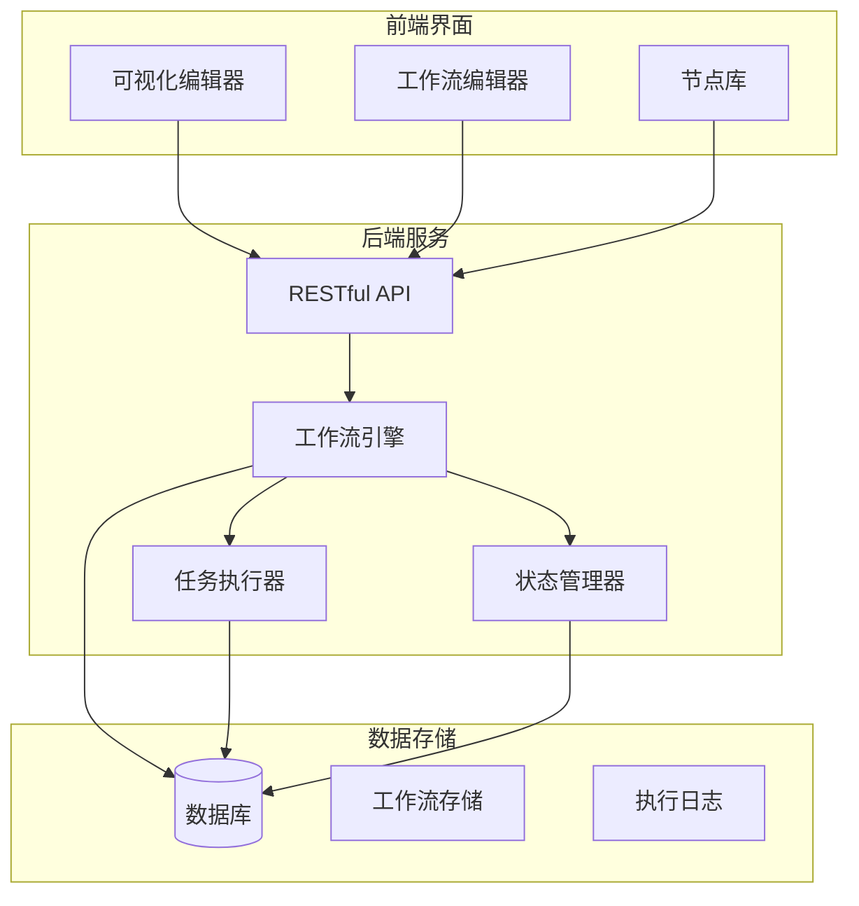
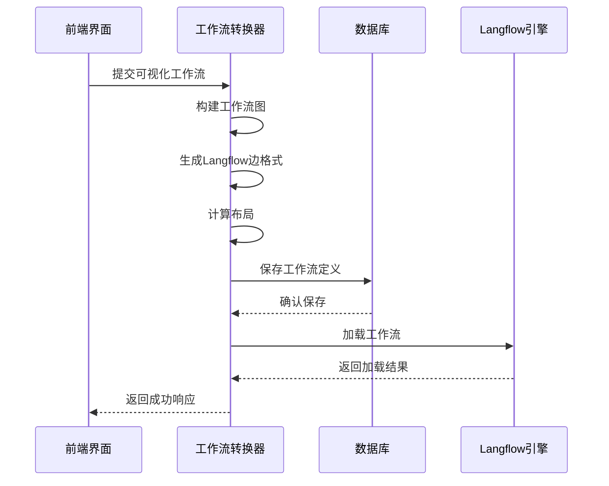
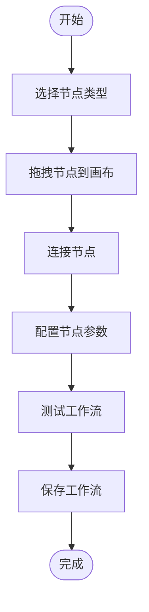
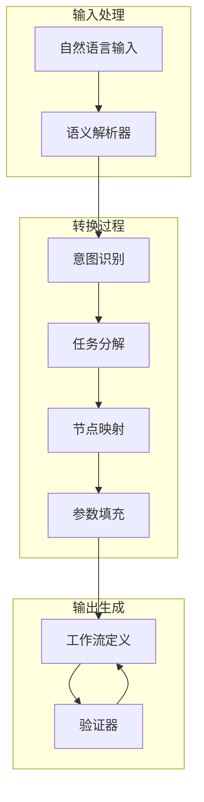
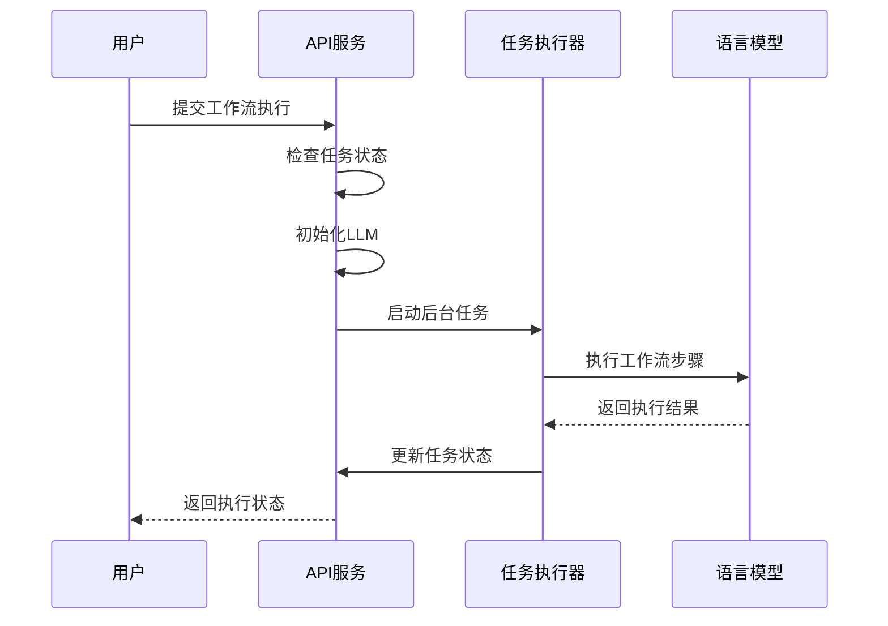
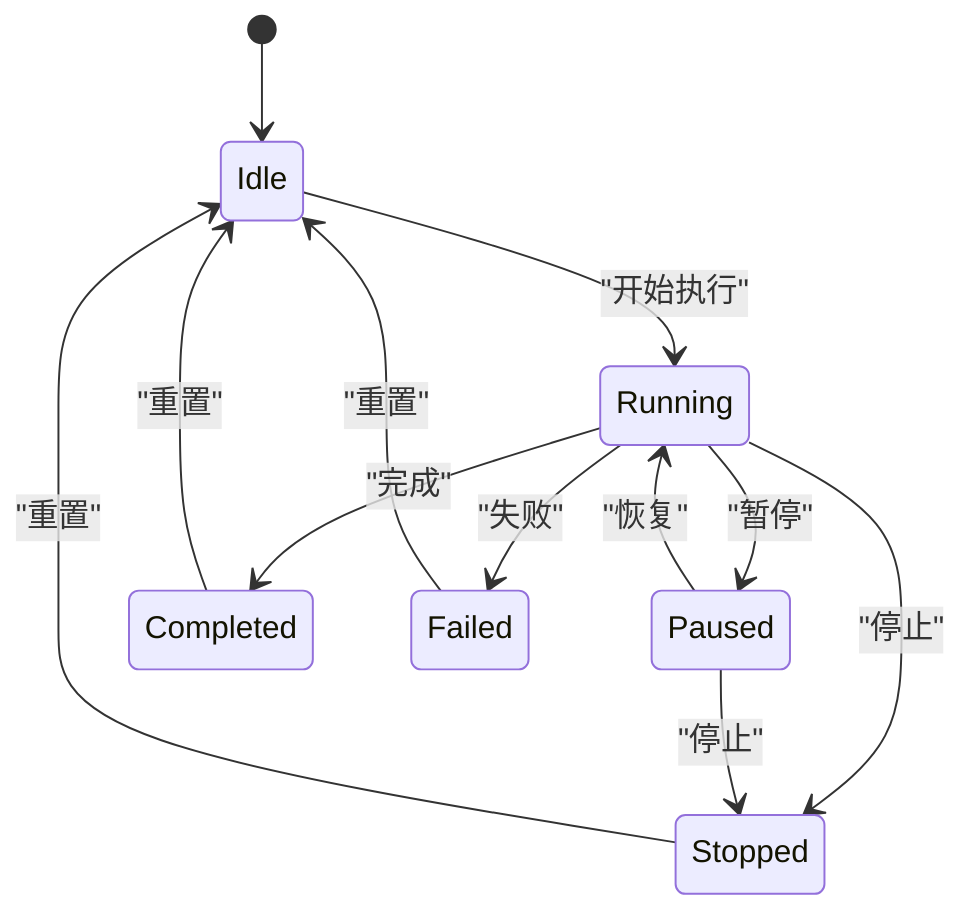
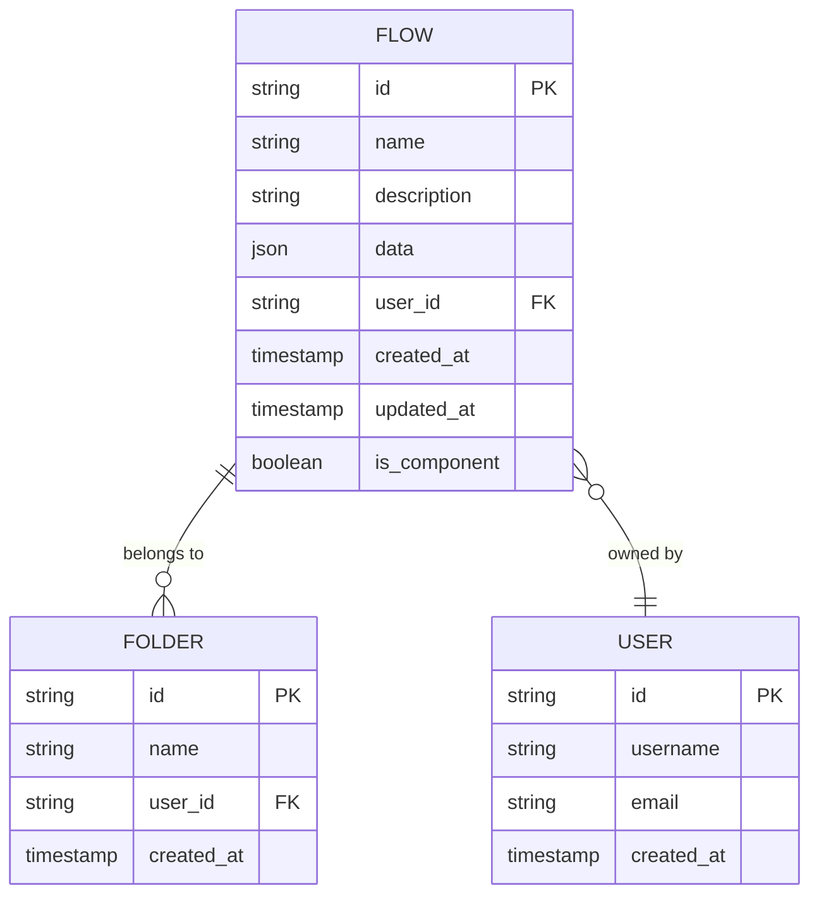
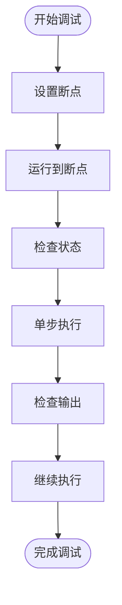
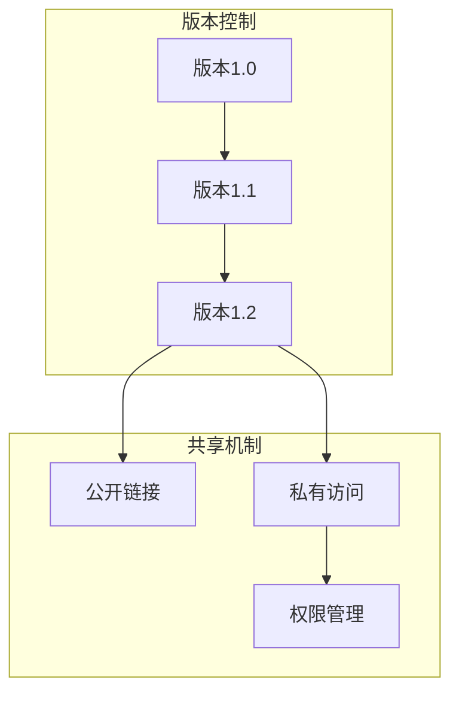
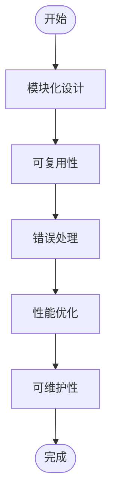

# 工作流引擎

<cite>
**本文档引用的文件**   
- [workflow_converter.py](file://vibe_surf/backend/utils/workflow_converter.py)
- [main.py](file://vibe_surf/langflow/main.py)
- [task.py](file://vibe_surf/backend/api/task.py)
- [shared_state.py](file://vibe_surf/backend/shared_state.py)
- [models.py](file://vibe_surf/backend/database/models.py)
- [flows.py](file://vibe_surf/langflow/api/v1/flows.py)
- [index.tsx](file://vibe_surf/frontend/src/CustomNodes/GenericNode/index.tsx)
</cite>

## 目录
1. [简介](#简介)
2. [工作流引擎架构](#工作流引擎架构)
3. [基于Langflow的工作流集成](#基于langflow的工作流集成)
4. [拖放式工作流创建界面](#拖放式工作流创建界面)
5. [对话式工作流实现机制](#对话式工作流实现机制)
6. [工作流的加载与执行](#工作流的加载与执行)
7. [工作流监控与状态管理](#工作流监控与状态管理)
8. [预定义与自定义工作流管理](#预定义与自定义工作流管理)
9. [工作流调试工具](#工作流调试工具)
10. [工作流版本控制与共享](#工作流版本控制与共享)
11. [复杂工作流设计最佳实践](#复杂工作流设计最佳实践)

## 简介
VibeSurf工作流引擎是一个基于Langflow框架构建的强大自动化系统，旨在通过可视化界面和自然语言交互实现复杂任务的自动化。该引擎支持拖放式工作流创建、对话式工作流生成、预定义模板管理以及自定义工作流开发等多种功能。系统通过集成Langflow的核心能力，实现了工作流的可视化设计、执行、监控和调试，为用户提供了一个完整的自动化解决方案。

**Section sources**
- [main.py](file://vibe_surf/langflow/main.py#L1-L551)
- [workflow_converter.py](file://vibe_surf/backend/utils/workflow_converter.py#L1-L570)

## 工作流引擎架构
VibeSurf工作流引擎采用分层架构设计，由前端界面、后端服务和数据库存储三大部分组成。前端基于React和Langflow的可视化组件库，提供拖放式工作流编辑界面。后端采用FastAPI框架，通过RESTful API与前端交互，处理工作流的创建、执行和监控请求。数据库使用SQLite存储工作流定义、执行状态和用户配置等信息。

系统核心组件包括工作流转换器、任务执行器、状态管理器和数据库查询服务。工作流转换器负责将用户创建的可视化工作流转换为Langflow兼容的JSON格式。任务执行器管理工作流的执行生命周期，包括启动、暂停、恢复和停止操作。状态管理器维护全局运行状态，确保系统组件间的协调一致。

**Diagram sources **
- [main.py](file://vibe_surf/langflow/main.py#L1-L551)
- [shared_state.py](file://vibe_surf/backend/shared_state.py#L1-L1111)

**Section sources**
- [main.py](file://vibe_surf/langflow/main.py#L1-L551)
- [shared_state.py](file://vibe_surf/backend/shared_state.py#L1-L1111)

## 基于Langflow的工作流集成
VibeSurf工作流引擎深度集成了Langflow框架，利用其强大的可视化编程能力实现工作流的创建和管理。系统通过`workflow_converter.py`模块将用户在前端创建的可视化工作流转换为Langflow兼容的JSON格式，确保工作流定义的标准化和可移植性。

工作流转换过程包括构建工作流图、生成Langflow边格式、计算布局和保存到数据库等步骤。`build_workflow_graph`函数负责将原始工作流数据构建成Langflow图对象，`generate_langflow_edges`函数生成符合Langflow规范的边格式，`calculate_langflow_style_layout`函数计算节点的布局位置，确保工作流在界面上的美观展示。

**Diagram sources **
- [workflow_converter.py](file://vibe_surf/backend/utils/workflow_converter.py#L1-L570)
- [flows.py](file://vibe_surf/langflow/api/v1/flows.py#L1-L580)

**Section sources**
- [workflow_converter.py](file://vibe_surf/backend/utils/workflow_converter.py#L1-L570)
- [flows.py](file://vibe_surf/langflow/api/v1/flows.py#L1-L580)

## 拖放式工作流创建界面
VibeSurf提供直观的拖放式工作流创建界面，用户可以通过简单的拖拽操作构建复杂的工作流。界面基于React Flow库实现，支持节点的自由布局、连接线的自动绘制和实时预览等功能。每个工作流节点代表一个具体的操作或任务，用户可以通过配置节点参数来定义其行为。

前端组件`GenericNode`实现了工作流节点的核心功能，包括节点图标、名称、描述、输入参数和输出端口的显示。节点支持多种状态，如正常、选中、过时和错误状态，通过不同的视觉样式帮助用户快速识别工作流的运行状况。用户可以通过双击节点来编辑其配置，或通过右键菜单执行复制、删除等操作。

**Diagram sources **
- [index.tsx](file://vibe_surf/frontend/src/CustomNodes/GenericNode/index.tsx#L1-L750)
- [main.py](file://vibe_surf/langflow/main.py#L1-L551)

**Section sources**
- [index.tsx](file://vibe_surf/frontend/src/CustomNodes/GenericNode/index.tsx#L1-L750)

## 对话式工作流实现机制
VibeSurf的对话式工作流功能允许用户通过自然语言描述任务需求，系统自动将其转换为可执行的工作流。这一过程基于大语言模型（LLM）的语义理解和代码生成能力，将用户意图解析为具体的操作步骤，并映射到相应的工作流节点。

自然语言到工作流的转换过程包括意图识别、任务分解、节点映射和参数填充四个阶段。首先，系统分析用户输入的自然语言，识别其核心意图和关键参数。然后，将复杂任务分解为一系列可执行的子任务。接着，根据子任务类型选择合适的工作流节点。最后，将提取的参数填充到节点配置中，生成完整的工作流定义。

**Diagram sources **
- [task.py](file://vibe_surf/backend/api/task.py#L1-L379)
- [shared_state.py](file://vibe_surf/backend/shared_state.py#L1-L1111)

**Section sources**
- [task.py](file://vibe_surf/backend/api/task.py#L1-L379)
- [shared_state.py](file://vibe_surf/backend/shared_state.py#L1-L1111)

## 工作流的加载与执行
VibeSurf工作流的加载与执行由任务执行器统一管理。当用户提交工作流执行请求时，系统首先检查是否有正在运行的任务，避免并发冲突。然后，根据请求中的LLM配置初始化语言模型，确保工作流在正确的环境下执行。

工作流执行采用异步后台任务模式，通过`execute_task_background`函数在后台线程中运行。执行过程中，系统会实时更新任务状态，包括开始时间、当前状态和执行进度等信息。任务执行器还支持动态添加新任务，允许用户在工作流运行过程中插入额外的操作。

**Diagram sources **
- [task.py](file://vibe_surf/backend/api/task.py#L1-L379)
- [shared_state.py](file://vibe_surf/backend/shared_state.py#L1-L1111)

**Section sources**
- [task.py](file://vibe_surf/backend/api/task.py#L1-L379)
- [shared_state.py](file://vibe_surf/backend/shared_state.py#L1-L1111)

## 工作流监控与状态管理
VibeSurf提供全面的工作流监控功能，用户可以实时查看工作流的执行状态、进度和结果。系统通过`check_task_status`和`get_detailed_task_status`等API端点提供任务状态查询服务，返回包括任务ID、状态、开始时间、执行进度等详细信息。

状态管理器维护全局运行状态，包括活动任务信息、LLM配置、浏览器会话等。`is_task_running`函数用于快速检查是否有任务正在运行，`get_active_task_info`函数返回当前活动任务的详细信息。这些状态信息不仅用于前端展示，还用于确保系统组件间的协调一致。

**Diagram sources **
- [task.py](file://vibe_surf/backend/api/task.py#L1-L379)
- [shared_state.py](file://vibe_surf/backend/shared_state.py#L1-L1111)

**Section sources**
- [task.py](file://vibe_surf/backend/api/task.py#L1-L379)
- [shared_state.py](file://vibe_surf/backend/shared_state.py#L1-L1111)

## 预定义与自定义工作流管理
VibeSurf支持预定义工作流模板和自定义工作流的管理。预定义工作流存储在数据库的starter_projects目录中，用户可以直接使用或基于这些模板创建新工作流。自定义工作流允许用户根据特定需求创建和保存个性化的工作流。

工作流管理API提供创建、读取、更新和删除（CRUD）操作，支持批量操作和文件导入导出。`create_flow`函数用于创建新工作流，`read_flows`函数返回工作流列表，`update_flow`函数更新现有工作流，`delete_flow`函数删除指定工作流。系统还支持工作流的批量上传和下载，方便用户在不同环境间迁移工作流。

**Diagram sources **
- [flows.py](file://vibe_surf/langflow/api/v1/flows.py#L1-L580)
- [models.py](file://vibe_surf/backend/database/models.py#L1-L289)

**Section sources**
- [flows.py](file://vibe_surf/langflow/api/v1/flows.py#L1-L580)
- [models.py](file://vibe_surf/backend/database/models.py#L1-L289)

## 工作流调试工具
VibeSurf提供强大的工作流调试工具，帮助用户诊断和解决工作流执行中的问题。调试功能包括日志查看、状态监控和错误诊断。系统记录详细的执行日志，包括每个节点的输入输出、执行时间和错误信息，用户可以通过日志分析工作流的执行过程。

调试工具支持断点设置、单步执行和变量查看等功能。用户可以在工作流中设置断点，暂停执行以检查当前状态。单步执行模式允许用户逐个节点执行工作流，观察每个步骤的输出结果。变量查看功能显示当前上下文中的所有变量值，帮助用户理解数据流动。

**Diagram sources **
- [task.py](file://vibe_surf/backend/api/task.py#L1-L379)
- [shared_state.py](file://vibe_surf/backend/shared_state.py#L1-L1111)

**Section sources**
- [task.py](file://vibe_surf/backend/api/task.py#L1-L379)
- [shared_state.py](file://vibe_surf/backend/shared_state.py#L1-L1111)

## 工作流版本控制与共享
VibeSurf实现工作流的版本控制和共享机制，支持团队协作和知识复用。每个工作流都有唯一的ID和版本号，系统自动记录每次修改的历史版本，用户可以随时回滚到之前的版本。版本控制基于数据库的更新时间戳和版本字段实现，确保工作流变更的可追溯性。

工作流共享通过公共访问链接和权限管理实现。用户可以将工作流设置为公开或私有，公开的工作流可以通过唯一链接分享给其他人。权限管理系统支持细粒度的访问控制，可以为不同用户分配查看、编辑或执行权限。系统还支持工作流的批量导出和导入，方便在不同环境间迁移。

**Diagram sources **
- [flows.py](file://vibe_surf/langflow/api/v1/flows.py#L1-L580)
- [models.py](file://vibe_surf/backend/database/models.py#L1-L289)

**Section sources**
- [flows.py](file://vibe_surf/langflow/api/v1/flows.py#L1-L580)
- [models.py](file://vibe_surf/backend/database/models.py#L1-L289)

## 复杂工作流设计最佳实践
设计复杂工作流时，应遵循模块化、可复用和易维护的原则。首先，将复杂任务分解为多个独立的子工作流，每个子工作流专注于单一功能。其次，使用条件分支和循环结构处理复杂的业务逻辑，确保工作流的灵活性和适应性。

错误处理策略是复杂工作流设计的关键。应为每个关键节点设置错误处理机制，包括重试策略、超时控制和异常捕获。对于可能失败的操作，应提供备选方案或降级处理。此外，合理使用缓存和批处理技术可以显著提高工作流的执行效率。

**Diagram sources **
- [workflow_converter.py](file://vibe_surf/backend/utils/workflow_converter.py#L1-L570)
- [shared_state.py](file://vibe_surf/backend/shared_state.py#L1-L1111)

**Section sources**
- [workflow_converter.py](file://vibe_surf/backend/utils/workflow_converter.py#L1-L570)
- [shared_state.py](file://vibe_surf/backend/shared_state.py#L1-L1111)