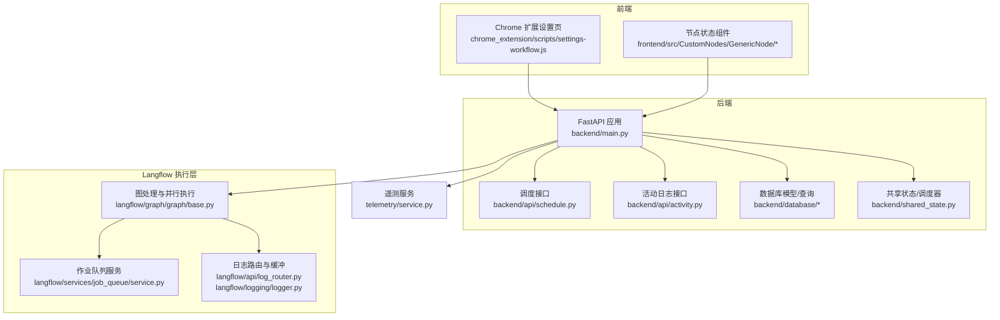
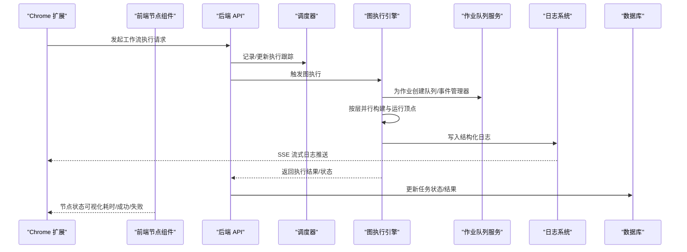
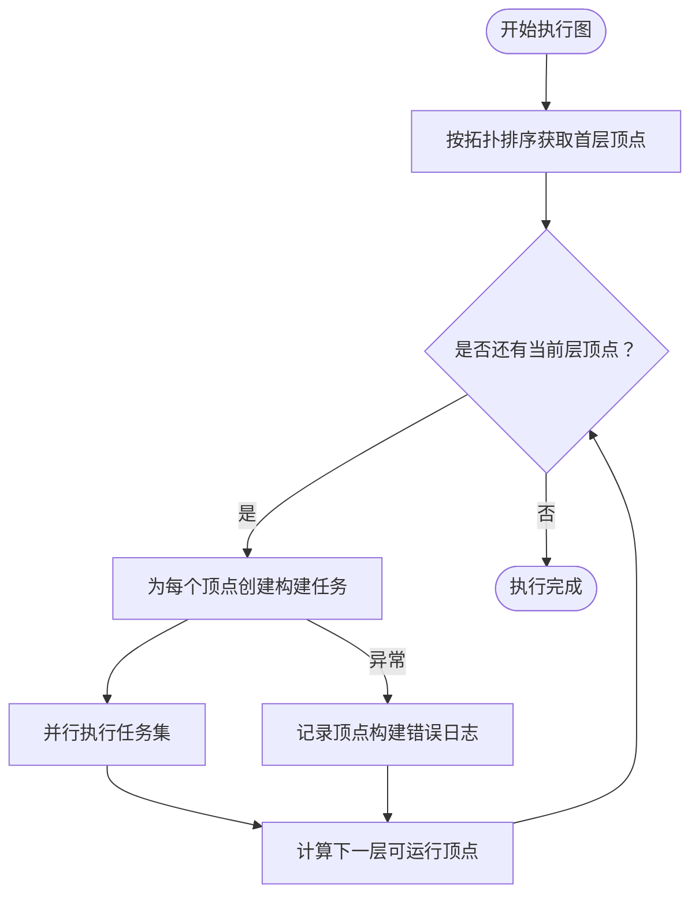
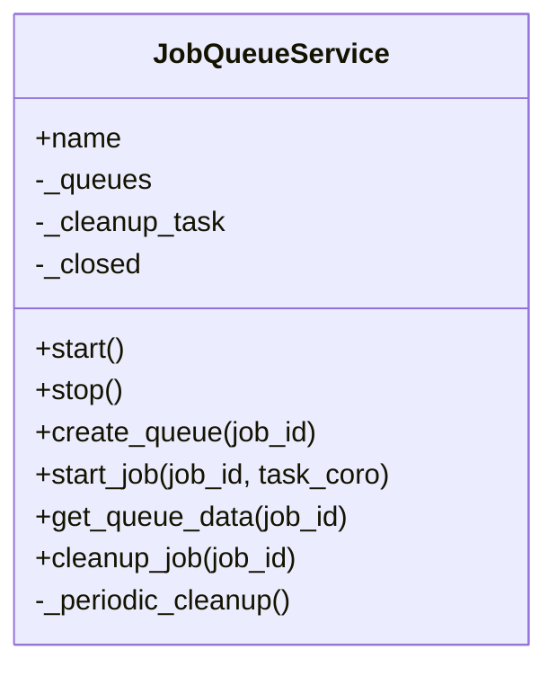
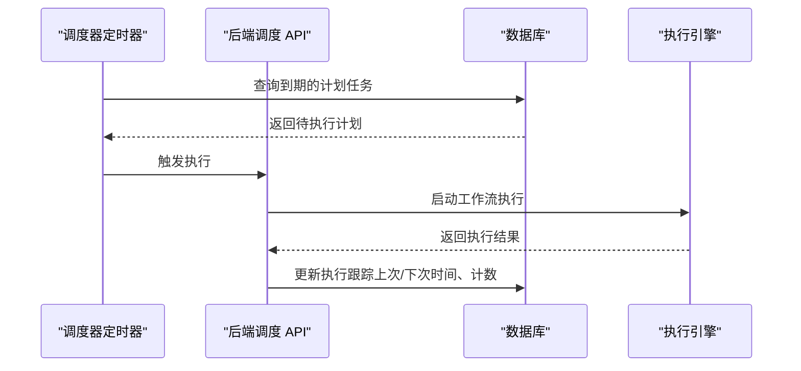
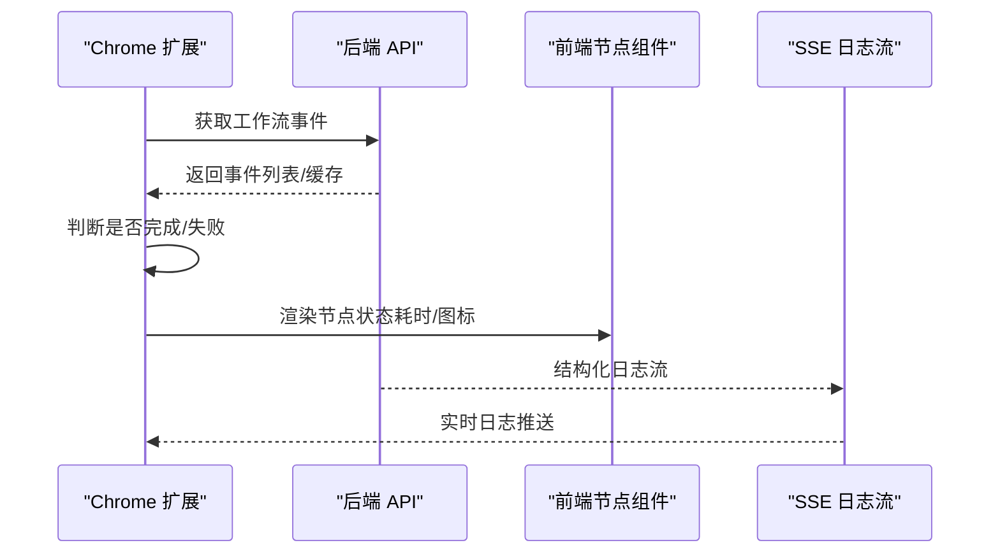
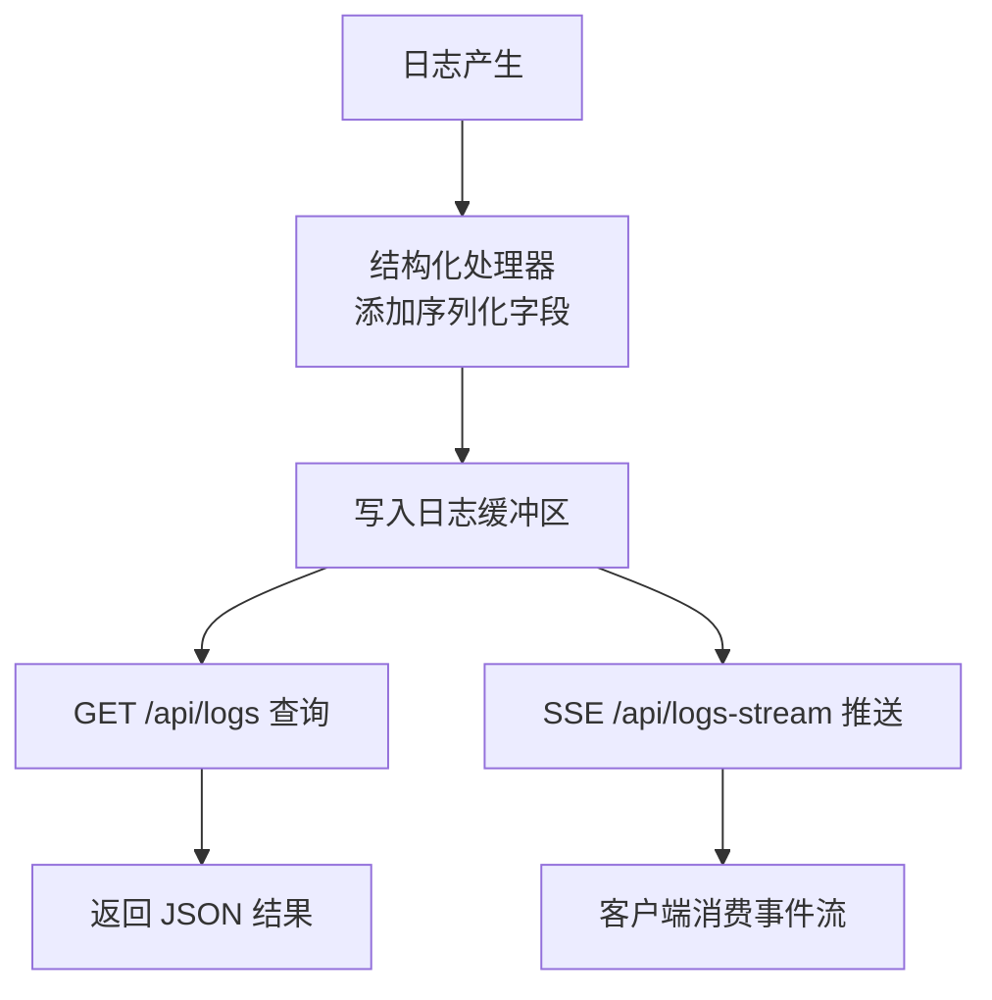
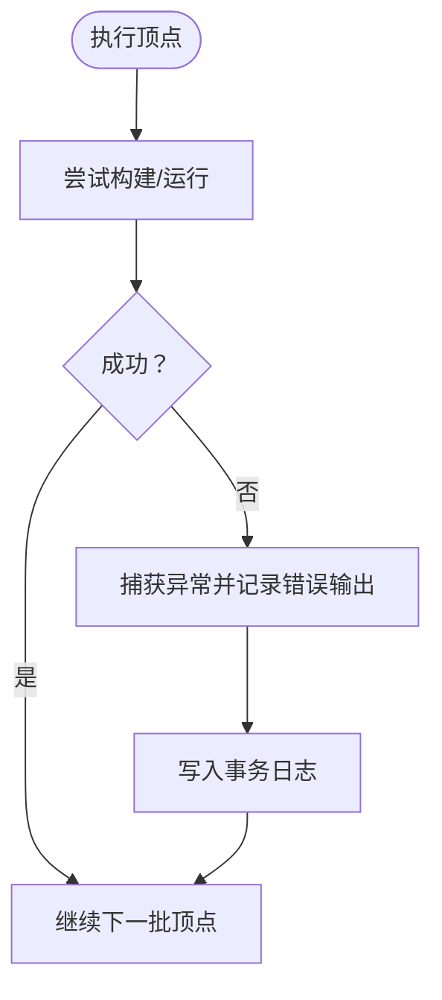
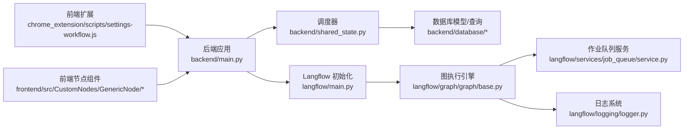

# 工作流执行与监控

<cite>
**本文引用的文件**
- [vibe_surf/backend/main.py](file://vibe_surf/backend/main.py)
- [vibe_surf/backend/api/schedule.py](file://vibe_surf/backend/api/schedule.py)
- [vibe_surf/backend/database/models.py](file://vibe_surf/backend/database/models.py)
- [vibe_surf/backend/database/queries.py](file://vibe_surf/backend/database/queries.py)
- [vibe_surf/backend/api/activity.py](file://vibe_surf/backend/api/activity.py)
- [vibe_surf/backend/shared_state.py](file://vibe_surf/backend/shared_state.py)
- [vibe_surf/langflow/main.py](file://vibe_surf/langflow/main.py)
- [vibe_surf/langflow/services/job_queue/service.py](file://vibe_surf/langflow/services/job_queue/service.py)
- [vibe_surf/langflow/graph/graph/base.py](file://vibe_surf/langflow/graph/graph/base.py)
- [vibe_surf/langflow/api/log_router.py](file://vibe_surf/langflow/api/log_router.py)
- [vibe_surf/langflow/logging/logger.py](file://vibe_surf/langflow/logging/logger.py)
- [vibe_surf/telemetry/service.py](file://vibe_surf/telemetry/service.py)
- [vibe_surf/chrome_extension/scripts/settings-workflow.js](file://vibe_surf/chrome_extension/scripts/settings-workflow.js)
- [vibe_surf/frontend/src/CustomNodes/GenericNode/index.tsx](file://vibe_surf/frontend/src/CustomNodes/GenericNode/index.tsx)
- [vibe_surf/frontend/src/CustomNodes/GenericNode/components/NodeStatus/index.tsx](file://vibe_surf/frontend/src/CustomNodes/GenericNode/components/NodeStatus/index.tsx)
</cite>

## 目录
1. [简介](#简介)
2. [项目结构](#项目结构)
3. [核心组件](#核心组件)
4. [架构总览](#架构总览)
5. [详细组件分析](#详细组件分析)
6. [依赖分析](#依赖分析)
7. [性能考虑](#性能考虑)
8. [故障排查指南](#故障排查指南)
9. [结论](#结论)

## 简介
本文件系统性地文档化 VibeSurf 中“工作流”的执行机制与监控能力，覆盖以下主题：
- 执行引擎架构：任务调度、并行处理、资源管理
- 实时监控：进度指示、节点状态可视化、性能指标展示
- 日志体系：日志结构、流式与离线查询、定位执行问题
- 错误处理：异常捕获、重试策略、回滚方案
- 性能监控与优化：瓶颈识别与效率提升建议

## 项目结构
VibeSurf 的工作流执行由后端 FastAPI 应用与 Langflow 执行引擎协同完成，并通过前端扩展与前端页面提供可视化与交互体验。关键模块分布如下：
- 后端应用入口与生命周期管理：backend/main.py
- 调度与计划任务：backend/api/schedule.py、backend/database/models.py、backend/database/queries.py、backend/shared_state.py
- 任务与会话活动日志：backend/api/activity.py、backend/database/models.py、backend/database/queries.py
- 执行引擎与图处理：langflow/graph/graph/base.py
- 队列与作业管理：langflow/services/job_queue/service.py
- 日志采集与流式输出：langflow/api/log_router.py、langflow/logging/logger.py
- 前端扩展与节点状态：chrome_extension/scripts/settings-workflow.js、frontend/src/CustomNodes/GenericNode/*
- 遥测与事件上报：telemetry/service.py

图表来源
- [vibe_surf/backend/main.py](file://vibe_surf/backend/main.py#L543-L731)
- [vibe_surf/backend/api/schedule.py](file://vibe_surf/backend/api/schedule.py#L1-L33)
- [vibe_surf/backend/api/activity.py](file://vibe_surf/backend/api/activity.py#L1-L246)
- [vibe_surf/backend/database/models.py](file://vibe_surf/backend/database/models.py#L94-L137)
- [vibe_surf/backend/database/queries.py](file://vibe_surf/backend/database/queries.py#L441-L754)
- [vibe_surf/backend/shared_state.py](file://vibe_surf/backend/shared_state.py#L706-L1089)
- [vibe_surf/langflow/graph/graph/base.py](file://vibe_surf/langflow/graph/graph/base.py#L1579-L1723)
- [vibe_surf/langflow/services/job_queue/service.py](file://vibe_surf/langflow/services/job_queue/service.py#L1-L302)
- [vibe_surf/langflow/api/log_router.py](file://vibe_surf/langflow/api/log_router.py#L1-L104)
- [vibe_surf/langflow/logging/logger.py](file://vibe_surf/langflow/logging/logger.py#L1-L200)
- [vibe_surf/telemetry/service.py](file://vibe_surf/telemetry/service.py#L1-L114)
- [vibe_surf/chrome_extension/scripts/settings-workflow.js](file://vibe_surf/chrome_extension/scripts/settings-workflow.js#L1288-L1678)
- [vibe_surf/frontend/src/CustomNodes/GenericNode/index.tsx](file://vibe_surf/frontend/src/CustomNodes/GenericNode/index.tsx#L367-L381)
- [vibe_surf/frontend/src/CustomNodes/GenericNode/components/NodeStatus/index.tsx](file://vibe_surf/frontend/src/CustomNodes/GenericNode/components/NodeStatus/index.tsx#L28-L421)

章节来源
- [vibe_surf/backend/main.py](file://vibe_surf/backend/main.py#L543-L731)
- [vibe_surf/langflow/main.py](file://vibe_surf/langflow/main.py#L345-L475)

## 核心组件
- 后端应用与生命周期：负责启动 Langflow 子系统、初始化调度器、浏览器连接监控、健康检查与异常处理。
- 调度与计划任务：基于 Cron 表达式的周期执行，维护下一次执行时间与执行计数。
- 图执行引擎：按层并行构建与运行顶点，支持并发与错误回写。
- 作业队列服务：为每个作业创建独立队列与事件管理器，支持任务启动、取消与清理。
- 日志系统：结构化日志缓冲、SSE 流式日志、离线查询接口。
- 前端扩展与节点状态：扩展侧发起工作流执行、订阅事件、缓存事件并可视化状态；前端节点组件展示节点运行时状态与耗时。
- 遥测：匿名化事件上报，用于产品使用统计与健康度观测。

章节来源
- [vibe_surf/backend/main.py](file://vibe_surf/backend/main.py#L327-L482)
- [vibe_surf/backend/api/schedule.py](file://vibe_surf/backend/api/schedule.py#L1-L33)
- [vibe_surf/backend/database/models.py](file://vibe_surf/backend/database/models.py#L258-L289)
- [vibe_surf/backend/database/queries.py](file://vibe_surf/backend/database/queries.py#L441-L754)
- [vibe_surf/langflow/graph/graph/base.py](file://vibe_surf/langflow/graph/graph/base.py#L1579-L1723)
- [vibe_surf/langflow/services/job_queue/service.py](file://vibe_surf/langflow/services/job_queue/service.py#L1-L302)
- [vibe_surf/langflow/api/log_router.py](file://vibe_surf/langflow/api/log_router.py#L1-L104)
- [vibe_surf/langflow/logging/logger.py](file://vibe_surf/langflow/logging/logger.py#L1-L200)
- [vibe_surf/chrome_extension/scripts/settings-workflow.js](file://vibe_surf/chrome_extension/scripts/settings-workflow.js#L1288-L1678)
- [vibe_surf/frontend/src/CustomNodes/GenericNode/index.tsx](file://vibe_surf/frontend/src/CustomNodes/GenericNode/index.tsx#L367-L381)
- [vibe_surf/frontend/src/CustomNodes/GenericNode/components/NodeStatus/index.tsx](file://vibe_surf/frontend/src/CustomNodes/GenericNode/components/NodeStatus/index.tsx#L28-L421)
- [vibe_surf/telemetry/service.py](file://vibe_surf/telemetry/service.py#L1-L114)

## 架构总览
后端应用在启动时初始化 Langflow 子系统（包含服务、缓存、MCP 组件等），随后启动调度器与浏览器连接监控。工作流执行由 Langflow 的图执行引擎驱动，按层并行构建与运行顶点，同时通过作业队列服务为每个作业提供隔离的队列与事件管理。前端扩展与前端节点组件负责可视化与交互，结合 SSE 日志与活动日志接口实现实时监控。

图表来源
- [vibe_surf/backend/main.py](file://vibe_surf/backend/main.py#L327-L482)
- [vibe_surf/backend/api/schedule.py](file://vibe_surf/backend/api/schedule.py#L1-L33)
- [vibe_surf/backend/database/queries.py](file://vibe_surf/backend/database/queries.py#L441-L754)
- [vibe_surf/langflow/graph/graph/base.py](file://vibe_surf/langflow/graph/graph/base.py#L1579-L1723)
- [vibe_surf/langflow/services/job_queue/service.py](file://vibe_surf/langflow/services/job_queue/service.py#L1-L302)
- [vibe_surf/langflow/api/log_router.py](file://vibe_surf/langflow/api/log_router.py#L1-L104)
- [vibe_surf/chrome_extension/scripts/settings-workflow.js](file://vibe_surf/chrome_extension/scripts/settings-workflow.js#L1288-L1678)
- [vibe_surf/frontend/src/CustomNodes/GenericNode/index.tsx](file://vibe_surf/frontend/src/CustomNodes/GenericNode/index.tsx#L367-L381)

## 详细组件分析

### 执行引擎与并行处理
- 层级并行执行：图按拓扑排序分层，每层顶点并行构建与运行，使用 asyncio 任务池与锁控制。
- 异常处理：单个顶点构建失败时，构造错误输出并记录到事务日志，不影响其他顶点的执行。
- 事件与缓存：构建过程中可读取/写入聊天服务缓存，便于复用中间结果。

图表来源
- [vibe_surf/langflow/graph/graph/base.py](file://vibe_surf/langflow/graph/graph/base.py#L1579-L1723)

章节来源
- [vibe_surf/langflow/graph/graph/base.py](file://vibe_surf/langflow/graph/graph/base.py#L1579-L1723)

### 作业队列与资源管理
- 作业隔离：为每个作业创建独立队列与事件管理器，避免相互干扰。
- 生命周期管理：支持启动新任务、取消旧任务、清理队列与任务、周期性清理已失败或取消的任务。
- 清理策略：失败/取消的任务标记清理时间戳，经过宽限期后实际清理，保障可观测性与恢复空间。

图表来源
- [vibe_surf/langflow/services/job_queue/service.py](file://vibe_surf/langflow/services/job_queue/service.py#L1-L302)

章节来源
- [vibe_surf/langflow/services/job_queue/service.py](file://vibe_surf/langflow/services/job_queue/service.py#L1-L302)

### 调度与计划任务
- 数据模型：Schedule 表存储 Cron 表达式、启用状态、最近/下次执行时间、执行计数等。
- 接口：提供创建/更新/查询计划任务的 API。
- 运行逻辑：后台定时扫描到期的计划任务，触发执行并更新执行跟踪（下次执行时间、计数等）。

图表来源
- [vibe_surf/backend/api/schedule.py](file://vibe_surf/backend/api/schedule.py#L1-L33)
- [vibe_surf/backend/database/models.py](file://vibe_surf/backend/database/models.py#L258-L289)
- [vibe_surf/backend/shared_state.py](file://vibe_surf/backend/shared_state.py#L706-L1089)

章节来源
- [vibe_surf/backend/api/schedule.py](file://vibe_surf/backend/api/schedule.py#L1-L33)
- [vibe_surf/backend/database/models.py](file://vibe_surf/backend/database/models.py#L258-L289)
- [vibe_surf/backend/shared_state.py](file://vibe_surf/backend/shared_state.py#L706-L1089)

### 实时监控与可视化
- 前端扩展：扩展侧发起执行、订阅事件、缓存事件并根据事件类型判断完成/失败，停止监控并更新 UI。
- 节点状态：节点组件监听执行历史，展示节点输出消息、耗时与状态图标。
- 活动日志：后端提供会话级活动日志接口，返回 VibeSurf Agent 的实时日志与任务信息。

图表来源
- [vibe_surf/chrome_extension/scripts/settings-workflow.js](file://vibe_surf/chrome_extension/scripts/settings-workflow.js#L1288-L1678)
- [vibe_surf/frontend/src/CustomNodes/GenericNode/index.tsx](file://vibe_surf/frontend/src/CustomNodes/GenericNode/index.tsx#L367-L381)
- [vibe_surf/frontend/src/CustomNodes/GenericNode/components/NodeStatus/index.tsx](file://vibe_surf/frontend/src/CustomNodes/GenericNode/components/NodeStatus/index.tsx#L28-L421)
- [vibe_surf/backend/api/activity.py](file://vibe_surf/backend/api/activity.py#L1-L246)
- [vibe_surf/langflow/api/log_router.py](file://vibe_surf/langflow/api/log_router.py#L1-L104)

章节来源
- [vibe_surf/chrome_extension/scripts/settings-workflow.js](file://vibe_surf/chrome_extension/scripts/settings-workflow.js#L1288-L1678)
- [vibe_surf/frontend/src/CustomNodes/GenericNode/index.tsx](file://vibe_surf/frontend/src/CustomNodes/GenericNode/index.tsx#L367-L381)
- [vibe_surf/frontend/src/CustomNodes/GenericNode/components/NodeStatus/index.tsx](file://vibe_surf/frontend/src/CustomNodes/GenericNode/components/NodeStatus/index.tsx#L28-L421)
- [vibe_surf/backend/api/activity.py](file://vibe_surf/backend/api/activity.py#L1-L246)
- [vibe_surf/langflow/api/log_router.py](file://vibe_surf/langflow/api/log_router.py#L1-L104)

### 日志结构与查询
- 结构化日志缓冲：日志经结构化处理器序列化，写入环形缓冲区，支持按时间戳前后查询与 SSE 流式推送。
- 查询接口：
  - GET /api/logs：按时间戳前后或最后 N 条查询
  - GET /api/logs-stream：SSE 实时流式推送
- 前端集成：扩展侧通过事件订阅与缓存策略，保证事件完整性与完成态持久化。

图表来源
- [vibe_surf/langflow/logging/logger.py](file://vibe_surf/langflow/logging/logger.py#L1-L200)
- [vibe_surf/langflow/api/log_router.py](file://vibe_surf/langflow/api/log_router.py#L1-L104)

章节来源
- [vibe_surf/langflow/logging/logger.py](file://vibe_surf/langflow/logging/logger.py#L1-L200)
- [vibe_surf/langflow/api/log_router.py](file://vibe_surf/langflow/api/log_router.py#L1-L104)

### 错误处理与回滚
- 顶点构建异常：捕获异常并构造错误输出，记录到事务日志，不影响其他顶点。
- 作业失败清理：作业队列服务对失败/取消的任务进行标记与宽限期清理，保留可观测性。
- 前端监控：扩展侧检测结束事件（如 on_end/end/completed/error/stream_end），停止监控并提示用户。

图表来源
- [vibe_surf/langflow/graph/graph/base.py](file://vibe_surf/langflow/graph/graph/base.py#L1692-L1723)
- [vibe_surf/langflow/services/job_queue/service.py](file://vibe_surf/langflow/services/job_queue/service.py#L253-L302)
- [vibe_surf/chrome_extension/scripts/settings-workflow.js](file://vibe_surf/chrome_extension/scripts/settings-workflow.js#L1390-L1424)

章节来源
- [vibe_surf/langflow/graph/graph/base.py](file://vibe_surf/langflow/graph/graph/base.py#L1692-L1723)
- [vibe_surf/langflow/services/job_queue/service.py](file://vibe_surf/langflow/services/job_queue/service.py#L253-L302)
- [vibe_surf/chrome_extension/scripts/settings-workflow.js](file://vibe_surf/chrome_extension/scripts/settings-workflow.js#L1390-L1424)

## 依赖分析
- 后端应用依赖 Langflow 初始化流程（服务、缓存、MCP、队列），并在生命周期内启动调度器与浏览器监控。
- 调度器依赖数据库模型与查询操作，维护计划任务的执行跟踪。
- 图执行引擎依赖作业队列服务与日志系统，确保并发与可观测性。
- 前端扩展与前端节点组件依赖后端活动日志与 SSE 日志流，实现可视化与交互。

图表来源
- [vibe_surf/backend/main.py](file://vibe_surf/backend/main.py#L327-L482)
- [vibe_surf/langflow/main.py](file://vibe_surf/langflow/main.py#L345-L475)
- [vibe_surf/backend/shared_state.py](file://vibe_surf/backend/shared_state.py#L706-L1089)
- [vibe_surf/backend/database/models.py](file://vibe_surf/backend/database/models.py#L94-L137)
- [vibe_surf/backend/database/queries.py](file://vibe_surf/backend/database/queries.py#L441-L754)
- [vibe_surf/langflow/graph/graph/base.py](file://vibe_surf/langflow/graph/graph/base.py#L1579-L1723)
- [vibe_surf/langflow/services/job_queue/service.py](file://vibe_surf/langflow/services/job_queue/service.py#L1-L302)
- [vibe_surf/langflow/logging/logger.py](file://vibe_surf/langflow/logging/logger.py#L1-L200)
- [vibe_surf/chrome_extension/scripts/settings-workflow.js](file://vibe_surf/chrome_extension/scripts/settings-workflow.js#L1288-L1678)
- [vibe_surf/frontend/src/CustomNodes/GenericNode/index.tsx](file://vibe_surf/frontend/src/CustomNodes/GenericNode/index.tsx#L367-L381)

章节来源
- [vibe_surf/backend/main.py](file://vibe_surf/backend/main.py#L327-L482)
- [vibe_surf/langflow/main.py](file://vibe_surf/langflow/main.py#L345-L475)

## 性能考虑
- 并行度控制：图执行按层并行，建议合理设计图结构以最大化并行收益，避免过度依赖串行边。
- 队列与清理：利用作业队列服务的宽限期清理策略，减少频繁创建销毁带来的开销；失败任务及时清理，避免资源泄漏。
- 日志缓冲：通过环境变量调整日志缓冲大小，平衡内存占用与可观测性；SSE 流式日志适合实时场景，离线查询适合批量分析。
- 数据库索引：计划任务表的关键字段（启用、下次执行时间、Cron 表达式）已建立索引，有助于高效筛选到期任务。
- 前端缓存策略：扩展侧对事件缓存采用“永不覆盖更少事件”与“完成态持久化”策略，减少网络竞争与重复渲染。

[本节为通用指导，不直接分析具体文件]

## 故障排查指南
- 无法获取日志：
  - 检查日志缓冲是否启用与缓冲大小配置
  - 使用 /api/logs-stream 或 /api/logs 查询接口确认可用性
- 执行未触发：
  - 检查计划任务 Cron 表达式与启用状态
  - 查看数据库 schedules 表的 next_execution_at 是否正确更新
- 顶点构建失败：
  - 查看图执行日志与事务日志，定位异常堆栈
  - 检查顶点输入参数与依赖组件可用性
- 前端状态不更新：
  - 确认事件订阅是否建立，扩展侧是否检测到完成事件
  - 检查节点组件是否正确解析执行历史输出

章节来源
- [vibe_surf/langflow/api/log_router.py](file://vibe_surf/langflow/api/log_router.py#L1-L104)
- [vibe_surf/backend/database/models.py](file://vibe_surf/backend/database/models.py#L258-L289)
- [vibe_surf/backend/shared_state.py](file://vibe_surf/backend/shared_state.py#L706-L1089)
- [vibe_surf/langflow/graph/graph/base.py](file://vibe_surf/langflow/graph/graph/base.py#L1692-L1723)
- [vibe_surf/chrome_extension/scripts/settings-workflow.js](file://vibe_surf/chrome_extension/scripts/settings-workflow.js#L1390-L1424)

## 结论
VibeSurf 的工作流执行与监控体系以“后端应用 + Langflow 执行引擎 + 前端扩展/节点组件”为核心，实现了从计划调度、图并行执行、作业隔离、日志可观测到前端可视化的完整闭环。通过合理的并行设计、队列清理策略与日志缓冲，系统在保证稳定性的同时提供了良好的可观测性与用户体验。建议在生产环境中结合日志查询与活动日志接口进行持续监控，并根据业务负载调优图结构与队列参数。