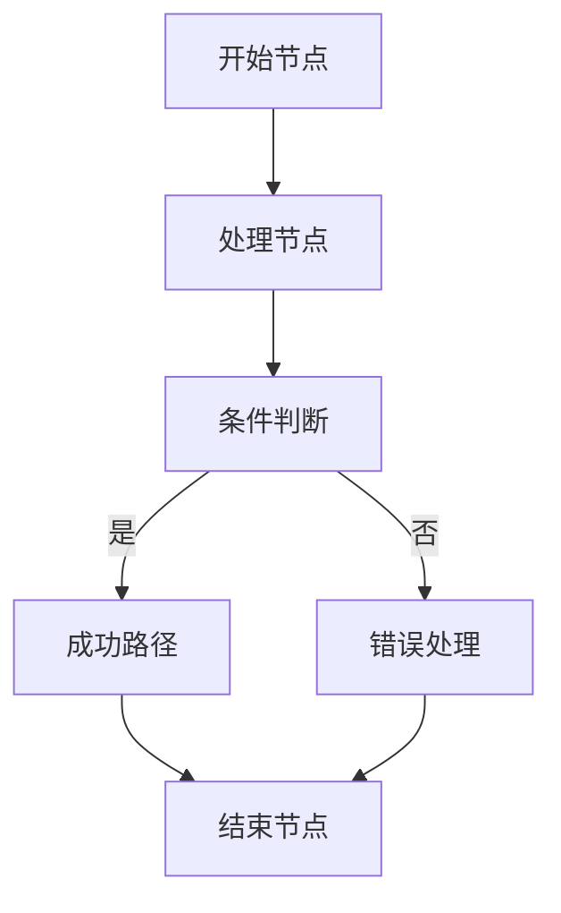

# 调试工具

<cite>
**本文档引用的文件**
- [settings-workflow.js](file://vibe_surf/chrome_extension/scripts/settings-workflow.js)
- [logger.py](file://vibe_surf/langflow/logging/logger.py)
- [log_router.py](file://vibe_surf/langflow/api/log_router.py)
- [variable_manager.py](file://vibe_surf/workflows/VibeSurf/variable_manager.py)
- [GenericNode/index.tsx](file://vibe_surf/frontend/src/CustomNodes/GenericNode/index.tsx)
- [GlobalVariablesPage/index.tsx](file://vibe_surf/frontend/src/pages/SettingsPage/pages/GlobalVariablesPage/index.tsx)
- [flowStore.ts](file://vibe_surf/frontend/src/stores/flowStore.ts)
- [settings-workflow.css](file://vibe_surf/chrome_extension/styles/settings-workflow.css)
</cite>

## 目录
1. [日志查看器](#日志查看器)
2. [执行轨迹可视化工具](#执行轨迹可视化工具)
3. [变量监视器](#变量监视器)
4. [断点调试功能](#断点调试功能)
5. [常见问题诊断与解决方案](#常见问题诊断与解决方案)

## 日志查看器

VibeSurf的日志查看器提供了一个功能丰富的界面，用于监控和分析工作流的执行过程。该工具支持日志过滤、搜索、高亮和导出功能，帮助用户快速定位问题。

日志查看器通过`settings-workflow.js`中的`renderEnhancedLogEntry`方法渲染日志条目，每个条目包含时间戳、事件类型、消息内容和详细信息。日志条目根据事件类型和级别进行分类，使用不同的图标和颜色进行视觉区分，如错误事件使用❌图标，成功事件使用✅图标。

日志条目支持展开/折叠详细信息，用户可以通过点击"Details"按钮查看事件的完整数据。日志条目还显示相对时间（如"5m ago"），便于快速判断事件发生的时间。日志查看器支持按时间范围检索日志，通过`logs`API端点获取指定时间点前后的日志条目。

**Section sources**
- [settings-workflow.js](file://vibe_surf/chrome_extension/scripts/settings-workflow.js#L1949-L2165)
- [logger.py](file://vibe_surf/langflow/logging/logger.py#L1-L408)
- [log_router.py](file://vibe_surf/langflow/api/log_router.py#L1-L104)
- [settings-workflow.css](file://vibe_surf/chrome_extension/styles/settings-workflow.css#L1065-L1121)

## 执行轨迹可视化工具

执行轨迹可视化工具通过图形化界面展示工作流的执行路径，帮助用户理解组件之间的交互和数据流动。该工具在前端通过`GenericNode`组件实现，实时显示每个节点的执行状态。

当工作流执行时，节点的历史记录存储在`flowPool`中，最新执行结果通过`useEffect`钩子监听并更新UI。每个节点显示其输出结果，包括文本、图像或视频等媒体内容。执行状态通过`buildStatus`反映，包括构建中、成功、错误等状态。

可视化工具支持查看节点的输入参数和输出结果，用户可以展开隐藏的输出端口查看详细信息。节点工具栏提供操作按钮，如编辑、删除和更新组件。执行媒体（如截图或视频）可以直接在节点下方显示，便于快速验证执行结果。



**Diagram sources**
- [GenericNode/index.tsx](file://vibe_surf/frontend/src/CustomNodes/GenericNode/index.tsx#L367-L381)
- [flowStore.ts](file://vibe_surf/frontend/src/stores/flowStore.ts#L168-L205)

**Section sources**
- [GenericNode/index.tsx](file://vibe_surf/frontend/src/CustomNodes/GenericNode/index.tsx#L1-L750)
- [flowStore.ts](file://vibe_surf/frontend/src/stores/flowStore.ts#L1-L1101)

## 变量监视器

变量监视器允许用户实时查看和修改工作流执行过程中的变量状态。该功能通过`VariableManagerComponent`实现，提供一个表格界面管理键值对变量。

变量管理器支持多种数据类型，包括字符串、整数、浮点数、布尔值、字典和列表。用户可以在表格中直接编辑变量的键、值、描述和类型。变量值的类型转换在`build_variables`方法中处理，根据指定类型自动转换值。

变量监视器还支持通过JSON输入批量更新变量，输入格式为`{"key": "value", "key2": "value2"}`。当JSON输入包含新变量时，会自动添加到变量表中；如果变量已存在，则更新其值。变量管理器的输出为`Data`对象，包含所有变量的键值对。

```mermaid
classDiagram
class VariableManagerComponent {
+display_name : string
+description : string
+icon : string
+name : string
+inputs : Array
+outputs : Array
+build_variables() : Data
}
VariableManagerComponent --> Data : "输出"
Data : data : Dict[string, Any]
```

**Diagram sources**
- [variable_manager.py](file://vibe_surf/workflows/VibeSurf/variable_manager.py#L1-L141)

**Section sources**
- [variable_manager.py](file://vibe_surf/workflows/VibeSurf/variable_manager.py#L1-L141)
- [GlobalVariablesPage/index.tsx](file://vibe_surf/frontend/src/pages/SettingsPage/pages/GlobalVariablesPage/index.tsx#L1-L156)

## 断点调试功能

断点调试功能允许用户在工作流执行过程中暂停执行，检查变量状态和执行上下文。虽然代码中没有明确的断点实现，但通过`stop_vertex`机制实现了类似功能。

在`graph/base.py`中，`stop_vertex`属性用于指定工作流构建的停止点。当执行到指定顶点时，会移除其他可运行顶点，实现条件性停止。这种机制可用于实现条件断点，当满足特定条件时停止执行。

日志断点通过日志记录实现，系统在关键执行点（如组件开始、结束、错误）生成日志事件。用户可以通过日志查看器监控这些事件，相当于在代码中插入了日志断点。执行轨迹可视化工具也提供了类似功能，通过节点状态变化反映执行进度。

**Section sources**
- [graph/base.py](file://vibe_surf/langflow/graph/graph/base.py#L80-L950)
- [settings-workflow.js](file://vibe_surf/chrome_extension/scripts/settings-workflow.js#L2010-L2021)

## 常见问题诊断与解决方案

### 日志查看器问题
**问题**：日志条目不显示或显示不完整
**解决方案**：检查日志缓冲区是否启用，确保`log_buffer.enabled()`返回`True`。验证日志级别设置是否正确，避免过滤掉重要日志。

### 执行轨迹问题
**问题**：节点状态不更新或显示错误
**解决方案**：检查`flowPool`是否正确更新，确保`updateFlowPool`方法被正确调用。验证节点的`buildStatus`是否与实际执行状态匹配。

### 变量监视器问题
**问题**：变量类型转换失败
**解决方案**：检查输入值是否符合指定类型要求。对于字典和列表类型，确保输入为有效的JSON格式。使用`json_repair`库自动修复格式错误的JSON。

### 断点调试问题
**问题**：执行未在预期点停止
**解决方案**：验证`stop_vertex`设置是否正确，确保顶点ID与工作流中的实际ID匹配。检查条件路由逻辑，确保条件断点的触发条件正确。

**Section sources**
- [logger.py](file://vibe_surf/langflow/logging/logger.py#L1-L408)
- [flowStore.ts](file://vibe_surf/frontend/src/stores/flowStore.ts#L631-L800)
- [variable_manager.py](file://vibe_surf/workflows/VibeSurf/variable_manager.py#L100-L139)