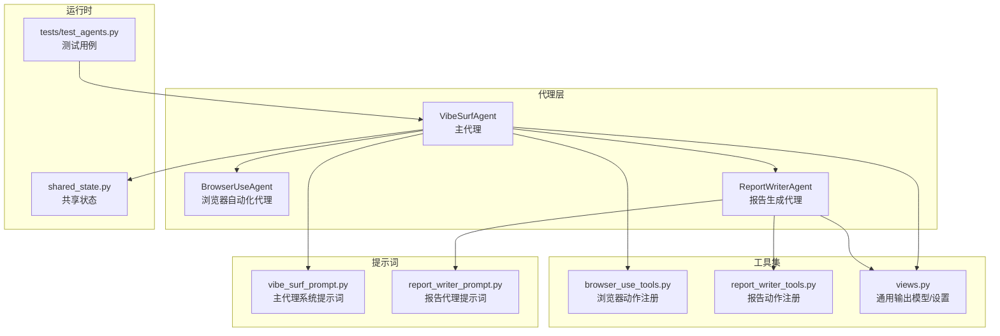
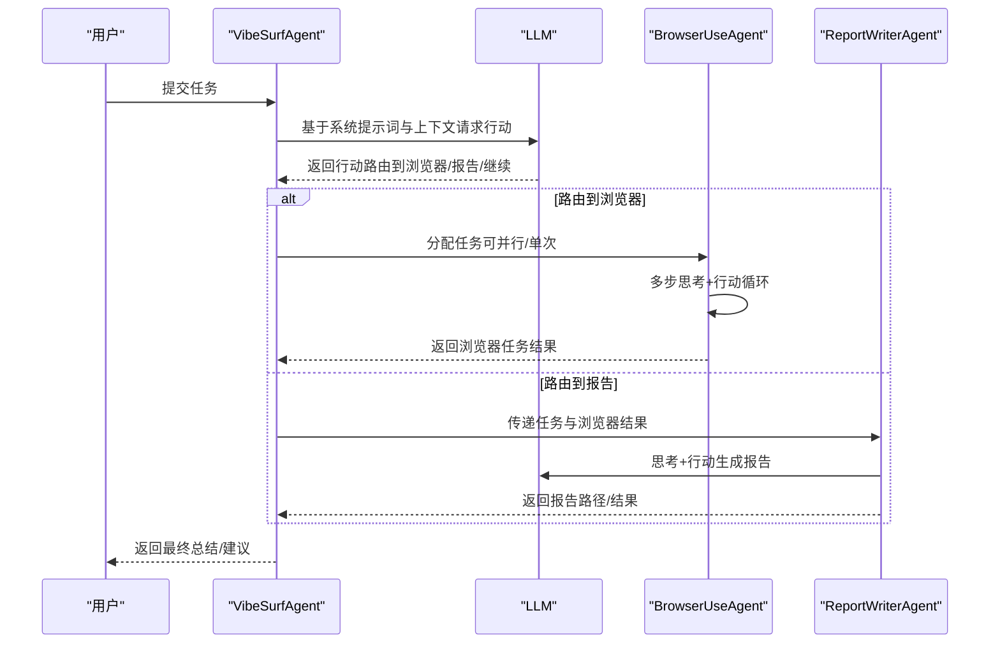
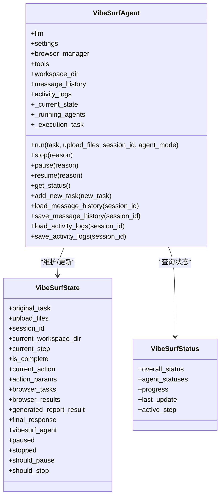
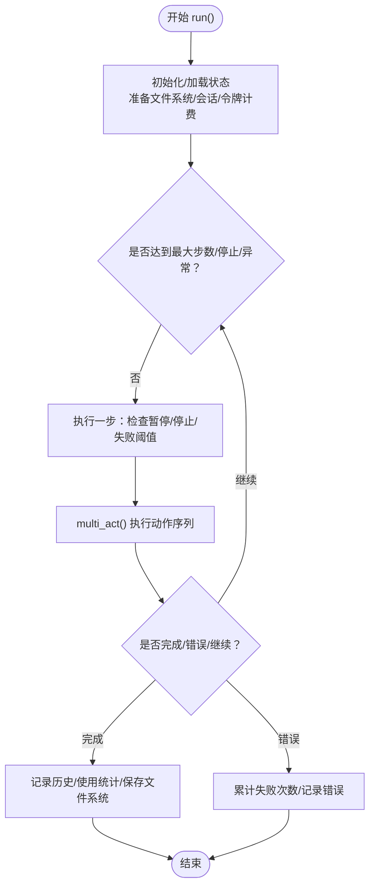
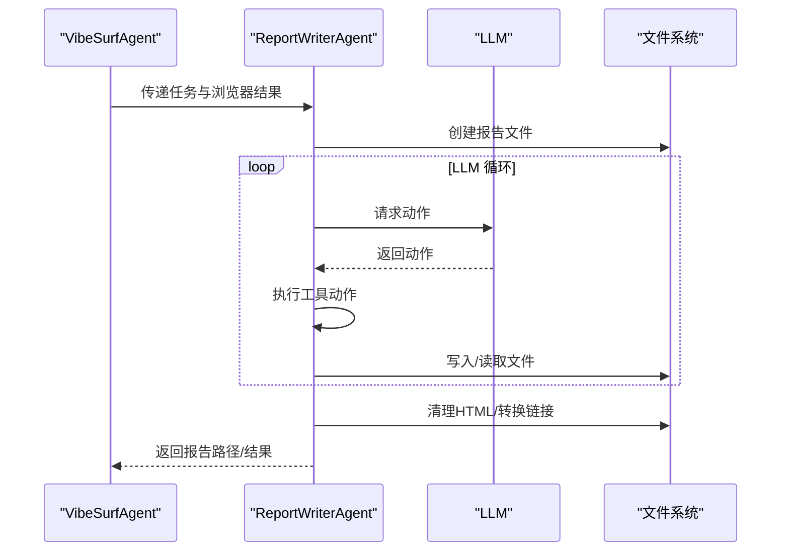
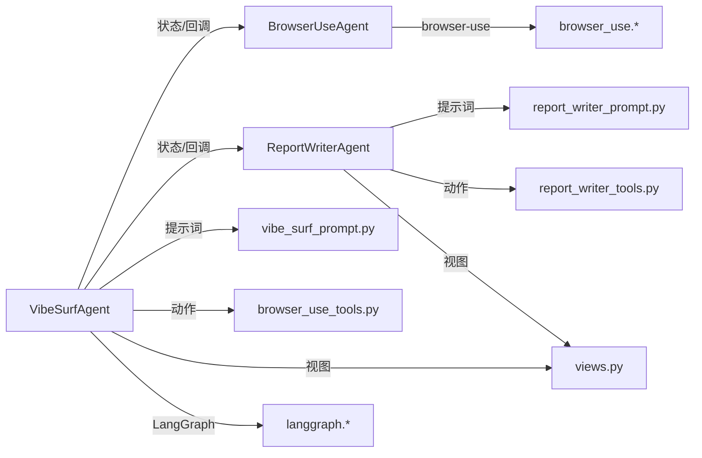

# 代理系统结构

<cite>
**本文引用的文件**
- [vibe_surf/agents/vibe_surf_agent.py](file://vibe_surf/agents/vibe_surf_agent.py)
- [vibe_surf/agents/browser_use_agent.py](file://vibe_surf/agents/browser_use_agent.py)
- [vibe_surf/agents/report_writer_agent.py](file://vibe_surf/agents/report_writer_agent.py)
- [vibe_surf/agents/prompts/vibe_surf_prompt.py](file://vibe_surf/agents/prompts/vibe_surf_prompt.py)
- [vibe_surf/agents/prompts/report_writer_prompt.py](file://vibe_surf/agents/prompts/report_writer_prompt.py)
- [vibe_surf/agents/views.py](file://vibe_surf/agents/views.py)
- [vibe_surf/tools/browser_use_tools.py](file://vibe_surf/tools/browser_use_tools.py)
- [vibe_surf/tools/report_writer_tools.py](file://vibe_surf/tools/report_writer_tools.py)
- [vibe_surf/backend/shared_state.py](file://vibe_surf/backend/shared_state.py)
- [tests/test_agents.py](file://tests/test_agents.py)
</cite>

## 目录
1. [简介](#简介)
2. [项目结构](#项目结构)
3. [核心组件](#核心组件)
4. [架构总览](#架构总览)
5. [详细组件分析](#详细组件分析)
6. [依赖关系分析](#依赖关系分析)
7. [性能考量](#性能考量)
8. [故障排查指南](#故障排查指南)
9. [结论](#结论)
10. [附录](#附录)

## 简介
本文件面向开发者，系统性梳理 VibeSurf 中 AI 代理体系的结构与实现，重点覆盖：
- VibeSurf 主代理（Supervisor Agent）的架构、状态管理与控制流
- 浏览器自动化代理（BrowserUseAgent）的执行机制与浏览器控制逻辑
- 报告生成代理（ReportWriterAgent）的 LLM 驱动流程与输出规范
- 不同代理类型之间的职责划分与协作方式
- 代理与 LLM 的交互流程、提示词管理与响应处理
- 关键类与方法说明，以及扩展与修改建议

## 项目结构
VibeSurf 的代理系统位于 vibe_surf/agents 目录，围绕主代理 VibeSurfAgent 构建，通过 LangGraph 工作流编排浏览器代理与报告代理，并通过工具集（Tools）与提示词（Prompts）实现统一的行动模型与输出格式。

图表来源
- [vibe_surf/agents/vibe_surf_agent.py](file://vibe_surf/agents/vibe_surf_agent.py#L997-L1040)
- [vibe_surf/agents/browser_use_agent.py](file://vibe_surf/agents/browser_use_agent.py#L83-L140)
- [vibe_surf/agents/report_writer_agent.py](file://vibe_surf/agents/report_writer_agent.py#L34-L76)
- [vibe_surf/agents/prompts/vibe_surf_prompt.py](file://vibe_surf/agents/prompts/vibe_surf_prompt.py#L1-L219)
- [vibe_surf/agents/prompts/report_writer_prompt.py](file://vibe_surf/agents/prompts/report_writer_prompt.py#L1-L74)
- [vibe_surf/agents/views.py](file://vibe_surf/agents/views.py#L25-L124)
- [vibe_surf/tools/browser_use_tools.py](file://vibe_surf/tools/browser_use_tools.py#L62-L120)
- [vibe_surf/tools/report_writer_tools.py](file://vibe_surf/tools/report_writer_tools.py#L8-L23)
- [vibe_surf/backend/shared_state.py](file://vibe_surf/backend/shared_state.py#L37-L37)
- [tests/test_agents.py](file://tests/test_agents.py#L229-L382)

章节来源
- [vibe_surf/agents/vibe_surf_agent.py](file://vibe_surf/agents/vibe_surf_agent.py#L997-L1040)
- [vibe_surf/agents/browser_use_agent.py](file://vibe_surf/agents/browser_use_agent.py#L83-L140)
- [vibe_surf/agents/report_writer_agent.py](file://vibe_surf/agents/report_writer_agent.py#L34-L76)
- [vibe_surf/agents/prompts/vibe_surf_prompt.py](file://vibe_surf/agents/prompts/vibe_surf_prompt.py#L1-L219)
- [vibe_surf/agents/prompts/report_writer_prompt.py](file://vibe_surf/agents/prompts/report_writer_prompt.py#L1-L74)
- [vibe_surf/agents/views.py](file://vibe_surf/agents/views.py#L25-L124)
- [vibe_surf/tools/browser_use_tools.py](file://vibe_surf/tools/browser_use_tools.py#L62-L120)
- [vibe_surf/tools/report_writer_tools.py](file://vibe_surf/tools/report_writer_tools.py#L8-L23)
- [vibe_surf/backend/shared_state.py](file://vibe_surf/backend/shared_state.py#L37-L37)
- [tests/test_agents.py](file://tests/test_agents.py#L229-L382)

## 核心组件
- VibeSurfAgent：LangGraph 驱动的主代理，负责任务规划、路由到浏览器/报告代理、状态管理与控制（暂停/恢复/停止）、会话持久化与活动日志记录。
- BrowserUseAgent：基于 browser-use 的浏览器自动化代理，封装 LLM、工具集、文件系统、浏览器会话与步骤回调，支持多步思考/行动循环与并发控制。
- ReportWriterAgent：基于 LLM 的报告生成代理，采用“思考+行动”模式，按提示词要求生成专业 HTML 报告。
- 提示词模块：分别提供主代理与报告代理的系统提示词，约束行为边界与输出格式。
- 工具集：为两类代理注册可调用的动作（如导航、悬停、截图、下载、写文件、完成任务等），统一输出结构与错误处理。
- 视图模型：定义通用输出模型（含 thinking 与 action 字段）与代理设置，支撑不同模式（思考/无思考/闪速）。

章节来源
- [vibe_surf/agents/vibe_surf_agent.py](file://vibe_surf/agents/vibe_surf_agent.py#L1041-L1108)
- [vibe_surf/agents/browser_use_agent.py](file://vibe_surf/agents/browser_use_agent.py#L83-L140)
- [vibe_surf/agents/report_writer_agent.py](file://vibe_surf/agents/report_writer_agent.py#L34-L76)
- [vibe_surf/agents/prompts/vibe_surf_prompt.py](file://vibe_surf/agents/prompts/vibe_surf_prompt.py#L1-L219)
- [vibe_surf/agents/prompts/report_writer_prompt.py](file://vibe_surf/agents/prompts/report_writer_prompt.py#L1-L74)
- [vibe_surf/agents/views.py](file://vibe_surf/agents/views.py#L25-L124)
- [vibe_surf/tools/browser_use_tools.py](file://vibe_surf/tools/browser_use_tools.py#L62-L120)
- [vibe_surf/tools/report_writer_tools.py](file://vibe_surf/tools/report_writer_tools.py#L8-L23)

## 架构总览
VibeSurf 采用“主代理 + 子代理”的分层架构：
- 主代理（VibeSurfAgent）通过 LangGraph 工作流驱动，根据 LLM 输出决定下一步是执行浏览器任务还是生成报告，或继续自身决策循环。
- 浏览器代理（BrowserUseAgent）在独立会话中执行具体网页操作，支持并行与单次执行两种模式，结果回传至主代理。
- 报告代理（ReportWriterAgent）接收浏览器结果与信息，按提示词生成 HTML 报告，完成后返回主代理。

图表来源
- [vibe_surf/agents/vibe_surf_agent.py](file://vibe_surf/agents/vibe_surf_agent.py#L997-L1040)
- [vibe_surf/agents/browser_use_agent.py](file://vibe_surf/agents/browser_use_agent.py#L658-L800)
- [vibe_surf/agents/report_writer_agent.py](file://vibe_surf/agents/report_writer_agent.py#L106-L210)

章节来源
- [vibe_surf/agents/vibe_surf_agent.py](file://vibe_surf/agents/vibe_surf_agent.py#L997-L1040)
- [vibe_surf/agents/browser_use_agent.py](file://vibe_surf/agents/browser_use_agent.py#L658-L800)
- [vibe_surf/agents/report_writer_agent.py](file://vibe_surf/agents/report_writer_agent.py#L106-L210)

## 详细组件分析

### VibeSurfAgent：主代理与状态管理
- 角色与职责
  - 作为“监督者”，负责任务分解、上下文组织、LLM 对话、路由决策与结果汇总。
  - 维护会话消息历史、活动日志、上传文件处理与版本提示。
  - 提供控制接口：stop/pause/resume 及对子代理的暂停/恢复；支持全局状态查询。
- 关键状态与数据结构
  - VibeSurfState：LangGraph 状态容器，包含当前步骤、任务列表、浏览器结果、报告结果、最终响应、控制标志等。
  - VibeSurfStatus/AgentStatus：整体与子代理状态聚合，便于外部监控。
- 控制与并发
  - control_aware_node 包装节点，统一处理暂停/停止信号与轮询等待。
  - _running_agents 字典跟踪运行中的子代理，支持集中控制。
- LLM 交互与提示词
  - 使用 VIBESURF_SYSTEM_PROMPT 作为系统提示词，结合浏览器标签、历史结果、生成报告等上下文。
  - 动态注入工具清单与工具信息，增强 LLM 对可用动作的认知。
- 工作流编排
  - create_vibe_surf_workflow 定义节点与条件边，实现“主代理→浏览器/报告→主代理→结束”的闭环。
  - route_after_vibesurf_agent/route_after_* 决策函数决定下一步走向。
- 文件与会话
  - 会话级消息历史与活动日志持久化，支持跨会话加载与恢复。
  - 上传文件相对路径转绝对链接，便于报告与日志引用。

图表来源
- [vibe_surf/agents/vibe_surf_agent.py](file://vibe_surf/agents/vibe_surf_agent.py#L1041-L1108)
- [vibe_surf/agents/vibe_surf_agent.py](file://vibe_surf/agents/vibe_surf_agent.py#L1172-L1311)
- [vibe_surf/agents/vibe_surf_agent.py](file://vibe_surf/agents/vibe_surf_agent.py#L1393-L1470)
- [vibe_surf/agents/vibe_surf_agent.py](file://vibe_surf/agents/vibe_surf_agent.py#L1591-L1738)

章节来源
- [vibe_surf/agents/vibe_surf_agent.py](file://vibe_surf/agents/vibe_surf_agent.py#L1041-L1108)
- [vibe_surf/agents/vibe_surf_agent.py](file://vibe_surf/agents/vibe_surf_agent.py#L1172-L1311)
- [vibe_surf/agents/vibe_surf_agent.py](file://vibe_surf/agents/vibe_surf_agent.py#L1393-L1470)
- [vibe_surf/agents/vibe_surf_agent.py](file://vibe_surf/agents/vibe_surf_agent.py#L1591-L1738)

### BrowserUseAgent：浏览器自动化代理
- 角色与职责
  - 在指定浏览器会话中执行网页自动化任务，支持多步思考+行动、截图、下载媒体、悬停元素、导航、搜索等。
  - 通过 Tools 注册的动作集合实现可组合的网页操作。
- 关键能力
  - 初始化与配置：浏览器会话、文件系统、令牌计费、系统提示词扩展、步骤回调、超时与失败阈值。
  - 运行循环：run() 中的多步执行、暂停/恢复、停止检测、信号处理、历史记录与使用统计。
  - 动作执行：multi_act() 串行执行动作，支持 done 语义与错误处理。
  - 文件系统：在代理专属目录下保存截图、下载、代码等产物，支持相对路径到 file:// URL 的转换。
- 浏览器控制逻辑
  - 通过 CDP 会话进行元素定位、鼠标事件、页面导航与历史回退。
  - 支持 XPath/CSS 选择器/索引三种定位方式，定位失败时抛出错误并记录。
  - 提供“发光效果”可视化反馈，便于调试。
- 并发与资源管理
  - 支持单任务与多任务并行执行，每个任务分配独立工作目录与可选目标标签页。
  - 任务结束后清理会话与跟踪表，避免资源泄漏。

图表来源
- [vibe_surf/agents/browser_use_agent.py](file://vibe_surf/agents/browser_use_agent.py#L658-L800)
- [vibe_surf/agents/browser_use_agent.py](file://vibe_surf/agents/browser_use_agent.py#L489-L559)
- [vibe_surf/tools/browser_use_tools.py](file://vibe_surf/tools/browser_use_tools.py#L146-L210)
- [vibe_surf/tools/browser_use_tools.py](file://vibe_surf/tools/browser_use_tools.py#L252-L310)
- [vibe_surf/tools/browser_use_tools.py](file://vibe_surf/tools/browser_use_tools.py#L311-L420)
- [vibe_surf/tools/browser_use_tools.py](file://vibe_surf/tools/browser_use_tools.py#L421-L492)

章节来源
- [vibe_surf/agents/browser_use_agent.py](file://vibe_surf/agents/browser_use_agent.py#L83-L140)
- [vibe_surf/agents/browser_use_agent.py](file://vibe_surf/agents/browser_use_agent.py#L489-L559)
- [vibe_surf/agents/browser_use_agent.py](file://vibe_surf/agents/browser_use_agent.py#L658-L800)
- [vibe_surf/tools/browser_use_tools.py](file://vibe_surf/tools/browser_use_tools.py#L146-L210)
- [vibe_surf/tools/browser_use_tools.py](file://vibe_surf/tools/browser_use_tools.py#L252-L310)
- [vibe_surf/tools/browser_use_tools.py](file://vibe_surf/tools/browser_use_tools.py#L311-L420)
- [vibe_surf/tools/browser_use_tools.py](file://vibe_surf/tools/browser_use_tools.py#L421-L492)

### ReportWriterAgent：报告生成代理
- 角色与职责
  - 基于 LLM 的“思考+行动”流程生成专业 HTML 报告，支持添加新任务指导、暂停/恢复/停止控制。
- 关键流程
  - 初始化：创建文件系统、工具集、动作模型与 AgentOutput（思考/无思考模式）。
  - 生成循环：LLM 输出动作→执行工具→将结果追加到消息历史→迭代直至完成。
  - 结果处理：清理 HTML、转换相对链接为绝对 file:// URL、生成回退报告。
- 提示词与输出
  - 使用 REPORT_WRITER_PROMPT 约束报告生成流程与格式要求，强调“必须有格式化步骤”。

图表来源
- [vibe_surf/agents/report_writer_agent.py](file://vibe_surf/agents/report_writer_agent.py#L106-L210)
- [vibe_surf/agents/report_writer_agent.py](file://vibe_surf/agents/report_writer_agent.py#L268-L347)
- [vibe_surf/agents/prompts/report_writer_prompt.py](file://vibe_surf/agents/prompts/report_writer_prompt.py#L1-L74)

章节来源
- [vibe_surf/agents/report_writer_agent.py](file://vibe_surf/agents/report_writer_agent.py#L34-L76)
- [vibe_surf/agents/report_writer_agent.py](file://vibe_surf/agents/report_writer_agent.py#L106-L210)
- [vibe_surf/agents/report_writer_agent.py](file://vibe_surf/agents/report_writer_agent.py#L268-L347)
- [vibe_surf/agents/prompts/report_writer_prompt.py](file://vibe_surf/agents/prompts/report_writer_prompt.py#L1-L74)

### 代理协作与职责划分
- 主代理（VibeSurfAgent）：统筹全局，负责任务规划、上下文整合、LLM 路由与结果汇总。
- 浏览器代理（BrowserUseAgent）：专注网页自动化，提供稳定的动作执行与结果回传。
- 报告代理（ReportWriterAgent）：专注内容生成，遵循严格提示词与输出规范。
- 协作方式
  - 主代理将浏览器任务拆分为若干子任务，可并行执行，完成后汇总结果再进入报告阶段。
  - 报告阶段可读取浏览器代理产生的文件与截图，形成完整报告。
  - 所有代理均支持暂停/恢复/停止，主代理集中协调。

章节来源
- [vibe_surf/agents/vibe_surf_agent.py](file://vibe_surf/agents/vibe_surf_agent.py#L548-L605)
- [vibe_surf/agents/vibe_surf_agent.py](file://vibe_surf/agents/vibe_surf_agent.py#L890-L963)
- [vibe_surf/agents/report_writer_agent.py](file://vibe_surf/agents/report_writer_agent.py#L106-L210)

### LLM 交互与提示词管理
- 主代理提示词
  - VIBESURF_SYSTEM_PROMPT：定义代理角色、能力、最佳实践、文件系统限制、安全准则与技能命令处理规则。
  - EXTEND_BU_SYSTEM_PROMPT：补充浏览器操作的安全与路径注意事项。
- 报告代理提示词
  - REPORT_WRITER_PROMPT：明确报告生成流程、HTML 要求、标题与内容规范、格式化步骤强制性。
- 输出模型
  - VibeSurfAgentOutput/CustomAgentOutput：统一输出结构，支持 thinking 与 action 字段，便于 LLM 生成结构化动作。
- 响应处理
  - 主代理解析 LLM 输出，动态构建动作模型，将结果写入消息历史并记录活动日志。
  - 报告代理将工具执行结果追加到消息历史，驱动后续步骤。

章节来源
- [vibe_surf/agents/prompts/vibe_surf_prompt.py](file://vibe_surf/agents/prompts/vibe_surf_prompt.py#L1-L219)
- [vibe_surf/agents/prompts/report_writer_prompt.py](file://vibe_surf/agents/prompts/report_writer_prompt.py#L1-L74)
- [vibe_surf/agents/views.py](file://vibe_surf/agents/views.py#L25-L124)
- [vibe_surf/agents/vibe_surf_agent.py](file://vibe_surf/agents/vibe_surf_agent.py#L352-L544)
- [vibe_surf/agents/report_writer_agent.py](file://vibe_surf/agents/report_writer_agent.py#L180-L239)

## 依赖关系分析
- 组件耦合
  - VibeSurfAgent 与 BrowserUseAgent/ReportWriterAgent：通过 LangGraph 节点与状态流转耦合，主代理持有子代理引用以便控制。
  - 工具集与动作：BrowserUseTools/ReportWriterTools 通过 registry 注册动作，统一输出结构与错误处理。
  - 提示词与视图：主代理与报告代理分别依赖对应提示词与输出模型。
- 外部依赖
  - browser-use：提供 Agent、MessageManager、Tools、BrowserSession 等核心能力。
  - LangGraph：StateGraph 编排状态与节点。
  - 文件系统：CustomFileSystem 提供工作目录隔离与文件操作。
- 潜在循环依赖
  - 代理间通过状态与回调交互，未见直接循环导入；工具集通过 registry 解耦动作定义。

图表来源
- [vibe_surf/agents/vibe_surf_agent.py](file://vibe_surf/agents/vibe_surf_agent.py#L997-L1040)
- [vibe_surf/agents/browser_use_agent.py](file://vibe_surf/agents/browser_use_agent.py#L83-L140)
- [vibe_surf/agents/report_writer_agent.py](file://vibe_surf/agents/report_writer_agent.py#L34-L76)
- [vibe_surf/agents/prompts/vibe_surf_prompt.py](file://vibe_surf/agents/prompts/vibe_surf_prompt.py#L1-L219)
- [vibe_surf/agents/prompts/report_writer_prompt.py](file://vibe_surf/agents/prompts/report_writer_prompt.py#L1-L74)
- [vibe_surf/agents/views.py](file://vibe_surf/agents/views.py#L25-L124)
- [vibe_surf/tools/browser_use_tools.py](file://vibe_surf/tools/browser_use_tools.py#L62-L120)
- [vibe_surf/tools/report_writer_tools.py](file://vibe_surf/tools/report_writer_tools.py#L8-L23)

章节来源
- [vibe_surf/agents/vibe_surf_agent.py](file://vibe_surf/agents/vibe_surf_agent.py#L997-L1040)
- [vibe_surf/agents/browser_use_agent.py](file://vibe_surf/agents/browser_use_agent.py#L83-L140)
- [vibe_surf/agents/report_writer_agent.py](file://vibe_surf/agents/report_writer_agent.py#L34-L76)
- [vibe_surf/agents/prompts/vibe_surf_prompt.py](file://vibe_surf/agents/prompts/vibe_surf_prompt.py#L1-L219)
- [vibe_surf/agents/prompts/report_writer_prompt.py](file://vibe_surf/agents/prompts/report_writer_prompt.py#L1-L74)
- [vibe_surf/agents/views.py](file://vibe_surf/agents/views.py#L25-L124)
- [vibe_surf/tools/browser_use_tools.py](file://vibe_surf/tools/browser_use_tools.py#L62-L120)
- [vibe_surf/tools/report_writer_tools.py](file://vibe_surf/tools/report_writer_tools.py#L8-L23)

## 性能考量
- 并行执行
  - 浏览器代理支持多任务并行，显著缩短多标签/多站点任务的总耗时；需注意浏览器资源占用与标签页管理。
- 步骤控制
  - 失败阈值与超时参数（max_failures、llm_timeout、step_timeout）影响稳定性与吞吐量，建议按任务复杂度调整。
- 文件系统与 I/O
  - 截图、下载、代码生成等操作会产生大量临时文件，建议定期清理工作目录并限制文件大小。
- LLM 成本
  - TokenCost 记录使用情况，建议开启成本统计并在生产环境限制高成本模型的使用。

[本节为通用指导，不涉及具体文件分析]

## 故障排查指南
- 常见问题
  - 浏览器元素定位失败：检查 XPath/CSS/索引是否正确，必要时启用截图辅助定位。
  - 报告生成异常：确认 REPORT_WRITER_PROMPT 的格式化步骤是否被严格执行，检查文件路径与权限。
  - 代理控制无效：确认 _running_agents 是否正确跟踪子代理，检查暂停/停止信号是否被正确传播。
- 日志与诊断
  - 活动日志：主代理记录每一步的思维、动作与结果，便于回溯。
  - 令牌统计：通过 TokenCost 获取使用摘要，辅助成本控制与性能分析。
  - 测试用例：参考 tests/test_agents.py 中的控制功能测试，验证暂停/恢复/停止行为。

章节来源
- [vibe_surf/agents/vibe_surf_agent.py](file://vibe_surf/agents/vibe_surf_agent.py#L193-L213)
- [vibe_surf/agents/vibe_surf_agent.py](file://vibe_surf/agents/vibe_surf_agent.py#L1172-L1311)
- [vibe_surf/agents/report_writer_agent.py](file://vibe_surf/agents/report_writer_agent.py#L268-L347)
- [tests/test_agents.py](file://tests/test_agents.py#L229-L382)

## 结论
VibeSurf 的代理系统通过主代理的统一调度与两类子代理的专业分工，实现了从任务规划到浏览器自动化再到报告生成的完整闭环。其设计强调：
- 明确的职责边界与协作协议
- 统一的输出模型与提示词约束
- 强大的控制能力（暂停/恢复/停止）与可观测性（日志/令牌统计）
- 可扩展的动作注册机制与工作流编排

开发者在扩展新代理或修改现有行为时，应遵循统一的输出模型、提示词规范与控制接口，确保与主代理的兼容与协同。

[本节为总结性内容，不涉及具体文件分析]

## 附录
- 如何创建新的浏览器动作
  - 在 BrowserUseTools 中通过 registry.action 注册新动作，定义参数模型与异步实现。
  - 在主代理中通过工具清单注入，使 LLM 能识别并调用该动作。
- 如何创建新的报告动作
  - 在 ReportWriterTools 中注册动作，遵循“读取/写入/完成”范式，确保与提示词一致。
- 如何新增代理类型
  - 新建代理类，实现必要的控制接口（pause/resume/stop/add_new_task）与输出模型。
  - 在主代理的工作流中增加节点与路由逻辑，将新代理纳入编排。

章节来源
- [vibe_surf/tools/browser_use_tools.py](file://vibe_surf/tools/browser_use_tools.py#L62-L120)
- [vibe_surf/tools/report_writer_tools.py](file://vibe_surf/tools/report_writer_tools.py#L8-L23)
- [vibe_surf/agents/vibe_surf_agent.py](file://vibe_surf/agents/vibe_surf_agent.py#L997-L1040)