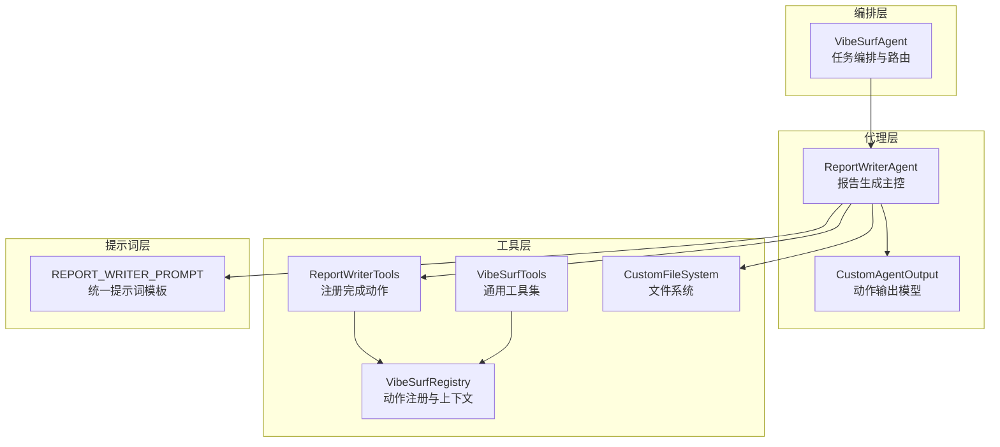
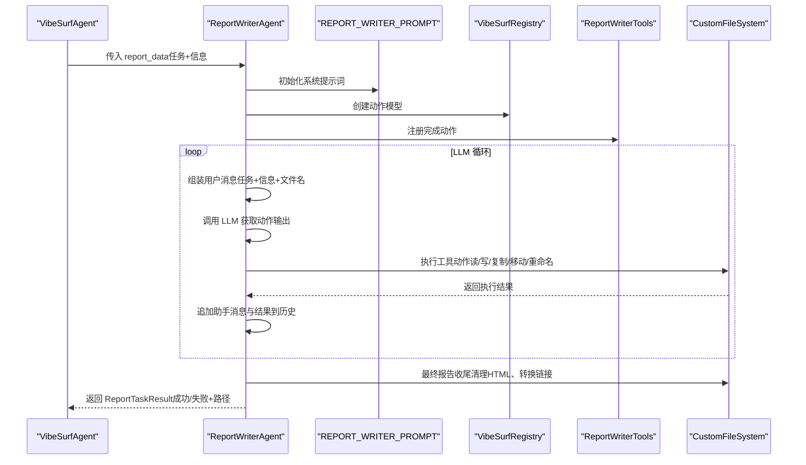
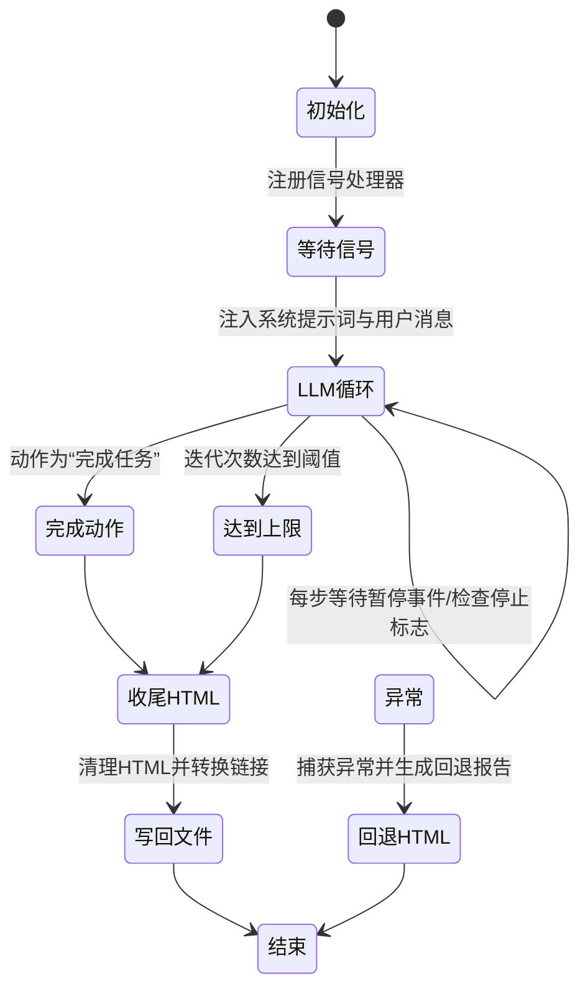
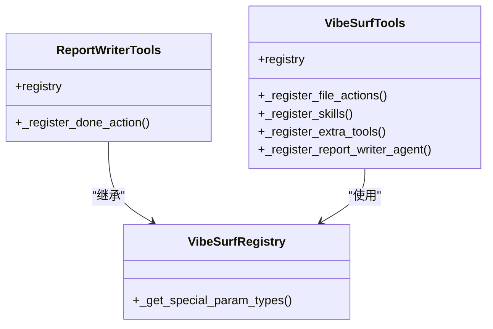
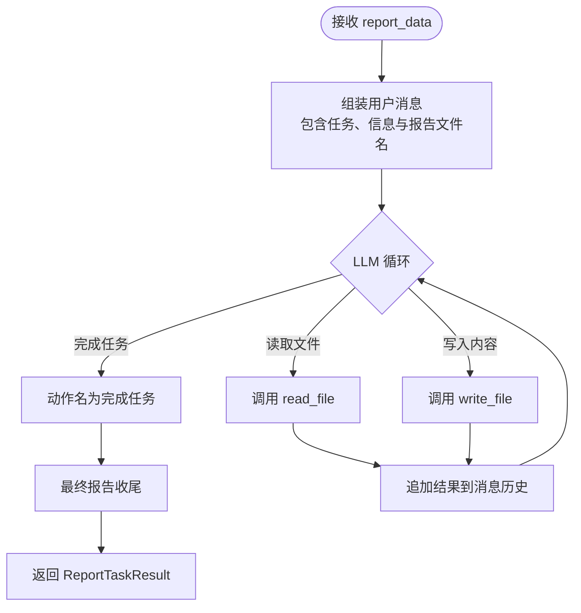
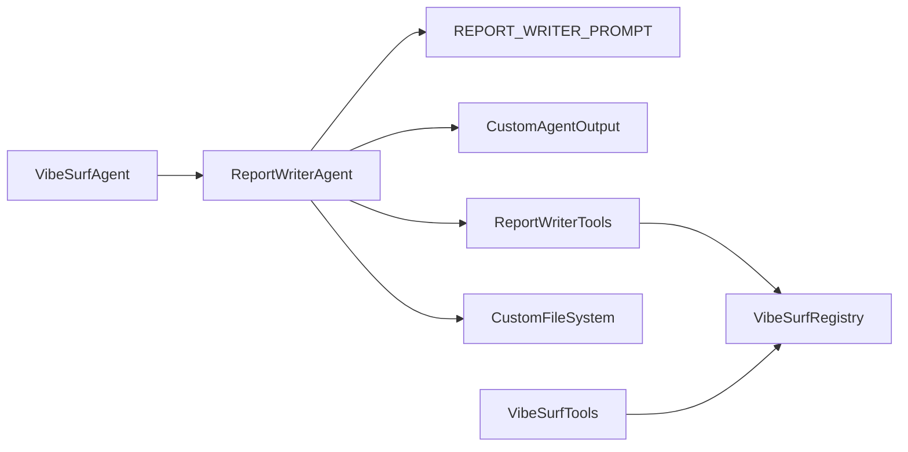

# 报告撰写代理

<cite>
**本文引用的文件列表**
- [report_writer_agent.py](file://vibe_surf/agents/report_writer_agent.py)
- [report_writer_tools.py](file://vibe_surf/tools/report_writer_tools.py)
- [report_writer_prompt.py](file://vibe_surf/agents/prompts/report_writer_prompt.py)
- [vibesurf_tools.py](file://vibe_surf/tools/vibesurf_tools.py)
- [vibesurf_registry.py](file://vibe_surf/tools/vibesurf_registry.py)
- [views.py](file://vibe_surf/agents/views.py)
- [file_system.py](file://vibe_surf/tools/file_system.py)
- [vibe_surf_agent.py](file://vibe_surf/agents/vibe_surf_agent.py)
</cite>

## 目录
1. [简介](#简介)
2. [项目结构](#项目结构)
3. [核心组件](#核心组件)
4. [架构总览](#架构总览)
5. [详细组件分析](#详细组件分析)
6. [依赖关系分析](#依赖关系分析)
7. [性能考量](#性能考量)
8. [故障排查指南](#故障排查指南)
9. [结论](#结论)
10. [附录](#附录)

## 简介
本文件面向开发者，系统性解析报告撰写代理 ReportWriterAgent 的架构设计与实现细节，涵盖其如何利用工具集完成内容生成、格式化与数据整合；如何通过提示词工程驱动高质量报告输出；如何处理多源数据输入并生成结构化报告；以及状态转换与错误处理/重试策略。目标是帮助读者快速理解并扩展该代理在实际业务场景中的应用。

## 项目结构
围绕报告撰写代理的关键文件组织如下：
- agents/report_writer_agent.py：定义 ReportWriterAgent，负责 LLM 控制的报告生成流程、消息历史管理、暂停/恢复/停止控制、最终报告收尾与回退策略。
- agents/prompts/report_writer_prompt.py：定义统一的提示词模板，明确能力边界、工作流步骤、内容与 HTML 要求、标题规范等。
- tools/report_writer_tools.py：封装 ReportWriterTools，注册“完成任务”动作，作为工具集的一部分供代理调用。
- tools/vibesurf_tools.py：通用工具集合，包含大量浏览器、文件系统、技能类动作注册，其中也包含对“执行报告撰写代理”的占位注册。
- tools/vibesurf_registry.py：基于 browser_use 的 Registry 扩展，声明特殊参数类型，为工具函数注入上下文（如 llm、file_system、browser_manager 等）。
- agents/views.py：定义 CustomAgentOutput，用于将 LLM 输出映射到可执行的动作模型。
- tools/file_system.py：自定义文件系统，提供创建、读写、复制、移动、重命名等操作，确保安全路径与异常处理。
- agents/vibe_surf_agent.py：上层编排入口，负责将浏览器结果与报告任务参数组装后交由 ReportWriterAgent 执行，并记录日志与结果。

图表来源
- [report_writer_agent.py](file://vibe_surf/agents/report_writer_agent.py#L34-L120)
- [report_writer_tools.py](file://vibe_surf/tools/report_writer_tools.py#L1-L23)
- [vibesurf_tools.py](file://vibe_surf/tools/vibesurf_tools.py#L1-L120)
- [vibesurf_registry.py](file://vibe_surf/tools/vibesurf_registry.py#L1-L53)
- [views.py](file://vibe_surf/agents/views.py#L77-L123)
- [file_system.py](file://vibe_surf/tools/file_system.py#L38-L120)
- [vibe_surf_agent.py](file://vibe_surf/agents/vibe_surf_agent.py#L906-L956)

章节来源
- [report_writer_agent.py](file://vibe_surf/agents/report_writer_agent.py#L34-L120)
- [report_writer_tools.py](file://vibe_surf/tools/report_writer_tools.py#L1-L23)
- [vibesurf_tools.py](file://vibe_surf/tools/vibesurf_tools.py#L1-L120)
- [vibesurf_registry.py](file://vibe_surf/tools/vibesurf_registry.py#L1-L53)
- [views.py](file://vibe_surf/agents/views.py#L77-L123)
- [file_system.py](file://vibe_surf/tools/file_system.py#L38-L120)
- [vibe_surf_agent.py](file://vibe_surf/agents/vibe_surf_agent.py#L906-L956)

## 核心组件
- ReportWriterAgent：LLM 驱动的报告生成主控，维护消息历史、动作模型、暂停/恢复/停止状态，循环执行工具动作直至完成或达到最大迭代次数。
- ReportWriterTools：注册“完成任务”动作，作为工具集的一部分，允许 LLM 在最终阶段标记任务结束。
- VibeSurfTools/VibeSurfRegistry：提供丰富的工具动作注册与上下文注入，包括文件系统读写、浏览器使用、技能类动作等；同时声明特殊参数类型以增强工具函数的可用性。
- CustomAgentOutput：将 LLM 输出映射为可执行的动作模型，支持带思考与不带思考两种模式。
- CustomFileSystem：封装文件系统操作，保证路径安全与异常处理，支持创建、读写、复制、移动、重命名等。
- REPORT_WRITER_PROMPT：统一提示词模板，约束报告生成流程、内容风格、HTML 规范与标题要求。
- VibeSurfAgent：上层编排节点，负责将任务参数与浏览器结果打包传入 ReportWriterAgent，并记录日志与结果。

章节来源
- [report_writer_agent.py](file://vibe_surf/agents/report_writer_agent.py#L34-L120)
- [report_writer_tools.py](file://vibe_surf/tools/report_writer_tools.py#L1-L23)
- [vibesurf_tools.py](file://vibe_surf/tools/vibesurf_tools.py#L1751-L1919)
- [vibesurf_registry.py](file://vibe_surf/tools/vibesurf_registry.py#L34-L53)
- [views.py](file://vibe_surf/agents/views.py#L77-L123)
- [file_system.py](file://vibe_surf/tools/file_system.py#L268-L320)
- [report_writer_prompt.py](file://vibe_surf/agents/prompts/report_writer_prompt.py#L1-L74)
- [vibe_surf_agent.py](file://vibe_surf/agents/vibe_surf_agent.py#L906-L956)

## 架构总览
ReportWriterAgent 采用“提示词驱动 + 工具集执行 + 文件系统收尾”的三层架构：
- 提示词层：通过统一的提示词模板约束 LLM 的行为，确保生成内容符合专业 HTML 报告的要求。
- 工具层：基于 VibeSurfRegistry 注册的动作集合，ReportWriterTools 仅注册“完成任务”，其余动作由 VibeSurfTools 提供，包括文件读写、复制、移动、重命名、浏览器使用等。
- 编排层：VibeSurfAgent 将任务参数与浏览器结果打包传入 ReportWriterAgent，后者在循环中根据 LLM 的动作决策调用工具，最终生成并收尾报告。

图表来源
- [vibe_surf_agent.py](file://vibe_surf/agents/vibe_surf_agent.py#L906-L956)
- [report_writer_agent.py](file://vibe_surf/agents/report_writer_agent.py#L106-L316)
- [report_writer_prompt.py](file://vibe_surf/agents/prompts/report_writer_prompt.py#L1-L74)
- [report_writer_tools.py](file://vibe_surf/tools/report_writer_tools.py#L1-L23)
- [vibesurf_registry.py](file://vibe_surf/tools/vibesurf_registry.py#L34-L53)
- [file_system.py](file://vibe_surf/tools/file_system.py#L268-L320)

## 详细组件分析

### ReportWriterAgent 类与状态机
- 初始化与配置
  - 接收 LLM 实例、工作目录、步回调与是否启用思考模式。
  - 初始化 CustomFileSystem 与 ReportWriterTools，创建动作模型与 AgentOutput 类型。
  - 维护消息历史、暂停/恢复/停止事件与连续失败计数。
- 生成流程
  - 生成唯一报告文件名，创建空文件。
  - 若消息历史为空，注入统一提示词。
  - 组装用户消息，包含任务、可用信息与报告文件路径。
  - 进入 LLM 控制循环，最多执行固定迭代次数；每步等待外部暂停事件，检查停止标志。
  - 解析 LLM 动作输出，调用工具执行，将结果追加到消息历史。
  - 当动作名为“完成任务”时，跳出循环并进入最终报告收尾。
  - 根据不同退出条件返回 ReportTaskResult。
- 最终报告收尾
  - 读取当前内容，提取 HTML 内容，清理 Markdown 包裹标记，补全缺失的 HTML 结构与样式。
  - 将相对路径转换为绝对 file:// URL，写回文件并返回路径。
- 回退策略
  - 异常捕获后生成简单回退 HTML 报告，返回回退路径与错误信息。
- Telemetry
  - 记录开始、完成与错误事件，包含版本、模型、耗时、成功与否等指标。

图表来源
- [report_writer_agent.py](file://vibe_surf/agents/report_writer_agent.py#L106-L316)
- [report_writer_agent.py](file://vibe_surf/agents/report_writer_agent.py#L348-L475)
- [report_writer_agent.py](file://vibe_surf/agents/report_writer_agent.py#L476-L581)

章节来源
- [report_writer_agent.py](file://vibe_surf/agents/report_writer_agent.py#L34-L120)
- [report_writer_agent.py](file://vibe_surf/agents/report_writer_agent.py#L106-L316)
- [report_writer_agent.py](file://vibe_surf/agents/report_writer_agent.py#L348-L475)
- [report_writer_agent.py](file://vibe_surf/agents/report_writer_agent.py#L476-L581)

### ReportWriterTools 与工具注册
- ReportWriterTools 继承自 VibeSurfTools，通过 VibeSurfRegistry 注册动作。
- 仅注册“完成任务”动作，其他动作由 VibeSurfTools 提供，包括文件系统读写、复制、移动、重命名、浏览器使用、技能类动作等。
- 通过 registry.action 装饰器注册动作，自动注入特殊参数类型（如 file_system、llm、browser_manager 等）。

图表来源
- [report_writer_tools.py](file://vibe_surf/tools/report_writer_tools.py#L1-L23)
- [vibesurf_tools.py](file://vibe_surf/tools/vibesurf_tools.py#L1751-L1919)
- [vibesurf_registry.py](file://vibe_surf/tools/vibesurf_registry.py#L34-L53)

章节来源
- [report_writer_tools.py](file://vibe_surf/tools/report_writer_tools.py#L1-L23)
- [vibesurf_tools.py](file://vibe_surf/tools/vibesurf_tools.py#L1751-L1919)
- [vibesurf_registry.py](file://vibe_surf/tools/vibesurf_registry.py#L34-L53)

### 提示词工程（REPORT_WRITER_PROMPT）
- 能力清单：read_file、write_file。
- 工作流步骤：分析任务、判断是否需要更多信息、生成报告内容、强制格式化为专业 HTML、最终写入目标文件。
- 内容与 HTML 要求：完整 HTML5 结构、嵌入式 CSS、响应式设计、语义化元素、打印友好、跨浏览器兼容；本地资源使用相对路径，系统会自动转换为 file:// URL。
- 标题规范：避免泛化标题，需贴合研究/分析主题。
- 关键提醒：必须包含专用格式化步骤，不能跳过。

章节来源
- [report_writer_prompt.py](file://vibe_surf/agents/prompts/report_writer_prompt.py#L1-L74)

### 多源数据输入与结构化报告
- 输入数据结构：report_data 包含 report_task（任务需求、要点、洞察）与 report_information（收集到的信息，如浏览器结果序列化）。
- 上层编排（VibeSurfAgent）将浏览器任务结果转换为字典，传递给 ReportWriterAgent。
- 代理在循环中根据 LLM 的动作决定是否读取文件（read_file）、写入内容（write_file），并在最后阶段统一收尾为 HTML。

图表来源
- [vibe_surf_agent.py](file://vibe_surf/agents/vibe_surf_agent.py#L924-L939)
- [report_writer_agent.py](file://vibe_surf/agents/report_writer_agent.py#L143-L267)
- [vibesurf_tools.py](file://vibe_surf/tools/vibesurf_tools.py#L1842-L1864)

章节来源
- [vibe_surf_agent.py](file://vibe_surf/agents/vibe_surf_agent.py#L924-L939)
- [report_writer_agent.py](file://vibe_surf/agents/report_writer_agent.py#L143-L267)
- [vibesurf_tools.py](file://vibe_surf/tools/vibesurf_tools.py#L1842-L1864)

### 错误处理与重试机制
- 异常捕获：在生成过程中捕获异常，记录错误事件并生成回退 HTML 报告。
- 最大迭代限制：防止无限循环，默认最多执行固定次数。
- 停止/暂停/恢复：支持外部信号触发暂停与恢复，停止后立即退出循环。
- 回退报告：当 LLM 生成失败时，生成一个包含任务与信息摘要的简单 HTML 报告，便于后续运行优化。

章节来源
- [report_writer_agent.py](file://vibe_surf/agents/report_writer_agent.py#L180-L316)
- [report_writer_agent.py](file://vibe_surf/agents/report_writer_agent.py#L317-L347)
- [report_writer_agent.py](file://vibe_surf/agents/report_writer_agent.py#L476-L581)

## 依赖关系分析
- ReportWriterAgent 依赖：
  - 提示词模板：统一约束 LLM 行为。
  - 动作模型与 AgentOutput：将 LLM 输出映射为可执行动作。
  - 工具集：通过 VibeSurfRegistry 注册的动作集合。
  - 文件系统：创建/读写/收尾报告。
  - Telemetry：记录事件与指标。
- VibeSurfTools 与 VibeSurfRegistry：
  - 提供丰富的工具动作，声明特殊参数类型，确保工具函数可注入上下文。
- 上层编排：
  - VibeSurfAgent 负责参数组装与结果记录，将 ReportWriterAgent 纳入整体工作流。

图表来源
- [report_writer_agent.py](file://vibe_surf/agents/report_writer_agent.py#L34-L120)
- [report_writer_prompt.py](file://vibe_surf/agents/prompts/report_writer_prompt.py#L1-L74)
- [views.py](file://vibe_surf/agents/views.py#L77-L123)
- [report_writer_tools.py](file://vibe_surf/tools/report_writer_tools.py#L1-L23)
- [vibesurf_registry.py](file://vibe_surf/tools/vibesurf_registry.py#L34-L53)
- [vibesurf_tools.py](file://vibe_surf/tools/vibesurf_tools.py#L1-L120)
- [vibe_surf_agent.py](file://vibe_surf/agents/vibe_surf_agent.py#L906-L956)

章节来源
- [report_writer_agent.py](file://vibe_surf/agents/report_writer_agent.py#L34-L120)
- [report_writer_prompt.py](file://vibe_surf/agents/prompts/report_writer_prompt.py#L1-L74)
- [views.py](file://vibe_surf/agents/views.py#L77-L123)
- [report_writer_tools.py](file://vibe_surf/tools/report_writer_tools.py#L1-L23)
- [vibesurf_registry.py](file://vibe_surf/tools/vibesurf_registry.py#L34-L53)
- [vibesurf_tools.py](file://vibe_surf/tools/vibesurf_tools.py#L1-L120)
- [vibe_surf_agent.py](file://vibe_surf/agents/vibe_surf_agent.py#L906-L956)

## 性能考量
- 迭代上限：默认最大迭代次数限制，避免长时间阻塞。
- 异步 I/O：文件系统与工具调用均采用异步方式，减少阻塞。
- HTML 清洗与链接转换：在收尾阶段进行，避免在循环中重复处理。
- 日志与遥测：记录关键事件与耗时，便于定位性能瓶颈。

## 故障排查指南
- 无法生成报告
  - 检查提示词是否被正确注入，确认消息历史初始化逻辑。
  - 查看 Telemetry 是否记录错误事件，定位具体错误原因。
  - 确认最大迭代次数是否提前触发。
- 报告内容未按预期格式
  - 确保 LLM 在最后一步调用“完成任务”，并已执行格式化步骤。
  - 检查最终收尾阶段的 HTML 清洗与链接转换逻辑。
- 文件路径问题
  - 确认相对路径是否正确，系统会在收尾阶段将其转换为 file:// URL。
  - 使用 CustomFileSystem 的 create_file/read_file/write_file 等方法，避免越界访问。

章节来源
- [report_writer_agent.py](file://vibe_surf/agents/report_writer_agent.py#L180-L316)
- [report_writer_agent.py](file://vibe_surf/agents/report_writer_agent.py#L348-L475)
- [file_system.py](file://vibe_surf/tools/file_system.py#L268-L320)

## 结论
ReportWriterAgent 通过统一提示词模板、灵活的工具集与严格的收尾流程，实现了从多源数据到专业 HTML 报告的自动化生成。其状态机设计支持暂停/恢复/停止，结合 Telemetry 与回退策略，能够在复杂环境中保持稳健与可观测性。开发者可在此基础上扩展更多工具动作与提示词规则，以适配更广泛的报告场景。

## 附录
- 自定义报告模板
  - 可在提示词模板中调整内容风格、HTML 要求与标题规范，以匹配特定行业或品牌风格。
- 动态变量注入
  - 用户消息中包含任务、信息与报告文件名，这些变量在生成前动态拼接，确保 LLM 能够基于最新上下文进行决策。
- 上层编排集成
  - VibeSurfAgent 将浏览器结果与任务参数打包传入 ReportWriterAgent，形成端到端的工作流。

章节来源
- [report_writer_prompt.py](file://vibe_surf/agents/prompts/report_writer_prompt.py#L1-L74)
- [vibe_surf_agent.py](file://vibe_surf/agents/vibe_surf_agent.py#L924-L939)
- [report_writer_agent.py](file://vibe_surf/agents/report_writer_agent.py#L143-L178)