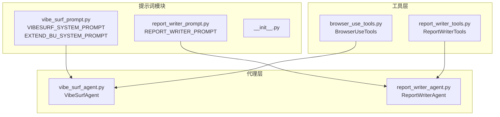
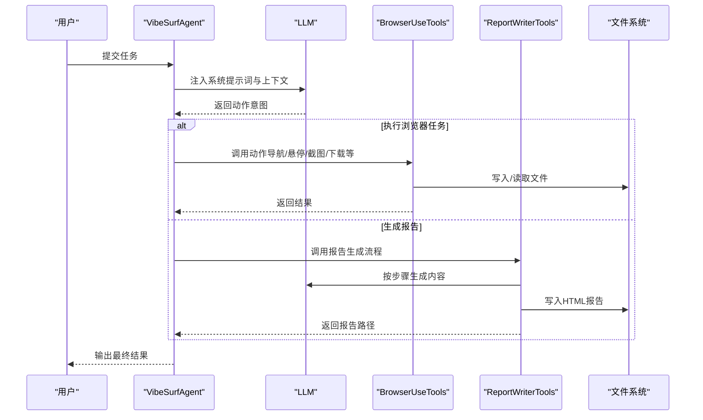
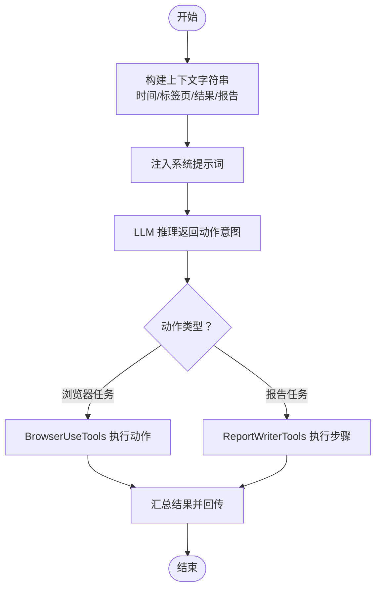
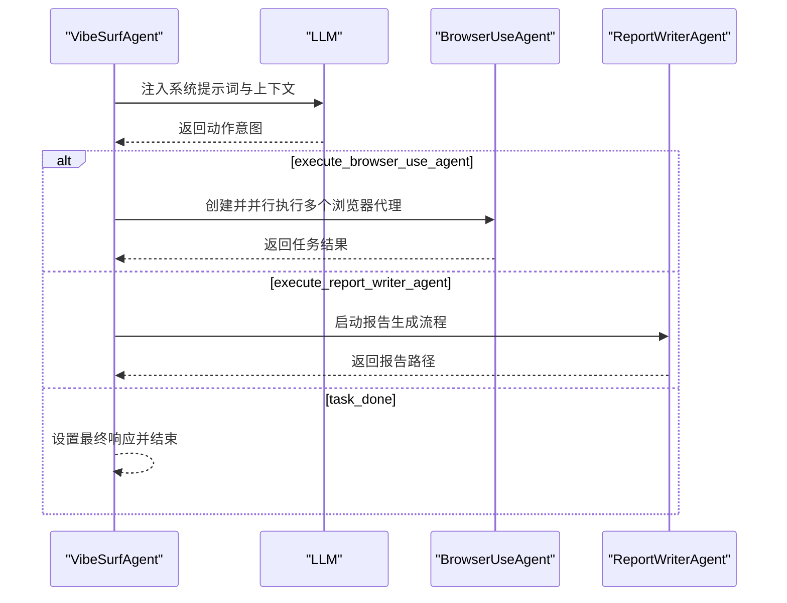
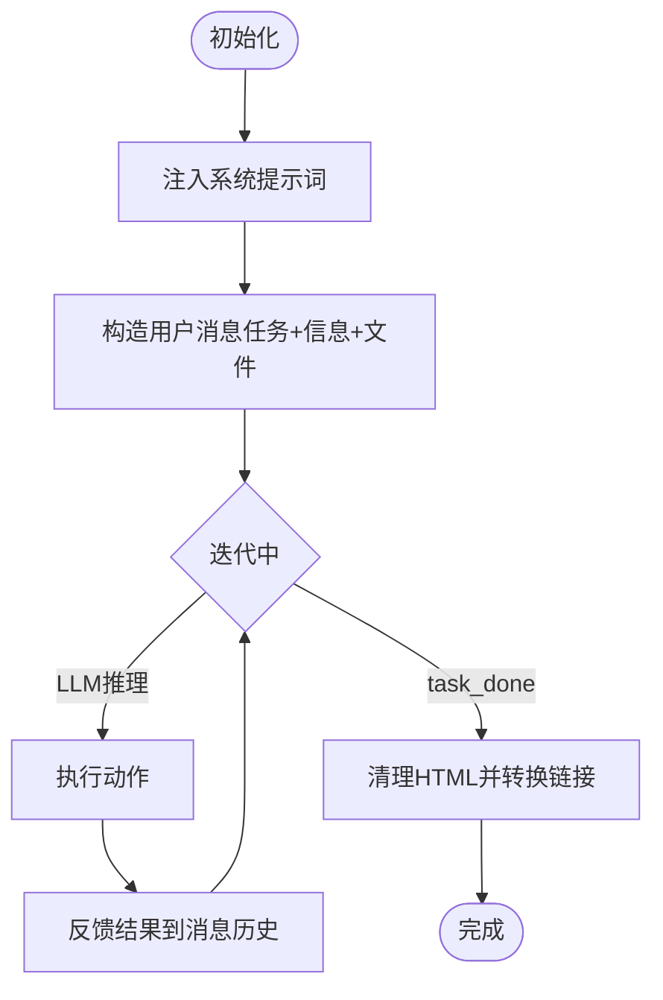
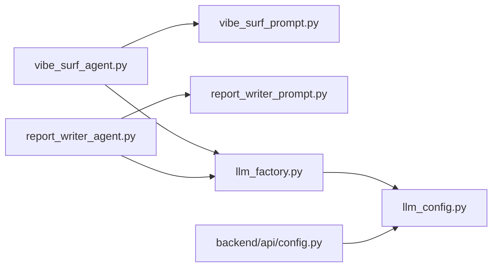

# 提示词管理

<cite>
**本文引用的文件列表**
- [vibe_surf/agents/prompts/__init__.py](file://vibe_surf/agents/prompts/__init__.py)
- [vibe_surf/agents/prompts/vibe_surf_prompt.py](file://vibe_surf/agents/prompts/vibe_surf_prompt.py)
- [vibe_surf/agents/prompts/report_writer_prompt.py](file://vibe_surf/agents/prompts/report_writer_prompt.py)
- [vibe_surf/agents/vibe_surf_agent.py](file://vibe_surf/agents/vibe_surf_agent.py)
- [vibe_surf/agents/report_writer_agent.py](file://vibe_surf/agents/report_writer_agent.py)
- [vibe_surf/tools/browser_use_tools.py](file://vibe_surf/tools/browser_use_tools.py)
- [vibe_surf/tools/report_writer_tools.py](file://vibe_surf/tools/report_writer_tools.py)
- [vibe_surf/backend/utils/llm_factory.py](file://vibe_surf/backend/utils/llm_factory.py)
- [vibe_surf/backend/llm_config.py](file://vibe_surf/backend/llm_config.py)
- [vibe_surf/backend/api/config.py](file://vibe_surf/backend/api/config.py)
</cite>

## 目录
1. [简介](#简介)
2. [项目结构](#项目结构)
3. [核心组件](#核心组件)
4. [架构总览](#架构总览)
5. [详细组件分析](#详细组件分析)
6. [依赖关系分析](#依赖关系分析)
7. [性能考量](#性能考量)
8. [故障排查指南](#故障排查指南)
9. [结论](#结论)
10. [附录：提示词工程最佳实践](#附录提示词工程最佳实践)

## 简介
本文件面向提示词管理系统的使用者与维护者，系统化梳理 agents/prompts 目录下的提示词组织结构与管理机制，深入解析 vibe_surf_prompt.py 与 report_writer_prompt.py 的设计模式（多层级提示词组合、动态上下文注入与变量替换），并给出版本控制与 A/B 测试建议、跨 LLM 提供商兼容性策略、任务类型选择策略及提示词工程最佳实践。目标是帮助开发者掌握高级提示词工程技术，提升提示词质量与可维护性。

## 项目结构
提示词管理位于 agents/prompts 目录，采用“按职责分模块”的组织方式：
- vibe_surf_prompt.py：定义 VibeSurf 主代理系统提示词与浏览器代理扩展提示词
- report_writer_prompt.py：定义报告生成器系统提示词
- __init__.py：模块入口，当前为空，便于后续扩展

提示词在运行时被导入到具体代理类中使用，如 VibeSurfAgent 与 ReportWriterAgent。

图表来源
- [vibe_surf/agents/prompts/vibe_surf_prompt.py](file://vibe_surf/agents/prompts/vibe_surf_prompt.py#L1-L219)
- [vibe_surf/agents/prompts/report_writer_prompt.py](file://vibe_surf/agents/prompts/report_writer_prompt.py#L1-L74)
- [vibe_surf/agents/vibe_surf_agent.py](file://vibe_surf/agents/vibe_surf_agent.py#L34-L41)
- [vibe_surf/agents/report_writer_agent.py](file://vibe_surf/agents/report_writer_agent.py#L15-L21)
- [vibe_surf/tools/browser_use_tools.py](file://vibe_surf/tools/browser_use_tools.py#L62-L73)
- [vibe_surf/tools/report_writer_tools.py](file://vibe_surf/tools/report_writer_tools.py#L8-L13)

章节来源
- [vibe_surf/agents/prompts/__init__.py](file://vibe_surf/agents/prompts/__init__.py#L1-L1)
- [vibe_surf/agents/prompts/vibe_surf_prompt.py](file://vibe_surf/agents/prompts/vibe_surf_prompt.py#L1-L219)
- [vibe_surf/agents/prompts/report_writer_prompt.py](file://vibe_surf/agents/prompts/report_writer_prompt.py#L1-L74)

## 核心组件
- 提示词常量
  - VIBESURF_SYSTEM_PROMPT：主代理系统提示词，包含能力清单、工作流指导、安全与合规要求等
  - EXTEND_BU_SYSTEM_PROMPT：浏览器代理扩展提示词，补充浏览器操作安全与路径处理细节
  - REPORT_WRITER_PROMPT：报告生成器系统提示词，定义报告生成流程、内容与格式要求
- 代理实现
  - VibeSurfAgent：协调浏览器任务与报告生成，负责上下文拼装与路由决策
  - ReportWriterAgent：基于 LLM 的报告生成循环，严格遵循提示词步骤与输出规范
- 工具注册
  - BrowserUseTools：注册浏览器相关动作（导航、悬停、截图、下载等）
  - ReportWriterTools：注册文件读写与完成动作

章节来源
- [vibe_surf/agents/prompts/vibe_surf_prompt.py](file://vibe_surf/agents/prompts/vibe_surf_prompt.py#L1-L219)
- [vibe_surf/agents/prompts/report_writer_prompt.py](file://vibe_surf/agents/prompts/report_writer_prompt.py#L1-L74)
- [vibe_surf/agents/vibe_surf_agent.py](file://vibe_surf/agents/vibe_surf_agent.py#L34-L41)
- [vibe_surf/agents/report_writer_agent.py](file://vibe_surf/agents/report_writer_agent.py#L15-L21)
- [vibe_surf/tools/browser_use_tools.py](file://vibe_surf/tools/browser_use_tools.py#L62-L73)
- [vibe_surf/tools/report_writer_tools.py](file://vibe_surf/tools/report_writer_tools.py#L8-L13)

## 架构总览
提示词在系统中的作用链路如下：
- 提示词作为系统消息注入到代理的消息历史
- 代理根据任务类型选择执行路径（浏览器任务或报告生成）
- 工具层提供动作注册与执行，确保提示词约束得到落地
- LLM 工厂负责跨提供商适配，保证提示词在不同模型上的一致行为

图表来源
- [vibe_surf/agents/vibe_surf_agent.py](file://vibe_surf/agents/vibe_surf_agent.py#L353-L546)
- [vibe_surf/agents/report_writer_agent.py](file://vibe_surf/agents/report_writer_agent.py#L106-L316)
- [vibe_surf/tools/browser_use_tools.py](file://vibe_surf/tools/browser_use_tools.py#L146-L492)
- [vibe_surf/tools/report_writer_tools.py](file://vibe_surf/tools/report_writer_tools.py#L8-L23)

## 详细组件分析

### 组件A：提示词模板设计模式（多层级组合、上下文注入与变量替换）
- 多层级提示词组合
  - 主提示词与扩展提示词分离：VIBESURF_SYSTEM_PROMPT 定义总体能力与原则，EXTEND_BU_SYSTEM_PROMPT 补充浏览器操作细节与安全约束，二者在浏览器代理初始化时合并注入
  - 报告生成器通过统一的 REPORT_WRITER_PROMPT 控制生成流程，避免重复约束
- 动态上下文注入
  - VibeSurfAgent 在每次决策前构建上下文字符串，包含时间、可用标签页、活动标签、先前浏览器结果、已生成报告等，并将其追加到消息历史
  - ReportWriterAgent 在首次调用时仅注入一次系统提示词，随后以用户消息形式传入任务与信息，形成“系统+用户”的双层提示词结构
- 变量替换机制
  - 上下文变量通过字符串拼接与 JSON 序列化注入，例如将浏览器结果列表格式化为 Markdown 文本，再拼接到系统提示词之后
  - 文件链接转换：在日志与消息中将相对路径转换为绝对 file:// URL，确保报告与浏览器产物的可访问性

图表来源
- [vibe_surf/agents/vibe_surf_agent.py](file://vibe_surf/agents/vibe_surf_agent.py#L368-L410)
- [vibe_surf/agents/report_writer_agent.py](file://vibe_surf/agents/report_writer_agent.py#L158-L179)

章节来源
- [vibe_surf/agents/prompts/vibe_surf_prompt.py](file://vibe_surf/agents/prompts/vibe_surf_prompt.py#L1-L219)
- [vibe_surf/agents/prompts/report_writer_prompt.py](file://vibe_surf/agents/prompts/report_writer_prompt.py#L1-L74)
- [vibe_surf/agents/vibe_surf_agent.py](file://vibe_surf/agents/vibe_surf_agent.py#L368-L410)
- [vibe_surf/agents/report_writer_agent.py](file://vibe_surf/agents/report_writer_agent.py#L158-L179)

### 组件B：VibeSurfAgent 的提示词使用与控制流
- 系统提示词加载：从 vibe_surf_prompt 导入 VIBESURF_SYSTEM_PROMPT 与 EXTEND_BU_SYSTEM_PROMPT，在浏览器代理初始化时合并注入
- 上下文拼装：将当前时间、标签页信息、先前结果、报告状态等动态信息拼接为上下文文本，追加到消息历史
- 动作路由：根据 LLM 返回的动作名称决定下一步（浏览器执行、报告生成、直接完成）

图表来源
- [vibe_surf/agents/vibe_surf_agent.py](file://vibe_surf/agents/vibe_surf_agent.py#L353-L546)
- [vibe_surf/agents/prompts/vibe_surf_prompt.py](file://vibe_surf/agents/prompts/vibe_surf_prompt.py#L198-L219)

章节来源
- [vibe_surf/agents/vibe_surf_agent.py](file://vibe_surf/agents/vibe_surf_agent.py#L353-L546)
- [vibe_surf/agents/prompts/vibe_surf_prompt.py](file://vibe_surf/agents/prompts/vibe_surf_prompt.py#L198-L219)

### 组件C：ReportWriterAgent 的提示词驱动流程
- 首次调用注入系统提示词，随后以用户消息传入任务与信息，形成“系统+用户”的提示词结构
- 步骤式循环：LLM 推理 -> 工具执行 -> 结果反馈 -> 下一步，直至收到 task_done 动作
- 报告收尾：清理 HTML、转换相对链接为 file:// URL，确保报告可离线打开

图表来源
- [vibe_surf/agents/report_writer_agent.py](file://vibe_surf/agents/report_writer_agent.py#L158-L316)
- [vibe_surf/agents/report_writer_agent.py](file://vibe_surf/agents/report_writer_agent.py#L348-L475)

章节来源
- [vibe_surf/agents/report_writer_agent.py](file://vibe_surf/agents/report_writer_agent.py#L158-L316)
- [vibe_surf/agents/report_writer_agent.py](file://vibe_surf/agents/report_writer_agent.py#L348-L475)

### 组件D：工具层与提示词约束的协同
- BrowserUseTools：注册浏览器导航、悬停、截图、下载、代码生成等动作，确保提示词中的行为约束（如安全、路径、权限）在动作层面得到落实
- ReportWriterTools：注册文件读取、写入与完成动作，确保报告生成器严格遵循提示词的格式与内容要求

章节来源
- [vibe_surf/tools/browser_use_tools.py](file://vibe_surf/tools/browser_use_tools.py#L146-L492)
- [vibe_surf/tools/report_writer_tools.py](file://vibe_surf/tools/report_writer_tools.py#L8-L23)

## 依赖关系分析
- 提示词依赖
  - VibeSurfAgent 依赖 vibe_surf_prompt 中的两个提示词常量
  - ReportWriterAgent 依赖 report_writer_prompt 中的提示词常量
- LLM 兼容性
  - llm_factory 根据配置创建不同提供商实例，屏蔽差异；提示词本身保持稳定
  - llm_config 定义支持的提供商与模型清单，提示词选择可据此进行任务类型匹配
- API 层
  - 后端 API 提供 LLM 提供商查询与配置接口，前端可据此选择最优提示词模板

图表来源
- [vibe_surf/agents/vibe_surf_agent.py](file://vibe_surf/agents/vibe_surf_agent.py#L34-L41)
- [vibe_surf/agents/report_writer_agent.py](file://vibe_surf/agents/report_writer_agent.py#L15-L21)
- [vibe_surf/backend/utils/llm_factory.py](file://vibe_surf/backend/utils/llm_factory.py#L23-L219)
- [vibe_surf/backend/llm_config.py](file://vibe_surf/backend/llm_config.py#L1-L226)
- [vibe_surf/backend/api/config.py](file://vibe_surf/backend/api/config.py#L585-L619)

章节来源
- [vibe_surf/agents/vibe_surf_agent.py](file://vibe_surf/agents/vibe_surf_agent.py#L34-L41)
- [vibe_surf/agents/report_writer_agent.py](file://vibe_surf/agents/report_writer_agent.py#L15-L21)
- [vibe_surf/backend/utils/llm_factory.py](file://vibe_surf/backend/utils/llm_factory.py#L23-L219)
- [vibe_surf/backend/llm_config.py](file://vibe_surf/backend/llm_config.py#L1-L226)
- [vibe_surf/backend/api/config.py](file://vibe_surf/backend/api/config.py#L585-L619)

## 性能考量
- 并行执行：VibeSurfAgent 支持多浏览器代理并行执行，显著降低多任务总耗时
- 上下文精简：仅注入必要上下文，避免冗余信息导致 token 消耗过高
- 步骤控制：ReportWriterAgent 使用最大迭代次数防止无限循环，平衡稳定性与性能
- LLM 参数：通过 llm_factory 对温度、最大 token 等参数进行提供商级适配，兼顾速度与质量

章节来源
- [vibe_surf/agents/vibe_surf_agent.py](file://vibe_surf/agents/vibe_surf_agent.py#L548-L763)
- [vibe_surf/agents/report_writer_agent.py](file://vibe_surf/agents/report_writer_agent.py#L180-L243)
- [vibe_surf/backend/utils/llm_factory.py](file://vibe_surf/backend/utils/llm_factory.py#L23-L219)

## 故障排查指南
- 提示词未生效
  - 检查是否正确导入提示词常量并在代理初始化时注入
  - 确认消息历史中包含系统提示词与上下文
- 浏览器任务失败
  - 查看浏览器动作返回的错误信息，确认元素定位、网络与权限问题
  - 检查 EXTEND_BU_SYSTEM_PROMPT 是否被正确传递给浏览器代理
- 报告无法打开
  - 确认 HTML 清洗与链接转换逻辑已执行
  - 检查文件路径是否为相对路径且在工作目录内
- LLM 配置错误
  - 使用 llm_factory 的校验函数检查提供商、模型、密钥与 base_url
  - 通过后端 API 查询可用提供商与默认模型

章节来源
- [vibe_surf/agents/vibe_surf_agent.py](file://vibe_surf/agents/vibe_surf_agent.py#L607-L763)
- [vibe_surf/agents/report_writer_agent.py](file://vibe_surf/agents/report_writer_agent.py#L348-L475)
- [vibe_surf/backend/utils/llm_factory.py](file://vibe_surf/backend/utils/llm_factory.py#L222-L243)
- [vibe_surf/backend/api/config.py](file://vibe_surf/backend/api/config.py#L585-L619)

## 结论
本系统通过“主提示词 + 扩展提示词”的分层设计、严格的上下文注入与动作约束，实现了跨任务类型的稳定提示词工程体系。结合并行执行、步骤式控制与 LLM 提供商适配，既保证了性能也提升了可靠性。建议在实际使用中遵循本文最佳实践，持续优化提示词模板与测试流程。

## 附录：提示词工程最佳实践
- 版本控制策略
  - 采用语义化命名（如 v1、v2），在提示词文件中保留注释说明变更点
  - 通过后端 API 或前端界面记录提示词版本与生效范围
- A/B 测试支持
  - 为不同提示词模板建立独立路由或开关，按会话或用户维度分流
  - 记录关键指标（成功率、平均耗时、错误率）对比模板优劣
- 跨提供商兼容性
  - 在 llm_factory 中统一处理参数差异（如 temperature、max_tokens）
  - 根据 llm_config 的元数据选择合适模板（如支持 vision 的模型优先用于含图片输入的任务）
- 任务类型选择策略
  - 简单问答：使用简洁提示词，减少上下文
  - 数据提取/网页自动化：使用浏览器代理模板，强调安全与路径处理
  - 报告生成：使用报告生成器模板，强制格式化与文件落盘
- 提示词测试与验证
  - 建立最小化测试集，覆盖关键分支（成功、失败、边界）
  - 使用前端验证接口对模板进行语法与变量校验
  - 引入人工评估与自动指标（如 JSON 可解析性、输出一致性）

章节来源
- [vibe_surf/backend/llm_config.py](file://vibe_surf/backend/llm_config.py#L1-L226)
- [vibe_surf/backend/utils/llm_factory.py](file://vibe_surf/backend/utils/llm_factory.py#L23-L219)
- [vibe_surf/backend/api/config.py](file://vibe_surf/backend/api/config.py#L585-L619)