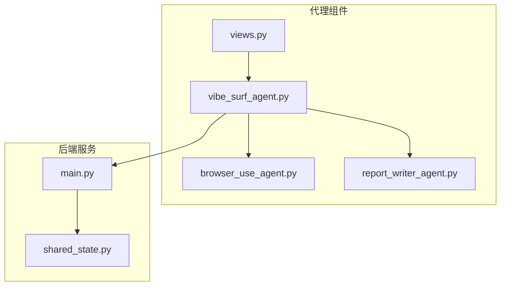
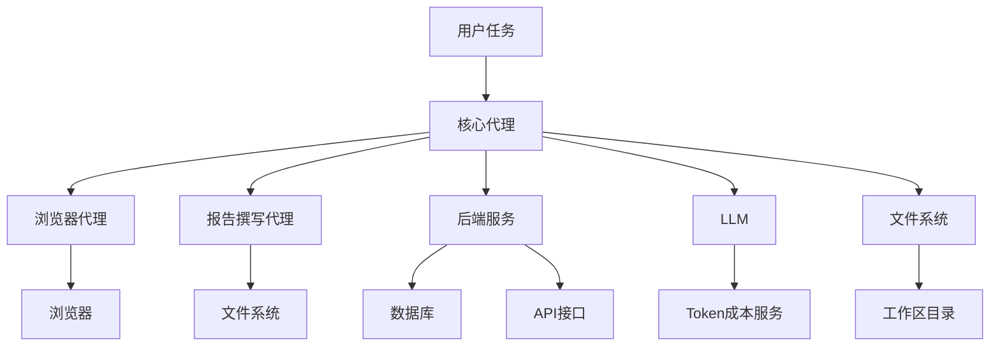
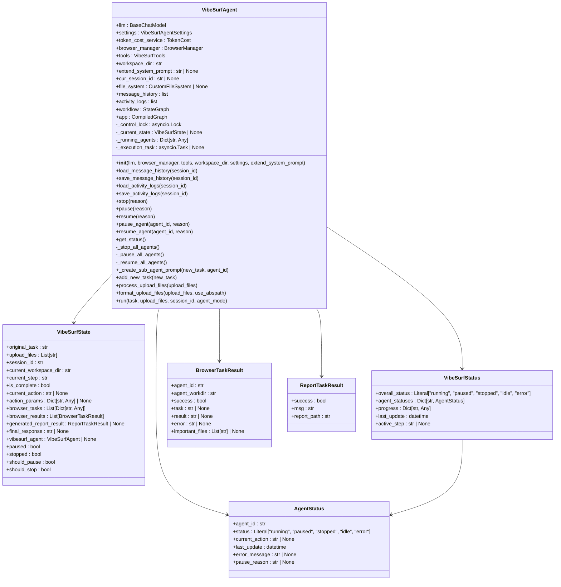
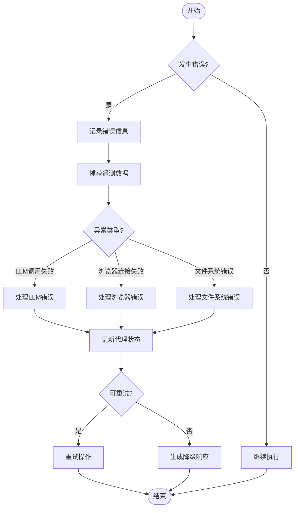
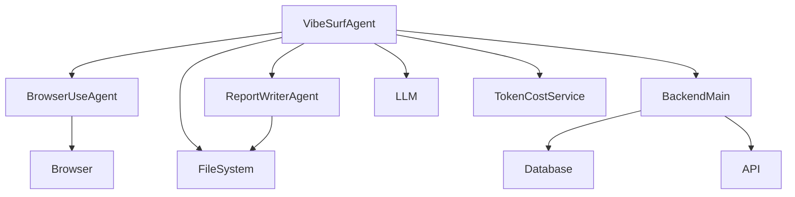

# 核心代理

<cite>
**本文档引用的文件**   
- [vibe_surf_agent.py](file://vibe_surf/agents/vibe_surf_agent.py)
- [views.py](file://vibe_surf/agents/views.py)
- [browser_use_agent.py](file://vibe_surf/agents/browser_use_agent.py)
- [report_writer_agent.py](file://vibe_surf/agents/report_writer_agent.py)
- [shared_state.py](file://vibe_surf/backend/shared_state.py)
- [main.py](file://vibe_surf/backend/main.py)
</cite>

## 目录
1. [简介](#简介)
2. [项目结构](#项目结构)
3. [核心组件](#核心组件)
4. [架构概述](#架构概述)
5. [详细组件分析](#详细组件分析)
6. [依赖关系分析](#依赖关系分析)
7. [性能考虑](#性能考虑)
8. [故障排除指南](#故障排除指南)
9. [结论](#结论)

## 简介
核心代理是VibeSurf系统中的中枢组件，负责协调和管理整个任务执行流程。它作为系统的控制中心，通过LangGraph工作流协调多个专用代理（如浏览器代理和报告撰写代理）的工作。核心代理实现了复杂的生命周期管理、状态维护和任务调度逻辑，能够处理LLM的响应并实现错误恢复机制。它通过与后端服务的API接口进行交互，完成任务创建、状态更新和结果返回等操作。核心代理的设计使其能够灵活地适应不同的任务需求，并通过模块化架构实现功能扩展。

## 项目结构
项目结构清晰地展示了核心代理在系统中的位置和与其他组件的关系。核心代理位于`vibe_surf/agents/`目录下，与浏览器代理、报告撰写代理等其他代理组件并列。后端服务位于`vibe_surf/backend/`目录下，提供API接口供核心代理调用。这种结构设计使得核心代理能够有效地协调各个组件的工作，实现系统的整体功能。



**图表来源**
- [vibe_surf_agent.py](file://vibe_surf/agents/vibe_surf_agent.py#L1042-L1599)
- [browser_use_agent.py](file://vibe_surf/agents/browser_use_agent.py#L83-L820)
- [report_writer_agent.py](file://vibe_surf/agents/report_writer_agent.py#L34-L581)
- [main.py](file://vibe_surf/backend/main.py#L1-L794)
- [shared_state.py](file://vibe_surf/backend/shared_state.py#L1-L1111)

**章节来源**
- [vibe_surf_agent.py](file://vibe_surf/agents/vibe_surf_agent.py#L1-L1840)
- [main.py](file://vibe_surf/backend/main.py#L1-L794)

## 核心组件

核心代理（VibeSurfAgent）是系统的核心组件，负责协调和管理整个任务执行流程。它通过LangGraph工作流协调多个专用代理（如浏览器代理和报告撰写代理）的工作。核心代理实现了复杂的生命周期管理、状态维护和任务调度逻辑，能够处理LLM的响应并实现错误恢复机制。它通过与后端服务的API接口进行交互，完成任务创建、状态更新和结果返回等操作。

**章节来源**
- [vibe_surf_agent.py](file://vibe_surf/agents/vibe_surf_agent.py#L1042-L1599)

## 架构概述

核心代理的架构设计基于LangGraph工作流，实现了模块化和可扩展性。它通过状态图（StateGraph）管理任务执行流程，将复杂的任务分解为多个可管理的步骤。核心代理与浏览器代理、报告撰写代理等专用代理协同工作，通过消息传递和状态共享实现任务协调。后端服务提供API接口，支持任务创建、状态查询和结果返回等操作。



**图表来源**
- [vibe_surf_agent.py](file://vibe_surf/agents/vibe_surf_agent.py#L997-L1039)
- [main.py](file://vibe_surf/backend/main.py#L38-L47)
- [shared_state.py](file://vibe_surf/backend/shared_state.py#L22-L45)

## 详细组件分析

### VibeSurfAgent分析
VibeSurfAgent是核心代理的主要实现类，负责协调和管理整个任务执行流程。它通过LangGraph工作流协调多个专用代理（如浏览器代理和报告撰写代理）的工作。

#### 类图


**图表来源**
- [vibe_surf_agent.py](file://vibe_surf/agents/vibe_surf_agent.py#L1042-L1599)
- [views.py](file://vibe_surf/agents/views.py#L56-L124)

#### 任务调度流程
```mermaid
sequenceDiagram
participant User as 用户
participant VibeSurfAgent as 核心代理
participant BrowserAgent as 浏览器代理
participant ReportAgent as 报告撰写代理
participant Backend as 后端服务
User->>VibeSurfAgent : 提交任务
VibeSurfAgent->>VibeSurfAgent : 初始化状态
VibeSurfAgent->>Backend : 创建任务记录
loop 任务执行循环
VibeSurfAgent->>VibeSurfAgent : 分析当前状态
alt 需要浏览器操作
VibeSurfAgent->>BrowserAgent : 分配浏览器任务
BrowserAgent->>BrowserAgent : 执行浏览器操作
BrowserAgent-->>VibeSurfAgent : 返回结果
else 需要生成报告
VibeSurfAgent->>ReportAgent : 分配报告任务
ReportAgent->>ReportAgent : 生成HTML报告
ReportAgent-->>VibeSurfAgent : 返回报告结果
else 任务完成
VibeSurfAgent->>VibeSurfAgent : 生成最终响应
break
end
end
VibeSurfAgent->>Backend : 更新任务状态
VibeSurfAgent-->>User : 返回最终结果
```

**图表来源**
- [vibe_surf_agent.py](file://vibe_surf/agents/vibe_surf_agent.py#L344-L1039)
- [browser_use_agent.py](file://vibe_surf/agents/browser_use_agent.py#L659-L820)
- [report_writer_agent.py](file://vibe_surf/agents/report_writer_agent.py#L106-L581)

#### 错误处理流程


**图表来源**
- [vibe_surf_agent.py](file://vibe_surf/agents/vibe_surf_agent.py#L522-L545)
- [browser_use_agent.py](file://vibe_surf/agents/browser_use_agent.py#L784-L820)
- [report_writer_agent.py](file://vibe_surf/agents/report_writer_agent.py#L317-L342)

**章节来源**
- [vibe_surf_agent.py](file://vibe_surf/agents/vibe_surf_agent.py#L1042-L1599)
- [browser_use_agent.py](file://vibe_surf/agents/browser_use_agent.py#L83-L820)
- [report_writer_agent.py](file://vibe_surf/agents/report_writer_agent.py#L34-L581)

## 依赖关系分析

核心代理与系统中的多个组件存在依赖关系。它依赖于浏览器代理和报告撰写代理来执行具体任务，依赖于后端服务提供API接口，依赖于LLM进行决策和生成响应。这些依赖关系通过模块化设计实现，使得核心代理能够灵活地适应不同的任务需求。



**图表来源**
- [vibe_surf_agent.py](file://vibe_surf/agents/vibe_surf_agent.py#L29-L42)
- [main.py](file://vibe_surf/backend/main.py#L38-L47)
- [shared_state.py](file://vibe_surf/backend/shared_state.py#L22-L45)

**章节来源**
- [vibe_surf_agent.py](file://vibe_surf/agents/vibe_surf_agent.py#L1-L1840)
- [main.py](file://vibe_surf/backend/main.py#L1-L794)

## 性能考虑

核心代理在设计时考虑了性能优化。它通过异步编程模型实现高并发处理能力，利用缓存机制减少重复计算，通过批量操作提高效率。核心代理还实现了资源管理机制，确保在高负载情况下仍能稳定运行。

## 故障排除指南

当核心代理出现问题时，可以按照以下步骤进行排查：
1. 检查LLM服务是否正常运行
2. 检查浏览器连接是否正常
3. 检查文件系统权限
4. 查看日志文件获取详细错误信息
5. 检查网络连接和API接口

**章节来源**
- [vibe_surf_agent.py](file://vibe_surf/agents/vibe_surf_agent.py#L522-L545)
- [main.py](file://vibe_surf/backend/main.py#L103-L148)

## 结论

核心代理是VibeSurf系统的关键组件，通过其强大的协调和管理能力，实现了复杂任务的自动化执行。其模块化设计和灵活的架构使其能够适应各种应用场景，为用户提供高效、可靠的服务。