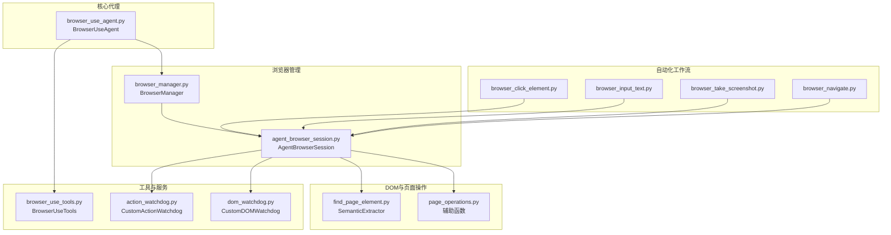
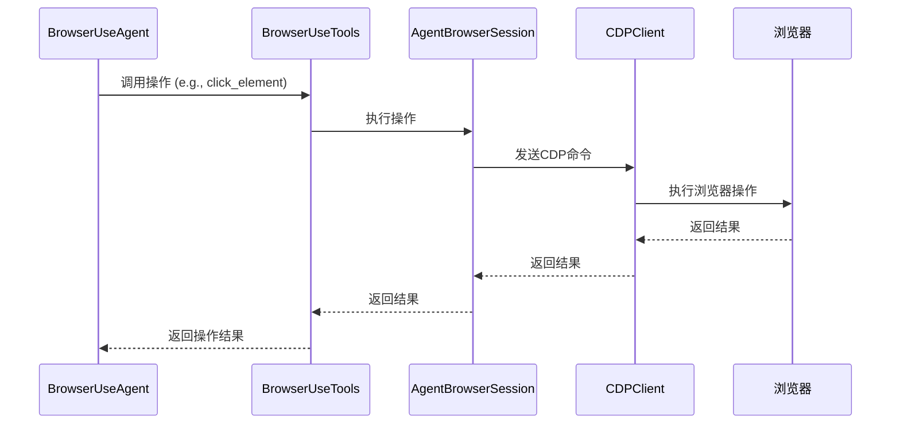
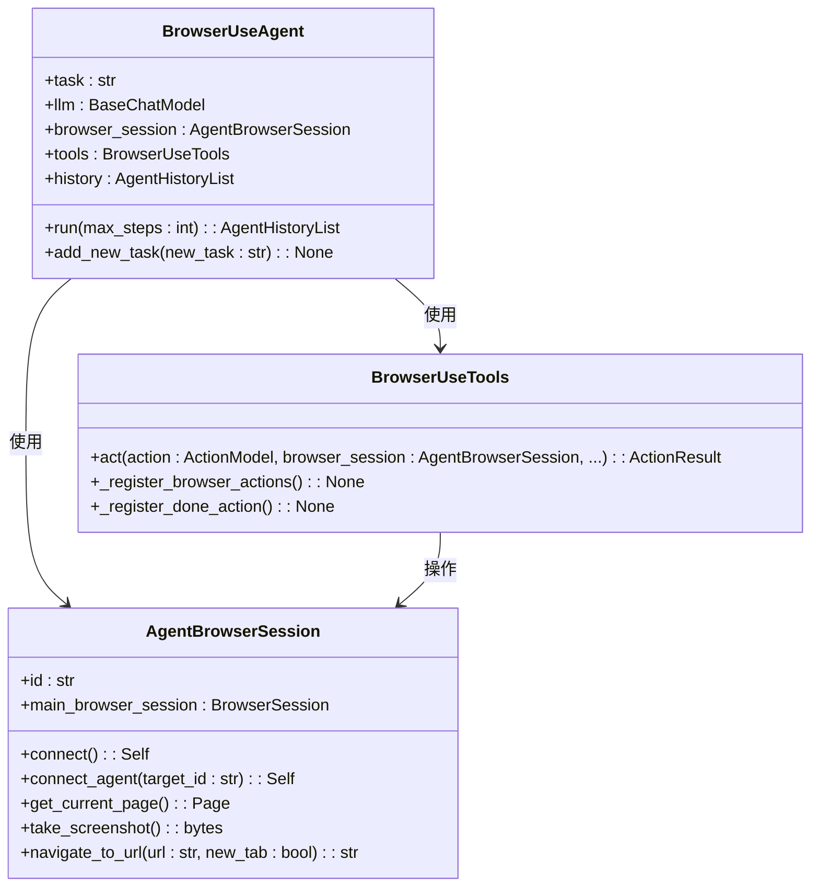
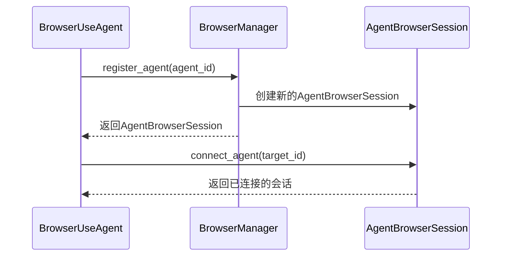
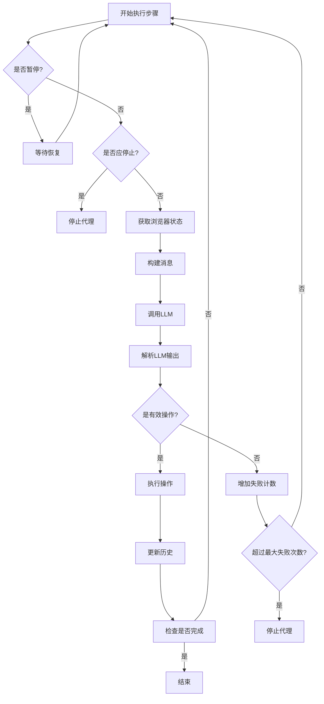
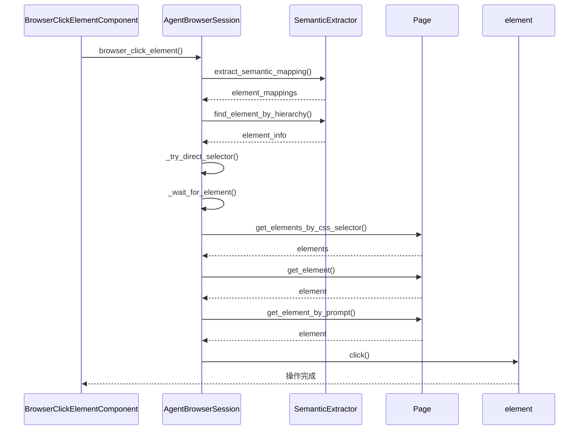
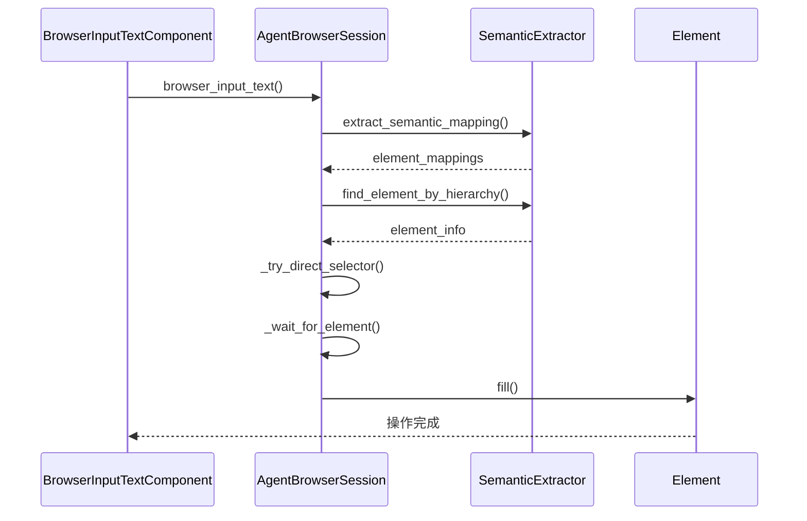
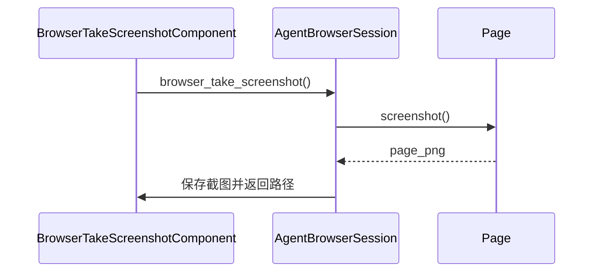
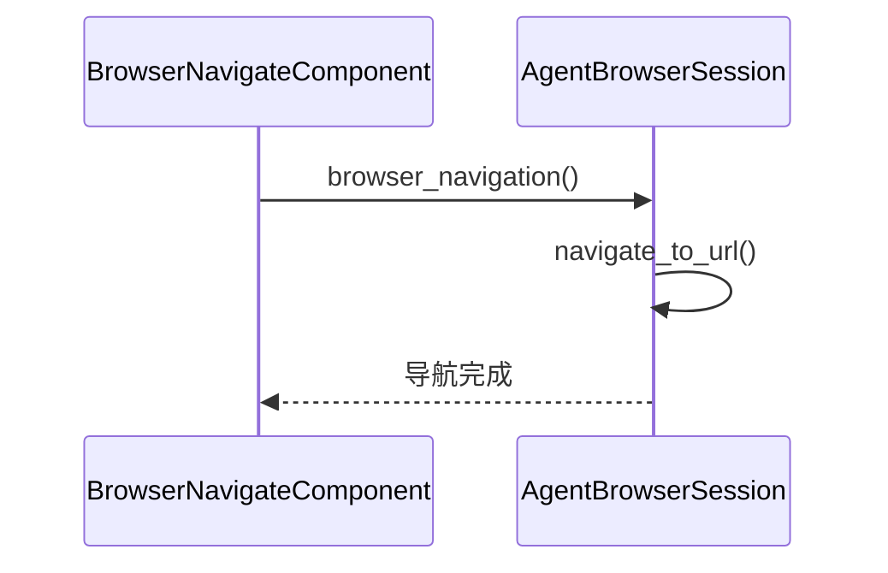
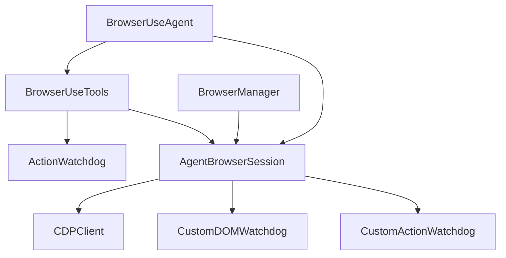

# 浏览器代理

<cite>
**本文档引用的文件**   
- [browser_use_agent.py](file://vibe_surf/agents/browser_use_agent.py)
- [browser_manager.py](file://vibe_surf/browser/browser_manager.py)
- [agent_browser_session.py](file://vibe_surf/browser/agent_browser_session.py)
- [find_page_element.py](file://vibe_surf/browser/find_page_element.py)
- [page_operations.py](file://vibe_surf/browser/page_operations.py)
- [browser_click_element.py](file://vibe_surf/workflows/Browser/browser_click_element.py)
- [browser_input_text.py](file://vibe_surf/workflows/Browser/browser_input_text.py)
- [browser_take_screenshot.py](file://vibe_surf/workflows/Browser/browser_take_screenshot.py)
- [browser_navigate.py](file://vibe_surf/workflows/Browser/browser_navigate.py)
- [browser_session.py](file://vibe_surf/workflows/Browser/browser_session.py)
- [browser_use_tools.py](file://vibe_surf/tools/browser_use_tools.py)
- [action_watchdog.py](file://vibe_surf/browser/watchdogs/action_watchdog.py)
- [dom_watchdog.py](file://vibe_surf/browser/watchdogs/dom_watchdog.py)
</cite>

## 目录
1. [引言](#引言)
2. [项目结构](#项目结构)
3. [核心组件](#核心组件)
4. [架构概述](#架构概述)
5. [详细组件分析](#详细组件分析)
6. [依赖分析](#依赖分析)
7. [性能考虑](#性能考虑)
8. [故障排除指南](#故障排除指南)
9. [结论](#结论)

## 引言
本文档详细阐述了浏览器代理系统的实现机制，重点分析了`BrowserUseAgent`的核心功能。该系统通过`browser_manager.py`与浏览器实例进行交互，实现了标签页管理、DOM操作和页面导航等自动化工作流。文档深入探讨了浏览器自动化工作流（如点击元素、输入文本、截图等操作）的执行逻辑，以及代理如何处理动态网页内容、异步加载和反爬虫机制。通过序列图展示了从代理指令到浏览器操作的完整执行流程，帮助开发者理解浏览器自动化的核心技术细节。

## 项目结构
浏览器代理系统采用模块化设计，核心组件分布在`vibe_surf`目录下。`agents`目录包含`BrowserUseAgent`的实现，负责协调自动化任务。`browser`目录管理浏览器会话和DOM操作，其中`browser_manager.py`负责多代理的隔离与资源管理。`workflows/Browser/`目录定义了具体的浏览器操作工作流，如导航、点击和输入文本。`tools`目录提供了与浏览器交互的工具集。这种分层结构确保了系统的可维护性和可扩展性。

**图表来源**
- [browser_use_agent.py](file://vibe_surf/agents/browser_use_agent.py)
- [browser_manager.py](file://vibe_surf/browser/browser_manager.py)
- [agent_browser_session.py](file://vibe_surf/browser/agent_browser_session.py)
- [find_page_element.py](file://vibe_surf/browser/find_page_element.py)
- [page_operations.py](file://vibe_surf/browser/page_operations.py)
- [browser_click_element.py](file://vibe_surf/workflows/Browser/browser_click_element.py)
- [browser_input_text.py](file://vibe_surf/workflows/Browser/browser_input_text.py)
- [browser_take_screenshot.py](file://vibe_surf/workflows/Browser/browser_take_screenshot.py)
- [browser_navigate.py](file://vibe_surf/workflows/Browser/browser_navigate.py)
- [browser_use_tools.py](file://vibe_surf/tools/browser_use_tools.py)
- [action_watchdog.py](file://vibe_surf/browser/watchdogs/action_watchdog.py)
- [dom_watchdog.py](file://vibe_surf/browser/watchdogs/dom_watchdog.py)

**章节来源**
- [browser_use_agent.py](file://vibe_surf/agents/browser_use_agent.py)
- [browser_manager.py](file://vibe_surf/browser/browser_manager.py)
- [agent_browser_session.py](file://vibe_surf/browser/agent_browser_session.py)
- [find_page_element.py](file://vibe_surf/browser/find_page_element.py)
- [page_operations.py](file://vibe_surf/browser/page_operations.py)
- [browser_click_element.py](file://vibe_surf/workflows/Browser/browser_click_element.py)
- [browser_input_text.py](file://vibe_surf/workflows/Browser/browser_input_text.py)
- [browser_take_screenshot.py](file://vibe_surf/workflows/Browser/browser_take_screenshot.py)
- [browser_navigate.py](file://vibe_surf/workflows/Browser/browser_navigate.py)
- [browser_use_tools.py](file://vibe_surf/tools/browser_use_tools.py)
- [action_watchdog.py](file://vibe_surf/browser/watchdogs/action_watchdog.py)
- [dom_watchdog.py](file://vibe_surf/browser/watchdogs/dom_watchdog.py)

## 核心组件
`BrowserUseAgent`是浏览器自动化的核心，它接收任务描述并利用LLM生成操作指令。该代理通过`browser_manager`与一个隔离的`AgentBrowserSession`进行交互，确保操作的安全性和独立性。`SemanticExtractor`类负责将页面上的可见文本映射到稳定的CSS选择器，这是实现可靠自动化操作的关键。`BrowserUseTools`类注册了各种浏览器操作（如点击、输入、导航），这些操作由LLM调用以执行具体任务。

**章节来源**
- [browser_use_agent.py](file://vibe_surf/agents/browser_use_agent.py)
- [browser_manager.py](file://vibe_surf/browser/browser_manager.py)
- [agent_browser_session.py](file://vibe_surf/browser/agent_browser_session.py)
- [find_page_element.py](file://vibe_surf/browser/find_page_element.py)
- [browser_use_tools.py](file://vibe_surf/tools/browser_use_tools.py)

## 架构概述
浏览器代理系统采用事件驱动和分层架构。`BrowserUseAgent`作为控制中心，根据LLM的决策调用`BrowserUseTools`中的具体操作。`BrowserManager`负责管理多个`AgentBrowserSession`实例，为每个代理提供独立的浏览器环境。每个`AgentBrowserSession`都与一个CDP（Chrome DevTools Protocol）客户端连接，直接与浏览器进行通信。`CustomDOMWatchdog`和`CustomActionWatchdog`等看门狗组件监听事件总线，协调DOM树的构建、截图和用户交互操作。

**图表来源**
- [browser_use_agent.py](file://vibe_surf/agents/browser_use_agent.py)
- [browser_use_tools.py](file://vibe_surf/tools/browser_use_tools.py)
- [agent_browser_session.py](file://vibe_surf/browser/agent_browser_session.py)

## 详细组件分析

### BrowserUseAgent 分析
`BrowserUseAgent`是整个自动化流程的起点。它在初始化时接收任务描述、LLM模型和浏览器会话。其核心方法`run()`在一个循环中执行，直到任务完成或达到最大步数。在每一步中，它会收集当前的浏览器状态（包括DOM和截图），将其与任务历史一起发送给LLM，然后解析LLM的响应并执行相应的操作。

#### 对象导向组件

**图表来源**
- [browser_use_agent.py](file://vibe_surf/agents/browser_use_agent.py)
- [browser_use_tools.py](file://vibe_surf/tools/browser_use_tools.py)
- [agent_browser_session.py](file://vibe_surf/browser/agent_browser_session.py)

#### API/服务组件

**图表来源**
- [browser_manager.py](file://vibe_surf/browser/browser_manager.py)
- [agent_browser_session.py](file://vibe_surf/browser/agent_browser_session.py)

#### 复杂逻辑组件

**图表来源**
- [browser_use_agent.py](file://vibe_surf/agents/browser_use_agent.py)

**章节来源**
- [browser_use_agent.py](file://vibe_surf/agents/browser_use_agent.py)
- [browser_manager.py](file://vibe_surf/browser/browser_manager.py)
- [agent_browser_session.py](file://vibe_surf/browser/agent_browser_session.py)
- [find_page_element.py](file://vibe_surf/browser/find_page_element.py)
- [page_operations.py](file://vibe_surf/browser/page_operations.py)
- [browser_use_tools.py](file://vibe_surf/tools/browser_use_tools.py)

### 浏览器自动化工作流分析
浏览器自动化工作流由`workflows/Browser/`目录下的组件实现。这些组件封装了具体的浏览器操作，并通过`AgentBrowserSession`与浏览器进行交互。

#### 点击元素工作流

**图表来源**
- [browser_click_element.py](file://vibe_surf/workflows/Browser/browser_click_element.py)
- [agent_browser_session.py](file://vibe_surf/browser/agent_browser_session.py)
- [find_page_element.py](file://vibe_surf/browser/find_page_element.py)
- [page_operations.py](file://vibe_surf/browser/page_operations.py)

#### 输入文本工作流

**图表来源**
- [browser_input_text.py](file://vibe_surf/workflows/Browser/browser_input_text.py)
- [agent_browser_session.py](file://vibe_surf/browser/agent_browser_session.py)
- [find_page_element.py](file://vibe_surf/browser/find_page_element.py)
- [page_operations.py](file://vibe_surf/browser/page_operations.py)

#### 截图工作流

**图表来源**
- [browser_take_screenshot.py](file://vibe_surf/workflows/Browser/browser_take_screenshot.py)
- [agent_browser_session.py](file://vibe_surf/browser/agent_browser_session.py)

#### 页面导航工作流

**图表来源**
- [browser_navigate.py](file://vibe_surf/workflows/Browser/browser_navigate.py)
- [agent_browser_session.py](file://vibe_surf/browser/agent_browser_session.py)

**章节来源**
- [browser_click_element.py](file://vibe_surf/workflows/Browser/browser_click_element.py)
- [browser_input_text.py](file://vibe_surf/workflows/Browser/browser_input_text.py)
- [browser_take_screenshot.py](file://vibe_surf/workflows/Browser/browser_take_screenshot.py)
- [browser_navigate.py](file://vibe_surf/workflows/Browser/browser_navigate.py)
- [agent_browser_session.py](file://vibe_surf/browser/agent_browser_session.py)
- [find_page_element.py](file://vibe_surf/browser/find_page_element.py)
- [page_operations.py](file://vibe_surf/browser/page_operations.py)

## 依赖分析
系统依赖关系清晰，`BrowserUseAgent`依赖于`BrowserUseTools`和`AgentBrowserSession`。`BrowserUseTools`依赖于`ActionWatchdog`来执行具体的浏览器操作。`AgentBrowserSession`是核心，它依赖于`CDPClient`与浏览器通信，并依赖于`CustomDOMWatchdog`来获取页面状态。`BrowserManager`作为顶层管理器，负责创建和管理所有`AgentBrowserSession`实例，确保了多代理环境下的资源隔离。

**图表来源**
- [browser_use_agent.py](file://vibe_surf/agents/browser_use_agent.py)
- [browser_use_tools.py](file://vibe_surf/tools/browser_use_tools.py)
- [agent_browser_session.py](file://vibe_surf/browser/agent_browser_session.py)
- [action_watchdog.py](file://vibe_surf/browser/watchdogs/action_watchdog.py)
- [dom_watchdog.py](file://vibe_surf/browser/watchdogs/dom_watchdog.py)
- [browser_manager.py](file://vibe_surf/browser/browser_manager.py)

**章节来源**
- [browser_use_agent.py](file://vibe_surf/agents/browser_use_agent.py)
- [browser_use_tools.py](file://vibe_surf/tools/browser_use_tools.py)
- [agent_browser_session.py](file://vibe_surf/browser/agent_browser_session.py)
- [action_watchdog.py](file://vibe_surf/browser/watchdogs/action_watchdog.py)
- [dom_watchdog.py](file://vibe_surf/browser/watchdogs/dom_watchdog.py)
- [browser_manager.py](file://vibe_surf/browser/browser_manager.py)

## 性能考虑
系统在性能方面进行了多项优化。首先，`CustomDOMWatchdog`使用并行任务同时构建DOM树和捕获截图，显著减少了获取浏览器状态的延迟。其次，`SemanticExtractor`通过缓存选择器映射来避免重复的DOM遍历。此外，`AgentBrowserSession`复用CDP连接，减少了网络开销。对于长时间运行的任务，代理实现了暂停/恢复机制，允许用户在必要时进行干预。

## 故障排除指南
当代理执行失败时，首先检查`BrowserUseAgent`的日志，它会详细记录每一步的操作和LLM的响应。如果操作失败，检查`CustomActionWatchdog`的日志，它会记录具体的CDP命令执行情况。常见的问题包括元素未找到（可能由于页面动态加载）或网络不稳定。确保`AgentBrowserSession`正确连接到浏览器，并且目标标签页是活跃的。如果遇到反爬虫机制，可以尝试调整`AgentBrowserProfile`中的用户代理和请求头。

**章节来源**
- [browser_use_agent.py](file://vibe_surf/agents/browser_use_agent.py)
- [action_watchdog.py](file://vibe_surf/browser/watchdogs/action_watchdog.py)
- [agent_browser_session.py](file://vibe_surf/browser/agent_browser_session.py)

## 结论
本文档全面分析了浏览器代理系统的架构和实现。`BrowserUseAgent`通过一个精心设计的事件驱动架构，利用LLM的决策能力来控制浏览器。系统通过`BrowserManager`和`AgentBrowserSession`实现了强大的多代理隔离和资源管理。`SemanticExtractor`和`CustomDOMWatchdog`等组件确保了对动态网页内容的可靠处理。该系统为构建复杂的浏览器自动化任务提供了一个强大而灵活的框架。