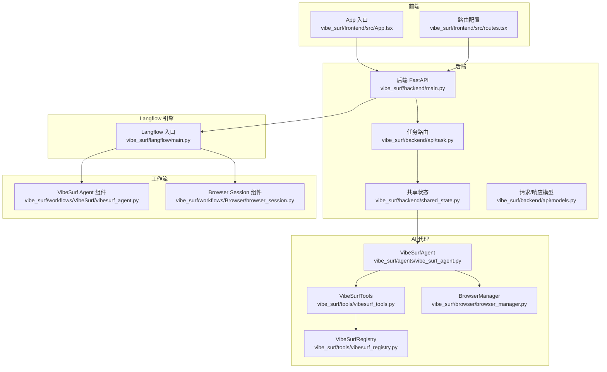
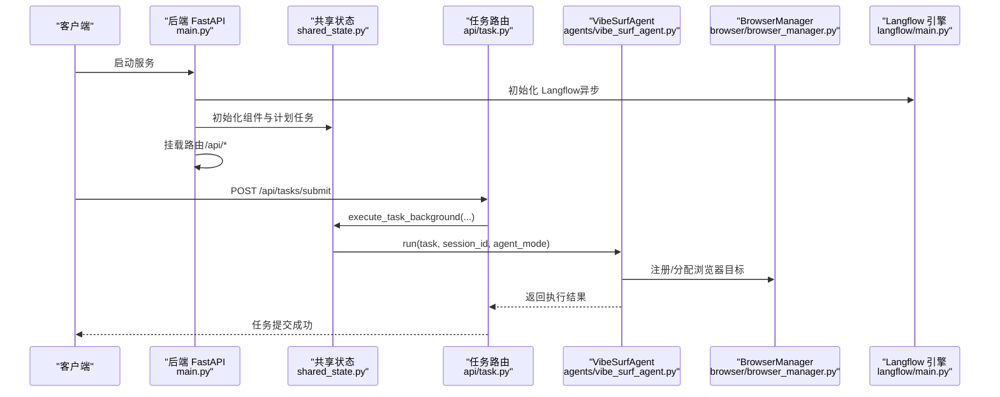
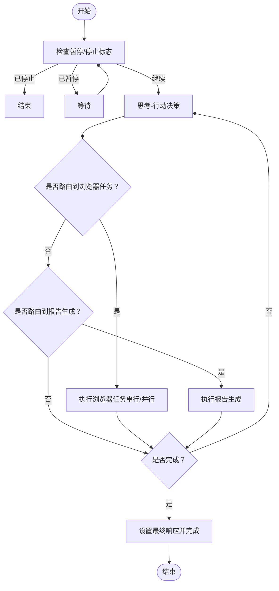
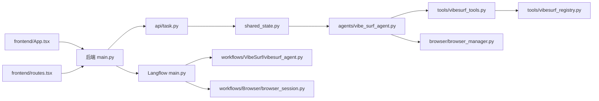

# 代码结构

<cite>
**本文引用的文件**
- [README.md](file://README.md)
- [vibe_surf/backend/main.py](file://vibe_surf/backend/main.py)
- [vibe_surf/backend/api/task.py](file://vibe_surf/backend/api/task.py)
- [vibe_surf/backend/api/models.py](file://vibe_surf/backend/api/models.py)
- [vibe_surf/backend/shared_state.py](file://vibe_surf/backend/shared_state.py)
- [vibe_surf/agents/vibe_surf_agent.py](file://vibe_surf/agents/vibe_surf_agent.py)
- [vibe_surf/tools/vibesurf_tools.py](file://vibe_surf/tools/vibesurf_tools.py)
- [vibe_surf/tools/vibesurf_registry.py](file://vibe_surf/tools/vibesurf_registry.py)
- [vibe_surf/browser/browser_manager.py](file://vibe_surf/browser/browser_manager.py)
- [vibe_surf/frontend/src/App.tsx](file://vibe_surf/frontend/src/App.tsx)
- [vibe_surf/frontend/src/routes.tsx](file://vibe_surf/frontend/src/routes.tsx)
- [vibe_surf/langflow/main.py](file://vibe_surf/langflow/main.py)
- [vibe_surf/workflows/VibeSurf/vibesurf_agent.py](file://vibe_surf/workflows/VibeSurf/vibesurf_agent.py)
- [vibe_surf/workflows/Browser/browser_session.py](file://vibe_surf/workflows/Browser/browser_session.py)
</cite>

## 目录
1. [简介](#简介)
2. [项目结构](#项目结构)
3. [核心组件](#核心组件)
4. [架构总览](#架构总览)
5. [详细组件分析](#详细组件分析)
6. [依赖关系分析](#依赖关系分析)
7. [性能考量](#性能考量)
8. [故障排查指南](#故障排查指南)
9. [结论](#结论)
10. [附录](#附录)

## 简介
本文件面向开发者与技术读者，系统性梳理 VibeSurf 的代码结构与设计思想，覆盖以下方面：
- 后端 FastAPI 服务的路由组织与业务分层
- 前端 React 应用的页面与路由组织、状态管理机制
- AI 代理（agents）的 LangGraph 工作流与控制机制
- Langflow 工作流引擎的启动、中间件与扩展机制
- 工具体系（tools）的注册与动作模型
- 预定义工作流（workflows）的组织与运行方式
- 关键入口文件与核心类说明，如后端启动逻辑、代理核心类等

## 项目结构
VibeSurf 采用“后端 + 前端 + AI 代理 + 工具 + 工作流”的多模块组织方式，核心目录如下：
- vibe_surf/backend：后端 FastAPI 服务，包含路由、数据库、共享状态、LLM 工厂等
- vibe_surf/frontend：React 前端应用，页面、路由、状态与组件
- vibe_surf/agents：AI 代理实现，基于 LangGraph 的思维-行动工作流
- vibe_surf/tools：动作注册与工具集，统一动作模型与浏览器/文件系统/第三方集成
- vibe_surf/browser：浏览器会话与目标管理，隔离多代理的浏览器上下文
- vibe_surf/langflow：Langflow 工作流引擎，提供可视化与可扩展的组件生态
- vibe_surf/workflows：预定义工作流组件，供 Langflow 图编辑器使用

图表来源
- [vibe_surf/backend/main.py](file://vibe_surf/backend/main.py#L543-L750)
- [vibe_surf/backend/shared_state.py](file://vibe_surf/backend/shared_state.py#L1-L120)
- [vibe_surf/backend/api/task.py](file://vibe_surf/backend/api/task.py#L1-L120)
- [vibe_surf/backend/api/models.py](file://vibe_surf/backend/api/models.py#L1-L120)
- [vibe_surf/agents/vibe_surf_agent.py](file://vibe_surf/agents/vibe_surf_agent.py#L1-L120)
- [vibe_surf/tools/vibesurf_tools.py](file://vibe_surf/tools/vibesurf_tools.py#L1-L120)
- [vibe_surf/tools/vibesurf_registry.py](file://vibe_surf/tools/vibesurf_registry.py#L1-L53)
- [vibe_surf/browser/browser_manager.py](file://vibe_surf/browser/browser_manager.py#L1-L120)
- [vibe_surf/frontend/src/App.tsx](file://vibe_surf/frontend/src/App.tsx#L1-L23)
- [vibe_surf/frontend/src/routes.tsx](file://vibe_surf/frontend/src/routes.tsx#L1-L120)
- [vibe_surf/langflow/main.py](file://vibe_surf/langflow/main.py#L345-L475)
- [vibe_surf/workflows/VibeSurf/vibesurf_agent.py](file://vibe_surf/workflows/VibeSurf/vibesurf_agent.py#L1-L114)
- [vibe_surf/workflows/Browser/browser_session.py](file://vibe_surf/workflows/Browser/browser_session.py#L1-L55)

章节来源
- [README.md](file://README.md#L1-L120)

## 核心组件
- 后端 FastAPI 应用：负责任务提交、执行控制、健康检查、静态资源托管，并集成 Langflow 路由
- 共享状态模块：集中存放全局组件（代理、浏览器管理器、工具、LLM、数据库、计划任务等），避免循环导入
- AI 代理（VibeSurfAgent）：基于 LangGraph 的状态机，实现“思考-行动”工作流，支持暂停/恢复/停止
- 工具体系（VibeSurfTools）：统一的动作注册与调用，封装浏览器操作、报告生成、第三方技能等
- 浏览器管理器（BrowserManager）：为每个代理分配独立浏览器目标，确保安全隔离
- 前端 React 应用：路由驱动页面导航，配合后端 API 提供用户交互界面
- Langflow 引擎：提供可视化工作流构建、组件缓存、队列与 MCP 服务初始化
- 预定义工作流组件：在 Langflow 中以组件形式暴露，便于拖拽式编排

章节来源
- [vibe_surf/backend/main.py](file://vibe_surf/backend/main.py#L543-L750)
- [vibe_surf/backend/shared_state.py](file://vibe_surf/backend/shared_state.py#L1-L120)
- [vibe_surf/agents/vibe_surf_agent.py](file://vibe_surf/agents/vibe_surf_agent.py#L1-L120)
- [vibe_surf/tools/vibesurf_tools.py](file://vibe_surf/tools/vibesurf_tools.py#L1-L120)
- [vibe_surf/browser/browser_manager.py](file://vibe_surf/browser/browser_manager.py#L1-L120)
- [vibe_surf/frontend/src/App.tsx](file://vibe_surf/frontend/src/App.tsx#L1-L23)
- [vibe_surf/langflow/main.py](file://vibe_surf/langflow/main.py#L345-L475)
- [vibe_surf/workflows/VibeSurf/vibesurf_agent.py](file://vibe_surf/workflows/VibeSurf/vibesurf_agent.py#L1-L114)

## 架构总览
后端服务启动时，会异步初始化 Langflow 引擎、浏览器连接监控、计划任务管理器，并挂载多条 API 路由。任务提交通过单任务执行模式触发后台任务，由共享状态模块协调代理执行，最终将结果持久化到数据库。

图表来源
- [vibe_surf/backend/main.py](file://vibe_surf/backend/main.py#L327-L482)
- [vibe_surf/backend/api/task.py](file://vibe_surf/backend/api/task.py#L43-L146)
- [vibe_surf/backend/shared_state.py](file://vibe_surf/backend/shared_state.py#L118-L200)
- [vibe_surf/agents/vibe_surf_agent.py](file://vibe_surf/agents/vibe_surf_agent.py#L344-L546)
- [vibe_surf/browser/browser_manager.py](file://vibe_surf/browser/browser_manager.py#L47-L122)
- [vibe_surf/langflow/main.py](file://vibe_surf/langflow/main.py#L142-L278)

## 详细组件分析

### 后端 FastAPI 服务（入口与路由）
- 入口函数与生命周期：通过 lifespan 管理 Langflow 初始化、浏览器监控、计划任务与清理
- 路由组织：按功能拆分为 task、files、activity、config、browser、voices、agent、composio、schedule、vibesurf 等
- 中间件：CORS、内容大小限制、JavaScript MIME 类型修正、Sentry 错误上报
- 健康检查与会话 ID 生成：提供 /health 与 /generate-session-id 接口
- 静态资源：可选地挂载前端构建产物，支持 SPA 回退

章节来源
- [vibe_surf/backend/main.py](file://vibe_surf/backend/main.py#L543-L750)
- [vibe_surf/backend/main.py](file://vibe_surf/backend/main.py#L327-L482)
- [vibe_surf/backend/main.py](file://vibe_surf/backend/main.py#L485-L520)

### 任务路由与单任务执行模式
- 任务提交：校验是否已有任务运行；解析 LLM 配置；持久化任务记录；后台执行
- LLM 连接测试：按配置创建 LLM 实例并进行连通性验证
- 执行控制：暂停/恢复/停止当前任务，通过共享状态维护 active_task
- 数据库交互：保存任务状态、结果与报告路径

章节来源
- [vibe_surf/backend/api/task.py](file://vibe_surf/backend/api/task.py#L1-L146)
- [vibe_surf/backend/api/task.py](file://vibe_surf/backend/api/task.py#L147-L200)
- [vibe_surf/backend/api/models.py](file://vibe_surf/backend/api/models.py#L101-L171)
- [vibe_surf/backend/shared_state.py](file://vibe_surf/backend/shared_state.py#L118-L200)

### 共享状态模块
- 全局组件：vibesurf_agent、browser_manager、vibesurf_tools、llm、db_manager、schedule_manager 等
- 单任务执行跟踪：active_task 记录当前任务状态、会话、上传文件、MCP 服务器列表
- 背景任务：execute_task_background 负责任务调度、LLM 切换、MCP/Composio 配置更新、结果落库

章节来源
- [vibe_surf/backend/shared_state.py](file://vibe_surf/backend/shared_state.py#L1-L120)
- [vibe_surf/backend/shared_state.py](file://vibe_surf/backend/shared_state.py#L118-L200)

### AI 代理（VibeSurfAgent）与 LangGraph 工作流
- 状态模型：VibeSurfState 包含原始任务、上传文件、会话 ID、当前步骤、浏览器任务/结果、最终响应等
- 控制节点包装：control_aware_node 支持暂停/恢复/停止信号
- 主节点：vibesurf_agent_node 使用“思考-行动”模式，动态生成动作模型，路由到浏览器或报告生成
- 浏览器任务执行：支持单任务串行与多任务并行，为每个任务创建独立 AgentBrowserSession 并回收
- 日志与遥测：每一步骤写入活动日志，捕获解析输出与异常事件

图表来源
- [vibe_surf/agents/vibe_surf_agent.py](file://vibe_surf/agents/vibe_surf_agent.py#L300-L343)
- [vibe_surf/agents/vibe_surf_agent.py](file://vibe_surf/agents/vibe_surf_agent.py#L344-L546)
- [vibe_surf/agents/vibe_surf_agent.py](file://vibe_surf/agents/vibe_surf_agent.py#L548-L763)

章节来源
- [vibe_surf/agents/vibe_surf_agent.py](file://vibe_surf/agents/vibe_surf_agent.py#L94-L142)
- [vibe_surf/agents/vibe_surf_agent.py](file://vibe_surf/agents/vibe_surf_agent.py#L300-L343)
- [vibe_surf/agents/vibe_surf_agent.py](file://vibe_surf/agents/vibe_surf_agent.py#L344-L546)
- [vibe_surf/agents/vibe_surf_agent.py](file://vibe_surf/agents/vibe_surf_agent.py#L548-L763)

### 工具体系与动作注册
- VibeSurfTools：统一注册文件系统、浏览器使用、报告生成、待办、技能、额外工具等动作
- VibeSurfRegistry：扩展特殊参数类型（如 browser_session、file_system、browser_manager 等），保证动作签名一致性
- 动作模型：通过 registry.create_action_model 动态生成动作模型，结合 CustomAgentOutput 输出格式

章节来源
- [vibe_surf/tools/vibesurf_tools.py](file://vibe_surf/tools/vibesurf_tools.py#L1-L120)
- [vibe_surf/tools/vibesurf_tools.py](file://vibe_surf/tools/vibesurf_tools.py#L120-L200)
- [vibe_surf/tools/vibesurf_registry.py](file://vibe_surf/tools/vibesurf_registry.py#L1-L53)

### 浏览器管理器（BrowserManager）
- 代理注册与目标分配：为每个 agent 创建 AgentBrowserSession，支持指定 target_id 或新建目标
- 安全隔离：通过 CDP 客户端与目标池管理，确保不同代理互不干扰
- 清理与关闭：注销 agent 时可选择关闭其所有标签页，断开连接并释放资源

章节来源
- [vibe_surf/browser/browser_manager.py](file://vibe_surf/browser/browser_manager.py#L1-L120)
- [vibe_surf/browser/browser_manager.py](file://vibe_surf/browser/browser_manager.py#L123-L200)

### 前端 React 应用（页面与路由）
- App 入口：加载路由、主题切换、Suspense 加载页
- 路由配置：基于 react-router-dom 的嵌套路由，支持登录保护、管理员路由、设置页、工作流页面等
- 特性开关：根据 feature flags 控制文件管理、知识库、自定义路由等

章节来源
- [vibe_surf/frontend/src/App.tsx](file://vibe_surf/frontend/src/App.tsx#L1-L23)
- [vibe_surf/frontend/src/routes.tsx](file://vibe_surf/frontend/src/routes.tsx#L1-L211)

### Langflow 工作流引擎（启动与扩展）
- 生命周期：初始化服务、LLM 缓存、默认超级用户、组件缓存、starter 项目、MCP Composer 服务、队列与日志
- 中间件：内容大小限制、JavaScript MIME 类型修正、请求取消检测、Sentry 错误上报
- 路由：包含主路由、健康检查、日志路由；可选启用 MCP 路由
- 启动脚本：支持 Prometheus 指标端口配置

章节来源
- [vibe_surf/langflow/main.py](file://vibe_surf/langflow/main.py#L142-L278)
- [vibe_surf/langflow/main.py](file://vibe_surf/langflow/main.py#L345-L475)

### 预定义工作流组件
- VibeSurf Agent 组件：在 Langflow 中作为可拖拽节点，输入任务、LLM、扩展系统提示、上传文件、代理模式，输出消息结果
- Browser Session 组件：根据配置返回主会话或为当前节点注册新的 AgentBrowserSession

章节来源
- [vibe_surf/workflows/VibeSurf/vibesurf_agent.py](file://vibe_surf/workflows/VibeSurf/vibesurf_agent.py#L1-L114)
- [vibe_surf/workflows/Browser/browser_session.py](file://vibe_surf/workflows/Browser/browser_session.py#L1-L55)

## 依赖关系分析
- 后端对 Langflow 的依赖：通过 include_router 将 Langflow 路由纳入后端应用，共享环境变量与服务
- 代理对工具与浏览器的依赖：VibeSurfAgent 通过 VibeSurfTools 调用动作，借助 BrowserManager 分配浏览器目标
- 前端对后端 API 的依赖：路由驱动页面，页面通过控制器与 API 交互
- 工具对第三方能力的依赖：Composio、MCP、金融数据、网页抓取等

图表来源
- [vibe_surf/backend/main.py](file://vibe_surf/backend/main.py#L637-L648)
- [vibe_surf/backend/api/task.py](file://vibe_surf/backend/api/task.py#L1-L60)
- [vibe_surf/backend/shared_state.py](file://vibe_surf/backend/shared_state.py#L1-L120)
- [vibe_surf/agents/vibe_surf_agent.py](file://vibe_surf/agents/vibe_surf_agent.py#L1-L120)
- [vibe_surf/tools/vibesurf_tools.py](file://vibe_surf/tools/vibesurf_tools.py#L1-L120)
- [vibe_surf/tools/vibesurf_registry.py](file://vibe_surf/tools/vibesurf_registry.py#L1-L53)
- [vibe_surf/browser/browser_manager.py](file://vibe_surf/browser/browser_manager.py#L1-L120)
- [vibe_surf/frontend/src/App.tsx](file://vibe_surf/frontend/src/App.tsx#L1-L23)
- [vibe_surf/frontend/src/routes.tsx](file://vibe_surf/frontend/src/routes.tsx#L1-L120)
- [vibe_surf/langflow/main.py](file://vibe_surf/langflow/main.py#L444-L452)
- [vibe_surf/workflows/VibeSurf/vibesurf_agent.py](file://vibe_surf/workflows/VibeSurf/vibesurf_agent.py#L1-L114)
- [vibe_surf/workflows/Browser/browser_session.py](file://vibe_surf/workflows/Browser/browser_session.py#L1-L55)

## 性能考量
- 异步初始化：Langflow 与浏览器监控在后台任务中启动，避免阻塞主服务启动
- 并行执行：浏览器任务支持并行，提升多目标场景下的吞吐量
- 组件缓存：Langflow 启动阶段进行组件类型缓存与 starter 项目创建，减少后续加载时间
- 请求处理：中间件对请求体格式与边界进行校验，防止无效负载进入业务逻辑
- 资源清理：生命周期结束时统一取消后台任务、关闭浏览器会话与数据库连接

章节来源
- [vibe_surf/backend/main.py](file://vibe_surf/backend/main.py#L165-L318)
- [vibe_surf/backend/main.py](file://vibe_surf/backend/main.py#L327-L482)
- [vibe_surf/agents/vibe_surf_agent.py](file://vibe_surf/agents/vibe_surf_agent.py#L607-L763)
- [vibe_surf/langflow/main.py](file://vibe_surf/langflow/main.py#L142-L278)

## 故障排查指南
- 任务提交失败：检查是否有正在运行的任务；确认 LLM 配置与连通性；查看数据库任务记录状态
- 浏览器连接异常：后端有浏览器监控任务，若无可用浏览器会触发优雅退出；检查浏览器进程与 CDP 可达性
- Langflow 初始化错误：关注日志中的初始化阶段错误，如服务初始化、组件缓存、starter 项目创建等
- 前端 404：后端静态资源挂载失败或路径不存在，需确认构建产物复制与挂载逻辑
- 异常上报：Sentry 中间件与 Telemetry 服务用于捕获异常与性能指标，便于定位问题

章节来源
- [vibe_surf/backend/api/task.py](file://vibe_surf/backend/api/task.py#L43-L146)
- [vibe_surf/backend/main.py](file://vibe_surf/backend/main.py#L103-L148)
- [vibe_surf/backend/main.py](file://vibe_surf/backend/main.py#L485-L520)
- [vibe_surf/langflow/main.py](file://vibe_surf/langflow/main.py#L477-L535)

## 结论
VibeSurf 通过清晰的模块划分与异步化设计，实现了从浏览器自动化到智能代理再到可视化工作流的完整链路。后端以 FastAPI 为核心，结合 Langflow 与自研代理框架，形成“单任务执行 + 多代理并行 + 可视化编排”的能力组合。工具体系与浏览器管理器保障了动作执行的安全与可控，前端路由与状态管理提供了良好的用户体验。建议在生产环境中重点关注 Langflow 初始化稳定性、浏览器连接可靠性与任务并发控制策略。

## 附录
- 关键入口文件
  - 后端启动：vibe_surf/backend/main.py
  - Langflow 启动：vibe_surf/langflow/main.py
  - 前端入口：vibe_surf/frontend/src/App.tsx
- 核心类说明
  - VibeSurfAgent：代理核心，实现 LangGraph 工作流与控制
  - VibeSurfTools：动作注册与工具集
  - BrowserManager：浏览器会话与目标管理
  - SharedState：全局组件与单任务执行跟踪

章节来源
- [vibe_surf/backend/main.py](file://vibe_surf/backend/main.py#L774-L794)
- [vibe_surf/langflow/main.py](file://vibe_surf/langflow/main.py#L536-L551)
- [vibe_surf/frontend/src/App.tsx](file://vibe_surf/frontend/src/App.tsx#L1-L23)
- [vibe_surf/agents/vibe_surf_agent.py](file://vibe_surf/agents/vibe_surf_agent.py#L1-L120)
- [vibe_surf/tools/vibesurf_tools.py](file://vibe_surf/tools/vibesurf_tools.py#L1-L120)
- [vibe_surf/browser/browser_manager.py](file://vibe_surf/browser/browser_manager.py#L1-L120)
- [vibe_surf/backend/shared_state.py](file://vibe_surf/backend/shared_state.py#L1-L120)