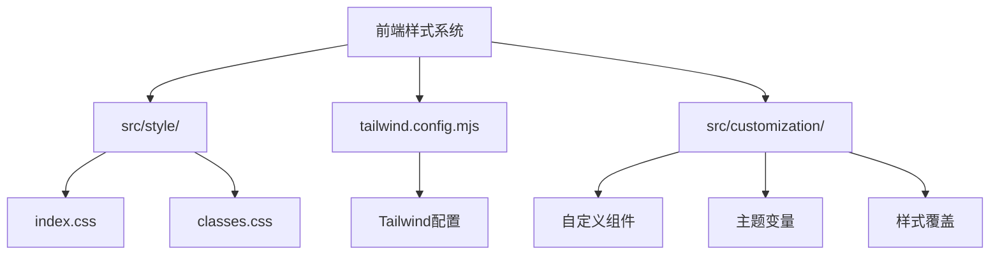
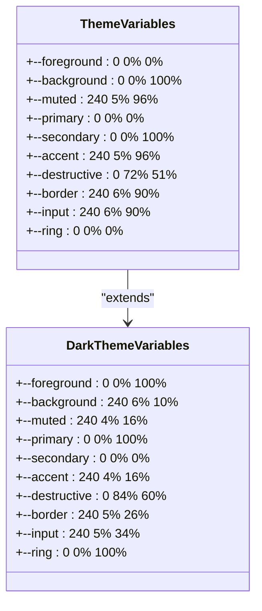
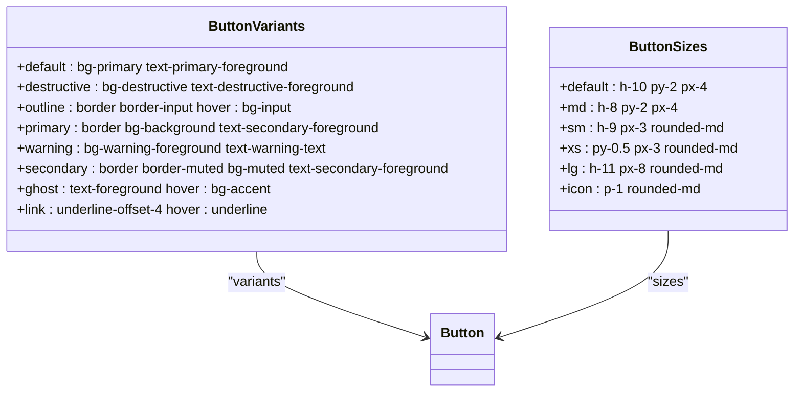
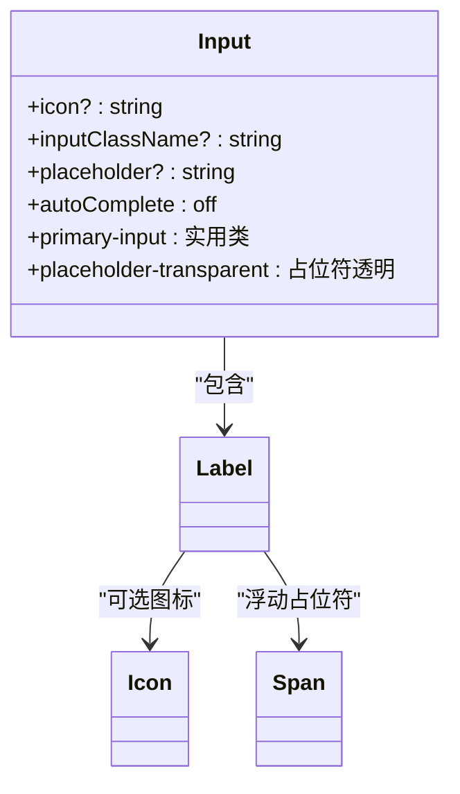
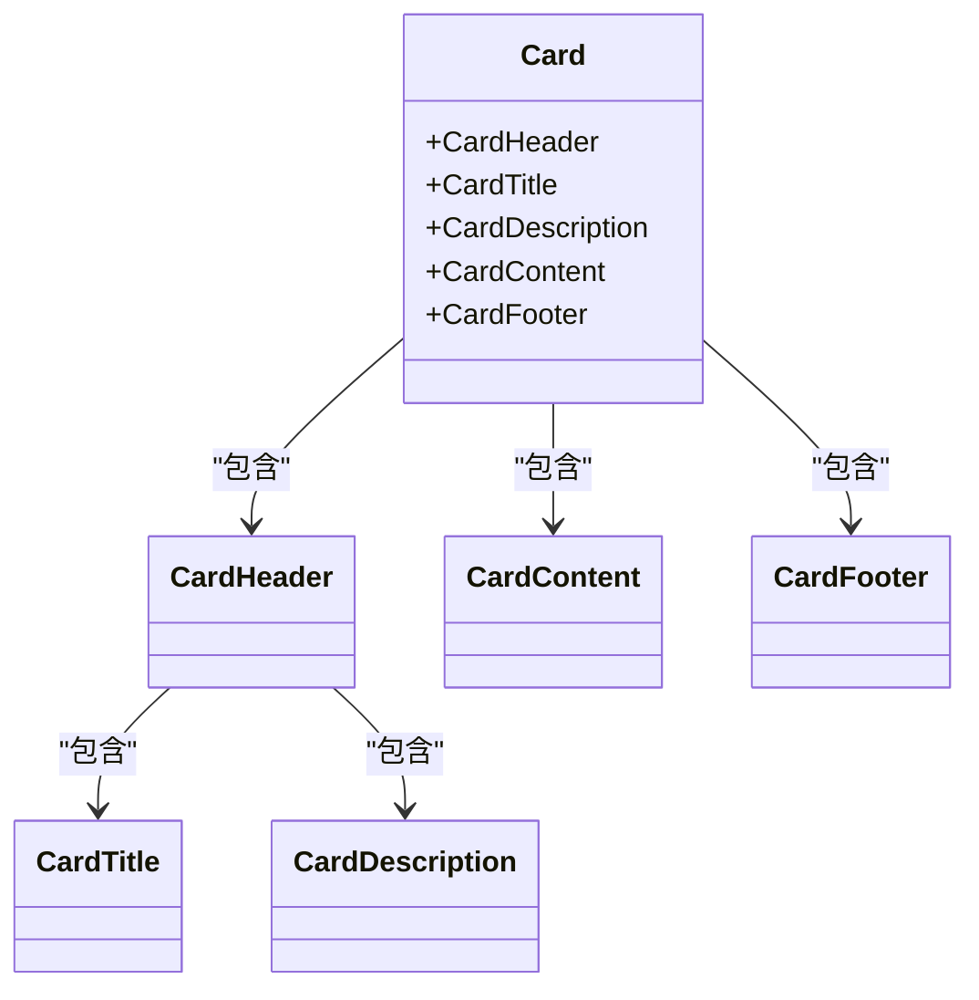
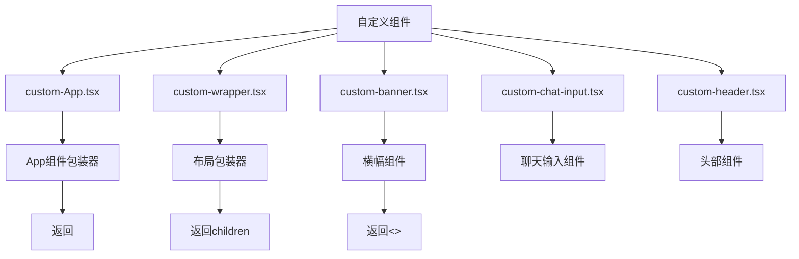
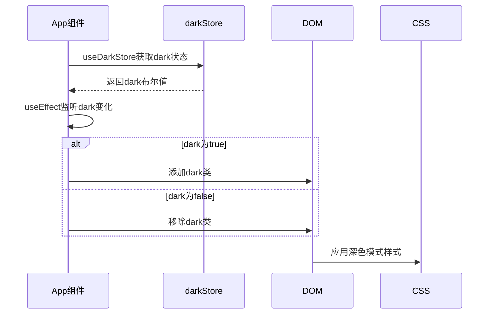

# UI样式与主题

<cite>
**本文档引用的文件**   
- [index.css](file://vibe_surf/frontend/src/style/index.css)
- [classes.css](file://vibe_surf/frontend/src/style/classes.css)
- [tailwind.config.mjs](file://vibe_surf/frontend/tailwind.config.mjs)
- [button.tsx](file://vibe_surf/frontend/src/components/ui/button.tsx)
- [input.tsx](file://vibe_surf/frontend/src/components/ui/input.tsx)
- [card.tsx](file://vibe_surf/frontend/src/components/ui/card.tsx)
- [App.tsx](file://vibe_surf/frontend/src/App.tsx)
- [custom-App.tsx](file://vibe_surf/frontend/src/customization/custom-App.tsx)
- [custom-wrapper.tsx](file://vibe_surf/frontend/src/customization/custom-wrapper.tsx)
- [config-constants.ts](file://vibe_surf/frontend/src/customization/config-constants.ts)
- [constants.ts](file://vibe_surf/frontend/src/customization/constants.ts)
</cite>

## 目录
1. [项目结构](#项目结构)
2. [核心样式架构](#核心样式架构)
3. [Tailwind CSS配置](#tailwind-css配置)
4. [shadcn/ui组件定制](#shadcnui组件定制)
5. [深度定制系统](#深度定制系统)
6. [主题架构图](#主题架构图)
7. [代码示例](#代码示例)

## 项目结构

VibeSurf的前端样式系统主要由三个核心部分组成：基础CSS文件、Tailwind配置和组件定制系统。样式文件位于`src/style/`目录下，Tailwind配置在项目根目录，而深度定制功能则通过`src/customization/`目录实现。



**图源**
- [index.css](file://vibe_surf/frontend/src/style/index.css)
- [classes.css](file://vibe_surf/frontend/src/style/classes.css)
- [tailwind.config.mjs](file://vibe_surf/frontend/tailwind.config.mjs)

**节源**
- [index.css](file://vibe_surf/frontend/src/style/index.css#L1-L465)
- [classes.css](file://vibe_surf/frontend/src/style/classes.css#L1-L435)
- [tailwind.config.mjs](file://vibe_surf/frontend/tailwind.config.mjs#L1-L522)

## 核心样式架构

VibeSurf的样式架构基于CSS变量和Tailwind CSS的组合，实现了高度可定制的主题系统。`index.css`文件定义了所有主题相关的CSS变量，这些变量在浅色和深色模式下有不同的值，支持动态主题切换。



**图源**
- [index.css](file://vibe_surf/frontend/src/style/index.css#L8-L463)

**节源**
- [index.css](file://vibe_surf/frontend/src/style/index.css#L1-L465)

## Tailwind CSS配置

Tailwind配置文件`tailwind.config.mjs`是整个样式系统的核心，它将CSS变量映射到Tailwind的实用类系统中，实现了主题的统一管理。配置中定义了颜色、动画、字体、边框半径等设计系统的基本元素。

```mermaid
flowchart TD
A[Tailwind配置] --> B[主题颜色]
A --> C[动画效果]
A --> D[字体设置]
A --> E[边框半径]
A --> F[阴影效果]
B --> G[primary: hsl(var(--primary))]
B --> H[secondary: hsl(var(--secondary))]
B --> I[accent: hsl(var(--accent))]
B --> J[destructive: hsl(var(--destructive))]
C --> K[overlayShow: 淡入动画]
C --> L[contentShow: 缩放动画]
C --> M[wiggle: 摇晃动画]
D --> N[sans: var(--font-sans)]
D --> O[mono: var(--font-mono)]
E --> P[lg: var(--radius)]
E --> Q[md: calc(var(--radius) - 2px)]
F --> R[node: 节点阴影]
F --> S[frozen-ring: 冻结环阴影]
```

**图源**
- [tailwind.config.mjs](file://vibe_surf/frontend/tailwind.config.mjs#L30-L340)

**节源**
- [tailwind.config.mjs](file://vibe_surf/frontend/tailwind.config.mjs#L1-L522)

## shadcn/ui组件定制

VibeSurf基于shadcn/ui组件库构建了UI系统，并通过`class-variance-authority`（CVA）进行样式变体管理。核心组件如按钮、输入框和卡片都定义了多种样式变体，以适应不同的使用场景。

### 按钮组件分析



**图源**
- [button.tsx](file://vibe_surf/frontend/src/components/ui/button.tsx#L7-L49)

### 输入框组件分析



**图源**
- [input.tsx](file://vibe_surf/frontend/src/components/ui/input.tsx#L1-L58)

### 卡片组件分析



**图源**
- [card.tsx](file://vibe_surf/frontend/src/components/ui/card.tsx#L1-L86)

**节源**
- [button.tsx](file://vibe_surf/frontend/src/components/ui/button.tsx#L1-L134)
- [input.tsx](file://vibe_surf/frontend/src/components/ui/input.tsx#L1-L58)
- [card.tsx](file://vibe_surf/frontend/src/components/ui/card.tsx#L1-L86)

## 深度定制系统

VibeSurf通过`src/customization/`目录提供了强大的深度定制能力，允许开发者在不修改核心代码的情况下进行UI个性化。该系统包括自定义组件、主题变量和样式覆盖三个主要方面。

### 自定义组件架构



**图源**
- [custom-App.tsx](file://vibe_surf/frontend/src/customization/custom-App.tsx)
- [custom-wrapper.tsx](file://vibe_surf/frontend/src/customization/custom-wrapper.tsx)
- [custom-banner.tsx](file://vibe_surf/frontend/src/customization/components/custom-banner.tsx)

### 主题切换机制



**图源**
- [App.tsx](file://vibe_surf/frontend/src/App.tsx#L8-L16)

**节源**
- [custom-App.tsx](file://vibe_surf/frontend/src/customization/custom-App.tsx#L1-L6)
- [custom-wrapper.tsx](file://vibe_surf/frontend/src/customization/custom-wrapper.tsx#L1-L4)
- [App.tsx](file://vibe_surf/frontend/src/App.tsx#L1-L23)

## 主题架构图

VibeSurf的主题系统通过CSS变量、Tailwind配置和组件样式的三层架构实现，确保了UI的一致性和可定制性。

```mermaid
erDiagram
CSS变量 ||--o{ Tailwind配置 : "映射"
Tailwind配置 ||--o{ UI组件 : "应用"
CSS变量 {
string :root变量
string dark变量
string 颜色变量
string 字体变量
string 半径变量
}
Tailwind配置 {
string 颜色映射
string 动画定义
string 字体配置
string 边框半径
string 阴影效果
}
UI组件 {
string 按钮
string 输入框
string 卡片
string 对话框
string 下拉菜单
}
```

**图源**
- [index.css](file://vibe_surf/frontend/src/style/index.css)
- [tailwind.config.mjs](file://vibe_surf/frontend/tailwind.config.mjs)
- [components/ui](file://vibe_surf/frontend/src/components/ui)

## 代码示例

### 修改现有主题

要修改现有主题，可以通过更新CSS变量来实现。例如，要更改主色调，可以在`index.css`中修改`--primary`变量：

```css
:root {
  --primary: 220 70% 50%; /* 新的蓝色主色调 */
  --primary-foreground: 0 0% 100%;
  --primary-hover: 220 60% 40%;
}
```

### 创建新的UI组件

创建新的UI组件时，应遵循shadcn/ui的模式，使用CVA定义样式变体：

```tsx
import { cva } from "class-variance-authority";
import { cn } from "../../utils/utils";

const myComponentVariants = cva(
  "base-styles",
  {
    variants: {
      variant: {
        default: "default-styles",
        primary: "primary-styles",
        secondary: "secondary-styles",
      },
      size: {
        sm: "small-styles",
        md: "medium-styles",
        lg: "large-styles",
      },
    },
    defaultVariants: {
      variant: "default",
      size: "md",
    },
  }
);
```

### 覆盖默认样式

要覆盖默认样式，可以在`classes.css`中添加特定的CSS规则，或使用Tailwind的实用类：

```css
/* 在classes.css中添加自定义样式 */
.custom-class {
  background: linear-gradient(45deg, #ff6b6b, #4ecdc4);
  border-radius: 1rem;
  box-shadow: 0 10px 20px rgba(0,0,0,0.1);
}
```

**节源**
- [config-constants.ts](file://vibe_surf/frontend/src/customization/config-constants.ts)
- [constants.ts](file://vibe_surf/frontend/src/customization/constants.ts)