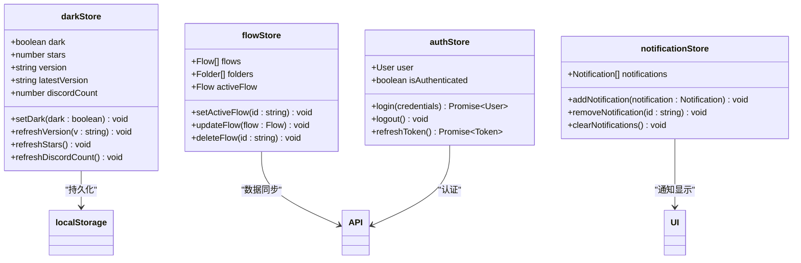
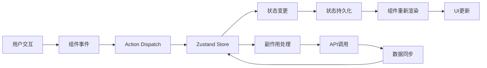
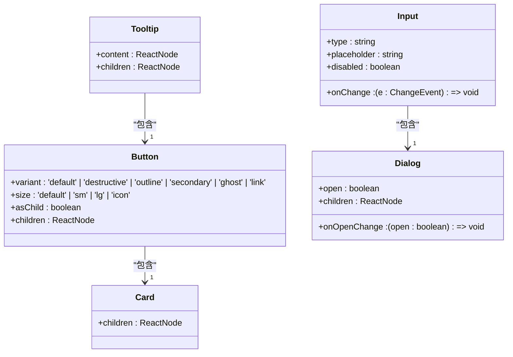
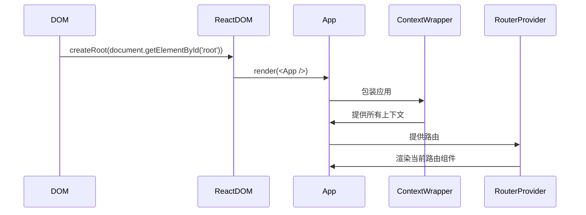
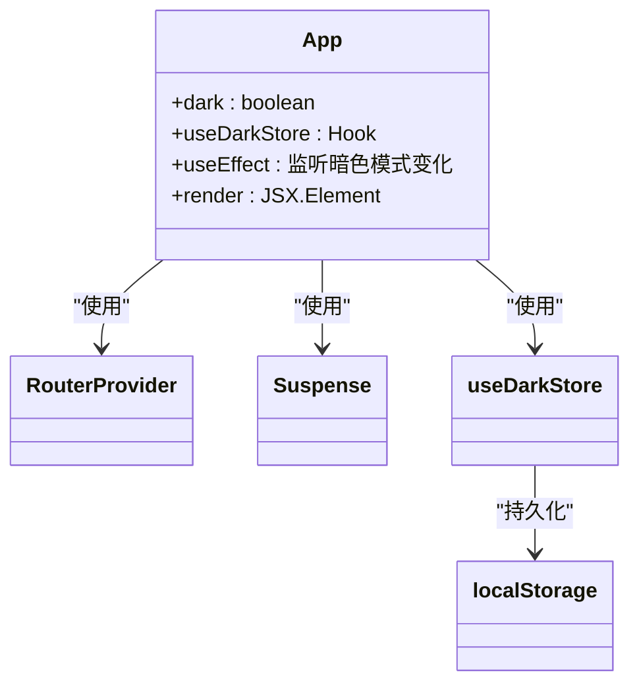
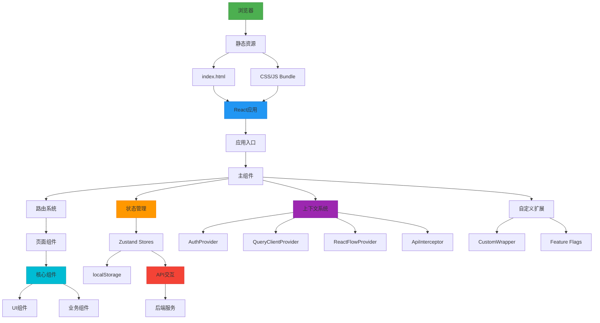

# 前端代码结构

<cite>
**本文档中引用的文件**  
- [index.tsx](file://vibe_surf/frontend/src/index.tsx)
- [App.tsx](file://vibe_surf/frontend/src/App.tsx)
- [routes.tsx](file://vibe_surf/frontend/src/routes.tsx)
- [darkStore.ts](file://vibe_surf/frontend/src/stores/darkStore.ts)
- [context/index.tsx](file://vibe_surf/frontend/src/contexts/index.tsx)
- [custom-App.tsx](file://vibe_surf/frontend/src/customization/custom-App.tsx)
- [custom-wrapper.tsx](file://vibe_surf/frontend/src/customization/custom-wrapper.tsx)
- [config-constants.ts](file://vibe_surf/frontend/src/customization/config-constants.ts)
- [feature-flags.ts](file://vibe_surf/frontend/src/customization/feature-flags.ts)
- [constants.ts](file://vibe_surf/frontend/src/constants/constants.ts)
- [use-debounce.ts](file://vibe_surf/frontend/src/hooks/use-debounce.ts)
- [components/ui](file://vibe_surf/frontend/src/components/ui)
- [components/core](file://vibe_surf/frontend/src/components/core)
- [components/authorization](file://vibe_surf/frontend/src/components/authorization)
- [pages](file://vibe_surf/frontend/src/pages)
- [stores](file://vibe_surf/frontend/src/stores)
</cite>

## 目录

1. [项目结构](#项目结构)
2. [核心组件架构](#核心组件架构)
3. [状态管理机制](#状态管理机制)
4. [UI组件库与shadcn/ui定制](#ui组件库与shadcnui定制)
5. [前端路由系统](#前端路由系统)
6. [应用入口与主组件](#应用入口与主组件)
7. [前端架构图](#前端架构图)

## 项目结构

VibeSurf前端应用的代码结构遵循清晰的模块化设计，主要位于`vibe_surf/frontend/src`目录下。该结构通过功能划分实现了高内聚、低耦合的开发模式。

```mermaid
graph TD
A[src] --> B[components]
A --> C[pages]
A --> D[stores]
A --> E[hooks]
A --> F[contexts]
A --> G[controllers]
A --> H[customization]
A --> I[constants]
A --> J[types]
A --> K[utils]
A --> L[style]
A --> M[icons]
A --> N[App.tsx]
A --> O[index.tsx]
A --> P[routes.tsx]
B --> B1[ui]
B --> B2[core]
B --> B3[common]
B --> B4[authorization]
C --> C1[MainPage]
C --> C2[SettingsPage]
C --> C3[FlowPage]
C --> C4[LoginPage]
C --> C5[AppWrapperPage]
D --> D1[darkStore.ts]
D --> D2[flowStore.ts]
D --> D3[authStore.ts]
E --> E1[use-debounce.ts]
E --> E2[use-mobile.ts]
E --> E3[use-unsaved-changes.ts]
F --> F1[authContext.tsx]
F --> F2[index.tsx]
H --> H1[custom-App.tsx]
H --> H2[custom-wrapper.tsx]
H --> H3[config-constants.ts]
H --> H4[feature-flags.ts]
```



**图示来源**  
- [App.tsx](file://vibe_surf/frontend/src/App.tsx)
- [routes.tsx](file://vibe_surf/frontend/src/routes.tsx)
- [stores](file://vibe_surf/frontend/src/stores)
- [hooks](file://vibe_surf/frontend/src/hooks)
- [contexts](file://vibe_surf/frontend/src/contexts)

**本节来源**  
- [App.tsx](file://vibe_surf/frontend/src/App.tsx)
- [routes.tsx](file://vibe_surf/frontend/src/routes.tsx)
- [stores](file://vibe_surf/frontend/src/stores)

## 核心组件架构

前端组件架构采用分层设计，各子目录职责明确：

### components目录
`components`目录包含可复用的UI组件，按功能分为：
- **ui**: 基于shadcn/ui的原子化UI组件
- **core**: 业务核心组件（如画布控制、侧边栏、工具栏）
- **common**: 通用功能组件（如加载器、错误处理、渐变包装器）
- **authorization**: 路由守卫组件，处理权限验证

### pages目录
`pages`目录包含应用的主要页面组件，每个页面通常是一个路由目标：
- **MainPage**: 主工作区，包含流程、组件、MCP等视图
- **SettingsPage**: 设置页面，包含API密钥、全局变量等子页面
- **FlowPage**: 流程编辑页面，提供画布和节点编辑功能
- **LoginPage**: 登录页面
- **AppWrapperPage**: 应用包装页面，提供基础布局

### hooks目录
`hooks`目录包含自定义React Hooks，用于封装可复用的逻辑：
- **use-debounce**: 防抖Hook，用于延迟执行函数
- **use-mobile**: 移动设备检测Hook
- **use-unsaved-changes**: 未保存更改检测Hook
- **use-is-auto-login**: 自动登录状态检测Hook

### stores目录
`stores`目录使用Zustand管理全局状态，包含多个状态存储：
- **darkStore**: 管理暗色模式状态
- **flowStore**: 管理流程相关状态
- **authStore**: 管理认证状态
- **notificationStore**: 管理通知状态

**本节来源**  
- [components](file://vibe_surf/frontend/src/components)
- [pages](file://vibe_surf/frontend/src/pages)
- [hooks](file://vibe_surf/frontend/src/hooks)
- [stores](file://vibe_surf/frontend/src/stores)

## 状态管理机制

VibeSurf前端采用Zustand作为状态管理解决方案，实现了轻量级且高效的状态管理。

### Zustand Store组织
状态存储按功能模块化组织，每个store负责特定领域的状态管理：



**图示来源**  
- [darkStore.ts](file://vibe_surf/frontend/src/stores/darkStore.ts)
- [stores](file://vibe_surf/frontend/src/stores)

### 状态流设计
状态流遵循单向数据流原则，确保状态变更的可预测性：



**图示来源**  
- [darkStore.ts](file://vibe_surf/frontend/src/stores/darkStore.ts)
- [App.tsx](file://vibe_surf/frontend/src/App.tsx)
- [contexts/index.tsx](file://vibe_surf/frontend/src/contexts/index.tsx)

**本节来源**  
- [darkStore.ts](file://vibe_surf/frontend/src/stores/darkStore.ts)
- [stores](file://vibe_surf/frontend/src/stores)

## UI组件库与shadcn/ui定制

前端UI基于shadcn/ui组件库构建，并进行了深度定制以满足特定需求。

### shadcn/ui组件实现
`components/ui`目录包含所有shadcn/ui基础组件：



**图示来源**  
- [components/ui](file://vibe_surf/frontend/src/components/ui)

### 定制化扩展
通过`customization`目录实现组件库的定制化扩展：

- **custom-wrapper.tsx**: 自定义包装器组件，用于包裹应用
- **custom-App.tsx**: 自定义应用根组件，用于集成自定义逻辑
- **config-constants.ts**: 配置常量，用于定制UI行为
- **feature-flags.ts**: 功能标志，用于控制UI功能的启用/禁用

这些定制化组件允许在不修改基础组件库的情况下，实现特定的UI需求和功能扩展。

**本节来源**  
- [components/ui](file://vibe_surf/frontend/src/components/ui)
- [customization](file://vibe_surf/frontend/src/customization)

## 前端路由系统

前端路由系统基于React Router DOM实现，提供了复杂的路由配置和权限控制。

### 路由配置
`routes.tsx`文件定义了应用的路由结构：

```mermaid
graph TD
A[/] --> B[AppInitPage]
B --> C[AppWrapperPage]
C --> D[AppAuthenticatedPage]
D --> E[MainPage]
D --> F[SettingsPage]
D --> G[FlowPage]
D --> H[AdminPage]
E --> I[flows]
E --> J[components]
E --> K[assets/files]
E --> L[assets/knowledge-bases]
F --> M[general]
F --> N[api-keys]
F --> O[global-variables]
F --> P[mcp-servers]
G --> Q[flow/:id]
G --> R[flow/:id/view]
S[Login] --> T[/login]
U[Signup] --> V[/signup]
A --> W[Playground/:id]
style A fill:#f9f,stroke:#333
style T fill:#f96,stroke:#333
style V fill:#f96,stroke:#333
```

**图示来源**  
- [routes.tsx](file://vibe_surf/frontend/src/routes.tsx)

### 路由守卫
实现多层次的路由守卫机制：

- **ProtectedRoute**: 保护需要认证的路由
- **ProtectedLoginRoute**: 保护登录相关路由（已登录用户不能访问）
- **ProtectedAdminRoute**: 保护管理员路由
- **AuthSettingsGuard**: 保护设置页面的特定路由

这些守卫组件确保用户只能访问其权限范围内的页面，增强了应用的安全性。

**本节来源**  
- [routes.tsx](file://vibe_surf/frontend/src/routes.tsx)
- [components/authorization](file://vibe_surf/frontend/src/components/authorization)

## 应用入口与主组件

### 应用入口(index.tsx)
应用入口文件`index.tsx`负责初始化React应用：



**图示来源**  
- [index.tsx](file://vibe_surf/frontend/src/index.tsx)

### 主组件(App.tsx)
主组件`App.tsx`是应用的根组件，负责协调全局状态和路由：



**图示来源**  
- [App.tsx](file://vibe_surf/frontend/src/App.tsx)
- [index.tsx](file://vibe_surf/frontend/src/index.tsx)

**本节来源**  
- [index.tsx](file://vibe_surf/frontend/src/index.tsx)
- [App.tsx](file://vibe_surf/frontend/src/App.tsx)

## 前端架构图

综合以上分析，VibeSurf前端的整体架构如下：



**图示来源**  
- [index.tsx](file://vibe_surf/frontend/src/index.tsx)
- [App.tsx](file://vibe_surf/frontend/src/App.tsx)
- [routes.tsx](file://vibe_surf/frontend/src/routes.tsx)
- [stores](file://vibe_surf/frontend/src/stores)
- [contexts/index.tsx](file://vibe_surf/frontend/src/contexts/index.tsx)
- [components](file://vibe_surf/frontend/src/components)

**本节来源**  
- [index.tsx](file://vibe_surf/frontend/src/index.tsx)
- [App.tsx](file://vibe_surf/frontend/src/App.tsx)
- [routes.tsx](file://vibe_surf/frontend/src/routes.tsx)
- [stores](file://vibe_surf/frontend/src/stores)
- [contexts](file://vibe_surf/frontend/src/contexts)
- [components](file://vibe_surf/frontend/src/components)