# 状态管理

<cite>
**本文档中引用的文件**  
- [authStore.ts](file://vibe_surf/frontend/src/stores/authStore.ts)
- [flowStore.ts](file://vibe_surf/frontend/src/stores/flowStore.ts)
- [voiceStore.ts](file://vibe_surf/frontend/src/stores/voiceStore.ts)
- [alertStore.ts](file://vibe_surf/frontend/src/stores/alertStore.ts)
- [flowsManagerStore.ts](file://vibe_surf/frontend/src/stores/flowsManagerStore.ts)
- [darkStore.ts](file://vibe_surf/frontend/src/stores/darkStore.ts)
- [utilityStore.ts](file://vibe_surf/frontend/src/stores/utilityStore.ts)
- [globalVariables.ts](file://vibe_surf/frontend/src/stores/globalVariablesStore/globalVariables.ts)
- [tweaksStore.ts](file://vibe_surf/frontend/src/stores/tweaksStore.ts)
- [typesStore.ts](file://vibe_surf/frontend/src/stores/typesStore.ts)
- [use-add-component.ts](file://vibe_surf/frontend/src/hooks/use-add-component.ts)
- [authContext.tsx](file://vibe_surf/frontend/src/contexts/authContext.tsx)
</cite>

## 目录
1. [简介](#简介)
2. [项目结构](#项目结构)
3. [核心状态管理机制](#核心状态管理机制)
4. [核心Store分析](#核心store分析)
5. [自定义Hooks与Store交互](#自定义hooks与store交互)
6. [React Context在状态管理中的作用](#react-context在状态管理中的作用)
7. [状态流图](#状态流图)
8. [状态持久化策略](#状态持久化策略)
9. [最佳实践与常见陷阱](#最佳实践与常见陷阱)
10. [结论](#结论)

## 简介
VibeSurf前端应用采用Zustand作为主要的状态管理解决方案，结合React Context实现全局状态管理。本文档详细说明了应用中基于Zustand的状态管理机制，包括各个store的设计目的、数据结构、全局与局部状态的划分原则，以及状态持久化策略。

## 项目结构
VibeSurf前端应用的状态管理主要集中在`src/stores`目录下，该目录包含了多个Zustand store文件，每个store负责管理特定领域的状态。同时，应用使用React Context来补充全局状态管理。

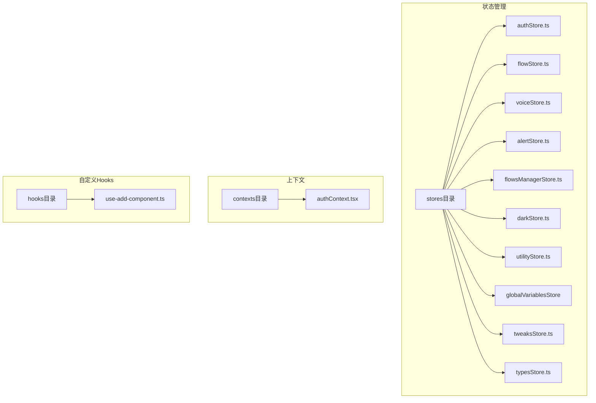

**Diagram sources**
- [authStore.ts](file://vibe_surf/frontend/src/stores/authStore.ts)
- [flowStore.ts](file://vibe_surf/frontend/src/stores/flowStore.ts)
- [voiceStore.ts](file://vibe_surf/frontend/src/stores/voiceStore.ts)
- [alertStore.ts](file://vibe_surf/frontend/src/stores/alertStore.ts)
- [flowsManagerStore.ts](file://vibe_surf/frontend/src/stores/flowsManagerStore.ts)
- [darkStore.ts](file://vibe_surf/frontend/src/stores/darkStore.ts)
- [utilityStore.ts](file://vibe_surf/frontend/src/stores/utilityStore.ts)
- [globalVariables.ts](file://vibe_surf/frontend/src/stores/globalVariablesStore/globalVariables.ts)
- [tweaksStore.ts](file://vibe_surf/frontend/src/stores/tweaksStore.ts)
- [typesStore.ts](file://vibe_surf/frontend/src/stores/typesStore.ts)
- [authContext.tsx](file://vibe_surf/frontend/src/contexts/authContext.tsx)
- [use-add-component.ts](file://vibe_surf/frontend/src/hooks/use-add-component.ts)

**Section sources**
- [authStore.ts](file://vibe_surf/frontend/src/stores/authStore.ts)
- [flowStore.ts](file://vibe_surf/frontend/src/stores/flowStore.ts)
- [voiceStore.ts](file://vibe_surf/frontend/src/stores/voiceStore.ts)
- [alertStore.ts](file://vibe_surf/frontend/src/stores/alertStore.ts)
- [flowsManagerStore.ts](file://vibe_surf/frontend/src/stores/flowsManagerStore.ts)
- [darkStore.ts](file://vibe_surf/frontend/src/stores/darkStore.ts)
- [utilityStore.ts](file://vibe_surf/frontend/src/stores/utilityStore.ts)
- [globalVariables.ts](file://vibe_surf/frontend/src/stores/globalVariablesStore/globalVariables.ts)
- [tweaksStore.ts](file://vibe_surf/frontend/src/stores/tweaksStore.ts)
- [typesStore.ts](file://vibe_surf/frontend/src/stores/typesStore.ts)
- [authContext.tsx](file://vibe_surf/frontend/src/contexts/authContext.tsx)
- [use-add-component.ts](file://vibe_surf/frontend/src/hooks/use-add-component.ts)

## 核心状态管理机制
VibeSurf应用采用Zustand作为状态管理库，这是一种轻量级的状态管理解决方案，提供了简单的API来创建和管理全局状态。Zustand store是独立的，每个store负责管理特定领域的状态，通过create函数创建。

应用中的状态管理遵循以下原则：
- **单一职责原则**：每个store只负责管理特定领域的状态
- **状态隔离**：不同领域的状态由不同的store管理，避免状态耦合
- **可预测性**：状态更新通过明确的action函数进行，确保状态变化可预测
- **持久化**：关键状态通过localStorage进行持久化存储

## 核心Store分析

### authStore
authStore负责管理用户认证相关的状态，包括访问令牌、用户数据、API密钥等。该store实现了用户登录、登出和认证状态管理功能。

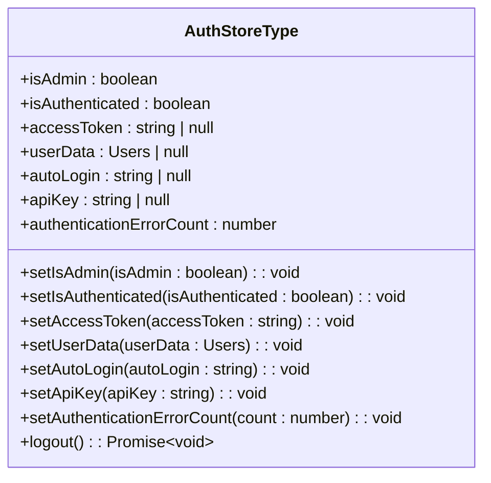

**Diagram sources**
- [authStore.ts](file://vibe_surf/frontend/src/stores/authStore.ts)

**Section sources**
- [authStore.ts](file://vibe_surf/frontend/src/stores/authStore.ts)

### flowStore
flowStore是应用中最复杂的store之一，负责管理流程图相关的状态，包括节点、边、构建状态、输入输出等。该store与React Flow库紧密集成，处理流程图的创建、编辑和执行。

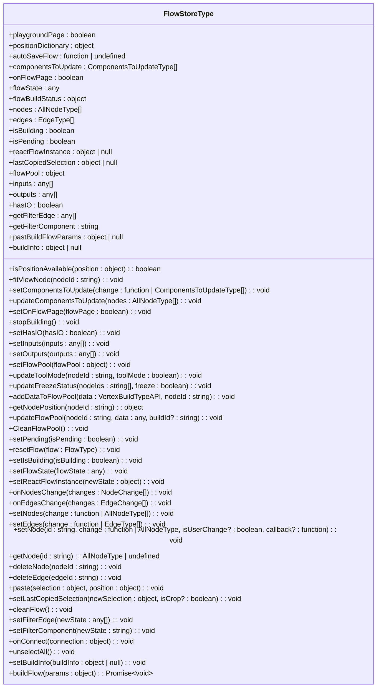

**Diagram sources**
- [flowStore.ts](file://vibe_surf/frontend/src/stores/flowStore.ts)

**Section sources**
- [flowStore.ts](file://vibe_surf/frontend/src/stores/flowStore.ts)

### voiceStore
voiceStore负责管理语音相关的状态，包括语音列表、提供商列表、语音助手激活状态等。该store支持多种语音提供商，如OpenAI和ElevenLabs。

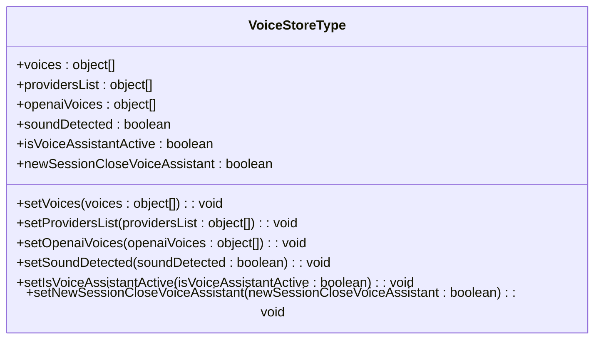

**Diagram sources**
- [voiceStore.ts](file://vibe_surf/frontend/src/stores/voiceStore.ts)

**Section sources**
- [voiceStore.ts](file://vibe_surf/frontend/src/stores/voiceStore.ts)

### alertStore
alertStore负责管理应用中的通知和警告状态，包括错误、通知和成功消息。该store实现了通知中心功能，可以存储和显示各种类型的通知。

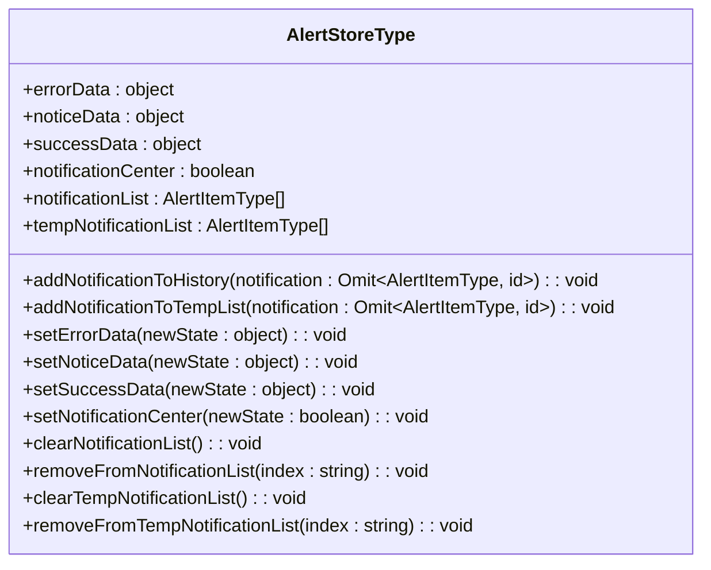

**Diagram sources**
- [alertStore.ts](file://vibe_surf/frontend/src/stores/alertStore.ts)

**Section sources**
- [alertStore.ts](file://vibe_surf/frontend/src/stores/alertStore.ts)

### flowsManagerStore
flowsManagerStore负责管理流程的创建、编辑和保存，包括撤销/重做功能、自动保存等。该store与flowStore紧密协作，管理流程的生命周期。

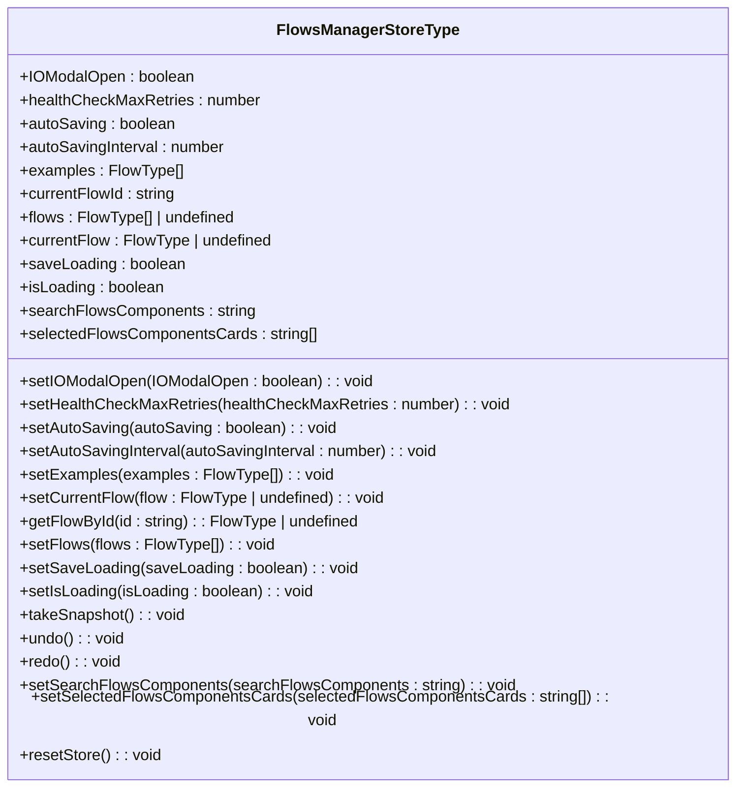

**Diagram sources**
- [flowsManagerStore.ts](file://vibe_surf/frontend/src/stores/flowsManagerStore.ts)

**Section sources**
- [flowsManagerStore.ts](file://vibe_surf/frontend/src/stores/flowsManagerStore.ts)

### darkStore
darkStore负责管理应用的主题状态，包括暗色模式、GitHub星标数、版本信息等。该store实现了主题切换和持久化功能。

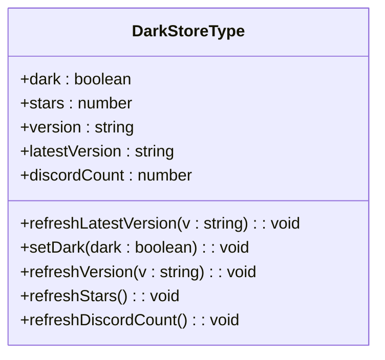

**Diagram sources**
- [darkStore.ts](file://vibe_surf/frontend/src/stores/darkStore.ts)

**Section sources**
- [darkStore.ts](file://vibe_surf/frontend/src/stores/darkStore.ts)

### utilityStore
utilityStore负责管理应用中的各种实用状态，包括客户端ID、聊天值、选中项、健康检查超时等。该store存储了应用运行时的各种配置和状态。

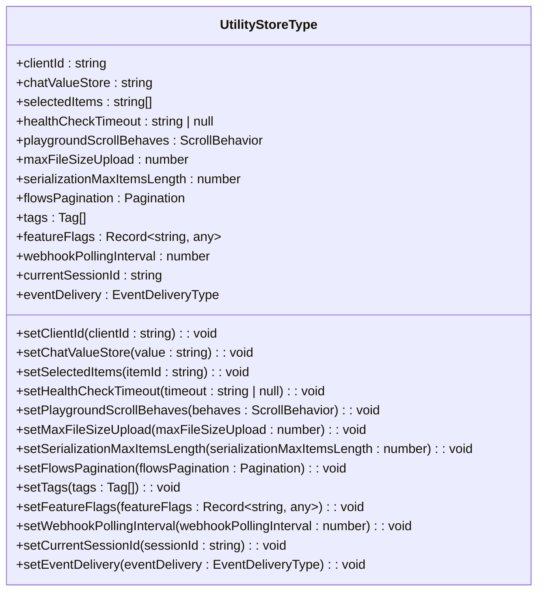

**Diagram sources**
- [utilityStore.ts](file://vibe_surf/frontend/src/stores/utilityStore.ts)

**Section sources**
- [utilityStore.ts](file://vibe_surf/frontend/src/stores/utilityStore.ts)

### globalVariablesStore
globalVariablesStore负责管理全局变量相关的状态，包括不可用字段、全局变量条目等。该store支持全局变量的动态管理和更新。

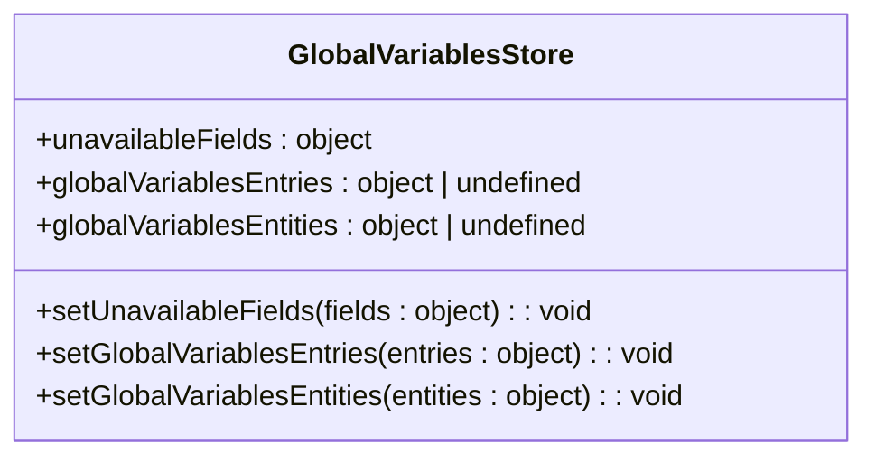

**Diagram sources**
- [globalVariables.ts](file://vibe_surf/frontend/src/stores/globalVariablesStore/globalVariables.ts)

**Section sources**
- [globalVariables.ts](file://vibe_surf/frontend/src/stores/globalVariablesStore/globalVariables.ts)

### tweaksStore
tweaksStore负责管理流程调整相关的状态，包括调整值、节点状态等。该store支持流程参数的持久化存储和恢复。

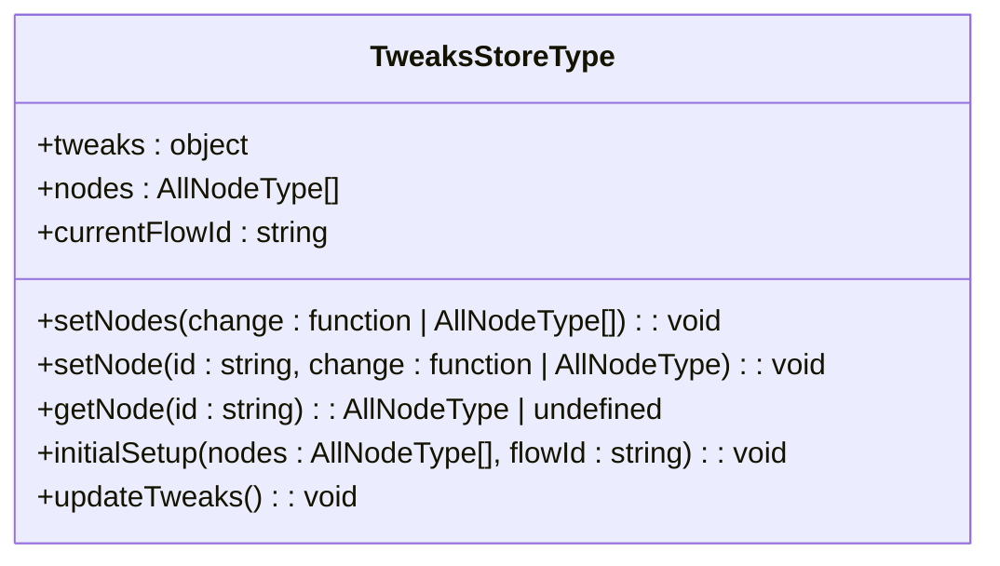

**Diagram sources**
- [tweaksStore.ts](file://vibe_surf/frontend/src/stores/tweaksStore.ts)

**Section sources**
- [tweaksStore.ts](file://vibe_surf/frontend/src/stores/tweaksStore.ts)

### typesStore
typesStore负责管理组件类型和模板相关的状态，包括组件字段、类型、模板等。该store支持动态组件的加载和管理。

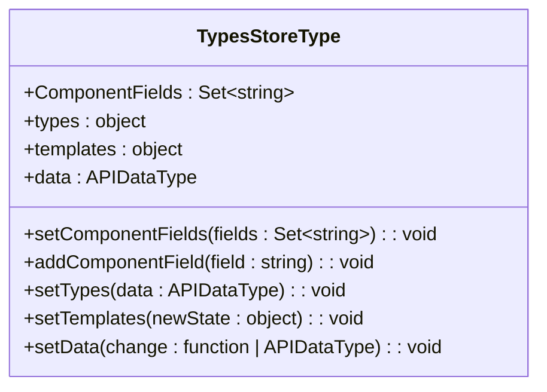

**Diagram sources**
- [typesStore.ts](file://vibe_surf/frontend/src/stores/typesStore.ts)

**Section sources**
- [typesStore.ts](file://vibe_surf/frontend/src/stores/typesStore.ts)

## 自定义Hooks与Store交互
VibeSurf应用通过自定义hooks与store进行交互，这些hooks封装了store的复杂逻辑，提供简洁的API供组件使用。

### use-add-component
use-add-component是一个自定义hook，用于在流程图中添加组件。该hook与flowStore交互，处理组件的创建和粘贴逻辑。

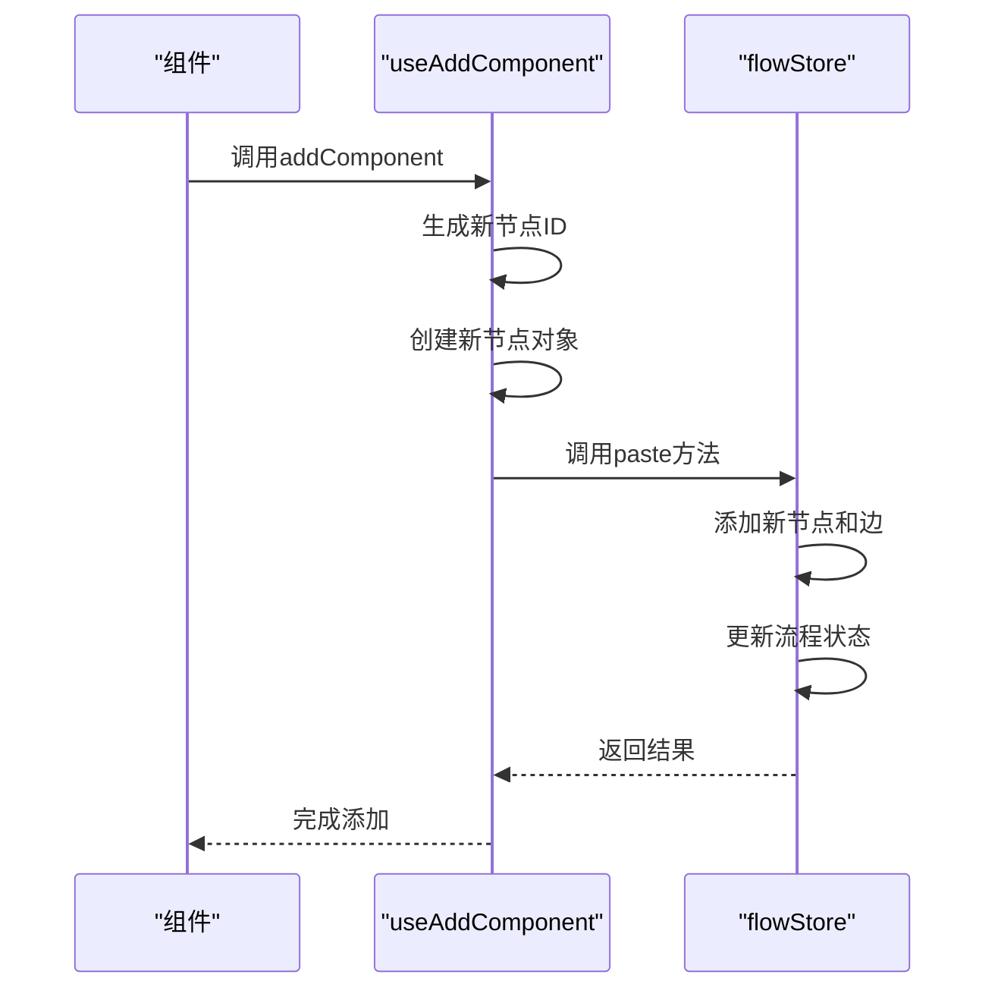

**Diagram sources**
- [use-add-component.ts](file://vibe_surf/frontend/src/hooks/use-add-component.ts)
- [flowStore.ts](file://vibe_surf/frontend/src/stores/flowStore.ts)

**Section sources**
- [use-add-component.ts](file://vibe_surf/frontend/src/hooks/use-add-component.ts)

## React Context在状态管理中的作用
VibeSurf应用使用React Context作为Zustand store的补充，主要用于全局状态的传递和初始化。authContext是应用中最重要的Context，负责管理用户认证状态。

### authContext
authContext提供了用户认证相关的状态和方法，包括访问令牌、用户数据、登录/登出功能等。该Context与authStore紧密集成，确保认证状态的一致性。

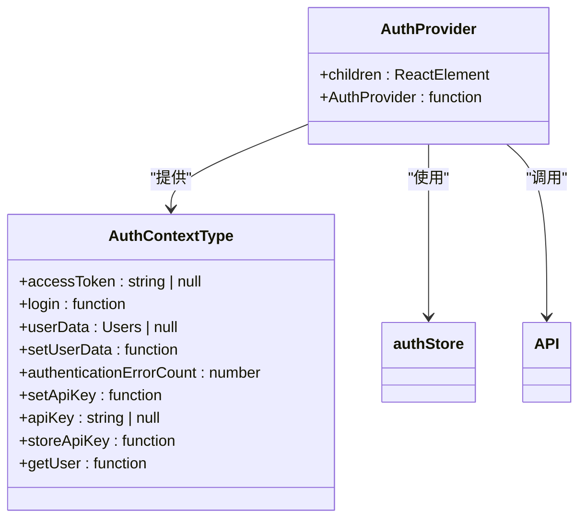

**Diagram sources**
- [authContext.tsx](file://vibe_surf/frontend/src/contexts/authContext.tsx)
- [authStore.ts](file://vibe_surf/frontend/src/stores/authStore.ts)

**Section sources**
- [authContext.tsx](file://vibe_surf/frontend/src/contexts/authContext.tsx)

## 状态流图
以下状态流图展示了用户操作如何触发状态更新以及状态变化如何驱动UI渲染。

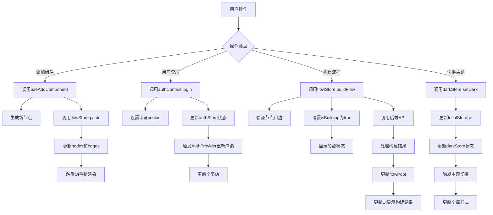

**Diagram sources**
- [use-add-component.ts](file://vibe_surf/frontend/src/hooks/use-add-component.ts)
- [authContext.tsx](file://vibe_surf/frontend/src/contexts/authContext.tsx)
- [flowStore.ts](file://vibe_surf/frontend/src/stores/flowStore.ts)
- [darkStore.ts](file://vibe_surf/frontend/src/stores/darkStore.ts)

**Section sources**
- [use-add-component.ts](file://vibe_surf/frontend/src/hooks/use-add-component.ts)
- [authContext.tsx](file://vibe_surf/frontend/src/contexts/authContext.tsx)
- [flowStore.ts](file://vibe_surf/frontend/src/stores/flowStore.ts)
- [darkStore.ts](file://vibe_surf/frontend/src/stores/darkStore.ts)

## 状态持久化策略
VibeSurf应用采用多种策略实现状态持久化，确保用户数据在页面刷新或应用重启后不会丢失。

### localStorage持久化
应用使用localStorage持久化存储关键状态，包括：
- 认证令牌和API密钥
- 主题设置（暗色模式）
- 流程调整值（tweaks）
- GitHub星标数
- 自动保存间隔

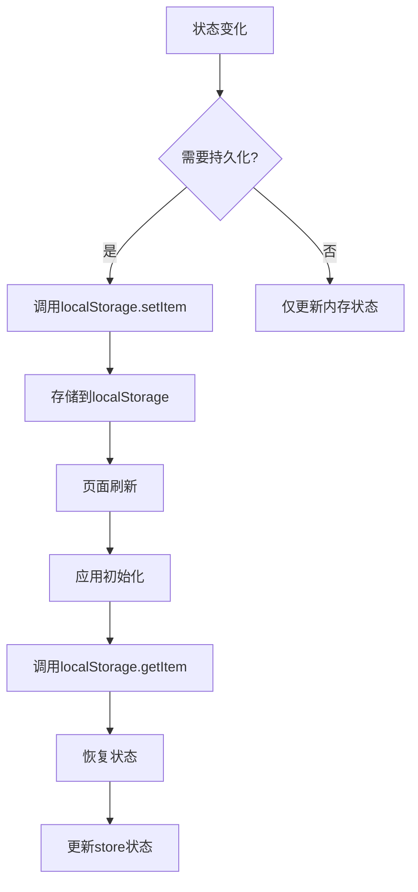

**Diagram sources**
- [authStore.ts](file://vibe_surf/frontend/src/stores/authStore.ts)
- [darkStore.ts](file://vibe_surf/frontend/src/stores/darkStore.ts)
- [tweaksStore.ts](file://vibe_surf/frontend/src/stores/tweaksStore.ts)

**Section sources**
- [authStore.ts](file://vibe_surf/frontend/src/stores/authStore.ts)
- [darkStore.ts](file://vibe_surf/frontend/src/stores/darkStore.ts)
- [tweaksStore.ts](file://vibe_surf/frontend/src/stores/tweaksStore.ts)

### Cookie持久化
应用使用cookie持久化存储认证相关的敏感信息，包括：
- 访问令牌
- 刷新令牌
- 自动登录选项

Cookie持久化提供了额外的安全层，确保认证信息在跨会话时保持安全。

### 内存状态管理
对于临时状态和高性能要求的状态，应用采用纯内存管理，不进行持久化。这些状态包括：
- 流程图的实时编辑状态
- 构建过程中的临时数据
- UI交互状态（如选中项、模态框状态）

## 最佳实践与常见陷阱

### 最佳实践
1. **单一职责原则**：每个store只负责管理特定领域的状态，避免状态耦合。
2. **状态隔离**：不同领域的状态由不同的store管理，通过明确的边界隔离状态。
3. **可预测的状态更新**：状态更新通过明确的action函数进行，避免直接修改状态。
4. **合理的持久化策略**：根据状态的重要性和敏感性选择合适的持久化方式。
5. **性能优化**：使用useSelector或store selector函数订阅特定状态，避免不必要的重新渲染。

### 常见陷阱
1. **过度使用全局状态**：将所有状态都放在全局store中，导致状态管理复杂化。
2. **状态耦合**：多个store之间存在紧密耦合，难以维护和测试。
3. **缺乏类型安全**：未使用TypeScript类型定义，导致运行时错误。
4. **持久化滥用**：对所有状态都进行持久化，影响性能和安全性。
5. **异步状态管理不当**：在异步操作中直接修改状态，导致状态不一致。

## 结论
VibeSurf前端应用的状态管理机制设计合理，采用Zustand作为主要状态管理解决方案，结合React Context实现全局状态传递。通过将状态划分为多个独立的store，应用实现了良好的状态隔离和可维护性。状态持久化策略合理，关键状态通过localStorage和cookie进行持久化，确保用户体验的一致性。自定义hooks的使用简化了store的交互，提高了代码的可重用性。整体状态管理架构清晰，易于扩展和维护。