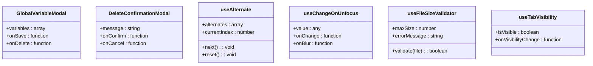

# 组件架构

<cite>
**本文档中引用的文件**  
- [App.tsx](file://vibe_surf/frontend/src/App.tsx)
- [routes.tsx](file://vibe_surf/frontend/src/routes.tsx)
- [authGuard/index.tsx](file://vibe_surf/frontend/src/components/authorization/authGuard/index.tsx)
- [dialog.tsx](file://vibe_surf/frontend/src/components/ui/dialog.tsx)
- [baseModal/index.tsx](file://vibe_surf/frontend/src/modals/baseModal/index.tsx)
- [pageLayout/index.tsx](file://vibe_surf/frontend/src/components/common/pageLayout/index.tsx)
- [index.tsx](file://vibe_surf/frontend/src/CustomEdges/index.tsx)
- [GenericNode/components/NodeName/index.tsx](file://vibe_surf/frontend/src/CustomNodes/GenericNode/components/NodeName/index.tsx)
- [GenericNode/components/NodeDescription/index.tsx](file://vibe_surf/frontend/src/CustomNodes/GenericNode/components/NodeDescription/index.tsx)
- [GenericNode/components/NodeInputField/index.tsx](file://vibe_surf/frontend/src/CustomNodes/GenericNode/components/NodeInputField/index.tsx)
- [GenericNode/components/NodeOutputParameter/index.tsx](file://vibe_surf/frontend/src/CustomNodes/GenericNode/components/NodeOutputParameter/index.tsx)
- [GenericNode/components/handleRenderComponent/index.tsx](file://vibe_surf/frontend/src/CustomNodes/GenericNode/components/handleRenderComponent/index.tsx)
- [GenericNode/components/nodeIcon/index.tsx](file://vibe_surf/frontend/src/CustomNodes/GenericNode/components/nodeIcon/index.tsx)
- [GenericNode/components/RenderInputParameters/index.tsx](file://vibe_surf/frontend/src/CustomNodes/GenericNode/components/RenderInputParameters/index.tsx)
- [GenericNode/components/NodeStatus/index.tsx](file://vibe_surf/frontend/src/CustomNodes/GenericNode/components/NodeStatus/index.tsx)
- [GenericNode/components/NodeDialogComponent/index.tsx](file://vibe_surf/frontend/src/CustomNodes/GenericNode/components/NodeDialogComponent/index.tsx)
</cite>

## 目录
1. [项目结构](#项目结构)
2. [核心组件](#核心组件)
3. [组件目录职责划分](#组件目录职责划分)
4. [工作流可视化编辑器支持](#工作流可视化编辑器支持)
5. [模态框组件设计模式](#模态框组件设计模式)
6. [共享组件设计原则](#共享组件设计原则)
7. [组件层级关系图](#组件层级关系图)

## 项目结构

**图示来源**
- [App.tsx](file://vibe_surf/frontend/src/App.tsx)
- [routes.tsx](file://vibe_surf/frontend/src/routes.tsx)

## 核心组件

VibeSurf前端应用的核心组件构成了整个系统的骨架，包括应用入口、路由系统和上下文管理。App.tsx作为应用的根组件，负责初始化React应用并提供全局上下文。

**组件来源**
- [App.tsx](file://vibe_surf/frontend/src/App.tsx)
- [routes.tsx](file://vibe_surf/frontend/src/routes.tsx)

## 组件目录职责划分

### 授权组件 (authorization)

授权组件目录包含了一系列用于处理用户认证和权限控制的高阶组件。这些组件作为路由守卫，确保只有经过适当授权的用户才能访问特定页面。

**组件来源**
- [authGuard/index.tsx](file://vibe_surf/frontend/src/components/authorization/authGuard/index.tsx)

### 通用组件 (common)

通用组件目录包含了跨应用使用的可复用UI组件，这些组件不依赖于特定业务逻辑，而是提供基础的UI功能。

**组件来源**
- [pageLayout/index.tsx](file://vibe_surf/frontend/src/components/common/pageLayout/index.tsx)

### 核心组件 (core)

核心组件目录包含了应用的关键功能组件，这些组件通常与特定业务场景紧密相关，如画布控制、卡片管理、参数渲染等。

### UI组件 (ui)

UI组件目录基于Radix UI和Tailwind CSS构建，提供了标准化的原子化UI组件，确保整个应用的视觉一致性。

**组件来源**
- [dialog.tsx](file://vibe_surf/frontend/src/components/ui/dialog.tsx)

## 工作流可视化编辑器支持

### 自定义节点 (CustomNodes)

自定义节点系统是工作流可视化编辑器的核心，每个节点代表一个可执行的操作或数据处理单元。

**组件来源**
- [GenericNode/components/NodeName/index.tsx](file://vibe_surf/frontend/src/CustomNodes/GenericNode/components/NodeName/index.tsx)
- [GenericNode/components/NodeDescription/index.tsx](file://vibe_surf/frontend/src/CustomNodes/GenericNode/components/NodeDescription/index.tsx)
- [GenericNode/components/NodeInputField/index.tsx](file://vibe_surf/frontend/src/CustomNodes/GenericNode/components/NodeInputField/index.tsx)
- [GenericNode/components/NodeOutputParameter/index.tsx](file://vibe_surf/frontend/src/CustomNodes/GenericNode/components/NodeOutputParameter/index.tsx)
- [GenericNode/components/NodeStatus/index.tsx](file://vibe_surf/frontend/src/CustomNodes/GenericNode/components/NodeStatus/index.tsx)
- [GenericNode/components/nodeIcon/index.tsx](file://vibe_surf/frontend/src/CustomNodes/GenericNode/components/nodeIcon/index.tsx)
- [GenericNode/components/RenderInputParameters/index.tsx](file://vibe_surf/frontend/src/CustomNodes/GenericNode/components/RenderInputParameters/index.tsx)

### 自定义边 (CustomEdges)

自定义边组件负责在节点之间创建连接线，可视化数据流和控制流。

**组件来源**
- [index.tsx](file://vibe_surf/frontend/src/CustomEdges/index.tsx)

## 模态框组件设计模式

### 基础模态框 (baseModal)

基础模态框组件采用复合组件模式，通过静态属性暴露子组件，提供灵活的配置选项。

**组件来源**
- [baseModal/index.tsx](file://vibe_surf/frontend/src/modals/baseModal/index.tsx)

### 模态框复用机制

模态框组件通过props传递和组合模式实现复用，不同业务场景的模态框可以继承基础模态框的功能。

## 共享组件设计原则

共享组件目录包含了跨模块使用的通用功能组件和Hook，遵循单一职责原则和可组合性原则。

**组件来源**
- [shared/components/global-variable-modal.tsx](file://vibe_surf/frontend/src/shared/components/global-variable-modal.tsx)
- [shared/components/delete-confirmation-modal.tsx](file://vibe_surf/frontend/src/shared/components/delete-confirmation-modal.tsx)
- [shared/hooks/use-alternate.tsx](file://vibe_surf/frontend/src/shared/hooks/use-alternate.tsx)
- [shared/hooks/use-change-on-unfocus.tsx](file://vibe_surf/frontend/src/shared/hooks/use-change-on-unfocus.tsx)
- [shared/hooks/use-file-size-validator.ts](file://vibe_surf/frontend/src/shared/hooks/use-file-size-validator.ts)
- [shared/hooks/use-tab-visibility.ts](file://vibe_surf/frontend/src/shared/hooks/use-tab-visibility.ts)

## 组件层级关系图

**图示来源**
- [App.tsx](file://vibe_surf/frontend/src/App.tsx)
- [routes.tsx](file://vibe_surf/frontend/src/routes.tsx)
- [pageLayout/index.tsx](file://vibe_surf/frontend/src/components/common/pageLayout/index.tsx)
- [GenericNode](file://vibe_surf/frontend/src/CustomNodes/GenericNode)
- [baseModal/index.tsx](file://vibe_surf/frontend/src/modals/baseModal/index.tsx)