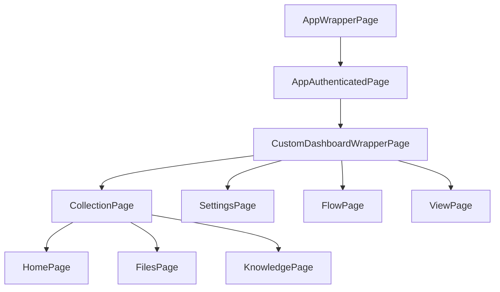
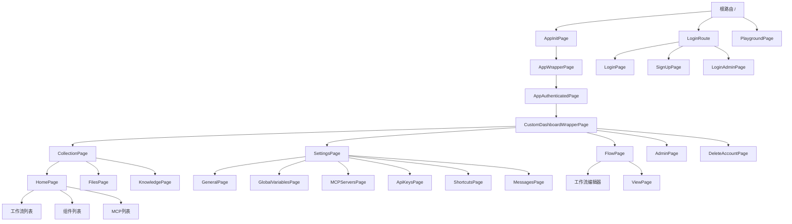
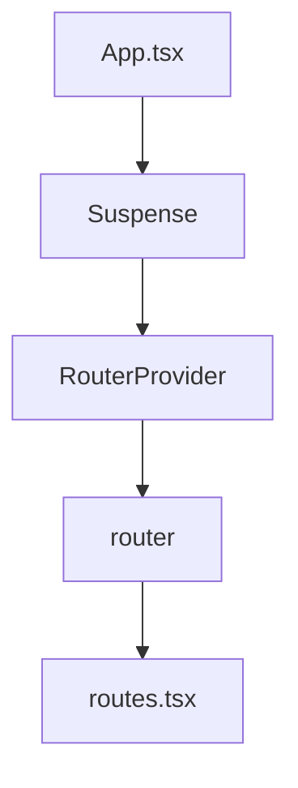

# 路由系统

<cite>
**本文档引用的文件**
- [routes.tsx](file://vibe_surf/frontend/src/routes.tsx)
- [App.tsx](file://vibe_surf/frontend/src/App.tsx)
- [AppWrapperPage/index.tsx](file://vibe_surf/frontend/src/pages/AppWrapperPage/index.tsx)
- [AppAuthenticatedPage/index.tsx](file://vibe_surf/frontend/src/pages/AppAuthenticatedPage/index.tsx)
- [DashboardWrapperPage/index.tsx](file://vibe_surf/frontend/src/pages/DashboardWrapperPage/index.tsx)
- [main-page.tsx](file://vibe_surf/frontend/src/pages/MainPage/pages/main-page.tsx)
- [homePage/index.tsx](file://vibe_surf/frontend/src/pages/MainPage/pages/homePage/index.tsx)
- [FlowPage/index.tsx](file://vibe_surf/frontend/src/pages/FlowPage/index.tsx)
- [SettingsPage/index.tsx](file://vibe_surf/frontend/src/pages/SettingsPage/index.tsx)
- [LoginPage/index.tsx](file://vibe_surf/frontend/src/pages/LoginPage/index.tsx)
- [SignUpPage/index.tsx](file://vibe_surf/frontend/src/pages/SignUpPage/index.tsx)
- [AdminPage/index.tsx](file://vibe_surf/frontend/src/pages/AdminPage/index.tsx)
- [DeleteAccountPage/index.tsx](file://vibe_surf/frontend/src/pages/DeleteAccountPage/index.tsx)
- [ViewPage/index.tsx](file://vibe_surf/frontend/src/pages/ViewPage/index.tsx)
- [custom-DashboardWrapperPage.tsx](file://vibe_surf/frontend/src/customization/components/custom-DashboardWrapperPage.tsx)
</cite>

## 目录
1. [简介](#简介)
2. [路由配置](#路由配置)
3. [页面组件与路由映射](#页面组件与路由映射)
4. [嵌套路由结构](#嵌套路由结构)
5. [动态路由与参数](#动态路由与参数)
6. [路由守卫机制](#路由守卫机制)
7. [条件性路由渲染](#条件性路由渲染)
8. [路由架构图](#路由架构图)
9. [路由系统集成](#路由系统集成)
10. [扩展路由系统](#扩展路由系统)
11. [结论](#结论)

## 简介
VibeSurf应用的前端路由系统基于React Router实现，为用户提供了一套完整的页面导航和路由管理机制。该系统定义了应用的主要页面结构，包括工作流页面、设置页面、登录页面等，并通过嵌套路由和路由守卫确保了页面访问的安全性和一致性。路由系统还支持动态路由参数和条件性渲染，允许根据配置启用或禁用特定功能页面。本文档将深入解析路由系统的实现细节，帮助开发者理解应用的导航结构并安全地扩展路由功能。

## 路由配置
VibeSurf的路由系统在`routes.tsx`文件中通过`createBrowserRouter`和`createRoutesFromElements`函数进行配置。路由配置采用了声明式语法，通过Route组件的嵌套结构定义了应用的页面层级关系。根路由配置了basename，允许应用部署在子路径下。路由配置中使用了懒加载（lazy loading）技术，通过import()函数动态导入AdminPage、PlaygroundPage和SignUp等页面组件，优化了应用的初始加载性能。

**Section sources**
- [routes.tsx](file://vibe_surf/frontend/src/routes.tsx#L49-L211)

## 页面组件与路由映射
路由系统将URL路径映射到具体的页面组件。主要页面组件包括：
- `AppInitPage`：应用初始化页面，作为根路由的入口
- `AppWrapperPage`：应用包装器页面，提供全局布局和错误边界
- `AppAuthenticatedPage`：认证后页面，处理认证后的初始化逻辑
- `CollectionPage`：主页面，显示工作流、组件等集合
- `FlowPage`：工作流页面，用于编辑和查看具体的工作流
- `SettingsPage`：设置页面，包含各种配置选项
- `LoginPage`：登录页面，用于用户身份验证
- `SignUpPage`：注册页面，用于新用户注册

这些页面组件通过路由配置与特定的URL路径关联，实现了页面间的导航。

**Section sources**
- [routes.tsx](file://vibe_surf/frontend/src/routes.tsx#L23-L44)
- [AppWrapperPage/index.tsx](file://vibe_surf/frontend/src/pages/AppWrapperPage/index.tsx#L8-L34)
- [AppAuthenticatedPage/index.tsx](file://vibe_surf/frontend/src/pages/AppAuthenticatedPage/index.tsx#L4-L9)

## 嵌套路由结构
路由系统采用了多层嵌套结构，通过Outlet组件实现布局的继承和内容的嵌套。最外层的AppWrapperPage提供全局布局，包含错误边界和通知区域。内层的AppAuthenticatedPage确保用户已认证，CustomDashboardWrapperPage提供仪表板布局，包含应用头部和主要内容区域。这种嵌套结构允许不同层级的布局组件共享通用功能，同时保持内容的独立性。

**Diagram sources**
- [routes.tsx](file://vibe_surf/frontend/src/routes.tsx#L68-L176)
- [AppWrapperPage/index.tsx](file://vibe_surf/frontend/src/pages/AppWrapperPage/index.tsx#L8-L34)
- [AppAuthenticatedPage/index.tsx](file://vibe_surf/frontend/src/pages/AppAuthenticatedPage/index.tsx#L4-L9)
- [DashboardWrapperPage/index.tsx](file://vibe_surf/frontend/src/pages/DashboardWrapperPage/index.tsx#L5-L17)

**Section sources**
- [routes.tsx](file://vibe_surf/frontend/src/routes.tsx#L68-L176)

## 动态路由与参数
路由系统支持动态路由参数，允许在URL中传递变量。例如，`/flow/:id/`路由用于访问特定ID的工作流，`/settings/general/:scrollId?`路由允许传递可选的滚动位置参数。此外，系统还支持基于URL参数的条件性导航，如`/:customParam?`路由允许通过自定义参数改变应用行为。动态路由参数通过useParams钩子在页面组件中访问，实现了基于URL参数的内容动态加载。

**Section sources**
- [routes.tsx](file://vibe_surf/frontend/src/routes.tsx#L51-L59)
- [routes.tsx](file://vibe_surf/frontend/src/routes.tsx#L170-L173)
- [routes.tsx](file://vibe_surf/frontend/src/routes.tsx#L145-L150)

## 路由守卫机制
路由系统实现了多种路由守卫，确保页面访问的安全性。`ProtectedRoute`守卫确保用户已登录后才能访问受保护的页面，`ProtectedLoginRoute`守卫防止已登录用户访问登录和注册页面，`ProtectedAdminRoute`守卫限制管理员页面的访问权限。此外，`AuthSettingsGuard`用于保护设置页面的特定部分。这些守卫通过高阶组件模式实现，在渲染目标组件前检查用户的认证状态和权限。

**Section sources**
- [routes.tsx](file://vibe_surf/frontend/src/routes.tsx#L8-L11)
- [routes.tsx](file://vibe_surf/frontend/src/routes.tsx#L74-L77)
- [routes.tsx](file://vibe_surf/frontend/src/routes.tsx#L180-L184)

## 条件性路由渲染
路由系统支持基于配置的条件性路由渲染，允许根据功能标志（feature flags）启用或禁用特定页面。例如，`ENABLE_FILE_MANAGEMENT`标志控制文件管理页面的显示，`ENABLE_KNOWLEDGE_BASES`标志控制知识库页面的显示。这种机制通过在路由配置中使用条件表达式实现，如`{ENABLE_FILE_MANAGEMENT && <Route path="assets">...</Route>}`，使得应用功能可以根据部署环境或用户需求灵活配置。

**Section sources**
- [routes.tsx](file://vibe_surf/frontend/src/routes.tsx#L86-L100)
- [routes.tsx](file://vibe_surf/frontend/src/routes.tsx#L93-L98)

## 路由架构图
以下图表展示了VibeSurf应用的主要路由架构和页面层级关系：

**Diagram sources**
- [routes.tsx](file://vibe_surf/frontend/src/routes.tsx#L49-L204)

## 路由系统集成
路由系统在`App.tsx`文件中通过RouterProvider组件集成到应用中。App组件作为应用的根组件，使用Suspense组件包裹RouterProvider，确保在路由组件加载完成前显示加载状态。这种集成方式使得路由系统能够管理整个应用的导航和页面渲染，同时与React的状态管理机制无缝协作。

**Diagram sources**
- [App.tsx](file://vibe_surf/frontend/src/App.tsx#L8-L22)
- [routes.tsx](file://vibe_surf/frontend/src/routes.tsx#L49-L211)

**Section sources**
- [App.tsx](file://vibe_surf/frontend/src/App.tsx#L8-L22)

## 扩展路由系统
开发者可以通过多种方式安全地扩展路由系统。首先，可以使用`CustomRoutesStore`和`CustomRoutesStorePages`函数在设置页面和主页面中添加自定义路由。其次，可以创建新的页面组件并将其添加到`routes.tsx`文件中的适当位置。添加新页面时，应考虑其是否需要路由守卫保护，以及是否应该根据功能标志条件性渲染。对于需要动态参数的页面，应使用`:paramName`语法定义动态路由段。

**Section sources**
- [routes.tsx](file://vibe_surf/frontend/src/routes.tsx#L154-L156)
- [routes.tsx](file://vibe_surf/frontend/src/routes.tsx#L161-L167)

## 结论
VibeSurf的前端路由系统是一个功能完整、结构清晰的导航解决方案。通过React Router的声明式API，系统实现了页面间的无缝导航和复杂的嵌套路由结构。路由守卫机制确保了应用的安全性，条件性渲染支持功能的灵活配置。开发者在扩展路由系统时，应遵循现有的设计模式，合理使用路由守卫和条件渲染，确保新功能与现有系统的一致性和安全性。