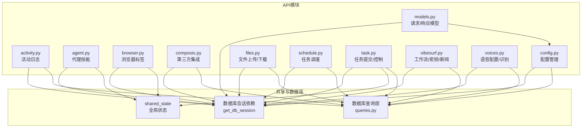
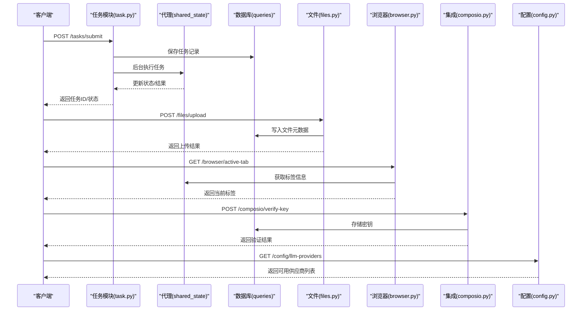
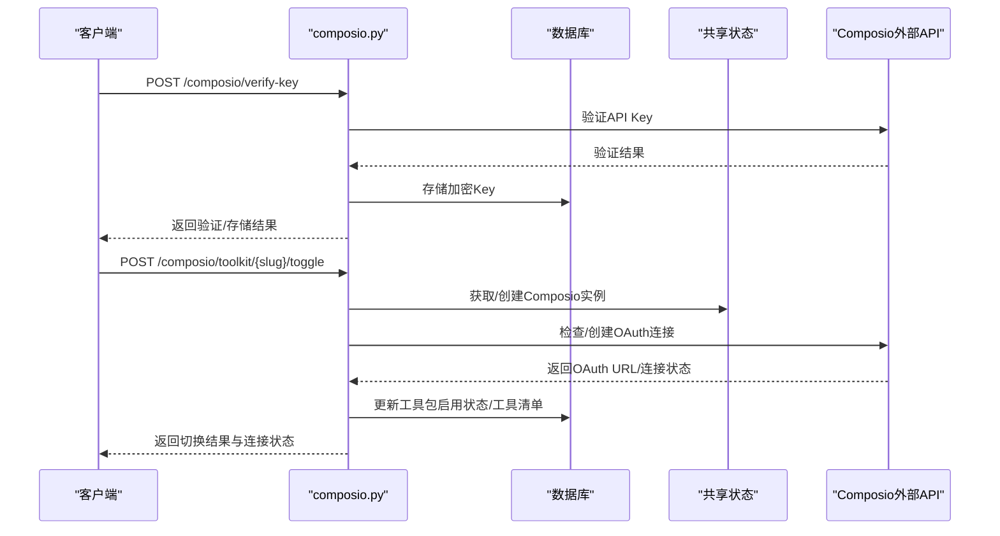
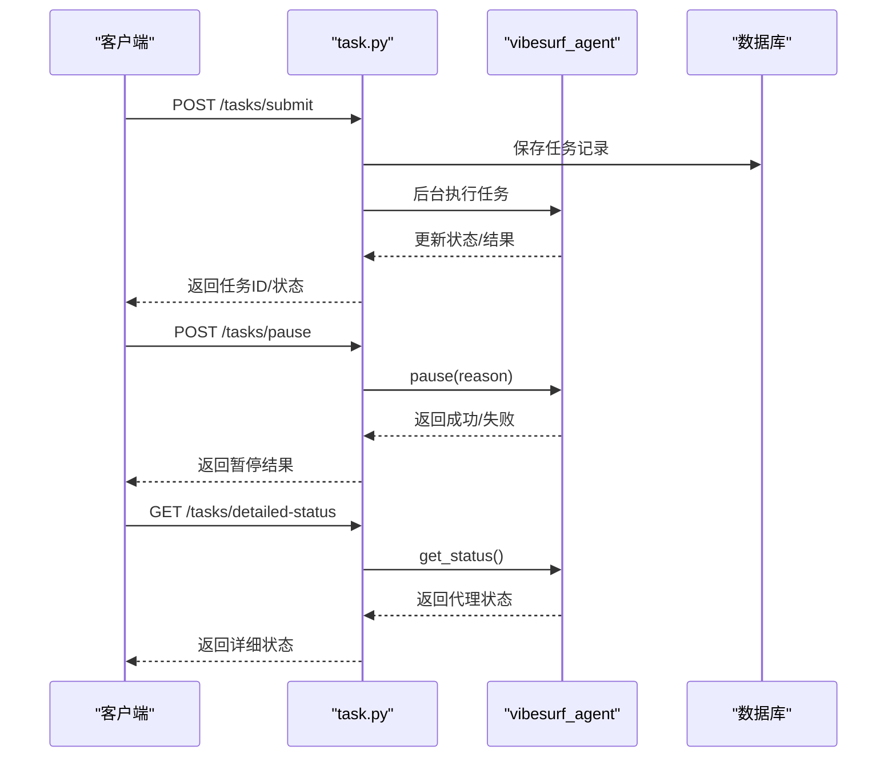
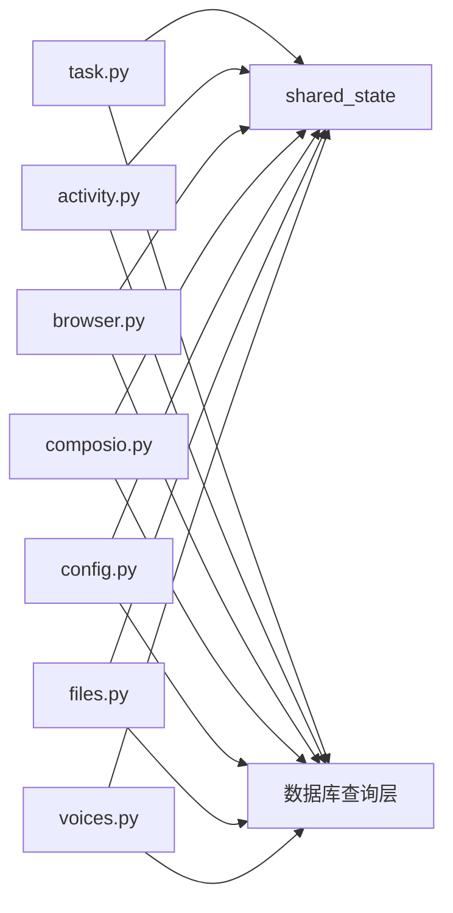

# API路由

<cite>
**本文引用的文件**
- [activity.py](file://vibe_surf/backend/api/activity.py)
- [agent.py](file://vibe_surf/backend/api/agent.py)
- [browser.py](file://vibe_surf/backend/api/browser.py)
- [composio.py](file://vibe_surf/backend/api/composio.py)
- [config.py](file://vibe_surf/backend/api/config.py)
- [files.py](file://vibe_surf/backend/api/files.py)
- [models.py](file://vibe_surf/backend/api/models.py)
- [schedule.py](file://vibe_surf/backend/api/schedule.py)
- [task.py](file://vibe_surf/backend/api/task.py)
- [vibesurf.py](file://vibe_surf/backend/api/vibesurf.py)
- [voices.py](file://vibe_surf/backend/api/voices.py)
</cite>

## 目录
1. [简介](#简介)
2. [项目结构](#项目结构)
3. [核心组件](#核心组件)
4. [架构总览](#架构总览)
5. [详细组件分析](#详细组件分析)
6. [依赖分析](#依赖分析)
7. [性能考虑](#性能考虑)
8. [故障排查指南](#故障排查指南)
9. [结论](#结论)
10. [附录](#附录)

## 简介
本文件系统性梳理 VibeSurf 后端 API 路由，覆盖用户活动跟踪、代理管理、浏览器控制、第三方服务集成（Composio）、配置管理、文件操作、模型与工具配置、任务调度、任务执行、核心代理功能以及语音配置等模块。文档逐模块说明端点的 HTTP 方法、URL 路径、请求/响应格式、认证要求与使用示例，并解释模块间的依赖关系与调用流程，同时给出版本控制策略与错误处理机制建议，帮助开发者扩展或修改现有 API。

## 项目结构
后端 API 模块位于 vibe_surf/backend/api 下，每个模块对应一个命名空间前缀（如 /activity、/agent、/browser 等），统一通过 FastAPI 路由器注册，使用数据库会话依赖注入与共享状态进行跨模块协作。

图表来源
- [activity.py](file://vibe_surf/backend/api/activity.py#L1-L246)
- [agent.py](file://vibe_surf/backend/api/agent.py#L1-L38)
- [browser.py](file://vibe_surf/backend/api/browser.py#L1-L71)
- [composio.py](file://vibe_surf/backend/api/composio.py#L1-L800)
- [config.py](file://vibe_surf/backend/api/config.py#L1-L762)
- [files.py](file://vibe_surf/backend/api/files.py#L1-L332)
- [models.py](file://vibe_surf/backend/api/models.py#L1-L260)
- [schedule.py](file://vibe_surf/backend/api/schedule.py#L1-L331)
- [task.py](file://vibe_surf/backend/api/task.py#L1-L379)
- [vibesurf.py](file://vibe_surf/backend/api/vibesurf.py#L1-L681)
- [voices.py](file://vibe_surf/backend/api/voices.py#L1-L481)

章节来源
- [activity.py](file://vibe_surf/backend/api/activity.py#L1-L246)
- [agent.py](file://vibe_surf/backend/api/agent.py#L1-L38)
- [browser.py](file://vibe_surf/backend/api/browser.py#L1-L71)
- [composio.py](file://vibe_surf/backend/api/composio.py#L1-L800)
- [config.py](file://vibe_surf/backend/api/config.py#L1-L762)
- [files.py](file://vibe_surf/backend/api/files.py#L1-L332)
- [models.py](file://vibe_surf/backend/api/models.py#L1-L260)
- [schedule.py](file://vibe_surf/backend/api/schedule.py#L1-L331)
- [task.py](file://vibe_surf/backend/api/task.py#L1-L379)
- [vibesurf.py](file://vibe_surf/backend/api/vibesurf.py#L1-L681)
- [voices.py](file://vibe_surf/backend/api/voices.py#L1-L481)

## 核心组件
- 路由器与前缀：各模块以 APIRouter 定义，设置 prefix 作为命名空间，便于统一管理与版本化。
- 数据库依赖：通过 get_db_session 注入 AsyncSession，确保事务安全与并发访问。
- 共享状态：通过 shared_state 访问全局对象（如 agent、browser_manager、tools 等）。
- 请求/响应模型：使用 Pydantic BaseModel 进行参数校验与序列化，提升一致性与可维护性。
- 错误处理：统一捕获异常并返回 HTTPException，包含明确的状态码与错误信息。

章节来源
- [models.py](file://vibe_surf/backend/api/models.py#L1-L260)
- [config.py](file://vibe_surf/backend/api/config.py#L1-L762)
- [task.py](file://vibe_surf/backend/api/task.py#L1-L379)

## 架构总览
下图展示各模块间的主要交互关系与数据流向。

图表来源
- [task.py](file://vibe_surf/backend/api/task.py#L1-L379)
- [files.py](file://vibe_surf/backend/api/files.py#L1-L332)
- [browser.py](file://vibe_surf/backend/api/browser.py#L1-L71)
- [composio.py](file://vibe_surf/backend/api/composio.py#L1-L800)
- [config.py](file://vibe_surf/backend/api/config.py#L1-L762)

## 详细组件分析

### 活动日志与任务历史（activity.py）
- 功能概述：提供任务历史查询、会话聚合统计、实时代理活动日志拉取与最新活动摘要。
- 关键端点
  - GET /activity/tasks：最近任务列表，支持 limit 参数（-1 表示全部）。
  - GET /activity/sessions：会话列表，支持 limit/offset 分页。
  - GET /activity/sessions/{session_id}/tasks：按会话查询任务。
  - GET /activity/{task_id}：按任务ID查询任务详情。
  - GET /activity/sessions/{session_id}/activity：按会话获取活动日志，支持 limit 与 message_index。
  - GET /activity/sessions/{session_id}/latest_activity：获取最新代理日志与任务摘要。
- 认证与权限：无显式鉴权装饰器；若代理未初始化，部分端点返回 503。
- 响应格式：统一返回字典，包含数据数组、计数与分页字段；活动日志为时间戳、级别、消息与可选元数据。
- 使用示例
  - 获取最近任务：GET /activity/tasks?limit=50
  - 获取某会话活动日志：GET /activity/sessions/{session_id}/activity?limit=100
- 依赖关系：依赖数据库 TaskQueries；依赖共享状态中的 vibesurf_agent 获取实时日志。

章节来源
- [activity.py](file://vibe_surf/backend/api/activity.py#L1-L246)

### 代理技能（agent.py）
- 功能概述：从工具注册表中提取技能名称（去除前缀“skill_”），用于前端展示与选择。
- 关键端点
  - GET /agent/get_all_skills：返回技能名称列表。
- 认证与权限：无显式鉴权装饰器；若工具未初始化，返回 500。
- 响应格式：JSON 数组字符串列表。
- 使用示例
  - GET /agent/get_all_skills

章节来源
- [agent.py](file://vibe_surf/backend/api/agent.py#L1-L38)

### 浏览器控制（browser.py）
- 功能概述：提供当前活动标签与全部标签信息查询，依赖浏览器管理器。
- 关键端点
  - GET /browser/active-tab：返回当前活动标签的字典结构（键为目标ID后缀，值为 url/title）。
  - GET /browser/all-tabs：返回所有页面标签的字典结构。
- 认证与权限：无显式鉴权装饰器；若浏览器管理器未初始化，返回 503。
- 响应格式：字典结构，键为标签ID后缀，值为 url/title。
- 使用示例
  - GET /browser/active-tab
  - GET /browser/all-tabs

章节来源
- [browser.py](file://vibe_surf/backend/api/browser.py#L1-L71)

### 第三方服务集成（composio.py）
- 功能概述：Composio 集成管理，包括 API Key 验证与存储、工具包状态同步、启用/禁用工具包、OAuth 授权流程、工具清单与连接状态检查。
- 关键端点
  - GET /composio/status：检查连接状态（是否已创建实例、是否有有效 Key、是否可重建实例）。
  - POST /composio/verify-key：验证并存储 Composio API Key，返回验证结果与消息。
  - GET /composio/toolkits：列出工具包，支持与 API 同步；返回工具包列表与同步计数。
  - POST /composio/toolkit/{slug}/toggle：启用/禁用工具包，必要时生成 OAuth URL 并返回连接状态。
  - GET /composio/toolkit/{slug}/tools：获取指定工具包的工具清单，优先从数据库读取，否则从 API 抓取并缓存。
- 认证与权限：除 verify-key 外，其余端点通常无需鉴权；toggle 可能触发 OAuth，需前端引导授权。
- 响应格式：使用 Pydantic 模型定义，如 ComposioKeyVerifyResponse、ComposioToolkitListResponse、ComposioToolkitToggleResponse、ComposioToolsResponse 等。
- 使用示例
  - 验证并存储 Key：POST /composio/verify-key（请求体含 api_key）
  - 启用工具包：POST /composio/toolkit/{slug}/toggle（请求体含 enabled/force_reauth）
- 依赖关系：依赖数据库 Credentials 与 Toolkit 查询；依赖共享状态中的 composio_instance；异步调用外部 Composio API。

图表来源
- [composio.py](file://vibe_surf/backend/api/composio.py#L1-L800)

章节来源
- [composio.py](file://vibe_surf/backend/api/composio.py#L1-L800)

### 配置管理（config.py）
- 功能概述：LLM 与 MCP 配置管理、可用供应商与模型查询、整体配置状态检查、环境变量管理。
- 关键端点
  - LLM 配置
    - POST /config/llm-profiles：创建新 LLM 配置，支持默认配置自动更新。
    - GET /config/llm-profiles：列出 LLM 配置，支持 active_only/limit/offset。
    - GET /config/llm-profiles/{profile_name}：按名称获取配置。
    - PUT /config/llm-profiles/{profile_name}：更新配置，支持设置默认。
    - DELETE /config/llm-profiles/{profile_name}：删除配置（禁止删除默认配置）。
    - POST /config/llm-profiles/{profile_name}/set-default：设置默认配置。
    - GET /config/llm-profiles/default/current：获取当前默认配置。
  - MCP 配置
    - POST /config/mcp-profiles：创建 MCP 配置。
    - GET /config/mcp-profiles：列出 MCP 配置。
    - GET /config/mcp-profiles/{mcp_id}：按 ID 获取配置。
    - PUT /config/mcp-profiles/{mcp_id}：更新配置。
    - DELETE /config/mcp-profiles/{mcp_id}：删除配置。
  - 供应商与模型
    - GET /config/llm/providers：获取可用供应商列表与元数据。
    - GET /config/llm/providers/{provider_name}/models：获取指定供应商模型列表。
  - 配置状态
    - GET /config/status：返回 LLM 配置、工具、浏览器、代理初始化状态与总体状态。
  - 环境变量
    - GET /config/environments：获取当前环境变量。
    - PUT /config/environments：更新允许的环境变量。
- 认证与权限：无显式鉴权装饰器；部分端点依赖共享状态中的工具与代理初始化。
- 响应格式：使用 Pydantic 模型定义，如 LLMProfileResponse、McpProfileResponse、ErrorResponse 等。
- 使用示例
  - 创建 LLM 配置：POST /config/llm-profiles（请求体含 profile_name/provider/model 等）
  - 设置默认：POST /config/llm-profiles/{profile_name}/set-default
  - 获取供应商：GET /config/llm/providers

章节来源
- [config.py](file://vibe_surf/backend/api/config.py#L1-L762)
- [models.py](file://vibe_surf/backend/api/models.py#L1-L260)

### 文件操作（files.py）
- 功能概述：上传文件到工作区目录、下载文件、列出上传文件、删除文件、列出会话目录树。
- 关键端点
  - POST /files/upload：多文件上传，支持 session_id 关联；返回每文件元数据与上传目录。
  - GET /files/{file_id}：下载文件（FileResponse）。
  - GET /files：列出上传文件，支持 session_id/limit/offset 过滤。
  - DELETE /files/{file_id}：软删除文件记录并移除磁盘文件。
  - GET /files/session/{session_id}：列出会话目录下的文件与目录（可选包含目录）。
- 认证与权限：无显式鉴权装饰器；下载时进行路径安全检查（is_safe_path）。
- 响应格式：统一返回字典，包含文件列表、总数、分页与会话信息。
- 使用示例
  - 上传文件：POST /files/upload（multipart/form-data，files[] 字段）
  - 下载文件：GET /files/{file_id}
  - 列出会话文件：GET /files/session/{session_id}?include_directories=true

章节来源
- [files.py](file://vibe_surf/backend/api/files.py#L1-L332)

### 任务调度（schedule.py）
- 功能概述：基于 Cron 的工作流调度管理，支持创建、查询、更新、删除调度任务。
- 关键端点
  - GET /schedule：获取所有调度。
  - POST /schedule：创建新调度（flow_id + cron_expression + is_enabled + description）。
  - GET /schedule/{flow_id}：按 flow_id 获取调度。
  - PUT /schedule/{flow_id}：更新调度（可更新 cron_expression/is_enabled/description）。
  - DELETE /schedule/{flow_id}：删除调度。
- 认证与权限：无显式鉴权装饰器；内部调用 shared_state 中的 schedule_manager 进行重载。
- 响应格式：ScheduleResponse 模型，包含下次执行时间、执行次数、创建/更新时间等。
- 使用示例
  - 创建调度：POST /schedule（请求体含 flow_id/cron_expression/is_enabled）

章节来源
- [schedule.py](file://vibe_surf/backend/api/schedule.py#L1-L331)

### 任务处理（task.py）
- 功能概述：任务提交、暂停/恢复/停止、添加新任务、状态查询与详细状态。
- 关键端点
  - GET /tasks/status：快速检查是否存在正在运行的任务。
  - POST /tasks/submit：提交新任务（单任务模式），后台执行并持久化任务记录。
  - POST /tasks/pause：暂停当前任务。
  - POST /tasks/resume：恢复当前任务。
  - POST /tasks/stop：停止当前任务并清理状态。
  - POST /tasks/add-new-task：向运行中的任务追加新指令。
  - GET /tasks/detailed-status：获取详细状态（包含代理状态与进度）。
- 认证与权限：无显式鉴权装饰器；依赖共享状态中的 vibesurf_agent 与 active_task。
- 响应格式：统一返回字典，包含 success/message/operation 等字段；详细状态包含代理状态与进度。
- 使用示例
  - 提交任务：POST /tasks/submit（请求体含 session_id/task_description/llm_profile_name 等）
  - 暂停任务：POST /tasks/pause（reason 可选）

图表来源
- [task.py](file://vibe_surf/backend/api/task.py#L1-L379)

章节来源
- [task.py](file://vibe_surf/backend/api/task.py#L1-L379)

### 核心代理功能（vibesurf.py）
- 功能概述：VibeSurf API Key 管理、工作流导入/导出、版本号查询、扩展路径、本地文件服务、新闻源与新闻抓取。
- 关键端点
  - API Key
    - POST /vibesurf/verify-key：验证并存储 VibeSurf API Key。
    - GET /vibesurf/status：获取连接状态。
    - DELETE /vibesurf/key：删除存储的 Key。
    - GET /vibesurf/validate：验证当前存储的 Key。
  - 工作流
    - POST /vibesurf/import-workflow：从 JSON 导入工作流并创建到 Langflow。
    - GET /vibesurf/export-workflow/{flow_id}：导出工作流为 JSON 文件。
    - POST /vibesurf/workflows/save-recording：保存工作流录制并转换为 Langflow 格式。
  - 其他
    - GET /vibesurf/version：获取包版本。
    - GET /vibesurf/generate-uuid：生成 UUID。
    - GET /vibesurf/extension-path：获取 Chrome 扩展目录路径。
    - GET /vibesurf/serve：安全地提供本地文件。
    - GET /vibesurf/news/sources：获取新闻源列表。
    - GET /vibesurf/news：按源/类型/数量获取新闻。
- 认证与权限：除导入/导出需要有效 Key 外，多数端点无显式鉴权装饰器。
- 响应格式：使用 Pydantic 模型定义，如 VibeSurfApiKeyResponse、VibeSurfStatusResponse、ImportWorkflowResponse、ExportWorkflowResponse、SaveWorkflowRecordingResponse 等。
- 使用示例
  - 验证 Key：POST /vibesurf/verify-key（请求体含 api_key）
  - 导入工作流：POST /vibesurf/import-workflow（请求体含 workflow_json）

章节来源
- [vibesurf.py](file://vibe_surf/backend/api/vibesurf.py#L1-L681)

### 语音配置（voices.py）
- 功能概述：语音模型配置（ASR/TTS）、语音识别（ASR）。
- 关键端点
  - 语音配置
    - POST /voices/voice-profiles：创建语音配置（支持 ASR/TTS 类型）。
    - PUT /voices/voice-profiles/{voice_profile_name}：更新配置。
    - DELETE /voices/voice-profiles/{voice_profile_name}：删除配置。
    - GET /voices/voice-profiles：列出配置（支持按类型过滤、活跃度与分页）。
    - GET /voices/{voice_profile_name}：按名称获取配置。
    - GET /voices/models：获取可用语音模型列表。
  - 语音识别（ASR）
    - POST /voices/asr：上传音频文件并使用指定语音配置进行识别，返回识别文本与保存路径。
- 认证与权限：无显式鉴权装饰器；识别过程会保存音频至工作区 audios 目录。
- 响应格式：统一返回字典，包含成功标志、消息与配置/识别结果。
- 使用示例
  - 创建 ASR 配置：POST /voices/voice-profiles（请求体含 voice_profile_name/voice_model_type/voice_model_name 等）
  - 语音识别：POST /voices/asr（multipart/form-data，audio_file 字段与 voice_profile_name）

章节来源
- [voices.py](file://vibe_surf/backend/api/voices.py#L1-L481)

## 依赖分析
- 模块耦合
  - task.py 与 shared_state 强耦合（vibesurf_agent、active_task、workspace_dir），负责任务生命周期与状态管理。
  - activity.py 依赖 shared_state 中的 vibesurf_agent 获取实时日志。
  - browser.py 依赖 shared_state 中的 browser_manager 获取标签信息。
  - composio.py 依赖 shared_state 中的 composio_instance 与数据库 Credentials/Toolkit 查询。
  - config.py 依赖 shared_state 中的 tools/browser/agent 初始化状态。
  - files.py 依赖 shared_state.workspace_dir 与数据库 UploadedFileQueries。
  - voices.py 依赖 shared_state.workspace_dir 与数据库 VoiceProfileQueries。
- 数据库依赖
  - 各模块通过 get_db_session 注入 AsyncSession，使用 queries 层封装 SQL 操作，保证事务与一致性。
- 外部依赖
  - Composio SDK、Langchain Provider、Langflow 后端服务（用于工作流导入/导出）、新闻源客户端等。

图表来源
- [task.py](file://vibe_surf/backend/api/task.py#L1-L379)
- [activity.py](file://vibe_surf/backend/api/activity.py#L1-L246)
- [browser.py](file://vibe_surf/backend/api/browser.py#L1-L71)
- [composio.py](file://vibe_surf/backend/api/composio.py#L1-L800)
- [config.py](file://vibe_surf/backend/api/config.py#L1-L762)
- [files.py](file://vibe_surf/backend/api/files.py#L1-L332)
- [voices.py](file://vibe_surf/backend/api/voices.py#L1-L481)

## 性能考虑
- 异步数据库访问：使用 AsyncSession 与异步查询，避免阻塞主线程。
- 缓存与重用：Composio 实例在共享状态中复用，减少重复初始化成本。
- IO 优化：文件上传采用流式写入与安全路径检查；语音识别保存音频至工作区，便于后续处理。
- 并发控制：任务提交采用单任务模式（is_task_running 检查），避免并发冲突；后台任务通过 add_task 异步执行。
- 分页与限制：活动日志与文件列表支持 limit/offset，防止一次性返回过多数据。

## 故障排查指南
- 常见错误与处理
  - 代理/浏览器未初始化：返回 503，检查初始化流程与共享状态。
  - 数据库会话异常：捕获异常并回滚事务，返回 500。
  - 资源不存在：返回 404，检查 ID 或名称是否正确。
  - 参数校验失败：返回 422（FastAPI 默认），检查请求体字段与类型。
  - 权限不足：返回 403，确认文件路径安全检查与 Key 验证。
- 日志定位
  - 各模块使用 logger 记录关键事件与异常堆栈，便于定位问题。
- 快速检查清单
  - 确认共享状态（agent/browser/tools）已初始化。
  - 确认数据库连接正常且表结构迁移完成。
  - 确认外部服务（Composio/Langflow/新闻源）可达。
  - 检查文件路径与权限（下载/上传/导出）。

章节来源
- [activity.py](file://vibe_surf/backend/api/activity.py#L1-L246)
- [browser.py](file://vibe_surf/backend/api/browser.py#L1-L71)
- [composio.py](file://vibe_surf/backend/api/composio.py#L1-L800)
- [files.py](file://vibe_surf/backend/api/files.py#L1-L332)
- [voices.py](file://vibe_surf/backend/api/voices.py#L1-L481)

## 结论
本文档系统梳理了 VibeSurf 后端 API 的路由设计与实现要点，覆盖活动日志、代理技能、浏览器控制、第三方集成、配置管理、文件操作、任务调度、任务执行、核心代理功能与语音配置等模块。通过统一的路由器前缀、数据库依赖注入、共享状态与 Pydantic 模型，实现了清晰的职责分离与良好的扩展性。建议在新增端点时遵循现有模式：明确 HTTP 方法与路径、使用 Pydantic 校验、处理异常并返回一致的响应结构、关注安全与性能。

## 附录
- 版本控制策略建议
  - 路由前缀版本化：如将 /activity 改为 /api/v1/activity，便于未来演进。
  - 请求/响应模型版本化：对重要模型增加版本字段，兼容旧客户端。
  - 迁移与降级：对外部依赖（如 Composio/Langflow）增加降级逻辑与回退方案。
- 最佳实践
  - 对敏感信息（API Key）进行加密存储与最小暴露。
  - 对外部调用增加超时与重试策略。
  - 对大文件与长耗时操作采用后台任务与进度反馈。