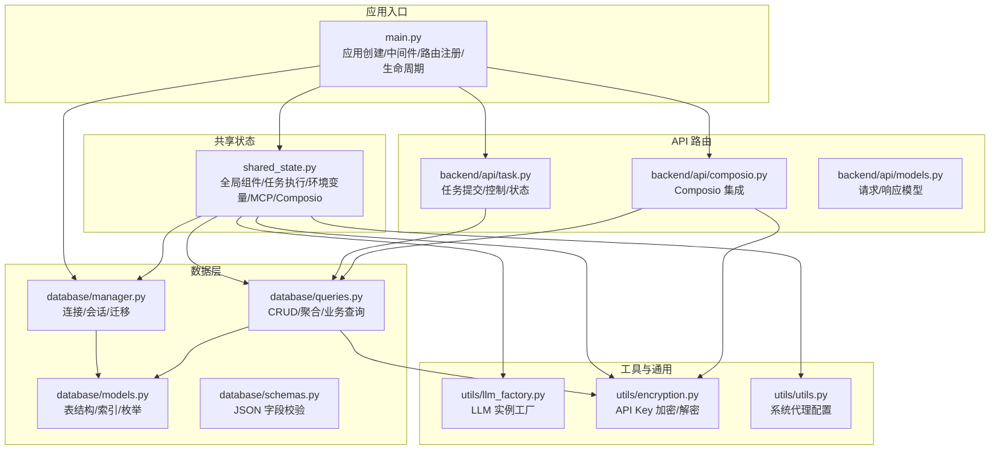
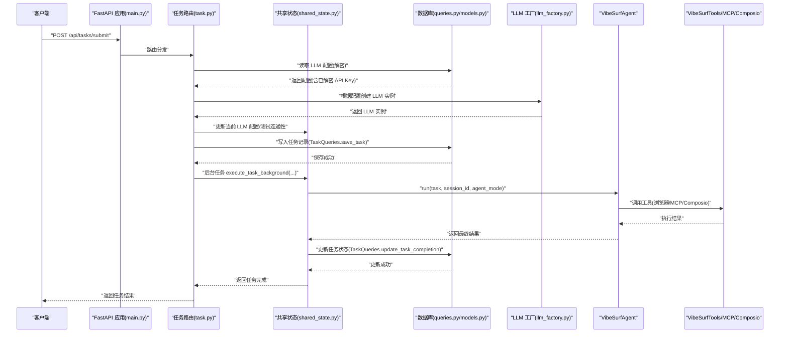
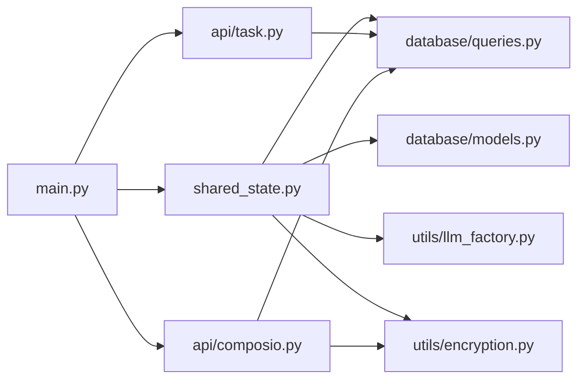

# 后端代码结构

<cite>
**本文引用的文件**
- [main.py](file://vibe_surf/backend/main.py)
- [shared_state.py](file://vibe_surf/backend/shared_state.py)
- [database/models.py](file://vibe_surf/backend/database/models.py)
- [database/manager.py](file://vibe_surf/backend/database/manager.py)
- [database/queries.py](file://vibe_surf/backend/database/queries.py)
- [database/schemas.py](file://vibe_surf/backend/database/schemas.py)
- [utils/llm_factory.py](file://vibe_surf/backend/utils/llm_factory.py)
- [utils/encryption.py](file://vibe_surf/backend/utils/encryption.py)
- [utils/utils.py](file://vibe_surf/backend/utils/utils.py)
- [backend/api/task.py](file://vibe_surf/backend/api/task.py)
- [backend/api/models.py](file://vibe_surf/backend/api/models.py)
- [backend/api/composio.py](file://vibe_surf/backend/api/composio.py)
</cite>

## 目录
1. [简介](#简介)
2. [项目结构](#项目结构)
3. [核心组件](#核心组件)
4. [架构总览](#架构总览)
5. [详细组件分析](#详细组件分析)
6. [依赖关系分析](#依赖关系分析)
7. [性能考量](#性能考量)
8. [故障排查指南](#故障排查指南)
9. [结论](#结论)
10. [附录](#附录)

## 简介
本文件面向开发者，系统性梳理 VibeSurf 后端服务的代码结构与运行机制，重点覆盖：
- FastAPI 应用初始化与中间件配置
- 路由模块（api）的职责划分与依赖关系
- 数据库访问层（SQLAlchemy 模型、查询封装、迁移管理）
- 工具类与辅助函数（LLM 工厂、加密、代理配置）
- 请求处理流程与组件交互的架构图
- 关键文件说明与扩展指引（新增 API 端点、业务逻辑变更、数据库扩展）

## 项目结构
后端采用“分层+按功能域”的组织方式：
- 应用入口与生命周期：main.py
- 共享状态与执行引擎：shared_state.py
- 数据层：database/models.py、database/manager.py、database/queries.py、database/schemas.py
- 工具与通用能力：utils/llm_factory.py、utils/encryption.py、utils/utils.py
- API 层：backend/api/*（task、composio、config、files、browser、voices、agent、schedule、vibesurf 等）

图表来源
- [main.py](file://vibe_surf/backend/main.py#L543-L730)
- [shared_state.py](file://vibe_surf/backend/shared_state.py#L453-L602)
- [database/manager.py](file://vibe_surf/backend/database/manager.py#L148-L203)
- [database/queries.py](file://vibe_surf/backend/database/queries.py#L1-L120)
- [database/models.py](file://vibe_surf/backend/database/models.py#L1-L120)
- [database/schemas.py](file://vibe_surf/backend/database/schemas.py#L1-L100)
- [utils/llm_factory.py](file://vibe_surf/backend/utils/llm_factory.py#L1-L120)
- [utils/encryption.py](file://vibe_surf/backend/utils/encryption.py#L65-L127)
- [utils/utils.py](file://vibe_surf/backend/utils/utils.py#L1-L42)
- [backend/api/task.py](file://vibe_surf/backend/api/task.py#L1-L120)
- [backend/api/composio.py](file://vibe_surf/backend/api/composio.py#L1-L120)
- [backend/api/models.py](file://vibe_surf/backend/api/models.py#L1-L120)

章节来源
- [main.py](file://vibe_surf/backend/main.py#L543-L730)
- [shared_state.py](file://vibe_surf/backend/shared_state.py#L453-L602)
- [database/manager.py](file://vibe_surf/backend/database/manager.py#L148-L203)
- [database/queries.py](file://vibe_surf/backend/database/queries.py#L1-L120)
- [database/models.py](file://vibe_surf/backend/database/models.py#L1-L120)
- [database/schemas.py](file://vibe_surf/backend/database/schemas.py#L1-L100)
- [utils/llm_factory.py](file://vibe_surf/backend/utils/llm_factory.py#L1-L120)
- [utils/encryption.py](file://vibe_surf/backend/utils/encryption.py#L65-L127)
- [utils/utils.py](file://vibe_surf/backend/utils/utils.py#L1-L42)
- [backend/api/task.py](file://vibe_surf/backend/api/task.py#L1-L120)
- [backend/api/composio.py](file://vibe_surf/backend/api/composio.py#L1-L120)
- [backend/api/models.py](file://vibe_surf/backend/api/models.py#L1-L120)

## 核心组件
- FastAPI 应用与生命周期：通过 lifespan 管理 Langflow 初始化、浏览器监控、调度器、数据库清理等后台任务。
- 共享状态：集中存放全局组件（VibeSurfAgent、BrowserManager、VibeSurfTools、LLM、数据库管理器、MCP/Composio 状态、活动任务）。
- 数据库层：基于 SQLAlchemy 的异步 ORM，提供统一的查询封装与迁移管理。
- LLM 工厂：根据配置动态创建不同提供商的 LLM 实例，并进行参数适配与校验。
- 安全与加密：使用机器 MAC 或本地用户 ID 衍生对称密钥，加密敏感信息（如 API Key）。
- API 路由：围绕任务执行、文件上传、浏览器控制、语音、配置、Composio 集成等提供接口。

章节来源
- [main.py](file://vibe_surf/backend/main.py#L327-L482)
- [shared_state.py](file://vibe_surf/backend/shared_state.py#L1-L120)
- [database/models.py](file://vibe_surf/backend/database/models.py#L1-L120)
- [utils/llm_factory.py](file://vibe_surf/backend/utils/llm_factory.py#L1-L120)
- [utils/encryption.py](file://vibe_surf/backend/utils/encryption.py#L65-L127)
- [backend/api/task.py](file://vibe_surf/backend/api/task.py#L1-L120)

## 架构总览
下图展示了从请求进入应用到任务执行完成的端到端流程，以及各组件之间的交互关系。

图表来源
- [main.py](file://vibe_surf/backend/main.py#L543-L730)
- [backend/api/task.py](file://vibe_surf/backend/api/task.py#L43-L152)
- [shared_state.py](file://vibe_surf/backend/shared_state.py#L118-L233)
- [database/queries.py](file://vibe_surf/backend/database/queries.py#L441-L520)
- [utils/llm_factory.py](file://vibe_surf/backend/utils/llm_factory.py#L23-L120)

章节来源
- [main.py](file://vibe_surf/backend/main.py#L543-L730)
- [backend/api/task.py](file://vibe_surf/backend/api/task.py#L43-L152)
- [shared_state.py](file://vibe_surf/backend/shared_state.py#L118-L233)
- [database/queries.py](file://vibe_surf/backend/database/queries.py#L441-L520)
- [utils/llm_factory.py](file://vibe_surf/backend/utils/llm_factory.py#L23-L120)

## 详细组件分析

### FastAPI 应用初始化与中间件
- 应用创建与标签：创建 FastAPI 实例，设置标题、描述、版本，并启用分页。
- 中间件：
  - CORS：允许跨域访问。
  - JavaScriptMIMETypeMiddleware：拦截响应，修正 .js 文件的 Content-Type。
  - Langflow 内容大小限制中间件：限制请求体大小。
  - 自定义 multipart/form-data 校验中间件：校验边界格式与起止标记。
  - 查询字符串扁平化中间件：将逗号分隔的列表参数展平为多值。
- 异常处理：捕获未处理异常与 Pydantic 序列化错误，统一返回 JSON。
- 路由注册：注册 VibeSurf 自有路由与 Langflow 路由（含可选的 MCP 路由）。
- 健康检查与会话 ID 生成：提供 /health、/generate-session-id、/api/status 等端点。
- 生命周期管理：通过 lifespan 管理 Langflow 初始化、浏览器监控、调度器、数据库与 Langflow 服务清理。

章节来源
- [main.py](file://vibe_surf/backend/main.py#L543-L730)
- [main.py](file://vibe_surf/backend/main.py#L327-L482)

### 共享状态与执行引擎
- 全局组件：VibeSurfAgent、BrowserManager、VibeSurfTools、LLM、数据库管理器、Composio 实例、调度器、活动任务等。
- 初始化流程：加载工作空间、环境变量、数据库、默认 LLM、MCP/Composio 配置、浏览器会话与 Agent。
- 任务执行：单任务模式下，execute_task_background 负责更新活动任务状态、调用 Agent 执行、持久化结果。
- 动态更新：根据数据库变化（MCP/Composio）动态刷新工具配置；支持切换 LLM 配置并保持计费跟踪。

章节来源
- [shared_state.py](file://vibe_surf/backend/shared_state.py#L1-L120)
- [shared_state.py](file://vibe_surf/backend/shared_state.py#L453-L602)
- [shared_state.py](file://vibe_surf/backend/shared_state.py#L118-L233)

### 数据库访问层
- 模型层：定义 Task、LLMProfile、UploadedFile、McpProfile、VoiceProfile、ComposioToolkit、Credential、Schedule 等表，包含索引与枚举字段。
- 查询封装：提供 LLMProfileQueries、McpProfileQueries、TaskQueries、UploadedFileQueries、ComposioToolkitQueries、CredentialQueries 等，统一 CRUD、聚合与业务查询。
- 迁移管理：SQLite 专用迁移管理器，扫描 migrations 目录，按版本顺序执行 SQL，维护 user_version。
- 会话管理：异步引擎、静态池（SQLite）与生产池（其他数据库），提供 get_session 依赖注入。
- JSON 字段校验：schemas.py 提供 TaskMetadata、LLMConfiguration、McpServerConfig 等 JSON 结构的 Pydantic 校验与归一化。

章节来源
- [database/models.py](file://vibe_surf/backend/database/models.py#L1-L289)
- [database/queries.py](file://vibe_surf/backend/database/queries.py#L1-L200)
- [database/manager.py](file://vibe_surf/backend/database/manager.py#L148-L203)
- [database/schemas.py](file://vibe_surf/backend/database/schemas.py#L1-L100)

### LLM 工厂与配置
- 工厂模式：create_llm_from_profile 接收 LLMProfile（字典或对象），解析参数，按提供商创建对应 LLM 实例。
- 参数支持：不同提供商支持的参数不同，工厂内置支持矩阵与校验。
- 配置来源：优先从数据库查询并解密 API Key；若无数据库则回退到环境变量。
- 校验与元数据：llm_config.py 提供支持的提供商列表、模型清单、元数据（是否需要 API Key/Base URL 等）。

章节来源
- [utils/llm_factory.py](file://vibe_surf/backend/utils/llm_factory.py#L1-L275)
- [backend/api/task.py](file://vibe_surf/backend/api/task.py#L154-L195)
- [shared_state.py](file://vibe_surf/backend/shared_state.py#L604-L642)
- [backend/llm_config.py](file://vibe_surf/backend/llm_config.py#L1-L226)

### 安全与加密
- 加密策略：基于机器 MAC 地址或本地用户 ID 衍生对称密钥，使用 Fernet 对 API Key 进行加解密。
- 使用场景：LLMProfile 的 API Key 存储时加密，读取时解密；Composio API Key 同样加密存储。
- 降级策略：当无法获取 MAC 时，回退到本地用户 ID 作为密钥来源。

章节来源
- [utils/encryption.py](file://vibe_surf/backend/utils/encryption.py#L65-L127)
- [database/queries.py](file://vibe_surf/backend/database/queries.py#L1-L120)

### API 路由与职责划分
- 任务路由（task.py）：提交任务、暂停/恢复/停止、追加新任务、查询状态；负责 LLM 连通性测试与任务持久化。
- Composio 路由（composio.py）：验证 API Key、同步工具包、启用/禁用工具包、OAuth 流程、连接状态检查。
- 其他路由：files、browser、voices、agent、schedule、vibesurf、config 等，分别处理文件上传、浏览器控制、语音、代理、计划任务、配置等。

章节来源
- [backend/api/task.py](file://vibe_surf/backend/api/task.py#L1-L379)
- [backend/api/composio.py](file://vibe_surf/backend/api/composio.py#L1-L200)
- [backend/api/models.py](file://vibe_surf/backend/api/models.py#L1-L260)

## 依赖关系分析
- 组件耦合：
  - main.py 依赖 shared_state 初始化与 Langflow 生命周期管理。
  - shared_state 依赖 database/queries 与 utils/llm_factory、utils/encryption。
  - API 路由依赖 database/queries 与 shared_state。
- 外部依赖：
  - Langflow：中间件、日志、服务初始化与清理。
  - Composio：OAuth 与工具包管理。
  - 浏览器会话：AgentBrowserSession 与 BrowserManager。
- 循环依赖规避：通过延迟导入与共享状态模块避免循环引用。

图表来源
- [main.py](file://vibe_surf/backend/main.py#L543-L730)
- [shared_state.py](file://vibe_surf/backend/shared_state.py#L453-L602)
- [database/queries.py](file://vibe_surf/backend/database/queries.py#L1-L120)
- [utils/llm_factory.py](file://vibe_surf/backend/utils/llm_factory.py#L1-L120)
- [utils/encryption.py](file://vibe_surf/backend/utils/encryption.py#L65-L127)
- [backend/api/task.py](file://vibe_surf/backend/api/task.py#L1-L120)
- [backend/api/composio.py](file://vibe_surf/backend/api/composio.py#L1-L120)

章节来源
- [main.py](file://vibe_surf/backend/main.py#L543-L730)
- [shared_state.py](file://vibe_surf/backend/shared_state.py#L453-L602)
- [database/queries.py](file://vibe_surf/backend/database/queries.py#L1-L120)
- [utils/llm_factory.py](file://vibe_surf/backend/utils/llm_factory.py#L1-L120)
- [utils/encryption.py](file://vibe_surf/backend/utils/encryption.py#L65-L127)
- [backend/api/task.py](file://vibe_surf/backend/api/task.py#L1-L120)
- [backend/api/composio.py](file://vibe_surf/backend/api/composio.py#L1-L120)

## 性能考量
- 数据库连接池：生产环境使用连接池与预检，开发环境使用静态池；SQLite 通过迁移管理器保证一致性。
- 异步 I/O：所有数据库操作与外部服务调用均采用异步，避免阻塞事件循环。
- 会话与事务：get_session 自动提交/回滚，减少异常导致的资源泄漏。
- 缓存与懒加载：Langflow 组件缓存与 MCP/Composio 工具在后台任务中初始化，避免启动阻塞。
- 日志与遥测：集成 OpenTelemetry 与 Sentry，便于性能与错误追踪。

[本节为通用指导，不直接分析具体文件]

## 故障排查指南
- 启动失败（Langflow 初始化）：检查日志中 Langflow 初始化阶段的异常，确认数据库 URL、工作空间路径、环境变量。
- 任务无法提交：检查是否已有活动任务；查看 LLM 连通性测试是否通过；确认数据库会话可用。
- Composio 问题：验证 API Key 是否有效并已存储；检查 OAuth 流程是否完成；查看连接状态与工具包同步。
- 数据库迁移失败：确认 migrations 目录与文件命名规范；检查 SQLite user_version 设置；必要时回退到直接建表。
- LLM 创建失败：核对提供商、模型、API Key、Base URL 等参数；查看工厂日志输出。

章节来源
- [main.py](file://vibe_surf/backend/main.py#L327-L482)
- [backend/api/task.py](file://vibe_surf/backend/api/task.py#L154-L195)
- [backend/api/composio.py](file://vibe_surf/backend/api/composio.py#L367-L421)
- [database/manager.py](file://vibe_surf/backend/database/manager.py#L87-L146)

## 结论
VibeSurf 后端以 FastAPI 为核心，结合共享状态与数据库访问层，构建了简洁而强大的单任务执行模型。通过 LLM 工厂与加密模块保障了灵活性与安全性；Composio 集成与 MCP 工具链进一步扩展了自动化能力。该架构易于扩展：新增 API 端点只需遵循现有路由与依赖注入模式；数据库扩展可通过迁移管理器与查询封装快速落地。

[本节为总结性内容，不直接分析具体文件]

## 附录

### 关键文件说明与扩展指引
- main.py
  - 应用启动与生命周期：lifespan、中间件、路由注册、健康检查、异常处理。
  - 扩展建议：新增中间件或路由时，遵循现有中间件顺序与异常处理策略。
  - 参考路径
    - [应用创建与中间件](file://vibe_surf/backend/main.py#L543-L730)
    - [生命周期管理](file://vibe_surf/backend/main.py#L327-L482)

- shared_state.py
  - 全局组件初始化与任务执行：initialize_vibesurf_components、execute_task_background。
  - 扩展建议：新增全局组件时，在 initialize_vibesurf_components 中注册；后台任务通过共享状态传递上下文。
  - 参考路径
    - [组件初始化](file://vibe_surf/backend/shared_state.py#L453-L602)
    - [任务执行](file://vibe_surf/backend/shared_state.py#L118-L233)

- database/models.py
  - 数据模型定义：Task、LLMProfile、UploadedFile、McpProfile、VoiceProfile、ComposioToolkit、Credential、Schedule。
  - 扩展建议：新增表时，补充索引与枚举；确保查询封装随之完善。
  - 参考路径
    - [模型定义](file://vibe_surf/backend/database/models.py#L1-L289)

- database/queries.py
  - 查询封装：LLMProfileQueries、McpProfileQueries、TaskQueries、UploadedFileQueries、ComposioToolkitQueries、CredentialQueries。
  - 扩展建议：新增查询逻辑时，保持异步与事务一致性；必要时增加索引优化。
  - 参考路径
    - [LLMProfileQueries](file://vibe_surf/backend/database/queries.py#L1-L120)
    - [TaskQueries](file://vibe_surf/backend/database/queries.py#L441-L520)

- database/manager.py
  - 连接与迁移：DatabaseManager、DBMigrationManager。
  - 扩展建议：SQLite 迁移文件命名需符合 vNNN_description.sql；生产环境注意连接池参数。
  - 参考路径
    - [数据库管理器](file://vibe_surf/backend/database/manager.py#L148-L203)
    - [迁移管理器](file://vibe_surf/backend/database/manager.py#L27-L146)

- database/schemas.py
  - JSON 字段校验：TaskMetadata、LLMConfiguration、McpServerConfig 等。
  - 扩展建议：新增 JSON 字段时，补充 Pydantic 校验与归一化逻辑。
  - 参考路径
    - [JSON 校验](file://vibe_surf/backend/database/schemas.py#L1-L100)

- utils/llm_factory.py
  - LLM 实例工厂：create_llm_from_profile、validate_llm_configuration、get_llm_creation_parameters。
  - 扩展建议：新增提供商时，完善参数支持矩阵与元数据。
  - 参考路径
    - [工厂实现](file://vibe_surf/backend/utils/llm_factory.py#L1-L275)
    - [提供商配置](file://vibe_surf/backend/llm_config.py#L1-L226)

- utils/encryption.py
  - 加密/解密：encrypt_api_key、decrypt_api_key、is_encrypted。
  - 扩展建议：敏感字段统一走加密存储；注意密钥来源的降级策略。
  - 参考路径
    - [加密实现](file://vibe_surf/backend/utils/encryption.py#L65-L127)

- utils/utils.py
  - 代理配置：configure_system_proxies。
  - 扩展建议：网络相关配置统一在此处集中处理。
  - 参考路径
    - [代理配置](file://vibe_surf/backend/utils/utils.py#L1-L42)

- backend/api/task.py
  - 任务路由：提交、暂停、恢复、停止、追加任务、状态查询。
  - 扩展建议：新增控制操作时，完善状态机与数据库更新。
  - 参考路径
    - [任务路由](file://vibe_surf/backend/api/task.py#L1-L379)

- backend/api/composio.py
  - Composio 集成：验证 API Key、同步工具包、启用/禁用工具包、OAuth 流程。
  - 扩展建议：新增工具包时，完善同步与连接状态检查。
  - 参考路径
    - [Composio 路由](file://vibe_surf/backend/api/composio.py#L1-L200)

- backend/api/models.py
  - 请求/响应模型：LLMProfile、McpProfile、Task、Activity、File、Config 等。
  - 扩展建议：新增端点时，配套定义 Pydantic 模型并完善校验。
  - 参考路径
    - [API 模型](file://vibe_surf/backend/api/models.py#L1-L260)