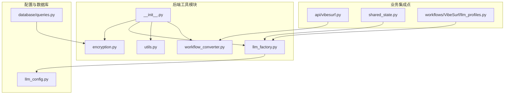
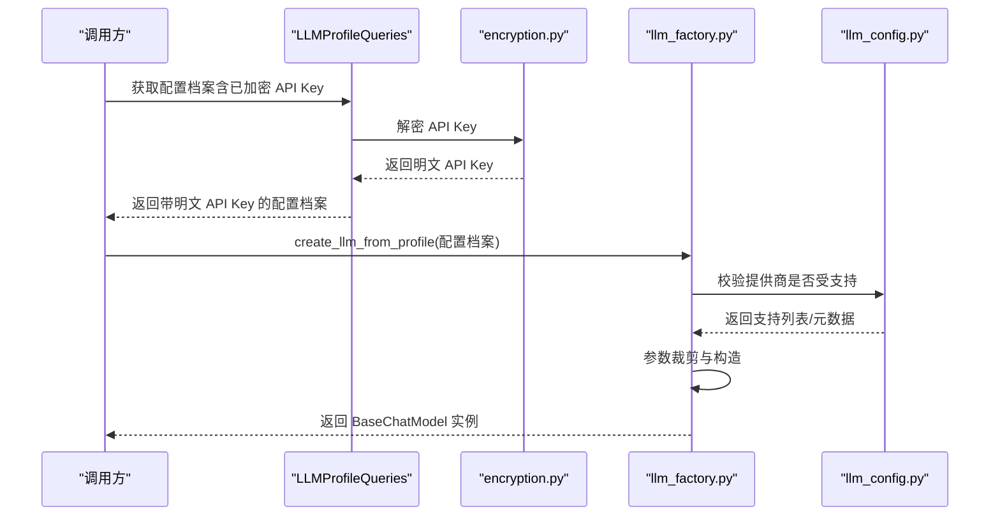
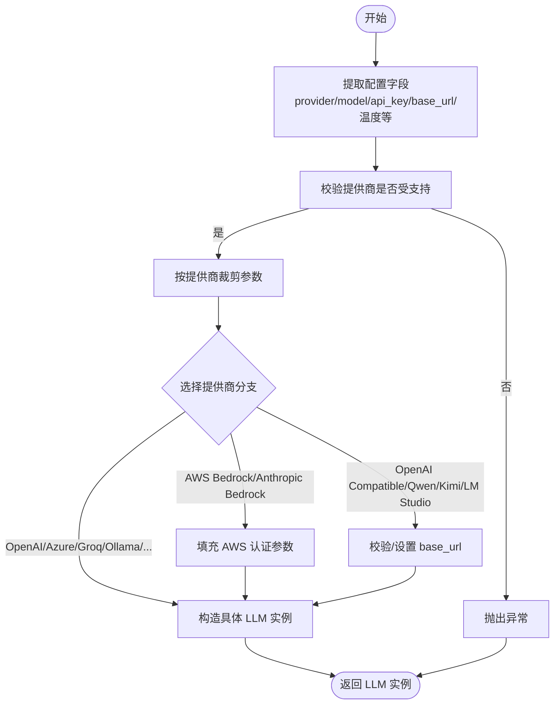
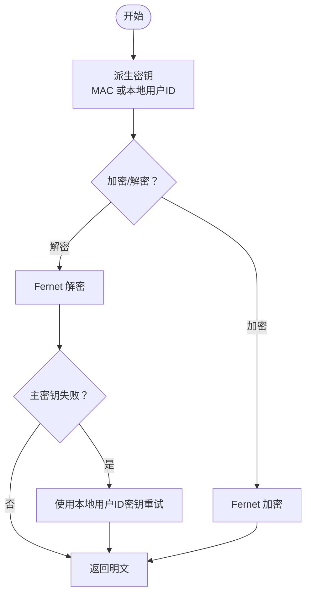
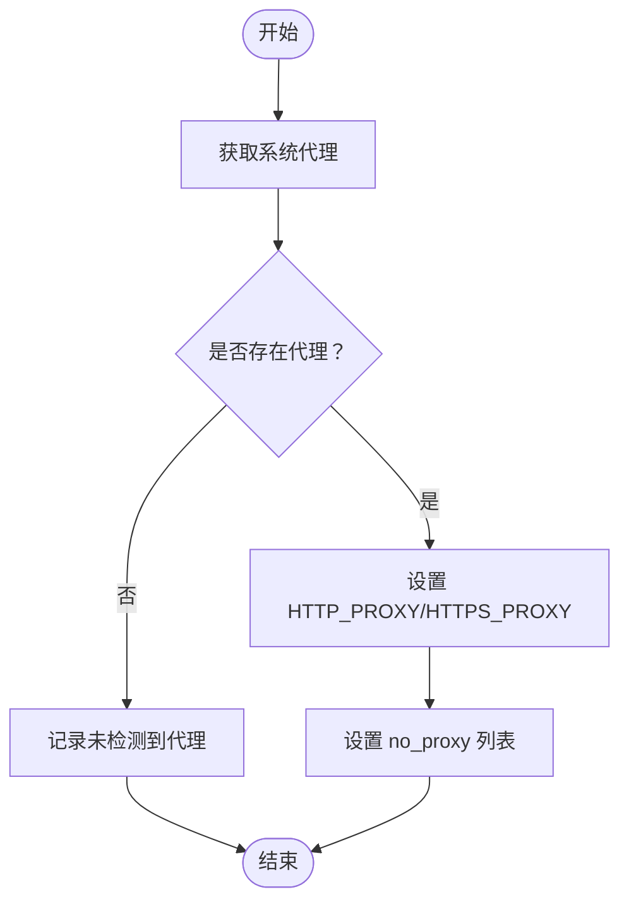
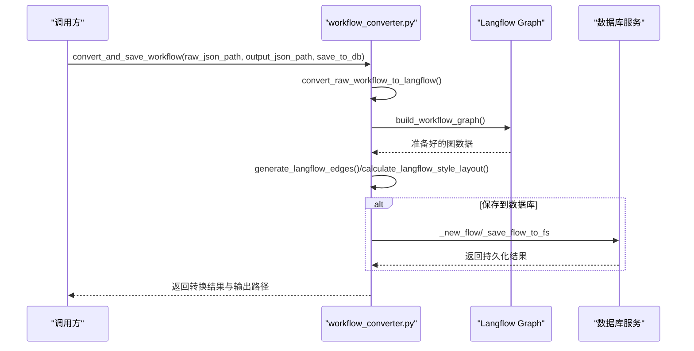
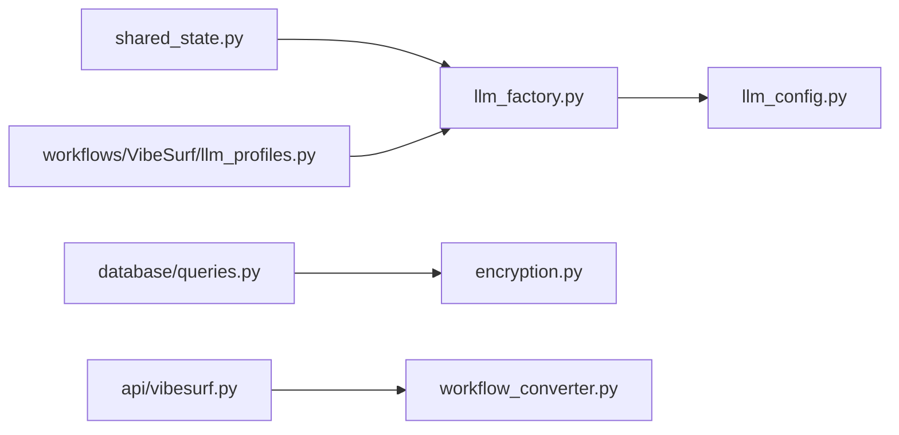

# 工具类模块

<cite>
**本文引用的文件列表**
- [vibe_surf/backend/utils/__init__.py](file://vibe_surf/backend/utils/__init__.py)
- [vibe_surf/backend/utils/encryption.py](file://vibe_surf/backend/utils/encryption.py)
- [vibe_surf/backend/utils/llm_factory.py](file://vibe_surf/backend/utils/llm_factory.py)
- [vibe_surf/backend/utils/utils.py](file://vibe_surf/backend/utils/utils.py)
- [vibe_surf/backend/utils/workflow_converter.py](file://vibe_surf/backend/utils/workflow_converter.py)
- [vibe_surf/backend/llm_config.py](file://vibe_surf/backend/llm_config.py)
- [vibe_surf/backend/database/queries.py](file://vibe_surf/backend/database/queries.py)
- [vibe_surf/backend/api/vibesurf.py](file://vibe_surf/backend/api/vibesurf.py)
- [vibe_surf/backend/shared_state.py](file://vibe_surf/backend/shared_state.py)
- [vibe_surf/workflows/VibeSurf/llm_profiles.py](file://vibe_surf/workflows/VibeSurf/llm_profiles.py)
</cite>

## 目录
1. [简介](#简介)
2. [项目结构](#项目结构)
3. [核心组件](#核心组件)
4. [架构总览](#架构总览)
5. [详细组件分析](#详细组件分析)
6. [依赖关系分析](#依赖关系分析)
7. [性能考量](#性能考量)
8. [故障排查指南](#故障排查指南)
9. [结论](#结论)
10. [附录：使用示例与最佳实践](#附录使用示例与最佳实践)

## 简介
本文件系统性梳理后端工具类模块（位于 vibe_surf/backend/utils），涵盖以下能力：
- LLM 实例工厂：统一从“LLM 配置档案”创建不同提供商的聊天模型实例，支持参数校验与参数裁剪。
- 加密工具：基于机器 MAC 或本地用户标识派生对称密钥，对敏感数据（如 API Key）进行加解密与可识别标记。
- 通用工具：系统代理自动注入，便于网络访问一致性。
- 工作流转换器：将录制的工作流转换为 Langflow 可兼容的图结构，并可选保存到数据库。

目标是帮助开发者快速理解各工具的职责边界、调用方式、错误处理与扩展点，并给出在业务逻辑中的集成建议。

## 项目结构
utils 目录组织清晰，按功能拆分文件，便于独立维护与复用：
- encryption.py：加密/解密与可识别标记
- llm_factory.py：LLM 工厂与参数校验
- utils.py：系统代理配置
- workflow_converter.py：工作流录制到 Langflow 的转换与持久化
- __init__.py：导出常用接口

图表来源
- [vibe_surf/backend/utils/__init__.py](file://vibe_surf/backend/utils/__init__.py#L1-L7)
- [vibe_surf/backend/utils/encryption.py](file://vibe_surf/backend/utils/encryption.py#L1-L172)
- [vibe_surf/backend/utils/llm_factory.py](file://vibe_surf/backend/utils/llm_factory.py#L1-L275)
- [vibe_surf/backend/utils/utils.py](file://vibe_surf/backend/utils/utils.py#L1-L42)
- [vibe_surf/backend/utils/workflow_converter.py](file://vibe_surf/backend/utils/workflow_converter.py#L1-L570)
- [vibe_surf/backend/llm_config.py](file://vibe_surf/backend/llm_config.py#L1-L226)
- [vibe_surf/backend/database/queries.py](file://vibe_surf/backend/database/queries.py#L1-L200)
- [vibe_surf/backend/api/vibesurf.py](file://vibe_surf/backend/api/vibesurf.py#L520-L570)
- [vibe_surf/backend/shared_state.py](file://vibe_surf/backend/shared_state.py#L600-L682)
- [vibe_surf/workflows/VibeSurf/llm_profiles.py](file://vibe_surf/workflows/VibeSurf/llm_profiles.py#L80-L104)

章节来源
- [vibe_surf/backend/utils/__init__.py](file://vibe_surf/backend/utils/__init__.py#L1-L7)

## 核心组件
- LLM 工厂（llm_factory.py）
  - 职责：从“LLM 配置档案”对象或字典构建具体 LLM 实例；按提供商裁剪参数；提供配置校验与参数清单查询。
  - 支持提供商：OpenAI、Anthropic、Google、Azure OpenAI、Groq、Ollama、OpenRouter、DeepSeek、AWS Bedrock、Anthropic Bedrock、Qwen、Kimi、LM Studio、OpenAI 兼容。
  - 关键函数：create_llm_from_profile、validate_llm_configuration、get_llm_creation_parameters。
- 加密工具（encryption.py）
  - 职责：基于机器 MAC 或本地用户 ID 派生密钥，使用 Fernet 对称加密；提供可识别标记判断。
  - 关键函数：encrypt_api_key、decrypt_api_key、is_encrypted、get_encryption_key。
- 通用工具（utils.py）
  - 职责：读取系统代理设置并注入环境变量，便于网络请求一致性。
  - 关键函数：configure_system_proxies。
- 工作流转换器（workflow_converter.py）
  - 职责：将录制的工作流转换为 Langflow 图结构，生成边与布局，可选保存至数据库。
  - 关键函数：convert_and_save_workflow、convert_raw_workflow_to_langflow、calculate_langflow_style_layout、save_workflow_to_db。

章节来源
- [vibe_surf/backend/utils/llm_factory.py](file://vibe_surf/backend/utils/llm_factory.py#L1-L275)
- [vibe_surf/backend/utils/encryption.py](file://vibe_surf/backend/utils/encryption.py#L1-L172)
- [vibe_surf/backend/utils/utils.py](file://vibe_surf/backend/utils/utils.py#L1-L42)
- [vibe_surf/backend/utils/workflow_converter.py](file://vibe_surf/backend/utils/workflow_converter.py#L1-L570)

## 架构总览
下面以“LLM 工厂”为例，展示从配置档案到具体 LLM 实例的创建流程，以及与配置中心的协作。

图表来源
- [vibe_surf/backend/database/queries.py](file://vibe_surf/backend/database/queries.py#L110-L139)
- [vibe_surf/backend/utils/encryption.py](file://vibe_surf/backend/utils/encryption.py#L98-L127)
- [vibe_surf/backend/utils/llm_factory.py](file://vibe_surf/backend/utils/llm_factory.py#L23-L216)
- [vibe_surf/backend/llm_config.py](file://vibe_surf/backend/llm_config.py#L202-L226)

## 详细组件分析

### LLM 工厂（llm_factory.py）
- 设计要点
  - 统一入口：create_llm_from_profile 接收 dict 或对象，内部通过统一访问器适配字段。
  - 参数裁剪：按提供商支持能力动态拼装参数，避免传递不支持的参数。
  - 异常处理：对不支持的提供商、缺失必要参数等进行显式报错，并记录日志。
  - 扩展友好：新增提供商只需在映射表与分支中添加对应分支。
- 关键流程
  - 参数提取与默认值设置
  - 提供商校验与参数支持表匹配
  - 构造具体 LLM 类实例（如 ChatOpenAI、ChatAnthropic 等）
  - 特殊场景处理（如 Azure OpenAI 必须 base_url、OpenAI 兼容必须 base_url）

图表来源
- [vibe_surf/backend/utils/llm_factory.py](file://vibe_surf/backend/utils/llm_factory.py#L23-L216)
- [vibe_surf/backend/llm_config.py](file://vibe_surf/backend/llm_config.py#L202-L226)

章节来源
- [vibe_surf/backend/utils/llm_factory.py](file://vibe_surf/backend/utils/llm_factory.py#L1-L275)
- [vibe_surf/backend/llm_config.py](file://vibe_surf/backend/llm_config.py#L1-L226)

### 加密工具（encryption.py）
- 设计要点
  - 密钥派生：优先使用机器 MAC 地址，失败时回退到本地用户 ID 文件（首次生成 UUID7 字符串）。
  - 对称加密：使用 Fernet（基于 PBKDF2 + AES），保证机密性与完整性。
  - 可识别标记：is_encrypted 基于 Base64 与长度特征快速判断是否为加密文本。
  - 容错解密：若主密钥解密失败，尝试使用本地用户 ID 方案再次解密。
- 关键流程

图表来源
- [vibe_surf/backend/utils/encryption.py](file://vibe_surf/backend/utils/encryption.py#L23-L127)

章节来源
- [vibe_surf/backend/utils/encryption.py](file://vibe_surf/backend/utils/encryption.py#L1-L172)

### 通用工具（utils.py）
- 设计要点
  - 使用 urllib.request.getproxies() 获取系统代理，自动设置 HTTP_PROXY/HTTPS_PROXY/no_proxy。
  - 日志记录代理配置过程，便于问题定位。
- 关键流程

图表来源
- [vibe_surf/backend/utils/utils.py](file://vibe_surf/backend/utils/utils.py#L8-L42)

章节来源
- [vibe_surf/backend/utils/utils.py](file://vibe_surf/backend/utils/utils.py#L1-L42)

### 工作流转换器（workflow_converter.py）
- 设计要点
  - 将原始录制数据转换为 Langflow Graph，自动连接节点形成链路。
  - 生成 Langflow 兼容的边格式与唯一边 ID。
  - 使用层级布局算法计算节点位置，提升可视化效果。
  - 可选保存到数据库，同时写入文件系统。
- 关键流程

图表来源
- [vibe_surf/backend/utils/workflow_converter.py](file://vibe_surf/backend/utils/workflow_converter.py#L129-L547)
- [vibe_surf/backend/api/vibesurf.py](file://vibe_surf/backend/api/vibesurf.py#L526-L569)

章节来源
- [vibe_surf/backend/utils/workflow_converter.py](file://vibe_surf/backend/utils/workflow_converter.py#L1-L570)
- [vibe_surf/backend/api/vibesurf.py](file://vibe_surf/backend/api/vibesurf.py#L520-L570)

## 依赖关系分析
- LLM 工厂依赖配置中心（llm_config.py）进行提供商支持与元数据查询。
- 数据库层（database/queries.py）在创建/更新 LLM 配置档案时使用加密工具（encryption.py）对 API Key 进行加解密。
- 业务集成点（shared_state.py、workflows/VibeSurf/llm_profiles.py）通过工厂创建 LLM 实例，实现全局 LLM 的初始化与切换。
- API 层（api/vibesurf.py）在保存工作流录制时调用工作流转换器，完成转换与入库。

图表来源
- [vibe_surf/backend/utils/llm_factory.py](file://vibe_surf/backend/utils/llm_factory.py#L1-L275)
- [vibe_surf/backend/llm_config.py](file://vibe_surf/backend/llm_config.py#L1-L226)
- [vibe_surf/backend/database/queries.py](file://vibe_surf/backend/database/queries.py#L1-L200)
- [vibe_surf/backend/shared_state.py](file://vibe_surf/backend/shared_state.py#L600-L682)
- [vibe_surf/workflows/VibeSurf/llm_profiles.py](file://vibe_surf/workflows/VibeSurf/llm_profiles.py#L80-L104)
- [vibe_surf/backend/api/vibesurf.py](file://vibe_surf/backend/api/vibesurf.py#L520-L570)

章节来源
- [vibe_surf/backend/utils/llm_factory.py](file://vibe_surf/backend/utils/llm_factory.py#L1-L275)
- [vibe_surf/backend/llm_config.py](file://vibe_surf/backend/llm_config.py#L1-L226)
- [vibe_surf/backend/database/queries.py](file://vibe_surf/backend/database/queries.py#L1-L200)
- [vibe_surf/backend/shared_state.py](file://vibe_surf/backend/shared_state.py#L600-L682)
- [vibe_surf/workflows/VibeSurf/llm_profiles.py](file://vibe_surf/workflows/VibeSurf/llm_profiles.py#L80-L104)
- [vibe_surf/backend/api/vibesurf.py](file://vibe_surf/backend/api/vibesurf.py#L520-L570)

## 性能考量
- LLM 工厂
  - 参数裁剪与分支判断开销极低，主要成本在外部 LLM SDK 初始化与网络调用。
  - 建议在应用启动阶段预热常用模型，减少首次调用延迟。
- 加密工具
  - PBKDF2 迭代次数较高，用于增强安全性但会带来 CPU 成本；可在批量处理时合并调用，避免重复派生密钥。
  - Fernet 解密失败回退到本地用户 ID 方案仅在异常路径触发，正常情况下不会影响性能。
- 通用工具
  - 仅在进程启动时执行一次代理注入，对运行期性能影响可忽略。
- 工作流转换器
  - 层级布局算法复杂度与节点数成正比，建议对大规模工作流采用分页或异步处理策略。
  - 边 ID 生成与 JSON 序列化为常见瓶颈，可考虑缓存中间结构或批量写入。

[本节为通用指导，无需列出章节来源]

## 故障排查指南
- LLM 工厂
  - “不支持的提供商”：确认提供商名称与 llm_config.py 中的键一致。
  - “缺少 base_url”：Azure OpenAI 与 OpenAI 兼容型提供商要求提供 base_url。
  - “API Key 缺失”：部分提供商要求 API Key，需检查配置档案。
- 加密工具
  - “解密失败”：检查密钥来源（MAC vs 本地用户 ID）是否一致；确认文件权限与路径存在。
  - “is_encrypted 返回 False”：确认输入为 Base64 且长度满足条件。
- 通用工具
  - “代理未生效”：检查系统代理设置与环境变量是否被覆盖。
- 工作流转换器
  - “未知动作类型”：检查原始录制数据的动作字段是否符合预期。
  - “保存数据库失败”：关注数据库事务与文件系统写入权限。

章节来源
- [vibe_surf/backend/utils/llm_factory.py](file://vibe_surf/backend/utils/llm_factory.py#L222-L275)
- [vibe_surf/backend/utils/encryption.py](file://vibe_surf/backend/utils/encryption.py#L76-L127)
- [vibe_surf/backend/utils/utils.py](file://vibe_surf/backend/utils/utils.py#L8-L42)
- [vibe_surf/backend/utils/workflow_converter.py](file://vibe_surf/backend/utils/workflow_converter.py#L129-L547)

## 结论
utils 目录提供了后端关键基础设施能力：
- LLM 工厂统一了多提供商接入与参数管理，降低业务耦合。
- 加密工具保障敏感数据安全存储与传输。
- 通用工具简化网络访问配置。
- 工作流转换器打通录制到可视化的闭环，并支持持久化。

建议在新功能开发中优先复用这些工具，遵循“配置即代码”的原则，通过配置中心集中管理提供商能力与默认参数，确保一致性与可维护性。

[本节为总结，无需列出章节来源]

## 附录：使用示例与最佳实践

### LLM 工厂使用示例
- 从数据库配置档案创建 LLM 实例
  - 步骤：查询配置档案（含已加密 API Key）→ 解密 → 工厂创建实例。
  - 参考路径
    - [LLMProfileQueries.get_profile_with_decrypted_key](file://vibe_surf/backend/database/queries.py#L110-L139)
    - [create_llm_from_profile](file://vibe_surf/backend/utils/llm_factory.py#L23-L216)
    - [shared_state 初始化默认 LLM](file://vibe_surf/backend/shared_state.py#L604-L642)
    - [workflows/VibeSurf/llm_profiles 获取指定配置的 LLM](file://vibe_surf/workflows/VibeSurf/llm_profiles.py#L89-L104)
- 最佳实践
  - 在创建前先 validate_llm_configuration，确保必填项完整。
  - 使用 get_llm_creation_parameters 获取所需参数清单，避免遗漏。
  - 对 Azure OpenAI 与 OpenAI 兼容型提供商务必提供 base_url。

章节来源
- [vibe_surf/backend/database/queries.py](file://vibe_surf/backend/database/queries.py#L110-L139)
- [vibe_surf/backend/utils/llm_factory.py](file://vibe_surf/backend/utils/llm_factory.py#L222-L275)
- [vibe_surf/backend/shared_state.py](file://vibe_surf/backend/shared_state.py#L604-L642)
- [vibe_surf/workflows/VibeSurf/llm_profiles.py](file://vibe_surf/workflows/VibeSurf/llm_profiles.py#L89-L104)

### 加密工具使用示例
- 存储与读取 API Key
  - 创建/更新配置档案时加密 API Key。
  - 查询时解密返回明文。
  - 参考路径
    - [LLMProfileQueries.create_profile](file://vibe_surf/backend/database/queries.py#L21-L90)
    - [LLMProfileQueries.update_profile](file://vibe_surf/backend/database/queries.py#L175-L199)
    - [LLMProfileQueries.get_profile_with_decrypted_key](file://vibe_surf/backend/database/queries.py#L110-L139)
    - [encrypt_api_key/decrypt_api_key/is_encrypted](file://vibe_surf/backend/utils/encryption.py#L76-L127)
- 最佳实践
  - 不要直接在日志中打印明文 API Key。
  - 若迁移环境，确保新环境能正确读取本地用户 ID 文件或 MAC 地址。
  - 对 is_encrypted 的误判保持谨慎，必要时二次解密。

章节来源
- [vibe_surf/backend/database/queries.py](file://vibe_surf/backend/database/queries.py#L21-L90)
- [vibe_surf/backend/database/queries.py](file://vibe_surf/backend/database/queries.py#L175-L199)
- [vibe_surf/backend/database/queries.py](file://vibe_surf/backend/database/queries.py#L110-L139)
- [vibe_surf/backend/utils/encryption.py](file://vibe_surf/backend/utils/encryption.py#L76-L127)

### 通用工具使用示例
- 启动时自动注入系统代理
  - 参考路径
    - [configure_system_proxies](file://vibe_surf/backend/utils/utils.py#L8-L42)
    - [shared_state 中的代理注入调用](file://vibe_surf/backend/shared_state.py#L31-L31)
- 最佳实践
  - 在容器或无 GUI 环境中，确保系统代理可用或手动设置环境变量。
  - 对 no_proxy 列表进行最小化维护，避免影响内网服务。

章节来源
- [vibe_surf/backend/utils/utils.py](file://vibe_surf/backend/utils/utils.py#L8-L42)
- [vibe_surf/backend/shared_state.py](file://vibe_surf/backend/shared_state.py#L31-L31)

### 工作流转换器使用示例
- 将录制文件转换为 Langflow 并保存到数据库
  - 参考路径
    - [convert_and_save_workflow](file://vibe_surf/backend/utils/workflow_converter.py#L484-L547)
    - [api/vibesurf.py 中的调用](file://vibe_surf/backend/api/vibesurf.py#L526-L569)
- 最佳实践
  - 大规模工作流建议异步转换与分批入库。
  - 转换前先校验原始数据结构，避免无效动作导致的节点缺失。
  - 保存到数据库后同步写入文件系统，确保一致性。

章节来源
- [vibe_surf/backend/utils/workflow_converter.py](file://vibe_surf/backend/utils/workflow_converter.py#L484-L547)
- [vibe_surf/backend/api/vibesurf.py](file://vibe_surf/backend/api/vibesurf.py#L526-L569)