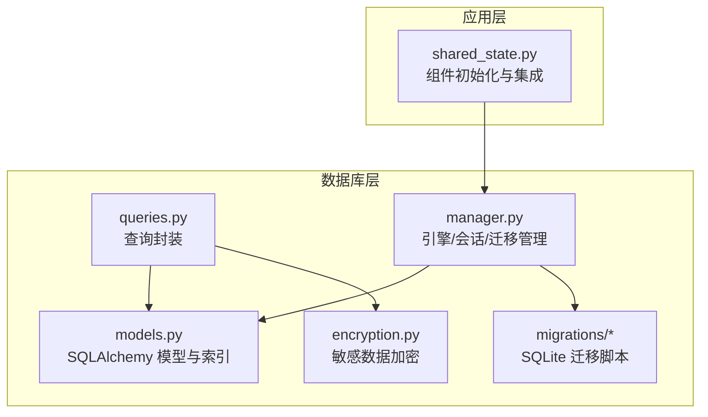
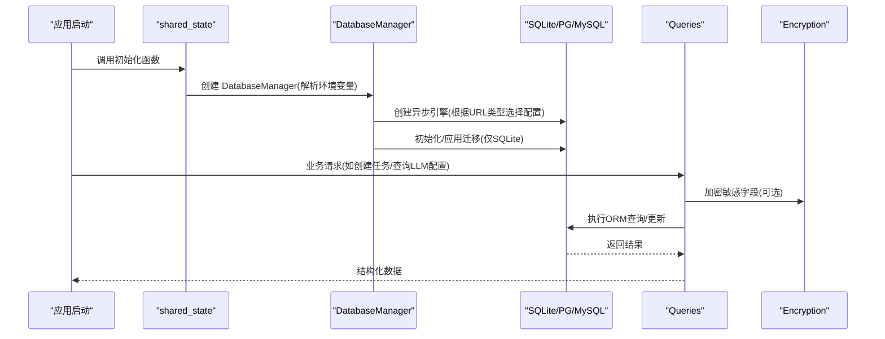
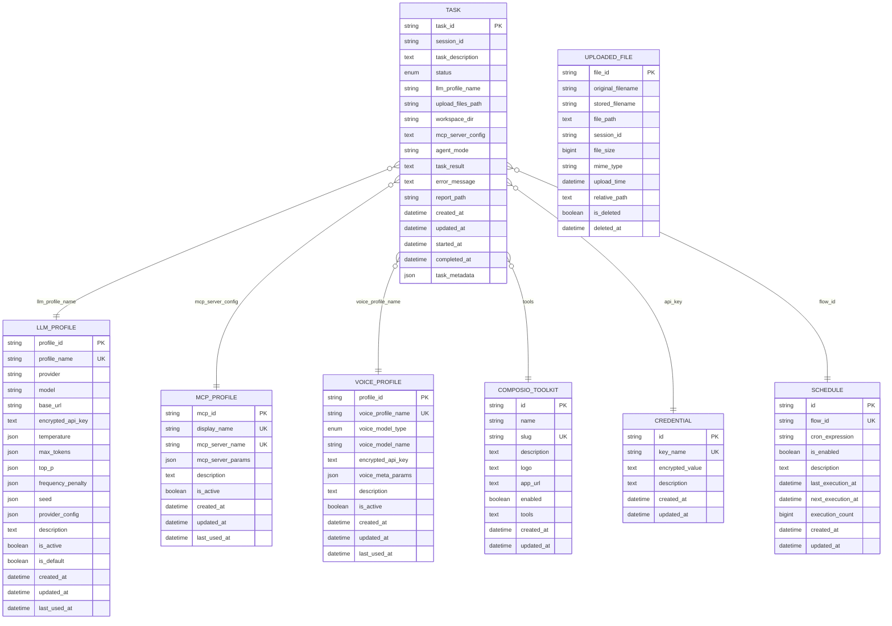
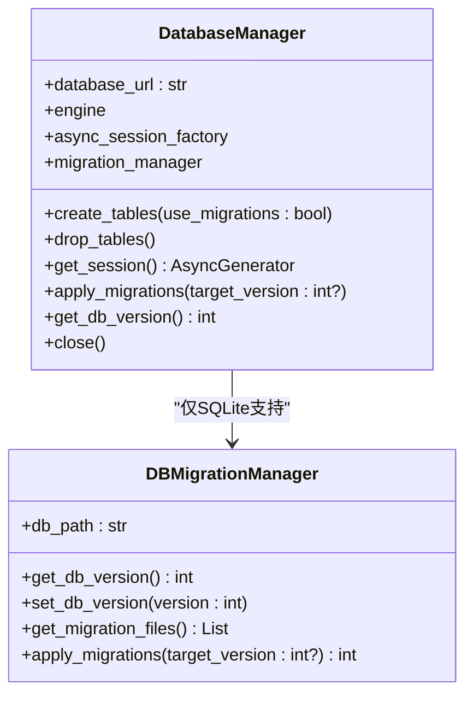
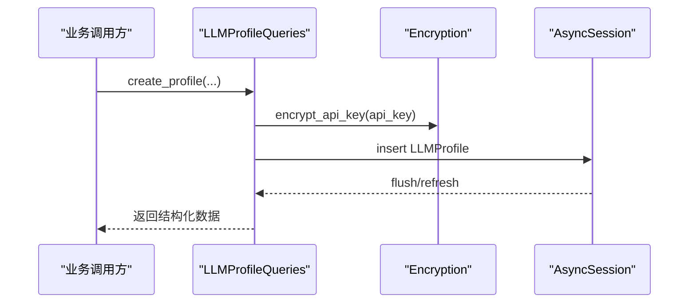
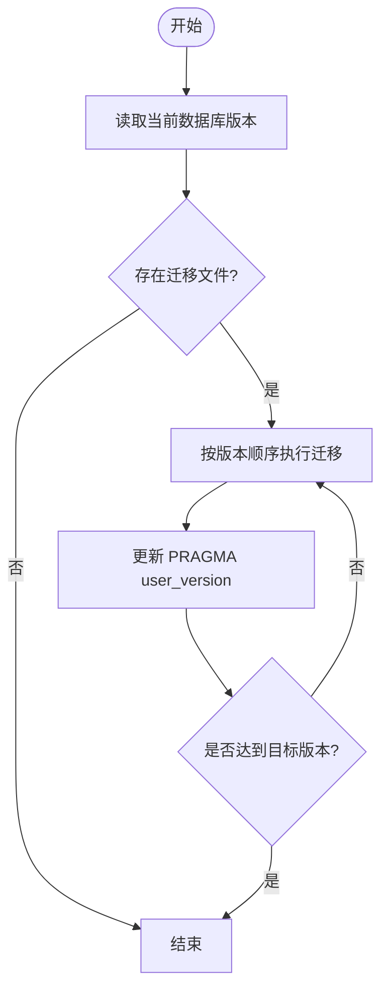
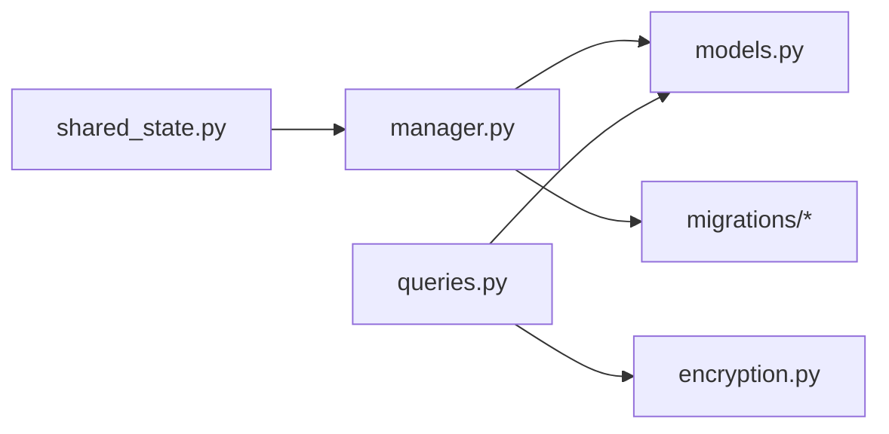

# 数据库访问

<cite>
**本文引用的文件列表**
- [models.py](file://vibe_surf/backend/database/models.py)
- [manager.py](file://vibe_surf/backend/database/manager.py)
- [queries.py](file://vibe_surf/backend/database/queries.py)
- [v001_initial_schema.sql](file://vibe_surf/backend/database/migrations/v001_initial_schema.sql)
- [v002_add_agent_mode.sql](file://vibe_surf/backend/database/migrations/v002_add_agent_mode.sql)
- [v003_fix_task_status_case.sql](file://vibe_surf/backend/database/migrations/v003_fix_task_status_case.sql)
- [v004_add_voice_profiles.sql](file://vibe_surf/backend/database/migrations/v004_add_voice_profiles.sql)
- [v005_add_composio_integration.sql](file://vibe_surf/backend/database/migrations/v005_add_composio_integration.sql)
- [v006_add_credentials_table.sql](file://vibe_surf/backend/database/migrations/v006_add_credentials_table.sql)
- [v007_add_schedule_table.sql](file://vibe_surf/backend/database/migrations/v007_add_schedule_table.sql)
- [encryption.py](file://vibe_surf/backend/utils/encryption.py)
- [shared_state.py](file://vibe_surf/backend/shared_state.py)
</cite>

## 目录
1. [简介](#简介)
2. [项目结构](#项目结构)
3. [核心组件](#核心组件)
4. [架构总览](#架构总览)
5. [详细组件分析](#详细组件分析)
6. [依赖关系分析](#依赖关系分析)
7. [性能考量](#性能考量)
8. [故障排查指南](#故障排查指南)
9. [结论](#结论)
10. [附录：常见操作示例与最佳实践](#附录常见操作示例与最佳实践)

## 简介
本文件面向 VibeSurf 后端数据库访问层，系统性梳理 SQLAlchemy 模型、数据库管理器、查询封装与迁移体系，帮助开发者理解数据持久化机制，并指导如何安全地扩展数据库功能。文档覆盖以下主题：
- 实体关系与表结构设计
- 连接池与会话管理
- 查询封装与性能优化
- 迁移版本控制流程
- 数据库模式图
- 常见数据库操作示例路径

## 项目结构
数据库相关代码集中在 backend/database 目录，核心文件包括：
- models.py：定义 SQLAlchemy 模型与索引
- manager.py：异步数据库引擎、连接池、会话管理与迁移管理
- queries.py：围绕模型的查询封装与业务逻辑
- migrations/*：SQLite 版本化迁移脚本
- utils/encryption.py：基于机器 MAC 或本地用户 ID 的对称加密工具
- shared_state.py：全局组件初始化与数据库管理器集成

图表来源
- [manager.py](file://vibe_surf/backend/database/manager.py#L148-L319)
- [models.py](file://vibe_surf/backend/database/models.py#L1-L289)
- [queries.py](file://vibe_surf/backend/database/queries.py#L1-L200)
- [encryption.py](file://vibe_surf/backend/utils/encryption.py#L1-L172)
- [shared_state.py](file://vibe_surf/backend/shared_state.py#L514-L598)

章节来源
- [manager.py](file://vibe_surf/backend/database/manager.py#L148-L319)
- [models.py](file://vibe_surf/backend/database/models.py#L1-L289)
- [queries.py](file://vibe_surf/backend/database/queries.py#L1-L200)
- [encryption.py](file://vibe_surf/backend/utils/encryption.py#L1-L172)
- [shared_state.py](file://vibe_surf/backend/shared_state.py#L514-L598)

## 核心组件
- 数据库模型（models.py）
  - 定义 LLMProfile、Task、UploadedFile、McpProfile、VoiceProfile、ComposioToolkit、Credential、Schedule 等核心实体，包含主键、枚举字段、JSON 参数、时间戳与索引。
- 数据库管理器（manager.py）
  - 异步 SQLAlchemy 引擎创建、SQLite/PostgreSQL/MySQL 配置差异、静态连接池（SQLite）与生产连接池参数（预检、回收、溢出），会话生成器与事务提交/回滚/关闭流程，迁移管理器（仅 SQLite）。
- 查询封装（queries.py）
  - 针对各模型的 CRUD 与聚合查询，统一返回结构化字典以避免协程上下文问题；对敏感字段采用加密/解密；提供分页、过滤、计数、软删除等常用能力。
- 迁移（migrations/*）
  - 从 v001 到 v007 的版本演进，涵盖初始表结构、任务代理模式、任务状态大小写修正、语音配置、Composio 集成、凭据表与调度表。
- 加密工具（encryption.py）
  - 基于机器 MAC 地址或本地用户 ID 衍生对称密钥，使用 Fernet 对 API Key 等敏感数据进行加解密。
- 共享状态（shared_state.py）
  - 初始化数据库管理器、加载默认 LLM 配置、注册 MCP 与 Composio 工具、任务执行时通过数据库更新任务状态。

章节来源
- [models.py](file://vibe_surf/backend/database/models.py#L1-L289)
- [manager.py](file://vibe_surf/backend/database/manager.py#L148-L319)
- [queries.py](file://vibe_surf/backend/database/queries.py#L1-L200)
- [encryption.py](file://vibe_surf/backend/utils/encryption.py#L1-L172)
- [shared_state.py](file://vibe_surf/backend/shared_state.py#L514-L598)

## 架构总览
数据库访问整体流程：
- 应用启动时，shared_state 初始化数据库管理器并创建表（优先走迁移，失败则回退到直接建表）。
- 业务层通过依赖注入获取异步会话，调用 queries 封装的方法完成数据操作。
- 敏感字段（API Key）在入库前加密，在需要使用时解密。
- 迁移管理器负责 SQLite 数据库版本升级与校验。

图表来源
- [shared_state.py](file://vibe_surf/backend/shared_state.py#L514-L598)
- [manager.py](file://vibe_surf/backend/database/manager.py#L148-L319)
- [queries.py](file://vibe_surf/backend/database/queries.py#L1-L200)
- [encryption.py](file://vibe_surf/backend/utils/encryption.py#L1-L172)

## 详细组件分析

### 数据库模型与实体关系
- 关键实体与字段要点
  - LLMProfile：提供方、模型、基础地址、温度、最大令牌、TopP、频率惩罚、种子、提供商配置、描述、是否激活/默认、时间戳、最后使用时间。
  - Task：任务标识、会话标识、描述、状态（枚举）、LLM 配置名称（外键式引用）、上传文件路径、工作区目录、MCP 配置（JSON 字符串）、代理模式、结果、错误、报告路径、时间戳、元数据。
  - UploadedFile：文件标识、原始名、存储名、物理路径、会话标识、大小、MIME 类型、上传时间、相对路径、软删除标记与删除时间。
  - McpProfile：显示名、服务器名唯一、服务器参数（JSON）、描述、激活状态、时间戳、最后使用时间。
  - VoiceProfile：语音配置名、类型（ASR/TTS）、模型名、元参数（JSON）、描述、激活状态、时间戳、最后使用时间。
  - ComposioToolkit：名称、slug 唯一、描述、图标、应用链接、启用状态、工具映射（JSON 字符串）、时间戳。
  - Credential：键名唯一、加密值、描述、时间戳。
  - Schedule：流程标识唯一、Cron 表达式、启用状态、描述、最近/下次执行时间、执行次数、时间戳。
- 索引与约束
  - 多处复合索引与单列索引用于提升查询性能（如任务状态、会话、LLM 名称、上传时间、语音类型、工具启用状态、凭据键名、调度字段）。
  - SQLite 触发器自动维护 updated_at 时间戳。
- 实体关系示意

图表来源
- [models.py](file://vibe_surf/backend/database/models.py#L1-L289)

章节来源
- [models.py](file://vibe_surf/backend/database/models.py#L1-L289)

### 数据库管理器（连接池与会话）
- 引擎配置
  - SQLite：使用 StaticPool，禁用线程检查，设置超时；适合开发与单进程场景。
  - PostgreSQL/MySQL：生产级连接池参数（池大小、溢出、pre_ping、回收周期），echo 可选开启调试。
- 会话管理
  - 使用 sessionmaker(class_=AsyncSession, expire_on_commit=False) 提供异步会话工厂。
  - get_session() 提供异步上下文，自动 commit/rollback/关闭，确保异常时回滚。
- 迁移管理（仅 SQLite）
  - DBMigrationManager 支持扫描 v001..vxxx 文件，按版本顺序执行，PRAGMA user_version 维护当前版本，失败抛出运行时错误。
- 初始化与依赖注入
  - shared_state.initialize_vibesurf_components 中创建 DatabaseManager 并调用 create_tables(use_migrations=True)，失败回退到直接建表。
  - FastAPI 依赖 get_db_session() 从共享状态中获取会话。

图表来源
- [manager.py](file://vibe_surf/backend/database/manager.py#L148-L319)

章节来源
- [manager.py](file://vibe_surf/backend/database/manager.py#L148-L319)
- [shared_state.py](file://vibe_surf/backend/shared_state.py#L514-L598)

### 查询封装（设计模式与性能优化）
- 设计模式
  - 每个模型对应一个 Queries 类，方法命名清晰（create/get/list/update/delete），统一返回结构化字典或对象列表，避免直接暴露 ORM 对象导致的协程上下文问题。
  - 对敏感字段（API Key）提供“带解密”的查询方法，仅在需要时解密。
- 性能优化
  - 使用索引：多处单列/复合索引（任务状态、会话、LLM 名称、上传时间、语音类型、工具启用、凭据键名、调度字段）。
  - 分页与偏移：list/count 接口支持 limit/-1 与 offset，避免一次性拉取大量数据。
  - 软删除：UploadedFile 支持 is_deleted 标记与清理过期软删除记录。
  - JSON 字段：LLM/Voice/MCP 配置以 JSON 存储，便于灵活扩展。
- 典型查询链路

图表来源
- [queries.py](file://vibe_surf/backend/database/queries.py#L1-L200)
- [encryption.py](file://vibe_surf/backend/utils/encryption.py#L1-L172)

章节来源
- [queries.py](file://vibe_surf/backend/database/queries.py#L1-L200)
- [encryption.py](file://vibe_surf/backend/utils/encryption.py#L1-L172)

### 迁移版本控制流程
- 版本演进
  - v001：初始表结构（llm_profiles、tasks、uploaded_files、mcp_profiles）与触发器。
  - v002：为 tasks 添加 agent_mode 默认值。
  - v003：修复任务状态大小写，使其与枚举一致。
  - v004：新增 voice_profiles 表与索引、触发器。
  - v005：新增 composio_toolkits 表与索引、触发器。
  - v006：新增 credentials 表与索引、触发器。
  - v007：新增 schedules 表与索引、触发器。
- 应用流程
  - 初始化时尝试应用迁移，若失败则回退到直接建表。
  - SQLite 使用 PRAGMA user_version 记录当前版本，迁移按序号升序执行。

图表来源
- [manager.py](file://vibe_surf/backend/database/manager.py#L87-L146)
- [v001_initial_schema.sql](file://vibe_surf/backend/database/migrations/v001_initial_schema.sql#L1-L118)
- [v002_add_agent_mode.sql](file://vibe_surf/backend/database/migrations/v002_add_agent_mode.sql#L1-L6)
- [v003_fix_task_status_case.sql](file://vibe_surf/backend/database/migrations/v003_fix_task_status_case.sql#L1-L11)
- [v004_add_voice_profiles.sql](file://vibe_surf/backend/database/migrations/v004_add_voice_profiles.sql#L1-L35)
- [v005_add_composio_integration.sql](file://vibe_surf/backend/database/migrations/v005_add_composio_integration.sql#L1-L33)
- [v006_add_credentials_table.sql](file://vibe_surf/backend/database/migrations/v006_add_credentials_table.sql#L1-L26)
- [v007_add_schedule_table.sql](file://vibe_surf/backend/database/migrations/v007_add_schedule_table.sql#L1-L29)

章节来源
- [manager.py](file://vibe_surf/backend/database/manager.py#L87-L146)
- [v001_initial_schema.sql](file://vibe_surf/backend/database/migrations/v001_initial_schema.sql#L1-L118)
- [v002_add_agent_mode.sql](file://vibe_surf/backend/database/migrations/v002_add_agent_mode.sql#L1-L6)
- [v003_fix_task_status_case.sql](file://vibe_surf/backend/database/migrations/v003_fix_task_status_case.sql#L1-L11)
- [v004_add_voice_profiles.sql](file://vibe_surf/backend/database/migrations/v004_add_voice_profiles.sql#L1-L35)
- [v005_add_composio_integration.sql](file://vibe_surf/backend/database/migrations/v005_add_composio_integration.sql#L1-L33)
- [v006_add_credentials_table.sql](file://vibe_surf/backend/database/migrations/v006_add_credentials_table.sql#L1-L26)
- [v007_add_schedule_table.sql](file://vibe_surf/backend/database/migrations/v007_add_schedule_table.sql#L1-L29)

### 数据库模式图（表结构与外键）
- 表结构概览
  - llm_profiles：主键 profile_id，唯一 profile_name，包含 provider/model/base_url/参数/配置/状态/时间戳/最后使用时间。
  - tasks：主键 task_id，外键 llm_profile_name 引用 llm_profiles.profile_name，包含 session_id/status/agent_mode/metadata 等。
  - uploaded_files：主键 file_id，索引 session_id/upload_time/is_deleted/original_filename。
  - mcp_profiles：主键 mcp_id，唯一 display_name/mcp_server_name，包含参数/状态/时间戳。
  - voice_profiles：主键 profile_id，唯一 voice_profile_name，枚举 voice_model_type('asr'/'tts')。
  - composio_toolkits：主键 id，唯一 slug，启用状态与工具映射。
  - credentials：主键 id，唯一 key_name，加密值。
  - schedules：主键 id，唯一 flow_id，Cron/启用状态/执行计数/时间戳。
- 外键关系
  - tasks.llm_profile_name → llm_profiles.profile_name
  - tasks.session_id → 会话标识（无物理外键约束，业务上强约束）
  - 其余实体间无显式外键，通过业务层约束保证一致性。

章节来源
- [models.py](file://vibe_surf/backend/database/models.py#L1-L289)
- [v001_initial_schema.sql](file://vibe_surf/backend/database/migrations/v001_initial_schema.sql#L1-L118)
- [v004_add_voice_profiles.sql](file://vibe_surf/backend/database/migrations/v004_add_voice_profiles.sql#L1-L35)
- [v005_add_composio_integration.sql](file://vibe_surf/backend/database/migrations/v005_add_composio_integration.sql#L1-L33)
- [v006_add_credentials_table.sql](file://vibe_surf/backend/database/migrations/v006_add_credentials_table.sql#L1-L26)
- [v007_add_schedule_table.sql](file://vibe_surf/backend/database/migrations/v007_add_schedule_table.sql#L1-L29)

## 依赖关系分析
- 组件耦合
  - queries 依赖 models 与 encryption；manager 管理 engine/session；shared_state 负责初始化与依赖注入。
- 外部依赖
  - aiosqlite/sqlalchemy_asyncio（SQLite），SQLAlchemy 异步引擎；cryptography（Fernet 加密）；croniter（Cron 解析）。
- 潜在循环依赖
  - 通过延迟导入（如在函数内部 import）避免模块级循环依赖；shared_state 在初始化阶段创建 db_manager，随后由 queries 使用。

图表来源
- [shared_state.py](file://vibe_surf/backend/shared_state.py#L514-L598)
- [manager.py](file://vibe_surf/backend/database/manager.py#L148-L319)
- [models.py](file://vibe_surf/backend/database/models.py#L1-L289)
- [queries.py](file://vibe_surf/backend/database/queries.py#L1-L200)
- [encryption.py](file://vibe_surf/backend/utils/encryption.py#L1-L172)

章节来源
- [shared_state.py](file://vibe_surf/backend/shared_state.py#L514-L598)
- [manager.py](file://vibe_surf/backend/database/manager.py#L148-L319)
- [models.py](file://vibe_surf/backend/database/models.py#L1-L289)
- [queries.py](file://vibe_surf/backend/database/queries.py#L1-L200)
- [encryption.py](file://vibe_surf/backend/utils/encryption.py#L1-L172)

## 性能考量
- 连接池与并发
  - SQLite 使用 StaticPool，适合单进程/轻量并发；生产环境建议使用 PostgreSQL/MySQL 并配置合适的池大小与回收策略。
- 查询优化
  - 合理使用索引（已为高频查询字段建立索引）；分页查询避免全表扫描；对 JSON 字段的过滤尽量在应用层处理。
- 写入与事务
  - 使用 get_session() 自动提交/回滚，减少长事务；批量写入时合并 flush/commit 次数。
- 加密成本
  - API Key 加解密在内存中进行，注意在高频写入场景下的 CPU 开销；可考虑缓存解密结果（仅限会话内）。

[本节为通用指导，不直接分析具体文件]

## 故障排查指南
- 迁移失败
  - 现象：应用启动时报错，提示迁移失败。
  - 排查：确认 SQLite 数据库路径与权限；查看迁移文件是否匹配版本号；检查 PRAGMA user_version 是否正确；必要时回退到直接建表。
- 会话异常
  - 现象：查询报错或未提交。
  - 排查：确保通过 get_db_session() 获取会话；捕获异常后会自动回滚；确认数据库 URL 正确且可达。
- 加密解密失败
  - 现象：API Key 无法解密或为空。
  - 排查：确认加密密钥来源（MAC 地址或本地用户 ID）；检查加密/解密流程；必要时切换 use_local_userid 流程。
- 任务状态不一致
  - 现象：任务状态与预期不符。
  - 排查：核对 v003 任务状态大小写修正；检查 save_task/update_task_status 的调用时机与参数。

章节来源
- [manager.py](file://vibe_surf/backend/database/manager.py#L87-L146)
- [encryption.py](file://vibe_surf/backend/utils/encryption.py#L1-L172)
- [queries.py](file://vibe_surf/backend/database/queries.py#L441-L753)

## 结论
VibeSurf 后端数据库层采用清晰的分层设计：模型定义、会话管理、查询封装与迁移体系相互独立又紧密协作。通过索引、分页与加密等手段兼顾性能与安全；SQLite 迁移机制保障了版本演进的可控性。开发者可在此基础上安全扩展新实体与查询逻辑，同时遵循现有模式与最佳实践。

[本节为总结性内容，不直接分析具体文件]

## 附录：常见操作示例与最佳实践
- 创建 LLM 配置（含加密 API Key）
  - 示例路径：[LLMProfileQueries.create_profile](file://vibe_surf/backend/database/queries.py#L21-L110)
  - 最佳实践：先加密再入库；返回结构化数据避免 ORM 上下文泄漏。
- 获取默认 LLM 配置（含解密）
  - 示例路径：[LLMProfileQueries.get_default_profile](file://vibe_surf/backend/database/queries.py#L214-L264)
  - 使用场景：应用启动时加载默认模型。
- 保存/更新任务状态
  - 示例路径：[TaskQueries.save_task](file://vibe_surf/backend/database/queries.py#L441-L523)、[TaskQueries.update_task_status](file://vibe_surf/backend/database/queries.py#L614-L648)
  - 注意：首次运行时设置 started_at，完成/失败/停止时设置 completed_at。
- 查询会话历史与统计
  - 示例路径：[TaskQueries.get_all_sessions](file://vibe_surf/backend/database/queries.py#L572-L612)、[TaskQueries.get_task_counts_by_status](file://vibe_surf/backend/database/queries.py#L737-L753)
- 上传文件管理（软删除与清理）
  - 示例路径：[UploadedFileQueries.delete_file](file://vibe_surf/backend/database/queries.py#L862-L874)、[UploadedFileQueries.cleanup_deleted_files](file://vibe_surf/backend/database/queries.py#L916-L931)
- 凭据管理（加密存储/检索）
  - 示例路径：[CredentialQueries.store_credential](file://vibe_surf/backend/database/queries.py#L1368-L1401)、[CredentialQueries.get_credential](file://vibe_surf/backend/database/queries.py#L1349-L1366)
- 调度管理（Cron 解析与更新）
  - 示例路径：[ScheduleQueries.create_schedule](file://vibe_surf/backend/database/queries.py#L1432-L1488)、[ScheduleQueries.update_schedule](file://vibe_surf/backend/database/queries.py#L1558-L1587)
- 依赖注入与会话获取
  - 示例路径：[get_db_session](file://vibe_surf/backend/database/manager.py#L276-L285)、[shared_state.initialize_vibesurf_components](file://vibe_surf/backend/shared_state.py#L514-L598)

章节来源
- [queries.py](file://vibe_surf/backend/database/queries.py#L21-L110)
- [queries.py](file://vibe_surf/backend/database/queries.py#L441-L753)
- [queries.py](file://vibe_surf/backend/database/queries.py#L862-L931)
- [queries.py](file://vibe_surf/backend/database/queries.py#L1349-L1401)
- [queries.py](file://vibe_surf/backend/database/queries.py#L1432-L1587)
- [manager.py](file://vibe_surf/backend/database/manager.py#L276-L285)
- [shared_state.py](file://vibe_surf/backend/shared_state.py#L514-L598)