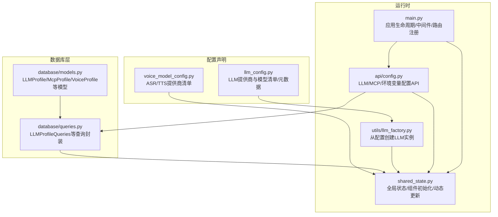
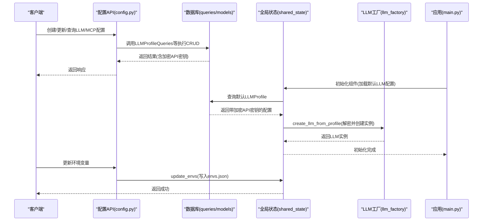
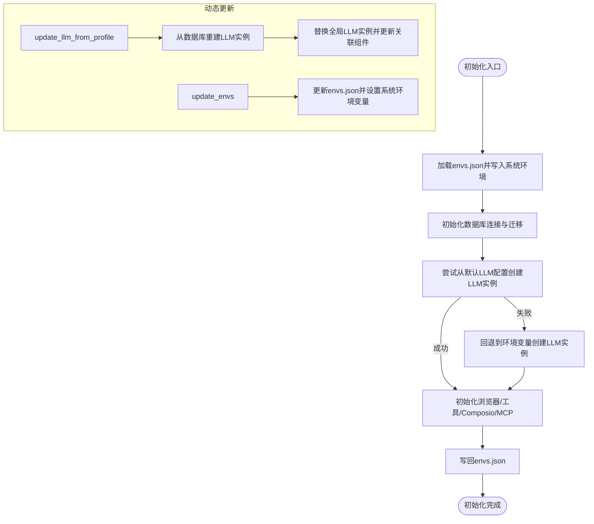
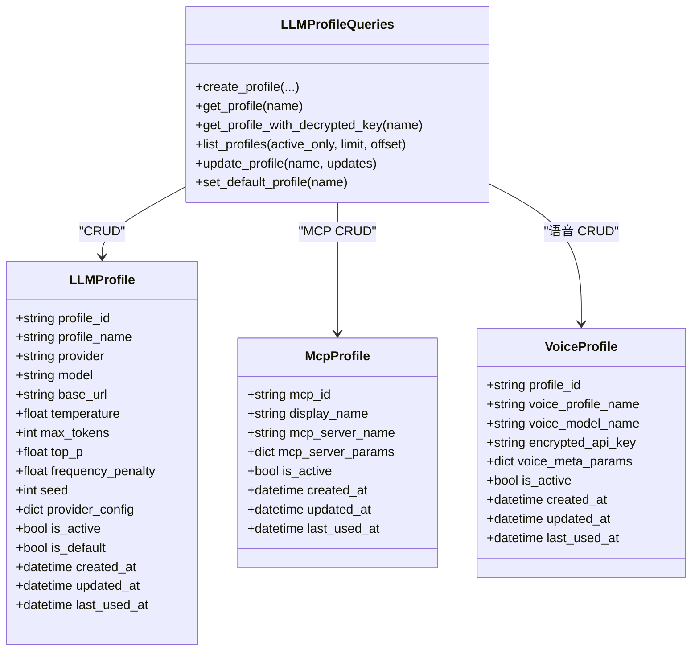
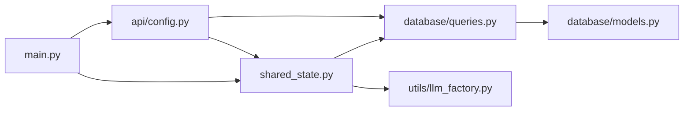

# 配置管理

<cite>
**本文引用的文件**
- [vibe_surf/backend/llm_config.py](file://vibe_surf/backend/llm_config.py)
- [vibe_surf/backend/voice_model_config.py](file://vibe_surf/backend/voice_model_config.py)
- [vibe_surf/backend/shared_state.py](file://vibe_surf/backend/shared_state.py)
- [vibe_surf/backend/main.py](file://vibe_surf/backend/main.py)
- [vibe_surf/backend/api/config.py](file://vibe_surf/backend/api/config.py)
- [vibe_surf/backend/database/queries.py](file://vibe_surf/backend/database/queries.py)
- [vibe_surf/backend/utils/llm_factory.py](file://vibe_surf/backend/utils/llm_factory.py)
- [vibe_surf/backend/database/models.py](file://vibe_surf/backend/database/models.py)
</cite>

## 目录
1. [简介](#简介)
2. [项目结构](#项目结构)
3. [核心组件](#核心组件)
4. [架构总览](#架构总览)
5. [详细组件分析](#详细组件分析)
6. [依赖关系分析](#依赖关系分析)
7. [性能与可扩展性](#性能与可扩展性)
8. [故障排查指南](#故障排查指南)
9. [结论](#结论)
10. [附录：配置示例与最佳实践](#附录配置示例与最佳实践)

## 简介
本文件面向VibeSurf后端的配置管理，系统化梳理LLM配置、语音模型配置、全局状态共享与运行时更新机制，并结合数据库层的配置持久化能力，给出配置加载流程、环境变量集成、默认值处理、动态重载与安全策略等实践建议。目标是帮助开发者快速理解并定制系统行为，同时安全地管理敏感信息（如API密钥）。

## 项目结构
围绕配置管理的关键模块分布如下：
- 配置声明与查询
  - LLM配置常量与元数据：[vibe_surf/backend/llm_config.py](file://vibe_surf/backend/llm_config.py)
  - 语音模型配置常量：[vibe_surf/backend/voice_model_config.py](file://vibe_surf/backend/voice_model_config.py)
  - 数据库模型与查询：[vibe_surf/backend/database/models.py](file://vibe_surf/backend/database/models.py)、[vibe_surf/backend/database/queries.py](file://vibe_surf/backend/database/queries.py)
- 运行时状态与初始化
  - 全局状态与组件初始化：[vibe_surf/backend/shared_state.py](file://vibe_surf/backend/shared_state.py)
  - 应用生命周期与启动入口：[vibe_surf/backend/main.py](file://vibe_surf/backend/main.py)
- 配置API与动态更新
  - 配置管理接口：[vibe_surf/backend/api/config.py](file://vibe_surf/backend/api/config.py)
  - LLM实例工厂：[vibe_surf/backend/utils/llm_factory.py](file://vibe_surf/backend/utils/llm_factory.py)

图表来源
- [vibe_surf/backend/llm_config.py](file://vibe_surf/backend/llm_config.py#L1-L226)
- [vibe_surf/backend/voice_model_config.py](file://vibe_surf/backend/voice_model_config.py#L1-L25)
- [vibe_surf/backend/database/models.py](file://vibe_surf/backend/database/models.py#L1-L200)
- [vibe_surf/backend/database/queries.py](file://vibe_surf/backend/database/queries.py#L1-L200)
- [vibe_surf/backend/shared_state.py](file://vibe_surf/backend/shared_state.py#L1-L200)
- [vibe_surf/backend/main.py](file://vibe_surf/backend/main.py#L1-L200)
- [vibe_surf/backend/api/config.py](file://vibe_surf/backend/api/config.py#L1-L120)
- [vibe_surf/backend/utils/llm_factory.py](file://vibe_surf/backend/utils/llm_factory.py#L1-L120)

章节来源
- [vibe_surf/backend/llm_config.py](file://vibe_surf/backend/llm_config.py#L1-L226)
- [vibe_surf/backend/voice_model_config.py](file://vibe_surf/backend/voice_model_config.py#L1-L25)
- [vibe_surf/backend/database/models.py](file://vibe_surf/backend/database/models.py#L1-L200)
- [vibe_surf/backend/database/queries.py](file://vibe_surf/backend/database/queries.py#L1-L200)
- [vibe_surf/backend/shared_state.py](file://vibe_surf/backend/shared_state.py#L1-L200)
- [vibe_surf/backend/main.py](file://vibe_surf/backend/main.py#L1-L200)
- [vibe_surf/backend/api/config.py](file://vibe_surf/backend/api/config.py#L1-L120)
- [vibe_surf/backend/utils/llm_factory.py](file://vibe_surf/backend/utils/llm_factory.py#L1-L120)

## 核心组件
- LLM配置中心（llm_config.py）
  - 提供商与模型清单、提供商元数据（是否需要API密钥、是否支持工具/视觉、默认模型、默认或可选base_url等）
  - 暴露查询函数：获取支持的提供商、某提供商模型列表、元数据、默认模型等
- 语音模型配置（voice_model_config.py）
  - 声学模型（ASR）提供商清单，标注模型类型、是否需要API密钥、提供商归属、是否支持base_url等
- 数据库模型与查询（database/models.py、database/queries.py）
  - LLMProfile：存储提供商、模型、base_url、参数、加密API密钥、默认标记等
  - McpProfile：MCP服务器配置
  - VoiceProfile：语音模型配置（ASR/TTS）
  - LLMProfileQueries：创建/查询/更新/默认配置等操作，含API密钥加解密
- LLM工厂（utils/llm_factory.py）
  - 将数据库配置转换为具体LLM实例，按提供商差异注入参数；校验必填项与参数支持范围
- 全局状态与初始化（shared_state.py）
  - 统一存放全局组件（LLM、浏览器、工具、Composio、计划任务等），负责从数据库默认配置初始化LLM，动态更新LLM、环境变量、MCP/Composio工具配置
  - 提供环境变量字典envs的持久化（envs.json），支持运行时更新
- 配置API（api/config.py）
  - LLM/MCP配置的增删改查与默认设置
  - 提供可用提供商/模型查询
  - 环境变量的查询与更新（受控过滤）
- 应用入口（main.py）
  - FastAPI应用生命周期：启动时初始化Langflow、VibeSurf组件、计划任务；关闭时清理
  - 注册配置相关路由

章节来源
- [vibe_surf/backend/llm_config.py](file://vibe_surf/backend/llm_config.py#L1-L226)
- [vibe_surf/backend/voice_model_config.py](file://vibe_surf/backend/voice_model_config.py#L1-L25)
- [vibe_surf/backend/database/models.py](file://vibe_surf/backend/database/models.py#L1-L200)
- [vibe_surf/backend/database/queries.py](file://vibe_surf/backend/database/queries.py#L1-L200)
- [vibe_surf/backend/utils/llm_factory.py](file://vibe_surf/backend/utils/llm_factory.py#L1-L275)
- [vibe_surf/backend/shared_state.py](file://vibe_surf/backend/shared_state.py#L1-L200)
- [vibe_surf/backend/api/config.py](file://vibe_surf/backend/api/config.py#L1-L200)
- [vibe_surf/backend/main.py](file://vibe_surf/backend/main.py#L1-L200)

## 架构总览
下图展示配置管理在系统中的位置与交互路径：从配置声明到数据库持久化，再到运行时初始化与动态更新，以及通过API进行管理。

图表来源
- [vibe_surf/backend/api/config.py](file://vibe_surf/backend/api/config.py#L1-L200)
- [vibe_surf/backend/database/queries.py](file://vibe_surf/backend/database/queries.py#L1-L200)
- [vibe_surf/backend/shared_state.py](file://vibe_surf/backend/shared_state.py#L450-L712)
- [vibe_surf/backend/utils/llm_factory.py](file://vibe_surf/backend/utils/llm_factory.py#L1-L120)
- [vibe_surf/backend/main.py](file://vibe_surf/backend/main.py#L327-L482)

## 详细组件分析

### LLM配置结构（llm_config.py）
- 结构要点
  - LLM_PROVIDERS：各提供商支持的模型清单
  - PROVIDER_METADATA：提供商元数据，包含显示名、是否需要API密钥、是否需要base_url、是否支持工具/视觉、默认模型、可选默认base_url/base_url
  - 查询函数：获取支持的提供商、某提供商模型列表、元数据、是否支持某提供商、默认模型
- 设计意图
  - 将“支持的提供商/模型”与“提供商能力元数据”解耦，便于统一查询与前端展示
  - 默认模型与base_url由元数据集中管理，减少调用方重复逻辑
- 复杂度与性能
  - 查询为O(1)字典访问；支持列表遍历用于API返回
- 安全与默认值
  - 默认值集中在元数据中；调用方可通过查询函数获取默认模型
  - 不直接暴露API密钥，密钥由数据库层加密存储

章节来源
- [vibe_surf/backend/llm_config.py](file://vibe_surf/backend/llm_config.py#L1-L226)

### 语音模型配置（voice_model_config.py）
- 结构要点
  - VOICE_MODELS：ASR类语音模型清单，标注模型类型、是否需要API密钥、提供商归属、是否支持base_url
- 设计意图
  - 与LLM配置一致的集中式声明方式，便于统一管理与API查询
- 使用场景
  - 与全局状态中的语音组件配合，支持ASR/TTS配置的动态加载与切换

章节来源
- [vibe_surf/backend/voice_model_config.py](file://vibe_surf/backend/voice_model_config.py#L1-L25)

### 全局状态与运行时更新（shared_state.py）
- 全局状态
  - 组件：vibesurf_agent、browser_manager、vibesurf_tools、llm、db_manager、composio_instance、schedule_manager
  - 环境变量：workspace_dir、browser_execution_path、browser_user_data、envs、active_mcp_server
  - 单任务跟踪：active_task、current_llm_profile_name
- 初始化流程
  - initialize_vibesurf_components：从环境变量与数据库默认配置初始化组件
    - 加载envs.json并写回系统环境
    - 初始化数据库连接与迁移
    - 优先从数据库默认LLM配置创建LLM实例，否则回退到环境变量
    - 初始化浏览器会话、VibeSurfAgent、MCP工具、Composio工具
    - 写回envs.json持久化
- 动态更新
  - update_llm_from_profile：根据指定配置名从数据库重建LLM实例并更新全局状态
  - update_envs：更新envs字典并写回envs.json，同时设置系统环境变量
  - MCP/Composio工具动态检查与更新：从数据库拉取最新配置，必要时重新注册客户端
- 计划任务
  - ScheduleManager：周期性从数据库加载启用的计划，基于cron表达式触发工作流执行，维护下次执行时间与执行次数

图表来源
- [vibe_surf/backend/shared_state.py](file://vibe_surf/backend/shared_state.py#L453-L712)

章节来源
- [vibe_surf/backend/shared_state.py](file://vibe_surf/backend/shared_state.py#L1-L200)
- [vibe_surf/backend/shared_state.py](file://vibe_surf/backend/shared_state.py#L453-L712)
- [vibe_surf/backend/shared_state.py](file://vibe_surf/backend/shared_state.py#L800-L1111)

### 配置API与数据库交互（api/config.py、database/queries.py、database/models.py）
- LLM配置API
  - 创建/列出/获取/更新/删除LLM配置
  - 设置默认LLM配置（自动取消其他默认）
  - 获取当前默认配置
  - 查询可用提供商与模型（整合llm_config.py元数据）
- MCP配置API
  - 创建/列出/获取/更新/删除MCP配置
- 环境变量API
  - 获取当前envs字典
  - 受控更新envs（仅允许白名单键）
- 数据库层
  - LLMProfile模型：存储提供商、模型、base_url、温度、最大token、top_p、频率惩罚、种子、提供商额外配置、描述、激活/默认标记、时间戳
  - LLMProfileQueries：创建/查询/更新/默认设置，含API密钥加解密
  - 其他模型：McpProfile、VoiceProfile等

图表来源
- [vibe_surf/backend/database/models.py](file://vibe_surf/backend/database/models.py#L1-L200)
- [vibe_surf/backend/database/queries.py](file://vibe_surf/backend/database/queries.py#L1-L200)

章节来源
- [vibe_surf/backend/api/config.py](file://vibe_surf/backend/api/config.py#L1-L200)
- [vibe_surf/backend/database/models.py](file://vibe_surf/backend/database/models.py#L1-L200)
- [vibe_surf/backend/database/queries.py](file://vibe_surf/backend/database/queries.py#L1-L200)

### LLM工厂与参数校验（utils/llm_factory.py）
- 工厂职责
  - 从数据库记录（含已解密API密钥）创建具体LLM实例
  - 按提供商差异注入参数（如temperature、max_tokens、top_p、frequency_penalty、seed等）
  - 对Azure/OpenAI Compatible/AWS Bedrock等特殊提供商做参数映射与校验
- 参数支持矩阵
  - 通过元数据与内置支持表，限定每个提供商支持的参数集合
- 校验
  - validate_llm_configuration：校验提供商、模型、API密钥、base_url等
  - get_llm_creation_parameters：返回所需/可选参数清单与元数据

章节来源
- [vibe_surf/backend/utils/llm_factory.py](file://vibe_surf/backend/utils/llm_factory.py#L1-L275)

### 应用生命周期与中间件（main.py）
- 生命周期
  - 启动：初始化Langflow后台任务、VibeSurf组件、计划任务；监控浏览器连接
  - 关闭：停止计划任务、清理后台任务、关闭浏览器与数据库
- 中间件与路由
  - CORS、内容大小限制、JS MIME类型修正、查询参数扁平化、健康检查、会话ID生成等
  - 注册配置API与其他业务路由

章节来源
- [vibe_surf/backend/main.py](file://vibe_surf/backend/main.py#L1-L200)
- [vibe_surf/backend/main.py](file://vibe_surf/backend/main.py#L327-L482)

## 依赖关系分析
- 组件耦合
  - shared_state依赖database/queries与utils/llm_factory，形成“配置→实例”的闭环
  - api/config依赖database/queries与shared_state，提供对外配置管理能力
  - main.py依赖shared_state与api/config，承载应用生命周期与路由
- 外部依赖
  - LLM提供商SDK（OpenAI、Anthropic、Google、Azure OpenAI、Groq、Ollama、OpenRouter、DeepSeek、AWS Bedrock、LM Studio等）
  - 数据库（SQLite/异步SQLAlchemy）
  - Composio、MCP Composer、浏览器会话管理
- 循环依赖规避
  - shared_state避免在顶层导入大型组件，使用延迟导入与异步初始化
  - api/config对shared_state的引用在函数内部，避免循环导入

图表来源
- [vibe_surf/backend/api/config.py](file://vibe_surf/backend/api/config.py#L1-L120)
- [vibe_surf/backend/database/queries.py](file://vibe_surf/backend/database/queries.py#L1-L200)
- [vibe_surf/backend/shared_state.py](file://vibe_surf/backend/shared_state.py#L1-L200)
- [vibe_surf/backend/utils/llm_factory.py](file://vibe_surf/backend/utils/llm_factory.py#L1-L120)
- [vibe_surf/backend/main.py](file://vibe_surf/backend/main.py#L1-L200)
- [vibe_surf/backend/database/models.py](file://vibe_surf/backend/database/models.py#L1-L200)

章节来源
- [vibe_surf/backend/api/config.py](file://vibe_surf/backend/api/config.py#L1-L120)
- [vibe_surf/backend/database/queries.py](file://vibe_surf/backend/database/queries.py#L1-L200)
- [vibe_surf/backend/shared_state.py](file://vibe_surf/backend/shared_state.py#L1-L200)
- [vibe_surf/backend/utils/llm_factory.py](file://vibe_surf/backend/utils/llm_factory.py#L1-L120)
- [vibe_surf/backend/main.py](file://vibe_surf/backend/main.py#L1-L200)
- [vibe_surf/backend/database/models.py](file://vibe_surf/backend/database/models.py#L1-L200)

## 性能与可扩展性
- 查询与缓存
  - LLM/MCP/Composio配置变更采用“从数据库拉取→对比→必要时更新”的策略，避免频繁重建
  - 计划任务使用croniter计算下次执行时间，本地缓存避免重复查询
- 异步与并发
  - 所有数据库与外部服务交互均采用异步模式，降低阻塞风险
- 可扩展点
  - 新增提供商：在llm_config.py添加提供商与元数据，llm_factory.py中新增分支与参数映射
  - 新增配置类型：在database/models.py新增模型与索引，在database/queries.py新增查询封装，在api/config.py新增路由

[本节为通用指导，不直接分析具体文件]

## 故障排查指南
- LLM无法初始化
  - 检查数据库默认配置是否存在且激活；若无则回退到环境变量
  - 确认API密钥是否正确（数据库层已加密存储，查询时解密）
  - 校验提供商参数是否满足要求（如Azure需base_url）
- 环境变量未生效
  - 确认通过配置API更新envs.json并写入系统环境
  - 检查envs.json是否被覆盖或权限问题
- Composio/MCP工具未更新
  - 触发动态更新逻辑，确认数据库中对应配置已变更
  - 查看日志中“更新工具/注册客户端”的提示
- 计划任务未执行
  - 检查Schedule表启用状态与cron表达式
  - 查看日志中“下次执行时间”与“执行计数”的更新情况

章节来源
- [vibe_surf/backend/shared_state.py](file://vibe_surf/backend/shared_state.py#L255-L386)
- [vibe_surf/backend/shared_state.py](file://vibe_surf/backend/shared_state.py#L800-L1111)
- [vibe_surf/backend/api/config.py](file://vibe_surf/backend/api/config.py#L690-L762)

## 结论
VibeSurf的配置管理以“声明式配置 + 数据库存储 + 运行时工厂 + 全局状态共享”为核心，实现了LLM、语音、工具与环境变量的统一管理与动态更新。通过严格的参数校验、加密存储与受控更新，既保证了灵活性，也确保了安全性与稳定性。开发者可通过API与工厂扩展新的提供商与配置类型，同时利用计划任务与工具动态更新机制提升系统自动化水平。

[本节为总结性内容，不直接分析具体文件]

## 附录：配置示例与最佳实践

- 配置加载流程
  - 启动阶段：从envs.json加载环境变量并写入系统环境；初始化数据库；尝试从默认LLM配置创建LLM实例，否则回退到环境变量；初始化浏览器、工具、Composio、MCP；写回envs.json
  - 运行时：通过配置API创建/更新LLM/MCP配置；通过update_envs更新环境变量；动态更新Composio/MCP工具
- 环境变量集成
  - 支持从envs.json加载并写入系统环境；通过配置API受控更新；部分关键变量（如浏览器路径、扩展路径、后端端口）在初始化时自动补全
- 默认值处理
  - LLM默认模型与base_url由llm_config.py元数据集中管理；未设置时按元数据提供默认值
- 动态重载
  - update_llm_from_profile：按配置名重建LLM实例并替换全局实例
  - update_envs：更新envs.json与系统环境变量
  - Composio/MCP工具：从数据库拉取最新配置，必要时重新注册客户端
- 安全最佳实践
  - API密钥在数据库层加密存储，查询时解密；不将明文密钥写入日志或响应体
  - 通过配置API更新环境变量时进行白名单过滤，避免注入不受控键
  - 对Azure/OpenAI Compatible/AWS Bedrock等特殊提供商严格校验必填参数
- 配置验证
  - llm_factory.validate_llm_configuration：统一校验提供商、模型、API密钥、base_url
  - llm_factory.get_llm_creation_parameters：返回所需/可选参数清单，辅助前端表单与校验

章节来源
- [vibe_surf/backend/shared_state.py](file://vibe_surf/backend/shared_state.py#L453-L712)
- [vibe_surf/backend/api/config.py](file://vibe_surf/backend/api/config.py#L690-L762)
- [vibe_surf/backend/utils/llm_factory.py](file://vibe_surf/backend/utils/llm_factory.py#L222-L275)