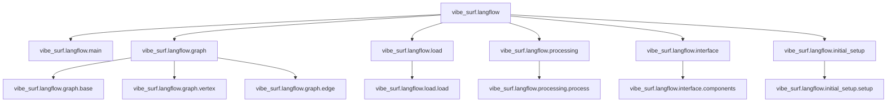
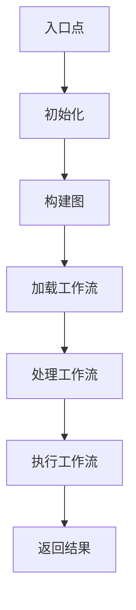
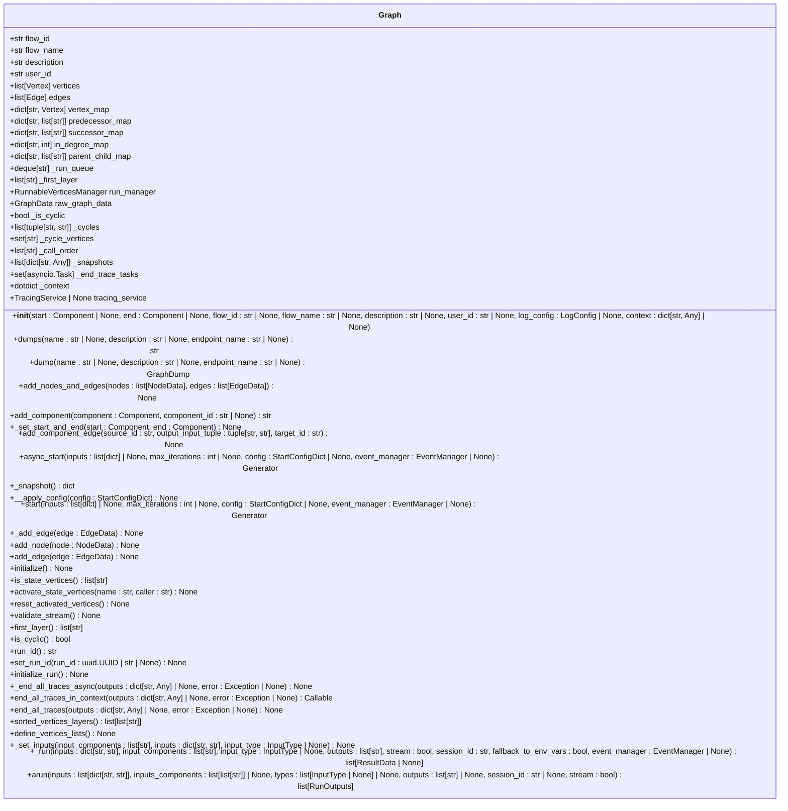
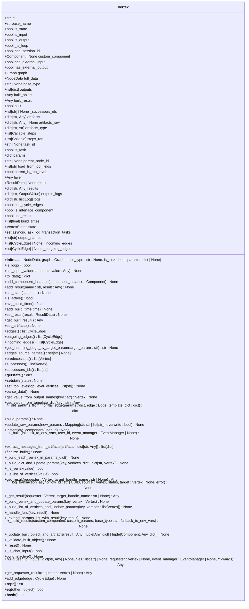
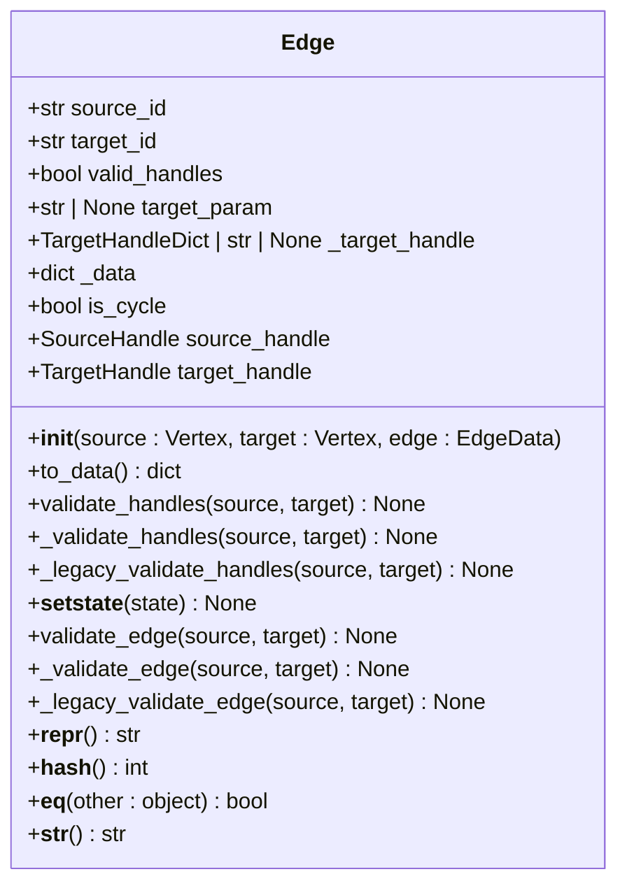
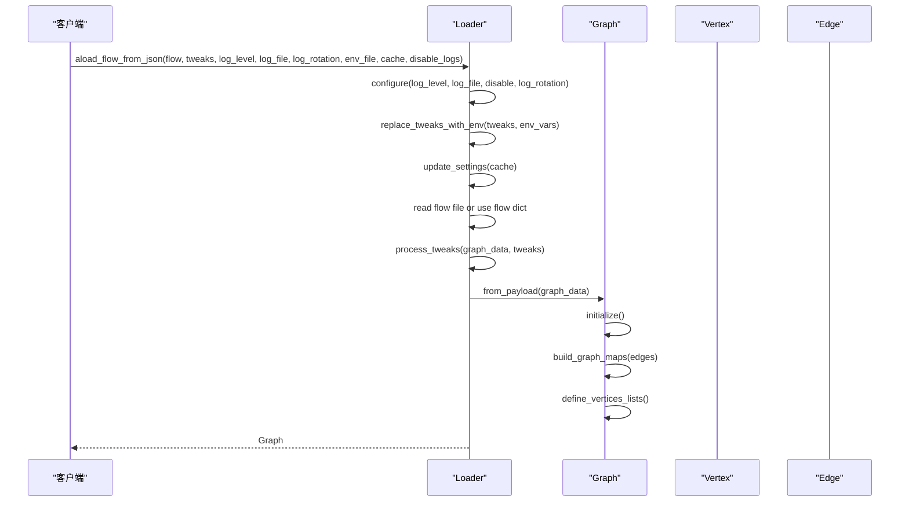
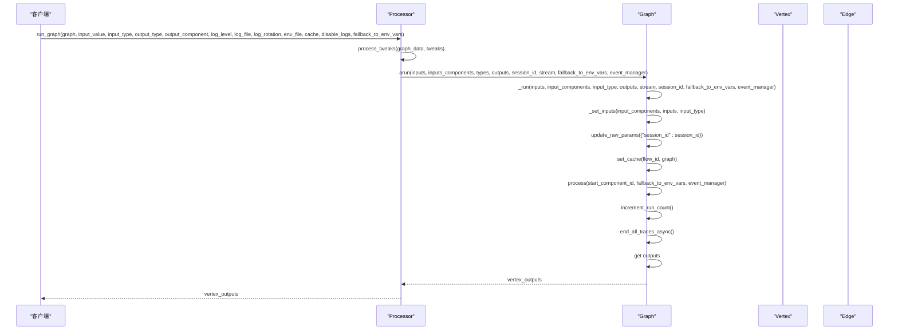
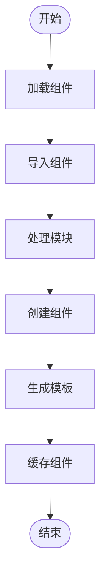
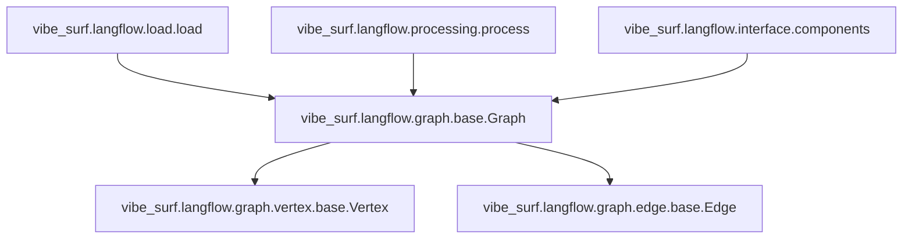

# 工作流引擎核心

<cite>
**本文档引用的文件**  
- [main.py](file://vibe_surf/langflow/main.py)
- [graph/base.py](file://vibe_surf/langflow/graph/graph/base.py)
- [graph/vertex/base.py](file://vibe_surf/langflow/graph/vertex/base.py)
- [graph/edge/base.py](file://vibe_surf/langflow/graph/edge/base.py)
- [load/load.py](file://vibe_surf/langflow/load/load.py)
- [processing/process.py](file://vibe_surf/langflow/processing/process.py)
- [interface/components.py](file://vibe_surf/langflow/interface/components.py)
- [initial_setup/setup.py](file://vibe_surf/langflow/initial_setup/setup.py)
</cite>

## 目录
1. [简介](#简介)
2. [项目结构](#项目结构)
3. [核心组件](#核心组件)
4. [架构概述](#架构概述)
5. [详细组件分析](#详细组件分析)
6. [依赖分析](#依赖分析)
7. [性能考虑](#性能考虑)
8. [故障排除指南](#故障排除指南)
9. [结论](#结论)

## 简介
本文档详细解释了LangFlow工作流引擎的内部实现。重点描述了`main.py`中的引擎入口点和初始化流程，分析了`core`目录中的核心处理逻辑，以及`graph`目录中的节点图构建和执行机制。文档说明了引擎如何解析工作流定义、管理节点依赖关系和调度执行顺序。提供了引擎的模块分解图，展示了各组件之间的交互关系。提供了关键类和函数的说明，如工作流加载器、执行调度器和状态管理器。帮助开发者理解引擎的扩展点和自定义开发方式。

## 项目结构
项目结构清晰地组织了工作流引擎的各个组件。`langflow`目录包含了引擎的核心实现，包括`graph`、`load`、`processing`和`interface`等子目录。`graph`目录包含了节点图的构建和执行机制，`load`目录包含了工作流的加载和运行逻辑，`processing`目录包含了工作流的处理和调度逻辑，`interface`目录包含了组件的接口和初始化逻辑。

**图源**
- [main.py](file://vibe_surf/langflow/main.py)
- [graph/base.py](file://vibe_surf/langflow/graph/graph/base.py)
- [load/load.py](file://vibe_surf/langflow/load/load.py)
- [processing/process.py](file://vibe_surf/langflow/processing/process.py)
- [interface/components.py](file://vibe_surf/langflow/interface/components.py)
- [initial_setup/setup.py](file://vibe_surf/langflow/initial_setup/setup.py)

**节源**
- [main.py](file://vibe_surf/langflow/main.py)
- [graph/base.py](file://vibe_surf/langflow/graph/graph/base.py)
- [load/load.py](file://vibe_surf/langflow/load/load.py)
- [processing/process.py](file://vibe_surf/langflow/processing/process.py)
- [interface/components.py](file://vibe_surf/langflow/interface/components.py)
- [initial_setup/setup.py](file://vibe_surf/langflow/initial_setup/setup.py)

## 核心组件
工作流引擎的核心组件包括`Graph`、`Vertex`、`Edge`、`Loader`、`Processor`和`ComponentManager`。`Graph`类负责构建和管理节点图，`Vertex`类表示图中的节点，`Edge`类表示节点之间的边。`Loader`类负责加载和运行工作流，`Processor`类负责处理和调度工作流的执行。`ComponentManager`类负责管理和初始化组件。

**节源**
- [graph/base.py](file://vibe_surf/langflow/graph/graph/base.py)
- [graph/vertex/base.py](file://vibe_surf/langflow/graph/vertex/base.py)
- [graph/edge/base.py](file://vibe_surf/langflow/graph/edge/base.py)
- [load/load.py](file://vibe_surf/langflow/load/load.py)
- [processing/process.py](file://vibe_surf/langflow/processing/process.py)
- [interface/components.py](file://vibe_surf/langflow/interface/components.py)

## 架构概述
工作流引擎的架构由多个组件组成，这些组件协同工作以实现工作流的解析、构建和执行。引擎的入口点是`main.py`中的`create_app`函数，它创建了FastAPI应用并初始化了引擎。`Graph`类负责构建和管理节点图，`Vertex`类表示图中的节点，`Edge`类表示节点之间的边。`Loader`类负责加载和运行工作流，`Processor`类负责处理和调度工作流的执行。`ComponentManager`类负责管理和初始化组件。

**图源**
- [main.py](file://vibe_surf/langflow/main.py)
- [graph/base.py](file://vibe_surf/langflow/graph/graph/base.py)
- [load/load.py](file://vibe_surf/langflow/load/load.py)
- [processing/process.py](file://vibe_surf/langflow/processing/process.py)

## 详细组件分析

### Graph类分析
`Graph`类是工作流引擎的核心，负责构建和管理节点图。它提供了构建图、添加节点和边、准备执行和运行图的方法。

#### 类图

**图源**
- [graph/base.py](file://vibe_surf/langflow/graph/graph/base.py)

### Vertex类分析
`Vertex`类表示图中的节点，负责管理节点的状态、参数和结果。

#### 类图

**图源**
- [graph/vertex/base.py](file://vibe_surf/langflow/graph/vertex/base.py)

### Edge类分析
`Edge`类表示节点之间的边，负责管理边的源和目标节点、处理边的验证和更新。

#### 类图

**图源**
- [graph/edge/base.py](file://vibe_surf/langflow/graph/edge/base.py)

### Loader类分析
`Loader`类负责加载和运行工作流，提供了加载和运行工作流的方法。

#### 序列图

**图源**
- [load/load.py](file://vibe_surf/langflow/load/load.py)

### Processor类分析
`Processor`类负责处理和调度工作流的执行，提供了处理和运行工作流的方法。

#### 序列图

**图源**
- [processing/process.py](file://vibe_surf/langflow/processing/process.py)

### ComponentManager类分析
`ComponentManager`类负责管理和初始化组件，提供了加载和缓存组件的方法。

#### 流程图

**图源**
- [interface/components.py](file://vibe_surf/langflow/interface/components.py)

## 依赖分析
工作流引擎的组件之间存在复杂的依赖关系。`Graph`类依赖于`Vertex`和`Edge`类来构建和管理节点图。`Loader`类依赖于`Graph`类来加载和运行工作流。`Processor`类依赖于`Graph`类来处理和调度工作流的执行。`ComponentManager`类依赖于`Graph`类来管理和初始化组件。

**图源**
- [graph/base.py](file://vibe_surf/langflow/graph/graph/base.py)
- [graph/vertex/base.py](file://vibe_surf/langflow/graph/vertex/base.py)
- [graph/edge/base.py](file://vibe_surf/langflow/graph/edge/base.py)
- [load/load.py](file://vibe_surf/langflow/load/load.py)
- [processing/process.py](file://vibe_surf/langflow/processing/process.py)
- [interface/components.py](file://vibe_surf/langflow/interface/components.py)

## 性能考虑
工作流引擎在设计时考虑了性能优化。通过异步加载和处理工作流，减少了I/O等待时间。通过缓存组件和工作流，减少了重复加载和处理的时间。通过并行处理多个工作流，提高了处理效率。

## 故障排除指南
在使用工作流引擎时，可能会遇到一些常见问题。以下是一些故障排除建议：

- **问题：工作流加载失败**
  - **解决方案**：检查工作流文件是否正确，确保文件路径和格式正确。
- **问题：节点执行失败**
  - **解决方案**：检查节点的参数和输入，确保参数和输入正确。
- **问题：边验证失败**
  - **解决方案**：检查边的源和目标节点，确保节点类型和参数匹配。

**节源**
- [graph/base.py](file://vibe_surf/langflow/graph/graph/base.py)
- [graph/vertex/base.py](file://vibe_surf/langflow/graph/vertex/base.py)
- [graph/edge/base.py](file://vibe_surf/langflow/graph/edge/base.py)
- [load/load.py](file://vibe_surf/langflow/load/load.py)
- [processing/process.py](file://vibe_surf/langflow/processing/process.py)
- [interface/components.py](file://vibe_surf/langflow/interface/components.py)

## 结论
本文档详细解释了LangFlow工作流引擎的内部实现。通过分析`main.py`中的引擎入口点和初始化流程，`core`目录中的核心处理逻辑，以及`graph`目录中的节点图构建和执行机制，我们深入了解了引擎的工作原理。文档说明了引擎如何解析工作流定义、管理节点依赖关系和调度执行顺序。提供了引擎的模块分解图，展示了各组件之间的交互关系。提供了关键类和函数的说明，如工作流加载器、执行调度器和状态管理器。帮助开发者理解引擎的扩展点和自定义开发方式。