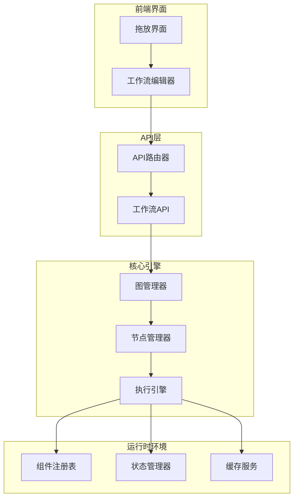
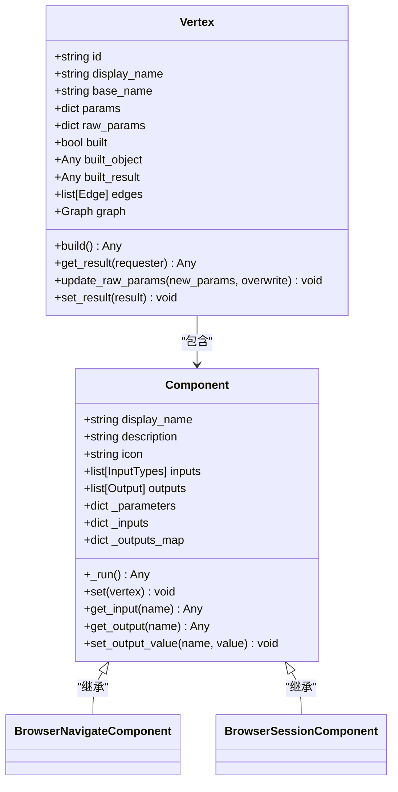
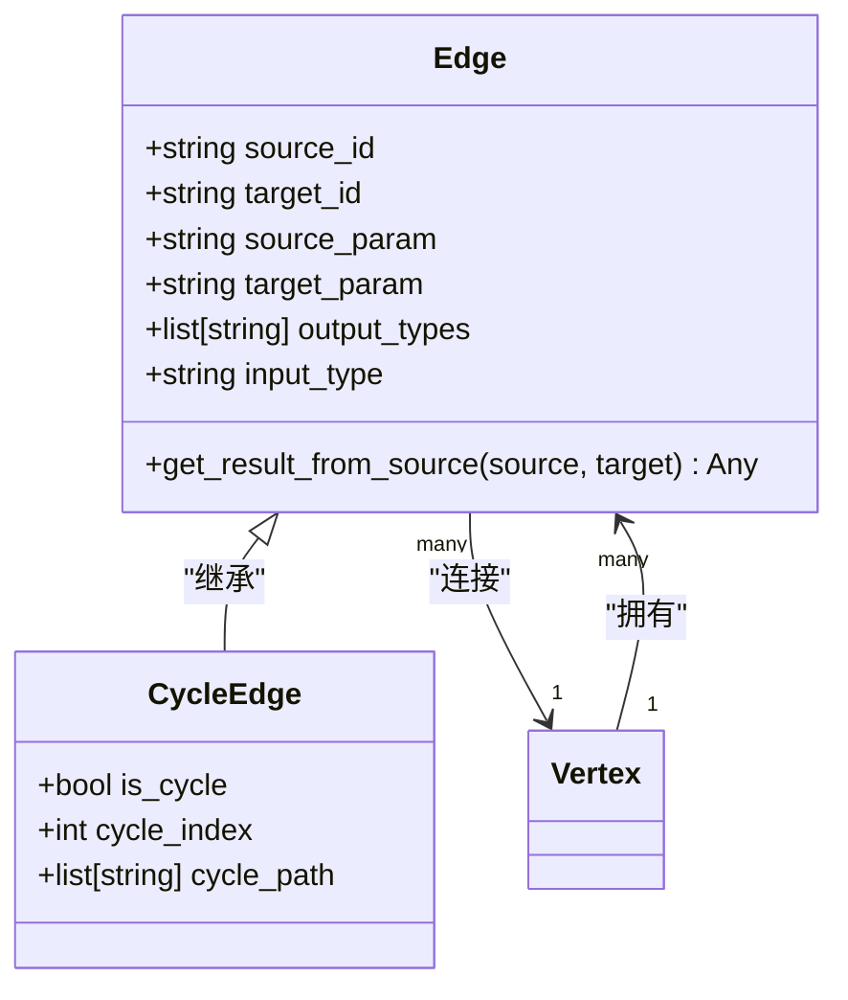
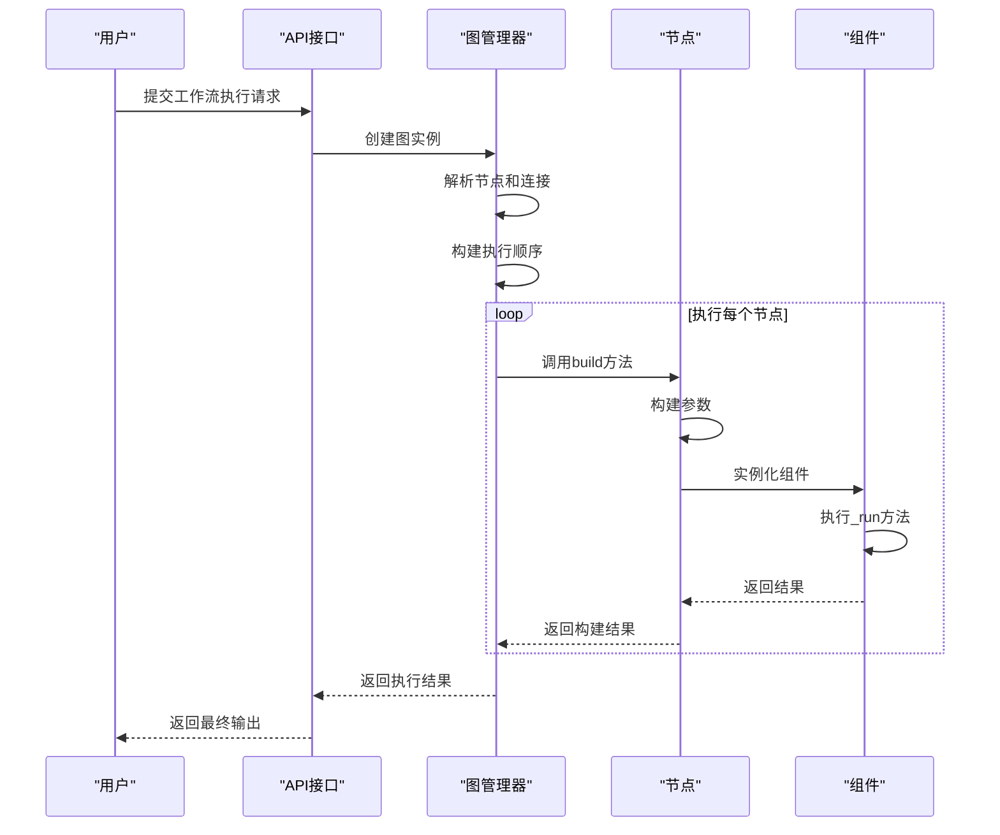
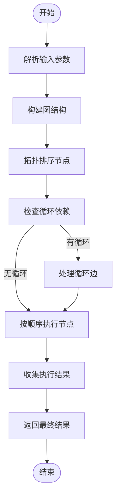
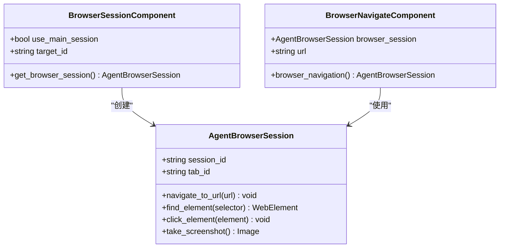
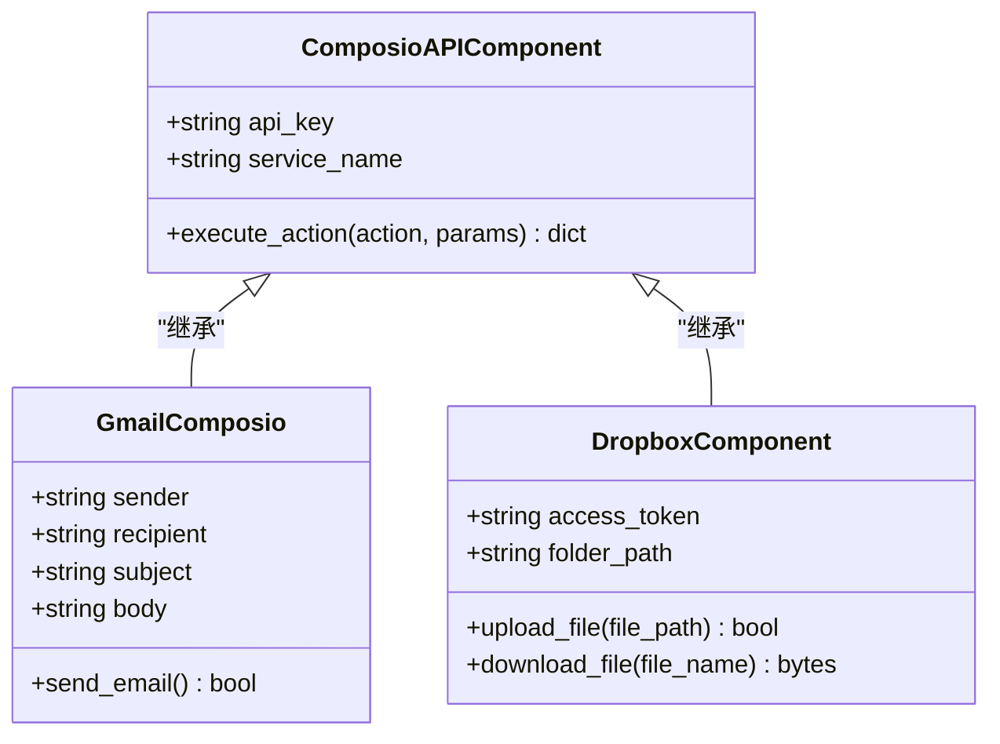
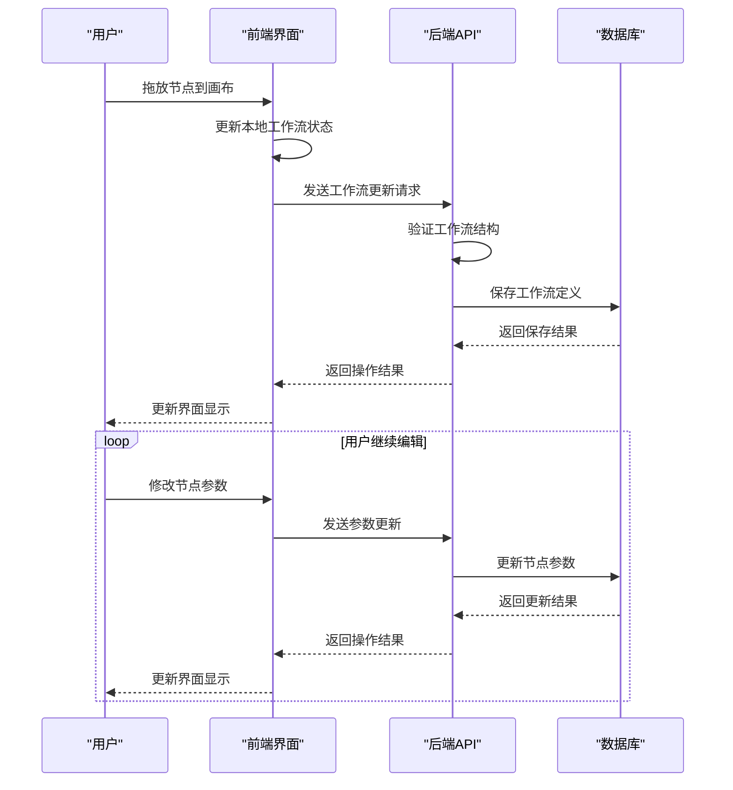
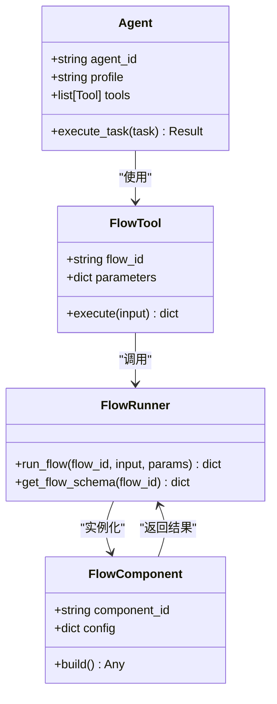
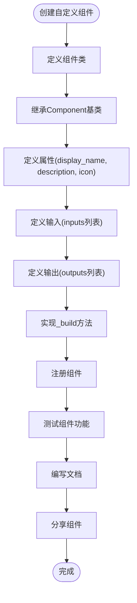

# 工作流引擎结构

<cite>
**本文档引用的文件**   
- [main.py](file://vibe_surf/langflow/main.py)
- [process.py](file://vibe_surf/langflow/processing/process.py)
- [base.py](file://vibe_surf/langflow/graph/graph/base.py)
- [component.py](file://vibe_surf/langflow/custom/custom_component/component.py)
- [vertex/base.py](file://vibe_surf/langflow/graph/vertex/base.py)
- [flow.py](file://vibe_surf/langflow/helpers/flow.py)
- [browser_navigate.py](file://vibe_surf/workflows/Browser/browser_navigate.py)
- [browser_session.py](file://vibe_surf/workflows/Browser/browser_session.py)
</cite>

## 目录
1. [简介](#简介)
2. [工作流引擎架构](#工作流引擎架构)
3. [核心组件分析](#核心组件分析)
4. [工作流执行机制](#工作流执行机制)
5. [预定义工作流分析](#预定义工作流分析)
6. [拖放界面集成](#拖放界面集成)
7. [工作流与代理系统集成](#工作流与代理系统集成)
8. [扩展与自定义](#扩展与自定义)
9. [结论](#结论)

## 简介
VibeSurf的工作流引擎是一个基于图形化编程的复杂系统，允许用户通过拖放界面创建和修改工作流。该引擎的核心是langflow目录中的组件，它实现了节点管理、连接处理和执行调度功能。工作流定义存储在workflows目录中，包括Browser和Integrations等子目录中的具体工作流。本文档详细解释了工作流引擎的架构设计和执行机制，帮助开发者理解如何创建新工作流、扩展引擎功能或集成自定义节点。

## 工作流引擎架构

**图源**
- [main.py](file://vibe_surf/langflow/main.py#L1-L551)
- [base.py](file://vibe_surf/langflow/graph/graph/base.py#L1-L2243)

**节源**
- [main.py](file://vibe_surf/langflow/main.py#L1-L551)
- [base.py](file://vibe_surf/langflow/graph/graph/base.py#L1-L2243)

## 核心组件分析

### 节点管理
工作流引擎中的节点（Vertex）是基本的执行单元，每个节点代表一个特定的功能或操作。节点通过继承Vertex类来实现，具有输入、输出和参数等属性。

**图源**
- [vertex/base.py](file://vibe_surf/langflow/graph/vertex/base.py#L1-L812)
- [component.py](file://vibe_surf/langflow/custom/custom_component/component.py#L1-L1743)

**节源**
- [vertex/base.py](file://vibe_surf/langflow/graph/vertex/base.py#L1-L812)
- [component.py](file://vibe_surf/langflow/custom/custom_component/component.py#L1-L1743)

### 连接处理
连接（Edge）是工作流中节点之间的数据流通道，定义了数据如何从一个节点的输出传递到另一个节点的输入。连接包含源节点、目标节点以及数据类型信息。

**图源**
- [vertex/base.py](file://vibe_surf/langflow/graph/vertex/base.py#L1-L812)
- [graph/base.py](file://vibe_surf/langflow/graph/graph/base.py#L1-L2243)

**节源**
- [vertex/base.py](file://vibe_surf/langflow/graph/vertex/base.py#L1-L812)
- [graph/base.py](file://vibe_surf/langflow/graph/graph/base.py#L1-L2243)

## 工作流执行机制

### 执行流程
工作流的执行是一个异步过程，从输入节点开始，按照拓扑排序的顺序逐个执行节点，直到所有输出节点完成。

**图源**
- [process.py](file://vibe_surf/langflow/processing/process.py#L1-L217)
- [base.py](file://vibe_surf/langflow/graph/graph/base.py#L1-L2243)

**节源**
- [process.py](file://vibe_surf/langflow/processing/process.py#L1-L217)
- [base.py](file://vibe_surf/langflow/graph/graph/base.py#L1-L2243)

### 调度机制
工作流引擎使用基于拓扑排序的调度机制，确保节点按照正确的依赖顺序执行。对于循环依赖，引擎提供了特殊的循环边处理机制。

**图源**
- [base.py](file://vibe_surf/langflow/graph/graph/base.py#L1-L2243)
- [process.py](file://vibe_surf/langflow/processing/process.py#L1-L217)

**节源**
- [base.py](file://vibe_surf/langflow/graph/graph/base.py#L1-L2243)
- [process.py](file://vibe_surf/langflow/processing/process.py#L1-L217)

## 预定义工作流分析

### 浏览器工作流
Browser目录包含了一系列与浏览器操作相关的工作流组件，这些组件允许自动化浏览器的各种操作。

**图源**
- [browser_session.py](file://vibe_surf/workflows/Browser/browser_session.py#L1-L55)
- [browser_navigate.py](file://vibe_surf/workflows/Browser/browser_navigate.py#L1-L51)
- [agent_browser_session.py](file://vibe_surf/browser/agent_browser_session.py)

**节源**
- [browser_session.py](file://vibe_surf/workflows/Browser/browser_session.py#L1-L55)
- [browser_navigate.py](file://vibe_surf/workflows/Browser/browser_navigate.py#L1-L51)

### 集成工作流
Integrations目录包含了一系列与外部服务集成的工作流组件，如社交媒体、云存储等。

**图源**
- [composio_api.py](file://vibe_surf/workflows/Integrations/composio_api.py)
- [dropbox_compnent.py](file://vibe_surf/workflows/Integrations/dropbox_compnent.py)
- [gmail_composio.py](file://vibe_surf/workflows/Integrations/gmail_composio.py)

**节源**
- [composio_api.py](file://vibe_surf/workflows/Integrations/composio_api.py)
- [dropbox_compnent.py](file://vibe_surf/workflows/Integrations/dropbox_compnent.py)
- [gmail_composio.py](file://vibe_surf/workflows/Integrations/gmail_composio.py)

## 拖放界面集成
工作流引擎通过API与前端拖放界面集成，允许用户通过可视化方式创建和修改工作流。

**图源**
- [main.py](file://vibe_surf/langflow/main.py#L1-L551)
- [router.py](file://vibe_surf/langflow/api/router.py#L1-L64)

**节源**
- [main.py](file://vibe_surf/langflow/main.py#L1-L551)
- [router.py](file://vibe_surf/langflow/api/router.py#L1-L64)

## 工作流与代理系统集成
工作流引擎与代理系统深度集成，允许工作流作为代理的工具或能力。

**图源**
- [flow.py](file://vibe_surf/langflow/helpers/flow.py#L1-L360)
- [main.py](file://vibe_surf/langflow/main.py#L1-L551)

**节源**
- [flow.py](file://vibe_surf/langflow/helpers/flow.py#L1-L360)
- [main.py](file://vibe_surf/langflow/main.py#L1-L551)

## 扩展与自定义
开发者可以通过创建自定义组件来扩展工作流引擎的功能。

**图源**
- [component.py](file://vibe_surf/langflow/custom/custom_component/component.py#L1-L1743)
- [custom_component.py](file://vibe_surf/langflow/custom/custom_component/custom_component.py)

**节源**
- [component.py](file://vibe_surf/langflow/custom/custom_component/component.py#L1-L1743)

## 结论
VibeSurf的工作流引擎提供了一个强大而灵活的框架，用于创建和执行复杂的工作流。通过理解其架构设计和执行机制，开发者可以有效地创建新工作流、扩展引擎功能或集成自定义节点。引擎的核心优势在于其模块化设计、清晰的组件接口和强大的执行调度能力，使得复杂的工作流自动化成为可能。