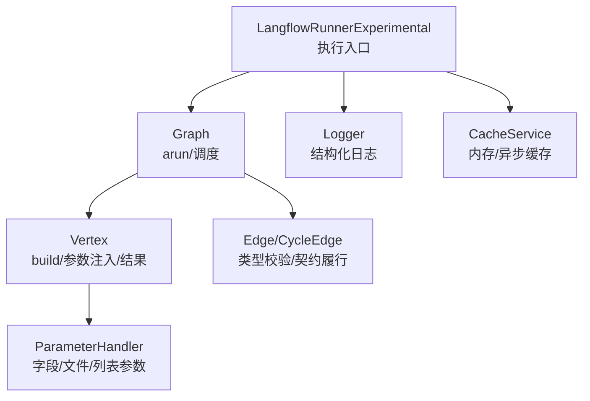
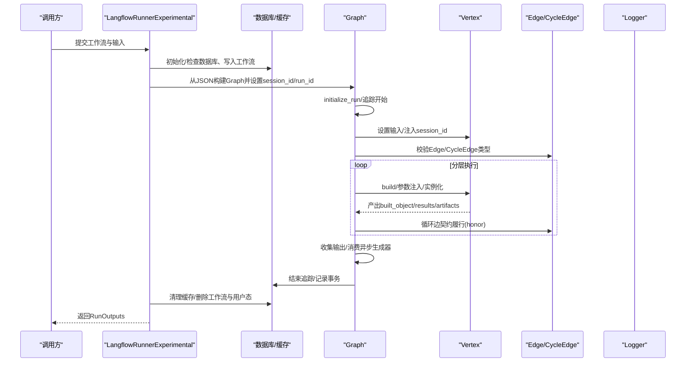
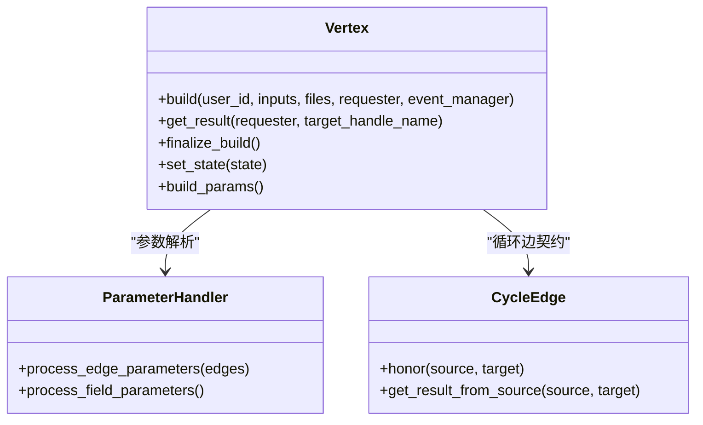
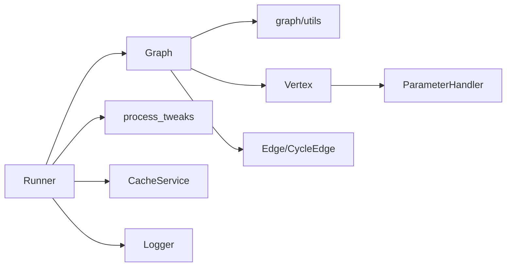

# 工作流执行机制

<cite>
**本文引用的文件**
- [flow_runner.py](file://vibe_surf/langflow/services/flow/flow_runner.py)
- [process.py](file://vibe_surf/langflow/processing/process.py)
- [base.py（顶点）](file://vibe_surf/langflow/graph/vertex/base.py)
- [base.py（边）](file://vibe_surf/langflow/graph/edge/base.py)
- [base.py（图）](file://vibe_surf/langflow/graph/graph/base.py)
- [utils.py（图工具）](file://vibe_surf/langflow/graph/graph/utils.py)
- [param_handler.py（参数处理器）](file://vibe_surf/langflow/graph/vertex/param_handler.py)
- [utils.py（通用工具）](file://vibe_surf/langflow/graph/utils.py)
- [logger.py（日志）](file://vibe_surf/langflow/logging/logger.py)
- [service.py（缓存服务）](file://vibe_surf/langflow/services/cache/service.py)
</cite>

## 目录
1. [简介](#简介)
2. [项目结构与定位](#项目结构与定位)
3. [核心组件总览](#核心组件总览)
4. [架构概览](#架构概览)
5. [详细组件分析](#详细组件分析)
6. [依赖关系分析](#依赖关系分析)
7. [性能考量与优化建议](#性能考量与优化建议)
8. [故障排查指南](#故障排查指南)
9. [结论](#结论)

## 简介
本文件系统性阐述该代码库中“工作流执行机制”的完整生命周期：从工作流定义、初始化、节点调度、结果收集，到执行上下文管理、错误处理与日志记录。重点围绕以下模块：
- 执行入口与生命周期管理：LangflowRunnerExperimental
- 图执行引擎：Graph.arun 及其内部调度
- 节点构建与参数注入：Vertex 构建链路与 ParameterHandler
- 边与循环边：Edge/CycleEdge 的类型校验与数据传递
- 执行上下文与日志：会话ID、运行ID、追踪与事务日志
- 缓存与清理：执行前后缓存与数据库状态清理
- 性能优化与常见问题排查

## 项目结构与定位
- 执行入口位于服务层，负责加载工作流、准备输入、创建图实例并触发执行。
- 图层负责拓扑排序、分层调度、循环检测与执行控制。
- 顶点层负责参数解析、组件实例化、结果产出与消息提取。
- 边层负责类型校验、参数映射与循环边契约履行。
- 日志与缓存贯穿执行全过程，提供可观测性与资源回收能力。

图表来源
- [flow_runner.py](file://vibe_surf/langflow/services/flow/flow_runner.py#L1-L266)
- [base.py（图）](file://vibe_surf/langflow/graph/graph/base.py#L792-L800)
- [base.py（顶点）](file://vibe_surf/langflow/graph/vertex/base.py#L366-L464)
- [base.py（边）](file://vibe_surf/langflow/graph/edge/base.py#L1-L120)
- [param_handler.py（参数处理器）](file://vibe_surf/langflow/graph/vertex/param_handler.py#L1-L120)
- [logger.py（日志）](file://vibe_surf/langflow/logging/logger.py#L203-L363)
- [service.py（缓存服务）](file://vibe_surf/langflow/services/cache/service.py#L294-L356)

章节来源
- [flow_runner.py](file://vibe_surf/langflow/services/flow/flow_runner.py#L1-L266)
- [base.py（图）](file://vibe_surf/langflow/graph/graph/base.py#L792-L800)

## 核心组件总览
- LangflowRunnerExperimental：工作流执行器，负责初始化数据库、加载/注入环境变量、准备图、执行图、清理状态等。
- Graph：工作流图的执行引擎，负责输入设置、会话ID注入、分层调度、循环处理、输出收集与追踪收尾。
- Vertex：节点构建与执行单元，负责参数构建、组件实例化、结果产出、消息提取与状态管理。
- Edge/CycleEdge：连接器，负责类型匹配与循环边契约履行。
- ParameterHandler：参数处理器，负责从模板字段与边连接中解析参数，支持文件路径、字典、直传类型等。
- Logger：结构化日志，支持缓冲、容器化输出、文件轮转与异常裁剪。
- CacheService：缓存服务，支持内存与异步内存缓存，用于执行期临时数据存储与清理。

章节来源
- [flow_runner.py](file://vibe_surf/langflow/services/flow/flow_runner.py#L1-L266)
- [base.py（图）](file://vibe_surf/langflow/graph/graph/base.py#L792-L800)
- [base.py（顶点）](file://vibe_surf/langflow/graph/vertex/base.py#L366-L464)
- [base.py（边）](file://vibe_surf/langflow/graph/edge/base.py#L1-L120)
- [param_handler.py（参数处理器）](file://vibe_surf/langflow/graph/vertex/param_handler.py#L1-L120)
- [logger.py（日志）](file://vibe_surf/langflow/logging/logger.py#L203-L363)
- [service.py（缓存服务）](file://vibe_surf/langflow/services/cache/service.py#L294-L356)

## 架构概览
下图展示了从“工作流定义”到“执行完成”的端到端流程，涵盖初始化、参数注入、构建、执行、结果收集与清理。

图表来源
- [flow_runner.py](file://vibe_surf/langflow/services/flow/flow_runner.py#L73-L117)
- [base.py（图）](file://vibe_surf/langflow/graph/graph/base.py#L792-L800)
- [base.py（顶点）](file://vibe_surf/langflow/graph/vertex/base.py#L366-L464)
- [base.py（边）](file://vibe_surf/langflow/graph/edge/base.py#L226-L278)
- [utils.py（通用工具）](file://vibe_surf/langflow/graph/utils.py#L115-L165)

章节来源
- [flow_runner.py](file://vibe_surf/langflow/services/flow/flow_runner.py#L73-L117)
- [base.py（图）](file://vibe_surf/langflow/graph/graph/base.py#L792-L800)

## 详细组件分析

### 执行入口：LangflowRunnerExperimental
- 初始化与配置
  - 日志配置：支持级别、格式、文件轮转与禁用。
  - 数据库检查与初始化：首次运行时自动迁移。
- 工作流准备
  - 读取/解析工作流JSON，注入tweaks（模板参数），替换为环境变量值。
  - 将工作流写入数据库，生成Flow记录。
- 执行与清理
  - 创建Graph并设置session_id/run_id/user_id。
  - 触发Graph.arun执行；结束后清理缓存与数据库状态。
  - 可选生成临时用户并清理用户态。

章节来源
- [flow_runner.py](file://vibe_surf/langflow/services/flow/flow_runner.py#L40-L117)
- [flow_runner.py](file://vibe_surf/langflow/services/flow/flow_runner.py#L119-L166)
- [flow_runner.py](file://vibe_surf/langflow/services/flow/flow_runner.py#L167-L237)
- [flow_runner.py](file://vibe_surf/langflow/services/flow/flow_runner.py#L238-L266)

### 图执行引擎：Graph.arun 与调度
- 输入与上下文
  - 设置输入参数、注入session_id至有会话ID能力的节点。
  - 优先选择webhook或chat输入组件作为起始点。
- 分层与循环
  - 使用拓扑分层与循环顶点处理策略，确保循环可达且受控。
  - 对循环边进行契约履行（CycleEdge.honor），将源节点结果写入目标节点参数。
- 输出收集
  - 收集标记为输出的节点结果，必要时消费异步生成器以确保完整结果。
- 追踪与收尾
  - 启动/结束追踪，记录运行元信息；异常时异步结束追踪。

章节来源
- [base.py（图）](file://vibe_surf/langflow/graph/graph/base.py#L792-L800)
- [utils.py（图工具）](file://vibe_surf/langflow/graph/graph/utils.py#L441-L460)
- [utils.py（图工具）](file://vibe_surf/langflow/graph/graph/utils.py#L461-L603)
- [base.py（边）](file://vibe_surf/langflow/graph/edge/base.py#L226-L278)

### 节点构建与参数注入：Vertex
- 参数构建
  - 通过ParameterHandler合并“来自边的参数”和“来自模板字段的参数”，后者支持文件、字典、直传类型、可选字段默认值等。
  - 支持列表型参数与嵌套字典型参数的特殊处理。
- 组件实例化
  - 基于vertex类型与模板，动态实例化组件，获取实例结果。
  - 支持协程函数包装与接口组件返回内容提取。
- 结果产出与消息提取
  - 产出built_object与artifacts，并根据接口类型提取消息结构，便于前端展示。
- 并发与状态
  - 每个节点使用锁保护构建过程；支持冻结/非活跃状态跳过构建。

图表来源
- [base.py（顶点）](file://vibe_surf/langflow/graph/vertex/base.py#L366-L464)
- [param_handler.py（参数处理器）](file://vibe_surf/langflow/graph/vertex/param_handler.py#L1-L120)
- [base.py（边）](file://vibe_surf/langflow/graph/edge/base.py#L226-L278)

章节来源
- [base.py（顶点）](file://vibe_surf/langflow/graph/vertex/base.py#L366-L464)
- [param_handler.py（参数处理器）](file://vibe_surf/langflow/graph/vertex/param_handler.py#L1-L120)

### 边与循环边：类型校验与契约
- 类型校验
  - 新式句柄与旧式句柄双通道校验，确保源节点输出类型与目标节点输入类型兼容。
  - 循环边场景下，允许目标输入类型为空，但要求源输出类型非空。
- 契约履行
  - CycleEdge.honor在目标节点参数上写入源节点结果，满足循环数据流。
  - 支持聊天输出等接口组件的消息拼装。

章节来源
- [base.py（边）](file://vibe_surf/langflow/graph/edge/base.py#L74-L124)
- [base.py（边）](file://vibe_surf/langflow/graph/edge/base.py#L139-L202)
- [base.py（边）](file://vibe_surf/langflow/graph/edge/base.py#L226-L278)

### 执行上下文与日志记录
- 上下文
  - Graph维护session_id/run_id/user_id，用于追踪与缓存键命名。
  - Vertex在构建时注入session_id（若节点具备该能力）。
- 日志
  - 结构化日志，支持缓冲、容器化输出、文件轮转与异常裁剪。
  - 顶点构建与事务日志持久化，支持序列化结果与参数长度限制。

章节来源
- [base.py（图）](file://vibe_surf/langflow/graph/graph/base.py#L608-L658)
- [base.py（顶点）](file://vibe_surf/langflow/graph/vertex/base.py#L519-L545)
- [utils.py（通用工具）](file://vibe_surf/langflow/graph/utils.py#L115-L165)
- [logger.py（日志）](file://vibe_surf/langflow/logging/logger.py#L203-L363)

### 缓存与清理
- 执行前/后清理
  - 执行前清空缓存，避免脏数据影响。
  - 执行后清理工作流相关缓存与数据库记录，必要时清理用户态。
- 缓存实现
  - 内存与异步内存缓存，支持LRU与过期策略，提供get/set/upsert/clear等操作。

章节来源
- [flow_runner.py](file://vibe_surf/langflow/services/flow/flow_runner.py#L216-L237)
- [service.py（缓存服务）](file://vibe_surf/langflow/services/cache/service.py#L294-L356)

## 依赖关系分析
- 入口依赖
  - Runner依赖Graph.from_payload、process_tweaks、参数处理器、缓存与数据库。
- 图层依赖
  - Graph依赖utils工具（拓扑分层、循环检测）、顶点与边模型、追踪服务。
- 顶点依赖
  - Vertex依赖ParameterHandler、接口组件加载、事件管理器与日志。
- 边依赖
  - Edge/CycleEdge依赖句柄schema与类型匹配规则。
- 日志与缓存
  - Logger贯穿各层；CacheService由Runner与Graph在执行前后调用。

图表来源
- [flow_runner.py](file://vibe_surf/langflow/services/flow/flow_runner.py#L1-L117)
- [base.py（图）](file://vibe_surf/langflow/graph/graph/base.py#L792-L800)
- [base.py（顶点）](file://vibe_surf/langflow/graph/vertex/base.py#L366-L464)
- [base.py（边）](file://vibe_surf/langflow/graph/edge/base.py#L1-L120)
- [param_handler.py（参数处理器）](file://vibe_surf/langflow/graph/vertex/param_handler.py#L1-L120)
- [logger.py（日志）](file://vibe_surf/langflow/logging/logger.py#L203-L363)
- [service.py（缓存服务）](file://vibe_surf/langflow/services/cache/service.py#L294-L356)

章节来源
- [flow_runner.py](file://vibe_surf/langflow/services/flow/flow_runner.py#L1-L117)
- [base.py（图）](file://vibe_surf/langflow/graph/graph/base.py#L792-L800)

## 性能考量与优化建议
- 并发与锁粒度
  - Vertex构建使用锁，建议避免在热路径上重复构建；利用冻结/非活跃节点跳过构建。
- 分层与循环控制
  - 合理设计图结构，减少深度循环；必要时限制max_iterations以避免无限循环。
- 参数注入与I/O
  - 文件参数路径解析与存储服务调用可能成为瓶颈，建议缓存常用路径或预处理文件。
- 日志与序列化
  - 大对象序列化成本高，注意限制日志输出大小；仅在需要时启用详细日志。
- 缓存策略
  - 使用异步内存缓存提升执行期临时数据访问速度；合理设置max_size与过期时间。
- 输入与输出过滤
  - 仅收集所需输出节点，避免不必要的结果收集与消息拼装。

[本节为通用指导，不直接分析具体文件]

## 故障排查指南
- 常见错误与定位
  - 边类型不匹配：Edge._validate_handles/_validate_edge会抛出异常，检查源/目标类型与inputTypes。
  - 节点未构建：Vertex.get_result在未构建时抛错，确认前置节点已成功构建。
  - 循环边契约未满足：CycleEdge.honor要求源节点已构建，检查循环依赖与构建顺序。
  - 输入为空：process.run_graph对输入做默认处理，若仍报错，检查输入组件与类型。
- 日志与追踪
  - 使用结构化日志查看运行轨迹；开启容器化输出或文件轮转以便排障。
  - 事务日志与顶点构建日志可用于回溯失败原因。
- 清理与重试
  - 执行失败后确保缓存与数据库状态被清理，避免脏状态影响后续执行。
  - 如需调试，可临时关闭清理逻辑以便保留现场。

章节来源
- [base.py（边）](file://vibe_surf/langflow/graph/edge/base.py#L74-L124)
- [base.py（边）](file://vibe_surf/langflow/graph/edge/base.py#L139-L202)
- [base.py（顶点）](file://vibe_surf/langflow/graph/vertex/base.py#L546-L569)
- [process.py](file://vibe_surf/langflow/processing/process.py#L93-L121)
- [logger.py（日志）](file://vibe_surf/langflow/logging/logger.py#L203-L363)
- [utils.py（通用工具）](file://vibe_surf/langflow/graph/utils.py#L115-L165)

## 结论
该工作流执行机制以“入口-图-节点-边-日志-缓存”为主线，形成清晰的生命周期闭环。通过严格的类型校验、分层调度与循环控制、完备的日志与事务记录，以及可插拔的缓存与清理策略，既保证了执行的稳定性，也为性能优化与问题排查提供了坚实基础。建议在实际部署中结合业务特性优化图结构、参数注入与缓存策略，并充分利用日志与追踪能力进行持续监控与迭代。