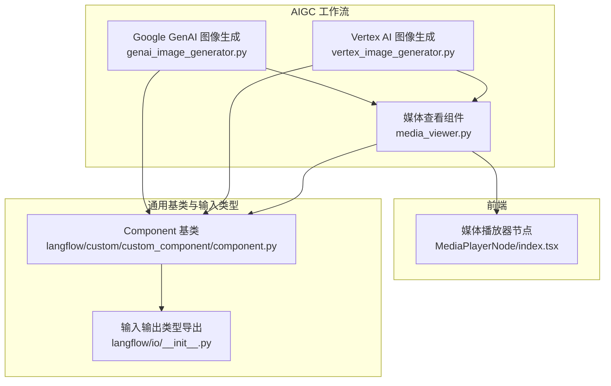
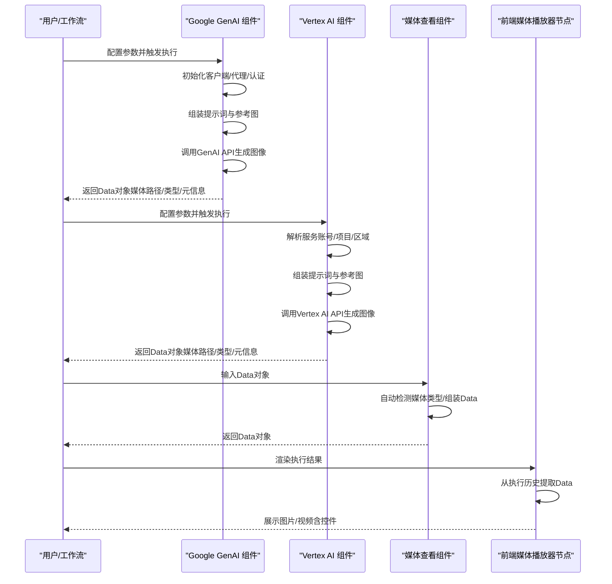
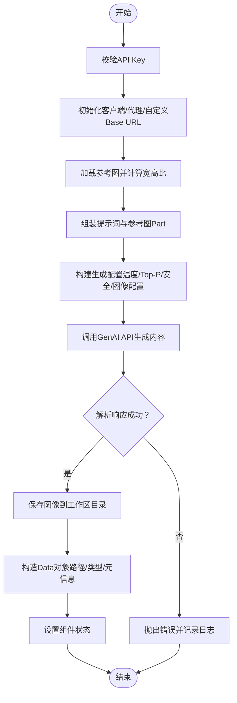
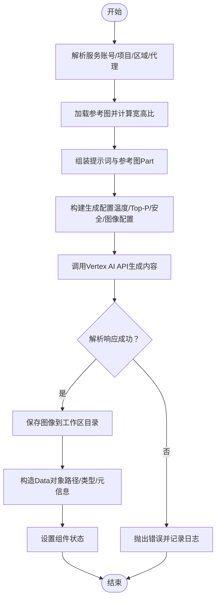
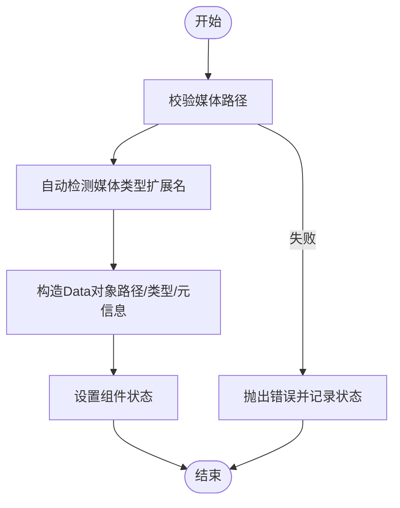
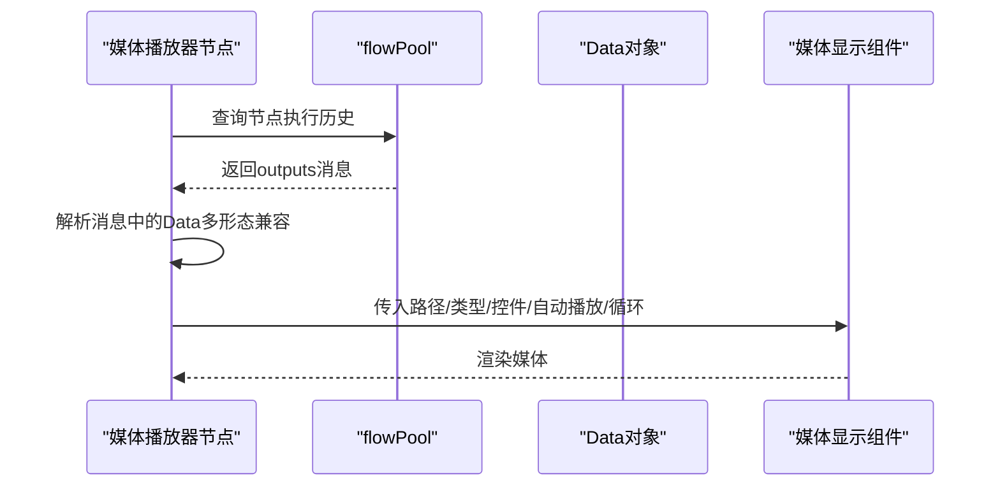
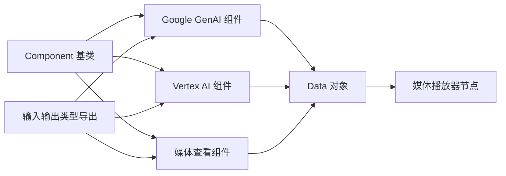

# AIGC工作流

<cite>
**本文引用的文件**
- [genai_image_generator.py](file://vibe_surf/workflows/AIGC/genai_image_generator.py)
- [vertex_image_generator.py](file://vibe_surf/workflows/AIGC/vertex_image_generator.py)
- [media_viewer.py](file://vibe_surf/workflows/AIGC/media_viewer.py)
- [component.py](file://vibe_surf/langflow/custom/custom_component/component.py)
- [io/__init__.py](file://vibe_surf/langflow/io/__init__.py)
- [index.tsx](file://vibe_surf/frontend/src/CustomNodes/MediaPlayerNode/index.tsx)
- [README.md](file://README.md)
</cite>

## 目录
1. [简介](#简介)
2. [项目结构](#项目结构)
3. [核心组件](#核心组件)
4. [架构总览](#架构总览)
5. [详细组件分析](#详细组件分析)
6. [依赖关系分析](#依赖关系分析)
7. [性能与成本优化](#性能与成本优化)
8. [故障排查指南](#故障排查指南)
9. [结论](#结论)
10. [附录：使用场景与最佳实践](#附录使用场景与最佳实践)

## 简介
本文件面向希望在VibeSurf中构建与运行AIGC（AI Generated Content）工作流的用户与开发者，系统性梳理图像生成、媒体处理与内容创作等核心能力的实现机制。重点覆盖以下方面：
- 如何通过Google Generative AI与Vertex AI进行图像生成；
- 如何在工作流中集成不同认证方式（API Key、服务账号、代理）；
- 如何处理生成结果的后处理与展示（本地文件落盘、Data对象封装、前端媒体节点渲染）；
- 模型配置、生成参数调整、质量控制与成本优化建议；
- 常见使用场景示例：自动生成营销素材、创建视觉内容、媒体资产管理。

## 项目结构
AIGC工作流位于后端工作流目录下，围绕三个核心组件展开：
- 图像生成组件：支持Google GenAI与Vertex AI两种路径
- 媒体查看组件：统一处理图片与视频的展示
- 前端媒体播放器节点：接收执行结果并在可视化画布中渲染

图表来源
- [genai_image_generator.py](file://vibe_surf/workflows/AIGC/genai_image_generator.py#L1-L285)
- [vertex_image_generator.py](file://vibe_surf/workflows/AIGC/vertex_image_generator.py#L1-L260)
- [media_viewer.py](file://vibe_surf/workflows/AIGC/media_viewer.py#L1-L127)
- [component.py](file://vibe_surf/langflow/custom/custom_component/component.py#L98-L170)
- [io/__init__.py](file://vibe_surf/langflow/io/__init__.py#L1-L64)
- [index.tsx](file://vibe_surf/frontend/src/CustomNodes/MediaPlayerNode/index.tsx#L1-L234)

章节来源
- [genai_image_generator.py](file://vibe_surf/workflows/AIGC/genai_image_generator.py#L1-L285)
- [vertex_image_generator.py](file://vibe_surf/workflows/AIGC/vertex_image_generator.py#L1-L260)
- [media_viewer.py](file://vibe_surf/workflows/AIGC/media_viewer.py#L1-L127)
- [component.py](file://vibe_surf/langflow/custom/custom_component/component.py#L98-L170)
- [io/__init__.py](file://vibe_surf/langflow/io/__init__.py#L1-L64)
- [index.tsx](file://vibe_surf/frontend/src/CustomNodes/MediaPlayerNode/index.tsx#L1-L234)

## 核心组件
- Google GenAI 图像生成组件
  - 支持通过API Key调用Google GenAI；可选启用Vertex AI模式；支持代理与自定义Base URL；支持参考图与自动/手动指定宽高比与分辨率；返回Data对象封装媒体路径与元信息。
- Vertex AI 图像生成组件
  - 通过Vertex AI生成图像；支持服务账号文件或环境变量认证；支持项目ID、区域、代理；与GenAI组件一致的参数与输出。
- 媒体查看组件
  - 自动识别图片/视频扩展名，构造Data对象；支持是否显示控件、视频自动播放与循环等参数；错误时抛出异常并设置状态。

章节来源
- [genai_image_generator.py](file://vibe_surf/workflows/AIGC/genai_image_generator.py#L15-L95)
- [vertex_image_generator.py](file://vibe_surf/workflows/AIGC/vertex_image_generator.py#L14-L86)
- [media_viewer.py](file://vibe_surf/workflows/AIGC/media_viewer.py#L10-L60)

## 架构总览
AIGC工作流采用“组件化+数据对象”的设计：组件负责业务逻辑与外部调用，统一以Data对象作为输出；前端节点从执行历史中解析Data并渲染媒体。

图表来源
- [genai_image_generator.py](file://vibe_surf/workflows/AIGC/genai_image_generator.py#L96-L284)
- [vertex_image_generator.py](file://vibe_surf/workflows/AIGC/vertex_image_generator.py#L96-L259)
- [media_viewer.py](file://vibe_surf/workflows/AIGC/media_viewer.py#L91-L123)
- [index.tsx](file://vibe_surf/frontend/src/CustomNodes/MediaPlayerNode/index.tsx#L68-L116)

## 详细组件分析

### Google GenAI 图像生成组件
- 关键输入
  - API Key、是否使用Vertex AI、提示词、参考图（文件或路径）、模型名称、代理、自定义Base URL、宽高比、分辨率。
- 处理流程
  - 认证与代理：根据是否使用Vertex AI与提供的API Key初始化客户端；支持设置代理环境变量；支持自定义Base URL。
  - 参考图处理：解析文件或路径，计算当前宽高比并匹配目标比例；读取二进制字节并封装为Part。
  - 生成参数：温度、Top-P、最大输出令牌数、响应模态（文本/图像）、安全设置、图像配置（宽高比、分辨率、输出MIME类型）。
  - 调用API：构造内容列表，调用models.generate_content生成图像。
  - 结果解析：优先解析候选中的内联数据，其次尝试从文本中的data URI解码；失败则抛错。
  - 文件落盘与Data封装：按会话目录保存PNG文件，构造Data对象（路径、类型、替代文本、控件开关等），设置状态并返回。
- 错误处理
  - 缺少API Key、导入失败、调用异常、响应无图像、解析失败等均抛出明确错误信息。

图表来源
- [genai_image_generator.py](file://vibe_surf/workflows/AIGC/genai_image_generator.py#L96-L284)

章节来源
- [genai_image_generator.py](file://vibe_surf/workflows/AIGC/genai_image_generator.py#L15-L95)
- [genai_image_generator.py](file://vibe_surf/workflows/AIGC/genai_image_generator.py#L96-L284)

### Vertex AI 图像生成组件
- 关键输入
  - 服务账号文件（JSON）、项目ID、区域、提示词、参考图（文件或路径）、模型名称、代理、宽高比、分辨率。
- 处理流程
  - 认证：优先使用服务账号文件；若提供文件路径则设置环境变量；否则走默认凭据；支持项目ID与区域参数。
  - 参考图处理：同上。
  - 生成参数：与GenAI组件一致，但Vertex模式下输出MIME类型固定为PNG。
  - 调用API：构造内容列表，调用models.generate_content生成图像。
  - 结果解析与落盘：同上。
- 错误处理
  - 导入失败、调用异常、响应无图像、解析失败等均抛出明确错误信息。

图表来源
- [vertex_image_generator.py](file://vibe_surf/workflows/AIGC/vertex_image_generator.py#L96-L259)

章节来源
- [vertex_image_generator.py](file://vibe_surf/workflows/AIGC/vertex_image_generator.py#L14-L86)
- [vertex_image_generator.py](file://vibe_surf/workflows/AIGC/vertex_image_generator.py#L96-L259)

### 媒体查看组件
- 功能概述
  - 自动检测媒体类型（基于扩展名）；支持Alt文本、控件开关、视频自动播放与循环；返回Data对象供前端渲染。
- 处理流程
  - 校验媒体路径；自动识别类型；构造Data对象；设置状态；异常时抛错并记录状态。

图表来源
- [media_viewer.py](file://vibe_surf/workflows/AIGC/media_viewer.py#L91-L123)

章节来源
- [media_viewer.py](file://vibe_surf/workflows/AIGC/media_viewer.py#L10-L60)
- [media_viewer.py](file://vibe_surf/workflows/AIGC/media_viewer.py#L91-L123)

### 前端媒体播放器节点
- 功能概述
  - 从执行历史中提取Data对象（支持多种嵌套结构），渲染图片或视频；支持手动输入URL与尺寸调整。
- 处理流程
  - 监听flowPool获取最新执行结果；解析多种Data结构；根据URL自动判断类型；调用媒体显示组件渲染。

图表来源
- [index.tsx](file://vibe_surf/frontend/src/CustomNodes/MediaPlayerNode/index.tsx#L68-L116)
- [index.tsx](file://vibe_surf/frontend/src/CustomNodes/MediaPlayerNode/index.tsx#L122-L138)

章节来源
- [index.tsx](file://vibe_surf/frontend/src/CustomNodes/MediaPlayerNode/index.tsx#L1-L234)

## 依赖关系分析
- 组件基类与输入类型
  - 所有AIGC组件均继承自通用Component基类，具备输入映射、输出映射、连接管理、上下文访问等能力。
  - 输入类型由langflow/io导出，包括字符串、布尔、下拉、文件、消息文本、密钥等，用于在前端可视化配置参数。
- 组件间耦合
  - 生成组件与媒体查看组件之间通过Data对象解耦；前端节点仅依赖Data对象约定，不直接依赖具体生成组件。
- 外部依赖
  - Google GenAI SDK（genai）与types；Pillow（PIL）用于图像尺寸计算；前端使用MediaDisplay组件渲染媒体。

图表来源
- [component.py](file://vibe_surf/langflow/custom/custom_component/component.py#L98-L170)
- [io/__init__.py](file://vibe_surf/langflow/io/__init__.py#L1-L64)
- [genai_image_generator.py](file://vibe_surf/workflows/AIGC/genai_image_generator.py#L15-L95)
- [vertex_image_generator.py](file://vibe_surf/workflows/AIGC/vertex_image_generator.py#L14-L86)
- [media_viewer.py](file://vibe_surf/workflows/AIGC/media_viewer.py#L10-L60)
- [index.tsx](file://vibe_surf/frontend/src/CustomNodes/MediaPlayerNode/index.tsx#L140-L200)

章节来源
- [component.py](file://vibe_surf/langflow/custom/custom_component/component.py#L98-L170)
- [io/__init__.py](file://vibe_surf/langflow/io/__init__.py#L1-L64)

## 性能与成本优化
- 模型选择与分辨率
  - 不同模型支持的分辨率不同，需根据模型限制选择分辨率；过高的分辨率会增加生成时间与成本。
- 参数调优
  - 温度与Top-P影响多样性与稳定性，建议在创意阶段提高温度，在一致性要求高的场景降低温度。
- 安全设置
  - 默认关闭高风险内容过滤，可根据合规要求调整阈值。
- 代理与网络
  - 在受限网络环境下配置代理可避免超时；合理设置Base URL有助于绕过特定网关。
- 文件落盘与缓存
  - 生成结果按会话目录存储，便于复用与审计；建议定期清理历史文件以控制磁盘占用。
- 成本控制建议
  - 合理选择模型与分辨率；批量生成时合并请求；避免不必要的重复生成；监控API调用次数与耗时。

[本节为通用指导，无需代码来源]

## 故障排查指南
- 常见问题与定位
  - 缺少API Key或认证失败：检查API Key或服务账号文件路径；确认项目ID与区域配置。
  - 无法解析响应：检查候选内容结构与文本中的data URI格式；查看日志输出。
  - 无图像生成：确认提示词与参考图有效；检查模型支持的模态与分辨率。
  - 前端不显示媒体：确认Data对象中type/path字段存在且正确；检查前端节点是否正确解析嵌套结构。
- 日志与状态
  - 组件内部会设置状态信息，便于定位问题；前端节点在解析失败时也会记录错误。

章节来源
- [genai_image_generator.py](file://vibe_surf/workflows/AIGC/genai_image_generator.py#L112-L123)
- [genai_image_generator.py](file://vibe_surf/workflows/AIGC/genai_image_generator.py#L214-L247)
- [vertex_image_generator.py](file://vibe_surf/workflows/AIGC/vertex_image_generator.py#L131-L136)
- [vertex_image_generator.py](file://vibe_surf/workflows/AIGC/vertex_image_generator.py#L202-L226)
- [media_viewer.py](file://vibe_surf/workflows/AIGC/media_viewer.py#L117-L127)
- [index.tsx](file://vibe_surf/frontend/src/CustomNodes/MediaPlayerNode/index.tsx#L68-L116)

## 结论
AIGC工作流通过组件化的图像生成与媒体查看能力，结合前端可视化节点，实现了从提示词到媒体资产的完整链路。开发者可通过灵活的参数配置与认证方式适配不同场景，并借助Data对象与前端节点实现一致的展示体验。配合合理的模型选择、参数调优与成本控制策略，可在保证质量的同时提升效率与可控性。

[本节为总结性内容，无需代码来源]

## 附录：使用场景与最佳实践
- 自动生成营销素材
  - 使用提示词描述风格与主题，必要时上传参考图；选择合适分辨率与宽高比；在媒体查看组件中预览并导出。
- 创建视觉内容
  - 先用Vertex AI生成初稿，再用参考图微调；通过前端媒体播放器节点快速对比多个版本。
- 媒体资产管理
  - 将生成结果保存至会话目录，结合工作流导出功能归档；在前端节点中统一展示与下载。

章节来源
- [README.md](file://README.md#L1-L186)
- [genai_image_generator.py](file://vibe_surf/workflows/AIGC/genai_image_generator.py#L15-L95)
- [vertex_image_generator.py](file://vibe_surf/workflows/AIGC/vertex_image_generator.py#L14-L86)
- [media_viewer.py](file://vibe_surf/workflows/AIGC/media_viewer.py#L10-L60)
- [index.tsx](file://vibe_surf/frontend/src/CustomNodes/MediaPlayerNode/index.tsx#L1-L234)