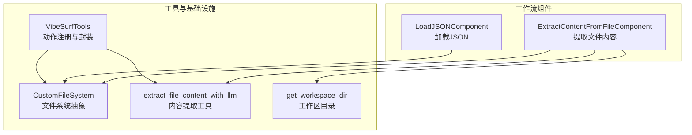
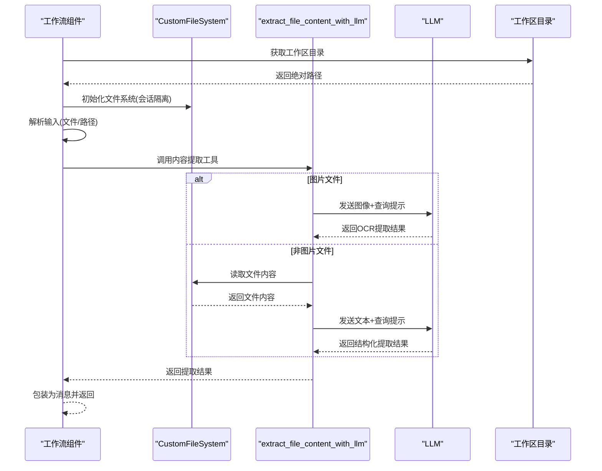
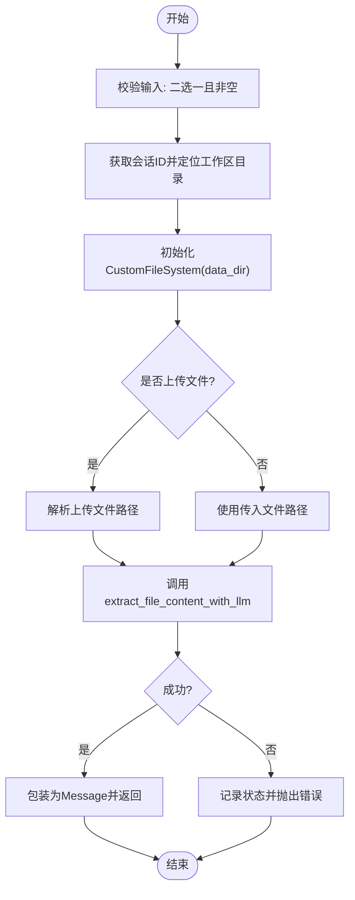
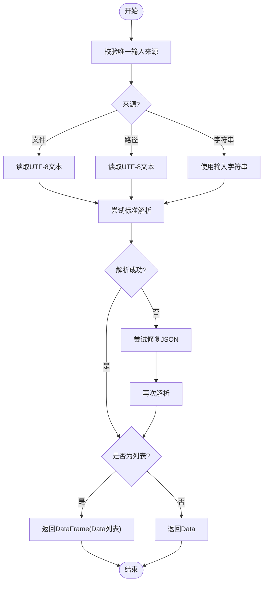
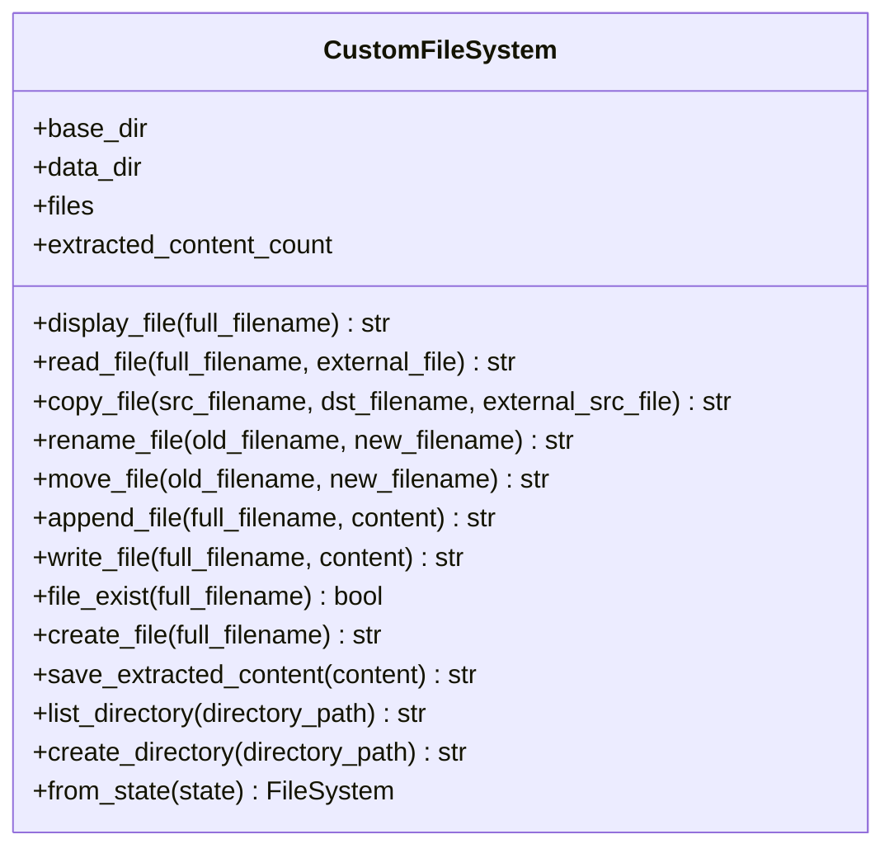
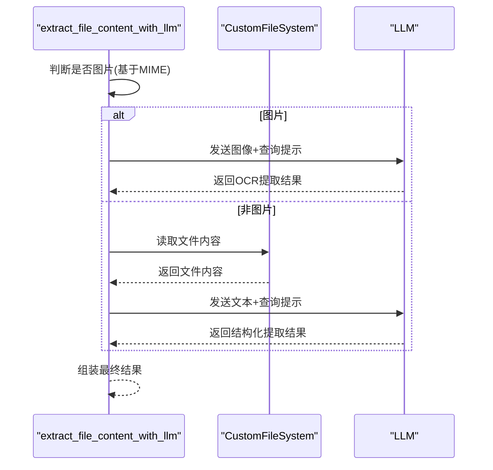
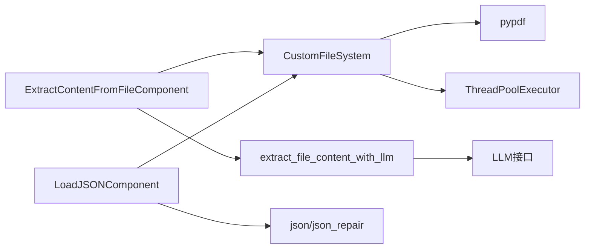

# 文件系统工作流

<cite>
**本文引用的文件**
- [extract_content_from_file.py](file://vibe_surf/workflows/FileSystem/extract_content_from_file.py)
- [load_json.py](file://vibe_surf/workflows/FileSystem/load_json.py)
- [file_system.py](file://vibe_surf/tools/file_system.py)
- [utils.py](file://vibe_surf/tools/utils.py)
- [common.py](file://vibe_surf/common.py)
- [vibesurf_tools.py](file://vibe_surf/tools/vibesurf_tools.py)
- [test_tools.py](file://tests/test_tools.py)
</cite>

## 目录
1. [简介](#简介)
2. [项目结构](#项目结构)
3. [核心组件](#核心组件)
4. [架构总览](#架构总览)
5. [详细组件分析](#详细组件分析)
6. [依赖关系分析](#依赖关系分析)
7. [性能考虑](#性能考虑)
8. [故障排查指南](#故障排查指南)
9. [结论](#结论)
10. [附录](#附录)

## 简介
本文件系统工作流文档聚焦于 FileSystem 目录下的文件操作工作流，重点解析以下能力：
- 文件内容提取：支持文本、图片（OCR）、PDF 等多格式内容抽取，并通过 LLM 进行结构化输出。
- JSON 数据加载与转换：从文件或字符串加载 JSON，自动修复常见问题，输出 Data 或 DataFrame。
- 文件格式转换与内存数据结构映射：将文件内容转换为统一的数据结构，便于后续处理与存储。
- 路径管理与安全控制：基于工作区目录的工作流会话隔离，限制外部路径访问，确保安全性。
- 编码处理与错误恢复：统一 UTF-8 编码读取、异常捕获与错误提示，提升稳定性。
- 性能优化建议：异步 I/O、线程池复制、分页读取 PDF、长文本落盘等策略。

## 项目结构
FileSystem 工作流由两部分组成：
- 工作流组件：负责接收输入、调用工具函数、返回结果。
- 工具与基础设施：负责文件系统抽象、内容读取、LLM 集成、JSON 解析与修复。

图表来源
- [extract_content_from_file.py](file://vibe_surf/workflows/FileSystem/extract_content_from_file.py#L1-L112)
- [load_json.py](file://vibe_surf/workflows/FileSystem/load_json.py#L1-L137)
- [file_system.py](file://vibe_surf/tools/file_system.py#L1-L438)
- [utils.py](file://vibe_surf/tools/utils.py#L1596-L1683)
- [common.py](file://vibe_surf/common.py#L1-L36)
- [vibesurf_tools.py](file://vibe_surf/tools/vibesurf_tools.py#L1795-L1977)

章节来源
- [extract_content_from_file.py](file://vibe_surf/workflows/FileSystem/extract_content_from_file.py#L1-L112)
- [load_json.py](file://vibe_surf/workflows/FileSystem/load_json.py#L1-L137)
- [file_system.py](file://vibe_surf/tools/file_system.py#L1-L438)
- [utils.py](file://vibe_surf/tools/utils.py#L1596-L1683)
- [common.py](file://vibe_surf/common.py#L1-L36)
- [vibesurf_tools.py](file://vibe_surf/tools/vibesurf_tools.py#L1795-L1977)

## 核心组件
- 提取文件内容组件（ExtractContentFromFileComponent）
  - 输入：语言模型、查询指令、上传文件或文件路径。
  - 输出：提取后的消息内容。
  - 关键流程：确定会话工作区目录，初始化自定义文件系统，解析输入，调用内容提取工具，返回消息对象。
- 加载 JSON 组件（LoadJSONComponent）
  - 输入：JSON 文件、文件路径或 JSON 字符串；是否输出为 DataFrame。
  - 输出：Data 或 DataFrame。
  - 关键流程：校验唯一输入来源，读取文本，尝试解析，失败时修复后解析，按列表与否返回 Data 或 DataFrame。
- 自定义文件系统（CustomFileSystem）
  - 支持多种文件类型读写、复制、移动、重命名、列出目录、创建目录、保存提取内容等。
  - 安全性：限制路径在 data_dir 内，禁止越权访问。
- 内容提取工具（extract_file_content_with_llm）
  - 图片：通过 LLM 视觉能力进行 OCR 文本提取。
  - 非图片：读取文件内容，构造提示词，调用 LLM 返回结构化提取结果。
- 工作区目录（get_workspace_dir）
  - 基于环境变量或平台默认值生成工作区绝对路径，确保存在。

章节来源
- [extract_content_from_file.py](file://vibe_surf/workflows/FileSystem/extract_content_from_file.py#L1-L112)
- [load_json.py](file://vibe_surf/workflows/FileSystem/load_json.py#L1-L137)
- [file_system.py](file://vibe_surf/tools/file_system.py#L1-L438)
- [utils.py](file://vibe_surf/tools/utils.py#L1596-L1683)
- [common.py](file://vibe_surf/common.py#L1-L36)

## 架构总览
下图展示了从工作流到工具链的整体交互：

图表来源
- [extract_content_from_file.py](file://vibe_surf/workflows/FileSystem/extract_content_from_file.py#L59-L107)
- [file_system.py](file://vibe_surf/tools/file_system.py#L89-L125)
- [utils.py](file://vibe_surf/tools/utils.py#L1596-L1683)
- [common.py](file://vibe_surf/common.py#L13-L35)

## 详细组件分析

### 组件A：提取文件内容（ExtractContentFromFileComponent）
- 输入验证与选择
  - 必须提供文件上传或文件路径之一，二者不可同时出现。
  - 会话 ID 来源于图执行上下文或内部字段，用于构建工作区子目录。
- 工作区与文件系统
  - 使用工作区根目录下的 workflows/会话ID 子目录作为数据根，避免跨会话污染。
  - 初始化 CustomFileSystem，仅在 data_dir 下进行读写与操作。
- 文件路径解析
  - 若为上传文件，先解析为真实路径；否则直接使用传入的文件路径。
- 内容提取
  - 调用 extract_file_content_with_llm，根据文件类型决定走 LLM 视觉（图片）或文本读取（非图片）。
- 错误处理
  - 捕获异常并设置状态，抛出可读错误信息。

图表来源
- [extract_content_from_file.py](file://vibe_surf/workflows/FileSystem/extract_content_from_file.py#L59-L107)
- [file_system.py](file://vibe_surf/tools/file_system.py#L38-L67)
- [utils.py](file://vibe_surf/tools/utils.py#L1596-L1683)

章节来源
- [extract_content_from_file.py](file://vibe_surf/workflows/FileSystem/extract_content_from_file.py#L1-L112)
- [file_system.py](file://vibe_surf/tools/file_system.py#L1-L438)
- [utils.py](file://vibe_surf/tools/utils.py#L1596-L1683)
- [common.py](file://vibe_surf/common.py#L13-L35)

### 组件B：加载 JSON（LoadJSONComponent）
- 输入约束
  - 三选一：JSON 文件、文件路径、JSON 字符串。
- 文件读取与类型检查
  - 若来自文件或路径，必须为 .json 扩展名。
  - 统一以 UTF-8 读取文本。
- 解析与修复
  - 先尝试标准解析；失败则使用修复库尝试修复后再解析。
- 结果输出
  - 列表：返回 DataFrame(Data 列表)；非列表：返回 Data。
  - 支持运行时切换输出类型（前端节点动态更新）。

图表来源
- [load_json.py](file://vibe_surf/workflows/FileSystem/load_json.py#L81-L137)

章节来源
- [load_json.py](file://vibe_surf/workflows/FileSystem/load_json.py#L1-L137)

### 组件C：自定义文件系统（CustomFileSystem）
- 文件类型支持
  - 文本、Markdown、JSON、CSV、PDF、Python、HTML、JS 等。
- 读取策略
  - 非 PDF：直接 UTF-8 读取；PDF：最多读取前若干页文本。
- 复制/移动/重命名
  - 使用线程池执行 shutil 操作，避免阻塞事件循环。
- 目录与安全
  - 严格限制在 data_dir 内，路径解析后校验是否位于 data_dir 下。
- 提取内容持久化
  - 将长文本保存为编号的 Markdown 文件，便于后续检索与复用。

图表来源
- [file_system.py](file://vibe_surf/tools/file_system.py#L38-L438)

章节来源
- [file_system.py](file://vibe_surf/tools/file_system.py#L1-L438)

### 组件D：内容提取工具（extract_file_content_with_llm）
- 图片（OCR）
  - 读取二进制数据并 base64 编码，构造 LLM 视觉消息，调用 LLM 返回提取文本。
- 非图片（文本）
  - 通过文件系统读取内容，构造提示词，调用 LLM 返回结构化结果。
- 超时与异常
  - 统一超时控制与异常捕获，保证流程稳定。

图表来源
- [utils.py](file://vibe_surf/tools/utils.py#L1596-L1683)
- [file_system.py](file://vibe_surf/tools/file_system.py#L89-L125)

章节来源
- [utils.py](file://vibe_surf/tools/utils.py#L1596-L1683)
- [file_system.py](file://vibe_surf/tools/file_system.py#L89-L125)

### 组件E：工作区目录与会话隔离
- 工作区目录
  - 优先使用环境变量，否则根据操作系统平台生成默认路径。
  - 绝对化并确保目录存在。
- 会话隔离
  - 在工作区下创建 workflows/会话ID 子目录，作为每个工作流的独立数据根，避免冲突。

章节来源
- [common.py](file://vibe_surf/common.py#L13-L35)
- [extract_content_from_file.py](file://vibe_surf/workflows/FileSystem/extract_content_from_file.py#L77-L86)

### 组件F：动作封装与扩展（VibeSurfTools）
- 提供常用文件系统动作：复制、重命名、移动、存在性检查、目录列举、内容搜索等。
- 与 CustomFileSystem 协同，支持外部文件与内部文件两种来源。
- 对长文本提取内容进行落盘保存，减少 LLM 上下文占用。

章节来源
- [vibesurf_tools.py](file://vibe_surf/tools/vibesurf_tools.py#L1795-L1977)
- [vibesurf_tools.py](file://vibe_surf/tools/vibesurf_tools.py#L1864-L1952)

## 依赖关系分析
- 组件耦合
  - ExtractContentFromFileComponent 依赖 CustomFileSystem 与 extract_file_content_with_llm。
  - LoadJSONComponent 依赖文件系统读取与 JSON 解析/修复。
  - CustomFileSystem 依赖浏览器用库的文件系统抽象与本地文件系统。
  - utils 中的内容提取工具与 LLM 交互，不直接依赖具体 LLM 实现。
- 外部依赖
  - JSON 修复库（用于修复 JSON 字符串）。
  - PDF 解析库（pypdf）。
  - 线程池（concurrent.futures）用于复制/移动等阻塞操作。
- 可能的循环依赖
  - 当前模块间无明显循环导入；工作流组件与工具模块职责清晰分离。

图表来源
- [extract_content_from_file.py](file://vibe_surf/workflows/FileSystem/extract_content_from_file.py#L1-L112)
- [load_json.py](file://vibe_surf/workflows/FileSystem/load_json.py#L1-L137)
- [file_system.py](file://vibe_surf/tools/file_system.py#L1-L438)
- [utils.py](file://vibe_surf/tools/utils.py#L1596-L1683)

章节来源
- [extract_content_from_file.py](file://vibe_surf/workflows/FileSystem/extract_content_from_file.py#L1-L112)
- [load_json.py](file://vibe_surf/workflows/FileSystem/load_json.py#L1-L137)
- [file_system.py](file://vibe_surf/tools/file_system.py#L1-L438)
- [utils.py](file://vibe_surf/tools/utils.py#L1596-L1683)

## 性能考虑
- 异步 I/O 与线程池
  - 文件复制/移动使用线程池执行，避免阻塞事件循环，适合大批量文件操作。
- 分页读取 PDF
  - 默认限制最大页数，防止大文档导致内存与上下文溢出。
- 长文本落盘
  - 对较长提取结果自动保存为 Markdown 文件，减少 LLM 上下文压力。
- 编码一致性
  - 统一 UTF-8 读取，避免编码问题导致的重复解码与转换开销。
- 超时控制
  - LLM 调用设置超时，防止长时间等待影响整体吞吐。

[本节为通用性能建议，无需特定文件来源]

## 故障排查指南
- 输入参数错误
  - 文件与路径同时提供或均未提供：请确保仅提供一种来源。
  - JSON 文件扩展名不符：请确认为 .json 文件。
- 文件不存在或权限不足
  - 检查路径是否在 data_dir 内；确认文件存在与读权限。
  - 复制/移动/重命名目标已存在：请修改目标名称或删除已有文件。
- JSON 解析失败
  - 使用修复库尝试修复；若仍失败，请检查 JSON 语法或格式。
- LLM 调用超时
  - 减少上下文长度或拆分任务；检查网络与模型服务可用性。
- 工作区路径异常
  - 确认环境变量 VIBESURF_WORKSPACE 设置正确；确保目录可写。

章节来源
- [extract_content_from_file.py](file://vibe_surf/workflows/FileSystem/extract_content_from_file.py#L63-L76)
- [load_json.py](file://vibe_surf/workflows/FileSystem/load_json.py#L81-L137)
- [file_system.py](file://vibe_surf/tools/file_system.py#L126-L165)
- [file_system.py](file://vibe_surf/tools/file_system.py#L199-L235)
- [file_system.py](file://vibe_surf/tools/file_system.py#L236-L304)
- [file_system.py](file://vibe_surf/tools/file_system.py#L314-L365)
- [file_system.py](file://vibe_surf/tools/file_system.py#L366-L399)
- [utils.py](file://vibe_surf/tools/utils.py#L1596-L1683)

## 结论
该文件系统工作流通过“工作流组件 + 工具 + 文件系统”的分层设计，实现了：
- 多格式文件内容提取与结构化输出；
- JSON 数据的稳健加载与转换；
- 会话级工作区隔离与安全路径控制；
- 面向生产的错误处理与性能优化策略。
适用于文档内容分析、数据导入导出、批量文件处理等多种场景。

[本节为总结性内容，无需特定文件来源]

## 附录

### 使用场景示例
- 文档内容分析
  - 上传 PDF/Markdown/TXT，指定查询语句，提取关键信息并返回结构化结果。
  - 参考路径：[extract_content_from_file.py](file://vibe_surf/workflows/FileSystem/extract_content_from_file.py#L59-L107)
- 数据导入导出
  - 从 JSON 文件或字符串加载数据，自动修复并输出 Data 或 DataFrame。
  - 参考路径：[load_json.py](file://vibe_surf/workflows/FileSystem/load_json.py#L81-L137)
- 文件批量处理
  - 使用 VibeSurfTools 的复制/移动/重命名动作，结合线程池实现高效批量操作。
  - 参考路径：[vibesurf_tools.py](file://vibe_surf/tools/vibesurf_tools.py#L1864-L1952)

### 路径管理与安全
- 工作区目录优先使用环境变量，否则按平台默认生成。
- 会话隔离：每个工作流在 workflows/会话ID 下建立独立 data_dir。
- 路径安全：所有操作限制在 data_dir 内，拒绝越权访问。

章节来源
- [common.py](file://vibe_surf/common.py#L13-L35)
- [extract_content_from_file.py](file://vibe_surf/workflows/FileSystem/extract_content_from_file.py#L77-L86)
- [file_system.py](file://vibe_surf/tools/file_system.py#L314-L365)

### 编码处理与错误恢复
- 统一 UTF-8 读取，避免编码差异导致的解析失败。
- JSON 解析失败时自动尝试修复，提升鲁棒性。
- LLM 调用设置超时，异常捕获并返回可读错误信息。

章节来源
- [load_json.py](file://vibe_surf/workflows/FileSystem/load_json.py#L90-L116)
- [utils.py](file://vibe_surf/tools/utils.py#L1596-L1683)

### 测试参考
- 文件系统基础操作测试示例，展示创建文件、获取绝对路径等。
- 参考路径：[test_tools.py](file://tests/test_tools.py#L94-L103)