# 浏览器工作流

<cite>
**本文档引用的文件**   
- [browser_navigate.py](file://vibe_surf/workflows/Browser/browser_navigate.py)
- [browser_click_element.py](file://vibe_surf/workflows/Browser/browser_click_element.py)
- [browser_input_text.py](file://vibe_surf/workflows/Browser/browser_input_text.py)
- [browser_extract_content.py](file://vibe_surf/workflows/Browser/browser_extract_content.py)
- [browser_take_screenshot.py](file://vibe_surf/workflows/Browser/browser_take_screenshot.py)
- [agent_browser_session.py](file://vibe_surf/browser/agent_browser_session.py)
- [find_page_element.py](file://vibe_surf/browser/find_page_element.py)
- [page_operations.py](file://vibe_surf/browser/page_operations.py)
- [utils.py](file://vibe_surf/browser/utils.py)
- [action_watchdog.py](file://vibe_surf/browser/watchdogs/action_watchdog.py)
- [dom_watchdog.py](file://vibe_surf/browser/watchdogs/dom_watchdog.py)
- [browser_session.py](file://vibe_surf/workflows/Browser/browser_session.py)
- [browser_wait.py](file://vibe_surf/workflows/Browser/browser_wait.py)
- [browser_scroll.py](file://vibe_surf/workflows/Browser/browser_scroll.py)
- [browser_hover_element.py](file://vibe_surf/workflows/Browser/browser_hover_element.py)
</cite>

## 目录
1. [简介](#简介)
2. [核心操作工作流](#核心操作工作流)
3. [浏览器会话管理](#浏览器会话管理)
4. [元素定位与提取](#元素定位与提取)
5. [自动化工作流集成](#自动化工作流集成)
6. [错误处理与性能优化](#错误处理与性能优化)
7. [使用场景示例](#使用场景示例)
8. [配置参数说明](#配置参数说明)
9. [结论](#结论)

## 简介
浏览器工作流文档详细说明了Browser目录中各类浏览器操作工作流的实现细节。这些工作流构成了一个强大的自动化框架，能够执行页面导航、元素点击、内容提取、文本输入和截图等核心操作。系统通过与浏览器自动化引擎的深度集成，能够有效处理动态页面和异步加载内容，为自动化表单填写、网页数据抓取和用户行为模拟等场景提供了坚实的基础。

**Section sources**
- [browser_navigate.py](file://vibe_surf/workflows/Browser/browser_navigate.py#L1-L51)
- [browser_click_element.py](file://vibe_surf/workflows/Browser/browser_click_element.py#L1-L196)

## 核心操作工作流

### 页面导航
页面导航工作流通过`BrowserNavigateComponent`类实现，其主要功能是导航到指定的URL。该组件接收一个`AgentBrowserSession`对象和一个目标URL作为输入，然后调用会话的`navigate_to_url`方法执行导航操作。在导航完成后，系统会等待2秒以确保页面完全加载。

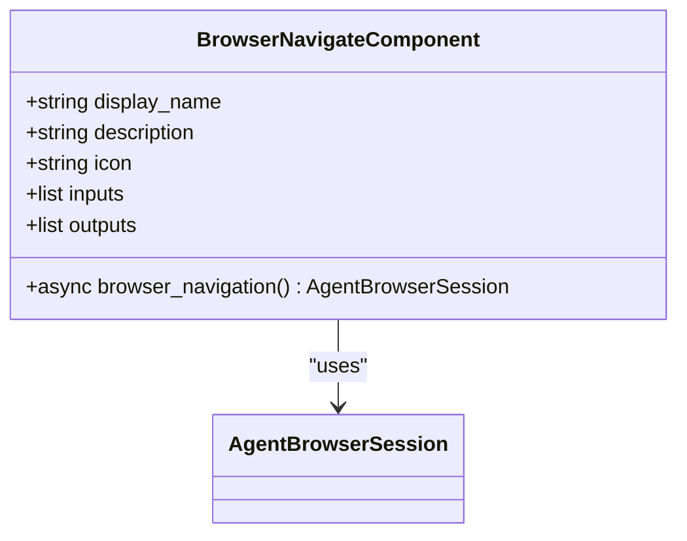

**Diagram sources **
- [browser_navigate.py](file://vibe_surf/workflows/Browser/browser_navigate.py#L11-L51)

**Section sources**
- [browser_navigate.py](file://vibe_surf/workflows/Browser/browser_navigate.py#L11-L51)

### 元素点击
元素点击工作流通过`BrowserClickElementComponent`类实现，支持多种元素定位方式。该组件首先尝试使用语义提取器（SemanticExtractor）根据元素文本和上下文提示来定位元素，然后尝试使用CSS选择器、后端节点ID或LLM模型提示进行定位。一旦找到目标元素，就会执行点击操作，并能处理新标签页的打开。

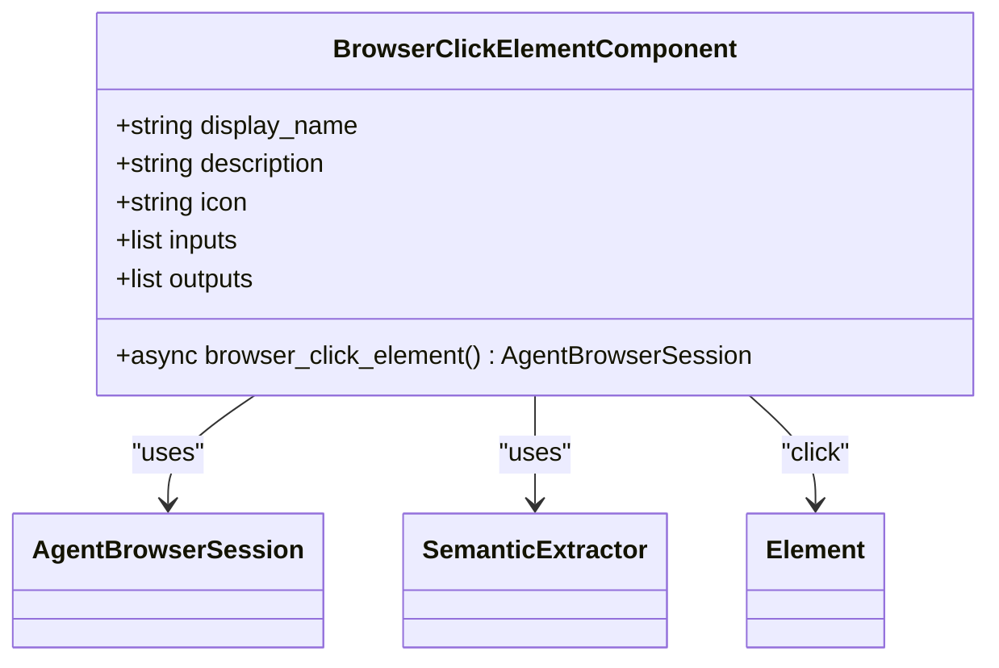

**Diagram sources **
- [browser_click_element.py](file://vibe_surf/workflows/Browser/browser_click_element.py#L16-L196)

**Section sources**
- [browser_click_element.py](file://vibe_surf/workflows/Browser/browser_click_element.py#L16-L196)

### 文本输入
文本输入工作流通过`BrowserInputTextComponent`类实现，其功能是向指定的页面元素输入文本。该组件支持在输入前清空元素内容，并使用与元素点击工作流相同的多级定位策略来查找目标元素。定位成功后，调用元素的`fill`方法将指定文本填入。

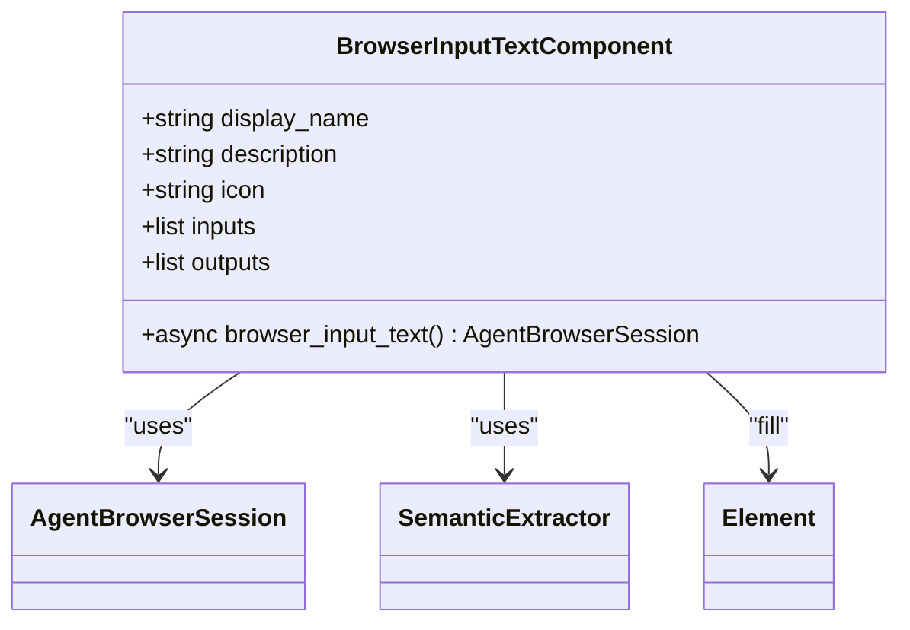

**Diagram sources **
- [browser_input_text.py](file://vibe_surf/workflows/Browser/browser_input_text.py#L13-L170)

**Section sources**
- [browser_input_text.py](file://vibe_surf/workflows/Browser/browser_input_text.py#L13-L170)

### 内容提取
内容提取工作流通过`BrowserExtractContentComponent`类实现，支持结构化和非结构化的内容提取。对于结构化提取，该组件会利用LLM模型根据预定义的模式（schema）从网页中提取并格式化数据。对于非结构化提取，则直接获取与目标相关的文本内容。

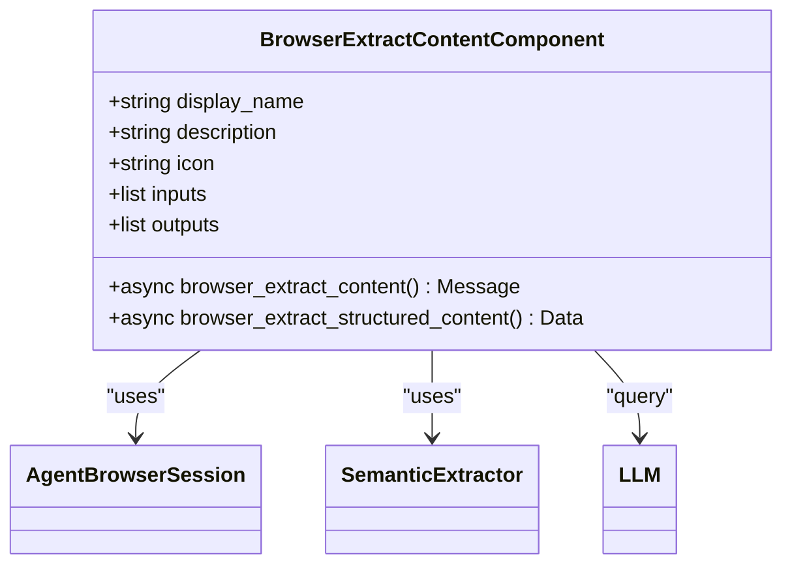

**Diagram sources **
- [browser_extract_content.py](file://vibe_surf/workflows/Browser/browser_extract_content.py#L21-L198)

**Section sources**
- [browser_extract_content.py](file://vibe_surf/workflows/Browser/browser_extract_content.py#L21-L198)

### 截图
截图工作流通过`BrowserTakeScreenshotComponent`类实现，能够捕获当前页面的截图并支持区域裁剪。该组件允许用户通过滑块输入定义裁剪区域的坐标（0-1范围），然后将截图保存到指定的工作流目录中，并返回截图文件的路径。

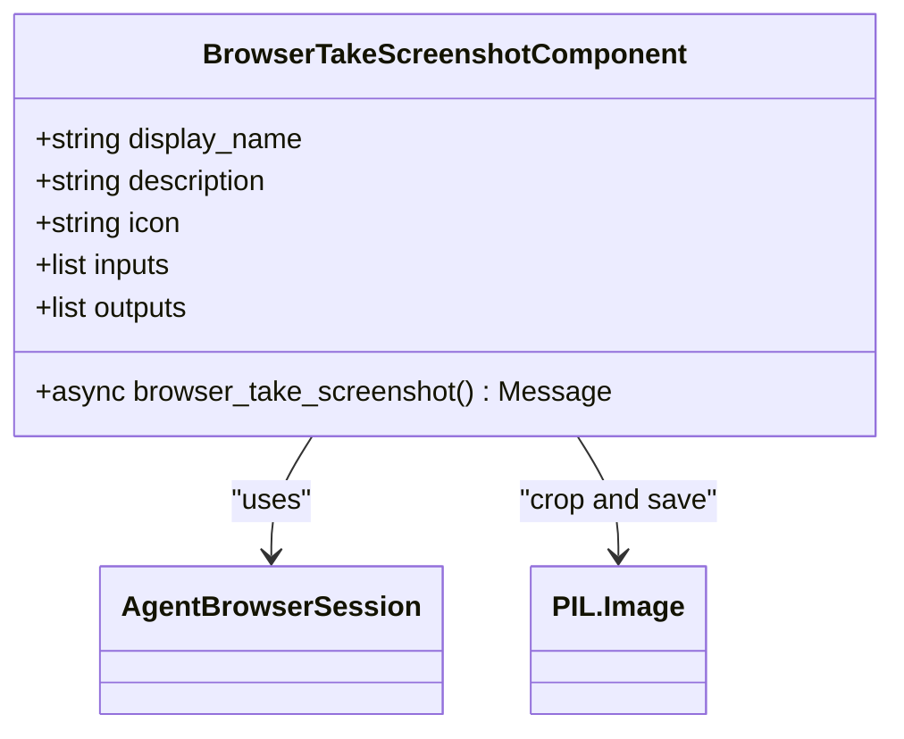

**Diagram sources **
- [browser_take_screenshot.py](file://vibe_surf/workflows/Browser/browser_take_screenshot.py#L15-L128)

**Section sources**
- [browser_take_screenshot.py](file://vibe_surf/workflows/Browser/browser_take_screenshot.py#L15-L128)

## 浏览器会话管理

### 会话创建与连接
浏览器会话由`AgentBrowserSession`类管理，该类继承自`BrowserSession`，并扩展了针对特定代理的配置。会话的创建可以通过`BrowserSessionComponent`工作流完成，该工作流允许用户选择使用主会话或注册一个新的代理会话。`connect`方法负责建立与Chromium浏览器的CDP（Chrome DevTools Protocol）连接。

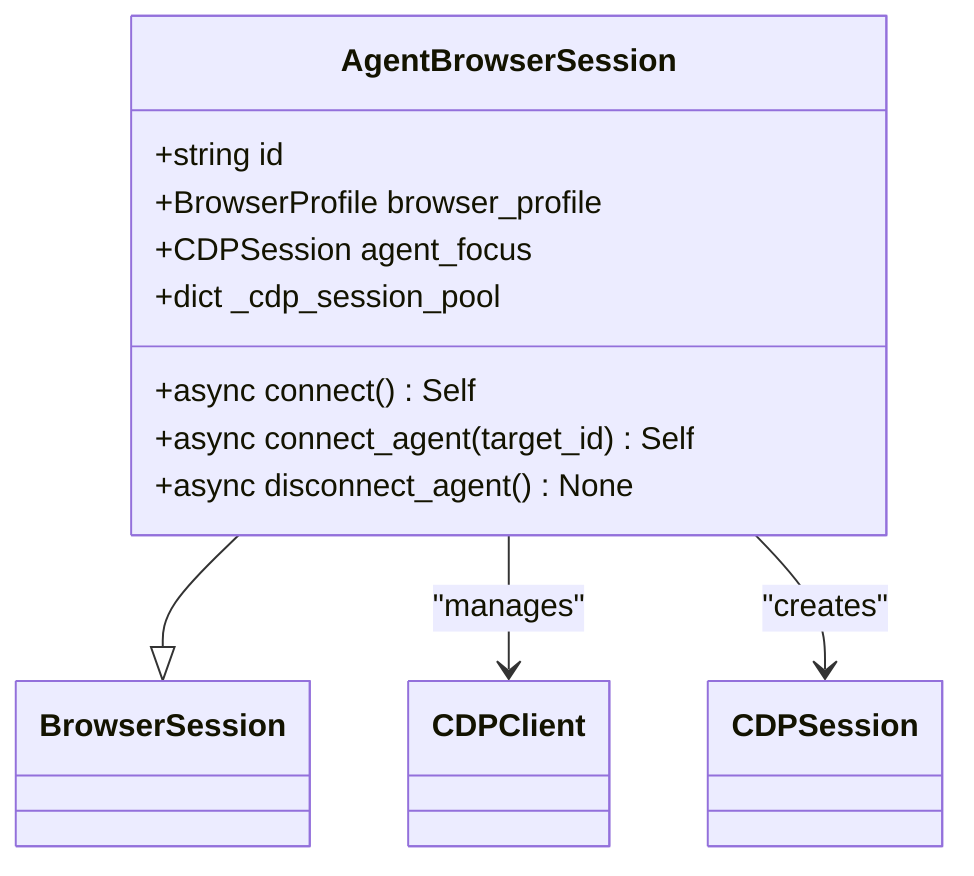

**Diagram sources **
- [agent_browser_session.py](file://vibe_surf/browser/agent_browser_session.py#L51-L694)
- [browser_session.py](file://vibe_surf/workflows/Browser/browser_session.py#L11-L55)

**Section sources**
- [agent_browser_session.py](file://vibe_surf/browser/agent_browser_session.py#L51-L694)
- [browser_session.py](file://vibe_surf/workflows/Browser/browser_session.py#L11-L55)

### 网络稳定性等待
为了处理动态加载的内容，系统提供了`browser_wait`工作流和`_wait_for_stable_network`方法。`browser_wait`工作流允许用户指定一个固定的等待时间（以秒为单位），而`_wait_for_stable_network`则通过监控网络活动来判断页面是否已稳定，确保在页面完全加载后再执行后续操作。

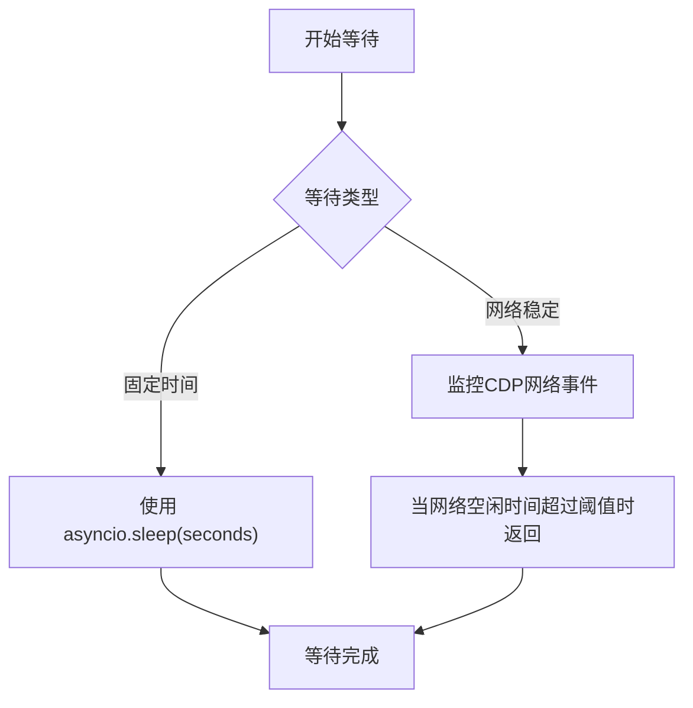

**Diagram sources **
- [browser_wait.py](file://vibe_surf/workflows/Browser/browser_wait.py#L13-L47)
- [agent_browser_session.py](file://vibe_surf/browser/agent_browser_session.py#L60-L65)

**Section sources**
- [browser_wait.py](file://vibe_surf/workflows/Browser/browser_wait.py#L13-L47)
- [agent_browser_session.py](file://vibe_surf/browser/agent_browser_session.py#L60-L65)

## 元素定位与提取

### 语义元素提取器
`SemanticExtractor`类是元素定位的核心，它通过执行JavaScript代码从页面中提取所有交互式元素的语义映射。该映射包含了元素的文本、CSS选择器、层次化选择器、XPath等信息，并通过`find_element_by_hierarchy`方法根据目标文本和上下文提示来查找最匹配的元素。

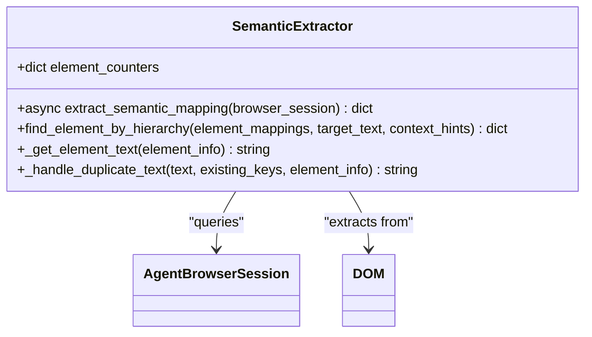

**Diagram sources **
- [find_page_element.py](file://vibe_surf/browser/find_page_element.py#L18-L800)

**Section sources**
- [find_page_element.py](file://vibe_surf/browser/find_page_element.py#L18-L800)

### 元素定位策略
系统采用多级回退的元素定位策略。首先尝试将目标文本作为直接选择器（如ID或name属性）进行查找。如果失败，则使用语义提取器找到的层次化选择器。作为最终回退，系统会尝试使用基本选择器、层次化选择器和XPath选择器。

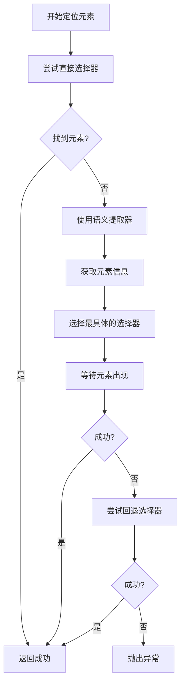

**Diagram sources **
- [page_operations.py](file://vibe_surf/browser/page_operations.py#L100-L223)
- [browser_click_element.py](file://vibe_surf/workflows/Browser/browser_click_element.py#L101-L153)

**Section sources**
- [page_operations.py](file://vibe_surf/browser/page_operations.py#L100-L223)
- [browser_click_element.py](file://vibe_surf/workflows/Browser/browser_click_element.py#L101-L153)

### 页面滚动
`scroll_to_text`函数实现了通过文本内容滚动到指定位置的功能。它首先使用CDP的DOM.search方法查找包含目标文本的节点，然后调用`DOM.scrollIntoViewIfNeeded`将该节点滚动到视图中。如果CDP方法失败，则会回退到执行JavaScript代码来实现滚动。

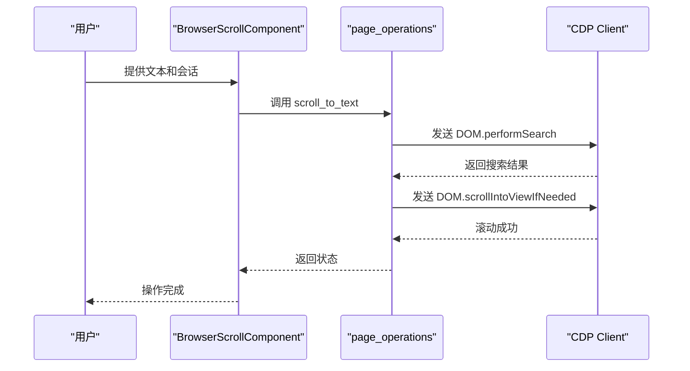

**Diagram sources **
- [browser_scroll.py](file://vibe_surf/workflows/Browser/browser_scroll.py#L67-L100)
- [page_operations.py](file://vibe_surf/browser/page_operations.py#L9-L97)

**Section sources**
- [browser_scroll.py](file://vibe_surf/workflows/Browser/browser_scroll.py#L67-L100)
- [page_operations.py](file://vibe_surf/browser/page_operations.py#L9-L97)

## 自动化工作流集成

### 工作流组件架构
所有浏览器工作流都继承自`Component`基类，并遵循一致的架构模式。每个组件定义了`inputs`（输入）、`outputs`（输出）和一个或多个`method`（方法）。输入通常包括`AgentBrowserSession`和操作参数，输出则返回更新后的会话或操作结果。

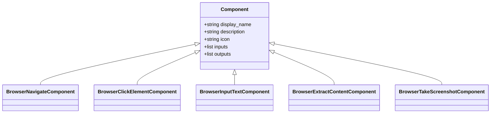

**Diagram sources **
- [browser_navigate.py](file://vibe_surf/workflows/Browser/browser_navigate.py#L11-L51)
- [browser_click_element.py](file://vibe_surf/workflows/Browser/browser_click_element.py#L16-L196)
- [browser_input_text.py](file://vibe_surf/workflows/Browser/browser_input_text.py#L13-L170)
- [browser_extract_content.py](file://vibe_surf/workflows/Browser/browser_extract_content.py#L21-L198)
- [browser_take_screenshot.py](file://vibe_surf/workflows/Browser/browser_take_screenshot.py#L15-L128)

**Section sources**
- [browser_navigate.py](file://vibe_surf/workflows/Browser/browser_navigate.py#L11-L51)
- [browser_click_element.py](file://vibe_surf/workflows/Browser/browser_click_element.py#L16-L196)
- [browser_input_text.py](file://vibe_surf/workflows/Browser/browser_input_text.py#L13-L170)
- [browser_extract_content.py](file://vibe_surf/workflows/Browser/browser_extract_content.py#L21-L198)
- [browser_take_screenshot.py](file://vibe_surf/workflows/Browser/browser_take_screenshot.py#L15-L128)

### 事件驱动的看门狗
系统的自动化行为由事件驱动的“看门狗”（Watchdog）机制控制。`CustomActionWatchdog`监听如`ClickElementEvent`等事件，并执行相应的CDP命令。`CustomDOMWatchdog`负责管理DOM树的构建和截图的捕获，确保在每次状态请求时都能提供最新的页面信息。

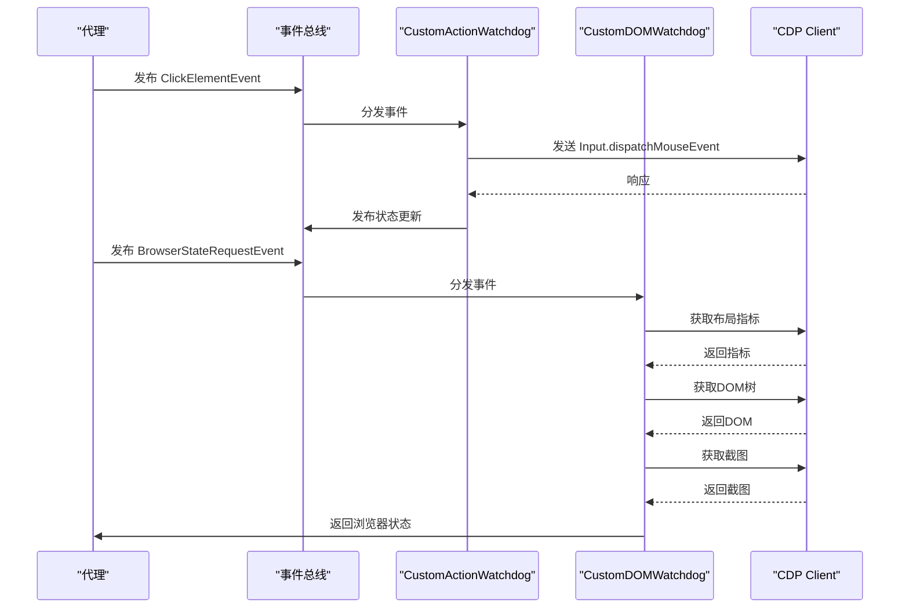

**Diagram sources **
- [action_watchdog.py](file://vibe_surf/browser/watchdogs/action_watchdog.py#L24-L109)
- [dom_watchdog.py](file://vibe_surf/browser/watchdogs/dom_watchdog.py#L26-L250)

**Section sources**
- [action_watchdog.py](file://vibe_surf/browser/watchdogs/action_watchdog.py#L24-L109)
- [dom_watchdog.py](file://vibe_surf/browser/watchdogs/dom_watchdog.py#L26-L250)

## 错误处理与性能优化

### 错误处理策略
系统在每个工作流的`try-except-finally`块中实现了统一的错误处理。当发生异常时，会打印完整的堆栈跟踪并重新抛出异常。对于特定的错误，如元素未找到，会抛出`ValueError`。`CustomActionWatchdog`还实现了对会话损坏和URL访问限制等特定浏览器错误的处理。

**Section sources**
- [browser_click_element.py](file://vibe_surf/workflows/Browser/browser_click_element.py#L90-L196)
- [action_watchdog.py](file://vibe_surf/browser/watchdogs/action_watchdog.py#L24-L109)

### 性能优化建议
1. **优先使用直接选择器**：如果已知元素的ID或name，应优先使用`css_selector`输入，这比语义搜索更快。
2. **合理使用等待**：避免不必要的固定时间等待，优先使用`_wait_for_stable_network`来等待页面稳定。
3. **减少DOM提取**：DOM提取是一个昂贵的操作，应仅在必要时请求完整的浏览器状态。
4. **复用会话**：对于连续的操作，应复用同一个`AgentBrowserSession`，避免频繁创建和销毁会话。

**Section sources**
- [page_operations.py](file://vibe_surf/browser/page_operations.py#L100-L172)
- [agent_browser_session.py](file://vibe_surf/browser/agent_browser_session.py#L59-L65)

## 使用场景示例

### 自动化表单填写
自动化表单填写工作流可以按顺序执行：导航到表单页面 -> 等待页面稳定 -> 为每个输入字段输入文本 -> 点击提交按钮。此过程可以完全自动化，无需人工干预。

### 网页数据抓取
网页数据抓取工作流可以：导航到目标页面 -> 等待内容加载 -> 使用`extract_content`工作流提取结构化数据 -> 将结果保存到文件或数据库。

### 用户行为模拟
用户行为模拟工作流可以精确地模拟真实用户操作，如：滚动页面 -> 悬停在某个元素上 -> 点击一个按钮 -> 等待新标签页打开 -> 切换到新标签页。

**Section sources**
- [browser_navigate.py](file://vibe_surf/workflows/Browser/browser_navigate.py#L41-L51)
- [browser_input_text.py](file://vibe_surf/workflows/Browser/browser_input_text.py#L85-L170)
- [browser_click_element.py](file://vibe_surf/workflows/Browser/browser_click_element.py#L90-L196)
- [browser_wait.py](file://vibe_surf/workflows/Browser/browser_wait.py#L44-L47)

## 配置参数说明
- **Browser Session**: 每个操作都必须关联一个浏览器会话，可以通过`Browser Session`组件创建或获取。
- **URL**: 导航操作的目标网址。
- **Element Text**: 要操作的元素的可见文本。
- **Element Hints**: 用于区分同名元素的上下文提示列表。
- **CSS Selector**: 元素的CSS选择器，优先级最高。
- **Input Text**: 要输入到元素中的文本。
- **Seconds**: `Wait`工作流的等待时间。
- **Structured Output**: 内容提取时是否返回结构化数据。
- **Output Schema**: 定义结构化输出的字段、类型和描述。

**Section sources**
- [browser_navigate.py](file://vibe_surf/workflows/Browser/browser_navigate.py#L24-L29)
- [browser_click_element.py](file://vibe_surf/workflows/Browser/browser_click_element.py#L30-L33)
- [browser_input_text.py](file://vibe_surf/workflows/Browser/browser_input_text.py#L27-L30)
- [browser_wait.py](file://vibe_surf/workflows/Browser/browser_wait.py#L26-L31)
- [browser_extract_content.py](file://vibe_surf/workflows/Browser/browser_extract_content.py#L47-L53)

## 结论
本文档详细阐述了VibeSurf项目中浏览器工作流的实现机制。通过分析`Browser`目录下的核心组件，我们了解了页面导航、元素交互、内容提取和截图等操作是如何通过`AgentBrowserSession`与底层浏览器引擎（通过CDP协议）进行通信来实现的。系统采用语义提取和多级回退的定位策略，结合事件驱动的看门狗机制，能够有效处理现代Web应用的动态特性。这些工作流为构建复杂的自动化任务提供了强大而灵活的基础。