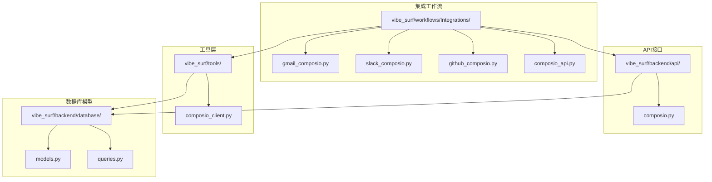
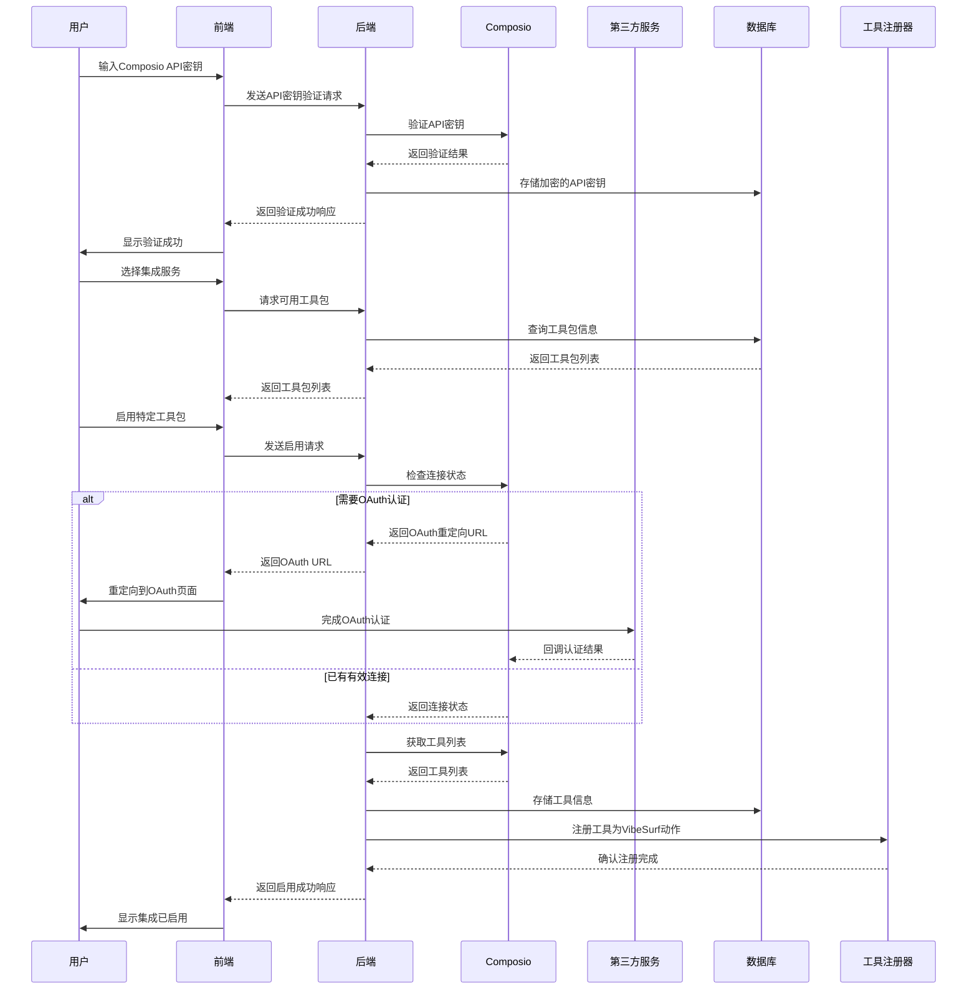
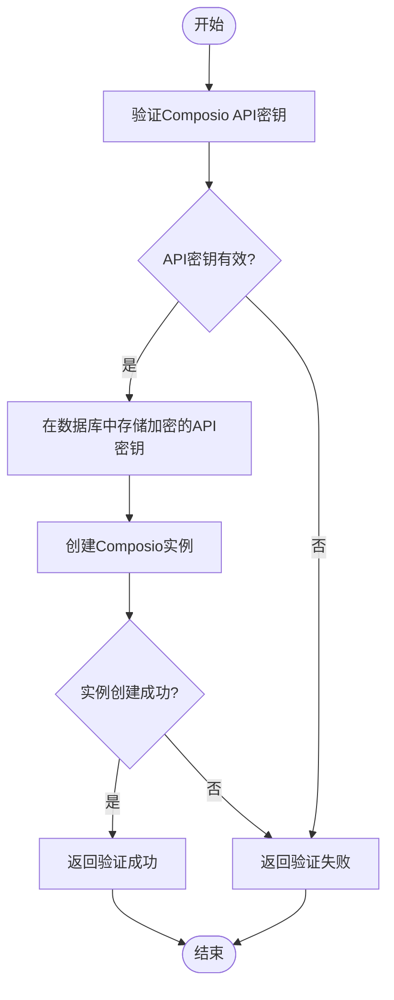
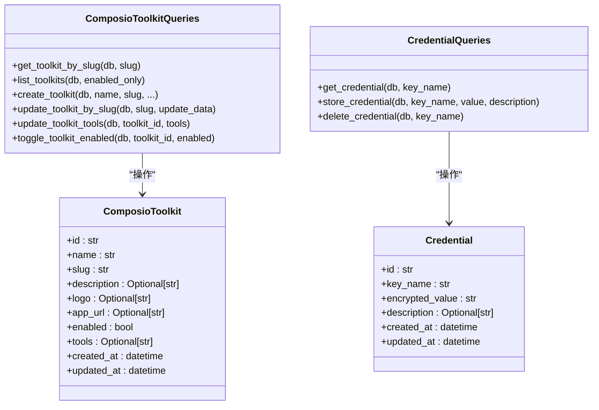
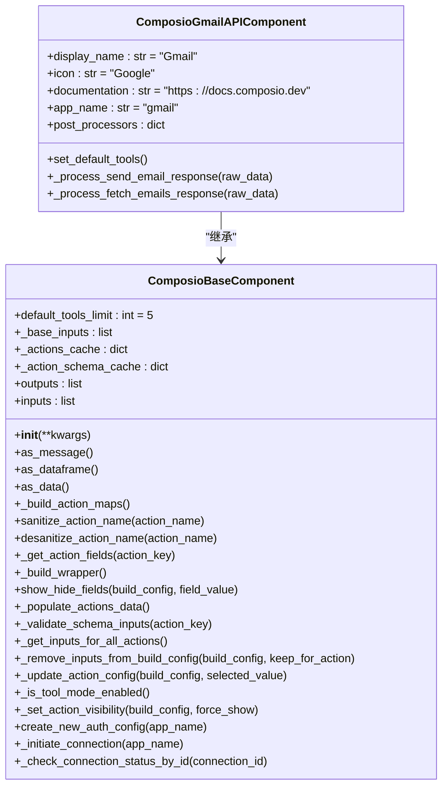
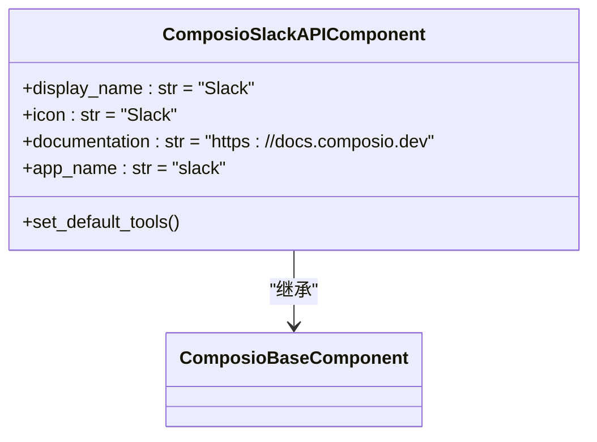
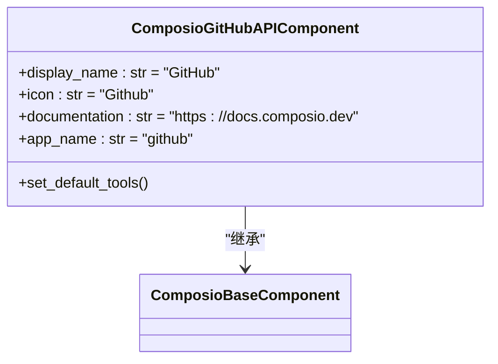
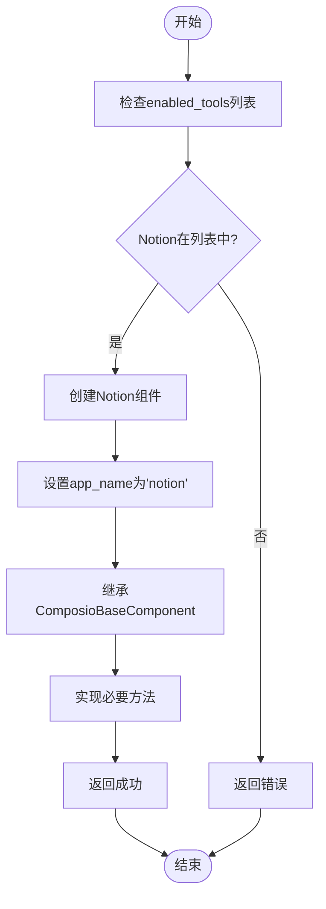
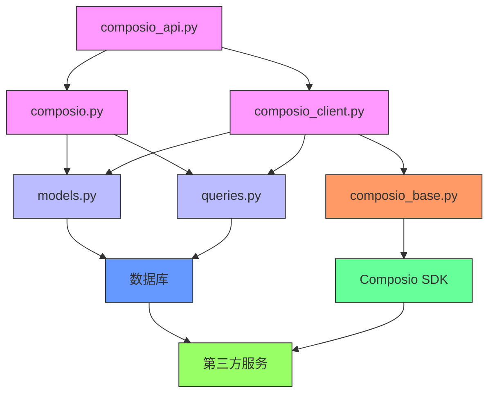

# 集成工作流

<cite>
**本文档引用的文件**   
- [composio.py](file://vibe_surf/backend/api/composio.py)
- [composio_client.py](file://vibe_surf/tools/composio_client.py)
- [composio_api.py](file://vibe_surf/workflows/Integrations/composio_api.py)
- [gmail_composio.py](file://vibe_surf/workflows/Integrations/gmail_composio.py)
- [slack_composio.py](file://vibe_surf/workflows/Integrations/slack_composio.py)
- [github_composio.py](file://vibe_surf/workflows/Integrations/github_composio.py)
- [models.py](file://vibe_surf/backend/database/models.py)
- [queries.py](file://vibe_surf/backend/database/queries.py)
- [v005_add_composio_integration.sql](file://vibe_surf/backend/database/migrations/v005_add_composio_integration.sql)
- [v006_add_credentials_table.sql](file://vibe_surf/backend/database/migrations/v006_add_credentials_table.sql)
- [composio_base.py](file://vibe_surf/langflow/base/composio/composio_base.py)
</cite>

## 目录
1. [简介](#简介)
2. [项目结构](#项目结构)
3. [核心组件](#核心组件)
4. [架构概述](#架构概述)
5. [详细组件分析](#详细组件分析)
6. [依赖分析](#依赖分析)
7. [性能考虑](#性能考虑)
8. [故障排除指南](#故障排除指南)
9. [结论](#结论)

## 简介
本文档详细说明了VibeSurf项目中与第三方服务集成的工作流实现。重点分析了Gmail、Notion、Slack和GitHub等常用服务的集成机制，解释了如何通过Composio API实现安全的第三方服务访问。文档涵盖了认证流程、权限管理、数据同步和错误处理等关键方面，并提供了具体的使用场景示例，如自动邮件处理、笔记同步和团队协作等。此外，还包含配置指南、安全最佳实践和常见问题解决方案，帮助用户理解和使用这些集成工作流。

## 项目结构
项目中的集成工作流主要位于`vibe_surf/workflows/Integrations/`目录下，每个第三方服务都有对应的集成文件。核心的集成管理通过Composio API实现，相关代码分布在多个模块中。

**Diagram sources**
- [composio_api.py](file://vibe_surf/workflows/Integrations/composio_api.py)
- [composio.py](file://vibe_surf/backend/api/composio.py)
- [composio_client.py](file://vibe_surf/tools/composio_client.py)
- [models.py](file://vibe_surf/backend/database/models.py)

**Section sources**
- [composio_api.py](file://vibe_surf/workflows/Integrations/composio_api.py)
- [composio.py](file://vibe_surf/backend/api/composio.py)

## 核心组件
集成工作流的核心组件包括Composio API客户端、工具注册机制和数据库模型。这些组件协同工作，实现了与第三方服务的安全集成。

**Section sources**
- [composio_client.py](file://vibe_surf/tools/composio_client.py)
- [composio_base.py](file://vibe_surf/langflow/base/composio/composio_base.py)
- [models.py](file://vibe_surf/backend/database/models.py)

## 架构概述
集成工作流的架构基于Composio平台，通过API密钥验证、OAuth认证和工具注册等机制，实现了与第三方服务的安全连接和操作。

**Diagram sources**
- [composio.py](file://vibe_surf/backend/api/composio.py)
- [composio_client.py](file://vibe_surf/tools/composio_client.py)
- [models.py](file://vibe_surf/backend/database/models.py)

## 详细组件分析
### Composio API集成
Composio API集成是整个工作流的核心，负责管理与第三方服务的连接和通信。

#### 认证流程

**Diagram sources**
- [composio.py](file://vibe_surf/backend/api/composio.py)

**Section sources**
- [composio.py](file://vibe_surf/backend/api/composio.py#L367-L421)

#### 工具包管理

**Diagram sources**
- [models.py](file://vibe_surf/backend/database/models.py)
- [queries.py](file://vibe_surf/backend/database/queries.py)

**Section sources**
- [models.py](file://vibe_surf/backend/database/models.py#L192-L215)
- [queries.py](file://vibe_surf/backend/database/queries.py#L1249-L1328)

### Gmail集成
Gmail集成通过ComposioGmailAPIComponent实现，提供了邮件发送和接收功能。

**Diagram sources**
- [gmail_composio.py](file://vibe_surf/workflows/Integrations/gmail_composio.py)
- [composio_base.py](file://vibe_surf/langflow/base/composio/composio_base.py)

**Section sources**
- [gmail_composio.py](file://vibe_surf/workflows/Integrations/gmail_composio.py)
- [composio_base.py](file://vibe_surf/langflow/base/composio/composio_base.py)

### Slack集成
Slack集成通过ComposioSlackAPIComponent实现，提供了消息发送和频道管理功能。

**Diagram sources**
- [slack_composio.py](file://vibe_surf/workflows/Integrations/slack_composio.py)
- [composio_base.py](file://vibe_surf/langflow/base/composio/composio_base.py)

**Section sources**
- [slack_composio.py](file://vibe_surf/workflows/Integrations/slack_composio.py)
- [composio_base.py](file://vibe_surf/langflow/base/composio/composio_base.py)

### GitHub集成
GitHub集成通过ComposioGitHubAPIComponent实现，提供了仓库管理和代码操作功能。

**Diagram sources**
- [github_composio.py](file://vibe_surf/workflows/Integrations/github_composio.py)
- [composio_base.py](file://vibe_surf/langflow/base/composio/composio_base.py)

**Section sources**
- [github_composio.py](file://vibe_surf/workflows/Integrations/github_composio.py)
- [composio_base.py](file://vibe_surf/langflow/base/composio/composio_base.py)

### Notion集成
虽然项目中没有直接的notion_composio.py文件，但Notion集成通过composio_api.py中的配置实现。

**Diagram sources**
- [composio_api.py](file://vibe_surf/workflows/Integrations/composio_api.py)

**Section sources**
- [composio_api.py](file://vibe_surf/workflows/Integrations/composio_api.py#L22)

## 依赖分析
集成工作流的依赖关系复杂，涉及多个模块和外部服务的交互。

**Diagram sources**
- [composio_api.py](file://vibe_surf/workflows/Integrations/composio_api.py)
- [composio.py](file://vibe_surf/backend/api/composio.py)
- [composio_client.py](file://vibe_surf/tools/composio_client.py)
- [models.py](file://vibe_surf/backend/database/models.py)
- [queries.py](file://vibe_surf/backend/database/queries.py)
- [composio_base.py](file://vibe_surf/langflow/base/composio/composio_base.py)

**Section sources**
- [composio_api.py](file://vibe_surf/workflows/Integrations/composio_api.py)
- [composio.py](file://vibe_surf/backend/api/composio.py)
- [composio_client.py](file://vibe_surf/tools/composio_client.py)

## 性能考虑
集成工作流的性能主要受API调用频率、数据库查询效率和加密操作的影响。

**Section sources**
- [composio.py](file://vibe_surf/backend/api/composio.py)
- [queries.py](file://vibe_surf/backend/database/queries.py)

## 故障排除指南
### 常见问题及解决方案
1. **API密钥验证失败**
   - 确认API密钥正确无误
   - 检查网络连接是否正常
   - 确认Composio服务是否可用

2. **OAuth认证失败**
   - 确认重定向URL配置正确
   - 检查第三方服务的API配额
   - 确认用户有权限访问相关资源

3. **工具包无法启用**
   - 检查数据库连接是否正常
   - 确认Composio实例已正确创建
   - 检查日志文件中的错误信息

4. **数据同步延迟**
   - 检查网络延迟
   - 确认第三方服务API响应时间
   - 优化数据库查询性能

**Section sources**
- [composio.py](file://vibe_surf/backend/api/composio.py)
- [composio_client.py](file://vibe_surf/tools/composio_client.py)

## 结论
VibeSurf的集成工作流通过Composio平台实现了与多个第三方服务的安全连接和操作。系统采用模块化设计，将认证、权限管理和数据同步等功能分离，提高了代码的可维护性和扩展性。通过加密存储API密钥和OAuth令牌，确保了用户数据的安全性。未来可以进一步优化性能，增加更多第三方服务的集成，并提供更详细的监控和日志功能。