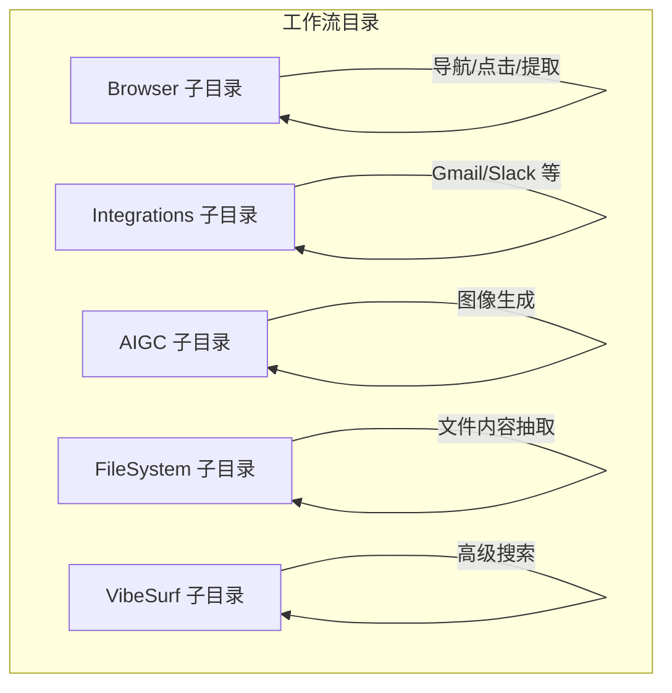
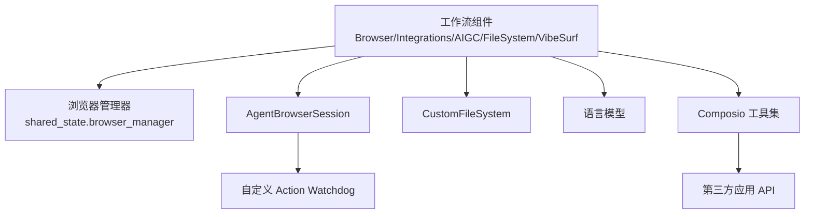
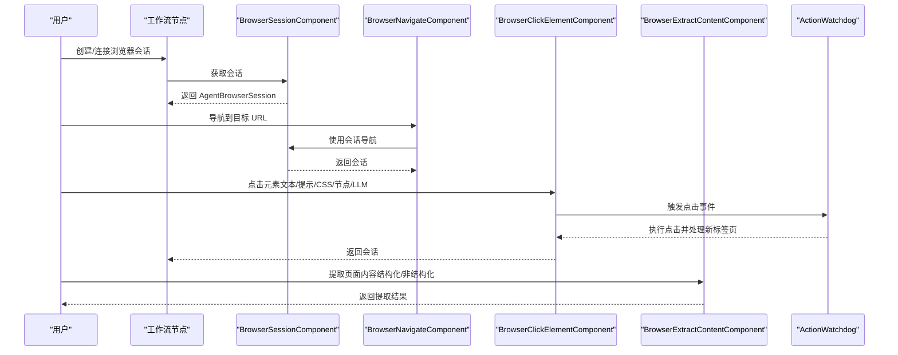
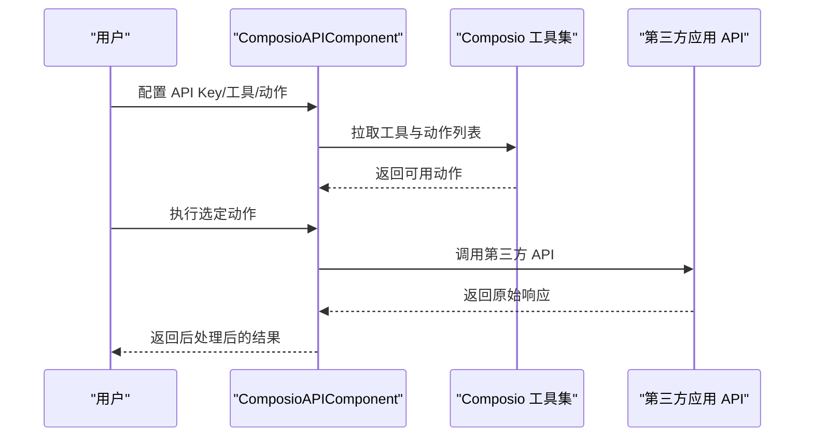
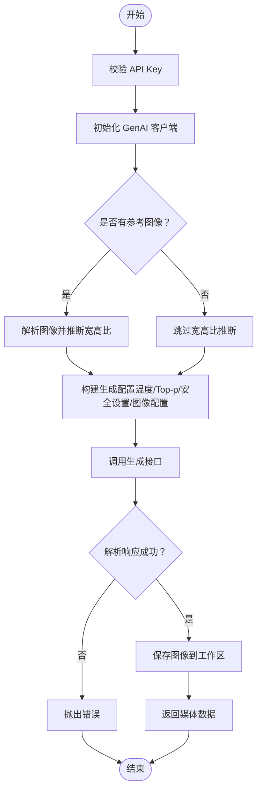
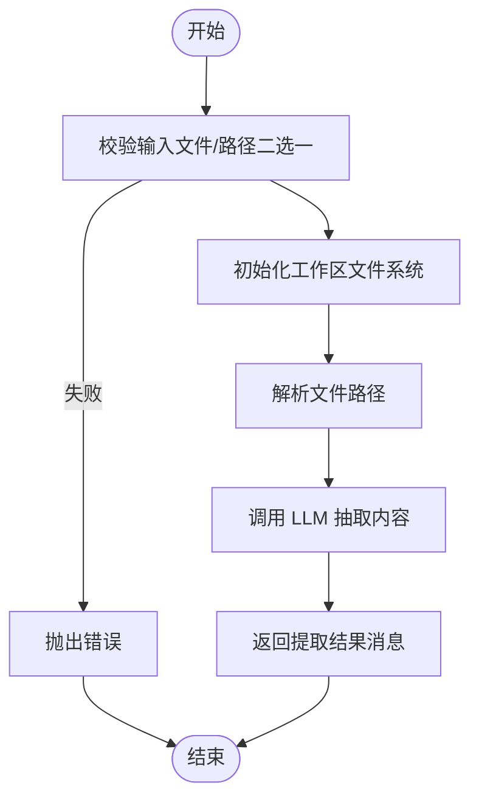
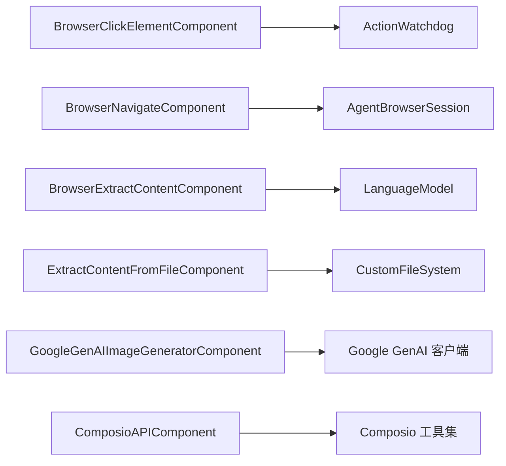

# 预定义工作流

<cite>
**本文引用的文件**
- [README.md](file://README.md)
- [browser_navigate.py](file://vibe_surf/workflows/Browser/browser_navigate.py)
- [browser_click_element.py](file://vibe_surf/workflows/Browser/browser_click_element.py)
- [browser_extract_content.py](file://vibe_surf/workflows/Browser/browser_extract_content.py)
- [browser_session.py](file://vibe_surf/workflows/Browser/browser_session.py)
- [gmail_composio.py](file://vibe_surf/workflows/Integrations/gmail_composio.py)
- [slack_composio.py](file://vibe_surf/workflows/Integrations/slack_composio.py)
- [composio_api.py](file://vibe_surf/workflows/Integrations/composio_api.py)
- [genai_image_generator.py](file://vibe_surf/workflows/AIGC/genai_image_generator.py)
- [extract_content_from_file.py](file://vibe_surf/workflows/FileSystem/extract_content_from_file.py)
- [advanced_search.py](file://vibe_surf/workflows/VibeSurf/advanced_search.py)
- [action_watchdog.py](file://vibe_surf/browser/watchdogs/action_watchdog.py)
- [file_system.py](file://vibe_surf/tools/file_system.py)
- [vibe_surf_prompt.py](file://vibe_surf/agents/prompts/vibe_surf_prompt.py)
</cite>

## 目录
1. [简介](#简介)
2. [项目结构](#项目结构)
3. [核心组件](#核心组件)
4. [架构总览](#架构总览)
5. [详细组件分析](#详细组件分析)
6. [依赖关系分析](#依赖关系分析)
7. [性能考量](#性能考量)
8. [故障排查指南](#故障排查指南)
9. [结论](#结论)
10. [附录](#附录)

## 简介
本文件面向使用者与开发者，系统化梳理 VibeSurf 仓库中“预定义工作流”的组织结构与实现细节，覆盖以下目录：
- Browser：浏览器操作工作流（导航、元素点击、内容提取等）
- Integrations：第三方服务集成工作流（通过 Composio 聚合 Gmail、Slack 等）
- AIGC：AI 生成内容工作流（图像生成）
- FileSystem：文件系统操作工作流（从文件中抽取内容）
- VibeSurf：平台级工作流（高级搜索）

目标是帮助用户快速理解各工作流的职责、输入输出、典型使用场景与配置要点，并提供可复用的实践建议。

## 项目结构
工作流位于 vibe_surf/workflows 下，按功能域划分目录：
- Browser：浏览器自动化相关节点
- Integrations：第三方集成（Composio 工具集）
- AIGC：AI 生成内容（图像生成）
- FileSystem：文件系统读取与内容抽取
- VibeSurf：平台能力（高级搜索等）

图表来源
- [browser_navigate.py](file://vibe_surf/workflows/Browser/browser_navigate.py#L1-L51)
- [gmail_composio.py](file://vibe_surf/workflows/Integrations/gmail_composio.py#L1-L39)
- [slack_composio.py](file://vibe_surf/workflows/Integrations/slack_composio.py#L1-L12)
- [genai_image_generator.py](file://vibe_surf/workflows/AIGC/genai_image_generator.py#L1-L285)
- [extract_content_from_file.py](file://vibe_surf/workflows/FileSystem/extract_content_from_file.py#L1-L112)
- [advanced_search.py](file://vibe_surf/workflows/VibeSurf/advanced_search.py#L1-L115)

章节来源
- [README.md](file://README.md#L1-L186)

## 核心组件
- 浏览器会话管理：BrowserSessionComponent 提供创建/获取浏览器会话的能力，支持主会话或指定目标标签页。
- 导航：BrowserNavigateComponent 将浏览器跳转到指定 URL。
- 元素点击：BrowserClickElementComponent 支持基于文本、CSS 选择器、后端节点 ID 或 LLM 提示定位元素并执行点击，自动处理新标签页切换。
- 内容提取：BrowserExtractContentComponent 支持非结构化与结构化两种提取模式，可结合 LLM 输出模型。
- 第三方集成：ComposioAPIComponent 统一接入 Composio 工具集；各应用组件（如 Gmail、Slack）继承基础封装，提供特定动作的后处理。
- AIGC 图像生成：GoogleGenAIImageGeneratorComponent 使用 Google GenAI 客户端生成图像，保存至工作区并返回媒体数据。
- 文件系统内容抽取：ExtractContentFromFileComponent 从上传或路径文件中抽取内容，支持多格式。
- 平台级搜索：AdvancedSearchComponent 支持 Google AI 模式与回退并行搜索，并可选 LLM 重排结果。

章节来源
- [browser_session.py](file://vibe_surf/workflows/Browser/browser_session.py#L1-L55)
- [browser_navigate.py](file://vibe_surf/workflows/Browser/browser_navigate.py#L1-L51)
- [browser_click_element.py](file://vibe_surf/workflows/Browser/browser_click_element.py#L1-L196)
- [browser_extract_content.py](file://vibe_surf/workflows/Browser/browser_extract_content.py#L1-L198)
- [composio_api.py](file://vibe_surf/workflows/Integrations/composio_api.py#L1-L280)
- [gmail_composio.py](file://vibe_surf/workflows/Integrations/gmail_composio.py#L1-L39)
- [slack_composio.py](file://vibe_surf/workflows/Integrations/slack_composio.py#L1-L12)
- [genai_image_generator.py](file://vibe_surf/workflows/AIGC/genai_image_generator.py#L1-L285)
- [extract_content_from_file.py](file://vibe_surf/workflows/FileSystem/extract_content_from_file.py#L1-L112)
- [advanced_search.py](file://vibe_surf/workflows/VibeSurf/advanced_search.py#L1-L115)

## 架构总览
下图展示工作流在系统中的位置与交互关系，以及浏览器操作 Watchdog 的错误处理机制。

图表来源
- [browser_session.py](file://vibe_surf/workflows/Browser/browser_session.py#L1-L55)
- [action_watchdog.py](file://vibe_surf/browser/watchdogs/action_watchdog.py#L1-L38)
- [file_system.py](file://vibe_surf/tools/file_system.py#L1-L47)
- [composio_api.py](file://vibe_surf/workflows/Integrations/composio_api.py#L1-L280)

## 详细组件分析

### 浏览器工作流（Browser）
Browser 子目录提供浏览器自动化的核心节点，围绕“会话—导航—元素操作—内容提取”形成闭环。

- 浏览器会话管理
  - 组件：BrowserSessionComponent
  - 输入：是否使用主会话、目标标签页 ID
  - 输出：AgentBrowserSession
  - 用途：统一获取/注册浏览器会话，便于后续导航与操作复用
  - 关键点：支持主会话直连与按目标 ID 注册新会话

- 页面导航
  - 组件：BrowserNavigateComponent
  - 输入：浏览器会话、URL
  - 输出：更新后的浏览器会话
  - 行为：调用会话导航到指定 URL，并短暂等待稳定

- 元素点击
  - 组件：BrowserClickElementComponent
  - 输入：浏览器会话、元素文本/提示、CSS 选择器、后端节点 ID、LLM 模型、点击按钮类型、点击次数
  - 输出：更新后的浏览器会话
  - 行为：优先基于语义映射与层级选择器定位元素，其次回退到 CSS 选择器、后端节点 ID、LLM 提示；点击后检测新标签页并激活

- 内容提取
  - 组件：BrowserExtractContentComponent
  - 输入：浏览器会话、提取目标、LLM 模型、是否结构化输出、输出 Schema（结构化时）
  - 输出：浏览器会话 + 提取内容（消息或结构化数据）
  - 行为：支持非结构化与结构化两种模式；结构化模式通过 Schema 动态构建输出模型

图表来源
- [browser_session.py](file://vibe_surf/workflows/Browser/browser_session.py#L1-L55)
- [browser_navigate.py](file://vibe_surf/workflows/Browser/browser_navigate.py#L1-L51)
- [browser_click_element.py](file://vibe_surf/workflows/Browser/browser_click_element.py#L1-L196)
- [browser_extract_content.py](file://vibe_surf/workflows/Browser/browser_extract_content.py#L1-L198)
- [action_watchdog.py](file://vibe_surf/browser/watchdogs/action_watchdog.py#L1-L38)

章节来源
- [browser_session.py](file://vibe_surf/workflows/Browser/browser_session.py#L1-L55)
- [browser_navigate.py](file://vibe_surf/workflows/Browser/browser_navigate.py#L1-L51)
- [browser_click_element.py](file://vibe_surf/workflows/Browser/browser_click_element.py#L1-L196)
- [browser_extract_content.py](file://vibe_surf/workflows/Browser/browser_extract_content.py#L1-L198)
- [action_watchdog.py](file://vibe_surf/browser/watchdogs/action_watchdog.py#L1-L38)

### 第三方服务集成工作流（Integrations）
通过 Composio 统一接入第三方应用，工作流以“工具构建—动作执行—结果后处理”为主线。

- Composio 工具集入口
  - 组件：ComposioAPIComponent
  - 输入：实体 ID、Composio API Key、工具名称、动作列表
  - 行为：动态拉取可用工具与动作，支持 OAuth 连接状态校验与引导

- 应用特定组件
  - Gmail：ComposioGmailAPIComponent，内置发送邮件与拉取邮件的后处理逻辑
  - Slack：ComposioSlackAPIComponent，提供默认工具集合

图表来源
- [composio_api.py](file://vibe_surf/workflows/Integrations/composio_api.py#L1-L280)
- [gmail_composio.py](file://vibe_surf/workflows/Integrations/gmail_composio.py#L1-L39)
- [slack_composio.py](file://vibe_surf/workflows/Integrations/slack_composio.py#L1-L12)

章节来源
- [composio_api.py](file://vibe_surf/workflows/Integrations/composio_api.py#L1-L280)
- [gmail_composio.py](file://vibe_surf/workflows/Integrations/gmail_composio.py#L1-L39)
- [slack_composio.py](file://vibe_surf/workflows/Integrations/slack_composio.py#L1-L12)

### AI 生成内容工作流（AIGC）
- GoogleGenAIImageGeneratorComponent
  - 输入：API Key、是否使用 Vertex、提示词、参考图像（文件或路径）、模型名、代理、基础 URL、宽高比、分辨率
  - 行为：初始化客户端，解析参考图像与参数，调用 GenAI 生成图像，保存到工作区并返回媒体数据对象

图表来源
- [genai_image_generator.py](file://vibe_surf/workflows/AIGC/genai_image_generator.py#L1-L285)

章节来源
- [genai_image_generator.py](file://vibe_surf/workflows/AIGC/genai_image_generator.py#L1-L285)

### 文件系统操作工作流（FileSystem）
- ExtractContentFromFileComponent
  - 输入：LLM 模型、查询指令、文件（上传或路径）
  - 行为：校验输入，初始化工作区下的文件系统，调用工具函数从文件中抽取内容，返回消息结果

图表来源
- [extract_content_from_file.py](file://vibe_surf/workflows/FileSystem/extract_content_from_file.py#L1-L112)
- [file_system.py](file://vibe_surf/tools/file_system.py#L1-L47)

章节来源
- [extract_content_from_file.py](file://vibe_surf/workflows/FileSystem/extract_content_from_file.py#L1-L112)
- [file_system.py](file://vibe_surf/tools/file_system.py#L1-L47)

### 平台级工作流（VibeSurf）
- AdvancedSearchComponent
  - 输入：查询、是否使用 Google AI 模式、是否重排、LLM（重排时必填）、最大结果数
  - 行为：根据模式选择搜索策略，可选 LLM 重排，返回结构化搜索结果

章节来源
- [advanced_search.py](file://vibe_surf/workflows/VibeSurf/advanced_search.py#L1-L115)

## 依赖关系分析
- 组件耦合
  - Browser 系列组件强依赖 AgentBrowserSession 与浏览器管理器，确保会话生命周期与稳定性
  - Integrations 通过 Composio 统一抽象第三方工具，减少对具体应用的直接依赖
  - AIGC 与 FileSystem 组件依赖外部 SDK 与本地文件系统，注意环境变量与路径解析
- 外部依赖
  - 浏览器操作依赖 browser_use 的 Watchdog 机制进行错误处理与会话保护
  - AIGC 依赖 Google GenAI 客户端
  - 文件系统依赖自定义 FileSystem 实现

图表来源
- [browser_click_element.py](file://vibe_surf/workflows/Browser/browser_click_element.py#L1-L196)
- [action_watchdog.py](file://vibe_surf/browser/watchdogs/action_watchdog.py#L1-L38)
- [browser_navigate.py](file://vibe_surf/workflows/Browser/browser_navigate.py#L1-L51)
- [browser_extract_content.py](file://vibe_surf/workflows/Browser/browser_extract_content.py#L1-L198)
- [extract_content_from_file.py](file://vibe_surf/workflows/FileSystem/extract_content_from_file.py#L1-L112)
- [file_system.py](file://vibe_surf/tools/file_system.py#L1-L47)
- [genai_image_generator.py](file://vibe_surf/workflows/AIGC/genai_image_generator.py#L1-L285)
- [composio_api.py](file://vibe_surf/workflows/Integrations/composio_api.py#L1-L280)

章节来源
- [browser_click_element.py](file://vibe_surf/workflows/Browser/browser_click_element.py#L1-L196)
- [browser_navigate.py](file://vibe_surf/workflows/Browser/browser_navigate.py#L1-L51)
- [browser_extract_content.py](file://vibe_surf/workflows/Browser/browser_extract_content.py#L1-L198)
- [extract_content_from_file.py](file://vibe_surf/workflows/FileSystem/extract_content_from_file.py#L1-L112)
- [genai_image_generator.py](file://vibe_surf/workflows/AIGC/genai_image_generator.py#L1-L285)
- [composio_api.py](file://vibe_surf/workflows/Integrations/composio_api.py#L1-L280)
- [action_watchdog.py](file://vibe_surf/browser/watchdogs/action_watchdog.py#L1-L38)
- [file_system.py](file://vibe_surf/tools/file_system.py#L1-L47)

## 性能考量
- 浏览器操作
  - 等待与稳定：导航与点击前等待网络稳定，避免 DOM 未就绪导致失败
  - 选择器优先级：优先使用层级选择器与 CSS 选择器，必要时回退到 LLM 提示，减少误判
  - 新标签页处理：点击后检测新增标签页并激活，避免后续操作作用于错误上下文
- 搜索与重排
  - 可选 LLM 重排会增加延迟，建议仅在需要提升相关性时启用
- AIGC 生成
  - 图像生成成本较高，合理设置分辨率与宽高比，避免不必要的大尺寸输出
- 文件系统
  - 路径解析与工作区目录创建应尽量一次性完成，减少重复 IO

[本节为通用指导，不直接分析具体文件]

## 故障排查指南
- 浏览器点击失败
  - 现象：找不到元素或点击无效
  - 排查：确认元素文本/提示是否唯一；优先提供 CSS 选择器；若使用 LLM 提示，检查模型可用性与提示质量
  - 参考：ActionWatchdog 对会话状态与事件的保护逻辑
- 导航异常
  - 现象：页面无法加载或超时
  - 排查：检查 URL 正确性与网络稳定性；适当延长等待时间
- Composio 连接问题
  - 现象：工具不可用或 OAuth 引导失败
  - 排查：确认 API Key 有效；查看工具与动作列表是否已加载；检查连接状态与重定向链接
- AIGC 生成失败
  - 现象：无图像返回或解析错误
  - 排查：检查 API Key、代理与基础 URL；确认响应格式与图像数据解析流程
- 文件内容抽取失败
  - 现象：路径错误或内容为空
  - 排查：确保仅提供文件或路径之一；检查工作区目录权限与文件存在性

章节来源
- [action_watchdog.py](file://vibe_surf/browser/watchdogs/action_watchdog.py#L1-L38)
- [browser_click_element.py](file://vibe_surf/workflows/Browser/browser_click_element.py#L1-L196)
- [composio_api.py](file://vibe_surf/workflows/Integrations/composio_api.py#L1-L280)
- [genai_image_generator.py](file://vibe_surf/workflows/AIGC/genai_image_generator.py#L1-L285)
- [extract_content_from_file.py](file://vibe_surf/workflows/FileSystem/extract_content_from_file.py#L1-L112)

## 结论
- 预定义工作流以“确定性 + 智能”相结合的方式，覆盖浏览器自动化、第三方集成、AI 生成与文件系统操作等核心场景
- 建议优先使用结构化输出与明确的选择器，提高稳定性与可维护性
- 在复杂任务中，可组合多个工作流节点，形成端到端的自动化流水线

[本节为总结性内容，不直接分析具体文件]

## 附录

### 使用场景与配置要点（示例）
- 浏览器导航
  - 场景：自动登录后跳转到目标页面
  - 配置：提供浏览器会话与目标 URL；可配合点击/提取节点串联
  - 参考：BrowserSessionComponent、BrowserNavigateComponent
- 元素点击
  - 场景：点击“下一步”、“提交表单”等
  - 配置：优先提供 CSS 选择器；若不确定，提供元素文本与上下文提示；必要时使用 LLM 提示
  - 参考：BrowserClickElementComponent
- 内容提取
  - 场景：从网页提取标题、价格、评论等结构化信息
  - 配置：开启结构化输出并定义 Schema；提供清晰的提取目标与 LLM
  - 参考：BrowserExtractContentComponent
- 第三方集成
  - 场景：通过 Gmail 发送邮件、在 Slack 发布消息
  - 配置：在 Composio 中配置 API Key 与应用授权；选择工具与动作
  - 参考：ComposioAPIComponent、Gmail/Slack 组件
- AIGC 图像生成
  - 场景：根据提示生成宣传图或示意图
  - 配置：提供 API Key、提示词、可选参考图像与分辨率
  - 参考：GoogleGenAIImageGeneratorComponent
- 文件系统内容抽取
  - 场景：从 PDF/Markdown/图片中抽取关键信息
  - 配置：提供查询指令与文件（上传或路径）
  - 参考：ExtractContentFromFileComponent
- 平台级搜索
  - 场景：快速检索并重排结果
  - 配置：选择搜索模式与最大结果数；可选启用 LLM 重排
  - 参考：AdvancedSearchComponent

章节来源
- [browser_session.py](file://vibe_surf/workflows/Browser/browser_session.py#L1-L55)
- [browser_navigate.py](file://vibe_surf/workflows/Browser/browser_navigate.py#L1-L51)
- [browser_click_element.py](file://vibe_surf/workflows/Browser/browser_click_element.py#L1-L196)
- [browser_extract_content.py](file://vibe_surf/workflows/Browser/browser_extract_content.py#L1-L198)
- [composio_api.py](file://vibe_surf/workflows/Integrations/composio_api.py#L1-L280)
- [gmail_composio.py](file://vibe_surf/workflows/Integrations/gmail_composio.py#L1-L39)
- [slack_composio.py](file://vibe_surf/workflows/Integrations/slack_composio.py#L1-L12)
- [genai_image_generator.py](file://vibe_surf/workflows/AIGC/genai_image_generator.py#L1-L285)
- [extract_content_from_file.py](file://vibe_surf/workflows/FileSystem/extract_content_from_file.py#L1-L112)
- [advanced_search.py](file://vibe_surf/workflows/VibeSurf/advanced_search.py#L1-L115)