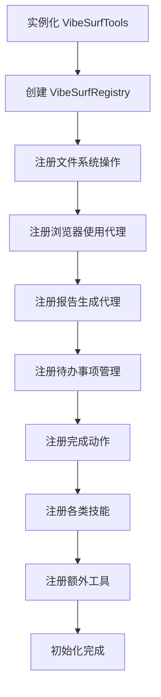
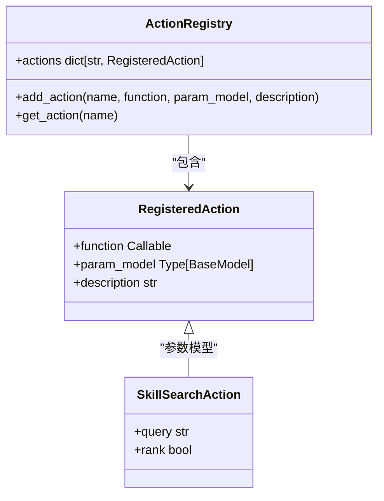
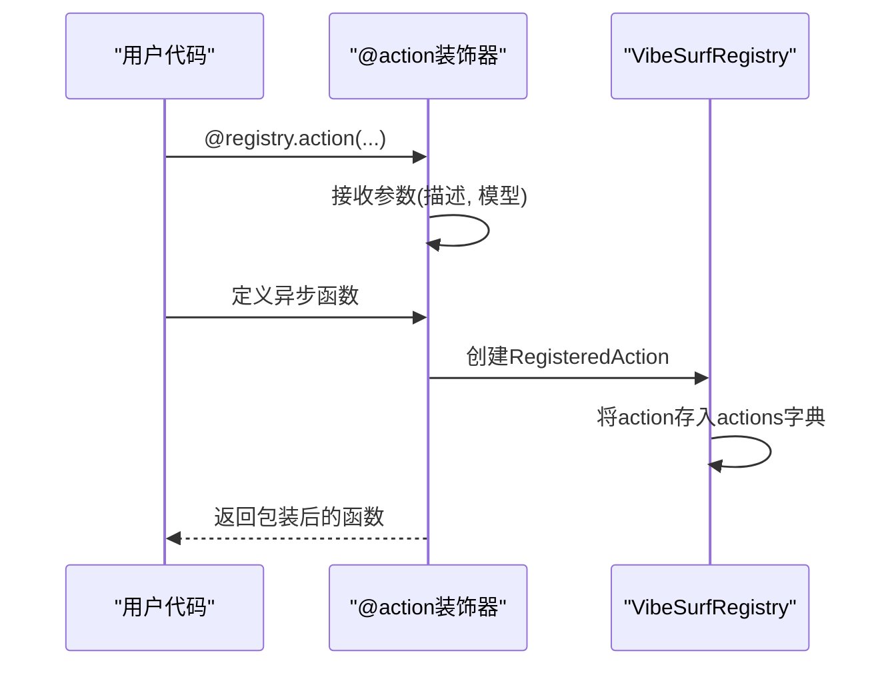
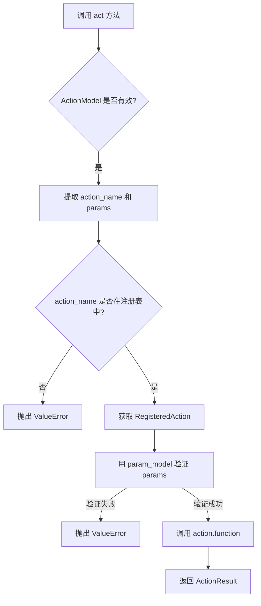
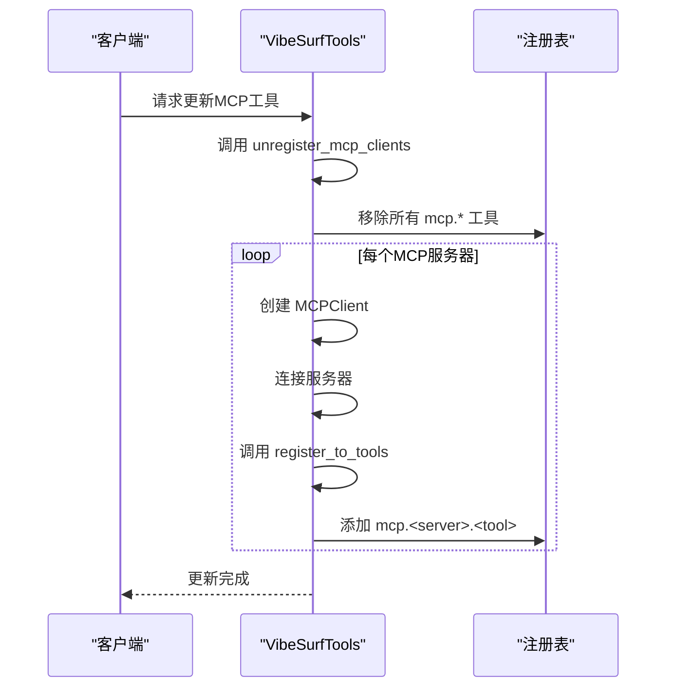

# 工具注册机制

<cite>
**本文档引用的文件**
- [vibesurf_registry.py](file://vibe_surf/tools/vibesurf_registry.py)
- [vibesurf_tools.py](file://vibe_surf/tools/vibesurf_tools.py)
- [views.py](file://vibe_surf/tools/views.py)
- [test_tools.py](file://tests/test_tools.py)
</cite>

## 目录
1. [简介](#简介)
2. [工具注册表初始化](#工具注册表初始化)
3. [工具元数据存储结构](#工具元数据存储结构)
4. [注册装饰器工作机制](#注册装饰器工作机制)
5. [运行时工具查找算法](#运行时工具查找算法)
6. [工具依赖管理与版本控制](#工具依赖管理与版本控制)
7. [热更新机制](#热更新机制)
8. [工具注册、查询与调用示例](#工具注册查询与调用示例)
9. [性能考虑与线程安全性](#性能考虑与线程安全性)
10. [扩展性建议](#扩展性建议)

## 简介
本文档详细分析了VibeSurf项目中工具注册机制的实现原理。该机制基于`vibesurf_registry.py`文件中的`VibeSurfRegistry`类，提供了一套完整的工具注册、发现和动态加载系统。系统支持本地工具、MCP（Model Context Protocol）服务和Composio集成工具的统一管理。通过装饰器模式实现工具注册，利用Pydantic模型定义工具参数，确保类型安全和参数验证。注册表在初始化时预注册核心技能，并支持运行时动态注册外部工具，实现了灵活的扩展能力。

**Section sources**
- [vibesurf_registry.py](file://vibe_surf/tools/vibesurf_registry.py#L34-L52)
- [vibesurf_tools.py](file://vibe_surf/tools/vibesurf_tools.py#L72-L87)

## 工具注册表初始化
工具注册表的初始化由`VibeSurfTools`类的构造函数完成。该类在实例化时创建`VibeSurfRegistry`实例，并立即调用一系列私有方法来注册不同类别的工具。初始化流程包括：首先创建注册表实例，然后按顺序注册文件系统操作、浏览器使用代理、报告生成代理、待办事项管理、完成动作、各类技能以及额外工具。注册表支持通过`exclude_actions`参数排除特定工具，实现灵活的配置。初始化完成后，注册表包含了所有预定义的核心功能，为后续的动态工具注册奠定了基础。



**Diagram sources**
- [vibesurf_tools.py](file://vibe_surf/tools/vibesurf_tools.py#L75-L82)

**Section sources**
- [vibesurf_tools.py](file://vibe_surf/tools/vibesurf_tools.py#L72-L87)

## 工具元数据存储结构
工具注册表使用`ActionRegistry`类来存储和管理所有已注册工具的元数据。每个工具以`RegisteredAction`对象的形式存储，包含以下核心信息：工具名称（作为字典键）、功能函数引用、参数模型（Pydantic BaseModel子类）和描述文本。参数模型通过`model_json_schema()`方法提供完整的JSON Schema定义，包含参数名称、类型、默认值、验证规则和描述信息。这种结构化存储方式使得工具的参数要求可以被程序化查询和验证。注册表本身是一个简单的字典结构，以工具名称为键，`RegisteredAction`对象为值，实现了O(1)时间复杂度的工具查找。



**Diagram sources**
- [vibesurf_registry.py](file://vibe_surf/tools/vibesurf_registry.py#L34-L52)
- [views.py](file://vibe_surf/tools/views.py#L123-L132)

**Section sources**
- [vibesurf_registry.py](file://vibe_surf/tools/vibesurf_registry.py#L34-L52)
- [views.py](file://vibe_surf/tools/views.py#L123-L132)

## 注册装饰器工作机制
工具注册通过`@registry.action`装饰器实现，这是整个注册机制的核心。该装饰器接收工具描述和参数模型作为参数，返回一个内部装饰器函数。当应用于一个异步函数时，它会将该函数包装成一个`RegisteredAction`对象，并将其添加到注册表的`actions`字典中。装饰器的工作流程包括：获取被装饰函数的引用，创建`RegisteredAction`实例，将工具名称（函数名）作为键存入注册表。对于动态注册的MCP和Composio工具，系统提供了`register_to_tools`方法，该方法遍历外部工具列表，为每个工具创建参数模型并调用`action`装饰器进行注册，同时添加`mcp.`或`cpo.`前缀以区分来源。



**Diagram sources**
- [vibesurf_registry.py](file://vibe_surf/tools/vibesurf_registry.py#L34-L52)
- [vibesurf_tools.py](file://vibe_surf/tools/vibesurf_tools.py#L101-L105)

**Section sources**
- [vibesurf_registry.py](file://vibe_surf/tools/vibesurf_registry.py#L34-L52)
- [vibesurf_tools.py](file://vibe_surf/tools/vibesurf_tools.py#L101-L105)

## 运行时工具查找算法
运行时工具查找通过`act`方法实现，该方法是工具执行的统一入口。算法流程如下：首先，接收一个`ActionModel`对象，该对象通过Pydantic的`model_dump`方法转换为字典，提取出工具名称和参数。然后，在注册表的`actions`字典中通过工具名称进行查找，时间复杂度为O(1)。如果找到对应工具，则使用其`param_model`对传入参数进行验证和实例化。最后，调用工具函数并传入验证后的参数和特殊上下文（如`browser_manager`, `llm`等）。整个过程包含完整的异常处理，能够捕获并处理`ValueError`、`BrowserError`、`TimeoutError`等异常，确保系统的健壮性。



**Diagram sources**
- [vibesurf_tools.py](file://vibe_surf/tools/vibesurf_tools.py#L2232-L2277)

**Section sources**
- [vibesurf_tools.py](file://vibe_surf/tools/vibesurf_tools.py#L2232-L2277)

## 工具依赖管理与版本控制
系统通过模块化设计和依赖注入实现工具依赖管理。核心依赖如`BrowserManager`、`BaseChatModel`和`CustomFileSystem`通过函数参数在运行时注入，避免了硬编码依赖。对于外部工具，系统通过独立的客户端进行管理：MCP工具通过`CustomMCPClient`连接，Composio工具通过`ComposioClient`管理。版本控制主要体现在外部工具集成上，MCP和Composio服务器的配置（如命令、参数、环境变量）在运行时提供，允许灵活切换不同版本的服务。注册表本身不直接管理版本，而是通过完全注销和重新注册来实现工具集的更新，确保了环境的一致性。

**Section sources**
- [vibesurf_tools.py](file://vibe_surf/tools/vibesurf_tools.py#L2082-L2229)

## 热更新机制
系统支持通过`unregister`和`register`方法组合实现工具的热更新。对于MCP工具，`unregister_mcp_clients`方法会断开所有MCP服务器连接，并从注册表中移除所有以`mcp.`为前缀的工具。随后，`register_mcp_tools`方法会根据新的服务器配置重新建立连接，并将工具重新注册到注册表中。Composio工具的更新机制类似，通过`update_composio_tools`方法先注销所有Composio工具，再根据新的工具集配置重新注册。这种"先注销后注册"的模式确保了在更新过程中不会出现状态不一致的问题，实现了平滑的热更新。



**Diagram sources**
- [vibesurf_tools.py](file://vibe_surf/tools/vibesurf_tools.py#L2132-L2163)

**Section sources**
- [vibesurf_tools.py](file://vibe_surf/tools/vibesurf_tools.py#L2082-L2229)

## 工具注册查询与调用示例
以下代码示例展示了如何注册新工具、查询可用工具和动态调用工具：

```python
# 1. 注册新工具
@tools.registry.action(
    "自定义搜索",
    param_model=CustomSearchAction
)
async def custom_search(params: CustomSearchAction):
    # 实现搜索逻辑
    pass

# 2. 查询可用工具
all_tools = tools.get_all_action_names()
mcp_tools = [t for t in all_tools if t.startswith("mcp.")]
print(f"可用MCP工具: {mcp_tools}")

# 3. 动态调用工具
action_model = ActionModel(**{action_name: validated_params})
result = await tools.act(action_model)
```

**Section sources**
- [vibesurf_tools.py](file://vibe_surf/tools/vibesurf_tools.py#L88-L98)
- [vibesurf_tools.py](file://vibe_surf/tools/vibesurf_tools.py#L2232-L2277)

## 性能考虑与线程安全性
注册表的核心数据结构是一个字典，工具查找操作的时间复杂度为O(1)，具有优秀的性能表现。由于Python的GIL（全局解释器锁），在单线程异步环境中，字典操作是线程安全的。系统主要在异步事件循环中运行，避免了多线程竞争。对于外部工具的注册和注销操作，系统提供了原子性的`unregister`和`register`方法，确保在更新工具集时不会出现部分更新的状态。性能瓶颈主要在于外部工具的执行（如LLM调用、网络请求），而非注册表本身的查找操作。建议在高并发场景下对注册表的读操作进行缓存，以进一步提升性能。

**Section sources**
- [vibesurf_registry.py](file://vibe_surf/tools/vibesurf_registry.py#L34-L52)
- [vibesurf_tools.py](file://vibe_surf/tools/vibesurf_tools.py#L2232-L2277)

## 扩展性建议
为提高系统的扩展性，建议遵循以下原则：1) 新增工具应通过装饰器模式注册，保持接口一致性；2) 复杂的外部集成应封装成独立的客户端类，如`CustomMCPClient`和`ComposioClient`；3) 工具参数应使用Pydantic模型定义，便于自动生成文档和进行类型检查；4) 为动态加载的工具添加命名前缀（如`mcp.`、`cpo.`），避免命名冲突；5) 实现工具的健康检查和自动重连机制，提高系统鲁棒性。通过这些实践，可以轻松地将新的API服务或本地工具集成到现有系统中。

**Section sources**
- [vibesurf_tools.py](file://vibe_surf/tools/vibesurf_tools.py#L2082-L2229)