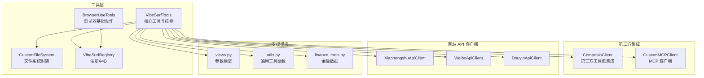
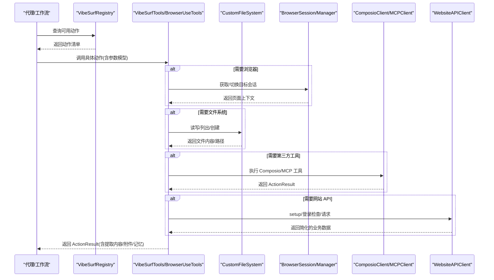
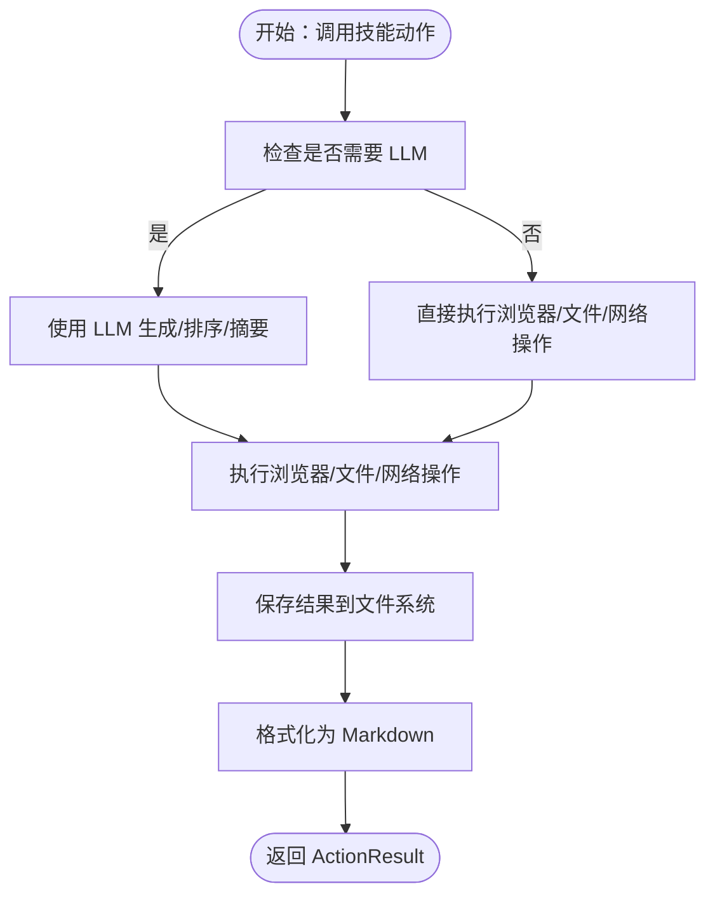
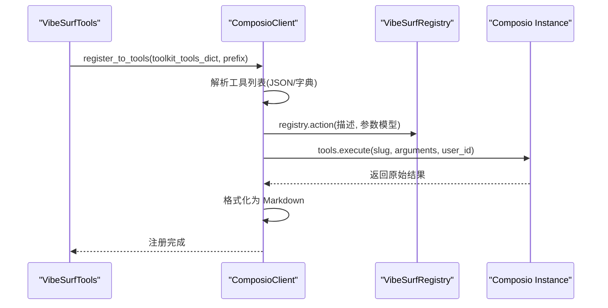
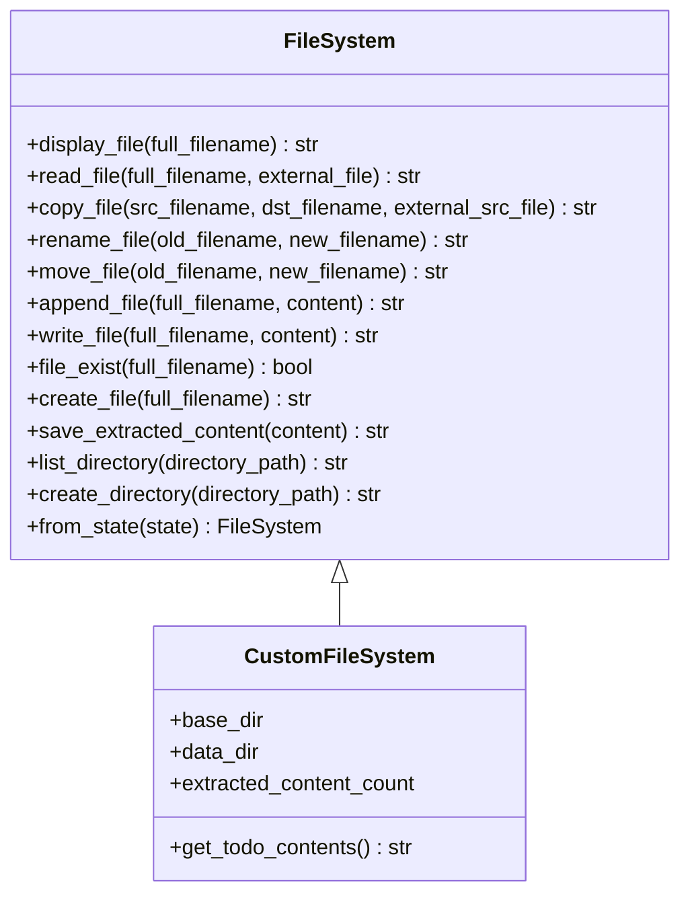
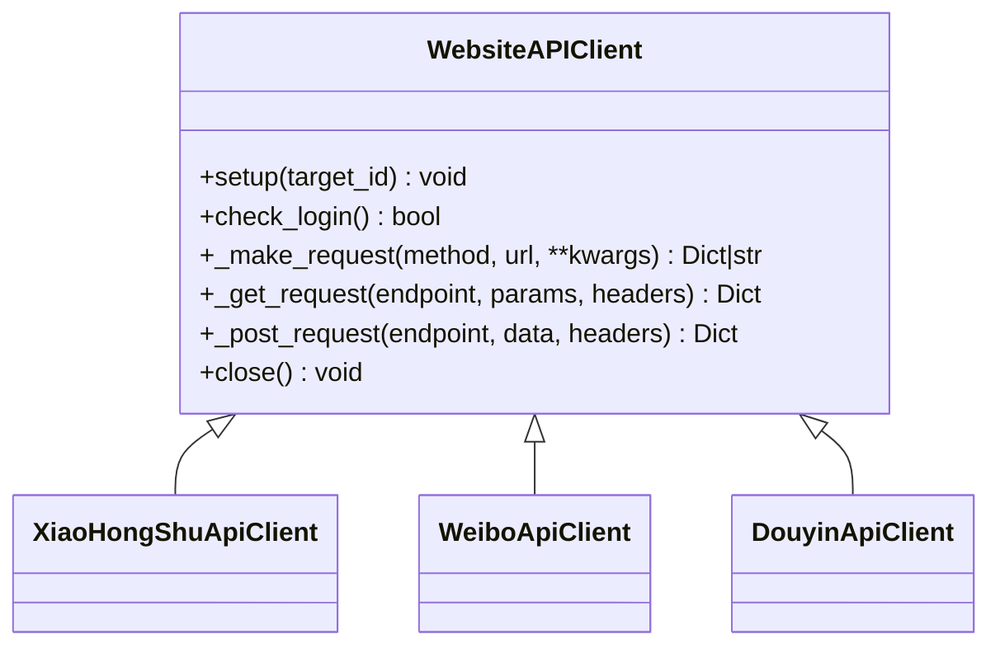
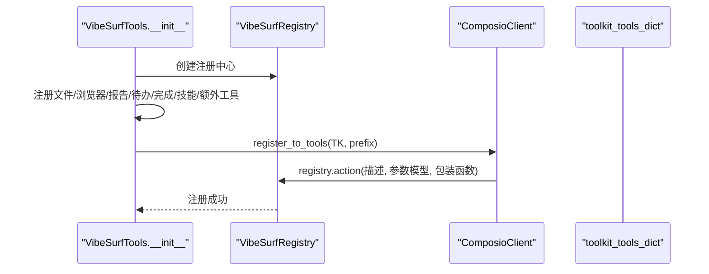
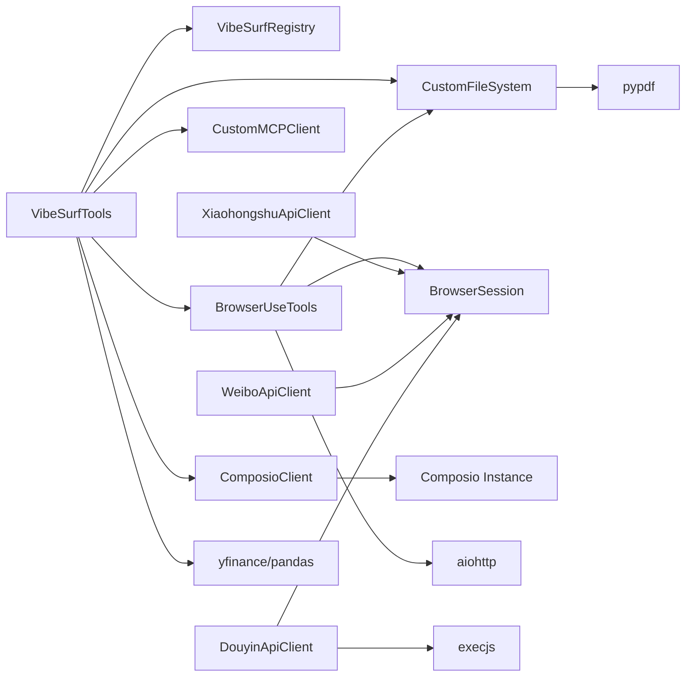

# 工具系统结构

<cite>
**本文引用的文件**
- [vibesurf_tools.py](file://vibe_surf/tools/vibesurf_tools.py)
- [composio_client.py](file://vibe_surf/tools/composio_client.py)
- [file_system.py](file://vibe_surf/tools/file_system.py)
- [vibesurf_registry.py](file://vibe_surf/tools/vibesurf_registry.py)
- [views.py](file://vibe_surf/tools/views.py)
- [utils.py](file://vibe_surf/tools/utils.py)
- [finance_tools.py](file://vibe_surf/tools/finance_tools.py)
- [mcp_client.py](file://vibe_surf/tools/mcp_client.py)
- [browser_use_tools.py](file://vibe_surf/tools/browser_use_tools.py)
- [xhs/client.py](file://vibe_surf/tools/website_api/xhs/client.py)
- [weibo/client.py](file://vibe_surf/tools/website_api/weibo/client.py)
- [douyin/client.py](file://vibe_surf/tools/website_api/douyin/client.py)
</cite>

## 目录
1. [引言](#引言)
2. [项目结构](#项目结构)
3. [核心组件](#核心组件)
4. [架构总览](#架构总览)
5. [详细组件分析](#详细组件分析)
6. [依赖关系分析](#依赖关系分析)
7. [性能考量](#性能考量)
8. [故障排查指南](#故障排查指南)
9. [结论](#结论)
10. [附录](#附录)

## 引言
本文件系统性梳理 VibeSurf 的工具系统，重点覆盖以下方面：
- 核心工具与技能的组织与实现：在 VibeSurfTools 中注册的浏览器搜索、内容提取、截图、代码生成、金融数据查询、多平台内容采集等能力。
- 第三方服务集成封装：ComposioClient 如何将外部工具包动态注册为 VibeSurf 动作。
- 文件系统工具设计：CustomFileSystem 对文件读写、复制、重命名、移动、列表、目录创建等能力的封装。
- 网站 API 客户端模式：Xiaohongshu、Weibo、Douyin 等客户端通过浏览器会话获取 Cookie、签名头、鉴权状态，并进行请求与数据简化。
- 工具注册机制与动态加载：VibeSurfRegistry 对特殊参数类型的支持，以及 ComposioClient 的动态动作注册流程。
- 工具系统架构图：展示工具、代理与工作流之间的调用关系。
- 关键类说明：ComposioClient 的认证与请求处理逻辑、WebsiteAPIClient 的通用接口设计等。

## 项目结构
工具系统主要位于 vibe_surf/tools 目录，按功能域划分如下：
- 核心工具与技能：vibesurf_tools.py、browser_use_tools.py、views.py、utils.py、finance_tools.py
- 第三方集成：composio_client.py、mcp_client.py
- 文件系统：file_system.py
- 注册与调度：vibesurf_registry.py
- 网站 API 客户端：website_api/xhs、website_api/weibo、website_api/douyin

图表来源
- [vibesurf_tools.py](file://vibe_surf/tools/vibesurf_tools.py#L1-L120)
- [browser_use_tools.py](file://vibe_surf/tools/browser_use_tools.py#L1-L120)
- [file_system.py](file://vibe_surf/tools/file_system.py#L1-L120)
- [vibesurf_registry.py](file://vibe_surf/tools/vibesurf_registry.py#L1-L53)
- [composio_client.py](file://vibe_surf/tools/composio_client.py#L1-L120)
- [mcp_client.py](file://vibe_surf/tools/mcp_client.py#L1-L85)
- [views.py](file://vibe_surf/tools/views.py#L1-L120)
- [utils.py](file://vibe_surf/tools/utils.py#L1-L120)
- [finance_tools.py](file://vibe_surf/tools/finance_tools.py#L1-L120)
- [xhs/client.py](file://vibe_surf/tools/website_api/xhs/client.py#L1-L120)
- [weibo/client.py](file://vibe_surf/tools/website_api/weibo/client.py#L1-L120)
- [douyin/client.py](file://vibe_surf/tools/website_api/douyin/client.py#L1-L120)

章节来源
- [vibesurf_tools.py](file://vibe_surf/tools/vibesurf_tools.py#L1-L120)
- [browser_use_tools.py](file://vibe_surf/tools/browser_use_tools.py#L1-L120)
- [file_system.py](file://vibe_surf/tools/file_system.py#L1-L120)
- [vibesurf_registry.py](file://vibe_surf/tools/vibesurf_registry.py#L1-L53)
- [composio_client.py](file://vibe_surf/tools/composio_client.py#L1-L120)
- [mcp_client.py](file://vibe_surf/tools/mcp_client.py#L1-L85)
- [views.py](file://vibe_surf/tools/views.py#L1-L120)
- [utils.py](file://vibe_surf/tools/utils.py#L1-L120)
- [finance_tools.py](file://vibe_surf/tools/finance_tools.py#L1-L120)
- [xhs/client.py](file://vibe_surf/tools/website_api/xhs/client.py#L1-L120)
- [weibo/client.py](file://vibe_surf/tools/website_api/weibo/client.py#L1-L120)
- [douyin/client.py](file://vibe_surf/tools/website_api/douyin/client.py#L1-L120)

## 核心组件
- VibeSurfTools：集中注册与编排各类工具动作，包括浏览器高级搜索、内容提取、截图、代码生成、金融数据、多平台内容采集等；同时维护 MCP 与 Composio 客户端实例。
- BrowserUseTools：继承自 browser_use 的 Tools，补充浏览器交互动作（悬停、导航、搜索、返回、截图、下载媒体等），并与文件系统集成。
- CustomFileSystem：基于 browser_use 的 FileSystem 扩展，支持多种文件类型读写、PDF 解析、复制/重命名/移动、目录遍历、安全路径限制等。
- VibeSurfRegistry：扩展 Registry，定义特殊参数类型（浏览器会话、页面 URL、LLM、文件系统、浏览器管理器等），统一动作注册入口。
- ComposioClient：将 Composio 工具包动态转换为 VibeSurf 动作，自动解析 JSON Schema 参数、包装结果为 ActionResult，并记录遥测事件。
- WebsiteAPIClient（Xiaohongshu/Weibo/Douyin）：通过浏览器会话获取 Cookie、UA、签名头，执行带鉴权与风控处理的请求，返回简化的业务数据。
- 工具视图与通用工具：views.py 提供动作参数模型；utils.py 提供 HTML 清洗、选择器提示、JavaScript 生成与执行、搜索引擎抓取等通用能力；finance_tools.py 提供金融数据检索与 Markdown 格式化。

章节来源
- [vibesurf_tools.py](file://vibe_surf/tools/vibesurf_tools.py#L70-L220)
- [browser_use_tools.py](file://vibe_surf/tools/browser_use_tools.py#L60-L160)
- [file_system.py](file://vibe_surf/tools/file_system.py#L38-L120)
- [vibesurf_registry.py](file://vibe_surf/tools/vibesurf_registry.py#L34-L53)
- [composio_client.py](file://vibe_surf/tools/composio_client.py#L39-L120)
- [views.py](file://vibe_surf/tools/views.py#L1-L120)
- [utils.py](file://vibe_surf/tools/utils.py#L1-L120)
- [finance_tools.py](file://vibe_surf/tools/finance_tools.py#L1-L120)

## 架构总览
工具系统围绕“动作注册—参数校验—执行—结果封装—持久化/输出”的闭环构建。代理通过 VibeSurfRegistry 获取可用动作，结合 BrowserManager、BrowserSession、CustomFileSystem、ComposioClient、MCPClient 等组件完成复杂任务；WebsiteAPIClient 则负责与外部站点交互并返回结构化数据。

图表来源
- [vibesurf_registry.py](file://vibe_surf/tools/vibesurf_registry.py#L34-L53)
- [vibesurf_tools.py](file://vibe_surf/tools/vibesurf_tools.py#L100-L220)
- [browser_use_tools.py](file://vibe_surf/tools/browser_use_tools.py#L146-L220)
- [file_system.py](file://vibe_surf/tools/file_system.py#L268-L338)
- [composio_client.py](file://vibe_surf/tools/composio_client.py#L60-L120)
- [mcp_client.py](file://vibe_surf/tools/mcp_client.py#L37-L85)
- [xhs/client.py](file://vibe_surf/tools/website_api/xhs/client.py#L112-L172)
- [weibo/client.py](file://vibe_surf/tools/website_api/weibo/client.py#L64-L124)
- [douyin/client.py](file://vibe_surf/tools/website_api/douyin/client.py#L76-L132)

## 详细组件分析

### VibeSurfTools：核心工具与技能
- 动态注册：通过 VibeSurfRegistry 在初始化时注册文件系统、浏览器使用、报告撰写、待办管理、完成动作、技能集合（搜索/爬取/摘要/截图/代码/金融/平台采集）、额外工具等。
- 技能实现要点：
  - 高级搜索：优先使用 Google AI 模型搜索，失败则回退到多标签并行搜索，支持 LLM 排序与结果分组。
  - 内容提取/摘要：基于 DOM 结构与 LLM 进行结构化抽取与总结，支持指定目标标签页。
  - 截图：可选目标标签页，保存至工作区 screenshots 目录。
  - 代码生成：通过 LLM 生成并执行 JavaScript，支持迭代修正与结果落盘。
  - 金融数据：封装 Yahoo Finance，支持多种方法（公司信息、历史价格、新闻、财务报表、分析师建议等），格式化为 Markdown。
  - 平台采集：Xiaohongshu/Weibo/Douyin 的方法统一通过参数模型传入，内部解析 JSON 字符串，调用对应客户端，结果落盘并格式化为 Markdown。
- 依赖注入：BrowserManager、BrowserSession、CustomFileSystem、ComposioClient、MCPClient、page_extraction_llm 等作为动作参数自动注入。

图表来源
- [vibesurf_tools.py](file://vibe_surf/tools/vibesurf_tools.py#L100-L220)
- [utils.py](file://vibe_surf/tools/utils.py#L136-L355)
- [finance_tools.py](file://vibe_surf/tools/finance_tools.py#L269-L442)
- [file_system.py](file://vibe_surf/tools/file_system.py#L268-L338)

章节来源
- [vibesurf_tools.py](file://vibe_surf/tools/vibesurf_tools.py#L100-L220)
- [utils.py](file://vibe_surf/tools/utils.py#L136-L355)
- [finance_tools.py](file://vibe_surf/tools/finance_tools.py#L269-L442)
- [file_system.py](file://vibe_surf/tools/file_system.py#L268-L338)

### ComposioClient：第三方服务集成封装
- 动态注册：接收 toolkit_tools_dict，逐个工具解析 JSON Schema 参数，创建 Pydantic 参数模型，包装为异步动作函数，注册到 VibeSurfRegistry。
- 认证与请求：
  - 使用 composio_instance.tools.execute 调用工具，自动处理 include_payload 等参数。
  - 统一结果格式化为 Markdown 字符串，便于在 ActionResult 中呈现。
  - 记录连接、工具调用等遥测事件，包含耗时、错误信息等。
- 取消注册：支持移除以 “cpo.” 前缀开头的动作，清理已注册集合与工具字典。

图表来源
- [composio_client.py](file://vibe_surf/tools/composio_client.py#L60-L120)
- [composio_client.py](file://vibe_surf/tools/composio_client.py#L128-L299)
- [composio_client.py](file://vibe_surf/tools/composio_client.py#L299-L458)

章节来源
- [composio_client.py](file://vibe_surf/tools/composio_client.py#L60-L120)
- [composio_client.py](file://vibe_surf/tools/composio_client.py#L128-L299)
- [composio_client.py](file://vibe_surf/tools/composio_client.py#L299-L458)

### CustomFileSystem：文件系统工具设计
- 能力范围：读取/写入/追加、复制/重命名/移动、列出目录、创建目录、PDF 解析（前若干页）、文件存在性判断、提取内容保存编号文件等。
- 安全与约束：严格限制路径仅在 data_dir 下，防止越权访问；校验文件名后缀；对敏感操作使用线程池异步执行。
- 与工具链集成：BrowserUseTools 与 VibeSurfTools 的截图、下载媒体、代码落盘等均依赖该文件系统。

图表来源
- [file_system.py](file://vibe_surf/tools/file_system.py#L38-L120)
- [file_system.py](file://vibe_surf/tools/file_system.py#L268-L338)
- [file_system.py](file://vibe_surf/tools/file_system.py#L400-L438)

章节来源
- [file_system.py](file://vibe_surf/tools/file_system.py#L38-L120)
- [file_system.py](file://vibe_surf/tools/file_system.py#L268-L338)
- [file_system.py](file://vibe_surf/tools/file_system.py#L400-L438)

### WebsiteAPIClient 通用接口设计
- 共同特征：
  - setup：通过浏览器会话导航到站点，提取 Cookie、User-Agent，校验登录状态。
  - 请求封装：统一的 _make_request/_get_request/_post_request，处理鉴权头、签名、重试、错误码映射。
  - 数据简化：将原始响应映射为简化的字段集合，便于后续工具消费。
  - 生命周期：提供 close 方法关闭新建的标签页。
- 平台差异：
  - Xiaohongshu：使用 xsign 签名、多 endpoint（搜索、详情、评论、用户、首页推荐等），支持分页与限速。
  - Weibo：移动端 API，容器化卡片结构，支持热搜、热门、用户主页、评论等。
  - Douyin：本地存储 msToken、a-bogus 签名生成，多 endpoint（搜索、视频详情、评论、用户、作品等）。

图表来源
- [xhs/client.py](file://vibe_surf/tools/website_api/xhs/client.py#L112-L172)
- [xhs/client.py](file://vibe_surf/tools/website_api/xhs/client.py#L178-L265)
- [weibo/client.py](file://vibe_surf/tools/website_api/weibo/client.py#L64-L124)
- [weibo/client.py](file://vibe_surf/tools/website_api/weibo/client.py#L134-L212)
- [douyin/client.py](file://vibe_surf/tools/website_api/douyin/client.py#L76-L132)
- [douyin/client.py](file://vibe_surf/tools/website_api/douyin/client.py#L243-L289)

章节来源
- [xhs/client.py](file://vibe_surf/tools/website_api/xhs/client.py#L112-L172)
- [xhs/client.py](file://vibe_surf/tools/website_api/xhs/client.py#L178-L265)
- [weibo/client.py](file://vibe_surf/tools/website_api/weibo/client.py#L64-L124)
- [weibo/client.py](file://vibe_surf/tools/website_api/weibo/client.py#L134-L212)
- [douyin/client.py](file://vibe_surf/tools/website_api/douyin/client.py#L76-L132)
- [douyin/client.py](file://vibe_surf/tools/website_api/douyin/client.py#L243-L289)

### 工具注册机制与动态加载
- VibeSurfRegistry：定义特殊参数类型映射，确保动作函数可自动注入 BrowserSession、BrowserManager、FileSystem、BaseChatModel 等上下文对象。
- ComposioClient：从 toolkit_tools_dict 解析工具元数据，动态创建参数模型，包装为异步动作函数并注册到 Registry；支持取消注册。
- 动态加载流程：VibeSurfTools 初始化时创建 Registry，随后批量注册内置动作；再由 ComposioClient 注册第三方工具动作。

图表来源
- [vibesurf_registry.py](file://vibe_surf/tools/vibesurf_registry.py#L34-L53)
- [vibesurf_tools.py](file://vibe_surf/tools/vibesurf_tools.py#L72-L87)
- [composio_client.py](file://vibe_surf/tools/composio_client.py#L60-L120)
- [composio_client.py](file://vibe_surf/tools/composio_client.py#L128-L299)

章节来源
- [vibesurf_registry.py](file://vibe_surf/tools/vibesurf_registry.py#L34-L53)
- [vibesurf_tools.py](file://vibe_surf/tools/vibesurf_tools.py#L72-L87)
- [composio_client.py](file://vibe_surf/tools/composio_client.py#L60-L120)
- [composio_client.py](file://vibe_surf/tools/composio_client.py#L128-L299)

### BrowserUseTools：浏览器基础动作
- 浏览器交互：hover（XPath/CSS/索引定位）、navigate、search（多引擎）、go_back、take_screenshot、download_media。
- 与文件系统集成：下载媒体、截图等结果写入工作区目录，便于后续查看与归档。
- 结构化输出：done 动作支持结构化输出模型，自动序列化枚举值，生成长记忆文本。

章节来源
- [browser_use_tools.py](file://vibe_surf/tools/browser_use_tools.py#L146-L220)
- [browser_use_tools.py](file://vibe_surf/tools/browser_use_tools.py#L220-L347)
- [browser_use_tools.py](file://vibe_surf/tools/browser_use_tools.py#L348-L492)

## 依赖关系分析
- 组件耦合：
  - VibeSurfTools 与 BrowserUseTools 共享 VibeSurfRegistry，形成统一动作注册与发现。
  - WebsiteAPIClient 依赖浏览器会话以获取 Cookie/UA/签名，与 CustomFileSystem 协作进行数据落盘。
  - ComposioClient 依赖外部 Composio 实例，通过 JSON Schema 自动推导参数模型。
- 外部依赖：
  - 浏览器自动化：browser_use 的 BrowserSession、CDP 客户端。
  - 文件系统：pypdf、pathvalidate、aiohttp 等。
  - 第三方 API：httpx、execjs（Douyin 签名）、tenacity（重试）。
  - 金融数据：yfinance、pandas。

图表来源
- [vibesurf_tools.py](file://vibe_surf/tools/vibesurf_tools.py#L1-L120)
- [browser_use_tools.py](file://vibe_surf/tools/browser_use_tools.py#L1-L120)
- [file_system.py](file://vibe_surf/tools/file_system.py#L1-L120)
- [composio_client.py](file://vibe_surf/tools/composio_client.py#L1-L120)
- [mcp_client.py](file://vibe_surf/tools/mcp_client.py#L1-L85)
- [xhs/client.py](file://vibe_surf/tools/website_api/xhs/client.py#L1-L120)
- [weibo/client.py](file://vibe_surf/tools/website_api/weibo/client.py#L1-L120)
- [douyin/client.py](file://vibe_surf/tools/website_api/douyin/client.py#L1-L120)

章节来源
- [vibesurf_tools.py](file://vibe_surf/tools/vibesurf_tools.py#L1-L120)
- [browser_use_tools.py](file://vibe_surf/tools/browser_use_tools.py#L1-L120)
- [file_system.py](file://vibe_surf/tools/file_system.py#L1-L120)
- [composio_client.py](file://vibe_surf/tools/composio_client.py#L1-L120)
- [mcp_client.py](file://vibe_surf/tools/mcp_client.py#L1-L85)
- [xhs/client.py](file://vibe_surf/tools/website_api/xhs/client.py#L1-L120)
- [weibo/client.py](file://vibe_surf/tools/website_api/weibo/client.py#L1-L120)
- [douyin/client.py](file://vibe_surf/tools/website_api/douyin/client.py#L1-L120)

## 性能考量
- 并行与异步：浏览器搜索回退采用 asyncio.gather 并行执行；Douyin/Xhs/Weibo 的分页抓取设置合理的 fetch_interval，避免触发风控。
- 结果缓存与去重：Google 回退搜索阶段对 URL 去重，减少重复抓取。
- I/O 优化：文件写入使用线程池异步执行；PDF 仅读取前若干页，控制上下文大小。
- LLM 交互：JavaScript 生成采用迭代策略，最大迭代次数可控，避免长时间等待；结果过大时拆分为单独 JSON 文件。
- 遥测与可观测：ComposioClient/MCPClient 记录连接/调用耗时与错误，便于定位性能瓶颈。

[本节为通用指导，不直接分析具体文件]

## 故障排查指南
- 登录与鉴权
  - Xiaohongshu/Weibo/Douyin：setup 失败或 check_login 失败时，需先在浏览器登录对应站点；确认 Cookie/UA 获取成功。
  - Composio：未设置 composio_instance 或工具执行异常时，检查实例初始化与权限配置。
- 网络与风控
  - 429/471/461/blocked：触发限流或验证挑战，适当增加延时或更换 UA；必要时启用代理。
- 文件系统
  - 路径越权：确保所有操作在 data_dir 下；检查路径规范化与后缀校验。
  - PDF 读取：确认安装 pypdf；注意大文件只读取前若干页。
- LLM 生成
  - JavaScript 生成失败：查看异常反馈消息，调整提示词或降低复杂度；确保页面 DOM 可见元素足够。
- 结果格式化
  - Composio 结果：若非 JSON，将被转为字符串；如需结构化，请在上游工具中保证返回 JSON。

章节来源
- [xhs/client.py](file://vibe_surf/tools/website_api/xhs/client.py#L178-L217)
- [weibo/client.py](file://vibe_surf/tools/website_api/weibo/client.py#L134-L187)
- [douyin/client.py](file://vibe_surf/tools/website_api/douyin/client.py#L243-L289)
- [composio_client.py](file://vibe_surf/tools/composio_client.py#L198-L239)
- [file_system.py](file://vibe_surf/tools/file_system.py#L236-L338)
- [utils.py](file://vibe_surf/tools/utils.py#L356-L741)

## 结论
VibeSurf 的工具系统通过统一的注册中心与参数注入机制，将浏览器、文件系统、第三方工具与网站 API 客户端有机整合，既保证了扩展性（新增动作/工具/平台），也兼顾了安全性与可观测性。开发者可通过以下方式快速扩展：
- 新增动作：在 VibeSurfTools 中注册，或通过 ComposioClient 动态导入。
- 集成第三方 API：仿照 WebsiteAPIClient 模式，实现 setup/check_login/_make_request/_get_request/_post_request，并在工具中调用。
- 修改行为：通过 views.py 的参数模型与 utils.py 的通用工具函数，灵活调整输入输出与中间处理逻辑。

[本节为总结性内容，不直接分析具体文件]

## 附录
- 开发者指南
  - 添加新工具：在 VibeSurfTools 中使用 registry.action 注册；若参数复杂，参考 views.py 的 BaseModel 定义；如需第三方工具，使用 ComposioClient 动态注册。
  - 集成新网站 API：参考现有客户端的 setup/check_login/请求封装模式，确保鉴权与签名正确；返回简化的数据结构。
  - 修改现有工具：优先通过参数模型与工具函数解耦；如涉及浏览器交互，尽量复用 BrowserUseTools 的基础动作。
- 最佳实践
  - 控制上下文大小：HTML 清洗与截断、PDF 仅读取必要页数。
  - 幂等与重试：对不稳定接口使用 tenacity；对分页接口设置合理间隔。
  - 日志与遥测：充分利用 logger 与 ProductTelemetry，便于问题定位与性能监控。

[本节为通用指导，不直接分析具体文件]