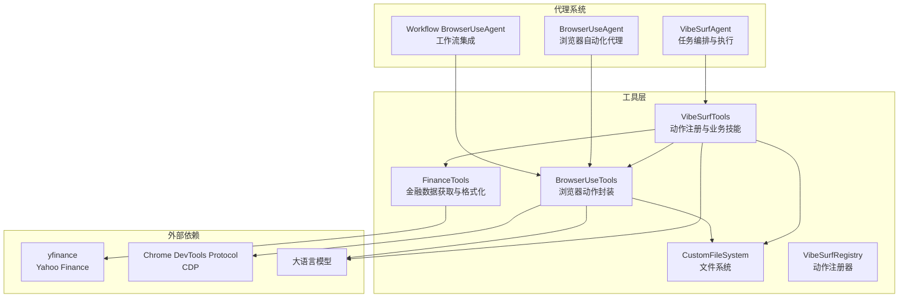
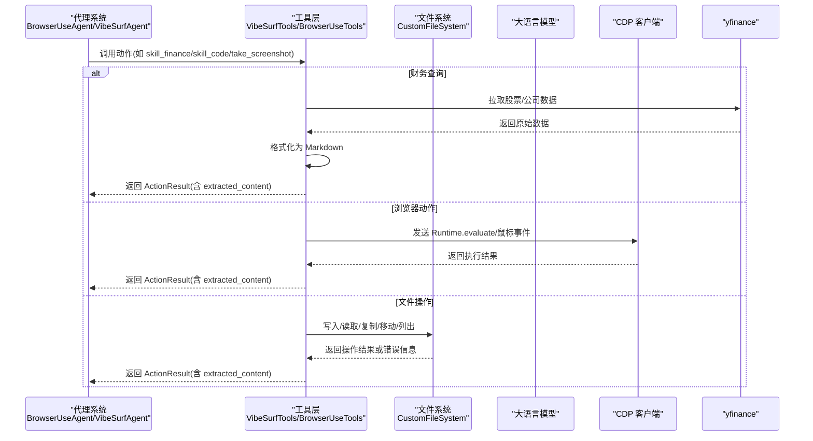
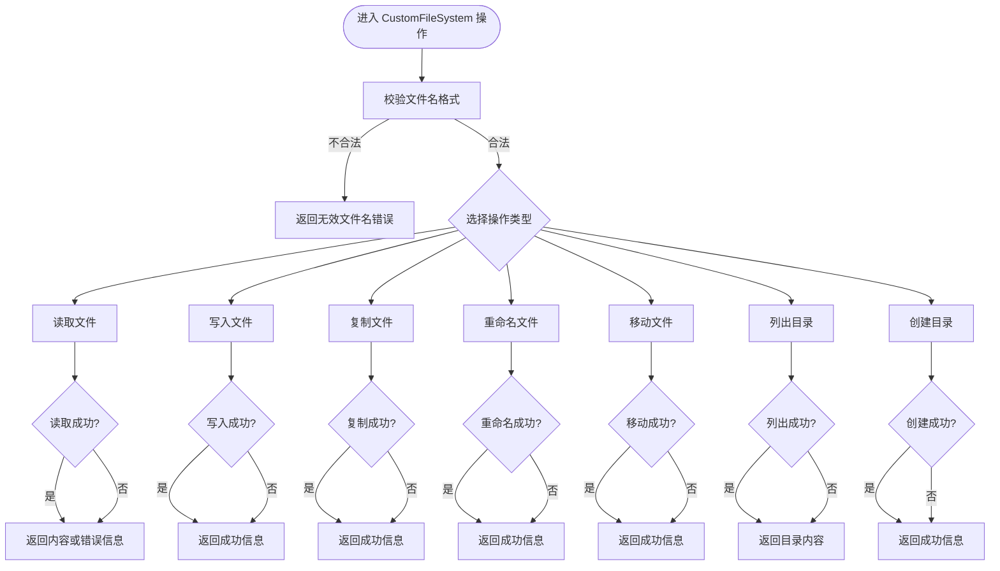
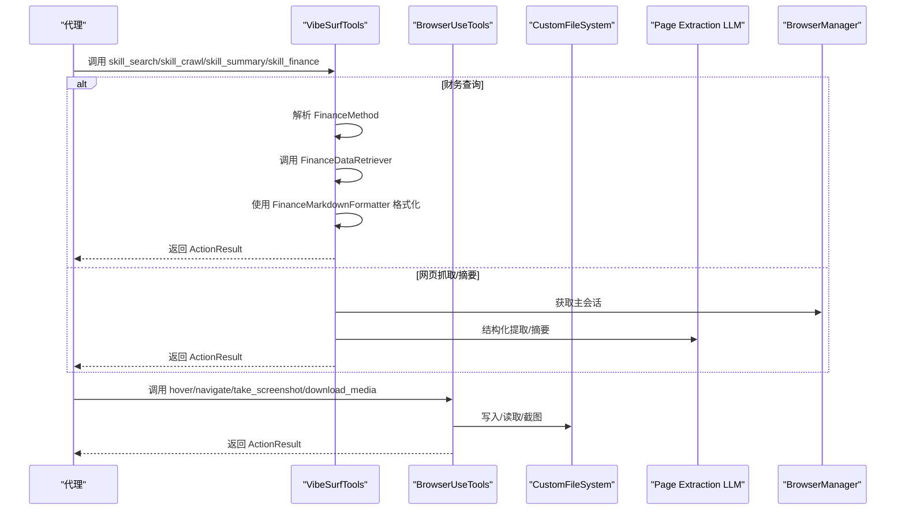
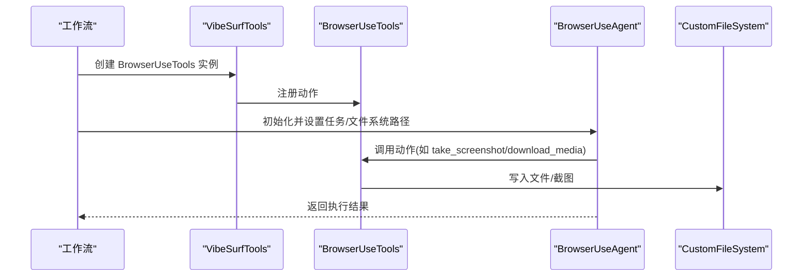
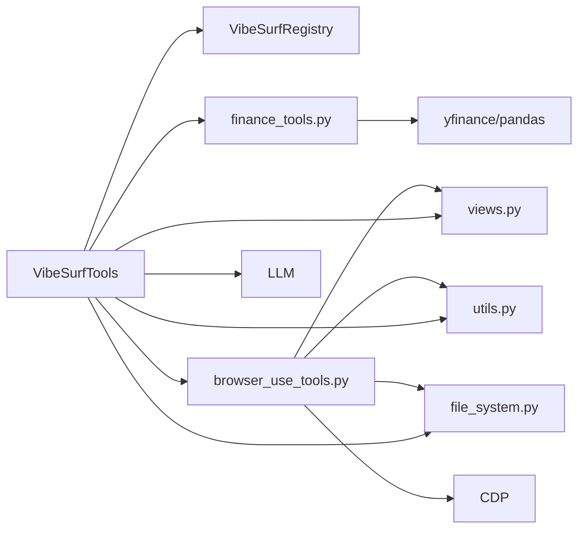

# 核心工具

<cite>
**本文引用的文件列表**
- [vibesurf_tools.py](file://vibe_surf/tools/vibesurf_tools.py)
- [file_system.py](file://vibe_surf/tools/file_system.py)
- [finance_tools.py](file://vibe_surf/tools/finance_tools.py)
- [browser_use_tools.py](file://vibe_surf/tools/browser_use_tools.py)
- [views.py](file://vibe_surf/tools/views.py)
- [utils.py](file://vibe_surf/tools/utils.py)
- [vibesurf_registry.py](file://vibe_surf/tools/vibesurf_registry.py)
- [browser_use_agent.py](file://vibe_surf/agents/browser_use_agent.py)
- [vibe_surf_agent.py](file://vibe_surf/agents/vibe_surf_agent.py)
- [browser_use_agent_workflow.py](file://vibe_surf/workflows/VibeSurf/browser_use_agent.py)
</cite>

## 目录
1. [简介](#简介)
2. [项目结构](#项目结构)
3. [核心组件](#核心组件)
4. [架构总览](#架构总览)
5. [详细组件分析](#详细组件分析)
6. [依赖关系分析](#依赖关系分析)
7. [性能考量](#性能考量)
8. [故障排查指南](#故障排查指南)
9. [结论](#结论)
10. [附录](#附录)

## 简介
本文件聚焦于 Vibesurf 项目中的核心工具模块，重点覆盖以下方面：
- 文件系统工具：CustomFileSystem 的文件读写、目录管理、安全校验与异常处理机制
- 财务计算工具：FinanceDataRetriever 与 FinanceMarkdownFormatter 的数据获取与格式化策略、精度控制与容错
- 通用工具：VibeSurfTools 与 BrowserUseTools 的动作注册、参数模型、返回值与错误码约定
- 代理系统集成：浏览器自动化代理（BrowserUseAgent）如何调用上述工具，以及在工作流中的典型使用场景
- 性能优化与常见陷阱：针对文件 I/O、网络请求、浏览器交互与数据格式化的优化建议与规避方法

## 项目结构
围绕“核心工具”的关键文件组织如下：
- 工具入口与动作注册：vibesurf_tools.py、browser_use_tools.py、vibesurf_registry.py
- 文件系统：file_system.py
- 财务工具：finance_tools.py
- 参数模型与视图：views.py
- 辅助工具与浏览器搜索：utils.py
- 代理系统集成：browser_use_agent.py、vibe_surf_agent.py、browser_use_agent_workflow.py

图表来源
- [vibesurf_tools.py](file://vibe_surf/tools/vibesurf_tools.py#L1-L120)
- [browser_use_tools.py](file://vibe_surf/tools/browser_use_tools.py#L1-L120)
- [file_system.py](file://vibe_surf/tools/file_system.py#L1-L120)
- [finance_tools.py](file://vibe_surf/tools/finance_tools.py#L1-L120)
- [browser_use_agent.py](file://vibe_surf/agents/browser_use_agent.py#L37-L80)
- [vibe_surf_agent.py](file://vibe_surf/agents/vibe_surf_agent.py#L611-L841)
- [browser_use_agent_workflow.py](file://vibe_surf/workflows/VibeSurf/browser_use_agent.py#L82-L150)

章节来源
- [vibesurf_tools.py](file://vibe_surf/tools/vibesurf_tools.py#L1-L120)
- [browser_use_tools.py](file://vibe_surf/tools/browser_use_tools.py#L1-L120)
- [file_system.py](file://vibe_surf/tools/file_system.py#L1-L120)
- [finance_tools.py](file://vibe_surf/tools/finance_tools.py#L1-L120)

## 核心组件
- VibeSurfTools：统一的动作注册中心，提供高级搜索、网页抓取、摘要、截图、代码生成、财务查询、社交媒体数据抓取等技能动作，并通过 Registry 将其暴露给代理系统
- BrowserUseTools：在 VibeSurfTools 基础上扩展浏览器导航、悬停、截图、下载媒体等底层动作，统一返回 ActionResult
- CustomFileSystem：基于 browser_use 的 FileSystem 扩展，提供安全的文件读写、复制、重命名、移动、目录创建与列出、PDF 提取、内容保存等能力
- FinanceTools：FinanceMethod 枚举定义可调用的数据方法；FinanceDataRetriever 统一拉取 yfinance 数据；FinanceMarkdownFormatter 将结果格式化为 Markdown
- 参数模型 views：对各动作的输入参数进行 Pydantic 校验，确保类型安全与默认值约束
- 辅助工具 utils：HTML 清洗、结构化内容提取、LLM 生成 JavaScript 代码、Google AI 模型搜索与回退并行搜索

章节来源
- [vibesurf_tools.py](file://vibe_surf/tools/vibesurf_tools.py#L72-L120)
- [browser_use_tools.py](file://vibe_surf/tools/browser_use_tools.py#L62-L120)
- [file_system.py](file://vibe_surf/tools/file_system.py#L38-L120)
- [finance_tools.py](file://vibe_surf/tools/finance_tools.py#L18-L120)
- [views.py](file://vibe_surf/tools/views.py#L1-L120)
- [utils.py](file://vibe_surf/tools/utils.py#L136-L210)

## 架构总览
VibeSurfTools 与 BrowserUseTools 共同构成“动作层”，通过 VibeSurfRegistry 注册到代理系统；代理系统（BrowserUseAgent、VibeSurfAgent、工作流）按需调用动作，完成文件系统操作、浏览器交互与财务数据查询。

图表来源
- [vibesurf_tools.py](file://vibe_surf/tools/vibesurf_tools.py#L461-L545)
- [browser_use_tools.py](file://vibe_surf/tools/browser_use_tools.py#L311-L420)
- [file_system.py](file://vibe_surf/tools/file_system.py#L268-L313)
- [finance_tools.py](file://vibe_surf/tools/finance_tools.py#L77-L120)

## 详细组件分析

### 文件系统工具：CustomFileSystem
- 设计要点
  - 基于 browser_use 的 FileSystem，限定操作范围在 data_dir 子目录，避免越权访问
  - 支持多种文件类型（md、txt、json、csv、pdf、py、html、js），并提供专用读写方法
  - PDF 提取限制最大页数，防止超大数据导致内存压力
  - 目录列出时进行路径合法性检查，确保只在受控范围内遍历
  - 内置 extracted_content 计数器，自动编号保存抽取内容
- 异常处理
  - 文件名格式校验失败返回固定错误消息
  - 文件不存在、权限不足、IO 错误均捕获并返回统一错误字符串
  - 列目录时对非法路径与越权访问进行拦截
- 复杂度与性能
  - 列目录为 O(n) 遍历，n 为目录项数量；建议在大目录下分页或限制深度
  - PDF 提取按页迭代，时间复杂度 O(p)，p 为页数；已限制最大页数
- 使用建议
  - 对外暴露的文件操作仅限 data_dir，避免直接传入绝对路径
  - 大文件写入前先估算大小，必要时拆分或压缩

图表来源
- [file_system.py](file://vibe_surf/tools/file_system.py#L240-L438)

章节来源
- [file_system.py](file://vibe_surf/tools/file_system.py#L38-L120)
- [file_system.py](file://vibe_surf/tools/file_system.py#L120-L240)
- [file_system.py](file://vibe_surf/tools/file_system.py#L240-L438)

### 财务计算工具：FinanceDataRetriever 与 FinanceMarkdownFormatter
- FinanceMethod 枚举
  - 覆盖基本信息、历史行情、财务报表、收益与分析、推荐与评级、所有权与持有者、新闻与可持续性、份额与期权等多类数据
- FinanceDataRetriever
  - 接收方法列表与时间窗口参数，逐个调用对应私有方法，统一收集结果
  - 对每个方法调用进行异常捕获，记录日志并返回错误信息，保证整体流程健壮
- FinanceMarkdownFormatter
  - 将不同类型的返回数据（DataFrame、Series、List、Dict、标量）转换为一致的 Markdown 表达
  - 针对历史价格、新闻、股息、推荐等子类型提供专门格式化逻辑，提升可读性
- 精度控制
  - 金额与比率保留两位小数；序列统计采用 pandas 默认精度
  - 新闻摘要与时间戳解析兼容多种格式，避免因解析失败导致输出中断
- 性能与可靠性
  - 通过枚举与参数校验减少无效调用
  - 对 yfinance 返回空集或空表的情况进行显式处理，避免渲染异常

```mermaid
classDiagram
class FinanceMethod {
+GET_INFO
+GET_FAST_INFO
+GET_HISTORY
+GET_ACTIONS
+GET_DIVIDENDS
+GET_SPLITS
+GET_CAPITAL_GAINS
+GET_FINANCIALS
+GET_QUARTERLY_FINANCIALS
+GET_BALANCE_SHEET
+GET_QUARTERLY_BALANCE_SHEET
+GET_CASHFLOW
+GET_QUARTERLY_CASHFLOW
+GET_EARNINGS
+GET_QUARTERLY_EARNINGS
+GET_EARNINGS_DATES
+GET_CALENDAR
+GET_RECOMMENDATIONS
+GET_RECOMMENDATIONS_SUMMARY
+GET_UPGRADES_DOWNGRADES
+GET_ANALYSIS
+GET_MAJOR_HOLDERS
+GET_INSTITUTIONAL_HOLDERS
+GET_MUTUALFUND_HOLDERS
+GET_INSIDER_PURCHASES
+GET_INSIDER_TRANSACTIONS
+GET_INSIDER_ROSTER_HOLDERS
+GET_NEWS
+GET_SUSTAINABILITY
+GET_SEC_FILINGS
+GET_SHARES
+GET_OPTIONS
}
class FinanceDataRetriever {
+symbol : str
+get_finance_data(methods, **kwargs) Dict
-_get_info(**kwargs) Dict
-_get_fast_info(**kwargs) Dict
-_get_history(**kwargs) DataFrame
-_get_actions(**kwargs) DataFrame
-_get_dividends(**kwargs) Series
-_get_splits(**kwargs) Series
-_get_capital_gains(**kwargs) Series
-_get_financials(**kwargs) DataFrame
-_get_quarterly_financials(**kwargs) DataFrame
-_get_balance_sheet(**kwargs) DataFrame
-_get_quarterly_balance_sheet(**kwargs) DataFrame
-_get_cashflow(**kwargs) DataFrame
-_get_quarterly_cashflow(**kwargs) DataFrame
-_get_earnings(**kwargs) DataFrame
-_get_quarterly_earnings(**kwargs) DataFrame
-_get_earnings_dates(**kwargs) DataFrame
-_get_calendar(**kwargs) Dict
-_get_recommendations(**kwargs) DataFrame
-_get_recommendations_summary(**kwargs) DataFrame
-_get_upgrades_downgrades(**kwargs) DataFrame
-_get_analysis(**kwargs) DataFrame
-_get_major_holders(**kwargs) DataFrame
-_get_institutional_holders(**kwargs) DataFrame
-_get_mutualfund_holders(**kwargs) DataFrame
-_get_insider_purchases(**kwargs) DataFrame
-_get_insider_transactions(**kwargs) DataFrame
-_get_insider_roster_holders(**kwargs) DataFrame
-_get_news(**kwargs) List
-_get_sustainability(**kwargs) DataFrame
-_get_sec_filings(**kwargs) DataFrame
-_get_shares(**kwargs) DataFrame
-_get_options(**kwargs) Dict
}
class FinanceMarkdownFormatter {
+format_finance_data(symbol, results, methods) str
-_format_generic(data) str
-_format_get_info(info) str
-_format_get_fast_info(fast_info) str
-_format_get_history(history) str
-_format_get_news(news) str
-_format_get_dividends(dividends) str
-_format_get_recommendations(recommendations) str
-_format_get_earnings(earnings) str
}
FinanceDataRetriever --> FinanceMethod : "使用"
FinanceMarkdownFormatter --> FinanceDataRetriever : "消费结果"
```

图表来源
- [finance_tools.py](file://vibe_surf/tools/finance_tools.py#L18-L267)
- [finance_tools.py](file://vibe_surf/tools/finance_tools.py#L269-L629)

章节来源
- [finance_tools.py](file://vibe_surf/tools/finance_tools.py#L18-L120)
- [finance_tools.py](file://vibe_surf/tools/finance_tools.py#L77-L267)
- [finance_tools.py](file://vibe_surf/tools/finance_tools.py#L269-L629)

### 通用工具：VibeSurfTools 与 BrowserUseTools
- 动作注册与参数模型
  - 通过 VibeSurfRegistry 注册动作，自动注入特殊上下文参数（browser_session、page_extraction_llm、file_system、browser_manager 等）
  - 所有动作参数由 Pydantic 模型校验，确保类型与默认值一致性
- 返回值与错误码
  - 统一返回 ActionResult，支持 extracted_content、error、is_done、attachments 等字段
  - 对浏览器错误、超时等进行捕获并映射为标准错误消息
- 典型动作
  - 高级搜索：优先使用 Google AI 模型搜索，失败则回退到并行多标签搜索
  - 抓取与摘要：基于 LLM 结构化提取网页内容
  - 截图：保存 PNG 并返回相对路径
  - 代码生成：LLM 生成 JavaScript，CDP 执行并返回结果
  - 财务查询：按 FinanceMethod 列表拉取数据并格式化为 Markdown
  - 浏览器动作：悬停、导航、后退、截图、下载媒体等

图表来源
- [vibesurf_tools.py](file://vibe_surf/tools/vibesurf_tools.py#L100-L225)
- [vibesurf_tools.py](file://vibe_surf/tools/vibesurf_tools.py#L226-L410)
- [vibesurf_tools.py](file://vibe_surf/tools/vibesurf_tools.py#L411-L545)
- [browser_use_tools.py](file://vibe_surf/tools/browser_use_tools.py#L146-L492)

章节来源
- [vibesurf_tools.py](file://vibe_surf/tools/vibesurf_tools.py#L72-L120)
- [vibesurf_tools.py](file://vibe_surf/tools/vibesurf_tools.py#L100-L225)
- [vibesurf_tools.py](file://vibe_surf/tools/vibesurf_tools.py#L226-L410)
- [vibesurf_tools.py](file://vibe_surf/tools/vibesurf_tools.py#L411-L545)
- [browser_use_tools.py](file://vibe_surf/tools/browser_use_tools.py#L62-L120)
- [browser_use_tools.py](file://vibe_surf/tools/browser_use_tools.py#L146-L492)
- [vibesurf_registry.py](file://vibe_surf/tools/vibesurf_registry.py#L34-L53)
- [views.py](file://vibe_surf/tools/views.py#L120-L221)

### 代理系统调用与工作流集成
- BrowserUseAgent
  - 通过 BrowserUseTools 注册动作，结合 LLM 与浏览器会话执行任务
  - 在工作流中以组件形式运行，支持 Flash/Thinking 模式切换
- VibeSurfAgent
  - 编排多个 BrowserUseAgent 并行执行，按任务分配 tab_id
  - 将文件系统路径与上传文件传递给代理，保障任务隔离
- 工作流集成
  - Workflow 中创建独立工作目录，实例化 BrowserUseAgent 并运行，返回最终结果或错误信息

图表来源
- [browser_use_agent.py](file://vibe_surf/agents/browser_use_agent.py#L37-L80)
- [vibe_surf_agent.py](file://vibe_surf/agents/vibe_surf_agent.py#L611-L841)
- [browser_use_agent_workflow.py](file://vibe_surf/workflows/VibeSurf/browser_use_agent.py#L82-L150)

章节来源
- [browser_use_agent.py](file://vibe_surf/agents/browser_use_agent.py#L37-L80)
- [vibe_surf_agent.py](file://vibe_surf/agents/vibe_surf_agent.py#L611-L841)
- [browser_use_agent_workflow.py](file://vibe_surf/workflows/VibeSurf/browser_use_agent.py#L82-L150)

## 依赖关系分析
- 组件耦合
  - VibeSurfTools 依赖 VibeSurfRegistry、views、utils、finance_tools、file_system、browser_use_tools
  - BrowserUseTools 继承自 Tools，扩展浏览器动作，依赖 CustomFileSystem 与 utils
  - CustomFileSystem 依赖 browser_use 的 FileSystem 与 BaseFile 类型体系
  - FinanceTools 依赖 yfinance 与 pandas
- 外部依赖
  - Chrome DevTools Protocol（CDP）用于浏览器交互
  - 大语言模型用于结构化提取与代码生成
  - Yahoo Finance 提供财务数据

图表来源
- [vibesurf_tools.py](file://vibe_surf/tools/vibesurf_tools.py#L1-L120)
- [browser_use_tools.py](file://vibe_surf/tools/browser_use_tools.py#L1-L120)
- [file_system.py](file://vibe_surf/tools/file_system.py#L1-L120)
- [finance_tools.py](file://vibe_surf/tools/finance_tools.py#L1-L120)
- [utils.py](file://vibe_surf/tools/utils.py#L136-L210)

章节来源
- [vibesurf_tools.py](file://vibe_surf/tools/vibesurf_tools.py#L1-L120)
- [browser_use_tools.py](file://vibe_surf/tools/browser_use_tools.py#L1-L120)
- [file_system.py](file://vibe_surf/tools/file_system.py#L1-L120)
- [finance_tools.py](file://vibe_surf/tools/finance_tools.py#L1-L120)
- [utils.py](file://vibe_surf/tools/utils.py#L136-L210)

## 性能考量
- 文件系统
  - PDF 提取限制最大页数，避免内存峰值过高
  - 目录列出时进行路径合法性检查，避免遍历不受控目录
  - 大文件写入建议分块或异步 I/O，结合线程池执行 shutil 操作
- 浏览器交互
  - JavaScript 生成与执行采用迭代重试，最多 5 次，避免单次失败导致任务中断
  - 截图与下载媒体使用二进制写入，避免编码开销
- 财务数据
  - 历史数据按需截断，仅展示最近 30 条记录，降低渲染成本
  - 新闻条目限制数量，摘要长度控制在合理范围
- LLM 与网络
  - 生成 JavaScript 代码时限制 HTML 上下文长度，避免上下文爆炸
  - 下载媒体时检测文件类型与大小，便于后续处理

[本节为通用指导，无需特定文件引用]

## 故障排查指南
- 文件系统
  - 文件名不合法：检查扩展名是否在受支持列表内
  - 文件不存在/权限不足：确认路径在 data_dir 内且具有读写权限
  - 目录越权访问：确保传入相对路径且不包含上层目录跳转
- 浏览器动作
  - 元素定位失败：检查 index/xpath/selector 是否正确；必要时先刷新选择器映射
  - 导航失败：确认 URL 可达，必要时启用新标签页
  - 截图/下载失败：检查磁盘空间与文件名合法性
- 财务数据
  - 方法名无效：核对 FinanceMethod 枚举值
  - 数据为空：yfinance 可能未返回数据，尝试调整时间窗口或方法组合
- 代理系统
  - 超时与浏览器错误：查看日志中的 BrowserError/TimeoutError 映射
  - 并行任务冲突：确保每个任务的 tab_id 唯一

章节来源
- [file_system.py](file://vibe_surf/tools/file_system.py#L240-L438)
- [browser_use_tools.py](file://vibe_surf/tools/browser_use_tools.py#L146-L492)
- [finance_tools.py](file://vibe_surf/tools/finance_tools.py#L77-L120)
- [vibesurf_tools.py](file://vibe_surf/tools/vibesurf_tools.py#L2257-L2277)

## 结论
- VibeSurfTools 与 BrowserUseTools 将浏览器自动化、文件系统操作与财务数据查询整合为统一的动作集合，通过 Pydantic 参数模型与标准化返回值，显著提升了代理系统的可维护性与可扩展性
- CustomFileSystem 在保证安全的前提下提供了丰富的文件操作能力，适合在受限工作区内进行数据持久化
- FinanceTools 以枚举驱动的方式覆盖广泛的财务数据维度，并通过 Markdown 格式化提升可读性
- 代理系统通过工作流与并行执行进一步放大了工具链的效率，建议在实际部署中结合性能监控与日志观测持续优化

[本节为总结性内容，无需特定文件引用]

## 附录
- 工具接口说明（参数类型、返回值格式与错误码）
  - 参数类型：Pydantic BaseModel，包含字段描述、默认值与范围约束
  - 返回值格式：ActionResult，包含 extracted_content、error、is_done、attachments、long_term_memory 等
  - 错误码：统一映射为 error 字段，浏览器错误与超时分别处理
- 典型使用场景
  - 财务报告生成：skill_finance + FinanceMarkdownFormatter + CustomFileSystem 保存结果
  - 网页内容抽取：skill_crawl/skill_summary + LLM + CustomFileSystem
  - 浏览器自动化：hover/navigate/take_screenshot/download_media + CDP
  - 并行代理执行：VibeSurfAgent 编排多个 BrowserUseAgent 并行工作

章节来源
- [views.py](file://vibe_surf/tools/views.py#L120-L221)
- [browser_use_tools.py](file://vibe_surf/tools/browser_use_tools.py#L146-L492)
- [vibesurf_tools.py](file://vibe_surf/tools/vibesurf_tools.py#L411-L545)
- [file_system.py](file://vibe_surf/tools/file_system.py#L268-L313)
- [finance_tools.py](file://vibe_surf/tools/finance_tools.py#L269-L629)