# 第三方集成

<cite>
**本文档引用的文件**  
- [composio_client.py](file://vibe_surf/tools/composio_client.py)
- [mcp_client.py](file://vibe_surf/tools/mcp_client.py)
- [composio_api.py](file://vibe_surf/workflows/Integrations/composio_api.py)
- [gmail_composio.py](file://vibe_surf/workflows/Integrations/gmail_composio.py)
- [slack_composio.py](file://vibe_surf/workflows/Integrations/slack_composio.py)
- [backend/api/composio.py](file://vibe_surf/backend/api/composio.py)
- [langflow/components/agents/mcp_component.py](file://vibe_surf/langflow/components/agents/mcp_component.py)
- [langflow/api/v1/mcp.py](file://vibe_surf/langflow/api/v1/mcp.py)
</cite>

## 目录
1. [引言](#引言)
2. [Composio服务集成](#composio服务集成)
3. [MCP协议客户端](#mcp协议客户端)
4. [第三方服务集成最佳实践](#第三方服务集成最佳实践)
5. [具体服务调用示例](#具体服务调用示例)
6. [扩展与接入新服务](#扩展与接入新服务)

## 引言
本文档详细介绍了VibeSurf平台中第三方服务集成的实现机制，重点分析了Composio服务集成和MCP协议客户端的架构与实现。文档涵盖了认证流程、API请求封装、错误处理、重试策略、通信模式和消息格式等核心内容，并提供了第三方服务集成的最佳实践，包括凭证管理、速率限制处理和API版本兼容性。通过具体代码示例展示了如何调用Gmail、Notion、Slack等服务，帮助开发者理解现有集成的扩展方式和新服务的接入流程。

## Composio服务集成

### 认证流程
Composio服务集成的认证流程基于API密钥和OAuth 2.0协议。系统首先通过API密钥验证用户身份，然后为需要OAuth认证的服务（如Gmail、Slack等）生成OAuth授权URL。用户通过该URL完成授权后，系统会建立并维护与第三方服务的连接。认证状态在数据库中持久化存储，确保会话的连续性。

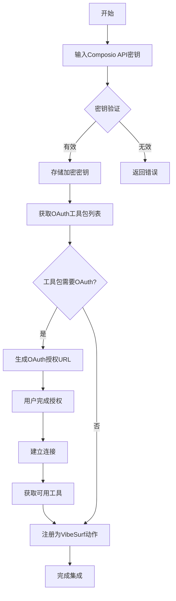

**Diagram sources**
- [backend/api/composio.py](file://vibe_surf/backend/api/composio.py#L367-L421)
- [composio_api.py](file://vibe_surf/workflows/Integrations/composio_api.py#L207-L226)

### API请求封装
Composio客户端通过动态创建Pydantic模型来封装API请求参数。系统解析JSON Schema定义，将其转换为Python类型，并创建相应的参数模型。每个Composio工具都被包装成一个异步函数，该函数处理参数验证、执行调用和结果格式化。

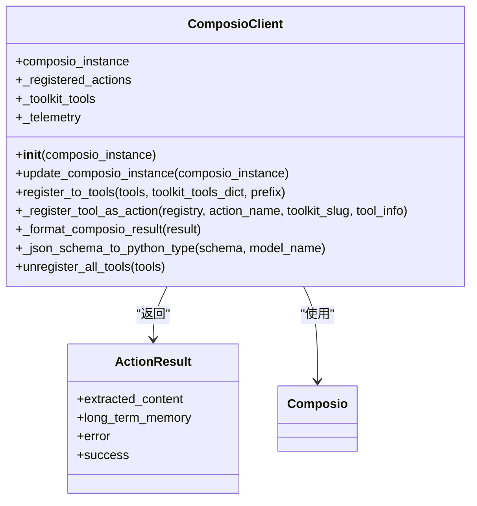

**Diagram sources**
- [composio_client.py](file://vibe_surf/tools/composio_client.py#L39-L458)

### 错误处理和重试策略
系统实现了全面的错误处理机制，包括异常捕获、错误日志记录和遥测数据收集。对于API调用失败，系统会记录详细的错误信息，并通过遥测服务进行监控。重试策略在前端JavaScript代码中实现，对网络错误进行指数退避重试，但对客户端错误（4xx状态码）不进行重试。

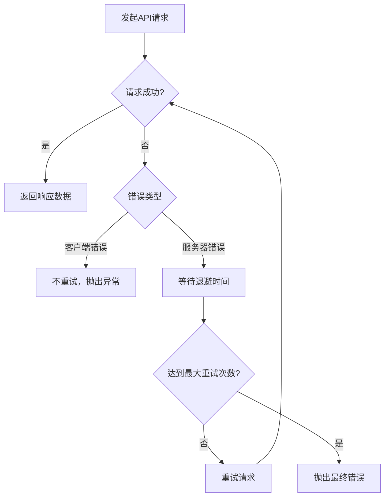

**Diagram sources**
- [composio_client.py](file://vibe_surf/tools/composio_client.py#L197-L238)
- [api-client.js](file://vibe_surf/chrome_extension/scripts/api-client.js#L66-L118)

**Section sources**
- [composio_client.py](file://vibe_surf/tools/composio_client.py#L1-L458)
- [api-client.js](file://vibe_surf/chrome_extension/scripts/api-client.js#L43-L136)

## MCP协议客户端

### 通信模式
MCP（Model Context Protocol）客户端采用标准输入输出（stdio）和服务器发送事件（SSE）两种通信模式。Stdio模式用于启动和管理MCP服务器进程，而SSE模式用于实时双向通信。客户端通过异步任务管理连接生命周期，并实现连接状态监控和自动重连机制。

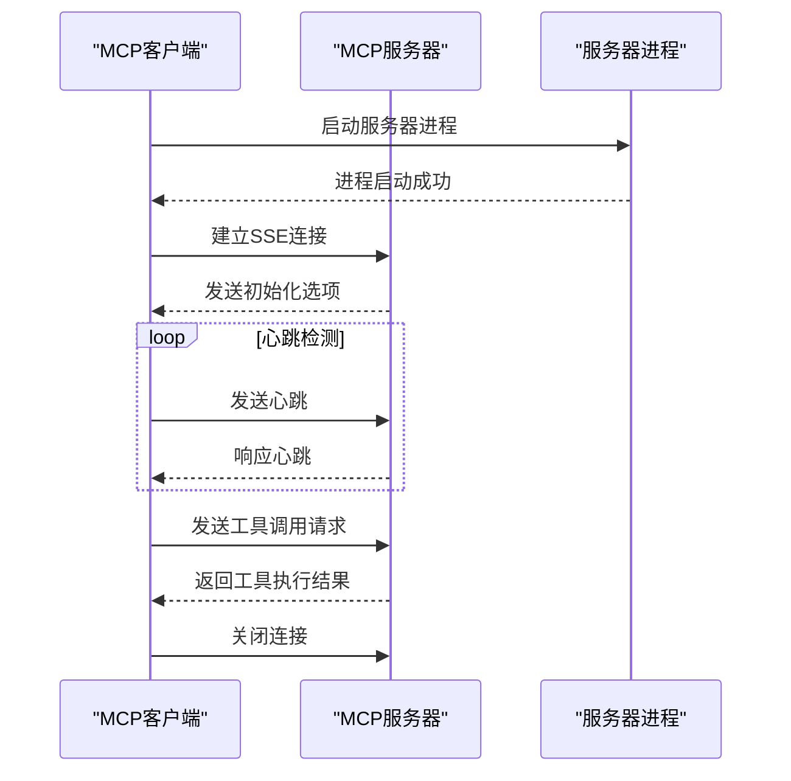

**Diagram sources**
- [mcp_client.py](file://vibe_surf/tools/mcp_client.py#L17-L85)
- [mcp.py](file://vibe_surf/langflow/api/v1/mcp.py#L84-L104)

### 消息格式
MCP协议使用JSON格式的消息进行通信，包含初始化、工具调用、资源读取等操作。消息结构遵循MCP规范，包含操作类型、参数和元数据。系统通过Pydantic模型进行消息验证，确保数据完整性和类型安全。

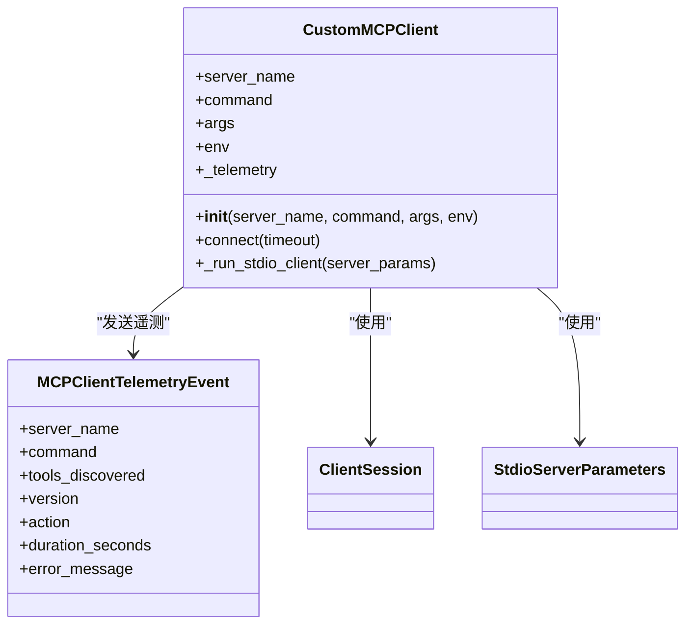

**Diagram sources**
- [mcp_client.py](file://vibe_surf/tools/mcp_client.py#L17-L85)
- [mcp_component.py](file://vibe_surf/langflow/components/agents/mcp_component.py#L30-L71)

**Section sources**
- [mcp_client.py](file://vibe_surf/tools/mcp_client.py#L1-L85)
- [mcp.py](file://vibe_surf/langflow/api/v1/mcp.py#L1-L138)

## 第三方服务集成最佳实践

### 凭证管理
系统采用分层凭证管理策略，将敏感信息（如API密钥）加密存储在数据库中。凭证通过专门的服务进行访问和管理，确保安全性。系统支持多种凭证类型，包括API密钥、OAuth令牌和连接字符串，并提供统一的访问接口。

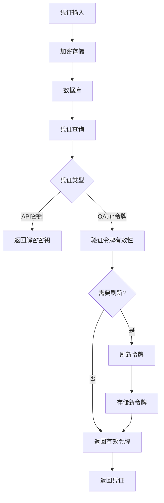

**Diagram sources**
- [backend/api/composio.py](file://vibe_surf/backend/api/composio.py#L148-L194)
- [mcp_encryption.py](file://vibe_surf/langflow/services/auth/mcp_encryption.py)

### 速率限制处理
系统实现了基于时间窗口的速率限制检测机制。通过记录操作历史，系统可以检测每小时和每日的操作频率，并在接近限制时发出警告。对于第三方API的速率限制，系统采用指数退避重试策略，避免触发服务端的限制。

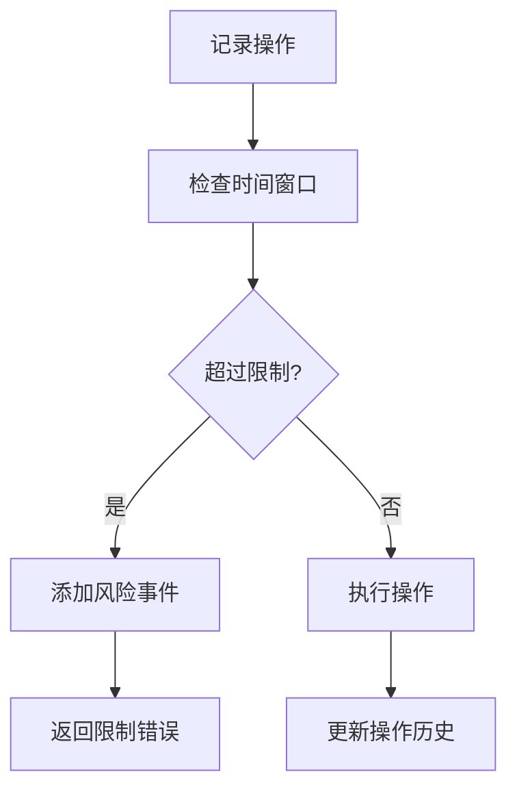

**Diagram sources**
- [anti_detection.py](file://vibe_surf/workflows/Recruitment/boss_zhipin/anti_detection.py#L201-L238)

### API版本兼容性
系统通过动态工具发现机制确保API版本兼容性。客户端在连接时获取最新的工具列表和参数定义，避免因API版本变化导致的兼容性问题。参数模型使用JSON Schema定义，支持向后兼容的字段扩展。

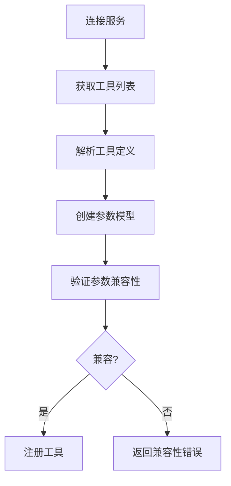

**Diagram sources**
- [composio_client.py](file://vibe_surf/tools/composio_client.py#L80-L114)
- [composio_api.py](file://vibe_surf/workflows/Integrations/composio_api.py#L243-L261)

**Section sources**
- [backend/api/composio.py](file://vibe_surf/backend/api/composio.py#L1-L1048)
- [composio_client.py](file://vibe_surf/tools/composio_client.py#L1-L458)

## 具体服务调用示例

### Gmail服务集成
Gmail服务通过Composio的Gmail工具包实现集成。系统提供了发送邮件和获取邮件列表的功能，每个功能都有相应的后处理器来格式化响应数据。集成组件继承自通用的Composio基础组件，并实现了特定的后处理逻辑。

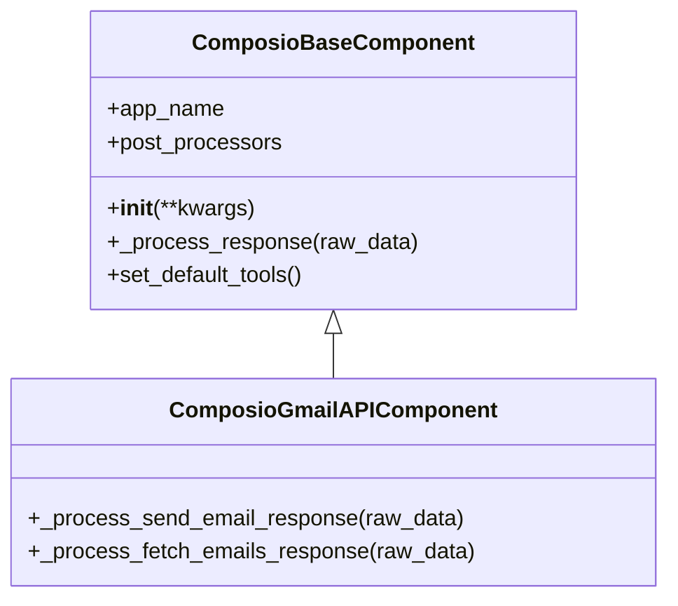

**Diagram sources**
- [gmail_composio.py](file://vibe_surf/workflows/Integrations/gmail_composio.py#L1-L39)

### Slack服务集成
Slack服务集成与Gmail类似，通过Composio的Slack工具包实现。系统提供了消息发送、频道管理等功能。集成组件定义了Slack应用名称和图标，便于在用户界面中识别。

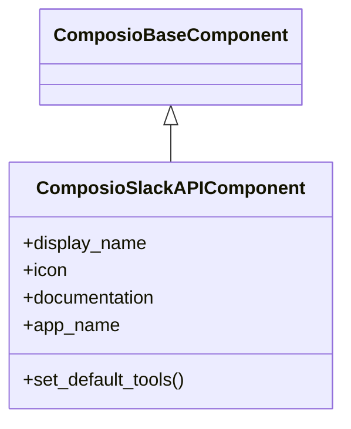

**Diagram sources**
- [slack_composio.py](file://vibe_surf/workflows/Integrations/slack_composio.py#L1-L12)

### Notion服务集成
虽然未找到具体的Notion集成文件，但根据项目结构，Notion服务应通过类似的模式实现。系统会提供页面创建、内容读取和数据库查询等功能，所有操作都通过Composio的统一接口进行。

**Section sources**
- [composio_api.py](file://vibe_surf/workflows/Integrations/composio_api.py#L1-L280)

## 扩展与接入新服务

### 现有集成扩展
要扩展现有集成，开发者可以继承相应的Composio基础组件，并添加新的后处理器或工具。例如，可以为Gmail集成添加邮件搜索功能，或为Slack集成添加文件上传功能。所有扩展都应遵循统一的错误处理和日志记录规范。

### 新服务接入流程
接入新服务的流程包括：1) 在Composio中配置新服务的连接；2) 创建新的集成组件类；3) 定义服务特定的后处理器；4) 在前端界面中注册新组件。系统会自动发现新服务的可用工具，并将其注册为VibeSurf动作。

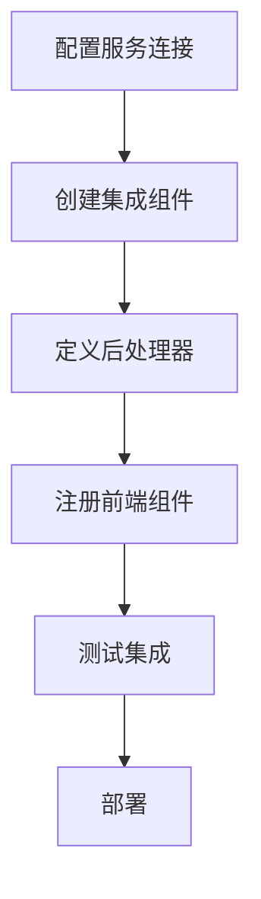

**Section sources**
- [composio_client.py](file://vibe_surf/tools/composio_client.py#L1-L458)
- [composio_api.py](file://vibe_surf/workflows/Integrations/composio_api.py#L1-L280)