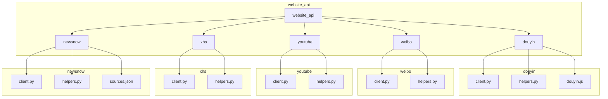
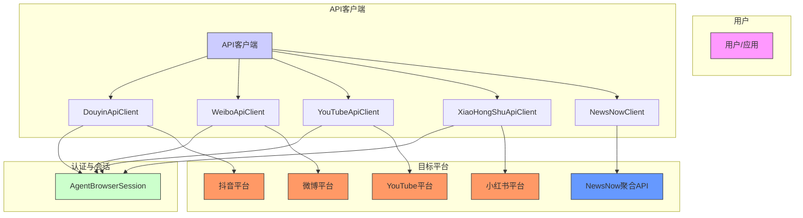
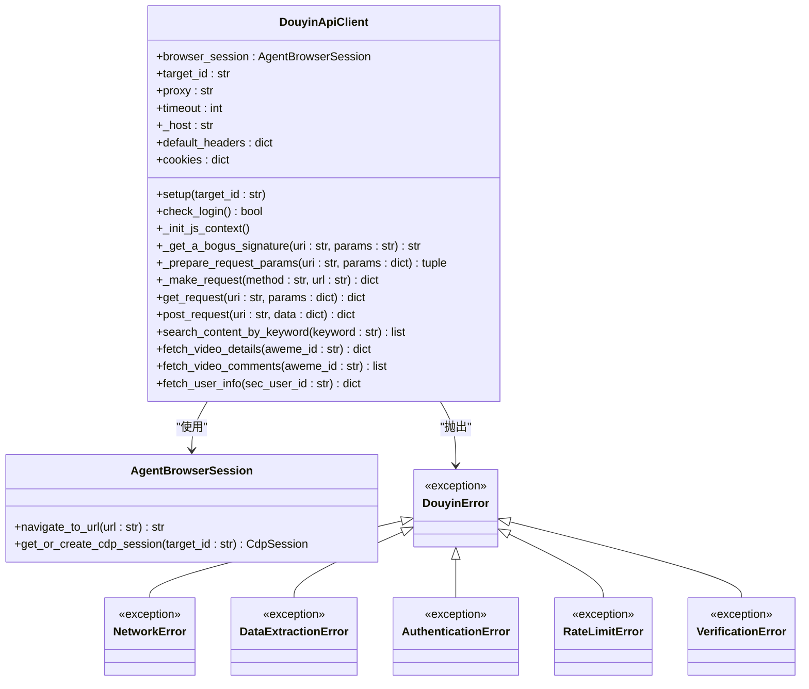
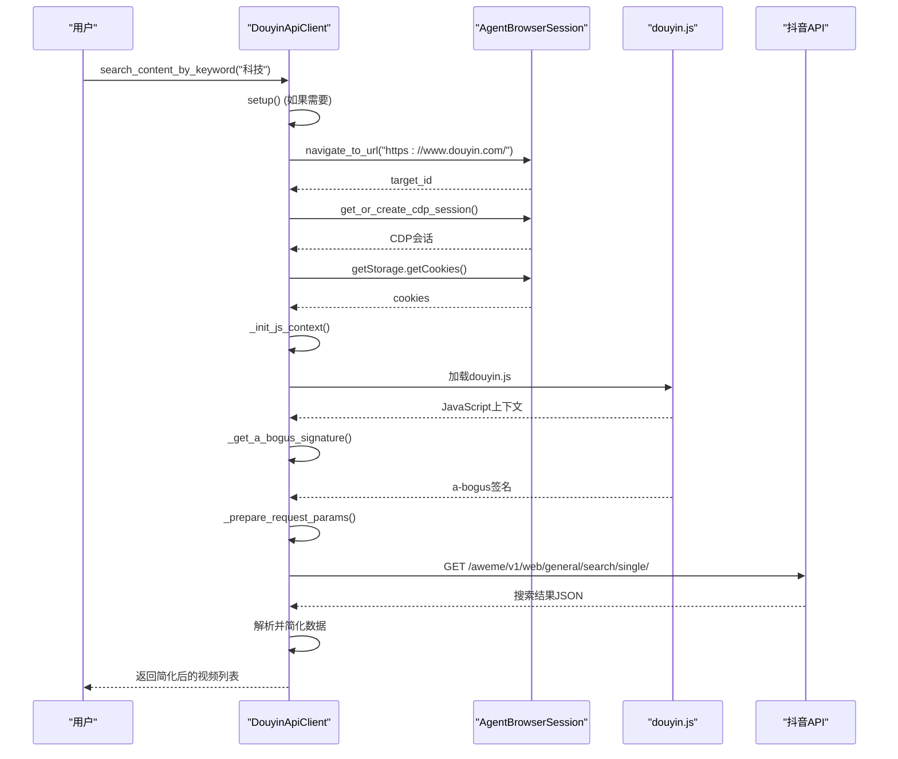
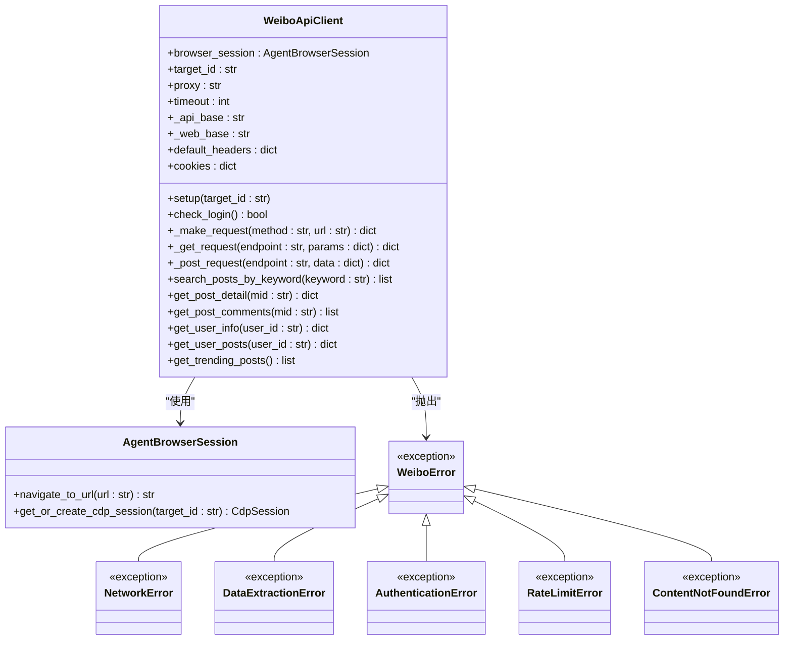
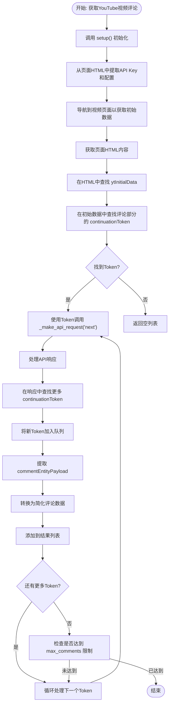
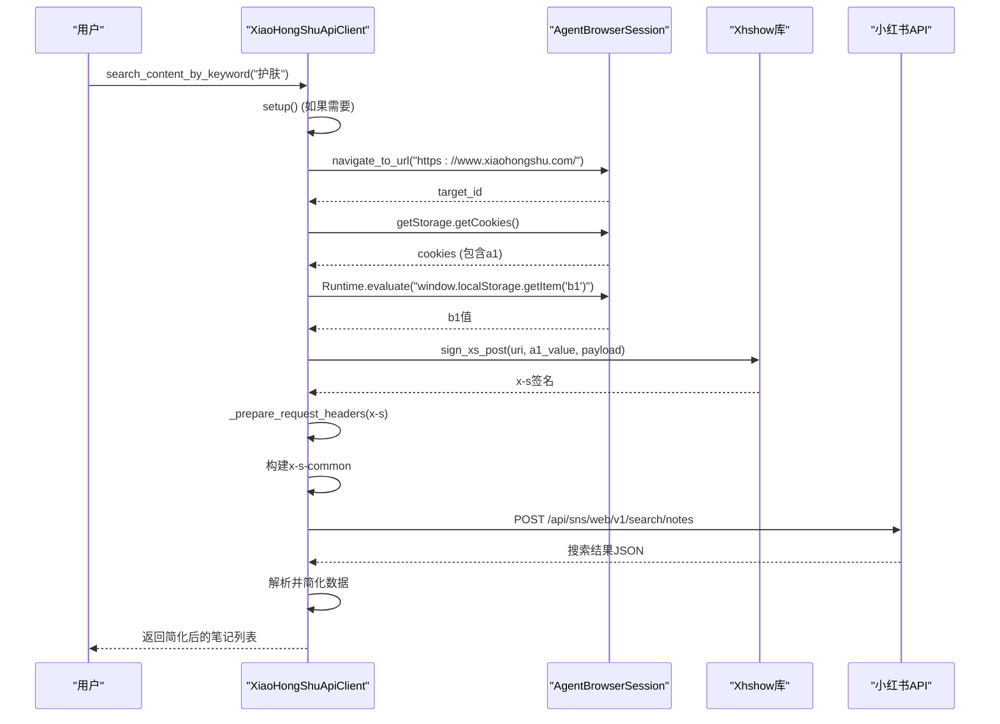
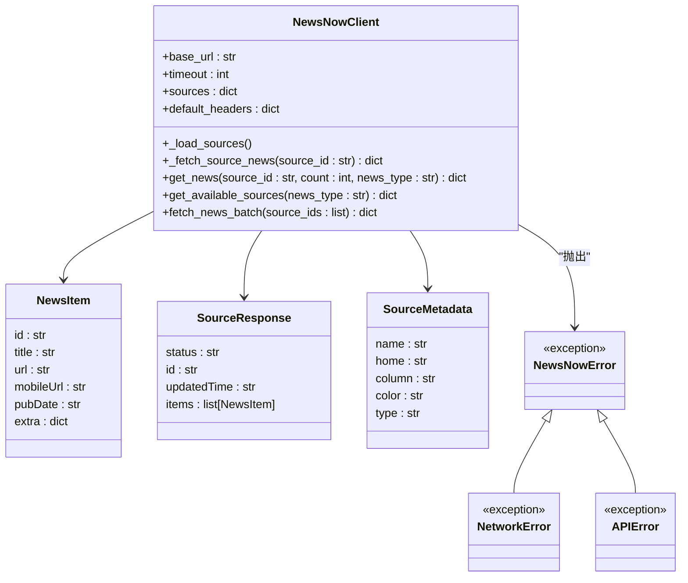
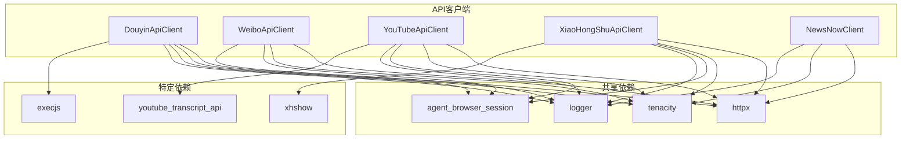

# 网站API客户端

<cite>
**本文档引用的文件**   
- [douyin/client.py](file://vibe_surf/tools/website_api/douyin/client.py)
- [douyin/helpers.py](file://vibe_surf/tools/website_api/douyin/helpers.py)
- [douyin/douyin.js](file://vibe_surf/tools/website_api/douyin/douyin.js)
- [weibo/client.py](file://vibe_surf/tools/website_api/weibo/client.py)
- [weibo/helpers.py](file://vibe_surf/tools/website_api/weibo/helpers.py)
- [youtube/client.py](file://vibe_surf/tools/website_api/youtube/client.py)
- [youtube/helpers.py](file://vibe_surf/tools/website_api/youtube/helpers.py)
- [xhs/client.py](file://vibe_surf/tools/website_api/xhs/client.py)
- [xhs/helpers.py](file://vibe_surf/tools/website_api/xhs/helpers.py)
- [newsnow/client.py](file://vibe_surf/tools/website_api/newsnow/client.py)
- [newsnow/helpers.py](file://vibe_surf/tools/website_api/newsnow/helpers.py)
</cite>

## 目录
1. [引言](#引言)
2. [项目结构](#项目结构)
3. [核心组件](#核心组件)
4. [架构概述](#架构概述)
5. [详细组件分析](#详细组件分析)
6. [依赖分析](#依赖分析)
7. [性能考虑](#性能考虑)
8. [故障排除指南](#故障排除指南)
9. [结论](#结论)

## 引言
本文档全面分析了`website_api`目录下为各类社交媒体和内容平台实现的API客户端。这些客户端为抖音、微博、YouTube、小红书等平台提供了统一的访问接口，封装了复杂的认证、请求和响应处理逻辑。文档详细阐述了这些客户端的通用架构、特定实现差异、API认证机制、请求参数处理、响应解析和分页逻辑。通过分析客户端基类的设计和继承关系，以及提供具体的使用示例，旨在为开发者提供一份全面的API使用指南，包括最佳实践、配额管理和错误处理策略。

## 项目结构
`website_api`模块的结构清晰，每个支持的平台都有一个独立的子目录。每个子目录包含`client.py`（核心客户端实现）、`helpers.py`（工具函数和数据结构）以及平台特定的辅助文件（如`douyin.js`）。这种模块化设计使得添加新平台支持变得简单，只需创建新的子目录并实现相应的客户端和工具函数即可。

**Diagram sources**
- [douyin/client.py](file://vibe_surf/tools/website_api/douyin/client.py)
- [weibo/client.py](file://vibe_surf/tools/website_api/weibo/client.py)
- [youtube/client.py](file://vibe_surf/tools/website_api/youtube/client.py)
- [xhs/client.py](file://vibe_surf/tools/website_api/xhs/client.py)
- [newsnow/client.py](file://vibe_surf/tools/website_api/newsnow/client.py)

**Section sources**
- [douyin/client.py](file://vibe_surf/tools/website_api/douyin/client.py)
- [weibo/client.py](file://vibe_surf/tools/website_api/weibo/client.py)
- [youtube/client.py](file://vibe_surf/tools/website_api/youtube/client.py)
- [xhs/client.py](file://vibe_surf/tools/website_api/xhs/client.py)
- [newsnow/client.py](file://vibe_surf/tools/website_api/newsnow/client.py)

## 核心组件
网站API客户端的核心是每个平台的`ApiClient`类，如`DouyinApiClient`、`WeiboApiClient`等。这些类都遵循相似的设计模式：通过`AgentBrowserSession`与浏览器会话集成来管理认证状态，使用`setup()`方法初始化并验证登录状态，并提供一系列方法来执行平台特定的API操作。核心功能包括请求准备、错误处理、重试机制和响应解析。

**Section sources**
- [douyin/client.py](file://vibe_surf/tools/website_api/douyin/client.py#L35-L849)
- [weibo/client.py](file://vibe_surf/tools/website_api/weibo/client.py#L31-L768)
- [youtube/client.py](file://vibe_surf/tools/website_api/youtube/client.py#L34-L1268)
- [xhs/client.py](file://vibe_surf/tools/website_api/xhs/client.py#L38-L805)

## 架构概述
整个API客户端系统采用了一种混合架构。对于抖音、微博、YouTube和小红书，客户端通过无头浏览器（`AgentBrowserSession`）进行认证，利用浏览器会话来获取和维护必要的cookies和认证令牌。这使得客户端能够绕过复杂的反爬虫机制。对于NewsNow，客户端则直接与一个聚合API进行交互，该API从多个来源抓取数据，客户端本身不处理认证。

**Diagram sources**
- [douyin/client.py](file://vibe_surf/tools/website_api/douyin/client.py)
- [weibo/client.py](file://vibe_surf/tools/website_api/weibo/client.py)
- [youtube/client.py](file://vibe_surf/tools/website_api/youtube/client.py)
- [xhs/client.py](file://vibe_surf/tools/website_api/xhs/client.py)
- [newsnow/client.py](file://vibe_surf/tools/website_api/newsnow/client.py)
- [vibe_surf/browser/agent_browser_session.py](file://vibe_surf/browser/agent_browser_session.py)

## 详细组件分析

### 抖音客户端分析
抖音客户端（`DouyinApiClient`）的实现最为复杂，因为它需要处理抖音的`a-bogus`签名。该签名是通过执行一个JavaScript文件（`douyin.js`）生成的，该文件被加载到`execjs`环境中。客户端在发送每个请求前，会调用`_get_a_bogus_signature`方法来生成这个签名，这是成功请求的关键。

#### 对象导向组件

**Diagram sources**
- [douyin/client.py](file://vibe_surf/tools/website_api/douyin/client.py)
- [douyin/helpers.py](file://vibe_surf/tools/website_api/douyin/helpers.py)
- [vibe_surf/browser/agent_browser_session.py](file://vibe_surf/browser/agent_browser_session.py)

#### API服务组件

**Diagram sources**
- [douyin/client.py](file://vibe_surf/tools/website_api/douyin/client.py)
- [douyin/douyin.js](file://vibe_surf/tools/website_api/douyin/douyin.js)
- [vibe_surf/browser/agent_browser_session.py](file://vibe_surf/browser/agent_browser_session.py)

**Section sources**
- [douyin/client.py](file://vibe_surf/tools/website_api/douyin/client.py#L35-L849)
- [douyin/helpers.py](file://vibe_surf/tools/website_api/douyin/helpers.py#L1-L239)
- [douyin/douyin.js](file://vibe_surf/tools/website_api/douyin/douyin.js)

### 微博客户端分析
微博客户端（`WeiboApiClient`）相对简单，主要通过移动版API（`m.weibo.cn`）进行交互。它依赖于从浏览器会话中提取的cookies进行认证，并通过`check_login()`方法验证登录状态。其核心是`_make_request`方法，该方法处理错误码（如403、429）并根据微博API的响应格式（`ok`字段）来判断请求成功与否。

#### 对象导向组件

**Diagram sources**
- [weibo/client.py](file://vibe_surf/tools/website_api/weibo/client.py)
- [weibo/helpers.py](file://vibe_surf/tools/website_api/weibo/helpers.py)
- [vibe_surf/browser/agent_browser_session.py](file://vibe_surf/browser/agent_browser_session.py)

**Section sources**
- [weibo/client.py](file://vibe_surf/tools/website_api/weibo/client.py#L31-L768)
- [weibo/helpers.py](file://vibe_surf/tools/website_api/weibo/helpers.py#L1-L997)

### YouTube客户端分析
YouTube客户端（`YouTubeApiClient`）通过YouTube的内部API（`youtubei/v1`）进行通信。它需要从页面中提取`API Key`和`clientVersion`等配置信息。客户端使用`_make_api_request`方法构建包含`context`对象的POST请求。获取视频评论的流程较为复杂，需要先从视频页面的HTML中提取初始数据，然后找到评论部分的`continuationToken`，再通过API进行分页请求。

#### 复杂逻辑组件

**Diagram sources**
- [youtube/client.py](file://vibe_surf/tools/website_api/youtube/client.py)
- [youtube/helpers.py](file://vibe_surf/tools/website_api/youtube/helpers.py)

**Section sources**
- [youtube/client.py](file://vibe_surf/tools/website_api/youtube/client.py#L34-L1268)
- [youtube/helpers.py](file://vibe_surf/tools/website_api/youtube/helpers.py#L1-L420)

### 小红书客户端分析
小红书客户端（`XiaoHongShuApiClient`）使用一个名为`xhshow`的外部库来生成`x-s`签名。该签名是通过`sign_xs_get`和`sign_xs_post`方法生成的。客户端在请求头中包含`x-s-common`，该值是通过对包含`a1`、`b1`、`x-s`和`x-t`等关键信息的JSON对象进行自定义的Base64编码生成的。

#### API服务组件

**Diagram sources**
- [xhs/client.py](file://vibe_surf/tools/website_api/xhs/client.py)
- [xhs/helpers.py](file://vibe_surf/tools/website_api/xhs/helpers.py)
- [vibe_surf/browser/agent_browser_session.py](file://vibe_surf/browser/agent_browser_session.py)

**Section sources**
- [xhs/client.py](file://vibe_surf/tools/website_api/xhs/client.py#L38-L805)
- [xhs/helpers.py](file://vibe_surf/tools/website_api/xhs/helpers.py#L1-L303)

### NewsNow客户端分析
NewsNow客户端（`NewsNowClient`）是一个聚合客户端，它不直接与社交媒体平台交互，而是与一个名为`newsnow`的聚合API服务通信。该服务负责从抖音、微博、GitHub等数十个来源抓取数据。客户端通过`get_news()`方法，可以按来源ID或新闻类型（实时、最热）批量获取新闻。

#### 对象导向组件

**Diagram sources**
- [newsnow/client.py](file://vibe_surf/tools/website_api/newsnow/client.py)
- [newsnow/helpers.py](file://vibe_surf/tools/website_api/newsnow/helpers.py)

**Section sources**
- [newsnow/client.py](file://vibe_surf/tools/website_api/newsnow/client.py#L22-L385)
- [newsnow/helpers.py](file://vibe_surf/tools/website_api/newsnow/helpers.py#L1-L118)

## 依赖分析
这些API客户端共享一些核心依赖。它们都依赖于`httpx`库进行异步HTTP请求，依赖于`tenacity`库进行重试，依赖于`vibe_surf.browser.agent_browser_session`进行浏览器会话管理，以及`vibe_surf.logger`进行日志记录。此外，每个客户端都依赖于其`helpers.py`文件中定义的工具函数和异常类。抖音客户端额外依赖`execjs`来执行JavaScript，小红书客户端依赖`xhshow`库来生成签名。

**Diagram sources**
- [douyin/client.py](file://vibe_surf/tools/website_api/douyin/client.py)
- [weibo/client.py](file://vibe_surf/tools/website_api/weibo/client.py)
- [youtube/client.py](file://vibe_surf/tools/website_api/youtube/client.py)
- [xhs/client.py](file://vibe_surf/tools/website_api/xhs/client.py)
- [newsnow/client.py](file://vibe_surf/tools/website_api/newsnow/client.py)

**Section sources**
- [douyin/client.py](file://vibe_surf/tools/website_api/douyin/client.py)
- [weibo/client.py](file://vibe_surf/tools/website_api/weibo/client.py)
- [youtube/client.py](file://vibe_surf/tools/website_api/youtube/client.py)
- [xhs/client.py](file://vibe_surf/tools/website_api/xhs/client.py)
- [newsnow/client.py](file://vibe_surf/tools/website_api/newsnow/client.py)

## 性能考虑
为了提高性能，客户端采用了多种策略。首先，使用`AgentBrowserSession`复用浏览器实例，避免了为每个请求创建新会话的开销。其次，`NewsNowClient`提供了批量获取新闻的`fetch_news_batch`方法，减少了网络往返次数。此外，`tenacity`库的重试机制可以处理临时的网络错误，避免了因短暂故障而导致的请求失败。对于分页操作，如`fetch_all_video_comments`，客户端允许用户设置`fetch_interval`来控制请求频率，从而避免触发平台的速率限制。

## 故障排除指南
当API客户端出现问题时，应首先检查以下几点：
1.  **认证状态**：确保`setup()`方法已成功执行且`check_login()`返回`True`。如果失败，请确认已在浏览器中登录相应平台。
2.  **网络连接**：检查网络是否正常，代理设置是否正确。
3.  **速率限制**：如果收到`RateLimitError`，说明请求过于频繁。应增加请求间隔或减少并发量。
4.  **平台变更**：社交媒体平台的API和反爬虫机制会频繁更新。如果客户端突然失效，很可能是平台变更导致。需要检查`helpers.py`中的参数（如抖音的`common_params`）或签名生成逻辑是否需要更新。
5.  **异常处理**：所有客户端都抛出特定的异常（如`AuthenticationError`, `DataExtractionError`），应捕获这些异常并进行相应的处理。

**Section sources**
- [douyin/client.py](file://vibe_surf/tools/website_api/douyin/client.py)
- [weibo/client.py](file://vibe_surf/tools/website_api/weibo/client.py)
- [youtube/client.py](file://vibe_surf/tools/website_api/youtube/client.py)
- [xhs/client.py](file://vibe_surf/tools/website_api/xhs/client.py)
- [newsnow/client.py](file://vibe_surf/tools/website_api/newsnow/client.py)

## 结论
本文档详细分析了`website_api`模块中为多个社交媒体平台实现的API客户端。这些客户端通过统一的模式（基于浏览器会话的认证、错误处理、响应简化）提供了对不同平台的访问能力。尽管每个平台的实现细节（如抖音的`a-bogus`签名、小红书的`x-s`签名）各不相同，但其核心架构保持了一致性。开发者在使用这些客户端时，应遵循最佳实践，注意配额管理，并妥善处理可能出现的错误，以确保应用的稳定性和可靠性。