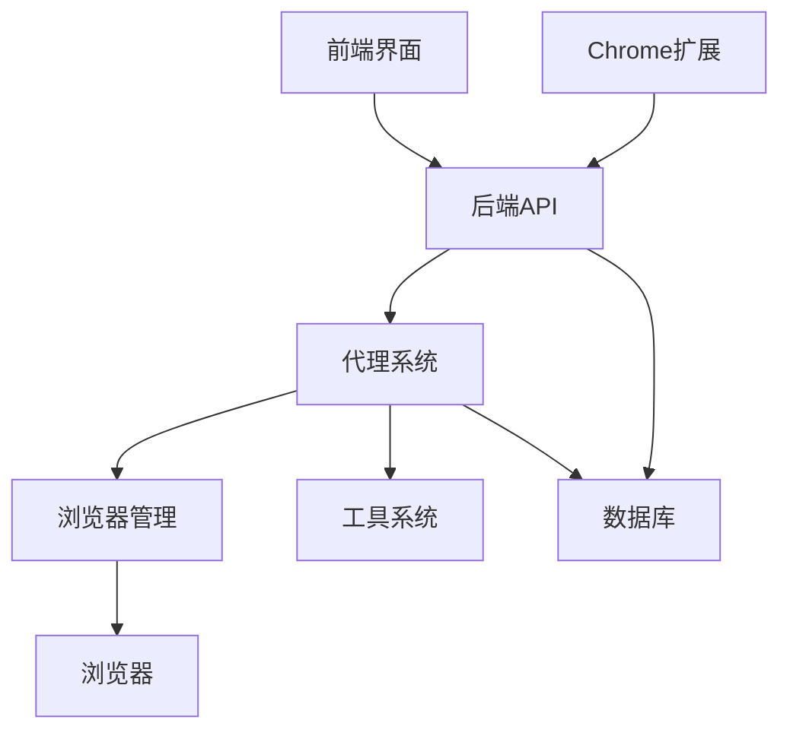
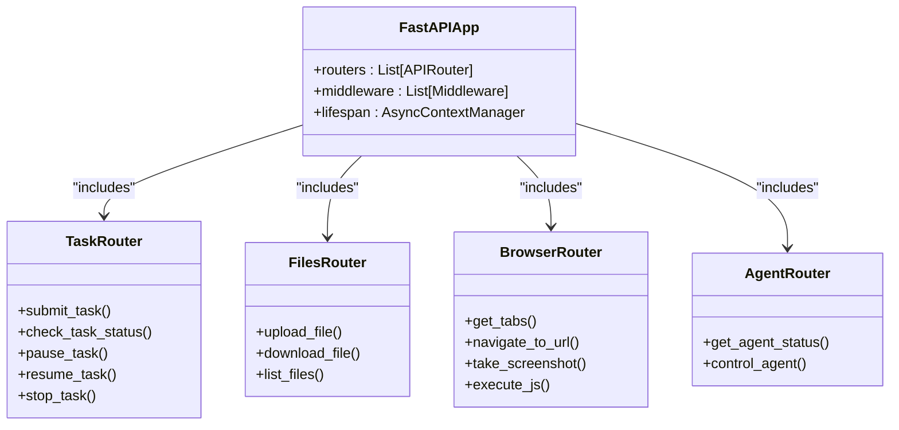
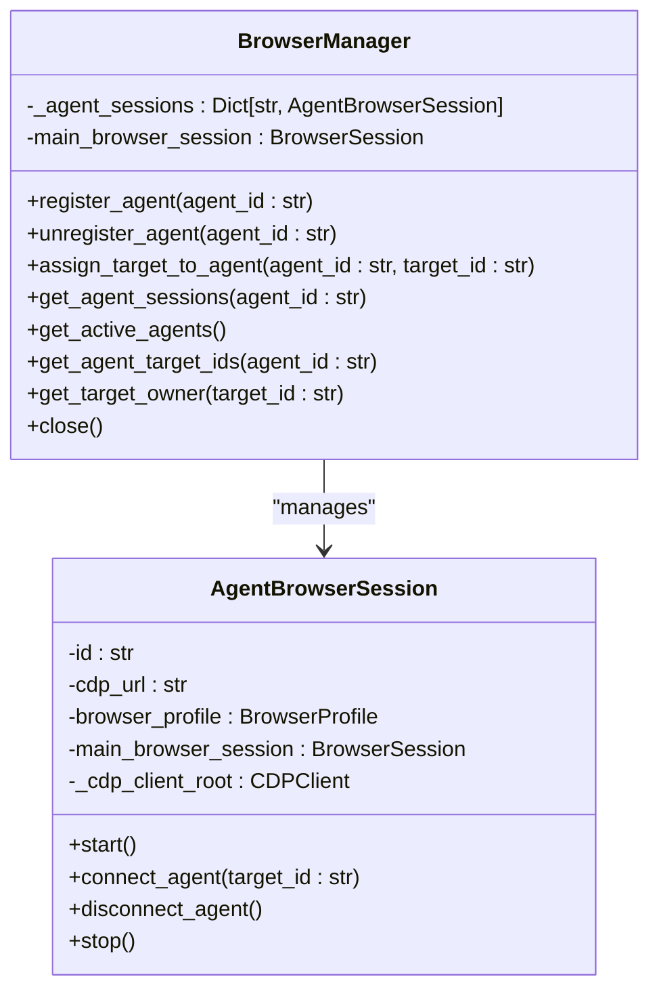
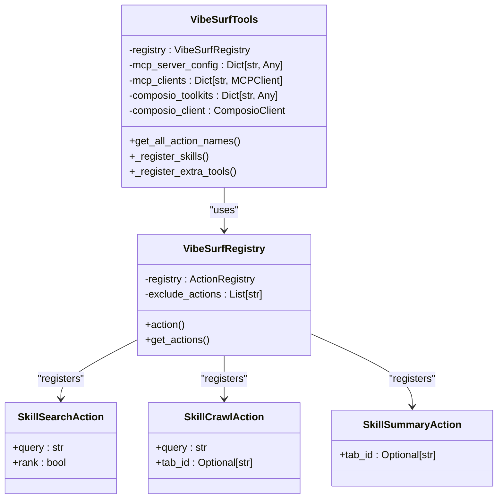
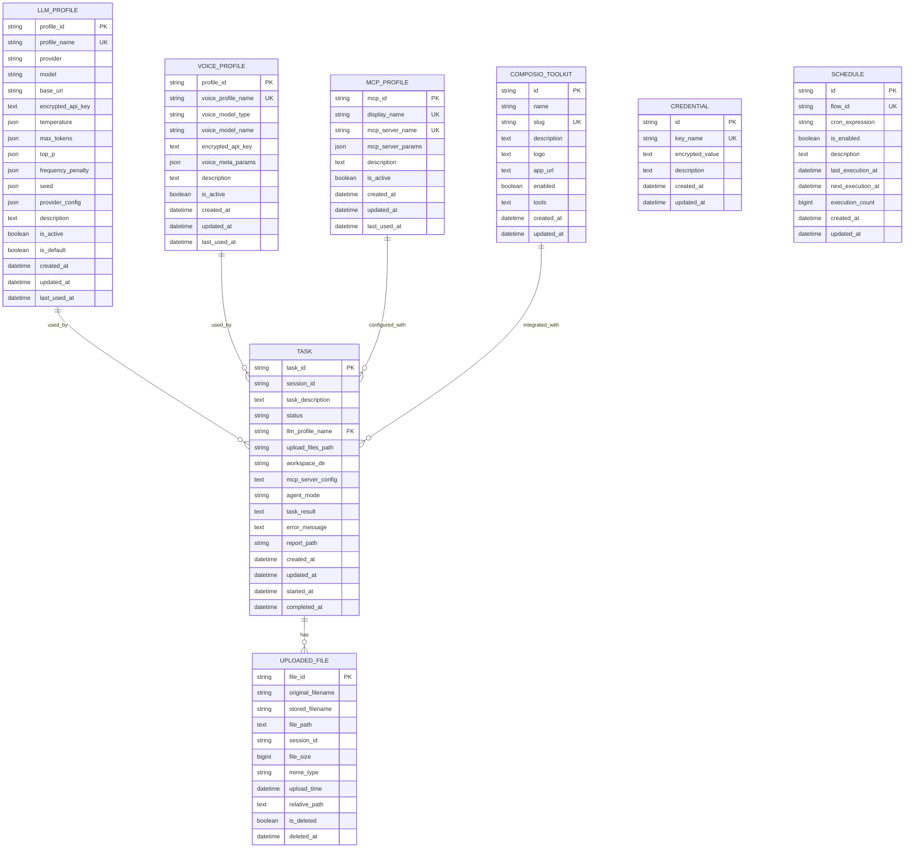

# 开发者指南

<cite>
**本文档引用的文件**   
- [README.md](file://README.md)
- [pyproject.toml](file://pyproject.toml)
- [vibe_surf/backend/main.py](file://vibe_surf/backend/main.py)
- [vibe_surf/frontend/package.json](file://vibe_surf/frontend/package.json)
- [vibe_surf/cli.py](file://vibe_surf/cli.py)
- [vibe_surf/backend/api/task.py](file://vibe_surf/backend/api/task.py)
- [vibe_surf/backend/database/models.py](file://vibe_surf/backend/database/models.py)
- [vibe_surf/browser/browser_manager.py](file://vibe_surf/browser/browser_manager.py)
- [vibe_surf/tools/vibesurf_tools.py](file://vibe_surf/tools/vibesurf_tools.py)
- [vibe_surf/frontend/playwright.config.ts](file://vibe_surf/frontend/playwright.config.ts)
- [vibe_surf/frontend/run-tests.sh](file://vibe_surf/frontend/run-tests.sh)
- [vibe_surf/frontend/jest.config.js](file://vibe_surf/frontend/jest.config.js)
- [vibe_surf/frontend/tsconfig.json](file://vibe_surf/frontend/tsconfig.json)
- [tests/test_agents.py](file://tests/test_agents.py)
- [tests/test_browser.py](file://tests/test_browser.py)
</cite>

## 目录
1. [项目结构](#项目结构)
2. [开发环境设置](#开发环境设置)
3. [代码结构](#代码结构)
4. [测试策略](#测试策略)
5. [贡献流程](#贡献流程)
6. [调试技巧](#调试技巧)
7. [代码质量要求](#代码质量要求)
8. [新功能开发指导](#新功能开发指导)

## 项目结构

VibeSurf项目采用模块化架构，主要分为以下几个核心目录：

- **docs/**: 包含可执行构建、Nuitka构建和PyPI设置等文档
- **scripts/**: 包含构建安装程序和wheel包的脚本
- **tests/**: 包含所有测试文件，涵盖代理、API工具、后端API、浏览器功能等
- **vibe_surf/**: 核心源代码目录，包含代理、后端、浏览器、Chrome扩展、前端、langflow等子模块
- **.env.example**: 环境变量示例文件

项目采用Python作为主要后端语言，前端使用React技术栈，通过FastAPI提供RESTful API接口。Chrome扩展实现了与浏览器的深度集成，而langflow模块提供了可视化工作流功能。

**Section sources**
- [README.md](file://README.md#L1-L186)

## 开发环境设置

### 依赖安装

根据[README.md](file://README.md#L85-L106)中的贡献者指南，设置开发环境的步骤如下：

1. **克隆仓库**
```bash
git clone https://github.com/vibesurf-ai/VibeSurf.git
cd VibeSurf
```

2. **设置虚拟环境**
```bash
# MacOS/Linux
uv venv --python 3.12
source .venv/bin/activate
uv pip install -e .

# Windows
uv venv --python 3.12
.venv\Scripts\activate
uv pip install -e .
```

3. **前端构建（可选）**
如果需要修改前端代码，需要构建并复制前端到后端目录：
```bash
cd vibe_surf/frontend
npm ci
npm run build
mkdir -p ../backend/frontend
cp -r build/* ../backend/frontend/
```

### 本地运行

启动调试有两种方式：

**方式1：直接服务器**
```bash
uvicorn vibe_surf.backend.main:app --host 127.0.0.1 --port 9335
```

**方式2：CLI入口**
```bash
uv run vibesurf
```

### 依赖管理

项目使用`pyproject.toml`进行依赖管理，主要依赖包括：
- FastAPI: 用于构建RESTful API
- LangGraph: 用于构建代理工作流
- Langflow: 提供可视化工作流界面
- Playwright: 用于浏览器自动化测试
- uv: 作为包管理器

**Section sources**
- [README.md](file://README.md#L85-L135)
- [pyproject.toml](file://pyproject.toml#L1-L282)

## 代码结构

### 核心组件

VibeSurf的核心架构由多个相互协作的组件构成，主要包括：

- **代理系统**：实现智能浏览器自动化
- **后端API**：提供RESTful接口
- **浏览器管理**：管理浏览器会话和标签页
- **工具系统**：提供各种功能工具
- **前端界面**：用户交互界面
- **Chrome扩展**：实现浏览器深度集成



**Diagram sources**
- [vibe_surf/backend/main.py](file://vibe_surf/backend/main.py#L1-L794)
- [vibe_surf/cli.py](file://vibe_surf/cli.py#L1-L562)

### 后端架构

后端主要由FastAPI应用构成，通过`vibe_surf/backend/main.py`文件中的`create_app()`函数创建应用实例。应用包含多个API路由器，分别处理不同类型的请求：

- `/api/tasks`: 任务管理
- `/api/files`: 文件操作
- `/api/activity`: 活动记录
- `/api/config`: 配置管理
- `/api/browser`: 浏览器操作
- `/api/voices`: 语音功能
- `/api/agent`: 代理管理
- `/api/composio`: Composio集成
- `/api/schedule`: 调度管理
- `/api/vibesurf`: VibeSurf核心功能



**Diagram sources**
- [vibe_surf/backend/main.py](file://vibe_surf/backend/main.py#L38-L47)
- [vibe_surf/backend/api/task.py](file://vibe_surf/backend/api/task.py#L31-L379)

### 浏览器管理

浏览器管理是VibeSurf的核心功能之一，通过`BrowserManager`类实现多代理的浏览器会话管理。`BrowserManager`负责：

- 注册和注销代理
- 分配和管理浏览器标签页
- 确保代理间的隔离性
- 监控浏览器连接状态



**Diagram sources**
- [vibe_surf/browser/browser_manager.py](file://vibe_surf/browser/browser_manager.py#L24-L269)

### 工具系统

工具系统通过`VibeSurfTools`类实现，提供了一系列功能工具，包括：

- 技能搜索
- 内容爬取
- 网页摘要
- 截图功能
- JavaScript代码执行
- 金融数据获取
- 社交媒体集成



**Diagram sources**
- [vibe_surf/tools/vibesurf_tools.py](file://vibe_surf/tools/vibesurf_tools.py#L72-L800)

### 数据库模型

项目使用SQLAlchemy定义了多个数据库模型，用于持久化存储各种数据：



**Diagram sources**
- [vibe_surf/backend/database/models.py](file://vibe_surf/backend/database/models.py#L1-L289)

**Section sources**
- [vibe_surf/backend/main.py](file://vibe_surf/backend/main.py#L38-L47)
- [vibe_surf/backend/api/task.py](file://vibe_surf/backend/api/task.py#L31-L379)
- [vibe_surf/browser/browser_manager.py](file://vibe_surf/browser/browser_manager.py#L24-L269)
- [vibe_surf/tools/vibesurf_tools.py](file://vibe_surf/tools/vibesurf_tools.py#L72-L800)
- [vibe_surf/backend/database/models.py](file://vibe_surf/backend/database/models.py#L1-L289)

## 测试策略

### 单元测试

项目使用`pytest`框架进行单元测试，测试文件位于`tests/`目录下。主要测试文件包括：

- `test_agents.py`: 测试代理功能
- `test_api_tools.py`: 测试API工具
- `test_backend_api.py`: 测试后端API
- `test_browser.py`: 测试浏览器功能
- `test_telemetry.py`: 测试遥测功能
- `test_tools.py`: 测试工具功能
- `test_voice_api.py`: 测试语音API

测试用例覆盖了核心功能，包括代理隔离、浏览器状态捕获、任务控制等。例如，在`test_browser.py`中，`test_multi_agent_isolation()`函数验证了多个代理可以同时在不同页面上操作：

```python
async def test_multi_agent_isolation(manager: BrowserManager):
    """Verify that two agents can operate on separate pages concurrently."""
    logging.info("--- Running Test: Multi-Agent Isolation ---")
    agent1 = await manager.register_agent("agent-iso-1")
    agent2 = await manager.register_agent("agent-iso-2")

    nav1 = agent1.event_bus.dispatch(
        NavigateToUrlEvent(url=f"https://www.google.com/search?q=browser-use")
    )
    nav2 = agent2.event_bus.dispatch(
        NavigateToUrlEvent(url=f"https://www.google.com/search?q=langflow")
    )
    await asyncio.gather(nav1, nav2)
    logging.info("✅ Agents navigated to different pages concurrently.")
    await asyncio.sleep(3)
```

### 集成测试

集成测试主要通过Playwright实现，位于`vibe_surf/frontend/tests/`目录下。Playwright配置文件`playwright.config.ts`定义了测试环境：

```typescript
export default defineConfig({
  testDir: "./tests",
  fullyParallel: true,
  forbidOnly: !!process.env.CI,
  retries: process.env.CI ? 2 : 3,
  workers: 2,
  timeout: 5 * 60 * 1000, // 5 minutes
  reporter: process.env.CI ? "blob" : "html",
  use: {
    baseURL: `http://localhost:${PORT || 3000}/`,
    trace: "on-first-retry",
  },
  globalTeardown: require.resolve("./tests/globalTeardown.ts"),
  projects: [
    {
      name: "chromium",
      use: {
        ...devices["Desktop Chrome"],
        launchOptions: {
          // headless: false,
        },
        contextOptions: {
          permissions: ["clipboard-read", "clipboard-write"],
        },
      },
    },
  ],
  webServer: [
    {
      command:
        "uv run uvicorn --factory langflow.main:create_app --host localhost --port 7860 --loop asyncio",
      port: 7860,
      env: {
        LANGFLOW_DATABASE_URL: "sqlite:///./temp",
        LANGFLOW_AUTO_LOGIN: "true",
      },
      stdout: "ignore",
      reuseExistingServer: true,
      timeout: 120 * 750,
    },
    {
      command: "npm start",
      port: PORT || 3000,
      env: {
        VITE_PROXY_TARGET: "http://localhost:7860",
      },
      reuseExistingServer: true,
    },
  ],
});
```

### 端到端测试

端到端测试通过`run-tests.sh`脚本执行，该脚本自动化了测试环境的搭建和测试运行：

```bash
#!/bin/bash

# Default value for the --ui flag
ui=false

# Absolute path to the project root directory
PROJECT_ROOT="../..//"

# Check if necessary commands are available
for cmd in npx poetry fuser; do
    if ! command -v $cmd &> /dev/null; then
        echo "Error: Required command '$cmd' is not installed. Aborting."
        exit 1
    fi
done

# Parse command-line arguments
while [[ $# -gt 0 ]]; do
    key="$1"
    case $key in
        --ui)
            ui=true
            shift
            ;;
        *)
            echo "Unknown option: $key"
            exit 1
            ;;
    esac
    shift
done

# Function to forcibly terminate a process by port
terminate_process_by_port() {
    port="$1"
    echo "Terminating process on port: $port"
    if ! fuser -k -n tcp "$port"; then
        echo "Failed to terminate process on port $port. Please check manually."
    else
        echo "Process terminated."
    fi
}

delete_temp() {
    if cd "$PROJECT_ROOT"; then
        echo "Deleting temp database"
        rm -f temp && echo "Temp database deleted." || echo "Failed to delete temp database."
    else
        echo "Failed to navigate to project root for cleanup."
    fi
}

# Trap signals to ensure cleanup on script termination
trap 'terminate_process_by_port 7860; terminate_process_by_port 3000; delete_temp' EXIT

# Ensure the script is executed from the project root directory
if ! cd "$PROJECT_ROOT"; then
    echo "Error: Failed to navigate to project root directory. Aborting."
    exit 1
fi

# Install playwright if not installed yet
if ! npx playwright install; then
    echo "Error: Failed to install Playwright. Aborting."
    exit 1
fi

# Start the frontend
make frontend > /dev/null 2>&1 &

# Adjust sleep duration as needed
sleep 10

# Install backend dependencies
if ! poetry install; then
    echo "Error: Failed to install backend dependencies. Aborting."
    exit 1
fi

# Start the backend
LANGFLOW_DATABASE_URL=sqlite:///./temp LANGFLOW_AUTO_LOGIN=True poetry run langflow run --backend-only --port 7860 --host 0.0.0.0 --no-open-browser > /dev/null 2>&1 &
backend_pid=$!  # Capture PID of the backend process
# Adjust sleep duration as needed
sleep 25

# Navigate to the test directory
if ! cd src/frontend; then
    echo "Error: Failed to navigate to test directory. Aborting."
    kill $backend_pid  # Terminate the backend process if navigation fails
    echo "Backend process terminated."
    exit 1
fi

# Check if backend is running
if ! lsof -i :7860; then
    echo "Error: Backend is not running. Aborting."
    exit 1
fi

# Run Playwright tests
if [ "$ui" = true ]; then
    TEST_COMMAND="npx playwright test tests/core --ui --project=chromium"
else
    TEST_COMMAND="npx playwright test tests/core --project=chromium"
fi

if ! PLAYWRIGHT_HTML_REPORT=playwright-report/e2e $TEST_COMMAND; then
    echo "Error: Playwright tests failed. Aborting."
    exit 1
fi

if [ "$ui" = true ]; then
    echo "Opening Playwright report..."
    npx playwright show-report
fi

trap 'terminate_process_by_port 7860; terminate_process_by_port 3000; delete_temp; kill $backend_pid 2>/dev/null' EXIT
```

### 测试覆盖率

项目使用Jest进行前端测试，配置文件`jest.config.js`中定义了覆盖率报告：

```javascript
module.exports = {
  preset: "ts-jest",
  testEnvironment: "jsdom",
  injectGlobals: true,
  moduleNameMapper: {
    "^@/(.*)$": "<rootDir>/src/$1",
    "\\.(css|less|scss|sass)$": "identity-obj-proxy",
    "^@jsonquerylang/jsonquery$":
      "<rootDir>/src/__mocks__/@jsonquerylang/jsonquery.js",
    "^vanilla-jsoneditor$": "<rootDir>/src/__mocks__/vanilla-jsoneditor.js",
  },
  setupFilesAfterEnv: ["<rootDir>/src/setupTests.ts"],
  setupFiles: ["<rootDir>/jest.setup.js"],
  testMatch: [
    "<rootDir>/src/**/__tests__/**/*.{test,spec}.{ts,tsx}",
    "<rootDir>/src/**/*.{test,spec}.{ts,tsx}",
  ],
  testPathIgnorePatterns: ["/node_modules/", "test-utils.tsx"],
  transform: {
    "^.+\\.(ts|tsx)$": "ts-jest",
  },
  moduleFileExtensions: ["ts", "tsx", "js", "jsx", "json"],
  transformIgnorePatterns: ["node_modules/(?!(.*\\.mjs$|@testing-library))"],

  // Coverage configuration
  collectCoverageFrom: [
    "src/**/*.{ts,tsx}",
    "!src/**/*.{test,spec}.{ts,tsx}",
    "!src/**/tests/**",
    "!src/**/__tests__/**",
    "!src/setupTests.ts",
    "!src/vite-env.d.ts",
    "!src/**/*.d.ts",
  ],
  coverageDirectory: "coverage",
  coverageReporters: ["text", "lcov", "html", "json-summary"],
  coveragePathIgnorePatterns: ["/node_modules/", "/tests/"],

  // CI-specific configuration
  ...(process.env.CI === "true" && {
    reporters: [
      "default",
      [
        "jest-junit",
        {
          outputDirectory: "test-results",
          outputName: "junit.xml",
          ancestorSeparator: " › ",
          uniqueOutputName: "false",
          suiteNameTemplate: "{filepath}",
          classNameTemplate: "{classname}",
          titleTemplate: "{title}",
        },
      ],
    ],
    maxWorkers: "50%",
    verbose: true,
  }),
};
```

**Section sources**
- [tests/test_agents.py](file://tests/test_agents.py#L1-L391)
- [tests/test_browser.py](file://tests/test_browser.py#L1-L416)
- [vibe_surf/frontend/playwright.config.ts](file://vibe_surf/frontend/playwright.config.ts#L1-L128)
- [vibe_surf/frontend/run-tests.sh](file://vibe_surf/frontend/run-tests.sh#L1-L118)
- [vibe_surf/frontend/jest.config.js](file://vibe_surf/frontend/jest.config.js#L1-L61)

## 贡献流程

### 代码风格

项目遵循Python PEP 8代码风格指南，使用`black`和`isort`进行代码格式化。前端代码遵循TypeScript最佳实践，使用`prettier`进行格式化。

### 提交规范

提交信息应遵循以下格式：
```
<type>(<scope>): <subject>
<BLANK LINE>
<body>
<BLANK LINE>
<footer>
```

其中：
- `type`: 提交类型，如feat、fix、docs、style、refactor、test、chore等
- `scope`: 影响范围，如backend、frontend、cli等
- `subject`: 简短描述
- `body`: 详细描述（可选）
- `footer`: 关闭的issue或破坏性变更（可选）

### Pull Request审查流程

1. **创建分支**：从`main`分支创建新特性分支
2. **编写代码**：实现功能或修复问题
3. **运行测试**：确保所有测试通过
4. **提交PR**：创建Pull Request
5. **代码审查**：团队成员进行代码审查
6. **修改完善**：根据审查意见修改代码
7. **合并**：审查通过后合并到`main`分支

PR应包含：
- 清晰的描述
- 相关的测试
- 更新的文档（如适用）
- 截图或演示视频（如适用）

**Section sources**
- [README.md](file://README.md#L83-L135)

## 调试技巧

### 日志分析

项目使用`logging`模块进行日志记录，日志级别包括DEBUG、INFO、WARNING、ERROR和CRITICAL。可以通过设置环境变量`VIBESURF_LOG_LEVEL`来调整日志级别。

```python
from vibe_surf.logger import get_logger

logger = get_logger(__name__)

logger.debug("Debug message")
logger.info("Info message")
logger.warning("Warning message")
logger.error("Error message")
logger.critical("Critical message")
```

### 断点调试

项目支持使用`pdb`进行断点调试。在代码中插入`pdb.set_trace()`即可在该位置设置断点：

```python
import pdb

# 在需要调试的位置插入
pdb.set_trace()

# 或者使用更现代的调试器
import breakpoint
breakpoint()
```

### 性能分析工具

项目提供了多种性能分析工具：

1. **内存分析**：使用`memory_profiler`分析内存使用情况
2. **CPU分析**：使用`cProfile`分析CPU使用情况
3. **异步性能**：使用`asyncio`的调试模式分析异步性能

```python
# CPU性能分析
import cProfile
import pstats

def profile_function():
    # 要分析的函数
    pass

# 运行性能分析
profiler = cProfile.Profile()
profiler.enable()
profile_function()
profiler.disable()

# 打印性能分析结果
stats = pstats.Stats(profiler)
stats.sort_stats('cumulative')
stats.print_stats()
```

**Section sources**
- [vibe_surf/logger.py](file://vibe_surf/logger.py)
- [vibe_surf/cli.py](file://vibe_surf/cli.py#L8-L15)

## 代码质量要求

### 静态分析

项目使用多种静态分析工具确保代码质量：

- **mypy**: 类型检查
- **flake8**: 代码风格检查
- **bandit**: 安全漏洞扫描
- **safety**: 依赖安全扫描

这些工具集成在CI/CD流程中，确保每次提交都符合代码质量标准。

### 代码覆盖率

项目要求单元测试覆盖率不低于80%。使用`pytest-cov`生成覆盖率报告：

```bash
pytest --cov=vibe_surf --cov-report=html --cov-report=xml
```

覆盖率报告会生成HTML和XML格式，便于在CI/CD系统中集成和展示。

### 安全扫描

项目使用`safety`和`bandit`进行安全扫描：

```bash
# 检查依赖安全
safety check

# 检查代码安全
bandit -r vibe_surf/
```

此外，项目还集成了Sentry进行错误监控和性能监控，确保生产环境的稳定性和可靠性。

**Section sources**
- [pyproject.toml](file://pyproject.toml#L1-L282)

## 新功能开发指导

### 设计文档编写

在开发新功能前，应编写设计文档，包括：

1. **功能描述**：详细描述功能的目的和预期行为
2. **架构设计**：描述功能的架构和组件关系
3. **API设计**：定义API接口和数据结构
4. **数据库设计**：如有需要，设计数据库表结构
5. **测试计划**：描述测试策略和测试用例
6. **部署计划**：描述部署步骤和回滚方案

设计文档应提交为GitHub Issue或Discussion，供团队讨论和评审。

### API设计原则

API设计应遵循以下原则：

1. **RESTful设计**：遵循RESTful架构风格
2. **一致性**：保持API命名和结构的一致性
3. **版本控制**：使用版本号管理API变更
4. **错误处理**：提供清晰的错误信息和状态码
5. **安全性**：实施适当的身份验证和授权
6. **文档化**：提供完整的API文档

API端点设计示例：
```
GET /api/tasks - 获取任务列表
POST /api/tasks - 创建新任务
GET /api/tasks/{task_id} - 获取特定任务
PUT /api/tasks/{task_id} - 更新任务
DELETE /api/tasks/{task_id} - 删除任务
POST /api/tasks/{task_id}/pause - 暂停任务
POST /api/tasks/{task_id}/resume - 恢复任务
POST /api/tasks/{task_id}/stop - 停止任务
```

**Section sources**
- [README.md](file://README.md#L137-L155)
- [vibe_surf/backend/api/task.py](file://vibe_surf/backend/api/task.py#L31-L379)