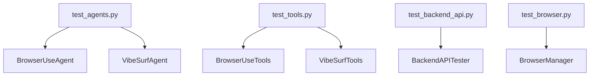
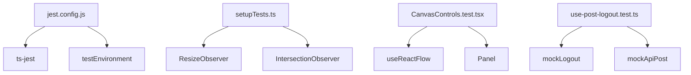
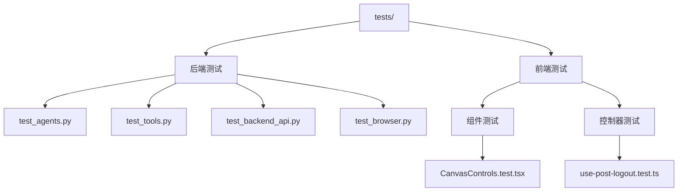
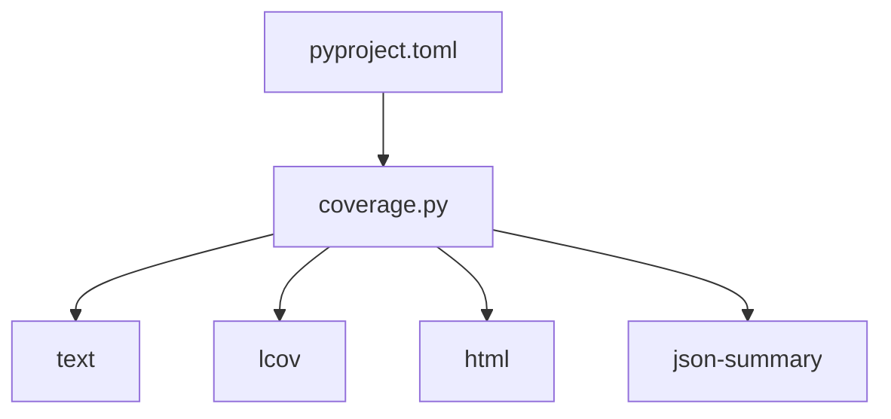

# 单元测试

<cite>
**本文档引用的文件**   
- [test_agents.py](file://tests/test_agents.py)
- [test_tools.py](file://tests/test_tools.py)
- [test_api_tools.py](file://tests/test_tools.py)
- [test_backend_api.py](file://tests/test_backend_api.py)
- [test_browser.py](file://tests/test_browser.py)
- [jest.config.js](file://vibe_surf/frontend/jest.config.js)
- [setupTests.ts](file://vibe_surf/frontend/src/setupTests.ts)
- [CanvasControls.test.tsx](file://vibe_surf/frontend/src/components/core/canvasControlsComponent/__tests__/CanvasControls.test.tsx)
- [CanvasControlsDropdown.test.tsx](file://vibe_surf/frontend/src/components/core/canvasControlsComponent/__tests__/CanvasControlsDropdown.test.tsx)
- [sidebar-localStorage.test.tsx](file://vibe_surf/frontend/src/pages/FlowPage/components/flowSidebarComponent/__tests__/sidebar-localStorage.test.tsx)
- [use-post-logout.test.ts](file://vibe_surf/frontend/src/controllers/API/queries/auth/__tests__/use-post-logout.test.ts)
- [pyproject.toml](file://pyproject.toml)
- [package.json](file://vibe_surf/frontend/package.json)
</cite>

## 目录
1. [简介](#简介)
2. [后端单元测试](#后端单元测试)
3. [前端单元测试](#前端单元测试)
4. [测试用例组织结构](#测试用例组织结构)
5. [异步函数测试](#异步函数测试)
6. [测试覆盖率](#测试覆盖率)
7. [结论](#结论)

## 简介
VibeSurf项目采用全面的单元测试策略，确保后端Python代码和前端React组件的稳定性和可靠性。本项目使用pytest进行后端测试，使用Jest和React Testing Library进行前端测试。测试覆盖了代理系统、工具函数、API路由以及React Flow节点组件和UI组件。测试用例组织清晰，使用mock对象和测试夹具来隔离依赖，确保测试的独立性和可重复性。

**Section sources**
- [test_agents.py](file://tests/test_agents.py#L1-L391)
- [test_tools.py](file://tests/test_tools.py#L1-L251)
- [jest.config.js](file://vibe_surf/frontend/jest.config.js#L1-L61)

## 后端单元测试
VibeSurf项目的后端单元测试主要使用pytest框架，针对代理系统、工具函数和API路由进行测试。测试文件位于`tests/`目录下，如`test_agents.py`、`test_tools.py`等。这些测试文件通过异步方式运行，确保与异步代码的兼容性。

**Diagram sources **
- [test_agents.py](file://tests/test_agents.py#L26-L391)
- [test_tools.py](file://tests/test_tools.py#L15-L251)
- [test_backend_api.py](file://tests/test_backend_api.py#L24-L777)
- [test_browser.py](file://tests/test_browser.py#L22-L416)

**Section sources**
- [test_agents.py](file://tests/test_agents.py#L1-L391)
- [test_tools.py](file://tests/test_tools.py#L1-L251)
- [test_backend_api.py](file://tests/test_backend_api.py#L1-L777)
- [test_browser.py](file://tests/test_browser.py#L1-L416)

### 代理系统测试
代理系统的测试主要集中在`test_agents.py`文件中，通过`test_vibe_surf_agent`和`test_vibe_surf_agent_control`函数测试VibeSurfAgent的运行和控制功能。测试包括简单任务、文件上传任务、浏览器任务和并行任务的执行。

**Section sources**
- [test_agents.py](file://tests/test_agents.py#L150-L391)

### 工具函数测试
工具函数的测试在`test_tools.py`中进行，通过`test_tools_with_mcp`、`test_filesystem`、`test_bu_tools`等函数测试不同工具的功能。这些测试确保工具函数能够正确注册MCP客户端、操作文件系统和执行财务数据检索。

**Section sources**
- [test_tools.py](file://tests/test_tools.py#L15-L129)

### API路由测试
API路由的测试在`test_backend_api.py`中实现，通过`BackendAPITester`类测试后端API的健康检查、LLM配置管理、任务生命周期、活动日志和文件上传等功能。测试确保API端点能够正确响应请求并返回预期结果。

**Section sources**
- [test_backend_api.py](file://tests/test_backend_api.py#L24-L777)

## 前端单元测试
VibeSurf项目的前端单元测试使用Jest和React Testing Library，配置在`vibe_surf/frontend/jest.config.js`中。测试文件位于`src/components/`和`src/controllers/`目录下的`__tests__`文件夹中，如`CanvasControls.test.tsx`和`use-post-logout.test.ts`。

**Diagram sources **
- [jest.config.js](file://vibe_surf/frontend/jest.config.js#L1-L61)
- [setupTests.ts](file://vibe_surf/frontend/src/setupTests.ts#L1-L63)
- [CanvasControls.test.tsx](file://vibe_surf/frontend/src/components/core/canvasControlsComponent/__tests__/CanvasControls.test.tsx#L1-L73)
- [use-post-logout.test.ts](file://vibe_surf/frontend/src/controllers/API/queries/auth/__tests__/use-post-logout.test.ts#L1-L168)

**Section sources**
- [jest.config.js](file://vibe_surf/frontend/jest.config.js#L1-L61)
- [setupTests.ts](file://vibe_surf/frontend/src/setupTests.ts#L1-L63)
- [CanvasControls.test.tsx](file://vibe_surf/frontend/src/components/core/canvasControlsComponent/__tests__/CanvasControls.test.tsx#L1-L73)
- [use-post-logout.test.ts](file://vibe_surf/frontend/src/controllers/API/queries/auth/__tests__/use-post-logout.test.ts#L1-L168)

### React Flow节点组件测试
React Flow节点组件的测试通过模拟React Flow的钩子函数，如`useReactFlow`和`useStore`，来测试组件的渲染和交互。例如，`CanvasControls.test.tsx`测试画布控制组件是否正确渲染并响应用户操作。

**Section sources**
- [CanvasControls.test.tsx](file://vibe_surf/frontend/src/components/core/canvasControlsComponent/__tests__/CanvasControls.test.tsx#L1-L73)

### UI组件测试
UI组件的测试通过模拟依赖项和断言组件行为来确保组件的正确性。例如，`use-post-logout.test.ts`测试登出功能是否正确调用API并重置应用状态。

**Section sources**
- [use-post-logout.test.ts](file://vibe_surf/frontend/src/controllers/API/queries/auth/__tests__/use-post-logout.test.ts#L1-L168)

## 测试用例组织结构
VibeSurf项目的测试用例组织结构清晰，后端测试文件按功能模块划分，前端测试文件按组件和控制器划分。测试夹具和mock对象的使用确保了测试的独立性和可重复性。

**Diagram sources **
- [test_agents.py](file://tests/test_agents.py#L1-L391)
- [test_tools.py](file://tests/test_tools.py#L1-L251)
- [test_backend_api.py](file://tests/test_backend_api.py#L1-L777)
- [test_browser.py](file://tests/test_browser.py#L1-L416)
- [CanvasControls.test.tsx](file://vibe_surf/frontend/src/components/core/canvasControlsComponent/__tests__/CanvasControls.test.tsx#L1-L73)
- [use-post-logout.test.ts](file://vibe_surf/frontend/src/controllers/API/queries/auth/__tests__/use-post-logout.test.ts#L1-L168)

**Section sources**
- [test_agents.py](file://tests/test_agents.py#L1-L391)
- [test_tools.py](file://tests/test_tools.py#L1-L251)
- [test_backend_api.py](file://tests/test_backend_api.py#L1-L777)
- [test_browser.py](file://tests/test_browser.py#L1-L416)
- [CanvasControls.test.tsx](file://vibe_surf/frontend/src/components/core/canvasControlsComponent/__tests__/CanvasControls.test.tsx#L1-L73)
- [use-post-logout.test.ts](file://vibe_surf/frontend/src/controllers/API/queries/auth/__tests__/use-post-logout.test.ts#L1-L168)

### 测试夹具和Mock对象
测试夹具和mock对象在`setupTests.ts`中定义，用于模拟浏览器环境中的全局对象，如`ResizeObserver`和`IntersectionObserver`。这些mock对象确保测试在无浏览器环境中也能正常运行。

**Section sources**
- [setupTests.ts](file://vibe_surf/frontend/src/setupTests.ts#L1-L63)

## 异步函数测试
VibeSurf项目的异步函数测试通过`asyncio.run()`和`await`关键字实现，确保异步代码的正确执行。测试文件中的异步函数通过`async`关键字定义，并在测试中使用`await`等待其完成。

**Section sources**
- [test_agents.py](file://tests/test_agents.py#L26-L391)
- [test_tools.py](file://tests/test_tools.py#L15-L251)
- [test_backend_api.py](file://tests/test_backend_api.py#L24-L777)
- [test_browser.py](file://tests/test_browser.py#L22-L416)

## 测试覆盖率
VibeSurf项目使用`coverage.py`工具测量测试覆盖率，配置在`pyproject.toml`中。测试覆盖率报告包括文本、LCov、HTML和JSON摘要格式，确保测试的全面性。

**Diagram sources **
- [pyproject.toml](file://pyproject.toml#L1-L282)

**Section sources**
- [pyproject.toml](file://pyproject.toml#L1-L282)

## 结论
VibeSurf项目通过全面的单元测试策略，确保了后端和前端代码的稳定性和可靠性。使用pytest和Jest框架，结合React Testing Library，实现了对代理系统、工具函数、API路由和UI组件的全面测试。测试用例组织清晰，使用mock对象和测试夹具确保了测试的独立性和可重复性。通过`coverage.py`工具测量测试覆盖率，确保了测试的全面性。

**Section sources**
- [test_agents.py](file://tests/test_agents.py#L1-L391)
- [test_tools.py](file://tests/test_tools.py#L1-L251)
- [jest.config.js](file://vibe_surf/frontend/jest.config.js#L1-L61)
- [setupTests.ts](file://vibe_surf/frontend/src/setupTests.ts#L1-L63)
- [pyproject.toml](file://pyproject.toml#L1-L282)