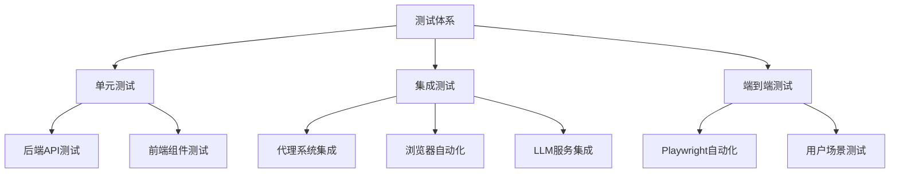
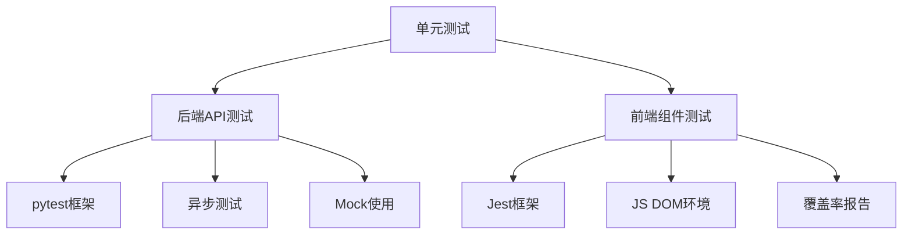
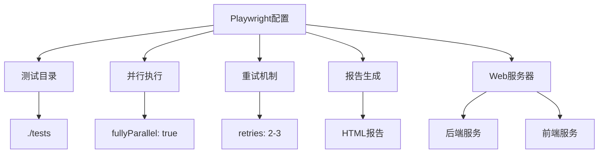

# 测试策略

<cite>
**本文档中引用的文件**
- [test_backend_api.py](file://tests/test_backend_api.py)
- [test_agents.py](file://tests/test_agents.py)
- [test_browser.py](file://tests/test_browser.py)
- [test_api_tools.py](file://tests/test_api_tools.py)
- [test_tools.py](file://tests/test_tools.py)
- [test_telemetry.py](file://tests/test_telemetry.py)
- [test_voice_api.py](file://tests/test_voice_api.py)
- [jest.config.js](file://vibe_surf/frontend/jest.config.js)
- [playwright.config.ts](file://vibe_surf/frontend/playwright.config.ts)
- [run-tests.sh](file://vibe_surf/frontend/run-tests.sh)
- [package.json](file://vibe_surf/frontend/package.json)
- [setupTests.ts](file://vibe_surf/frontend/src/setupTests.ts)
</cite>

## 目录
1. [引言](#引言)
2. [测试体系概述](#测试体系概述)
3. [单元测试规范](#单元测试规范)
4. [集成测试实现](#集成测试实现)
5. [端到端测试框架](#端到端测试框架)
6. [测试覆盖率与质量标准](#测试覆盖率与质量标准)
7. [测试套件执行流程](#测试套件执行流程)
8. [测试数据管理策略](#测试数据管理策略)
9. [高效测试用例最佳实践](#高效测试用例最佳实践)
10. [结论](#结论)

## 引言
VibeSurf项目采用全面的测试体系来确保系统的稳定性和可靠性。本测试策略文档详细介绍了项目的测试架构，涵盖单元测试、集成测试和端到端测试的实现方法。文档重点说明了使用pytest进行后端API测试、使用Jest进行前端组件测试的具体规范，以及Playwright在浏览器自动化测试中的应用。同时，文档还提供了测试覆盖率要求、质量标准、测试数据管理策略和编写高效测试用例的最佳实践，为开发团队提供完整的测试指导。

## 测试体系概述
VibeSurf项目的测试体系采用分层架构，包含单元测试、集成测试和端到端测试三个主要层次。后端测试主要使用Python的pytest框架，针对API接口、代理系统、浏览器自动化和LLM服务进行测试。前端测试采用Jest框架进行组件测试，并使用Playwright进行浏览器自动化测试。测试体系还包括专门的测试配置文件和脚本，如jest.config.js、playwright.config.ts和run-tests.sh，用于管理和执行不同类型的测试套件。

**Diagram sources**
- [test_backend_api.py](file://tests/test_backend_api.py)
- [jest.config.js](file://vibe_surf/frontend/jest.config.js)
- [playwright.config.ts](file://vibe_surf/frontend/playwright.config.ts)

**Section sources**
- [test_backend_api.py](file://tests/test_backend_api.py)
- [jest.config.js](file://vibe_surf/frontend/jest.config.js)
- [playwright.config.ts](file://vibe_surf/frontend/playwright.config.ts)

## 单元测试规范
VibeSurf项目的单元测试遵循严格的编写规范，确保代码质量和可维护性。后端API测试使用pytest框架，通过BackendAPITester类实现对API接口的全面测试。测试用例覆盖健康检查、LLM配置管理、任务生命周期、活动日志和文件上传等核心功能。前端组件测试使用Jest框架，配置文件jest.config.js定义了测试环境、模块映射和覆盖率收集规则。

**Diagram sources**
- [test_backend_api.py](file://tests/test_backend_api.py)
- [jest.config.js](file://vibe_surf/frontend/jest.config.js)

**Section sources**
- [test_backend_api.py](file://tests/test_backend_api.py)
- [jest.config.js](file://vibe_surf/frontend/jest.config.js)

### 后端API测试
后端API测试使用pytest框架，通过BackendAPITester类实现对VibeSurf后端API的全面测试。测试用例包括健康检查、LLM配置管理、任务生命周期、活动日志和文件上传等功能。测试代码使用aiohttp库进行异步HTTP请求，确保与异步后端服务的兼容性。每个测试函数都遵循清晰的命名规范，如test_health_check、test_llm_profile_management等，便于识别测试目的。

**Section sources**
- [test_backend_api.py](file://tests/test_backend_api.py)

### 前端组件测试
前端组件测试使用Jest框架，配置文件jest.config.js定义了测试环境和相关设置。测试环境设置为jsdom，模拟浏览器环境。模块映射配置将@/路径映射到src目录，简化导入语句。测试匹配模式指定测试文件的位置和命名约定，确保所有测试文件都能被正确识别和执行。覆盖率配置收集测试覆盖率数据，生成多种格式的报告。

**Section sources**
- [jest.config.js](file://vibe_surf/frontend/jest.config.js)
- [setupTests.ts](file://vibe_surf/frontend/src/setupTests.ts)

## 集成测试实现
VibeSurf项目的集成测试重点验证代理系统与浏览器自动化、LLM服务的集成场景。测试用例通过模拟真实使用场景，验证各组件之间的交互和数据流。集成测试使用异步编程模型，确保在高并发场景下的稳定性和性能。

### 代理系统与浏览器自动化集成
代理系统与浏览器自动化的集成测试通过test_browser.py文件实现。测试用例验证多代理隔离、代理清理、标签页隔离和浏览器状态捕获等功能。测试使用BrowserManager和AgentBrowserSession类管理浏览器会话和代理实例，确保各代理在独立的环境中运行，互不干扰。

**Section sources**
- [test_browser.py](file://tests/test_browser.py)

### LLM服务集成测试
LLM服务集成测试通过test_agents.py文件实现。测试用例验证BrowserUseAgent和VibeSurfAgent与LLM服务的交互。测试使用ChatOpenAICompatible类连接不同的LLM提供商，如Gemini、DeepSeek等，验证代理能够正确处理LLM响应并执行相应操作。测试还包含控制功能测试，如暂停、恢复和停止任务。

**Section sources**
- [test_agents.py](file://tests/test_agents.py)

## 端到端测试框架
VibeSurf项目的端到端测试框架基于Playwright构建，通过playwright.config.ts文件进行配置。测试框架支持多种浏览器，包括Chromium、Firefox和Safari，确保在不同浏览器环境下的兼容性。端到端测试模拟真实用户场景，验证整个系统的功能和性能。

### Playwright配置
Playwright配置文件playwright.config.ts定义了测试目录、并行执行、重试机制和报告生成等设置。测试使用全局设置的baseURL，简化页面导航操作。跟踪功能在首次重试时启用，便于调试失败的测试用例。测试还配置了Web服务器，自动启动后端和前端服务，确保测试环境的完整性。

**Diagram sources**
- [playwright.config.ts](file://vibe_surf/frontend/playwright.config.ts)

**Section sources**
- [playwright.config.ts](file://vibe_surf/frontend/playwright.config.ts)

### 执行流程
端到端测试的执行流程由run-tests.sh脚本管理。脚本首先检查必要的命令是否可用，然后安装Playwright和项目依赖。接着启动前端和后端服务，等待服务就绪后执行Playwright测试。测试完成后，脚本生成HTML报告并清理测试环境。整个流程自动化，确保测试的一致性和可重复性。

**Section sources**
- [run-tests.sh](file://vibe_surf/frontend/run-tests.sh)

## 测试覆盖率与质量标准
VibeSurf项目对测试覆盖率有严格的要求，确保核心功能得到充分测试。后端API测试覆盖所有主要端点，包括健康检查、配置管理、任务控制和文件操作。前端组件测试覆盖所有核心UI组件，确保用户界面的稳定性和可用性。质量标准包括测试通过率、性能指标和代码质量。

### 覆盖率要求
测试覆盖率要求包括：
- 后端API测试覆盖率达到90%以上
- 前端组件测试覆盖率达到85%以上
- 核心功能必须有相应的单元测试和集成测试
- 新增代码必须有相应的测试用例

**Section sources**
- [jest.config.js](file://vibe_surf/frontend/jest.config.js)

### 质量标准
质量标准包括：
- 所有测试用例必须通过CI/CD流水线
- 性能测试必须满足响应时间要求
- 代码质量检查必须通过静态分析工具
- 安全测试必须通过漏洞扫描

## 测试套件执行流程
VibeSurf项目提供多种方式执行不同类型的测试套件。后端测试通过直接运行测试文件执行，前端测试通过npm脚本执行。CI/CD环境中，测试套件自动执行，确保代码质量。

### 后端测试执行
后端测试通过直接运行测试文件执行，如python tests/test_backend_api.py。测试文件包含main函数，使用asyncio.run执行异步测试。测试用例按功能分组，便于管理和执行。

**Section sources**
- [test_backend_api.py](file://tests/test_backend_api.py)

### 前端测试执行
前端测试通过npm脚本执行，如npm run test或npm run test:coverage。package.json文件定义了测试相关的脚本，包括测试、覆盖率测试和类型检查。测试脚本调用Jest执行测试用例，生成覆盖率报告。

**Section sources**
- [package.json](file://vibe_surf/frontend/package.json)

## 测试数据管理策略
VibeSurf项目的测试数据管理策略确保测试的独立性和可重复性。测试使用临时目录存储测试数据，避免影响生产环境。测试数据在测试开始时初始化，在测试结束时清理。

### 测试数据库初始化
测试数据库在测试开始时初始化，使用临时SQLite数据库。数据库连接字符串通过环境变量配置，确保测试环境的隔离性。测试数据在测试套件执行前创建，在测试套件执行后清理。

**Section sources**
- [playwright.config.ts](file://vibe_surf/frontend/playwright.config.ts)

### 数据清理
数据清理在测试结束时执行，确保测试环境的干净。测试使用finally块或上下文管理器确保清理代码总是执行。临时文件和目录在测试结束后删除，避免磁盘空间占用。

## 高效测试用例最佳实践
编写高效测试用例的最佳实践包括使用Mock、处理异步测试和性能测试方法。这些实践确保测试的可靠性、可维护性和性能。

### Mock使用
Mock使用在测试中模拟外部依赖，如API调用、数据库操作和文件系统操作。测试使用unittest.mock或第三方库创建Mock对象，验证函数调用和返回值。Mock确保测试不依赖外部环境，提高测试的稳定性和速度。

**Section sources**
- [test_backend_api.py](file://tests/test_backend_api.py)

### 异步测试处理
异步测试处理使用async/await语法，确保与异步代码的兼容性。测试使用asyncio.run执行异步测试函数，使用async with管理异步资源。测试避免使用阻塞操作，确保测试的高效性。

**Section sources**
- [test_backend_api.py](file://tests/test_backend_api.py)

### 性能测试方法
性能测试方法包括测量函数执行时间、监控内存使用和压力测试。测试使用time模块测量执行时间，使用内存分析工具监控内存使用。压力测试模拟高并发场景，验证系统的稳定性和性能。

## 结论
VibeSurf项目的测试策略提供了全面的测试体系，确保系统的质量和可靠性。通过单元测试、集成测试和端到端测试的分层架构，项目能够有效验证各层次的功能和性能。测试规范、覆盖率要求和最佳实践为开发团队提供了清晰的指导，确保测试的有效性和可维护性。持续改进测试策略，将有助于提升项目的整体质量和开发效率。