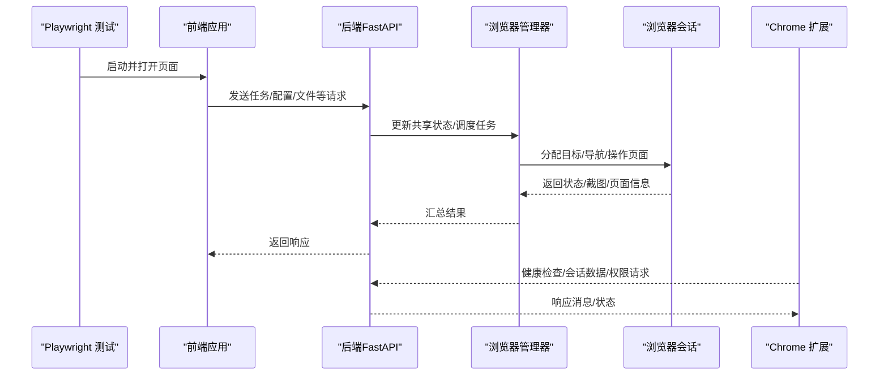
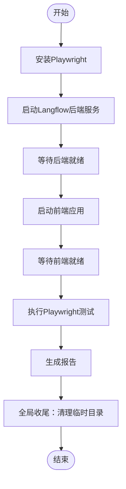
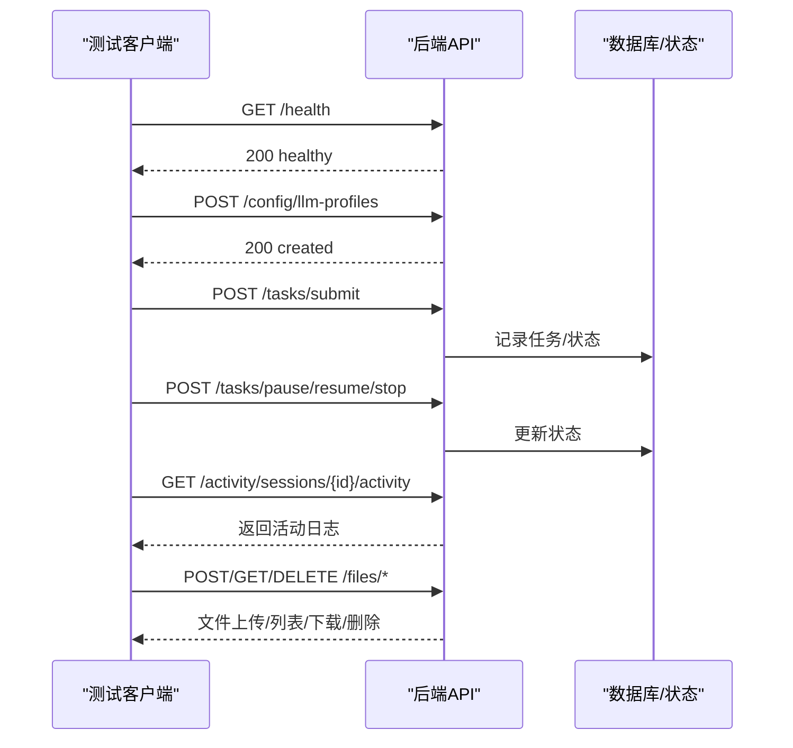
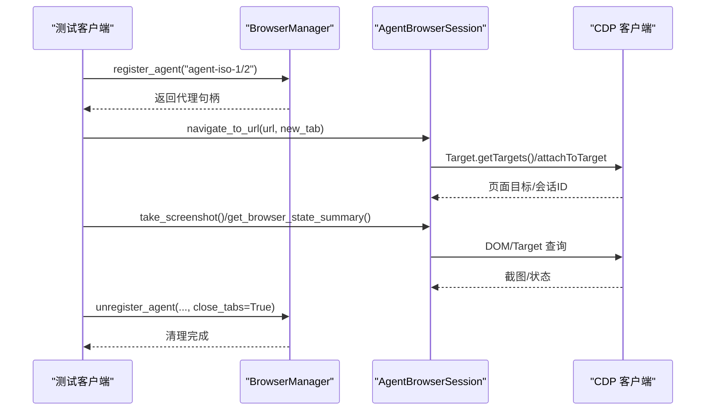
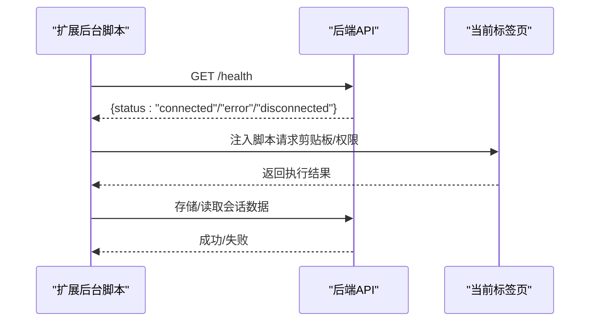
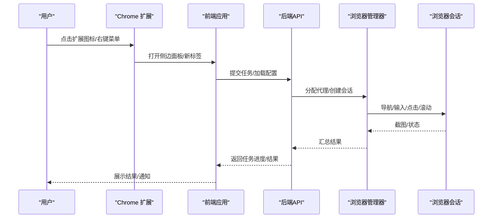
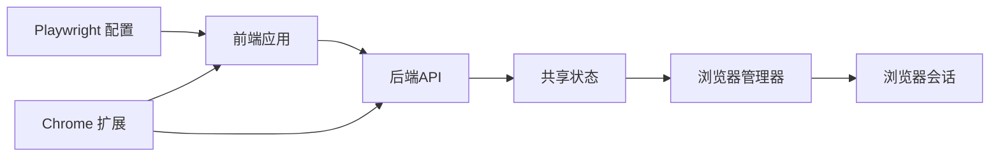

# 端到端测试

<cite>
**本文引用的文件**
- [README.md](file://README.md)
- [vibe_surf/backend/main.py](file://vibe_surf/backend/main.py)
- [vibe_surf/frontend/playwright.config.ts](file://vibe_surf/frontend/playwright.config.ts)
- [vibe_surf/frontend/run-tests.sh](file://vibe_surf/frontend/run-tests.sh)
- [vibe_surf/frontend/tests/extended/features/flowSettings.spec.ts](file://vibe_surf/frontend/tests/extended/features/flowSettings.spec.ts)
- [vibe_surf/frontend/tests/globalTeardown.ts](file://vibe_surf/frontend/tests/globalTeardown.ts)
- [vibe_surf/chrome_extension/background.js](file://vibe_surf/chrome_extension/background.js)
- [vibe_surf/chrome_extension/content.js](file://vibe_surf/chrome_extension/content.js)
- [vibe_surf/browser/browser_manager.py](file://vibe_surf/browser/browser_manager.py)
- [vibe_surf/browser/agent_browser_session.py](file://vibe_surf/browser/agent_browser_session.py)
- [tests/test_backend_api.py](file://tests/test_backend_api.py)
- [tests/test_browser.py](file://tests/test_browser.py)
</cite>

## 目录
1. [简介](#简介)
2. [项目结构](#项目结构)
3. [核心组件](#核心组件)
4. [架构总览](#架构总览)
5. [详细组件分析](#详细组件分析)
6. [依赖关系分析](#依赖关系分析)
7. [性能考量](#性能考量)
8. [故障排查指南](#故障排查指南)
9. [结论](#结论)
10. [附录](#附录)

## 简介
本文件面向VibeSurf项目的端到端测试方案，围绕Playwright浏览器自动化测试展开，覆盖前端UI、后端API以及浏览器自动化（含Chrome扩展）的协同验证。文档重点说明：
- 如何使用Playwright对主应用进行端到端测试；
- 如何集成Chrome扩展并与后端API联动；
- 如何模拟真实用户场景，从启动应用、创建工作流到执行复杂任务的完整流程；
- 跨组件端到端测试策略；
- 测试数据管理、测试环境配置与测试执行流程；
- 在CI/CD中运行端到端测试的方法。

## 项目结构
VibeSurf采用前后端分离架构：前端为React应用，后端为FastAPI服务；同时包含Chrome扩展用于与浏览器交互。测试体系由三部分组成：
- 前端Playwright测试：位于vibe_surf/frontend/tests，使用playwright.config.ts配置，包含核心功能、集成场景与回归测试；
- 后端API测试：位于tests目录，使用异步HTTP客户端直接调用后端接口；
- 浏览器自动化测试：位于tests目录，使用自研浏览器会话与管理器驱动多代理并发与页面隔离。

```mermaid
graph TB
subgraph "前端"
FE["Playwright 测试套件<br/>vibe_surf/frontend/tests"]
CFG["Playwright 配置<br/>playwright.config.ts"]
end
subgraph "后端"
API["FastAPI 应用<br/>vibe_surf/backend/main.py"]
ROUTERS["各路由模块<br/>/api/*"]
end
subgraph "浏览器与扩展"
EXT["Chrome 扩展<br/>background.js / content.js"]
BM["浏览器管理器<br/>browser_manager.py"]
ABS["浏览器会话<br/>agent_browser_session.py"]
end
FE --> CFG
FE --> API
API --> BM
BM --> ABS
EXT <- --> API
EXT <- --> FE
```

图表来源
- [vibe_surf/frontend/playwright.config.ts](file://vibe_surf/frontend/playwright.config.ts#L1-L128)
- [vibe_surf/backend/main.py](file://vibe_surf/backend/main.py#L543-L731)
- [vibe_surf/chrome_extension/background.js](file://vibe_surf/chrome_extension/background.js#L1-L200)
- [vibe_surf/browser/browser_manager.py](file://vibe_surf/browser/browser_manager.py#L160-L201)
- [vibe_surf/browser/agent_browser_session.py](file://vibe_surf/browser/agent_browser_session.py#L243-L275)

章节来源
- [README.md](file://README.md#L1-L186)
- [vibe_surf/frontend/playwright.config.ts](file://vibe_surf/frontend/playwright.config.ts#L1-L128)
- [vibe_surf/backend/main.py](file://vibe_surf/backend/main.py#L543-L731)

## 核心组件
- 前端Playwright测试：通过playwright.config.ts定义测试目录、并行策略、超时、报告器、webServer启动命令等，确保在本地或CI环境中自动拉起前端与后端服务。
- 后端FastAPI应用：提供健康检查、任务提交、活动日志、文件上传等API，供前端与浏览器自动化测试调用。
- 浏览器管理器与会话：负责多代理并发、标签页隔离、状态抓取与截图等能力，支撑复杂任务场景。
- Chrome扩展：作为浏览器侧入口，处理消息、权限请求、后台状态检查、会话数据存储等，与后端API配合完成端到端闭环。

章节来源
- [vibe_surf/frontend/playwright.config.ts](file://vibe_surf/frontend/playwright.config.ts#L1-L128)
- [vibe_surf/backend/main.py](file://vibe_surf/backend/main.py#L649-L731)
- [vibe_surf/browser/browser_manager.py](file://vibe_surf/browser/browser_manager.py#L160-L201)
- [vibe_surf/browser/agent_browser_session.py](file://vibe_surf/browser/agent_browser_session.py#L243-L275)
- [vibe_surf/chrome_extension/background.js](file://vibe_surf/chrome_extension/background.js#L1-L200)

## 架构总览
下图展示端到端测试的关键交互路径：前端通过Playwright控制浏览器访问应用，应用与后端API通信，后端通过共享状态与浏览器管理器协调浏览器会话，Chrome扩展在浏览器侧提供消息通道与上下文感知。



图表来源
- [vibe_surf/frontend/playwright.config.ts](file://vibe_surf/frontend/playwright.config.ts#L104-L127)
- [vibe_surf/backend/main.py](file://vibe_surf/backend/main.py#L327-L482)
- [vibe_surf/browser/browser_manager.py](file://vibe_surf/browser/browser_manager.py#L160-L201)
- [vibe_surf/browser/agent_browser_session.py](file://vibe_surf/browser/agent_browser_session.py#L1186-L1215)
- [vibe_surf/chrome_extension/background.js](file://vibe_surf/chrome_extension/background.js#L450-L486)

## 详细组件分析

### 前端Playwright测试配置与执行
- 配置要点
  - 测试目录与并行策略：全并行、重试策略、工作进程数、超时时间、报告器选择（CI下使用blob，本地使用html）。
  - 基础URL与Trace：统一的baseURL便于页面跳转；首次失败重试时收集trace便于定位问题。
  - WebServer：同时启动Langflow与前端应用，确保测试环境可用。
  - 全局收尾：删除临时数据库目录，避免状态污染。
- 执行脚本
  - run-tests.sh负责安装Playwright、启动后端Langflow与前端、等待服务就绪、执行测试并生成报告，支持UI模式查看报告。



图表来源
- [vibe_surf/frontend/playwright.config.ts](file://vibe_surf/frontend/playwright.config.ts#L1-L128)
- [vibe_surf/frontend/run-tests.sh](file://vibe_surf/frontend/run-tests.sh#L1-L118)
- [vibe_surf/frontend/tests/globalTeardown.ts](file://vibe_surf/frontend/tests/globalTeardown.ts#L1-L35)

章节来源
- [vibe_surf/frontend/playwright.config.ts](file://vibe_surf/frontend/playwright.config.ts#L1-L128)
- [vibe_surf/frontend/run-tests.sh](file://vibe_surf/frontend/run-tests.sh#L1-L118)
- [vibe_surf/frontend/tests/globalTeardown.ts](file://vibe_surf/frontend/tests/globalTeardown.ts#L1-L35)

### 后端API测试（Python）
- 测试范围
  - 健康检查、LLM/MCP配置管理、控制器配置、任务生命周期（提交/暂停/恢复/停止）、活动日志与历史、文件上传下载删除、配置状态查询等。
- 关键点
  - 异步HTTP客户端封装，统一等待后端就绪、断言响应状态码与数据结构。
  - 通过会话ID串联同一用户的多次任务，验证状态流转与历史记录一致性。
  - 文件上传使用multipart/form-data，包含边界校验与响应结构断言。



图表来源
- [tests/test_backend_api.py](file://tests/test_backend_api.py#L98-L175)
- [tests/test_backend_api.py](file://tests/test_backend_api.py#L208-L239)
- [tests/test_backend_api.py](file://tests/test_backend_api.py#L242-L351)
- [tests/test_backend_api.py](file://tests/test_backend_api.py#L353-L427)
- [tests/test_backend_api.py](file://tests/test_backend_api.py#L458-L551)

章节来源
- [tests/test_backend_api.py](file://tests/test_backend_api.py#L98-L175)
- [tests/test_backend_api.py](file://tests/test_backend_api.py#L208-L239)
- [tests/test_backend_api.py](file://tests/test_backend_api.py#L242-L351)
- [tests/test_backend_api.py](file://tests/test_backend_api.py#L353-L427)
- [tests/test_backend_api.py](file://tests/test_backend_api.py#L458-L551)

### 浏览器自动化测试（Python）
- 测试范围
  - 多代理隔离、代理清理、标签页隔离、并发状态抓取与截图、页面元素语义提取与点击、网站API调用等。
- 关键点
  - 使用BrowserManager注册/注销代理，分配目标页面，验证页面数量与关闭行为。
  - 并发导航、截图与状态汇总，验证多实例下的稳定性与性能。
  - 通过AgentBrowserSession与CDP交互，获取页面标题、PDF标题回退、欢迎模态等。



图表来源
- [tests/test_browser.py](file://tests/test_browser.py#L22-L81)
- [tests/test_browser.py](file://tests/test_browser.py#L84-L210)
- [tests/test_browser.py](file://tests/test_browser.py#L367-L415)
- [vibe_surf/browser/browser_manager.py](file://vibe_surf/browser/browser_manager.py#L160-L201)
- [vibe_surf/browser/agent_browser_session.py](file://vibe_surf/browser/agent_browser_session.py#L1186-L1215)

章节来源
- [tests/test_browser.py](file://tests/test_browser.py#L22-L81)
- [tests/test_browser.py](file://tests/test_browser.py#L84-L210)
- [tests/test_browser.py](file://tests/test_browser.py#L367-L415)
- [vibe_surf/browser/browser_manager.py](file://vibe_surf/browser/browser_manager.py#L160-L201)
- [vibe_surf/browser/agent_browser_session.py](file://vibe_surf/browser/agent_browser_session.py#L1186-L1215)

### Chrome扩展与后端API协同
- 扩展职责
  - 生命周期与事件监听：安装、启动、动作按钮点击、上下文菜单、消息处理、标签切换与更新。
  - 健康检查：向后端发送/接收健康状态，支持超时与错误处理。
  - 会话数据：存储/读取会话数据，维护最近会话列表，限制数量并清理旧数据。
  - 权限与通知：请求麦克风权限、显示通知、剪贴板写入（通过内容脚本注入）。
- 与后端协作
  - 扩展通过消息通道与后端通信，后端提供健康检查端点，扩展可轮询确认连通性。
  - 扩展可向后端请求文件打开、系统文件访问建议等，后端返回相应结果。



图表来源
- [vibe_surf/chrome_extension/background.js](file://vibe_surf/chrome_extension/background.js#L450-L486)
- [vibe_surf/chrome_extension/background.js](file://vibe_surf/chrome_extension/background.js#L488-L562)
- [vibe_surf/chrome_extension/background.js](file://vibe_surf/chrome_extension/background.js#L697-L775)
- [vibe_surf/backend/main.py](file://vibe_surf/backend/main.py#L649-L668)

章节来源
- [vibe_surf/chrome_extension/background.js](file://vibe_surf/chrome_extension/background.js#L1-L200)
- [vibe_surf/chrome_extension/background.js](file://vibe_surf/chrome_extension/background.js#L450-L486)
- [vibe_surf/chrome_extension/background.js](file://vibe_surf/chrome_extension/background.js#L488-L562)
- [vibe_surf/chrome_extension/background.js](file://vibe_surf/chrome_extension/background.js#L697-L775)
- [vibe_surf/chrome_extension/content.js](file://vibe_surf/chrome_extension/content.js#L493-L527)
- [vibe_surf/backend/main.py](file://vibe_surf/backend/main.py#L649-L668)

### 端到端工作流测试示例
以下以“用户通过Chrome扩展启动研究任务，代理系统调用LLM并操作浏览器完成任务”的完整流程为例，说明如何在Playwright中建模与验证。



图表来源
- [vibe_surf/chrome_extension/background.js](file://vibe_surf/chrome_extension/background.js#L104-L158)
- [vibe_surf/frontend/playwright.config.ts](file://vibe_surf/frontend/playwright.config.ts#L104-L127)
- [vibe_surf/backend/main.py](file://vibe_surf/backend/main.py#L327-L482)
- [vibe_surf/browser/browser_manager.py](file://vibe_surf/browser/browser_manager.py#L160-L201)
- [vibe_surf/browser/agent_browser_session.py](file://vibe_surf/browser/agent_browser_session.py#L1186-L1215)

章节来源
- [vibe_surf/chrome_extension/background.js](file://vibe_surf/chrome_extension/background.js#L104-L158)
- [vibe_surf/frontend/playwright.config.ts](file://vibe_surf/frontend/playwright.config.ts#L104-L127)
- [vibe_surf/backend/main.py](file://vibe_surf/backend/main.py#L327-L482)
- [vibe_surf/browser/browser_manager.py](file://vibe_surf/browser/browser_manager.py#L160-L201)
- [vibe_surf/browser/agent_browser_session.py](file://vibe_surf/browser/agent_browser_session.py#L1186-L1215)

## 依赖关系分析
- 组件耦合
  - 前端Playwright依赖playwright.config.ts中的webServer配置，确保Langflow与前端同时可用。
  - 后端FastAPI通过共享状态与浏览器管理器耦合，浏览器管理器再与浏览器会话耦合。
  - Chrome扩展通过消息通道与后端API耦合，实现健康检查与会话数据同步。
- 外部依赖
  - Playwright浏览器、Langflow后端服务、Chrome扩展、浏览器CDP。
- 潜在循环依赖
  - 当前结构清晰，未发现循环导入；浏览器管理器与会话之间为单向依赖。



图表来源
- [vibe_surf/frontend/playwright.config.ts](file://vibe_surf/frontend/playwright.config.ts#L104-L127)
- [vibe_surf/backend/main.py](file://vibe_surf/backend/main.py#L327-L482)
- [vibe_surf/browser/browser_manager.py](file://vibe_surf/browser/browser_manager.py#L160-L201)
- [vibe_surf/chrome_extension/background.js](file://vibe_surf/chrome_extension/background.js#L1-L200)

章节来源
- [vibe_surf/frontend/playwright.config.ts](file://vibe_surf/frontend/playwright.config.ts#L104-L127)
- [vibe_surf/backend/main.py](file://vibe_surf/backend/main.py#L327-L482)
- [vibe_surf/browser/browser_manager.py](file://vibe_surf/browser/browser_manager.py#L160-L201)
- [vibe_surf/chrome_extension/background.js](file://vibe_surf/chrome_extension/background.js#L1-L200)

## 性能考量
- 并发与隔离
  - 多代理并发导航与状态抓取需注意资源竞争，建议在测试中分批并发并设置合理超时。
- 截图与DOM查询
  - 截图与DOM查询可能较耗时，建议在关键步骤后批量执行，减少不必要的等待。
- 状态监控
  - 后端提供浏览器连接监控任务，若检测到无可用浏览器则触发优雅关闭，测试中应关注该监控逻辑对测试的影响。

章节来源
- [tests/test_browser.py](file://tests/test_browser.py#L84-L210)
- [vibe_surf/backend/main.py](file://vibe_surf/backend/main.py#L103-L148)

## 故障排查指南
- 健康检查失败
  - 后端健康检查端点与扩展健康检查均可用作快速判断；若失败，检查后端是否启动、端口占用与网络连通性。
- 浏览器连接异常
  - 后端监控任务会在检测到无可用浏览器时触发优雅关闭；测试中可通过浏览器管理器的连接检查方法定位问题。
- Playwright报告与Trace
  - 首次重试时开启trace，有助于定位页面交互问题；CI下使用blob报告便于归档。
- 临时数据清理
  - 全局收尾脚本会删除临时数据库目录，避免跨测试污染；若失败，检查权限与路径。

章节来源
- [vibe_surf/backend/main.py](file://vibe_surf/backend/main.py#L649-L668)
- [vibe_surf/chrome_extension/background.js](file://vibe_surf/chrome_extension/background.js#L450-L486)
- [vibe_surf/frontend/playwright.config.ts](file://vibe_surf/frontend/playwright.config.ts#L28-L40)
- [vibe_surf/frontend/tests/globalTeardown.ts](file://vibe_surf/frontend/tests/globalTeardown.ts#L1-L35)

## 结论
本端到端测试方案通过Playwright、后端API与浏览器自动化（含Chrome扩展）的协同，实现了从用户启动应用到任务执行的完整闭环验证。测试配置与执行脚本确保了本地与CI环境的一致性，结合并发隔离与状态监控，能够稳定覆盖复杂工作流场景。建议在持续集成中启用并行测试与trace收集，以提升问题定位效率与测试覆盖率。

## 附录
- 测试用例示例参考
  - 前端工作流设置：[flowSettings.spec.ts](file://vibe_surf/frontend/tests/extended/features/flowSettings.spec.ts#L1-L62)
  - 后端任务生命周期：[test_task_lifecycle_same_session](file://tests/test_backend_api.py#L242-L351)
  - 浏览器并发状态抓取：[test_browser_state_capture](file://tests/test_browser.py#L84-L210)
  - 扩展健康检查：[checkBackendStatus](file://vibe_surf/chrome_extension/background.js#L450-L486)