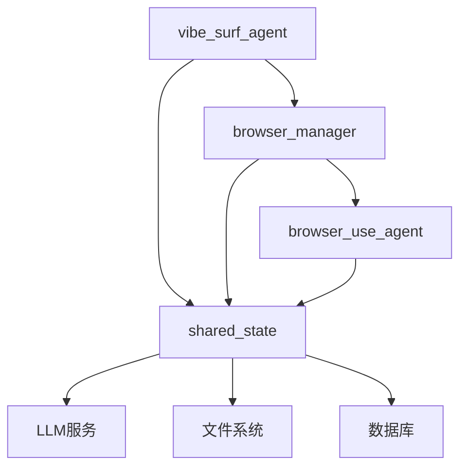
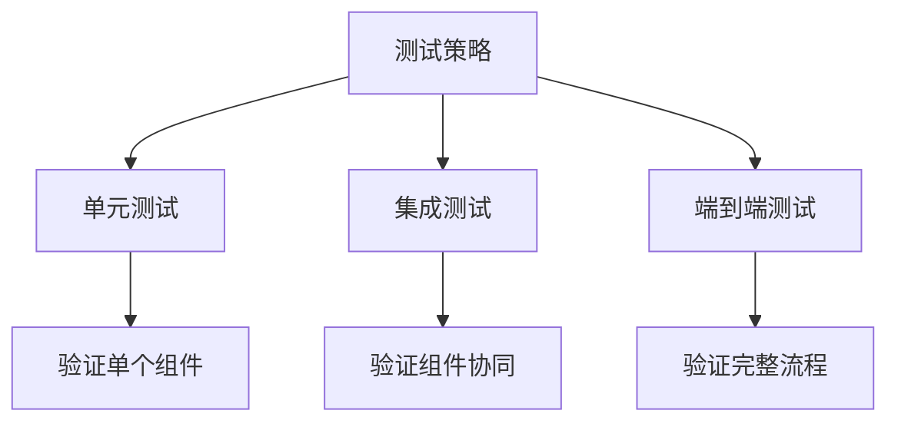
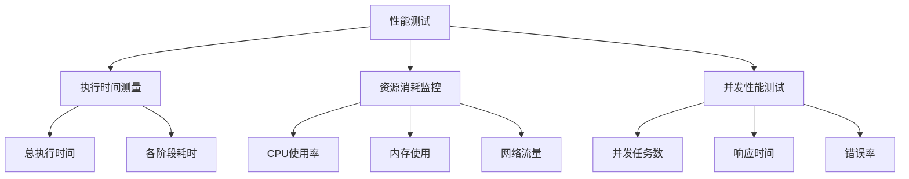

# 代理系统集成测试

<cite>
**本文档引用的文件**   
- [vibe_surf_agent.py](file://vibe_surf/agents/vibe_surf_agent.py)
- [browser_manager.py](file://vibe_surf/browser/browser_manager.py)
- [browser_use_agent.py](file://vibe_surf/agents/browser_use_agent.py)
- [shared_state.py](file://vibe_surf/backend/shared_state.py)
- [test_agents.py](file://tests/test_agents.py)
- [test_browser.py](file://tests/test_browser.py)
- [browser_use_tools.py](file://vibe_surf/tools/browser_use_tools.py)
- [vibesurf_tools.py](file://vibe_surf/tools/vibesurf_tools.py)
- [views.py](file://vibe_surf/agents/views.py)
</cite>

## 目录
1. [引言](#引言)
2. [代理系统架构](#代理系统架构)
3. [核心组件分析](#核心组件分析)
4. [集成测试策略](#集成测试策略)
5. [多标签并行执行测试](#多标签并行执行测试)
6. [任务调度测试](#任务调度测试)
7. [浏览器操作测试](#浏览器操作测试)
8. [状态管理测试](#状态管理测试)
9. [LLM交互测试](#llm交互测试)
10. [异常处理测试](#异常处理测试)
11. [性能测试](#性能测试)
12. [结论](#结论)

## 引言
本文档详细描述了VibeSurf中AI代理与浏览器自动化功能的集成测试方法。重点阐述了vibe_surf_agent与browser_manager的协同工作验证，包括多标签并行执行和任务调度的测试策略。文档还详细说明了browser_use_agent在真实浏览器环境中执行操作的测试用例，如页面导航、元素交互和内容提取。通过pytest框架提供了测试代理状态管理和共享状态(shared_state)的示例代码，并解释了如何测试代理在执行过程中与LLM服务的交互，包括提示词生成和响应处理。此外，文档还涵盖了异常处理机制的测试方法和性能测试策略。

## 代理系统架构
VibeSurf的代理系统采用分层架构，核心组件包括vibe_surf_agent、browser_manager和browser_use_agent。vibe_surf_agent作为主代理，负责协调任务执行和决策，通过LangGraph工作流管理整个执行流程。browser_manager负责管理多个浏览器会话，为不同代理提供隔离的浏览器环境。browser_use_agent是专门用于浏览器操作的子代理，能够执行具体的网页交互任务。这些组件通过共享状态(shared_state)进行通信和协调，确保了系统的整体一致性和可扩展性。



**Diagram sources**
- [vibe_surf_agent.py](file://vibe_surf/agents/vibe_surf_agent.py)
- [browser_manager.py](file://vibe_surf/browser/browser_manager.py)
- [browser_use_agent.py](file://vibe_surf/agents/browser_use_agent.py)
- [shared_state.py](file://vibe_surf/backend/shared_state.py)

## 核心组件分析
### vibe_surf_agent分析
vibe_surf_agent是VibeSurf系统的核心协调者，负责管理整个任务执行流程。它使用LangGraph框架构建工作流，通过VibeSurfState类维护执行状态。该代理能够根据任务需求决定是否调用browser_use_agent执行浏览器任务，或直接生成最终响应。其关键特性包括控制状态管理（暂停、停止）、任务路由和结果聚合。

**Section sources**
- [vibe_surf_agent.py](file://vibe_surf/agents/vibe_surf_agent.py)

### browser_manager分析
browser_manager负责管理多个浏览器会话，为不同代理提供隔离的浏览器环境。它通过register_agent和unregister_agent方法管理代理的生命周期，确保每个代理都有独立的CDP（Chrome DevTools Protocol）会话。该组件还提供了get_activate_tab和get_all_tabs等方法，用于获取当前浏览器状态。

**Section sources**
- [browser_manager.py](file://vibe_surf/browser/browser_manager.py)

### browser_use_agent分析
browser_use_agent是专门用于浏览器操作的子代理，能够执行具体的网页交互任务。它继承自browser_use的Agent类，具有完整的浏览器操作能力，包括页面导航、元素交互、内容提取等。该代理通过step_callback机制与主代理通信，报告每个执行步骤的详细信息。

**Section sources**
- [browser_use_agent.py](file://vibe_surf/agents/browser_use_agent.py)

## 集成测试策略
VibeSurf的集成测试采用pytest框架，通过模拟真实使用场景来验证系统功能。测试策略包括单元测试、集成测试和端到端测试三个层次。单元测试验证单个组件的功能，集成测试验证组件间的协同工作，端到端测试验证整个系统的工作流程。测试用例覆盖了正常流程、异常处理和边界条件，确保系统的稳定性和可靠性。



**Diagram sources**
- [test_agents.py](file://tests/test_agents.py)
- [test_browser.py](file://tests/test_browser.py)

## 多标签并行执行测试
多标签并行执行是VibeSurf的核心功能之一，通过execute_parallel_browser_tasks方法实现。该方法能够同时为多个任务创建独立的浏览器代理，实现真正的并行执行。测试用例验证了以下关键功能：
- 并行任务的正确创建和注册
- 各任务间的隔离性，确保一个任务的失败不会影响其他任务
- 资源的有效管理和回收
- 执行结果的正确聚合

```python
# 测试多标签并行执行
async def test_multi_bu_agents():
    # 创建多个浏览器代理
    agent_browser_sessions = await asyncio.gather(
        browser_manager.register_agent("agent-1"),
        browser_manager.register_agent("agent-2"),
        browser_manager.register_agent("agent-3")
    )
    # 创建多个browser_use_agent实例
    agents = [
        BrowserUseAgent(task=task, llm=llm, browser_session=agent_browser_sessions[i])
        for i, task in enumerate([
            'search browser-use and click into the most relevant url',
            'search langflow and click into the most relevant url',
            'search langgraph and click into the most relevant url',
        ])
    ]
    # 并行执行所有代理
    results = await asyncio.gather(*[agent.run() for agent in agents])
```

**Section sources**
- [vibe_surf_agent.py](file://vibe_surf/agents/vibe_surf_agent.py#L607-L763)
- [test_agents.py](file://tests/test_agents.py#L78-L148)

## 任务调度测试
任务调度测试验证了vibe_surf_agent如何根据任务需求动态调度子代理。测试用例包括：
- 任务路由的正确性：验证代理能否正确识别需要浏览器操作的任务并路由到browser_use_agent
- 任务参数的正确传递：验证任务描述、文件列表等参数能否正确传递给子代理
- 执行结果的正确处理：验证子代理的执行结果能否被正确收集和处理

```python
# 任务调度测试
async def _vibesurf_agent_node_impl(state: VibeSurfState) -> VibeSurfState:
    # 检查是否需要执行浏览器任务
    if action_name == 'execute_browser_use_agent':
        # 路由到浏览器任务执行节点
        params = action_data[action_name]
        state.browser_tasks = params.get('tasks', [])
        state.current_action = 'execute_browser_use_agent'
        state.action_params = params
        state.current_step = "browser_task_execution"
        return state
```

**Section sources**
- [vibe_surf_agent.py](file://vibe_surf/agents/vibe_surf_agent.py#L435-L454)

## 浏览器操作测试
浏览器操作测试验证了browser_use_agent在真实浏览器环境中执行各种操作的能力。测试用例覆盖了以下操作：
- 页面导航：验证代理能否正确导航到指定URL
- 元素交互：验证代理能否正确点击、输入文本、选择下拉选项等
- 内容提取：验证代理能否正确提取网页内容
- 屏幕截图：验证代理能否正确截取屏幕并保存

```python
# 浏览器操作测试
async def test_browser_state_capture(manager: BrowserManager):
    # 注册多个代理
    agent1, agent2, agent3 = await asyncio.gather(
        manager.register_agent("agent-state-1"),
        manager.register_agent("agent-state-2"),
        manager.register_agent("agent-state-3")
    )
    # 并行导航到不同页面
    await asyncio.gather(
        agent1.navigate_to_url("https://www.python.org"),
        agent2.navigate_to_url("https://www.rust-lang.org"),
        agent3.navigate_to_url("https://www.github.com"),
    )
    # 并行截取屏幕
    screenshot1, screenshot2, screenshot3 = await asyncio.gather(
        agent1.take_screenshot(),
        agent2.take_screenshot(),
        agent3.take_screenshot(),
    )
```

**Section sources**
- [test_browser.py](file://tests/test_browser.py#L84-L210)

## 状态管理测试
状态管理测试验证了代理系统如何管理共享状态(shared_state)和执行状态。测试用例包括：
- 共享状态的正确初始化和更新
- 代理状态的正确跟踪和报告
- 控制状态（暂停、停止）的正确处理

```python
# 使用pytest测试代理状态管理
def test_vibe_surf_agent_control():
    # 测试代理控制功能（暂停/恢复/停止）
    print("🧪 Testing VibeSurfAgent control functionality...")
    
    # 测试1: 检查空闲时的状态
    print("📊 Testing initial status...")
    status = agent.get_status()
    print(f"Initial status: {status.overall_status}")
    assert status.overall_status == "idle"
    
    # 测试2: 开始长时间运行的浏览器任务
    print("🚀 Starting long-running browser task...")
    browser_task = "Search for Dify, n8n, langflow and gather relative information"
    
    # 在后台启动任务
    async def run_task():
        return await agent.run(browser_task)
    
    task_coroutine = asyncio.create_task(run_task())
    
    # 等待任务开始
    await asyncio.sleep(10)
    
    # 测试3: 检查执行期间的状态
    print("📊 Checking status during execution...")
    status = agent.get_status()
    print(f"Running status: {status.overall_status}")
    assert status.overall_status == "running"
    
    # 测试4: 暂停执行
    print("⏸️ Testing pause functionality...")
    pause_result = await agent.pause("Testing pause functionality")
    print(f"Pause result: {pause_result.success} - {pause_result.message}")
    assert pause_result.success
    
    # 检查暂停后的状态
    await asyncio.sleep(1)
    status = agent.get_status()
    print(f"Paused status: {status.overall_status}")
    assert status.overall_status == "paused"
```

**Section sources**
- [shared_state.py](file://vibe_surf/backend/shared_state.py)
- [test_agents.py](file://tests/test_agents.py#L230-L375)

## LLM交互测试
LLM交互测试验证了代理系统如何与LLM服务进行交互，包括提示词生成和响应处理。测试用例包括：
- 提示词的正确生成和格式化
- LLM响应的正确解析和处理
- 交互历史的正确维护

```python
# LLM交互测试
async def _vibesurf_agent_node_impl(state: VibeSurfState) -> VibeSurfState:
    # 获取LLM响应
    response = await vibesurf_agent.llm.ainvoke(vibesurf_agent.message_history, output_format=AgentOutput)
    parsed = response.completion
    action = parsed.action
    
    # 将LLM响应添加到消息历史
    vibesurf_agent.message_history.append(
        AssistantMessage(content=json.dumps(response.completion.model_dump(exclude_none=True, exclude_unset=True),
                                    ensure_ascii=False)))
    
    # 处理LLM动作
    if action_name == 'execute_browser_use_agent':
        # 路由到浏览器任务执行节点
        params = action_data[action_name]
        state.browser_tasks = params.get('tasks', [])
        state.current_action = 'execute_browser_use_agent'
        state.action_params = params
        state.current_step = "browser_task_execution"
        return state
```

**Section sources**
- [vibe_surf_agent.py](file://vibe_surf/agents/vibe_surf_agent.py#L402-L442)

## 异常处理测试
异常处理测试验证了代理系统在各种异常情况下的行为，包括网络中断、页面加载失败等。测试用例包括：
- 网络连接失败的处理
- 页面加载超时的处理
- 元素定位失败的处理
- LLM服务不可用的处理

```python
# 异常处理测试
async def _vibesurf_agent_node_impl(state: VibeSurfState) -> VibeSurfState):
    try:
        # 获取LLM响应
        response = await vibesurf_agent.llm.ainvoke(vibesurf_agent.message_history, output_format=AgentOutput)
        parsed = response.completion
        action = parsed.action
        
        # 处理LLM动作
        result = await vibesurf_agent.tools.act(
            action=action,
            browser_manager=vibesurf_agent.browser_manager,
            llm=vibesurf_agent.llm,
            file_system=vibesurf_agent.file_system,
        )
        
        if result.error:
            # 处理错误
            vibesurf_agent.message_history.append(UserMessage(content=f'Action error:\n{result.error}'))
            await log_agent_activity(state, agent_name, "error", result.error)
            
    except Exception as e:
        # 捕获并处理异常
        import traceback
        traceback_str = traceback.format_exc()
        logger.error(f"❌ VibeSurf agent failed: {e}")
        
        # 捕获异常遥测
        exception_event = VibeSurfAgentExceptionEvent(
            version=vibe_surf.__version__,
            error_message=str(e)[:500],
            error_type=type(e).__name__,
            traceback=traceback_str[:1000],
            model=getattr(vibesurf_agent.llm, 'model_name', None),
            session_id=state.session_id,
            function_name='_vibesurf_agent_node_impl'
        )
        vibesurf_agent.telemetry.capture(exception_event)
        vibesurf_agent.telemetry.flush()
        
        state.final_response = f"Task execution failed: {str(e)}"
        state.is_complete = True
        await log_agent_activity(state, agent_name, "error", f"Agent failed: {str(e)}")
        return state
```

**Section sources**
- [vibe_surf_agent.py](file://vibe_surf/agents/vibe_surf_agent.py#L522-L545)

## 性能测试
性能测试评估了代理系统的执行效率和资源消耗。测试方法包括：
- 执行时间测量：记录任务执行的总时间和各阶段耗时
- 资源消耗监控：监控CPU、内存和网络使用情况
- 并发性能测试：测试系统在高并发情况下的表现



**Diagram sources**
- [vibe_surf_agent.py](file://vibe_surf/agents/vibe_surf_agent.py)
- [test_agents.py](file://tests/test_agents.py)

## 结论
本文档详细描述了VibeSurf代理系统的集成测试方法。通过全面的测试策略，验证了vibe_surf_agent与browser_manager的协同工作，包括多标签并行执行和任务调度的测试。文档还详细说明了browser_use_agent在真实浏览器环境中执行操作的测试用例，以及代理状态管理和共享状态的测试方法。此外，文档涵盖了LLM交互、异常处理和性能测试的完整测试方案，为VibeSurf系统的稳定性和可靠性提供了有力保障。