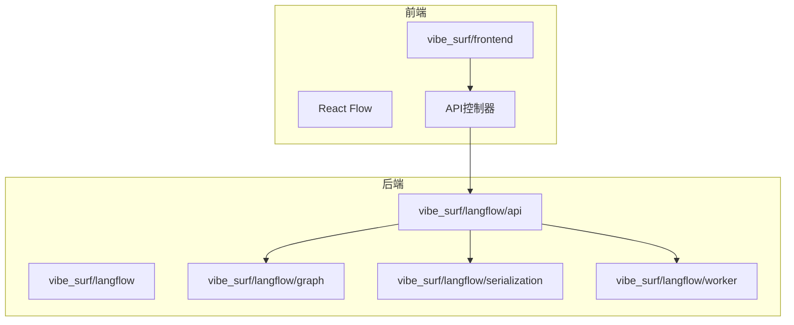
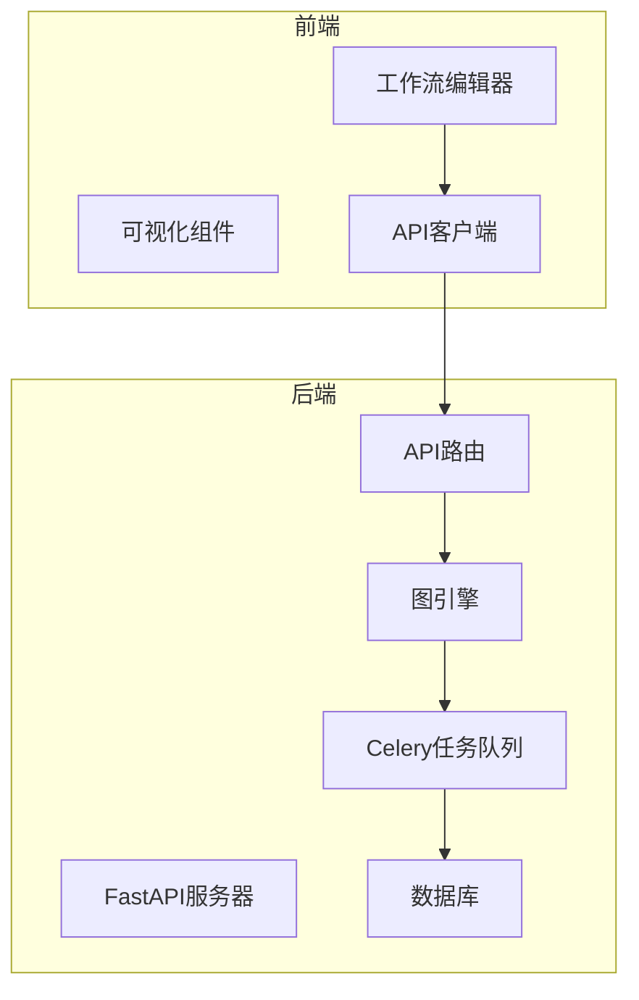
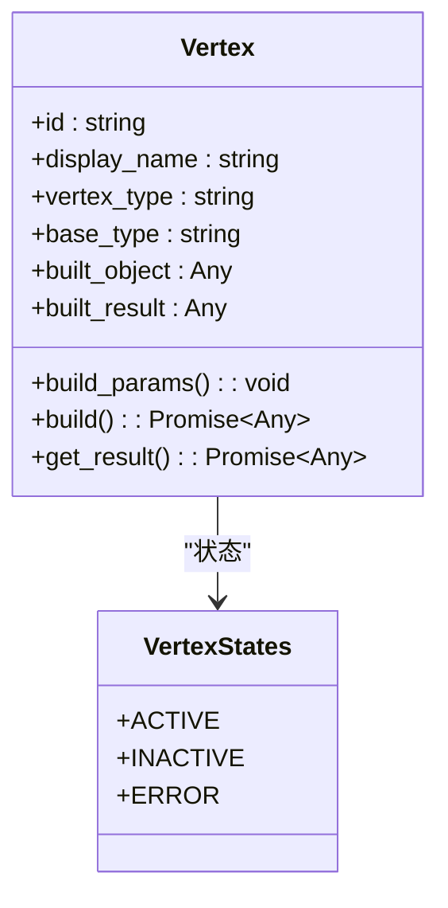
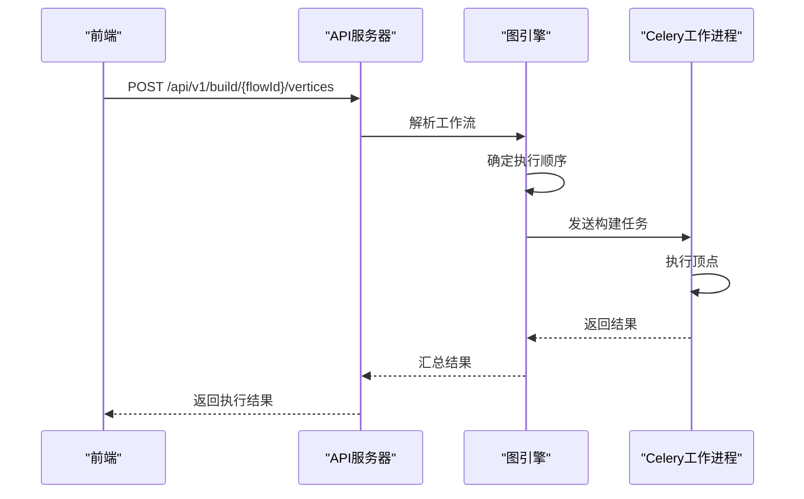
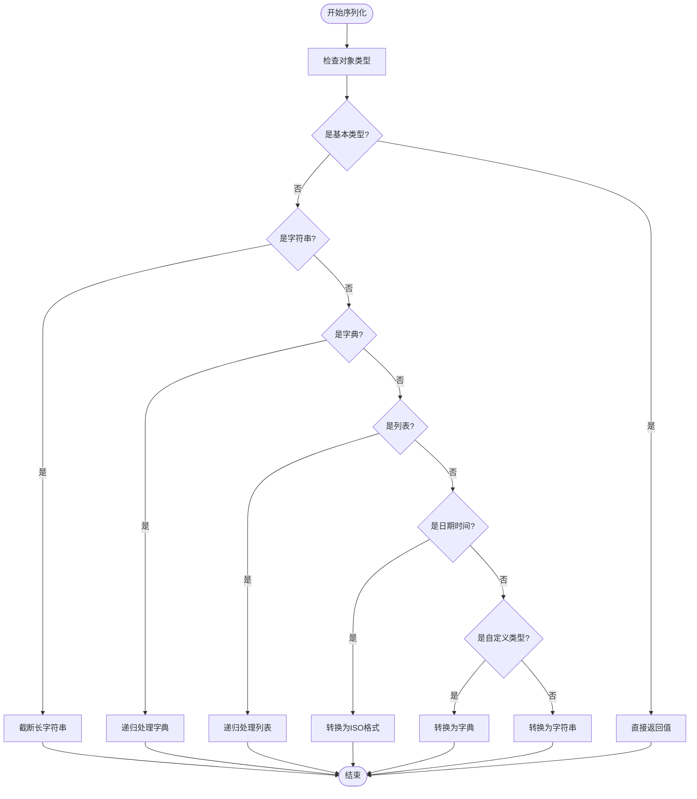
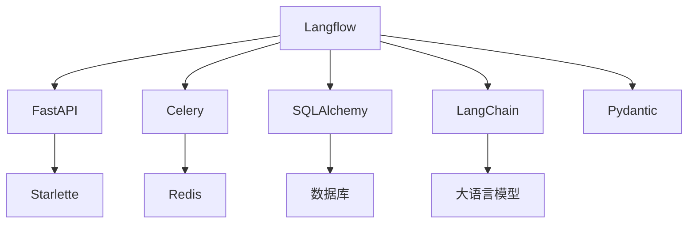

# 工作流引擎集成测试

<cite>
**本文档中引用的文件**  
- [main.py](file://vibe_surf/langflow/main.py)
- [server.py](file://vibe_surf/langflow/server.py)
- [worker.py](file://vibe_surf/langflow/worker.py)
- [serialization.py](file://vibe_surf/langflow/serialization/serialization.py)
- [router.py](file://vibe_surf/langflow/api/router.py)
- [base.py](file://vibe_surf/langflow/graph/vertex/base.py)
- [index.ts](file://vibe_surf/frontend/src/controllers/API/index.ts)
- [api.py](file://vibe_surf/frontend/src/controllers/API/api.ts)
</cite>

## 目录
1. [引言](#引言)
2. [项目结构](#项目结构)
3. [核心组件](#核心组件)
4. [架构概述](#架构概述)
5. [详细组件分析](#详细组件分析)
6. [依赖分析](#依赖分析)
7. [性能考虑](#性能考虑)
8. [故障排除指南](#故障排除指南)
9. [结论](#结论)

## 引言
本文档全面介绍了Langflow工作流引擎与VibeSurf核心系统的集成测试方法。重点描述了前端工作流编辑器与后端执行引擎的交互测试，包括工作流定义的序列化/反序列化验证。文档说明了如何测试不同类型工作流（拖放式、对话式、自定义）的执行一致性，并提供了测试工作流中各节点间数据传递和状态管理的具体示例，特别是CustomNodes与后端API的通信验证。

## 项目结构
VibeSurf项目包含多个关键目录，其中`vibe_surf/langflow`是工作流引擎的核心。该目录包含API路由、图结构、顶点处理、序列化和工作流执行等关键组件。前端位于`vibe_surf/frontend`目录，使用React和TypeScript构建，通过API与后端交互。

**图表来源**
- [main.py](file://vibe_surf/langflow/main.py)
- [index.ts](file://vibe_surf/frontend/src/controllers/API/index.ts)

## 核心组件
工作流引擎的核心组件包括顶点(Vertex)、边(Edge)、图(Graph)和序列化机制。顶点表示工作流中的单个节点，边表示节点间的连接，图管理整个工作流的拓扑结构。序列化机制确保工作流定义可以在前端和后端之间正确传递。

**章节来源**
- [base.py](file://vibe_surf/langflow/graph/vertex/base.py)
- [serialization.py](file://vibe_surf/langflow/serialization/serialization.py)

## 架构概述
Langflow工作流引擎采用前后端分离架构。前端使用React Flow库提供可视化工作流编辑器，后端使用FastAPI提供RESTful API。工作流执行通过Celery任务队列异步处理，确保高并发性能。

**图表来源**
- [main.py](file://vibe_surf/langflow/main.py)
- [server.py](file://vibe_surf/langflow/server.py)

## 详细组件分析

### 顶点组件分析
顶点(Vertex)是工作流的基本构建块，负责执行特定任务。每个顶点都有输入、输出和参数，通过边与其他顶点连接。

**图表来源**
- [base.py](file://vibe_surf/langflow/graph/vertex/base.py)

### 工作流执行分析
工作流执行通过API调用触发，后端解析工作流定义并按拓扑顺序执行顶点。

**图表来源**
- [router.py](file://vibe_surf/langflow/api/router.py)
- [worker.py](file://vibe_surf/langflow/worker.py)

### 序列化机制分析
序列化机制确保复杂对象可以在JSON格式中安全传输。

**图表来源**
- [serialization.py](file://vibe_surf/langflow/serialization/serialization.py)

## 依赖分析
工作流引擎依赖多个关键服务和库，包括FastAPI、Celery、SQLAlchemy和各种AI/ML组件。这些依赖通过服务定位器模式管理，确保松耦合和可测试性。

**图表来源**
- [main.py](file://vibe_surf/langflow/main.py)
- [worker.py](file://vibe_surf/langflow/worker.py)

## 性能考虑
工作流引擎在设计时考虑了性能因素，包括异步处理、缓存机制和资源限制。通过Celery任务队列实现异步执行，避免阻塞主线程。序列化机制对大型对象进行截断，防止内存溢出。

**章节来源**
- [worker.py](file://vibe_surf/langflow/worker.py)
- [serialization.py](file://vibe_surf/langflow/serialization/serialization.py)

## 故障排除指南
常见问题包括工作流执行超时、序列化错误和API调用失败。对于执行超时，可以增加Celery任务的软时间限制。对于序列化错误，检查对象是否包含不可序列化的类型。对于API调用失败，验证请求格式和认证信息。

**章节来源**
- [worker.py](file://vibe_surf/langflow/worker.py)
- [serialization.py](file://vibe_surf/langflow/serialization/serialization.py)

## 结论
Langflow工作流引擎为VibeSurf系统提供了强大的自动化能力。通过清晰的架构设计和完善的测试策略，确保了工作流的可靠执行。未来可以进一步优化性能，增加更多监控和调试功能。