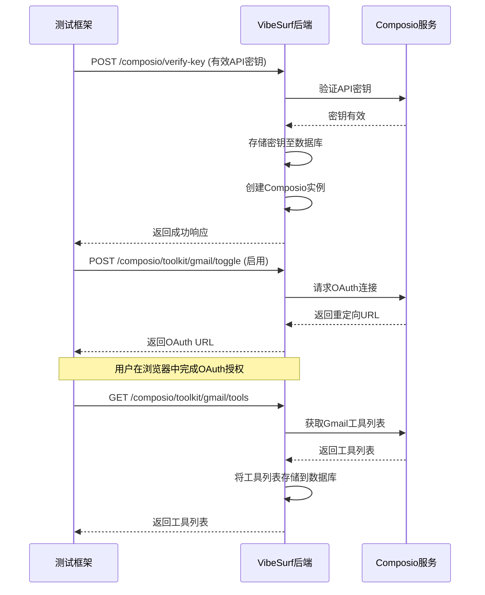
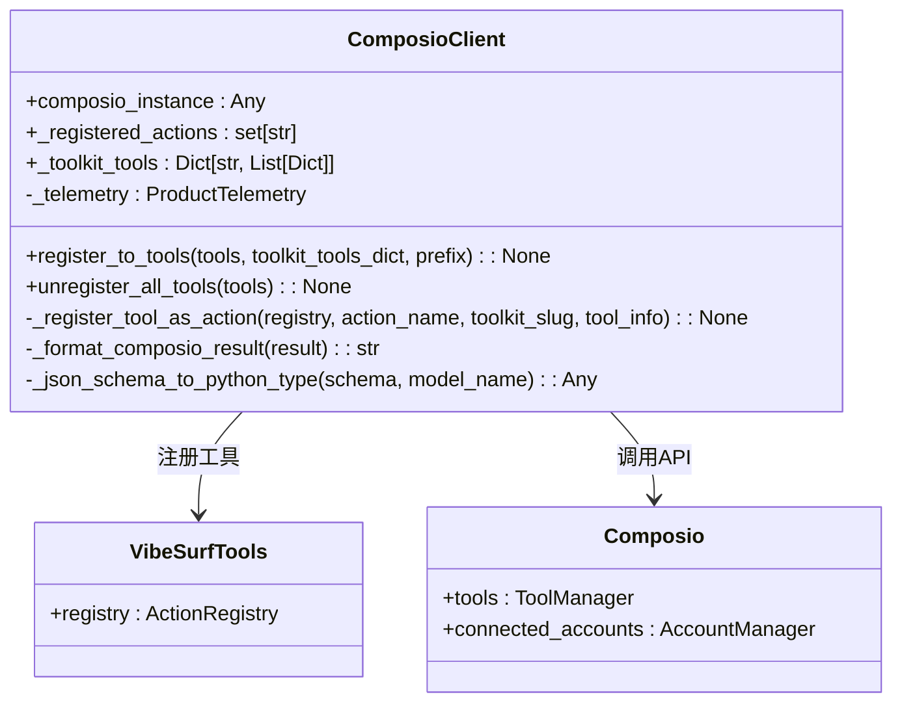
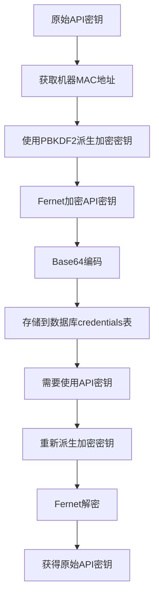

# 第三方服务集成测试

<cite>
**本文档引用的文件**   
- [test_api_tools.py](file://tests/test_api_tools.py)
- [test_tools.py](file://tests/test_tools.py)
- [composio.py](file://vibe_surf/backend/api/composio.py)
- [composio_client.py](file://vibe_surf/tools/composio_client.py)
- [composio_api.py](file://vibe_surf/workflows/Integrations/composio_api.py)
- [models.py](file://vibe_surf/backend/database/models.py)
- [queries.py](file://vibe_surf/backend/database/queries.py)
- [encryption.py](file://vibe_surf/backend/utils/encryption.py)
- [gmail_composio.py](file://vibe_surf/workflows/Integrations/gmail_composio.py)
- [slack_composio.py](file://vibe_surf/workflows/Integrations/slack_composio.py)
</cite>

## 目录
1. [引言](#引言)
2. [Composio集成系统测试方法](#composio集成系统测试方法)
3. [常用服务连接与操作功能测试](#常用服务连接与操作功能测试)
4. [外部API通信的Mock对象测试](#外部api通信的mock对象测试)
5. [测试凭证管理与安全性验证](#测试凭证管理与安全性验证)
6. [端到端测试场景](#端到端测试场景)
7. [集成稳定性与错误恢复机制测试](#集成稳定性与错误恢复机制测试)
8. [结论](#结论)

## 引言
VibeSurf平台通过Composio系统实现了与Gmail、Notion、Slack等第三方服务的深度集成。本测试文档系统阐述了针对这些集成的测试策略，重点覆盖认证流程、API调用、数据同步验证、凭证安全管理以及端到端功能测试。测试策略结合了单元测试、集成测试和端到端测试，确保系统在不同网络条件下的稳定性和可靠性。

## Composio集成系统测试方法

VibeSurf的第三方服务集成核心是Composio系统。测试策略围绕Composio API的调用、工具注册和状态管理展开。

### 认证流程测试
Composio集成的认证流程是测试的首要环节。系统通过API密钥和OAuth 2.0流程进行双重认证。测试用例需验证以下流程：
1.  **API密钥验证**: 通过`/composio/verify-key`端点，测试有效和无效API密钥的响应。有效密钥应被存储在数据库中并创建`Composio`实例。
2.  **OAuth 2.0连接**: 测试`/composio/toolkit/{slug}/toggle`端点。当启用一个需要OAuth的工具包（如Gmail）时，系统应生成一个重定向URL。测试需模拟用户完成OAuth流程，并验证连接状态是否更新为“ACTIVE”。



**Diagram sources**
- [composio.py](file://vibe_surf/backend/api/composio.py#L367-L728)

**Section sources**
- [composio.py](file://vibe_surf/backend/api/composio.py#L1-L800)
- [test_tools.py](file://tests/test_tools.py#L131-L250)

### API调用与数据同步验证
测试API调用的核心是验证VibeSurf如何通过Composio客户端执行外部服务的API。`ComposioClient`类负责将Composio工具注册为VibeSurf的内部动作。



**Diagram sources**
- [composio_client.py](file://vibe_surf/tools/composio_client.py#L39-L458)

**Section sources**
- [composio_client.py](file://vibe_surf/tools/composio_client.py#L1-L458)
- [composio_api.py](file://vibe_surf/workflows/Integrations/composio_api.py#L25-L280)

## 常用服务连接与操作功能测试

VibeSurf支持与Gmail、Slack、Notion等多种服务的集成。测试需覆盖这些服务的典型操作。

### Gmail集成测试
Gmail集成测试主要验证邮件的读取和发送功能。`gmail_composio.py`文件定义了具体的Gmail工具。

**Gmail集成测试用例**
| 测试用例 | 操作 | 预期结果 |
| :--- | :--- | :--- |
| 验证Gmail工具包 | 调用`get_composio_toolkits` | 返回包含Gmail的工具包列表 |
| 启用Gmail连接 | 调用`toggle_composio_toolkit`启用Gmail | 返回OAuth URL或确认已连接 |
| 获取邮件列表 | 调用`GMAIL_FETCH_EMAILS`工具 | 成功返回邮件摘要列表 |
| 发送测试邮件 | 调用`GMAIL_SEND_EMAIL`工具 | 邮件成功发送，返回成功状态 |

**Section sources**
- [gmail_composio.py](file://vibe_surf/workflows/Integrations/gmail_composio.py)

### Slack集成测试
Slack集成测试验证消息的发送和频道管理功能。

**Slack集成测试用例**
| 测试用例 | 操作 | 预期结果 |
| :--- | :--- | :--- |
| 启用Slack连接 | 调用`toggle_composio_toolkit`启用Slack | 返回OAuth URL或确认已连接 |
| 发送消息到频道 | 调用`SLACK_SEND_MESSAGE`工具 | 消息成功发布到指定频道 |
| 获取频道列表 | 调用`SLACK_GET_CHANNELS`工具 | 成功返回频道信息列表 |

**Section sources**
- [slack_composio.py](file://vibe_surf/workflows/Integrations/slack_composio.py)

## 外部API通信的Mock对象测试

为了确保测试的稳定性和可重复性，避免依赖外部服务的可用性，使用Mock对象来模拟外部API的通信。

### Mock测试策略
1.  **隔离外部依赖**: 在单元测试中，使用`unittest.mock`或`pytest-mock`库来模拟`composio`库的API调用。
2.  **模拟成功响应**: 对于`composio.tools.execute`等方法，模拟返回预定义的成功数据，以测试VibeSurf内部的处理逻辑。
3.  **模拟错误响应**: 模拟网络超时、认证失败等异常情况，以测试系统的错误处理和恢复机制。

```python
# 示例：使用pytest-mock测试ComposioClient
def test_composio_action_wrapper_success(mocker):
    # Arrange
    mock_composio = mocker.Mock()
    mock_result = {"message": "Email sent successfully"}
    mock_composio.tools.execute.return_value = mock_result
    
    client = ComposioClient(composio_instance=mock_composio)
    tools = VibeSurfTools()
    
    # Act
    toolkit_tools_dict = {
        "gmail": [{"name": "GMAIL_SEND_EMAIL", "enabled": True}]
    }
    client.register_to_tools(tools, toolkit_tools_dict)
    
    # Assert
    # 验证工具是否被正确注册
    assert "cpo.gmail.GMAIL_SEND_EMAIL" in tools.registry.registry.actions
```

**Section sources**
- [test_tools.py](file://tests/test_tools.py#L131-L250)
- [test_api_tools.py](file://tests/test_api_tools.py#L1-L142)

## 测试凭证管理与安全性验证

凭证的安全存储和管理是集成测试的关键部分。VibeSurf使用基于机器MAC地址的加密来保护API密钥。

### 加密与存储机制
1.  **密钥派生**: 使用`PBKDF2HMAC`算法，以机器的MAC地址作为密码，派生出加密密钥。
2.  **加密过程**: 当API密钥（如`COMPOSIO_API_KEY`）被存储时，会使用派生的密钥通过`Fernet`进行加密，并将结果以Base64编码后存入数据库的`credentials`表。
3.  **解密过程**: 当需要使用API密钥时，系统会重新派生密钥，对数据库中的加密值进行解密。



**Diagram sources**
- [encryption.py](file://vibe_surf/backend/utils/encryption.py#L23-L127)

**Section sources**
- [encryption.py](file://vibe_surf/backend/utils/encryption.py#L1-L172)
- [models.py](file://vibe_surf/backend/database/models.py#L217-L234)
- [queries.py](file://vibe_surf/backend/database/queries.py#L1345-L1417)

## 端到端测试场景

端到端测试模拟用户通过VibeSurf代理触发外部服务操作的完整流程。

### 场景：通过VibeSurf发送Slack消息
1.  **用户请求**: 用户通过前端界面请求“向#general频道发送一条测试消息”。
2.  **任务创建**: VibeSurf后端创建一个任务，关联到用户的会话。
3.  **工具执行**: 系统根据任务描述，调用已注册的`cpo.slack.SLACK_SEND_MESSAGE`动作。
4.  **代理调用**: `ComposioClient`通过`composio` SDK，使用存储的凭证，向Slack API发送请求。
5.  **结果验证**: 测试验证Slack频道中是否出现新消息，并检查VibeSurf任务的执行结果是否为成功。

**Section sources**
- [composio_client.py](file://vibe_surf/tools/composio_client.py#L183-L289)
- [composio.py](file://vibe_surf/backend/api/composio.py#L731-L799)

## 集成稳定性与错误恢复机制测试

测试系统在不同网络条件下的表现和错误恢复能力至关重要。

### 测试策略
1.  **网络延迟测试**: 使用工具（如`toxiproxy`）引入网络延迟，测试API调用的超时处理。
2.  **服务中断测试**: 模拟外部服务（如Gmail）暂时不可用，验证VibeSurf是否能捕获异常并提供有意义的错误信息。
3.  **凭证过期测试**: 手动使数据库中的OAuth令牌失效，测试系统是否能检测到连接状态为“disconnected”，并引导用户重新授权。
4.  **重试机制**: 验证对于临时性错误（如503服务不可用），系统是否有适当的重试逻辑。

**Section sources**
- [composio_client.py](file://vibe_surf/tools/composio_client.py#L197-L238)
- [composio.py](file://vibe_surf/backend/api/composio.py#L531-L728)

## 结论
本测试文档全面阐述了VibeSurf与第三方服务集成的测试策略。通过结合API密钥验证、OAuth流程测试、Mock对象模拟、凭证安全验证和端到端场景测试，可以确保集成系统的功能完整性、安全性和稳定性。持续的集成测试是保障VibeSurf平台可靠性的关键。