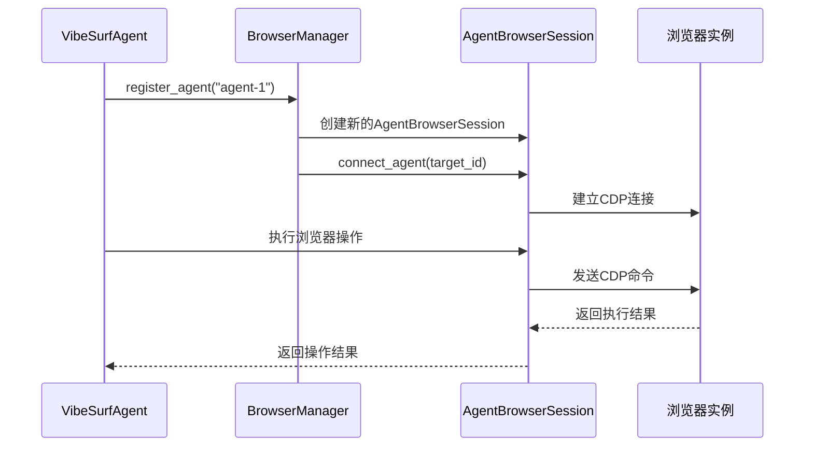
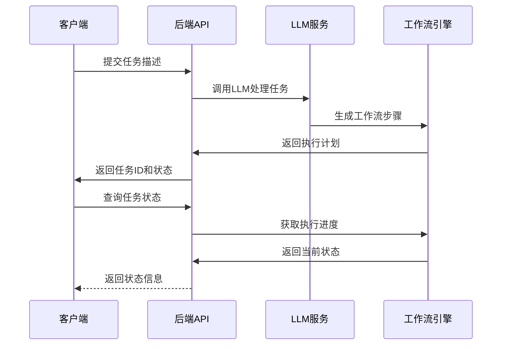
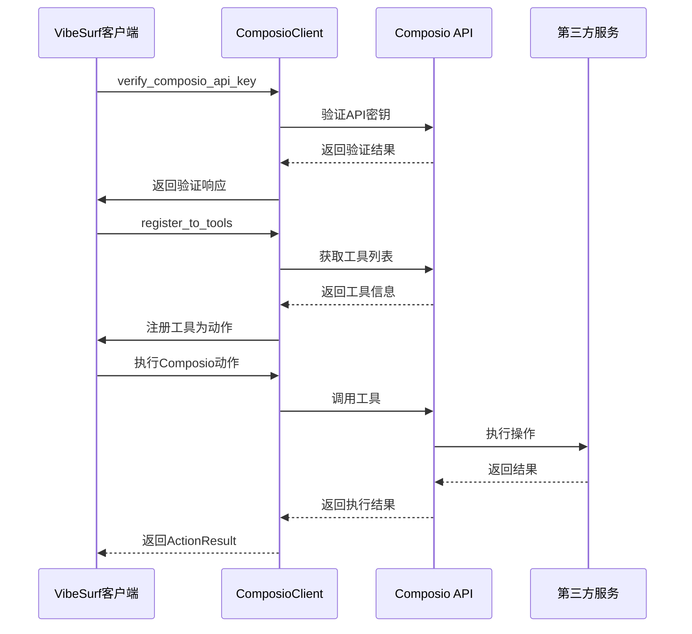
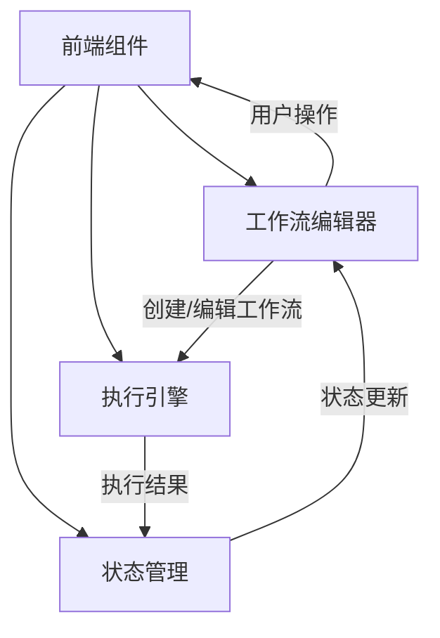

# 集成测试

<cite>
**本文档引用的文件**   
- [test_agents.py](file://tests/test_agents.py)
- [test_browser.py](file://tests/test_browser.py)
- [test_backend_api.py](file://tests/test_backend_api.py)
- [test_api_tools.py](file://tests/test_api_tools.py)
- [browser_use_agent.py](file://vibe_surf/agents/browser_use_agent.py)
- [browser_manager.py](file://vibe_surf/browser/browser_manager.py)
- [composio_client.py](file://vibe_surf/tools/composio_client.py)
- [composio.py](file://vibe_surf/backend/api/composio.py)
- [manager.py](file://vibe_surf/backend/database/manager.py)
- [jest.config.js](file://vibe_surf/frontend/jest.config.js)
- [playwright.config.ts](file://vibe_surf/frontend/playwright.config.ts)
</cite>

## 目录
1. [代理系统与浏览器自动化集成测试](#代理系统与浏览器自动化集成测试)
2. [LLM服务与工作流引擎集成测试](#llm服务与工作流引擎集成测试)
3. [第三方服务集成测试](#第三方服务集成测试)
4. [后端集成测试示例](#后端集成测试示例)
5. [前端组件交互测试](#前端组件交互测试)
6. [测试环境配置](#测试环境配置)

## 代理系统与浏览器自动化集成测试

VibeSurf项目中的代理系统与浏览器自动化功能通过`browser_use_agent`与`browser_manager`组件实现紧密协同。集成测试验证了代理系统能够正确控制浏览器实例并执行复杂任务。

测试用例`test_vibe_surf_agent`验证了`VibeSurfAgent`能够处理简单任务和浏览器任务。代理系统通过`BrowserManager`管理多个`AgentBrowserSession`实例，确保每个代理都有独立的浏览器会话。`BrowserManager`的`register_agent`方法为每个代理创建隔离的浏览器会话，而`assign_target_to_agent`方法确保代理能够正确分配和控制目标页面。



**Diagram sources**
- [test_agents.py](file://tests/test_agents.py#L150-L229)
- [browser_manager.py](file://vibe_surf/browser/browser_manager.py#L47-L72)
- [browser_use_agent.py](file://vibe_surf/agents/browser_use_agent.py#L83-L800)

**Section sources**
- [test_agents.py](file://tests/test_agents.py#L150-L229)
- [test_browser.py](file://tests/test_browser.py#L22-L58)
- [browser_manager.py](file://vibe_surf/browser/browser_manager.py#L24-L185)

## LLM服务与工作流引擎集成测试

LLM服务与工作流引擎的集成测试主要通过`langflow`组件与后端API的交互来验证。测试确保LLM能够正确解析任务、生成响应，并与工作流引擎协同工作。

`test_backend_api.py`中的测试用例验证了后端API的完整生命周期，包括LLM配置管理、任务提交、控制操作（暂停/恢复/停止）以及状态查询。`BackendAPITester`类提供了完整的API测试框架，能够验证LLM配置的CRUD操作。



**Diagram sources**
- [test_backend_api.py](file://tests/test_backend_api.py#L242-L350)
- [composio.py](file://vibe_surf/backend/api/composio.py#L223-L364)

## 第三方服务集成测试

第三方服务集成的测试主要通过`composio_client`与外部API的通信来验证。测试确保系统能够正确连接、验证和使用各种第三方服务。

`composio_client.py`实现了与Composio平台的集成，通过`register_to_tools`方法将Composio工具注册为VibeSurf动作。测试用例验证了API密钥验证、工具注册和执行的完整流程。



**Diagram sources**
- [composio_client.py](file://vibe_surf/tools/composio_client.py#L60-L299)
- [composio.py](file://vibe_surf/backend/api/composio.py#L367-L421)

## 后端集成测试示例

使用pytest进行后端集成测试的具体示例展示了数据库连接、API端点调用和外部服务mock的实现。

`test_backend_api.py`提供了完整的后端集成测试框架，包括：

1. **数据库连接测试**：通过`DBMigrationManager`和`DatabaseManager`验证数据库初始化和迁移
2. **API端点调用**：使用`aiohttp`客户端测试各个API端点
3. **外部服务mock**：通过配置测试环境模拟外部服务响应

```python
# 示例：API测试客户端
class BackendAPITester:
    async def __aenter__(self):
        self.session = aiohttp.ClientSession()
        return self

    async def __aexit__(self, exc_type, exc_val, exc_tb):
        if self.session:
            await self.session.close()

    async def get(self, endpoint: str, params: Optional[Dict[str, Any]] = None):
        async with self.session.get(f"{API_BASE}{endpoint}", params=params) as resp:
            result = await resp.json()
            return {"status": resp.status, "data": result}
```

**Section sources**
- [test_backend_api.py](file://tests/test_backend_api.py#L24-L777)
- [manager.py](file://vibe_surf/backend/database/manager.py#L27-L319)

## 前端组件交互测试

前端组件间的交互测试主要针对工作流编辑器与执行引擎的集成。测试确保用户在编辑器中的操作能够正确触发后端执行引擎。

前端测试配置包括：
- **Jest**：用于单元测试和组件测试
- **Playwright**：用于端到端的浏览器测试



**Section sources**
- [jest.config.js](file://vibe_surf/frontend/jest.config.js#L1-L61)
- [playwright.config.ts](file://vibe_surf/frontend/playwright.config.ts#L1-L128)

## 测试环境配置

测试环境的配置和依赖管理策略确保测试能够在不同环境中一致运行。

1. **环境变量管理**：通过`.env`文件和`dotenv`库管理测试配置
2. **依赖管理**：使用`pyproject.toml`定义Python依赖
3. **测试配置**：
   - Jest配置文件：`jest.config.js`
   - Playwright配置文件：`playwright.config.ts`
   - 测试发现：`pytest`自动发现`tests/`目录下的测试文件

**Section sources**
- [jest.config.js](file://vibe_surf/frontend/jest.config.js#L1-L61)
- [playwright.config.ts](file://vibe_surf/frontend/playwright.config.ts#L1-L128)
- [.env.example](file://.env.example)