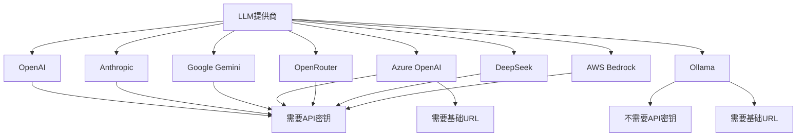
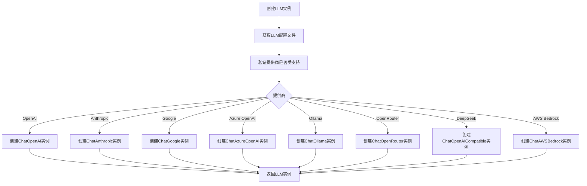

# LLM调用调试

<cite>
**本文档引用的文件**   
- [llm_config.py](file://vibe_surf/backend/llm_config.py)
- [llm_factory.py](file://vibe_surf/backend/utils/llm_factory.py)
- [openai_compatible.py](file://vibe_surf/llm/openai_compatible.py)
- [main.py](file://vibe_surf/backend/main.py)
- [shared_state.py](file://vibe_surf/backend/shared_state.py)
- [models.py](file://vibe_surf/backend/api/models.py)
- [database/models.py](file://vibe_surf/backend/database/models.py)
- [database/queries.py](file://vibe_surf/backend/database/queries.py)
- [task.py](file://vibe_surf/backend/api/task.py)
- [vibesurf_tools.py](file://vibe_surf/tools/vibesurf_tools.py)
- [encryption.py](file://vibe_surf/backend/utils/encryption.py)
- [logger.py](file://vibe_surf/logger.py)
</cite>

## 目录
1. [LLM配置与调试](#llm配置与调试)
2. [提示词工程问题调试](#提示词工程问题调试)
3. [LLM响应延迟分析](#llm响应延迟分析)
4. [API请求/响应数据捕获](#api请求响应数据捕获)
5. [不同LLM提供商的调试技巧](#不同llm提供商的调试技巧)
6. [认证与配额错误处理](#认证与配额错误处理)
7. [提示词优化与响应解析](#提示词优化与响应解析)

## LLM配置与调试

VibeSurf项目提供了一套完整的LLM配置和调试机制，通过集中化的配置管理、加密存储和连接测试来确保LLM调用的稳定性和安全性。

### LLM提供商配置

系统支持多种LLM提供商，包括OpenAI、Anthropic、Google Gemini、Azure OpenAI、Groq、Ollama、OpenRouter、DeepSeek、AWS Bedrock等。每个提供商都有其特定的元数据配置，包括是否需要API密钥、是否支持自定义基础URL、是否支持工具调用等功能。



**Diagram sources**
- [llm_config.py](file://vibe_surf/backend/llm_config.py#L8-L226)

**Section sources**
- [llm_config.py](file://vibe_surf/backend/llm_config.py#L8-L226)

### LLM实例创建与验证

系统通过`llm_factory.py`中的`create_llm_from_profile`函数根据配置文件创建LLM实例。该函数会验证提供商是否受支持，并根据提供商的特性构建相应的参数。



**Diagram sources**
- [llm_factory.py](file://vibe_surf/backend/utils/llm_factory.py#L23-L215)

**Section sources**
- [llm_factory.py](file://vibe_surf/backend/utils/llm_factory.py#L23-L215)

### LLM连接测试

在提交任务时，系统会自动测试LLM连接的可用性。通过向LLM发送一个简单的测试问题（"法国的首都是什么？用一个词回答。"）来验证连接是否正常。

```mermaid
graph TD
A[提交任务] --> B[获取LLM配置文件]
B --> C[创建LLM实例]
C --> D[发送测试消息]
D --> E{收到响应?}
E --> |是| F[验证响应内容]
E --> |否| G[返回连接失败]
F --> H{包含"巴黎"?}
H --> |是| I[连接成功]
H --> |否| J[记录警告但继续]
I --> K[更新VibeSurf代理的LLM]
J --> K
K --> L[返回成功]
```

**Diagram sources**
- [task.py](file://vibe_surf/backend/api/task.py#L154-L194)

**Section sources**
- [task.py](file://vibe_surf/backend/api/task.py#L154-L194)

## 提示词工程问题调试

### 提示词格式错误

当提示词格式不正确时，系统会捕获相应的异常并返回详细的错误信息。常见的格式错误包括JSON格式错误、缺少必需字段等。

```python
# 示例：处理JSON修复
from json_repair import repair_json

try:
    parsed = output_format.model_validate_json(output_content)
except Exception as e:
    repair_content = repair_json(output_content)
    parsed = output_format.model_validate_json(repair_content)
```

**Section sources**
- [openai_compatible.py](file://vibe_surf/llm/openai_compatible.py#L333-L334)

### 上下文长度超限

系统通过配置`max_tokens`参数来控制生成内容的最大长度，防止超出模型的上下文限制。

```python
# 在LLM配置中设置最大令牌数
common_params = {}
if max_tokens is not None and "max_tokens" in supported_params:
    common_params["max_tokens"] = max_tokens
```

**Section sources**
- [llm_factory.py](file://vibe_surf/backend/utils/llm_factory.py#L70-L71)

### 指令不明确

系统通过在系统提示中添加JSON模式来确保LLM返回结构化的响应，从而避免指令不明确的问题。

```python
# 添加JSON模式到系统提示
if self.add_schema_to_system_prompt and openai_messages and openai_messages[0]['role'] == 'system':
    schema_text = "Your response must return JSON with followed format:\n"
    schema_text += f'\n<json_schema>\n{response_format}\n</json_schema>'
    if isinstance(openai_messages[0]['content'], str):
        openai_messages[0]['content'] += schema_text
    elif isinstance(openai_messages[0]['content'], Iterable):
        openai_messages[0]['content'] = list(openai_messages[0]['content']) + [
            ChatCompletionContentPartTextParam(text=schema_text, type='text')
        ]
```

**Section sources**
- [openai_compatible.py](file://vibe_surf/llm/openai_compatible.py#L292-L301)

## LLM响应延迟分析

### 网络问题

系统通过异步HTTP客户端和超时设置来处理网络问题。如果网络请求超时，会捕获相应的异常并返回错误信息。

```python
async def load_bundles_with_error_handling():
    try:
        return await load_bundles_from_urls()
    except (httpx.TimeoutException, httpx.HTTPError, httpx.RequestError) as exc:
        await logger.aerror(f"Error loading bundles from URLs: {exc}")
        return [], []
```

**Section sources**
- [main.py](file://vibe_surf/backend/main.py#L150-L162)

### 模型负载过高

当模型负载过高时，系统会收到速率限制错误（RateLimitError），并将其转换为适当的模型提供商错误。

```python
except RateLimitError as e:
    error_message = e.response.json().get('error', {})
    error_message = (
        error_message.get('message', 'Unknown model error') if isinstance(error_message,
                                                                          dict) else error_message
    )
    raise ModelProviderError(
        message=error_message,
        status_code=e.response.status_code,
        model=self.name,
    ) from e
```

**Section sources**
- [openai_compatible.py](file://vibe_surf/llm/openai_compatible.py#L341-L351)

### 提示词复杂度过高

复杂的提示词可能导致模型处理时间过长。系统通过设置合理的超时和重试机制来应对这种情况。

```python
# 在延迟初始化MCP服务器时增加延迟
async def delayed_init_mcp_servers():
    await asyncio.sleep(10.0)  # 增加延迟以允许启动项目创建
    # ... 其他代码
```

**Section sources**
- [main.py](file://vibe_surf/backend/main.py#L259-L260)

## API请求/响应数据捕获

### 中间件日志记录

系统使用中间件来记录API请求和响应的完整通信内容。

```python
class JavaScriptMIMETypeMiddleware(BaseHTTPMiddleware):
    async def dispatch(self, request: Request, call_next: RequestResponseEndpoint) -> Response:
        try:
            response = await call_next(request)
        except Exception as exc:
            if isinstance(exc, PydanticSerializationError):
                message = (
                    "Something went wrong while serializing the response. "
                    "Please share this error on our GitHub repository."
                )
                error_messages = json.dumps([message, str(exc)])
                raise HTTPException(status_code=HTTPStatus.INTERNAL_SERVER_ERROR, detail=error_messages) from exc
            raise
        if (
            "files/" not in request.url.path
            and request.url.path.endswith(".js")
            and response.status_code == HTTPStatus.OK
        ):
            response.headers["Content-Type"] = "text/javascript"
        return response
```

**Section sources**
- [main.py](file://vibe_surf/backend/main.py#L521-L540)

### 详细日志配置

系统配置了详细的日志记录，包括文件日志和控制台日志，以便于调试。

```python
def setup_logger(name: str = "vibesurf") -> logging.Logger:
    # 获取调试标志
    debug_mode = os.getenv("VIBESURF_DEBUG", "false").lower() in ("true", "1", "yes", "on")
    log_level = logging.DEBUG if debug_mode else logging.INFO
    
    # 创建格式化器
    if log_level == logging.DEBUG:
        formatter = logging.Formatter(
            fmt='%(asctime)s - %(name)s - %(levelname)s - %(filename)s:%(lineno)d - %(funcName)s() - %(message)s',
            datefmt='%Y-%m-%d %H:%M:%S'
        )
    else:
        formatter = logging.Formatter(
            fmt='%(asctime)s - %(name)s - %(levelname)s - %(message)s',
            datefmt='%Y-%m-%d %H:%M:%S'
        )
    
    # 控制台处理器
    console_handler = logging.StreamHandler()
    console_handler.setLevel(log_level)
    console_handler.setFormatter(formatter)
    logger.addHandler(console_handler)
    
    # 文件处理器
    try:
        workspace_dir = get_workspace_dir()
        logs_dir = os.path.join(workspace_dir, "logs")
        os.makedirs(logs_dir, exist_ok=True)
        
        current_date = datetime.now().strftime("%Y-%m-%d")
        log_filename = f"log_{current_date}.log"
        log_filepath = os.path.join(logs_dir, log_filename)
        
        file_handler = RotatingFileHandler(
            log_filepath,
            maxBytes=10 * 1024 * 1024,  # 10MB
            backupCount=5,
            encoding='utf-8'
        )
        file_handler.setLevel(log_level)
        file_handler.setFormatter(formatter)
        logger.addHandler(file_handler)
        
    except Exception as e:
        logger.error(f"Failed to setup file logging: {e}")
        logger.warning("Continuing with console logging only")
    
    return logger
```

**Section sources**
- [logger.py](file://vibe_surf/logger.py#L12-L82)

## 不同LLM提供商的调试技巧

### OpenAI

对于OpenAI，需要确保API密钥正确，并且模型名称是受支持的。

```python
elif provider == "openai":
    params = {
        "model": model,
        "api_key": api_key,
        **common_params
    }
    if base_url:
        params["base_url"] = base_url
    return ChatOpenAI(**params)
```

**Section sources**
- [llm_factory.py](file://vibe_surf/backend/utils/llm_factory.py#L84-L92)

### Ollama

对于Ollama，需要指定主机地址，默认为`http://localhost:11434`。

```python
elif provider == "ollama":
    params = {
        "model": model,
        **common_params
    }
    if base_url:
        params["host"] = base_url
    else:
        params["host"] = "http://localhost:11434"  # 默认Ollama URL
    return ChatOllama(**params)
```

**Section sources**
- [llm_factory.py](file://vibe_surf/backend/utils/llm_factory.py#L126-L135)

### OpenAI兼容API

对于OpenAI兼容的API，如DeepSeek，需要指定基础URL。

```python
elif provider == "deepseek":
    return ChatOpenAICompatible(
        model=model,
        base_url="https://api.deepseek.com",
        api_key=api_key,
        **common_params
    )
```

**Section sources**
- [llm_factory.py](file://vibe_surf/backend/utils/llm_factory.py#L144-L150)

## 认证与配额限制

### 认证失败

系统通过加密存储API密钥来防止认证失败。API密钥使用机器MAC地址进行加密。

```python
def encrypt_api_key(api_key: str) -> str:
    """
    使用机器特定密钥加密API密钥。
    
    Args:
        api_key: 明文API密钥
        
    Returns:
        str: Base64编码的加密API密钥
    """
    if not api_key or api_key.strip() == "":
        return ""
    
    try:
        key = get_encryption_key()
        fernet = Fernet(key)
        encrypted_data = fernet.encrypt(api_key.encode('utf-8'))
        return base64.urlsafe_b64encode(encrypted_data).decode('utf-8')
    except Exception as e:
        logger.error(f"Failed to encrypt API key: {e}")
        raise ValueError("Encryption failed")
```

**Section sources**
- [encryption.py](file://vibe_surf/backend/utils/encryption.py#L76-L96)

### 配额限制

当达到配额限制时，系统会捕获相应的HTTP状态错误并返回适当的错误信息。

```python
except APIStatusError as e:
    try:
        error_message = e.response.json().get('error', {})
    except Exception:
        error_message = e.response.text
    error_message = (
        error_message.get('message', 'Unknown model error') if isinstance(error_message,
                                                                          dict) else error_message
    )
    raise ModelProviderError(
        message=error_message,
        status_code=e.response.status_code,
        model=self.name,
    ) from e
```

**Section sources**
- [openai_compatible.py](file://vibe_surf/llm/openai_compatible.py#L356-L368)

## 提示词优化与响应解析错误处理

### 提示词优化

系统通过在系统提示中添加JSON模式来优化提示词，确保LLM返回结构化的响应。

```python
# 添加JSON模式到系统提示
if self.add_schema_to_system_prompt and openai_messages and openai_messages[0]['role'] == 'system':
    schema_text = "Your response must return JSON with followed format:\n"
    schema_text += f'\n<json_schema>\n{response_format}\n</json_schema>'
    if isinstance(openai_messages[0]['content'], str):
        openai_messages[0]['content'] += schema_text
    elif isinstance(openai_messages[0]['content'], Iterable):
        openai_messages[0]['content'] = list(openai_messages[0]['content']) + [
            ChatCompletionContentPartTextParam(text=schema_text, type='text')
        ]
```

**Section sources**
- [openai_compatible.py](file://vibe_surf/llm/openai_compatible.py#L292-L301)

### 响应解析错误处理

当响应解析失败时，系统会尝试修复JSON并重新解析。

```python
try:
    parsed = output_format.model_validate_json(output_content)
except Exception as e:
    repair_content = repair_json(output_content)
    parsed = output_format.model_validate_json(repair_content)
```

**Section sources**
- [openai_compatible.py](file://vibe_surf/llm/openai_compatible.py#L331-L334)