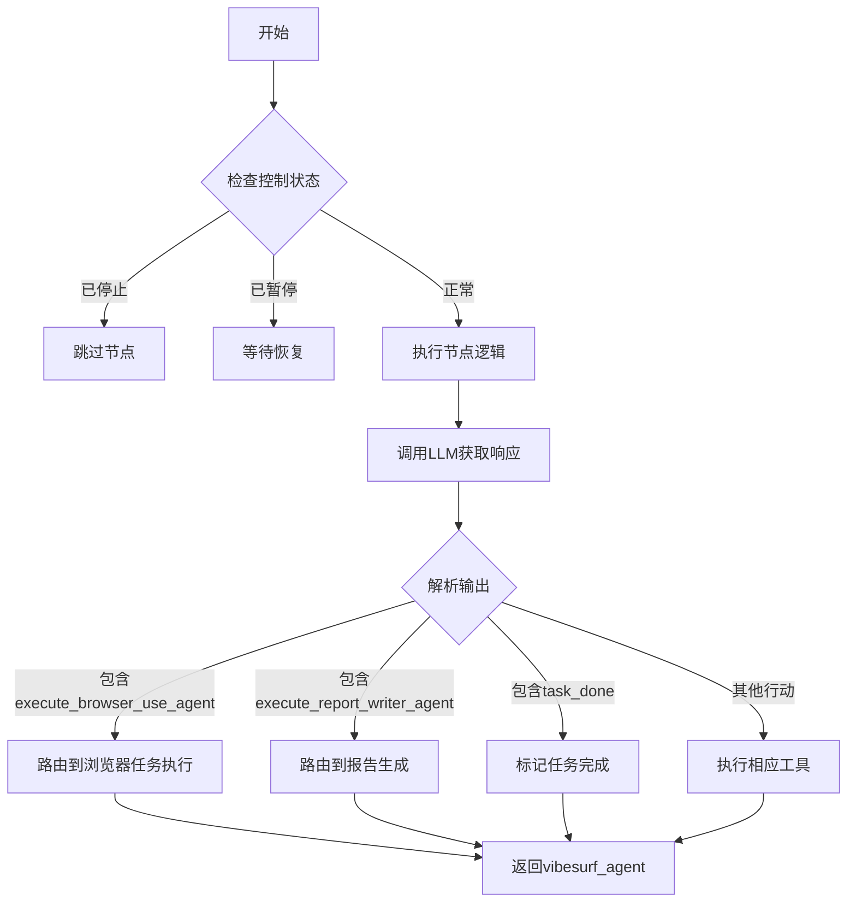
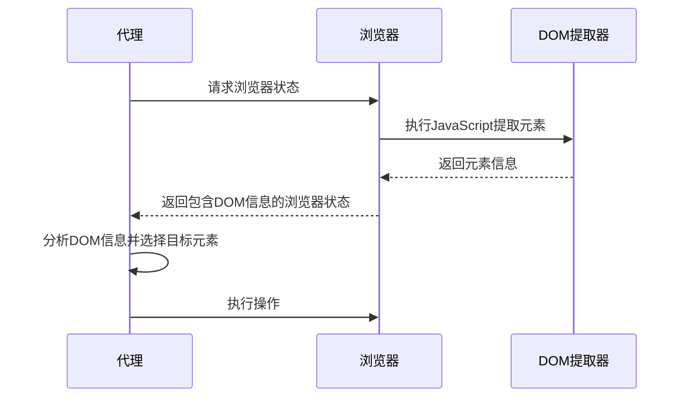
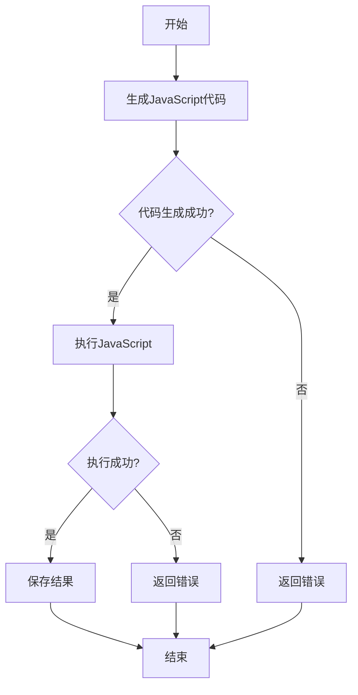
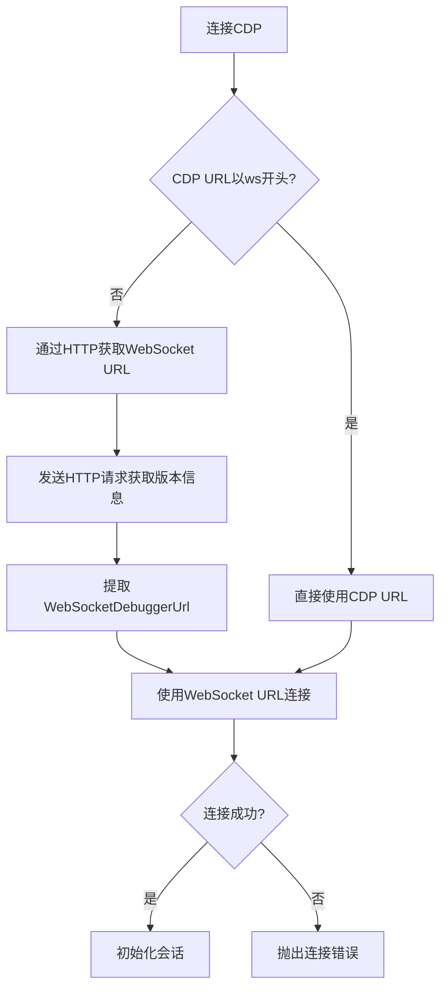
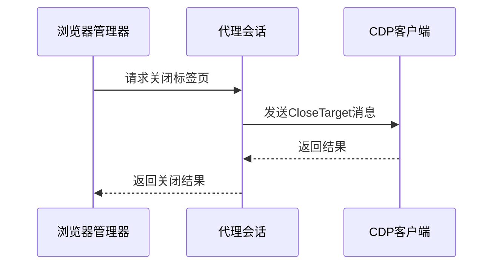
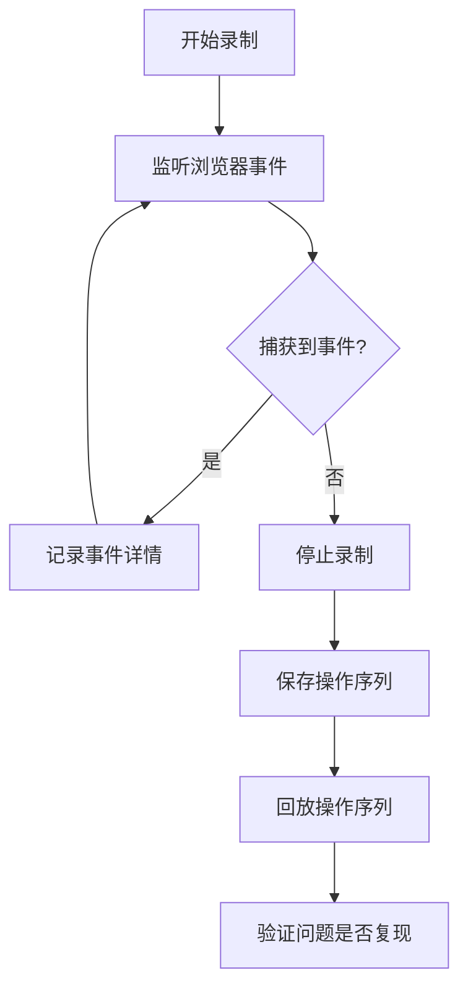
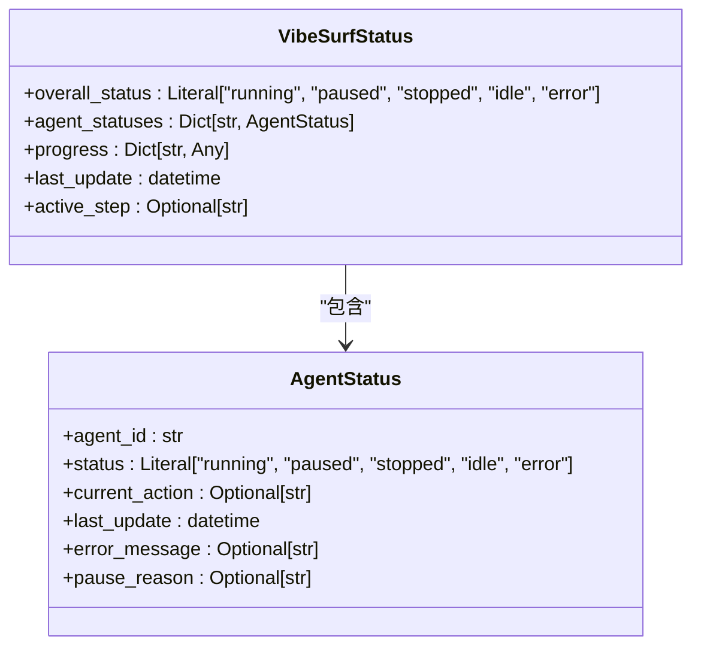
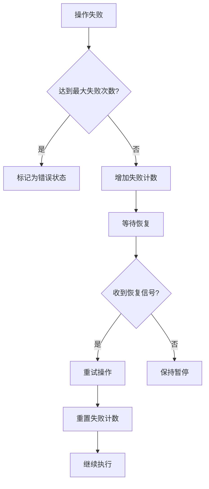

# 代理系统调试

<cite>
**本文档引用的文件**   
- [vibe_surf_agent.py](file://vibe_surf/agents/vibe_surf_agent.py)
- [browser_use_agent.py](file://vibe_surf/agents/browser_use_agent.py)
- [agent_browser_session.py](file://vibe_surf/browser/agent_browser_session.py)
- [find_page_element.py](file://vibe_surf/browser/find_page_element.py)
- [action_watchdog.py](file://vibe_surf/browser/watchdogs/action_watchdog.py)
- [dom_watchdog.py](file://vibe_surf/browser/watchdogs/dom_watchdog.py)
- [browser_use_tools.py](file://vibe_surf/tools/browser_use_tools.py)
- [browser_manager.py](file://vibe_surf/browser/browser_manager.py)
- [views.py](file://vibe_surf/agents/views.py)
- [logger.py](file://vibe_surf/logger.py)
</cite>

## 目录
1. [代理决策过程调试](#代理决策过程调试)
2. [浏览器自动化调试技巧](#浏览器自动化调试技巧)
3. [浏览器会话管理调试](#浏览器会话管理调试)
4. [Chrome DevTools 协同调试](#chrome-devtools-协同调试)
5. [代理状态监控与恢复](#代理状态监控与恢复)

## 代理决策过程调试

VibeSurf代理系统采用基于LangGraph的状态机架构来管理代理的决策流程。核心决策逻辑位于`vibe_surf_agent.py`文件中，通过`VibeSurfState`数据类维护整个执行过程的状态。

代理的决策过程遵循"思考-行动"模式，每个决策步骤都会生成结构化的输出，包含思考过程（thinking）、评估（evaluation_previous_goal）、下一步目标（next_goal）和具体行动（action）。这些信息通过回调函数记录到活动日志中，便于开发者追踪代理的决策链。

**图源**
- [vibe_surf_agent.py](file://vibe_surf/agents/vibe_surf_agent.py#L344-L546)

**节源**
- [vibe_surf_agent.py](file://vibe_surf/agents/vibe_surf_agent.py#L1-L546)

## 浏览器自动化调试技巧

### DOM元素定位失败调试

当代理无法定位DOM元素时，系统会通过`find_page_element.py`中的`SemanticExtractor`类进行元素提取。该类使用JavaScript在浏览器上下文中执行，提取所有可交互元素的信息，包括文本内容、CSS选择器、XPath等。

调试DOM元素定位问题时，可以检查以下信息：
- 元素的文本内容是否准确提取
- CSS选择器和XPath是否正确生成
- 元素是否在视口中可见
- 页面是否已完全加载

**图源**
- [find_page_element.py](file://vibe_surf/browser/find_page_element.py#L211-L800)
- [dom_watchdog.py](file://vibe_surf/browser/watchdogs/dom_watchdog.py#L26-L250)

**节源**
- [find_page_element.py](file://vibe_surf/browser/find_page_element.py#L1-L800)

### JavaScript执行问题调试

JavaScript执行问题通常发生在代理需要执行自定义脚本时。系统通过`browser_use_tools.py`中的`gen_and_execute_js_code`函数处理此类操作。

调试JavaScript执行问题时，可以：
1. 检查生成的JavaScript代码是否符合预期
2. 验证代码在浏览器开发者工具中的执行结果
3. 查看错误日志中的详细错误信息

**图源**
- [browser_use_tools.py](file://vibe_surf/tools/browser_use_tools.py#L311-L347)

**节源**
- [browser_use_tools.py](file://vibe_surf/tools/browser_use_tools.py#L1-L492)

## 浏览器会话管理调试

### 会话超时问题排查

浏览器会话超时问题通常与CDP（Chrome DevTools Protocol）连接有关。`agent_browser_session.py`文件中的`AgentBrowserSession`类负责管理会话连接。

排查会话超时问题的步骤：
1. 检查CDP URL是否有效
2. 验证浏览器是否仍在运行
3. 确认网络连接是否稳定
4. 查看日志中的连接错误信息

**图源**
- [agent_browser_session.py](file://vibe_surf/browser/agent_browser_session.py#L171-L212)

**节源**
- [agent_browser_session.py](file://vibe_surf/browser/agent_browser_session.py#L1-L800)

### 标签页异常关闭问题排查

标签页异常关闭问题可能由多种原因引起，包括用户操作、脚本执行或系统错误。`browser_manager.py`文件中的`BrowserManager`类负责管理多个代理的浏览器会话。

排查标签页异常关闭问题的步骤：
1. 检查是否有其他代理或用户关闭了标签页
2. 验证标签页所有权
3. 查看关闭操作的调用堆栈

**图源**
- [browser_manager.py](file://vibe_surf/browser/browser_manager.py#L123-L142)

**节源**
- [browser_manager.py](file://vibe_surf/browser/browser_manager.py#L1-L269)

## Chrome DevTools 协同调试

VibeSurf代理系统与Chrome DevTools深度集成，允许开发者使用DevTools与代理协同调试。系统通过CDP协议与浏览器通信，可以在DevTools中查看代理的操作。

### 录制和回放浏览器操作序列

系统支持录制和回放浏览器操作序列，帮助开发者复现问题。操作序列的录制通过监听浏览器事件实现，包括点击、输入、导航等。

**节源**
- [action_watchdog.py](file://vibe_surf/browser/watchdogs/action_watchdog.py#L24-L109)

## 代理状态监控与恢复

### 代理状态监控

代理状态通过`VibeSurfStatus`和`AgentStatus`数据类进行监控。系统定期更新代理状态，包括运行状态、当前操作、错误信息等。

**图源**
- [vibe_surf_agent.py](file://vibe_surf/agents/vibe_surf_agent.py#L85-L92)

**节源**
- [vibe_surf_agent.py](file://vibe_surf/agents/vibe_surf_agent.py#L85-L92)

### 代理执行中断恢复

当代理执行中断时，系统提供多种恢复策略：
1. 自动重试失败的操作
2. 暂停并等待用户干预
3. 回退到上一个稳定状态
4. 重新启动代理

恢复策略的选择取决于中断的原因和严重程度。系统通过`control_aware_node`包装器实现控制状态检查，在执行每个节点前检查暂停和停止状态。

**节源**
- [vibe_surf_agent.py](file://vibe_surf/agents/vibe_surf_agent.py#L300-L342)