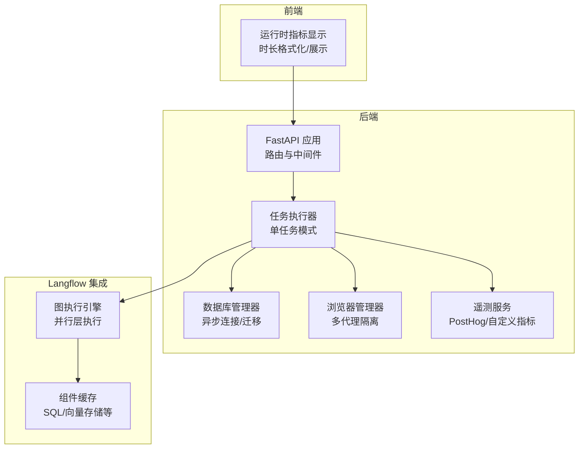
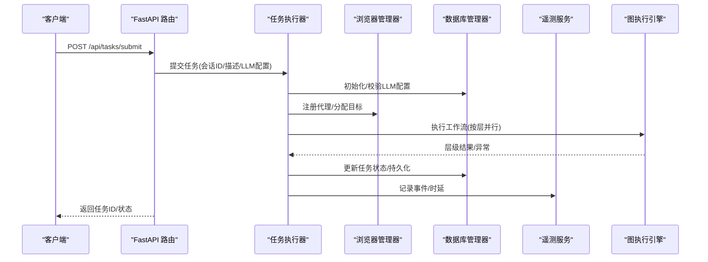
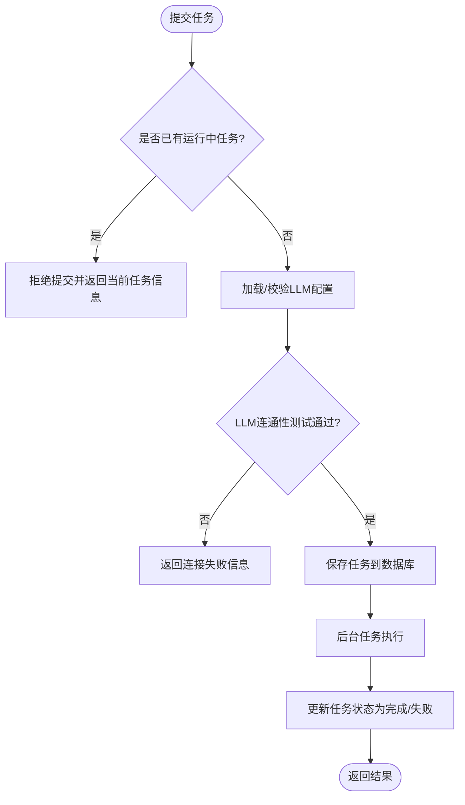
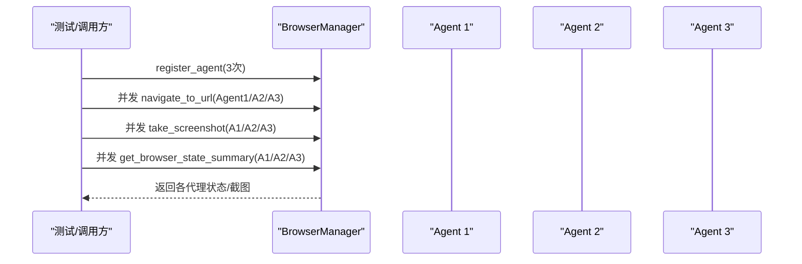
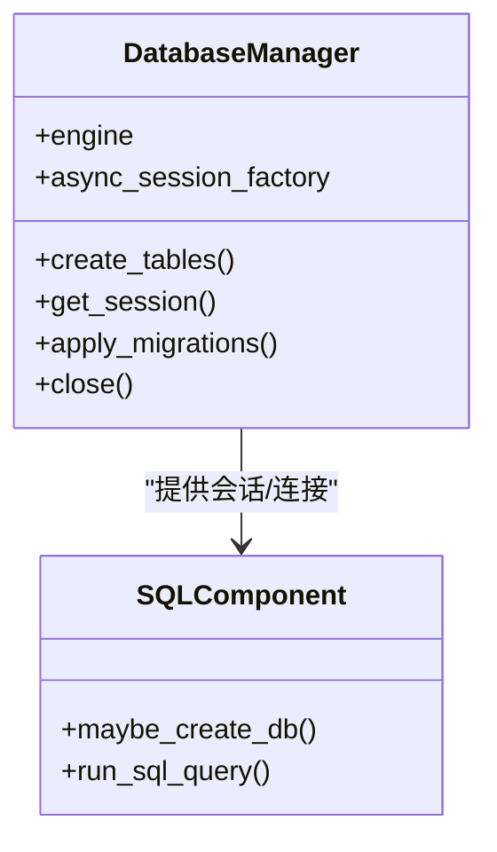
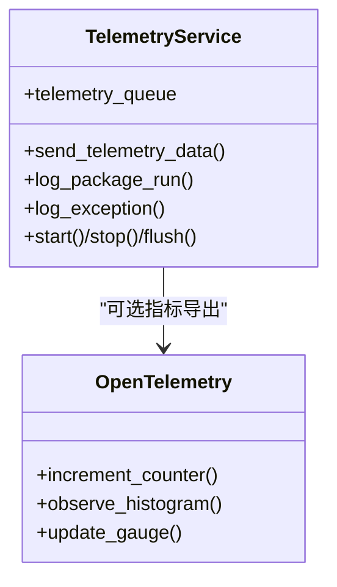
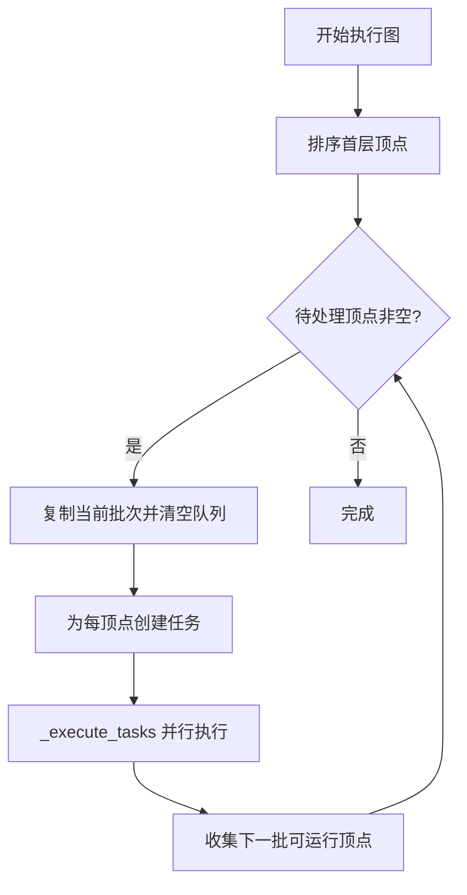
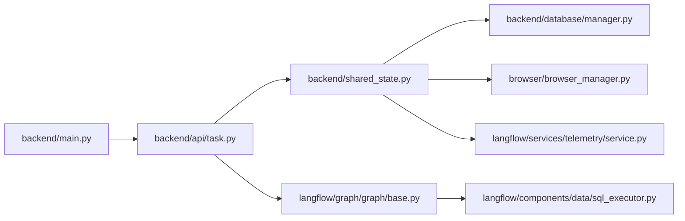

# 性能分析

<cite>
**本文引用的文件**
- [vibe_surf/backend/main.py](file://vibe_surf/backend/main.py)
- [vibe_surf/backend/api/task.py](file://vibe_surf/backend/api/task.py)
- [vibe_surf/backend/shared_state.py](file://vibe_surf/backend/shared_state.py)
- [vibe_surf/backend/database/manager.py](file://vibe_surf/backend/database/manager.py)
- [vibe_surf/browser/browser_manager.py](file://vibe_surf/browser/browser_manager.py)
- [vibe_surf/langflow/services/telemetry/service.py](file://vibe_surf/langflow/services/telemetry/service.py)
- [vibe_surf/langflow/services/telemetry/opentelemetry.py](file://vibe_surf/langflow/services/telemetry/opentelemetry.py)
- [vibe_surf/langflow/components/data/sql_executor.py](file://vibe_surf/langflow/components/data/sql_executor.py)
- [vibe_surf/langflow/components/langchain_utilities/sql_generator.py](file://vibe_surf/langflow/components/langchain_utilities/sql_generator.py)
- [vibe_surf/frontend/src/CustomNodes/GenericNode/components/NodeStatus/utils/format-run-time.ts](file://vibe_surf/frontend/src/CustomNodes/GenericNode/components/NodeStatus/utils/format-run-time.ts)
- [vibe_surf/frontend/src/components/core/chatComponents/DurationDisplay.tsx](file://vibe_surf/frontend/src/components/core/chatComponents/DurationDisplay.tsx)
- [vibe_surf/agents/vibe_surf_agent.py](file://vibe_surf/agents/vibe_surf_agent.py)
- [vibe_surf/langflow/graph/graph/base.py](file://vibe_surf/langflow/graph/graph/base.py)
- [tests/test_backend_api.py](file://tests/test_backend_api.py)
- [tests/test_browser.py](file://tests/test_browser.py)
</cite>

## 目录
1. [简介](#简介)
2. [项目结构](#项目结构)
3. [核心组件](#核心组件)
4. [架构总览](#架构总览)
5. [详细组件分析](#详细组件分析)
6. [依赖关系分析](#依赖关系分析)
7. [性能考量与优化建议](#性能考量与优化建议)
8. [故障排查指南](#故障排查指南)
9. [结论](#结论)
10. [附录](#附录)

## 简介
本指南面向开发者，聚焦于识别与解决 VibeSurf 系统在生产环境中的性能瓶颈。内容覆盖：
- 后端 API 的性能剖析：使用 cProfile 与 line_profiler 定位热点函数
- 代理执行性能指标监控：任务完成时间、浏览器操作延迟、LLM 响应时间
- 系统资源监控：CPU、内存、网络带宽的观测手段
- 数据库查询优化：索引策略、查询缓存与连接池配置
- 工作流执行性能：并行层执行、锁竞争与状态管理
- 性能基准测试：建议与最佳实践

## 项目结构
VibeSurf 采用前后端分离与 Langflow 集成的架构。后端基于 FastAPI 提供 REST 接口；浏览器自动化由独立会话管理器驱动；数据库通过异步 SQLAlchemy 连接；前端负责展示运行时指标与交互。

图表来源
- [vibe_surf/backend/main.py](file://vibe_surf/backend/main.py#L543-L730)
- [vibe_surf/backend/api/task.py](file://vibe_surf/backend/api/task.py#L1-L120)
- [vibe_surf/backend/database/manager.py](file://vibe_surf/backend/database/manager.py#L148-L206)
- [vibe_surf/browser/browser_manager.py](file://vibe_surf/browser/browser_manager.py#L1-L120)
- [vibe_surf/langflow/graph/graph/base.py](file://vibe_surf/langflow/graph/graph/base.py#L1579-L1631)
- [vibe_surf/frontend/src/CustomNodes/GenericNode/components/NodeStatus/utils/format-run-time.ts](file://vibe_surf/frontend/src/CustomNodes/GenericNode/components/NodeStatus/utils/format-run-time.ts#L1-L36)

章节来源
- [vibe_surf/backend/main.py](file://vibe_surf/backend/main.py#L543-L730)
- [vibe_surf/backend/api/task.py](file://vibe_surf/backend/api/task.py#L1-L120)
- [vibe_surf/backend/database/manager.py](file://vibe_surf/backend/database/manager.py#L148-L206)
- [vibe_surf/browser/browser_manager.py](file://vibe_surf/browser/browser_manager.py#L1-L120)
- [vibe_surf/langflow/graph/graph/base.py](file://vibe_surf/langflow/graph/graph/base.py#L1579-L1631)
- [vibe_surf/frontend/src/CustomNodes/GenericNode/components/NodeStatus/utils/format-run-time.ts](file://vibe_surf/frontend/src/CustomNodes/GenericNode/components/NodeStatus/utils/format-run-time.ts#L1-L36)

## 核心组件
- 后端应用与生命周期：健康检查、静态资源、CORS、异常处理、OpenTelemetry 注入
- 任务执行器：单任务提交、暂停/恢复/停止、后台任务状态追踪
- 浏览器管理器：多代理隔离、目标分配、活跃页检测、清理回收
- 数据库管理器：SQLite/PostgreSQL 异步引擎、迁移、连接池参数
- 遥测服务：PostHog 上报、队列异步发送、Do Not Track 控制
- 图执行引擎：按层并行执行、锁保护、错误传播与日志记录
- 前端指标展示：运行时文本解析与时长展示组件

章节来源
- [vibe_surf/backend/main.py](file://vibe_surf/backend/main.py#L543-L730)
- [vibe_surf/backend/api/task.py](file://vibe_surf/backend/api/task.py#L1-L120)
- [vibe_surf/backend/shared_state.py](file://vibe_surf/backend/shared_state.py#L118-L233)
- [vibe_surf/browser/browser_manager.py](file://vibe_surf/browser/browser_manager.py#L1-L120)
- [vibe_surf/backend/database/manager.py](file://vibe_surf/backend/database/manager.py#L148-L206)
- [vibe_surf/langflow/services/telemetry/service.py](file://vibe_surf/langflow/services/telemetry/service.py#L1-L120)
- [vibe_surf/langflow/graph/graph/base.py](file://vibe_surf/langflow/graph/graph/base.py#L1579-L1631)
- [vibe_surf/frontend/src/CustomNodes/GenericNode/components/NodeStatus/utils/format-run-time.ts](file://vibe_surf/frontend/src/CustomNodes/GenericNode/components/NodeStatus/utils/format-run-time.ts#L1-L36)

## 架构总览
后端通过 FastAPI 暴露任务接口，任务提交后进入单任务执行模式，内部协调浏览器会话、数据库与 LLM 资源，并通过 Langflow 的图执行引擎进行工作流编排。遥测服务贯穿请求链路，前端展示运行时指标。

图表来源
- [vibe_surf/backend/api/task.py](file://vibe_surf/backend/api/task.py#L43-L146)
- [vibe_surf/backend/shared_state.py](file://vibe_surf/backend/shared_state.py#L118-L233)
- [vibe_surf/browser/browser_manager.py](file://vibe_surf/browser/browser_manager.py#L24-L73)
- [vibe_surf/backend/database/manager.py](file://vibe_surf/backend/database/manager.py#L204-L240)
- [vibe_surf/langflow/graph/graph/base.py](file://vibe_surf/langflow/graph/graph/base.py#L1579-L1631)
- [vibe_surf/langflow/services/telemetry/service.py](file://vibe_surf/langflow/services/telemetry/service.py#L105-L177)

## 详细组件分析

### 后端 API 与任务执行
- 单任务模式：同一时刻仅允许一个任务运行，避免资源争用
- 任务生命周期：提交、暂停、恢复、停止、状态查询
- LLM 连通性测试：提交前验证 LLM 可用性，失败则回退
- 数据持久化：任务状态、结果、报告路径写入数据库

图表来源
- [vibe_surf/backend/api/task.py](file://vibe_surf/backend/api/task.py#L43-L146)
- [vibe_surf/backend/shared_state.py](file://vibe_surf/backend/shared_state.py#L118-L233)

章节来源
- [vibe_surf/backend/api/task.py](file://vibe_surf/backend/api/task.py#L1-L120)
- [vibe_surf/backend/shared_state.py](file://vibe_surf/backend/shared_state.py#L118-L233)

### 浏览器管理与并发
- 多代理隔离：每个代理拥有独立目标与会话池
- 并发导航/截图/状态采集：使用 gather 并发执行，降低总时延
- 活跃页检测：通过 CDP Runtime.evaluate 判断可见性与焦点
- 清理回收：注销代理时可选择关闭其所有标签页

图表来源
- [vibe_surf/browser/browser_manager.py](file://vibe_surf/browser/browser_manager.py#L1-L120)
- [tests/test_browser.py](file://tests/test_browser.py#L99-L199)

章节来源
- [vibe_surf/browser/browser_manager.py](file://vibe_surf/browser/browser_manager.py#L1-L120)
- [tests/test_browser.py](file://tests/test_browser.py#L99-L199)

### 数据库与查询性能
- 引擎类型：SQLite(开发)与 PostgreSQL/MySQL(生产)，异步连接
- 连接池参数：pool_size、max_overflow、pool_pre_ping、pool_recycle
- 迁移支持：SQLite 支持迁移脚本，自动版本管理
- 组件缓存：SQL 组件对数据库连接进行缓存，减少重复建立连接的开销

图表来源
- [vibe_surf/backend/database/manager.py](file://vibe_surf/backend/database/manager.py#L148-L206)
- [vibe_surf/langflow/components/data/sql_executor.py](file://vibe_surf/langflow/components/data/sql_executor.py#L1-L99)

章节来源
- [vibe_surf/backend/database/manager.py](file://vibe_surf/backend/database/manager.py#L148-L206)
- [vibe_surf/langflow/components/data/sql_executor.py](file://vibe_surf/langflow/components/data/sql_executor.py#L1-L99)

### 遥测与指标
- PostHog 上报：异步队列发送，Do Not Track 开关
- 自定义指标：OpenTelemetry 封装，支持计数器、直方图、可观测量仪表盘
- 后端集成：FastAPI 中间件注入，捕获启动/关闭事件

图表来源
- [vibe_surf/langflow/services/telemetry/service.py](file://vibe_surf/langflow/services/telemetry/service.py#L1-L120)
- [vibe_surf/langflow/services/telemetry/opentelemetry.py](file://vibe_surf/langflow/services/telemetry/opentelemetry.py#L1-L120)
- [vibe_surf/backend/main.py](file://vibe_surf/backend/main.py#L726-L730)

章节来源
- [vibe_surf/langflow/services/telemetry/service.py](file://vibe_surf/langflow/services/telemetry/service.py#L1-L120)
- [vibe_surf/langflow/services/telemetry/opentelemetry.py](file://vibe_surf/langflow/services/telemetry/opentelemetry.py#L1-L120)
- [vibe_surf/backend/main.py](file://vibe_surf/backend/main.py#L726-L730)

### 工作流执行与并行
- 图执行：按层并行构建顶点任务，使用 asyncio.Lock 保护共享状态
- 错误处理：异常包装为输出消息，记录堆栈与日志
- 时长统计：节点执行时长与耗时信息可用于前端展示

图表来源
- [vibe_surf/langflow/graph/graph/base.py](file://vibe_surf/langflow/graph/graph/base.py#L1579-L1631)
- [vibe_surf/langflow/graph/graph/base.py](file://vibe_surf/langflow/graph/graph/base.py#L1720-L1723)

章节来源
- [vibe_surf/langflow/graph/graph/base.py](file://vibe_surf/langflow/graph/graph/base.py#L1579-L1631)
- [vibe_surf/langflow/graph/graph/base.py](file://vibe_surf/langflow/graph/graph/base.py#L1720-L1723)

### 前端运行时指标展示
- 时间字符串归一化：支持秒/毫秒/分秒组合
- 运行时显示：数值动画与人类可读格式

章节来源
- [vibe_surf/frontend/src/CustomNodes/GenericNode/components/NodeStatus/utils/format-run-time.ts](file://vibe_surf/frontend/src/CustomNodes/GenericNode/components/NodeStatus/utils/format-run-time.ts#L1-L36)
- [vibe_surf/frontend/src/components/core/chatComponents/DurationDisplay.tsx](file://vibe_surf/frontend/src/components/core/chatComponents/DurationDisplay.tsx#L47-L70)

## 依赖关系分析
- 后端应用依赖：FastAPI、CORS、异常处理、OpenTelemetry 注入
- 任务执行依赖：共享状态、浏览器管理器、数据库管理器、遥测服务
- 图执行依赖：LangGraph 引擎、组件缓存、回调与日志
- 前端依赖：运行时指标组件、动画与数值显示

图表来源
- [vibe_surf/backend/main.py](file://vibe_surf/backend/main.py#L543-L730)
- [vibe_surf/backend/api/task.py](file://vibe_surf/backend/api/task.py#L1-L120)
- [vibe_surf/backend/shared_state.py](file://vibe_surf/backend/shared_state.py#L453-L598)
- [vibe_surf/backend/database/manager.py](file://vibe_surf/backend/database/manager.py#L148-L206)
- [vibe_surf/browser/browser_manager.py](file://vibe_surf/browser/browser_manager.py#L1-L120)
- [vibe_surf/langflow/services/telemetry/service.py](file://vibe_surf/langflow/services/telemetry/service.py#L1-L120)
- [vibe_surf/langflow/graph/graph/base.py](file://vibe_surf/langflow/graph/graph/base.py#L1579-L1631)
- [vibe_surf/langflow/components/data/sql_executor.py](file://vibe_surf/langflow/components/data/sql_executor.py#L1-L99)

章节来源
- [vibe_surf/backend/main.py](file://vibe_surf/backend/main.py#L543-L730)
- [vibe_surf/backend/api/task.py](file://vibe_surf/backend/api/task.py#L1-L120)
- [vibe_surf/backend/shared_state.py](file://vibe_surf/backend/shared_state.py#L453-L598)
- [vibe_surf/backend/database/manager.py](file://vibe_surf/backend/database/manager.py#L148-L206)
- [vibe_surf/browser/browser_manager.py](file://vibe_surf/browser/browser_manager.py#L1-L120)
- [vibe_surf/langflow/services/telemetry/service.py](file://vibe_surf/langflow/services/telemetry/service.py#L1-L120)
- [vibe_surf/langflow/graph/graph/base.py](file://vibe_surf/langflow/graph/graph/base.py#L1579-L1631)
- [vibe_surf/langflow/components/data/sql_executor.py](file://vibe_surf/langflow/components/data/sql_executor.py#L1-L99)

## 性能考量与优化建议

### 使用 Python 内置 cProfile 与 line_profiler 分析后端 API
- cProfile 全局采样：定位最耗时的函数调用，结合后端生命周期钩子（启动/关闭）观察整体时延
- line_profiler 行级分析：针对热点路径（如任务提交、LLM 初始化、数据库查询）逐行评估
- 建议步骤
  - 在应用入口处启用 cProfile，或在测试用例中对关键路径打点
  - 对任务提交流程、LLM 连通性测试、数据库写入等关键路径分别进行 line_profiler 分析
  - 结合 OpenTelemetry 的直方图指标，对比函数级耗时与系统级指标

章节来源
- [vibe_surf/backend/main.py](file://vibe_surf/backend/main.py#L726-L730)
- [vibe_surf/backend/api/task.py](file://vibe_surf/backend/api/task.py#L147-L195)
- [vibe_surf/backend/database/manager.py](file://vibe_surf/backend/database/manager.py#L204-L240)

### 监控代理执行性能指标
- 任务完成时间：从提交到完成的总时长，可在任务执行器中埋点
- 浏览器操作延迟：导航、截图、状态采集的并发执行时长，参考并发测试用例
- LLM 响应时间：LLM 连通性测试与实际推理阶段的耗时，结合遥测上报
- 指标采集：使用 TelemetryService 异步队列发送，Do Not Track 关闭时避免干扰

章节来源
- [tests/test_browser.py](file://tests/test_browser.py#L99-L199)
- [vibe_surf/backend/api/task.py](file://vibe_surf/backend/api/task.py#L147-L195)
- [vibe_surf/langflow/services/telemetry/service.py](file://vibe_surf/langflow/services/telemetry/service.py#L105-L177)

### 使用系统监控工具分析资源使用
- CPU/内存：htop 观察进程级资源占用，定位峰值时段
- 网络带宽：iftop 或 nethogs 查看网络流量分布，识别高带宽组件（如浏览器下载、LLM 推理）
- I/O：iotop 观察磁盘 I/O，关注数据库写入与文件上传/下载
- 建议：在负载测试期间开启上述工具，结合后端日志与遥测数据定位瓶颈

[本节为通用指导，不直接分析具体文件]

### 数据库查询性能优化
- 连接池优化：根据并发场景调整 pool_size、max_overflow、pool_pre_ping、pool_recycle
- 查询缓存：SQL 组件已实现连接缓存；可扩展查询结果缓存（注意一致性）
- 索引优化：为高频查询字段建立索引；对向量检索场景使用专用索引（如向量搜索）
- 迁移与版本控制：SQLite 使用迁移脚本维护版本，确保 schema 一致性

章节来源
- [vibe_surf/backend/database/manager.py](file://vibe_surf/backend/database/manager.py#L148-L206)
- [vibe_surf/langflow/components/data/sql_executor.py](file://vibe_surf/langflow/components/data/sql_executor.py#L1-L99)

### 工作流执行性能分析
- 并行层执行：按层并行构建任务，使用 asyncio.Lock 保护共享状态，避免锁竞争
- 错误传播：异常包装为输出消息，便于前端展示与定位
- 时长统计：节点执行时长可用于前端展示与性能回归

章节来源
- [vibe_surf/langflow/graph/graph/base.py](file://vibe_surf/langflow/graph/graph/base.py#L1579-L1631)
- [vibe_surf/langflow/graph/graph/base.py](file://vibe_surf/langflow/graph/graph/base.py#L1720-L1723)

### 性能基准测试建议与最佳实践
- 场景设计：构造不同规模的任务（小/中/大），覆盖浏览器导航、截图、LLM 推理、数据库写入
- 基准工具：使用 pytest-benchmark 或 locust 进行压力测试；对关键路径使用 line_profiler
- 指标定义：吞吐量（任务/分钟）、P95/P99 延迟、错误率、资源占用
- 回归策略：将关键指标纳入 CI，发现回归及时告警

[本节为通用指导，不直接分析具体文件]

## 故障排查指南
- 任务无法提交：检查是否已有运行中任务；查看任务状态接口
- LLM 连接失败：确认 LLM 配置与密钥；查看 LLM 连通性测试返回
- 浏览器无响应：检查浏览器管理器连接状态与活跃页检测逻辑
- 数据库异常：核对连接池参数与迁移版本；查看数据库写入异常
- 遥测不上报：确认 Do Not Track 设置与队列消费状态

章节来源
- [vibe_surf/backend/api/task.py](file://vibe_surf/backend/api/task.py#L197-L379)
- [vibe_surf/browser/browser_manager.py](file://vibe_surf/browser/browser_manager.py#L187-L202)
- [vibe_surf/backend/database/manager.py](file://vibe_surf/backend/database/manager.py#L204-L240)
- [vibe_surf/langflow/services/telemetry/service.py](file://vibe_surf/langflow/services/telemetry/service.py#L105-L177)

## 结论
通过后端 API 性能剖析、代理执行指标监控、系统资源观测、数据库查询优化与工作流并行执行分析，可系统性地识别与缓解 VibeSurf 的性能瓶颈。建议将关键指标纳入遥测体系，并在 CI 中引入基准测试，持续保障系统性能与稳定性。

[本节为总结性内容，不直接分析具体文件]

## 附录
- 前端运行时指标展示组件用于可视化节点执行时长，便于用户感知性能变化

章节来源
- [vibe_surf/frontend/src/CustomNodes/GenericNode/components/NodeStatus/utils/format-run-time.ts](file://vibe_surf/frontend/src/CustomNodes/GenericNode/components/NodeStatus/utils/format-run-time.ts#L1-L36)
- [vibe_surf/frontend/src/components/core/chatComponents/DurationDisplay.tsx](file://vibe_surf/frontend/src/components/core/chatComponents/DurationDisplay.tsx#L47-L70)