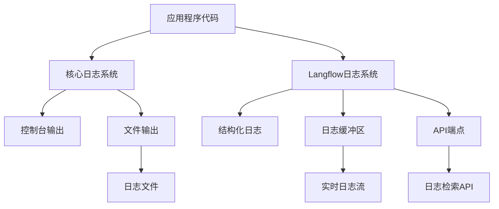
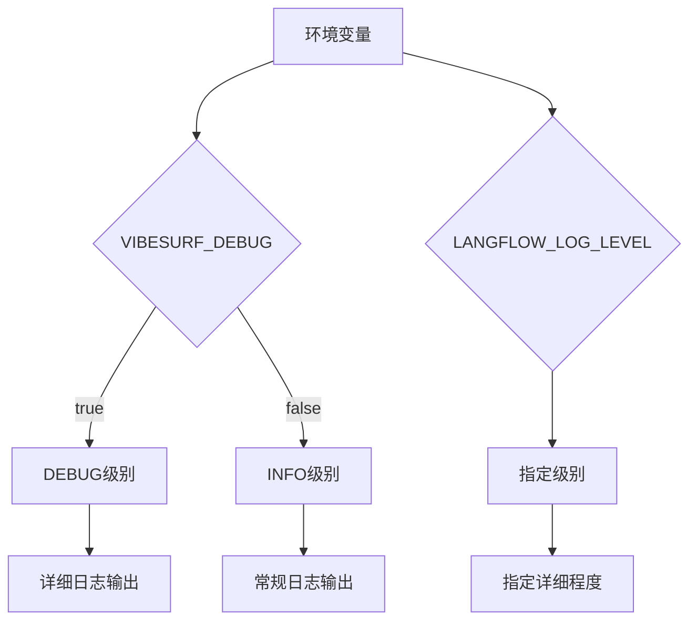
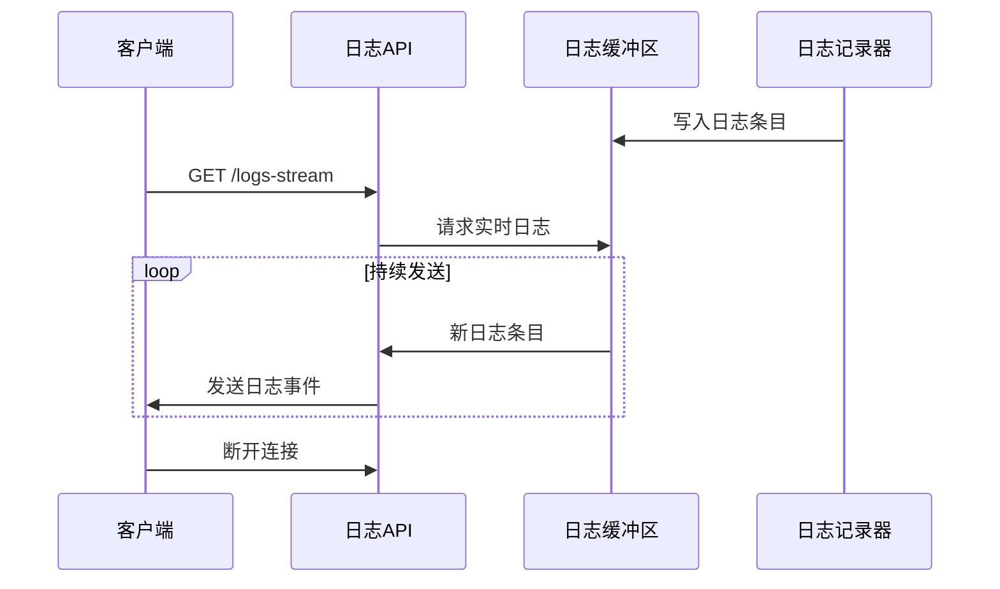
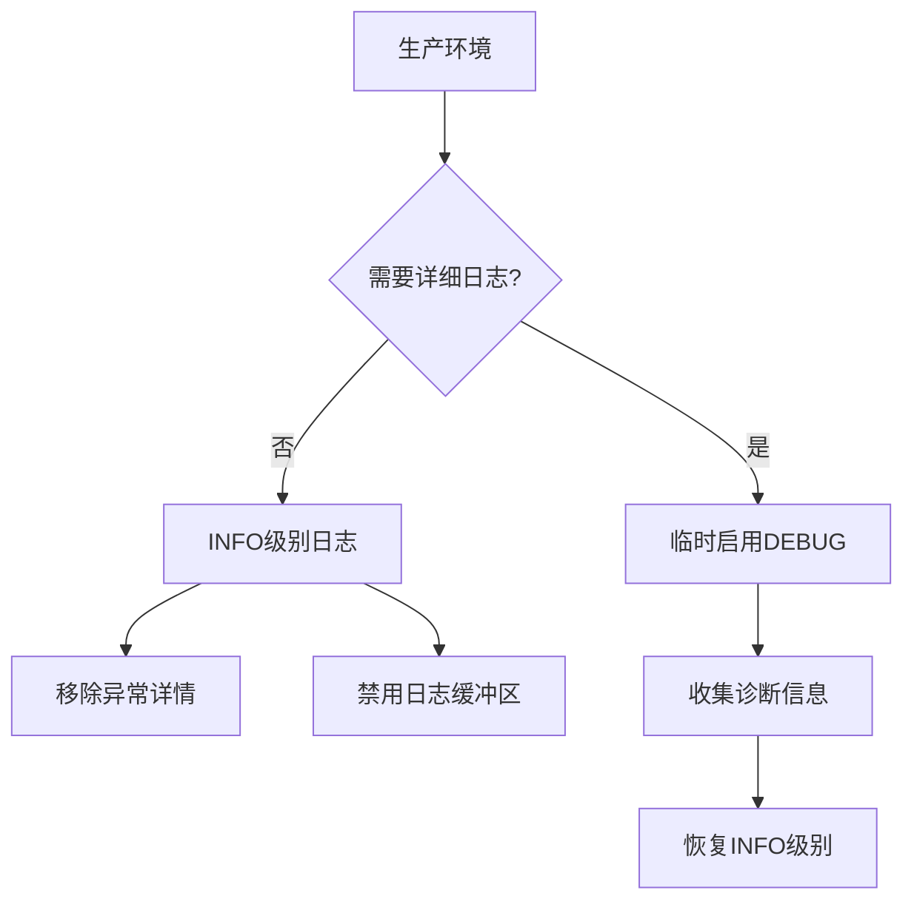

# 日志分析

<cite>
**本文档中引用的文件**  
- [logger.py](file://vibe_surf/logger.py)
- [langflow/logging/logger.py](file://vibe_surf/langflow/logging/logger.py)
- [langflow/logging/setup.py](file://vibe_surf/langflow/logging/setup.py)
- [langflow/api/log_router.py](file://vibe_surf/langflow/api/log_router.py)
- [langflow/schema/log.py](file://vibe_surf/langflow/schema/log.py)
- [backend/main.py](file://vibe_surf/backend/main.py)
- [common.py](file://vibe_surf/common.py)
- [agents/browser_use_agent.py](file://vibe_surf/agents/browser_use_agent.py)
- [.env.example](file://.env.example)
</cite>

## 目录
1. [简介](#简介)
2. [日志系统架构](#日志系统架构)
3. [日志级别配置](#日志级别配置)
4. [日志文件存储与轮转](#日志文件存储与轮转)
5. [日志格式与关键字段](#日志格式与关键字段)
6. [日志追踪与API调用链路](#日志追踪与api调用链路)
7. [日志检索与分析](#日志检索与分析)
8. [调试日志启用](#调试日志启用)
9. [生产环境日志策略](#生产环境日志策略)
10. [实际日志分析案例](#实际日志分析案例)

## 简介

VibeSurf项目采用多层日志系统架构，结合了Python标准库logging模块和structlog库，为开发者提供了灵活的日志记录和分析能力。本文档详细介绍了VibeSurf项目的日志系统架构、配置方法和使用技巧，帮助开发者有效利用日志进行问题诊断和系统监控。

**Section sources**
- [logger.py](file://vibe_surf/logger.py#L1-L99)
- [langflow/logging/logger.py](file://vibe_surf/langflow/logging/logger.py#L1-L408)

## 日志系统架构

VibeSurf项目采用了分层的日志架构设计，主要由两个部分组成：核心日志系统和Langflow集成日志系统。核心日志系统负责VibeSurf主应用的日志记录，而Langflow集成日志系统则处理Langflow组件的日志。

核心日志系统基于Python标准库的logging模块，通过`setup_logger`函数进行配置。该函数根据环境变量`VIBESURF_DEBUG`的值来决定日志级别：当`VIBESURF_DEBUG`为真时，日志级别设置为DEBUG；否则为INFO。日志输出同时写入控制台和文件，文件存储在工作区目录的logs子目录中，文件名包含当前日期（如`log_2024-01-15.log`）。



**Diagram sources**
- [logger.py](file://vibe_surf/logger.py#L12-L82)
- [langflow/logging/logger.py](file://vibe_surf/langflow/logging/logger.py#L203-L363)

**Section sources**
- [logger.py](file://vibe_surf/logger.py#L1-L99)
- [langflow/logging/logger.py](file://vibe_surf/langflow/logging/logger.py#L1-L408)

## 日志级别配置

VibeSurf项目支持多种日志级别，包括DEBUG、INFO、WARNING、ERROR和CRITICAL。日志级别的配置主要通过环境变量实现，提供了灵活的控制方式。

核心日志系统的日志级别由`VIBESURF_DEBUG`环境变量控制。当该变量设置为"true"、"1"、"yes"或"on"时，日志级别为DEBUG；否则为INFO。这种设计使得开发者可以在开发和调试阶段启用详细日志，而在生产环境中保持较低的日志级别以减少性能影响。

Langflow集成日志系统则通过`LANGFLOW_LOG_LEVEL`环境变量来配置日志级别。该变量支持所有标准日志级别，包括"DEBUG"、"INFO"、"WARNING"、"ERROR"和"CRITICAL"。在`backend/main.py`文件中，可以看到日志级别的配置逻辑：当`VIBESURF_DEBUG`为真时，`LANGFLOW_LOG_LEVEL`被设置为"debug"；否则为"info"。



**Diagram sources**
- [logger.py](file://vibe_surf/logger.py#L22-L24)
- [backend/main.py](file://vibe_surf/backend/main.py#L78-L80)

**Section sources**
- [logger.py](file://vibe_surf/logger.py#L22-L24)
- [langflow/logging/logger.py](file://vibe_surf/langflow/logging/logger.py#L215-L231)
- [backend/main.py](file://vibe_surf/backend/main.py#L78-L80)

## 日志文件存储与轮转

VibeSurf项目的日志文件存储位置和轮转策略经过精心设计，以确保日志的可管理性和系统的稳定性。

日志文件存储在工作区目录的logs子目录中。工作区目录的位置可以通过`VIBESURF_WORKSPACE`环境变量指定，如果没有设置，则根据操作系统使用默认位置：Windows系统为`%APPDATA%\VibeSurf`，macOS系统为`~/Library/Application Support/VibeSurf`，Linux系统为`~/.vibesurf`。每个日志文件以日期命名，如`log_2024-01-15.log`，便于按日期组织和管理。

日志文件采用轮转策略，使用`RotatingFileHandler`来管理文件大小。当单个日志文件达到10MB时，会自动创建新的日志文件，并保留最多5个旧的日志文件。这种策略既防止了单个日志文件过大，又保留了足够的历史日志用于问题排查。

```mermaid
flowchart TD
A[日志记录] --> B{文件大小<10MB?}
B --> |是| C[写入当前文件]
B --> |否| D[创建新文件]
D --> E[重命名旧文件]
E --> F[删除最旧文件(如果超过5个)]
F --> G[写入新文件]
C --> H[继续记录]
```

**Diagram sources**
- [logger.py](file://vibe_surf/logger.py#L64-L67)
- [common.py](file://vibe_surf/common.py#L13-L35)

**Section sources**
- [logger.py](file://vibe_surf/logger.py#L52-L72)
- [common.py](file://vibe_surf/common.py#L13-L35)

## 日志格式与关键字段

VibeSurf项目的日志格式根据日志级别和环境而有所不同，提供了丰富的上下文信息。

在DEBUG级别，日志格式包含完整的上下文信息，包括时间戳、日志器名称、日志级别、文件名、行号、函数名和消息内容。具体格式为：
`%(asctime)s - %(name)s - %(levelname)s - %(filename)s:%(lineno)d - %(funcName)s() - %(message)s`

在INFO级别及以上，日志格式简化为：
`%(asctime)s - %(name)s - %(levelname)s - %(message)s`

这种设计在调试时提供详细的调用信息，在生产环境中则保持日志的简洁性。时间戳格式为ISO 8601标准的`YYYY-MM-DD HH:MM:SS`，便于日志的排序和分析。

对于Langflow集成日志系统，日志格式更加结构化，支持JSON和键值对格式。当`LANGFLOW_LOG_ENV`设置为"container"或"container_json"时，日志以JSON格式输出；当设置为"container_csv"时，以键值对格式输出。这种灵活性使得日志可以轻松集成到各种日志收集和分析系统中。

**Section sources**
- [logger.py](file://vibe_surf/logger.py#L35-L44)
- [langflow/logging/logger.py](file://vibe_surf/langflow/logging/logger.py#L270-L290)

## 日志追踪与API调用链路

VibeSurf项目提供了强大的日志追踪功能，能够有效追踪代理执行流程和API调用链路。

系统通过`SizedLogBuffer`类实现了一个内存中的日志缓冲区，用于存储最近的日志条目。这个缓冲区支持按时间戳检索日志，可以获取指定时间点之前或之后的日志条目。缓冲区的大小可以通过`LANGFLOW_LOG_RETRIEVER_BUFFER_SIZE`环境变量配置，为0时表示禁用缓冲区。

为了支持实时日志流，系统提供了`/logs-stream`API端点，使用HTTP/2 Server-Sent Events (SSE)协议。客户端可以通过这个端点建立长连接，实时接收新的日志条目。这对于监控长时间运行的任务特别有用，开发者可以实时观察任务的执行状态。



**Diagram sources**
- [langflow/logging/logger.py](file://vibe_surf/langflow/logging/logger.py#L33-L157)
- [langflow/api/log_router.py](file://vibe_surf/langflow/api/log_router.py#L17-L54)

**Section sources**
- [langflow/logging/logger.py](file://vibe_surf/langflow/logging/logger.py#L33-L157)
- [langflow/api/log_router.py](file://vibe_surf/langflow/api/log_router.py#L17-L54)

## 日志检索与分析

VibeSurf项目提供了多种日志检索和分析方法，帮助开发者快速定位关键错误信息。

除了实时日志流，系统还提供了`/logs`API端点，支持按条件检索历史日志。通过这个端点，可以获取指定时间点之前或之后的日志条目，或者获取最近的N条日志。查询参数包括`lines_before`、`lines_after`和`timestamp`，使得日志检索非常灵活。

在命令行环境下，可以使用`grep`和正则表达式快速定位关键错误信息。例如，要查找所有ERROR级别的日志，可以使用命令：
```bash
grep " - ERROR - " log_2024-01-15.log
```

要查找特定模块的日志，可以使用：
```bash
grep "browser_use_agent" log_2024-01-15.log
```

对于更复杂的查询，可以结合使用多个`grep`命令和正则表达式。例如，查找包含"Failed"或"Error"的ERROR级别日志：
```bash
grep " - ERROR - " log_2024-01-15.log | grep -E "Failed|Error"
```

**Section sources**
- [langflow/api/log_router.py](file://vibe_surf/langflow/api/log_router.py#L73-L104)

## 调试日志启用

在诊断复杂问题时，启用详细的调试日志是非常重要的。VibeSurf项目提供了多种方式来启用调试日志。

最简单的方法是设置`VIBESURF_DEBUG`环境变量为"true"。这将同时启用核心日志系统和Langflow集成日志系统的DEBUG级别日志。在开发环境中，可以在启动应用前设置这个变量：
```bash
export VIBESURF_DEBUG=true
python backend/main.py
```

对于更精细的控制，可以单独设置`LANGFLOW_LOG_LEVEL`环境变量为"debug"，只启用Langflow组件的调试日志。这种方法适用于只想深入了解Langflow组件行为而不增加核心系统日志量的场景。

在代码中，可以通过`get_logger`函数获取日志记录器实例，并使用不同的日志级别方法记录信息。例如：
```python
self.logger.debug('等待操作间的时间间隔')
self.logger.info('开始浏览器使用版本2')
self.logger.warning('Qwen不支持视觉输入')
self.logger.error('执行操作失败')
```

这些不同级别的日志记录有助于在不同详细程度上理解系统的运行状态。

**Section sources**
- [logger.py](file://vibe_surf/logger.py#L85-L95)
- [agents/browser_use_agent.py](file://vibe_surf/agents/browser_use_agent.py#L273-L277)

## 生产环境日志策略

在生产环境中，需要平衡日志详细程度和性能影响。VibeSurf项目为此提供了合理的默认策略和配置选项。

默认情况下，生产环境的日志级别为INFO，只记录重要的状态信息和警告。这减少了日志文件的大小和I/O开销，同时仍能提供足够的信息来监控系统健康状况。

对于异常处理，系统在生产环境中会自动移除详细的异常信息，只记录异常类型和简要信息。这是通过`remove_exception_in_production`处理器实现的，当`DEV`环境变量为false时，会从日志条目中移除`exception`和`exc_info`字段。

为了进一步减少性能影响，可以禁用日志缓冲区和实时日志流功能。通过将`LANGFLOW_LOG_RETRIEVER_BUFFER_SIZE`设置为0，可以禁用内存中的日志缓冲区，节省内存资源。



**Diagram sources**
- [langflow/logging/logger.py](file://vibe_surf/langflow/logging/logger.py#L177-L182)
- [settings.py](file://vibe_surf/langflow/settings.py#L3-L4)

**Section sources**
- [langflow/logging/logger.py](file://vibe_surf/langflow/logging/logger.py#L177-L182)
- [settings.py](file://vibe_surf/langflow/settings.py#L3-L4)

## 实际日志分析案例

本节提供两个实际的日志分析案例，展示如何利用VibeSurf的日志系统诊断复杂问题。

### 浏览器自动化失败分析

当浏览器自动化任务失败时，可以通过分析日志来定位问题。首先，查找ERROR级别的日志条目：
```bash
grep " - ERROR - " logs/log_2024-01-15.log
```

在`browser_use_agent.py`中，可以看到错误处理代码：
```python
self.logger.error(f'❌ Executing action {i + 1} failed -> {type(e).__name__}: {e}')
```

这条日志记录了执行第i+1个操作失败的具体异常类型和消息。通过分析这些信息，可以确定是网络问题、元素定位失败还是其他原因导致的失败。

### LLM调用超时分析

对于LLM调用超时问题，可以结合使用多个日志查询：
```bash
# 查找所有与LLM相关的日志
grep "LLM" logs/log_2024-01-15.log

# 查找超时相关的错误
grep -i "timeout" logs/log_2024-01-15.log

# 查找网络请求相关的日志
grep "http" logs/log_2024-01-15.log | grep -i "request\|response"
```

在调试模式下，还可以查看详细的请求和响应信息，包括请求URL、请求头、请求体和响应状态码，这些信息对于诊断超时问题非常有帮助。

**Section sources**
- [agents/browser_use_agent.py](file://vibe_surf/agents/browser_use_agent.py#L554)
- [.env.example](file://.env.example#L36-L37)