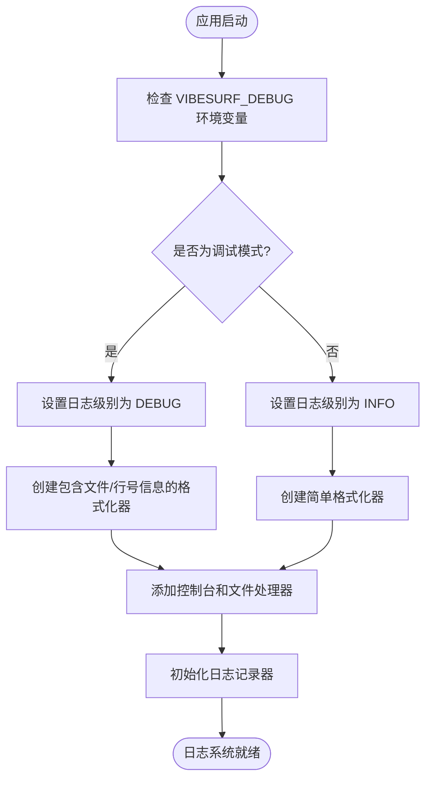
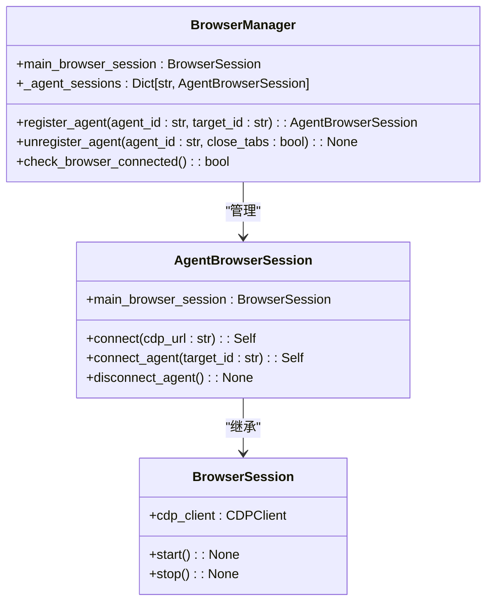
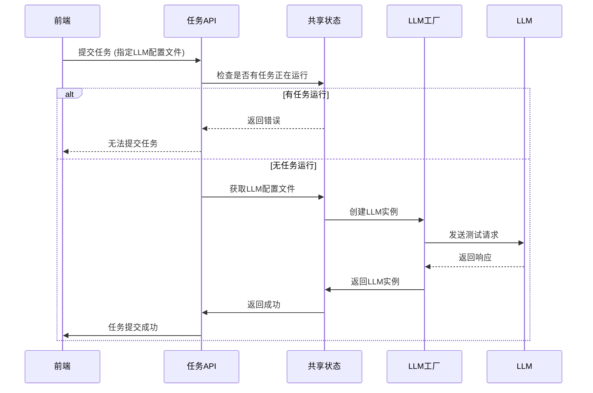
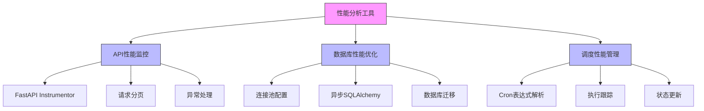

# 调试技巧

<cite>
**本文档引用的文件**   
- [logger.py](file://vibe_surf/logger.py)
- [main.py](file://vibe_surf/backend/main.py)
- [agent_browser_session.py](file://vibe_surf/browser/agent_browser_session.py)
- [llm_factory.py](file://vibe_surf/backend/utils/llm_factory.py)
- [shared_state.py](file://vibe_surf/backend/shared_state.py)
- [database/manager.py](file://vibe_surf/backend/database/manager.py)
- [api/task.py](file://vibe_surf/backend/api/task.py)
- [browser/browser_manager.py](file://vibe_surf/browser/browser_manager.py)
- [utils/utils.py](file://vibe_surf/backend/utils/utils.py)
</cite>

## 目录
1. [日志系统使用](#日志系统使用)
2. [浏览器自动化调试](#浏览器自动化调试)
3. [LLM调用调试](#llm调用调试)
4. [性能分析工具](#性能分析工具)
5. [常见问题排查](#常见问题排查)
6. [调试环境设置](#调试环境设置)

## 日志系统使用

VibeSurf项目采用Python内置的`logging`模块进行日志管理，提供了灵活的日志级别配置和多目标输出功能。日志系统通过`vibe_surf/logger.py`文件进行配置，支持控制台和文件两种输出方式。

日志级别由环境变量`VIBESURF_DEBUG`控制。当该变量设置为`true`、`1`、`yes`或`on`时，日志级别为`DEBUG`，会输出详细的调试信息，包括文件名、行号和函数名；否则日志级别为`INFO`，仅输出基本的运行信息。

日志文件存储在工作空间目录下的`logs`文件夹中，文件名格式为`log_YYYY-MM-DD.log`。系统使用`RotatingFileHandler`来管理日志文件大小，单个日志文件最大为10MB，最多保留5个备份文件，防止日志文件无限增长。

**Diagram sources**
- [logger.py](file://vibe_surf/logger.py#L1-L99)

**Section sources**
- [logger.py](file://vibe_surf/logger.py#L1-L99)

## 浏览器自动化调试

VibeSurf的浏览器自动化功能基于`browser_use`库实现，通过Chrome DevTools Protocol (CDP)与浏览器进行通信。调试浏览器自动化问题时，需要重点关注浏览器会话的生命周期管理和CDP连接状态。

`AgentBrowserSession`类负责管理与浏览器的连接。在`connect`方法中，系统会尝试连接到指定的CDP URL。如果连接失败，会抛出`RuntimeError`异常，导致浏览器无法使用。系统会自动检测浏览器连接状态，如果发现连接中断，会触发优雅的关闭流程。

浏览器管理器`BrowserManager`负责为不同代理（agent）分配独立的浏览器会话。每个代理都有自己的`AgentBrowserSession`实例，但共享同一个主浏览器会话。这种设计既保证了代理间的隔离性，又提高了资源利用率。

**Diagram sources**
- [browser_manager.py](file://vibe_surf/browser/browser_manager.py#L24-L186)
- [agent_browser_session.py](file://vibe_surf/browser/agent_browser_session.py#L51-L169)

**Section sources**
- [browser_manager.py](file://vibe_surf/browser/browser_manager.py#L1-L269)
- [agent_browser_session.py](file://vibe_surf/browser/agent_browser_session.py#L1-L800)

## LLM调用调试

LLM调用调试主要涉及LLM配置的验证、连接测试和响应分析。VibeSurf通过`llm_factory.py`文件中的`create_llm_from_profile`函数根据配置文件创建LLM实例。

在提交任务时，系统会先检查是否有任务正在运行。如果没有，则会获取指定的LLM配置文件，并测试LLM连接。测试方法是向LLM发送一个简单的问题（"法国的首都是什么？"），并检查响应是否包含预期答案"巴黎"。这确保了LLM API连接是有效的。

LLM配置支持多种提供商，包括OpenAI、Anthropic、Google、Azure OpenAI等。每种提供商支持的参数不同，系统会根据提供商类型选择性地传递参数。例如，Ollama不支持`max_tokens`参数，而OpenAI兼容接口则支持。

**Diagram sources**
- [api/task.py](file://vibe_surf/backend/api/task.py#L43-L146)
- [utils/llm_factory.py](file://vibe_surf/backend/utils/llm_factory.py#L23-L215)

**Section sources**
- [api/task.py](file://vibe_surf/backend/api/task.py#L1-L379)
- [utils/llm_factory.py](file://vibe_surf/backend/utils/llm_factory.py#L1-L275)

## 性能分析工具

VibeSurf项目集成了多种性能分析工具，用于监控和优化系统性能。后端API使用`FastAPI`框架，并通过`add_pagination`和`FastAPIInstrumentor`进行性能监控和分页支持。

数据库性能优化方面，系统使用`SQLAlchemy`的异步引擎，并根据数据库类型配置不同的连接池。对于SQLite数据库，使用`StaticPool`以避免线程问题；对于生产环境的PostgreSQL或MySQL，配置了大小为20的连接池和30的溢出连接。

系统还实现了基于`croniter`的调度管理器，可以定期执行工作流。调度器会定期检查数据库中的调度表，查找需要执行的任务，并启动相应的执行流程。

**Diagram sources**
- [main.py](file://vibe_surf/backend/main.py#L544-L730)
- [database/manager.py](file://vibe_surf/backend/database/manager.py#L148-L279)
- [shared_state.py](file://vibe_surf/backend/shared_state.py#L740-L768)

**Section sources**
- [main.py](file://vibe_surf/backend/main.py#L1-L794)
- [database/manager.py](file://vibe_surf/backend/database/manager.py#L1-L319)
- [shared_state.py](file://vibe_surf/backend/shared_state.py#L1-L1111)

## 常见问题排查

### 浏览器会话超时
当浏览器会话超时或连接中断时，系统会通过`monitor_browser_connection`后台任务检测到。该任务每2秒检查一次浏览器连接状态，如果发现连接不可用，会记录错误日志并触发优雅的关闭流程。

排查步骤：
1. 检查`logs`目录下的日志文件，查找"Browser monitor task cancelled"或"Browser stopped"相关日志
2. 验证浏览器执行路径和用户数据目录的环境变量是否正确设置
3. 确认Chrome浏览器扩展已正确加载并固定到工具栏
4. 检查系统代理设置是否影响浏览器连接

### LLM响应延迟
LLM响应延迟可能由多种原因引起，包括网络问题、API速率限制或LLM提供商的性能问题。

排查步骤：
1. 检查LLM配置文件中的API密钥是否正确
2. 验证LLM提供商的API状态页面，确认服务是否正常
3. 检查网络连接，特别是当使用自定义`base_url`时
4. 在日志中查找LLM调用的详细信息，包括请求和响应时间

### 工作流执行失败
工作流执行失败通常与任务状态管理或依赖服务有关。

排查步骤：
1. 检查是否有其他任务正在运行，VibeSurf一次只允许一个任务执行
2. 验证MCP服务器配置是否正确，特别是`mcp_server_config`参数
3. 检查数据库连接是否正常，特别是`vibe_surf.db`文件的权限
4. 查看任务执行日志，定位具体的失败原因

**Section sources**
- [main.py](file://vibe_surf/backend/main.py#L103-L148)
- [shared_state.py](file://vibe_surf/backend/shared_state.py#L118-L233)
- [api/task.py](file://vibe_surf/backend/api/task.py#L54-L66)

## 调试环境设置

### 断点调试配置
VibeSurf项目在多个关键位置使用了`pdb`（Python调试器）断点，便于开发者进行交互式调试。主要断点位置包括：
- `backend/main.py`：后端应用启动入口
- `browser/agent_browser_session.py`：浏览器会话连接过程
- `backend/shared_state.py`：组件初始化过程

要启用断点调试，只需在代码执行到`import pdb; pdb.set_trace()`语句时，程序会暂停并进入交互式调试模式。此时可以检查变量值、执行代码行或设置新的断点。

### 实时日志监控
为了实时监控系统运行状态，建议使用以下方法：
1. 设置`VIBESURF_DEBUG=true`环境变量以启用DEBUG日志级别
2. 使用`tail -f`命令实时查看日志文件：`tail -f workspace_dir/logs/log_YYYY-MM-DD.log`
3. 在代码中添加临时日志语句，使用`logger.debug()`输出关键变量的值
4. 利用系统提供的`/api/status`端点监控系统状态

**Section sources**
- [main.py](file://vibe_surf/backend/main.py#L8-L9)
- [agent_browser_session.py](file://vibe_surf/browser/agent_browser_session.py#L5-L6)
- [shared_state.py](file://vibe_surf/backend/shared_state.py#L7-L8)
- [utils.py](file://vibe_surf/backend/utils/utils.py#L1-L2)