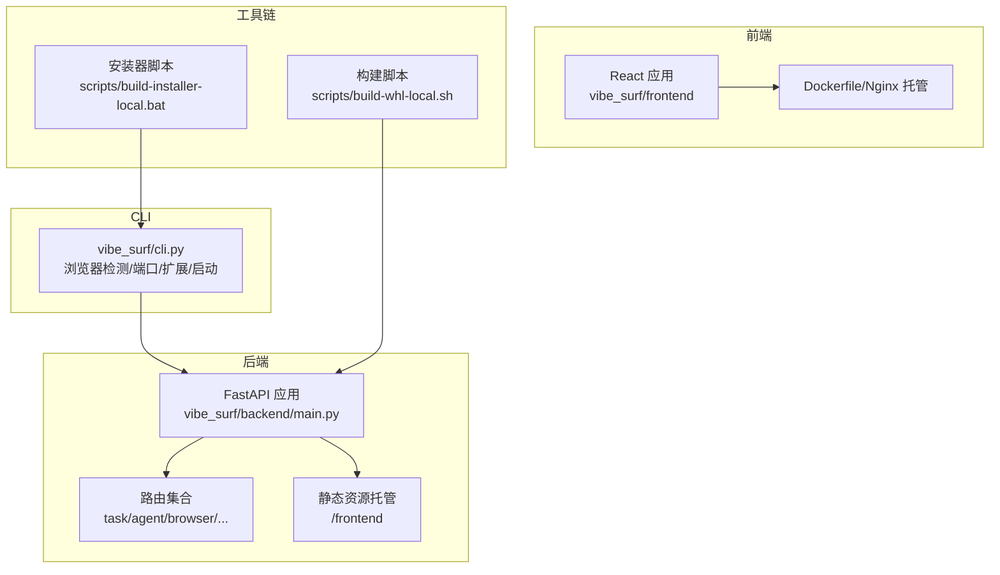
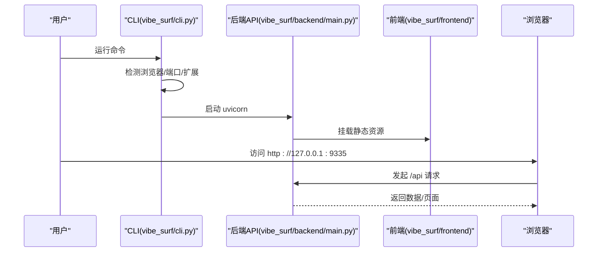

# 快速开始

<cite>
**本文引用的文件**
- [README.md](file://README.md)
- [pyproject.toml](file://pyproject.toml)
- [.env.example](file://.env.example)
- [vibe_surf/backend/main.py](file://vibe_surf/backend/main.py)
- [vibe_surf/cli.py](file://vibe_surf/cli.py)
- [vibe_surf/frontend/Dockerfile](file://vibe_surf/frontend/Dockerfile)
- [vibe_surf/frontend/package.json](file://vibe_surf/frontend/package.json)
- [scripts/build-whl-local.sh](file://scripts/build-whl-local.sh)
- [scripts/build-installer-local.bat](file://scripts/build-installer-local.bat)
- [docs/EXECUTABLE_BUILD.md](file://docs/EXECUTABLE_BUILD.md)
- [docs/PYPI_SETUP.md](file://docs/PYPI_SETUP.md)
- [tests/test_backend_api.py](file://tests/test_backend_api.py)
</cite>

## 目录
1. [简介](#简介)
2. [项目结构](#项目结构)
3. [核心组件](#核心组件)
4. [架构总览](#架构总览)
5. [详细组件分析](#详细组件分析)
6. [依赖关系分析](#依赖关系分析)
7. [性能与端口配置](#性能与端口配置)
8. [安装与部署指南](#安装与部署指南)
9. [环境配置与.env 参数](#.env-参数配置)
10. [启动服务与访问](#启动服务与访问)
11. [基础使用示例](#基础使用示例)
12. [常见问题与排错](#常见问题与排错)
13. [结论](#结论)
14. [附录：高级配置与运维](#附录高级配置与运维)

## 简介
本指南面向首次接触 VibeSurf 的用户，帮助你在 Windows、macOS、Linux 上快速完成安装、配置与启动，并通过 CLI 或 Web 界面进行基础使用。你将学会：
- 使用 pip 安装或从源码构建
- 配置 .env 关键参数
- 启动后端服务并通过浏览器访问 Web 界面
- 创建第一个任务、配置 LLM 代理与执行简单操作
- 处理常见问题（端口占用、依赖安装失败等）

## 项目结构
VibeSurf 采用前后端分离架构：
- 后端：基于 FastAPI 的 API 服务，默认监听本地端口，提供任务、浏览器、语音、配置等接口
- 前端：React 应用，打包后由后端静态资源托管
- CLI：统一入口，负责浏览器检测、端口选择、扩展路径配置与后端启动
- 工具脚本：提供本地构建 wheel、打包可执行文件、生成安装器等能力

图表来源
- [vibe_surf/backend/main.py](file://vibe_surf/backend/main.py#L543-L750)
- [vibe_surf/cli.py](file://vibe_surf/cli.py#L442-L562)
- [vibe_surf/frontend/Dockerfile](file://vibe_surf/frontend/Dockerfile#L1-L16)
- [scripts/build-whl-local.sh](file://scripts/build-whl-local.sh#L1-L215)
- [scripts/build-installer-local.bat](file://scripts/build-installer-local.bat#L1-L136)

章节来源
- [README.md](file://README.md#L38-L136)
- [pyproject.toml](file://pyproject.toml#L1-L120)

## 核心组件
- 后端 API（FastAPI）
  - 负责健康检查、会话管理、任务状态查询、Langflow 集成、CORS 中间件、静态资源托管等
  - 默认端口 9335，可通过命令行参数或环境变量覆盖
- CLI（命令行入口）
  - 自动检测浏览器（Chrome/Edge/Brave），自动选择可用端口，加载扩展路径，启动后端
- 前端（React）
  - 提供可视化界面，与后端 API 交互；支持 Docker+Nginx 托管
- 构建与分发
  - 本地 wheel 构建、可执行文件打包、Windows 安装器生成

章节来源
- [vibe_surf/backend/main.py](file://vibe_surf/backend/main.py#L543-L750)
- [vibe_surf/cli.py](file://vibe_surf/cli.py#L196-L398)
- [vibe_surf/frontend/Dockerfile](file://vibe_surf/frontend/Dockerfile#L1-L16)
- [scripts/build-whl-local.sh](file://scripts/build-whl-local.sh#L1-L215)
- [scripts/build-installer-local.bat](file://scripts/build-installer-local.bat#L1-L136)

## 架构总览
后端通过 uvicorn 运行，CLI 负责启动与环境准备；前端静态资源由后端托管，或在 Docker 中由 Nginx 提供。

图表来源
- [vibe_surf/cli.py](file://vibe_surf/cli.py#L374-L401)
- [vibe_surf/backend/main.py](file://vibe_surf/backend/main.py#L543-L750)

## 详细组件分析

### 后端 API 组件
- 生命周期管理：启动时初始化 Langflow、浏览器监控、计划任务；关闭时优雅清理
- 路由组织：按功能模块划分（任务、文件、活动、配置、浏览器、语音、代理、Composio、调度、系统）
- 静态资源：若存在前端构建目录，则挂载为静态站点
- 健康检查与状态：提供 /health 与 /api/status 接口

章节来源
- [vibe_surf/backend/main.py](file://vibe_surf/backend/main.py#L327-L483)
- [vibe_surf/backend/main.py](file://vibe_surf/backend/main.py#L543-L750)

### CLI 组件
- 浏览器检测：优先查找 Chrome/Edge/Brave，支持自定义路径
- 端口配置：默认 9335，若被占用则自动寻找下一个可用端口
- 扩展路径：优先使用环境变量，否则使用内置扩展目录
- 后端启动：调用 uvicorn 在本地启动 FastAPI 应用

章节来源
- [vibe_surf/cli.py](file://vibe_surf/cli.py#L196-L398)

### 前端与 Docker
- 前端使用 Vite 构建，Dockerfile 将构建产物复制到 Nginx 提供静态服务
- 可通过 BACKEND_URL 注入后端地址

章节来源
- [vibe_surf/frontend/Dockerfile](file://vibe_surf/frontend/Dockerfile#L1-L16)
- [vibe_surf/frontend/package.json](file://vibe_surf/frontend/package.json#L1-L152)

### 构建与分发
- 本地 wheel 构建：自动构建前端、更新扩展版本号、打包 wheel 并校验
- 可执行文件打包：参考可执行构建指南
- Windows 安装器：使用 NSIS 生成安装包

章节来源
- [scripts/build-whl-local.sh](file://scripts/build-whl-local.sh#L1-L215)
- [docs/EXECUTABLE_BUILD.md](file://docs/EXECUTABLE_BUILD.md#L1-L197)
- [scripts/build-installer-local.bat](file://scripts/build-installer-local.bat#L1-L136)

## 依赖关系分析
- Python 版本要求：>=3.11（推荐 3.12）
- 关键依赖：FastAPI、uvicorn、browser-use、langgraph、langflow、pydantic、sqlmodel、aiohttp、websockets 等
- CLI 依赖 rich，用于美化输出
- 前端依赖 Playwright、React 生态等

章节来源
- [pyproject.toml](file://pyproject.toml#L1-L120)
- [vibe_surf/frontend/package.json](file://vibe_surf/frontend/package.json#L1-L152)

## 性能与端口配置
- 默认端口：9335
- 端口占用处理：CLI 会自动寻找下一个可用端口
- Docker 环境优化：可通过环境变量 IN_DOCKER 控制浏览器运行模式

章节来源
- [vibe_surf/backend/main.py](file://vibe_surf/backend/main.py#L752-L794)
- [vibe_surf/cli.py](file://vibe_surf/cli.py#L196-L215)
- [.env.example](file://.env.example#L42-L44)

## 安装与部署指南

### 方式一：使用 pip 安装（推荐）
- 安装 uv 包管理器（跨平台）
- 安装 VibeSurf
- 启动服务

章节来源
- [README.md](file://README.md#L38-L71)

### 方式二：从源码构建（开发/贡献者）
- 克隆仓库并创建虚拟环境
- 开发模式安装
- 如需前端改动，先构建并复制到后端目录

章节来源
- [README.md](file://README.md#L83-L125)

### 方式三：Docker 部署（可选）
- 前端使用 Nginx 托管，后端通过环境变量注入后端地址
- 可直接使用 Dockerfile 构建镜像

章节来源
- [vibe_surf/frontend/Dockerfile](file://vibe_surf/frontend/Dockerfile#L1-L16)

### 方式四：本地 wheel 与安装器（高级）
- 本地构建 wheel 并验证
- 生成 Windows 安装器（NSIS）

章节来源
- [scripts/build-whl-local.sh](file://scripts/build-whl-local.sh#L1-L215)
- [scripts/build-installer-local.bat](file://scripts/build-installer-local.bat#L1-L136)
- [docs/EXECUTABLE_BUILD.md](file://docs/EXECUTABLE_BUILD.md#L1-L197)

## .env 参数配置
以下为常用关键参数（可在 .env 文件中设置）：
- LLM 服务端点与密钥：OPENAI_ENDPOINT、OPENAI_API_KEY、ANTHROPIC_ENDPOINT、ANTHROPIC_API_KEY、GOOGLE_API_KEY、AZURE_OPENAI_*、DASHSCOPE_*、MISTRAL_*、DEEPSEEK_*、MOONSHOT_*、UNBOUND_*、SiliconFLOW_* 等
- 日志与遥测：BROWSER_USE_LOGGING_LEVEL、ANONYMIZED_TELEMETRY、VIBESURF_ANONYMIZED_TELEMETRY
- 运行时控制：IN_DOCKER、VIBESURF_BACKEND_PORT、VIBESURF_EXTENSION、VIBESURF_WORKSPACE、VIBESURF_DATABASE_URL、VIBESURF_DEBUG
- 浏览器执行路径与用户数据：BROWSER_EXECUTION_PATH、BROWSER_USER_DATA
- 第三方集成：COMPOSIO_API_KEY

章节来源
- [.env.example](file://.env.example#L1-L55)

## 启动服务与访问

### 通过 CLI 启动
- 运行命令：uv run vibesurf
- CLI 将自动：
  - 检测浏览器（Chrome/Edge/Brave），支持交互选择或自动选择
  - 选择端口（默认 9335，若被占用则自动寻找下一个）
  - 加载扩展路径（优先环境变量，否则使用内置扩展）
  - 启动后端服务

章节来源
- [README.md](file://README.md#L64-L71)
- [vibe_surf/cli.py](file://vibe_surf/cli.py#L442-L562)

### 通过 uvicorn 直接启动后端
- 命令：uvicorn vibe_surf.backend.main:app --host 127.0.0.1 --port 9335
- 适合调试或后端-only 场景

章节来源
- [README.md](file://README.md#L126-L135)
- [vibe_surf/backend/main.py](file://vibe_surf/backend/main.py#L752-L794)

### 访问 Web 界面
- 默认访问地址：http://127.0.0.1:9335
- 若端口被占用，CLI 会自动切换到下一个可用端口

章节来源
- [vibe_surf/cli.py](file://vibe_surf/cli.py#L314-L339)
- [vibe_surf/backend/main.py](file://vibe_surf/backend/main.py#L752-L794)

## 基础使用示例

### 示例一：创建第一个任务
- 步骤概览
  - 启动后端（CLI 或 uvicorn）
  - 在浏览器打开 http://127.0.0.1:9335
  - 在界面中新建任务，选择合适的 LLM 配置
  - 观察任务状态与日志输出
- 参考接口
  - 健康检查：GET /health
  - 系统状态：GET /api/status

章节来源
- [tests/test_backend_api.py](file://tests/test_backend_api.py#L98-L113)
- [tests/test_backend_api.py](file://tests/test_backend_api.py#L115-L200)
- [vibe_surf/backend/main.py](file://vibe_surf/backend/main.py#L649-L694)

### 示例二：配置 LLM 代理
- 在 Web 界面“设置/配置”中添加 LLM 配置（如 OpenAI、Anthropic、Azure 等）
- 设置 API Key 与模型参数
- 设为默认配置后，任务将自动使用该配置

章节来源
- [.env.example](file://.env.example#L1-L33)
- [tests/test_backend_api.py](file://tests/test_backend_api.py#L115-L200)

### 示例三：执行简单操作
- 在任务中输入简单指令（如搜索、抓取、总结等）
- 查看任务执行结果与日志
- 如需代理集成，可在“集成/Composio”中配置第三方应用

章节来源
- [README.md](file://README.md#L12-L37)

## 常见问题与排错

### 端口冲突
- 现象：端口 9335 被占用
- 解决：CLI 会自动寻找下一个可用端口；也可手动设置环境变量 VIBESURF_BACKEND_PORT
- 参考：CLI 端口检测逻辑

章节来源
- [vibe_surf/cli.py](file://vibe_surf/cli.py#L196-L215)
- [vibe_surf/cli.py](file://vibe_surf/cli.py#L314-L339)

### 依赖安装失败
- 现象：安装依赖时报错
- 解决：确保已安装 uv；在 Linux/macOS 上使用官方安装脚本；Windows 使用 PowerShell 安装 uv
- 参考：README 安装步骤

章节来源
- [README.md](file://README.md#L42-L63)

### 浏览器未找到
- 现象：CLI 无法检测到 Chrome/Edge/Brave
- 解决：交互选择或传入 --no_select_browser 使用自动检测；或手动指定 BROWSER_EXECUTION_PATH
- 参考：CLI 浏览器检测逻辑

章节来源
- [vibe_surf/cli.py](file://vibe_surf/cli.py#L294-L312)
- [vibe_surf/cli.py](file://vibe_surf/cli.py#L403-L441)

### 扩展加载问题（Chrome 142+）
- 现象：无法自动加载扩展
- 解决：手动下载扩展并加载“解包的扩展程序”
- 参考：README 手动加载扩展说明

章节来源
- [README.md](file://README.md#L71-L77)

### Docker 环境运行
- 现象：浏览器无法连接或扩展异常
- 解决：设置 IN_DOCKER=true，以启用 Docker 优化模式
- 参考：.env 示例

章节来源
- [.env.example](file://.env.example#L42-L44)

### 前端静态资源未显示
- 现象：访问 404 或空白页面
- 解决：确认已构建前端并将 build 目录复制到后端 frontend 目录；或使用 Docker/Nginx 托管
- 参考：README 前端构建说明

章节来源
- [README.md](file://README.md#L108-L125)
- [vibe_surf/frontend/Dockerfile](file://vibe_surf/frontend/Dockerfile#L1-L16)

## 结论
通过本快速开始指南，你已经完成了 VibeSurf 的安装、环境配置与启动，并了解了基本使用流程。建议进一步探索：
- 在 Web 界面中创建复杂工作流
- 配置多 LLM 代理与第三方集成
- 使用 Docker 或可执行文件进行生产部署

## 附录：高级配置与运维

### 高级端口与网络
- 通过命令行参数或环境变量自定义端口
- 在容器编排中暴露端口并配置反向代理

章节来源
- [vibe_surf/backend/main.py](file://vibe_surf/backend/main.py#L752-L794)
- [vibe_surf/cli.py](file://vibe_surf/cli.py#L314-L339)

### 遥测与日志
- 可通过 ANONYMIZED_TELEMETRY/VIBESURF_ANONYMIZED_TELEMETRY 控制匿名遥测
- 日志级别通过 BROWSER_USE_LOGGING_LEVEL 控制

章节来源
- [.env.example](file://.env.example#L33-L41)

### 自动化发布与版本管理
- 使用 setuptools-scm 动态版本管理
- GitHub Actions 自动构建与发布至 PyPI

章节来源
- [docs/PYPI_SETUP.md](file://docs/PYPI_SETUP.md#L1-L197)
- [pyproject.toml](file://pyproject.toml#L277-L282)